<u>BỘ Y TẾ</u>

**CỘNG HOÀ XÃ HỘI CHỦ NGHĨA VIỆT NAM**
<u>Độc lập - Tự do - Hạnh phúc</u>

Số:4416QĐ-BYT

Hà Nội, ngày 06 tháng 12 năm 2023

# **QUYẾT ĐỊNH**
**Về việc ban hành tài liệu chuyên môn**
<u>"Hướng dẫn Chẩn đoán và điều trị các bệnh Da liễu"</u>

## **BỘ TRƯỞNG BỘ Y TẾ**

*Căn cứ Luật Khám bệnh, chữa bệnh năm 2009;*

*Căn cứ Nghị định số 95/2022/NĐ-CP ngày 15 tháng 11 năm 2022 của Chính phủ quy định chức năng, nhiệm vụ, quyền hạn và cơ cấu tổ chức của Bộ Y tế;*

Theo đề nghị của Cục trưởng Cục Quản lý khám, chữa bệnh.

# **QUYẾT ĐỊNH:**

****Điều 1.**** Ban hành kèm theo Quyết định này tài liệu chuyên môn "Hướng dẫn Chẩn đoán và điều trị các bệnh Da liễu".

****Điều 2.**** Tài liệu chuyên môn "Hướng dẫn chẩn đoán và điều trị các bệnh Da liễu" được áp dụng tại các cơ sở khám bệnh, chữa bệnh.

Căn cứ vào tài liệu này và điều kiện cụ thể của đơn vị, Giám đốc cơ sở khám bệnh, chữa bệnh xây dựng và ban hành tài liệu hướng dẫn chẩn đoán và điều trị các bệnh da liễu phù hợp để thực hiện tại đơn vị.

****Điều 3.**** Quyết định này có hiệu lực kể từ ngày ký, ban hành.

****Điều 4.**** Các ông, bà: Chánh Văn phòng Bộ, Chánh thanh tra Bộ, Cục trưởng và Vụ trưởng các Cục, Vụ thuộc Bộ Y tế, Giám đốc Sở Y tế các Tỉnh, Thành phố trực thuộc Trung ương, Giám đốc các Bệnh viện trực thuộc Bộ Y tế, Thủ trưởng Y tế các ngành chịu trách nhiệm thi hành Quyết định này./. [signature]

----

***Nơi nhận:***
- Như Điều 4;
- Bộ trưởng (đề b/c);
- Các Thứ trưởng;
- Công thông tin điện tử Bộ Y tế; Website Cục KCB;
- Lưu: VT, KCB.

**KT. BỘ TRƯỞNG**
**THỨ TRƯỞNG**
[signature]

****Trần Văn Thuận****


2

# **BỘ Y TẾ**

# **HƯỚNG DẪN**
# **CHẨN ĐOÁN VÀ ĐIỀU TRỊ**
# **CÁC BỆNH DA LIỄU**

*(Ban hành kèm theo Quyết định số 4416 ngày 06 tháng 12 năm 2023)*


3

# MỤC LỤC

**Chương 1: BỆNH DA NHIỄM KHUẨN** 8
- BỆNH CHỐC 9
- NHỌT, ÁP XE DA 13
- VIÊM NANG LÔNG 17
- HỘI CHỨNG BONG VÂY DA DO TỰ CẦU 21
- BỆNH LAO DA 25
- BỆNH PHONG 33
- PHẢN ỨNG PHONG 44
- PHẢN ỨNG PHONG LOẠI 1 45
- PHẢN ỨNG PHONG LOẠI 2 55

**Chương 2: BỆNH DA DO NẤM – KÝ SINH TRÙNG** 65
- BỆNH GHỀ 66
- VIÊM DA DO DEMODEX 70
- BỆNH LANG BEN 73
- BỆNH DA DO NẤM SƠI 77
- BỆNH DA VÀ NIÊM MẠC DO CANDIDA 81
- VIÊM ÂM HỘ - ÂM ĐẠO DO NẤM CANDIDA 85
- NẤM DA ĐẦU, NẤM RẤU, NẤM TÓC 88
- NẤM MÓNG 92

**Chương 3: BỆNH DA DO VIRUS** 96
- BỆNH ZONA 97
- BỆNH DO HERPES SIMPLEX 104
- BỆNH THỦY ĐẦU 108
- BỆNH HẠT CƠM 111
- U MỀM LÂY 115

**Chương 4: BỆNH DA TỰ MIỄN** 117
- BỆNH LUPUS BAN ĐỎ HỆ THỐNG 118
- VIÊM DA CƠ 130
- BỆNH XÓ CỨNG BỊ HỆ THỐNG 139
- HỘI CHỨNG TRÙNG LẬP 148
- BỆNH PEMPHIGUS 157
- PEMPHIGOID BỌNG NƯỚC 165
- VIÊM DA DẠNG HERPES 170
- BỆNH IGA THÀNH DÀI 174


4

# Chương 5: **BỆNH DA DỊ ỨNG – MIỄN DỊCH VÀ BỆNH DA VIÊM** ................................................................... 171
VIÊM DA TIẾP XÚC ........................................................................................................................ 172
VIÊM DA CƠ ĐỊA ............................................................................................................................ 185
VIÊM DA TIẾP XÚC DO ÁNH SÁNG .............................................................................................. 191
PHẢN ỨNG THUỐC CÓ TĂNG BẠCH CẦU ÁI TOAN VÀ TRIỆU CHỨNG TOÀN THÂN ................................................................................................................................................... 195
HỒNG BAN DA DẠNG ................................................................................................................... 200
HỘI CHỨNG STEVENS – JOHNSON VÀ HOẠI TỬ THUONG BỊ NHIỄM ĐỘC ............................................................................................................................ 204
SÁN NGƯA .................................................................................................................................... 209
BỆNH MÀY ĐAY ............................................................................................................................ 212
HỒNG BAN NÚT ............................................................................................................................ 218
BỆNH ÁP TÔ ................................................................................................................................ 222

# **Chương 6: BỆNH ĐỒ DA CÓ VẢY** .................................................................................................... **227**
VIÊM DA DÂU ................................................................................................................................. 228
VẢY PHẢN HỒNG .......................................................................................................................... 233
VẢY PHẢN ĐỎ NANG LÔNG ........................................................................................................... 237
VẢY NỀN THẺ THÔNG THƯỜNG .................................................................................................. 240
VẢY NỀN THẺ MỦ .......................................................................................................................... 248
VẢY PHẢN DẠNG LICHEN ............................................................................................................ 253
ĐỒ DA TOÀN THÂN ...................................................................................................................... 258
BỆNH LICHEN PHẲNG ................................................................................................................... 263

# **Chương 7: BỆNH LÂY TRUYỀN QUA ĐƯỜNG TÌNH DỤC** .................................................................... **267**
BỆNH GIANG MAI .......................................................................................................................... 268
VIÊM ÂM ĐẠO DO TRÙNG ROI .................................................................................................... 283
BỆNH LẬU .................................................................................................................................... 285
NHIỄM HERPES SIMPLEX SINH DỤC .......................................................................................... 291
BỆNH DO CHLAMYDIA TRACHOMATIS ...................................................................................... 296
BỆNH SỦI MÀO GÀ ....................................................................................................................... 301

# **Chương 8: U DA** .................................................................................................................................... **309**
UNG THƯ BIỂU MÔ TẺ BÀO ĐÁY ................................................................................................ 310
UNG THƯ BIỂU MÔ TẺ BÀO VẢY .................................................................................................. 315
UNG THƯ TẺ BÀO HẮC TÔ .......................................................................................................... 321
UNG THƯ BIỂU MÔ TẺ BÀO VẢY DƯƠNG VẬT .......................................................................... 326
BỆNH PAGET .................................................................................................................................. 333
U ỎNG TUYẾN MỒ HỒI .................................................................................................................. 336
BỐT HẮC TÔ BẢM SINH ............................................................................................................... 339
BỐT SỦI THUONG BÌ .................................................................................................................... 342


5

U LYMPHO B Ở DA 344
U LYMPHO T Ở DA 347
U MẠCH MÁU TRẺ EM 354
BỐT RƯỢU VANG 361
U MẠCH SÙNG HÓA 363
BỆNH SARCOIDOSE 366

**Chương 9: CÁC BỆNH DA DI TRUYỀN** 370
DÀY SÙNG LÒNG BÀN TAY, BÀN CHÂN DI TRUYỀN 371
LY THƯƠNG BỊ BỌNG NƯỚC BẦM SINH 375
BỆNH KHÔ DA SẮC TÔ 379
U XƠ THẦN KINH 383
DỊ SÙNG DARIER 386
BỆNH VẦY CÁ 388

**Chương 10: RỐI LOẠN SẮC TÔ** 396
BỆNH BẠCH BIỂN 397
TĂNG SẮC TÔ SAU VIÊM 404
RÁM MÁ 410

**Chương 11: BỆNH DA DO RỐI LOẠN CHUYỂN HÓA** 415
U VÀNG 416
BỆNH GAI ĐEN 420
VIÊM DA ĐẦU CHI RUỘT 423
BỆNH PELLAGRA 426
BỆNH PORPHYRIN DA CHÂM 429

**Chương 12: BỆNH LÝ PHẦN PHỤ CỦA DA** 432
TRÚNG CÁ 433
KÉN THƯƠNG BÌ 443
RỤNG TÓC MẮNG 446
RỤNG TÓC DO NỘI TIẾT TÔ NAM 451


6

# **DANH MỤC CHỮ VIẾT TẮT**

5FU 5 - Fluouracin
**ACE** Angiotensin Converting Enzyme
**AIDS** Acquired Immunodeficiency Syndrome
**AJCC** American Joint Committee On Cancer
**ALT** Alanine Transaminas
**ANA** Antinuclear Antibody
**ASLO** Antistreptolysin O
**AST** Aspartate Transaminase
**BCA** Bichloroacetic
**BCC** Basal Cell Carcinoma
**BCG** Bacillus Calmette - Guerin
**BSA** Body Surface Areas
**BSCC** Basaloid Squamous Cell Carcinoma
**CEA** Carcinoma Embryonic Antigen
**CK** Creatine Kinase
**CMV** Cytomegalo Virus
**CRP** C- Reactive Protein
**CT** Computed Tomography
**DFAs** Direct Immunofluorescence Assays
**DLQI** Dermatology Life Quality Index
**DNA** Deoxyribonucleic Acid
**DRESS** Drug Reaction with Eosinophilia and Systemic Symptoms
**ETA** Exfoliative Toxin A
**ETB** Exfoliative Toxin B
**EBV** Epstein-Barr Virus
**ELISA** Enzyme Linked Immunosorbent Assay
**EMA** Epithelial Membrane Antigen
**ERKs** Extracellular Signal-Regulated Kinases
**FDA** Food And Drug Administration
**FTA abs** Fluorescent Treponema Antibody Absorption'S Test
**HCQ** Hydroxychloroquine
**HE** Hematoxylin – Eosin
**HHV** Human Herpes Virus
**HIV** Human Immunodeficiency Virus
**HLA** Human Leukocyte Antigen
**HPV** Human Papilloma Virus
**HSV** Herpes Simplex Virus
**IFM** Immunofluorescene Mapping
**IFN** Interferon
**IL** Interleukin


7

| Abbreviation | Full Form                                       |
| ------------ | ----------------------------------------------- |
| **IPL**      | Intense Pulsed Light                            |
| **MAP**      | Mitogen-Activated Protein                       |
| **MCV**      | Molluscum Contagiosum Virus                     |
| **MDT**      | Multidrug Therapy                               |
| **MF**       | Mycosis Fungoides                               |
| **MM**       | Malignant Melanoma                              |
| **MRI**      | Magnetic Resonance Imaging                      |
| **MTX**      | Methotrexat                                     |
| **NAATs**    | Nucleic Acid Amplification Test                 |
| **NB**       | Narrow Band                                     |
| **NST**      | Nhiễm Sắc Thể                                   |
| **PASI**     | Psoriasis Area And Severity Index               |
| **PCR**      | Polymerase Chain Reaction                       |
| **PDT**      | Photodynamic Therapy                            |
| **PET**      | Positron Emission Tomography                    |
| **PIH**      | Postinflammatory Hyperpigmentation              |
| **PR**       | Pityriasis Rosea                                |
| **PRP**      | Pityriasis Rubra Pilaris                        |
| **PSCC**     | Penile Squamous Cell Carcinoma                  |
| **PUVA**     | Psoralen + UVA                                  |
| **RPR**      | Rapid Plasma Reagin Card Test                   |
| **SCC**      | Squamous Cell Carcinoma                         |
| **SJS**      | Stevens Johnson                                 |
| **TCA**      | Trichloroacetic                                 |
| **TNF**      | Tumor Necrosis Factor                           |
| **TPHA**     | Treponema Pallidum Hemagglutination's Assay     |
| **TPPA**     | Treponema Pallidum Particle Agglutination Assay |
| **UV**       | Ultraviolet                                     |
| **UVA**      | Ultraviolet A                                   |
| **UVB**      | Ultraviolet B                                   |
| **VAS**      | Visual Analogue Scale                           |
| **VZV**      | Varicella –zoster Virus                         |
| **VDRL**     | Venereal Disease Research Laboratory            |
| **WHO**      | World Health Organization                       |


8

# Chương 1

# **BỆNH DA NHIỄM KHUẨN**


9

# **BỆNH CHỐC**
*(Impetigo)*

## **1. ĐẠI CƯƠNG**

### **1.1. Khái niệm**
Chốc là bệnh lý nhiễm trùng nông cấp tính trên da rất phổ biến, đặc trưng bởi tổn thương cơ bản là các bọng nước nông, rải rác, nhanh chóng hoá mù, dập vỡ đóng vảy tiết. Bệnh có thể gây các biến chứng tại chỗ và toàn thân nếu không được phát hiện và điều trị kịp thời.

### **1.2 . Dịch tễ**
- Chốc là bệnh da nhiễm khuẩn thường gặp ở trẻ em.
- Yếu tố thuận lợi thường gặp là tuổi nhỏ, thời tiết nóng ẩm, mùa hè, điều kiện vệ sinh kém, bệnh da phối hợp như chấy rận, ghẻ, côn trùng cắn, viêm da cơ địa... hoặc suy giảm miễn dịch hay đang sử dụng các thuốc ức chế miễn dịch.

### **1.3 . Căn nguyên/Cơ chế bệnh sinh**
Do tụ cầu vàng, liên cầu hoặc phối hợp cả hai.

## **2. CHẨN ĐOÁN**

### **2.1. Triệu chứng lâm sàng**
- Chốc được phân thành 2 nhóm chính: Chốc không có bọng nước và chốc bọng nước
  + Chốc không có bọng nước: tổn thương ban đầu là các sẩn đỏ, tiến triển thành mụn nước nhỏ hóa mù nhanh hoặc mụn mù nhỏ, nhanh chóng dập vỡ đóng vảy tiết màu vàng mật ong, nền đỏ ướt. Tổn thương thường xuất hiện quanh các hốc tự nhiên (mắt, mũi, miệng...) và các chi, có xu hướng lan nên thường có nhiều tổn thương, có thể liên kết với nhau thành mảng lớn.
  + Chốc bọng nước: tổn thương ban đầu là bọng nước nông, nhân nhéo, chứa dịch vàng trong. Khi dập vỡ để lại vết vảy xung quanh dát đỏ ướt nhưng không có vảy tiết, sau đó chuyển sang màu nâu bóng hoặc màu da. Tổn thương thường xuất hiện ở mặt, chi, thân mình, nách và xung quanh vùng hậu môn của trẻ sơ sinh.
  - Chốc loét: ban đầu là chốc thông thường, nếu không được điều trị bọng nước lan rộng, sau khi vỡ để lại vết loét sâu xuống trung bì với dấu hiệu "đục lõm" ("punched-out" trên phủ vảy tiết màu vàng xám bản, bờ răn, gờ cao, màu tím, hay gặp ở chi dưới. Nếu không điều trị, loét có thể rộng trên 2-3cm, tổn thương lâu lành, để lại sẹo xấu.
  - Tổn thương phối hợp khác như: viêm bờ mi, chốc mép hoặc viêm cầu thận nhất là ở trẻ em nhưng tiên lượng lành tính.


10

- Trường hợp nặng có thể kèm theo sốt, nổi hạch bạch huyết vùng, tiêu chảy, mệt mỏi, kém ăn.

- Tiến triển: các bọng nước lành sau 1-2 tuần, nhưng bệnh có thể dai dẳng do tự lây truyền, vệ sinh kém. Bệnh có thể tiến triển thành viêm mô bào, viêm bạch mạch, viêm mù hạch bạch huyết, nhiễm khuẩn huyết, viêm phổi do tụ cầu nếu không được điều trị gì.

**2.2. Cận lâm sàng**

- Xét nghiệm đánh giá tình trạng viêm: bạch cầu, máu lắng, CRP, procalcitonin có thể tăng.

- Xét nghiệm tế bào Tzanck: có thể có tế bào gai lệch hình, nhiều bạch cầu đa nhân trung tính.

- Nhuộm Gram dịch hoặc mù tại tổn thương thấy cầu khuẩn gram dương xếp thành chuỗi hoặc từng đám, kèm theo là bạch cầu đa nhân trung tính.

- Nuôi cấy dịch hoặc mù xác định chủng gây bệnh, làm kháng sinh đồ giúp điều trị những trường hợp khó.

**2.3. Chẩn đoán xác định**

    Chủ yếu dựa vào triệu chứng lâm sàng.

**2.4. Chẩn đoán phân biệt**

- Nấm da

- Thủy đậu

- Herpes simplex

- Hội chứng bong vảy da do tụ cầu

- Bệnh zona

- Pemphigus vulgaris

- Pemphigoid

**3. ĐIỀU TRỊ**

**3.1. Nguyên tắc**

- Kết hợp thuốc điều trị tại chỗ và toàn thân.

- Chống ngứa: tránh tự lây truyền.

- Điều trị biến chứng nếu có.


11

## 3.2. Điều trị cụ thể

### 3.2.1. Điều trị tại chỗ

- Ngâm tẩm ngày một lần bằng nước thuốc tím loãng 1/10.000 hoặc các dung dịch sát khuẩn khác.

- Bụng nước, bụng mù: tẩm gạc đắp dung dịch Jarish vào tổn thương ngày 2 lần sáng tối, mỗi lần trong 30 phút.

- Trường hợp nhiều vết tiết: đắp nước muối sinh lý 9‰, dung dịch Jarish hoặc gạc mỡ vaselin lên tổn thương, đắp liên tục đến khi bong hết vây.

- Kháng sinh tại chỗ: mupirocin, acid fusidic hoặc retapamulin bôi ngày 2 lần sáng – tối tại tổn thương, thường dùng trong 7 ngày.

### 3.2.2. Điều trị toàn thân

- Kháng sinh:

+ Chỉ định khi tổn thương nhiều, lan tỏa: lựa chọn một trong các phác đồ sau:

| Kháng sinh                                     | Liều lượng<br/>Người lớn                            | Liều lượng<br/>Trẻ em                       |
| ---------------------------------------------- | --------------------------------------------------- | ------------------------------------------- |
| Cephalexin                                     | Uống 250mg/lần x 4 lần/ ngày                        | Uống 25 mg/kg/ngày chia 4 lần               |
| Dicloxacillin                                  | Uống 500mg/lần x 4 lần/ ngày                        | Uống 25-50 mg/kg/ngày chia 4 lần            |
| Cloxacillin                                    | 250-500mg/lần, 3-4 lần/ngày                         | 50-100mg/kg/ngày, chia 3-4 lần              |
| Oxacillin                                      | Uống 0.5-1g/lần mỗi 4-6 giờ                         | Uống 12.5 – 25mg/kg/ lần mỗi 6 giờ          |
| Amoxicillin/ clavulanic                        | Uống 1 -2 g chia 2 – 3 lần/ngày                     | 40-80 mg/kg/ngày , chia 2-3 lần             |
| Cefazolin                                      | 250-500mg/lần, 3-4 lần/ngày                         | 25-50mg/kg/ngày chia 3-4 lần                |
| Ceftriaxon                                     | 1-2g/ngày, tối đa 4g/ngày, truyền 1 lần             | 20-80mg/kg/ngày, tiêm tĩnh mạch, ngày 1 lần |
| **Trường hợp do tụ cầu vàng kháng methicilin** |                                                     |                                             |
| Trimetoprim/ sulfamethaxol                     | 160/800mg/lần x 2 lần/ngày                          | 6-8mg Trimetoprim/kg/ngày chia 2 lần        |
| Vancomycin                                     | 500mg/lần x 4 lần/ngày<br/>Hoặc 1g/lần x 2 lần/ngày | 40mg/kg/ngày chia 4 lần                     |
| Linezolid                                      | 600mg/lần x 2 lần/ngày                              | 10mg/kg/lần x 3 lần/ngày                    |


+ Trong trường hợp không đáp ứng với các nhóm kháng sinh trên: có thể dùng nhóm


12

quinolon, macrolid hoặc aminoglycosid
+ Nếu chốc kháng thuốc hoặc chốc loét phải điều trị theo kháng sinh đồ
- Điều trị biến chứng nếu có.

**4. PHÒNG BỆNH**
- Chú ý phòng bệnh cho trẻ nhỏ, nhất là sau khi mắc bệnh do virus như sởi.
- Tắm rửa vệ sinh ngoài da, cắt tóc, cắt móng tay sạch sẽ.
- Tránh ở lâu những nơi ẩm thấp, thiếu ánh sáng.
- Điều trị sớm và tích cực, tránh chà xát, gãi nhiều gây biến chứng.
- Tránh côn trùng đốt.


13

# **NHỌT, ÁP XE DA**
**(Furuncle, Cutaneous abscess)**

## **1. ĐẠI CƯƠNG**

### **1.1. Khái niệm**
- Nhọt là tình trạng viêm cấp tính gây hoại tử nang lông và tổ chức xung quanh.
- Áp xe da là một ổ mủ khu trú trong trung bì hoặc tổ chức dưới da, có thể gặp ở bất kỳ ở vị trí nào nhưng hay gặp hơn ở các vị trí nếp kẽ như nách, quanh sinh dục và hậu môn.

### **1.2. Dịch tễ**
- Nhọt thường gặp về mùa hè, nam nhiều hơn nữ. Mọi lứa tuổi đều có thể mắc bệnh, tuy nhiên, bệnh thường gặp hơn ở trẻ em.
- Áp xe da có thể gặp cả ở những người khỏe mạnh, nhưng hay gặp hơn ở các đối tượng: béo phì, nghiện thuốc lá, tiểu đường, suy giảm miễn dịch, tiêm truyền thuốc.

### **1.3. Căn nguyên/ Cơ chế bệnh sinh**
- **Nhọt:** căn nguyên gây bệnh là tụ cầu vàng (*Staphylococcus aureus*). Bình thường, vi khuẩn này sống ký sinh trên da, nhất là các nang lông ở các nếp gấp (rãnh mũi má, rãnh liên lông...) hoặc các hốc tự nhiên (lỗ mũi...). Khi nang lông bị tổn thương kết hợp với những điều kiện thuận lợi như tình trạng miễn dịch kém, suy dinh dưỡng, mắc bệnh tiểu đường, hút thuốc... vi khuẩn sẽ phát triển và gây bệnh.

- **Áp xe da:**
  + Chủ yếu do nhiễm khuẩn. Vi khuẩn xâm nhập qua da bị tổn thương. Các căn nguyên phổ biến nhất là:
  - • Tụ cầu vàng: căn nguyên thường gặp nhất, tụ cầu vàng kháng methicillin: gây áp xe da tái phát
  - • *Streptococcus pyogenes*
  - • Vi khuẩn gram âm, vi khuẩn kỵ khí
  - • Các căn nguyên ít gặp hơn: *Mycobacterium tuberculosis* và *Mycobacteria không điển hình*, nấm
  + Áp xe vô khuẩn:
  - • Có thể do các mô hoại tử, mô chết và các tế bào viêm sau khi hết nhiễm trùng
  - • Một số bệnh da viêm gây phá hủy mô và hình thành áp xe mà không có mặt vi khuẩn gây bệnh như viêm tuyến mồ hôi mù, trứng cá bọc và trứng cá tới cấp, bệnh Crohn da, viêm mô mỡ dưới da.
  - • Áp xe vô khuẩn cũng có thể xảy ra sau tiêm corticosteroid.


14

# 2. **CHẨN DOÁN**

## 2.1. **Triệu chứng lâm sàng**

- **Nhọt:** tổn thương ban đầu là sẩn nhỏ, màu đỏ, sưng nề, chắc, tấy đỏ ở nang lông. Sau đó, tổn thương lan rộng hóa mủ tạo thành ổ áp xe, ở giữa hình thành ngôi mủ. Thường đau nhức, nhất là khi nhọt khu trú ở mũi, vành tai. Vị trí thường gặp là ở đầu, mặt, cổ, lưng, mông và chân, tay. Số lượng tổn thương có thể một hoặc nhiều, kèm theo các triệu chứng toàn thân như sốt, mệt mỏi, hội chứng nhiễm trùng.

- **Nhọt cụm** còn gọi là nhọt bầy hay hậu bội gồm một số nhọt xếp thành đám. Bệnh thường gặp ở những người suy dinh dưỡng, giảm miễn dịch hoặc mắc các bệnh mạn tính như tiểu đường, hen phế quản, lao phổi.

- **Áp xe da** thường có biểu hiện sưng, nóng, đỏ, đau. Kích thước thay đổi thường từ 1-3cm, đôi khi có thể rất lớn. Ban đầu phản ứng viêm đỏ cương tụ nên rất cứng, sau đó, các ổ mủ hình thành, lớp da bên trên trở nên mỏng hơn và sờ cảm giác mềm hơn, có thể tự vỡ và chảy mủ. Có thể có sưng hạch vùng, sốt.

## 2.2. **Cận lâm sàng**

- **Mô bệnh học:** ổ áp xe ở nang lông, cấu trúc nang lông bị phá vỡ, giữa là tổ chức hoại tử, xung quanh thâm nhập nhiều các tế bào viêm, chủ yếu là bạch cầu đa nhân trung tính.

- **Siêu âm (áp xe):** đánh giá kích thước và sự khu trú của khối áp xe.

- **Vi sinh:** nhuộm gram, nuôi cấy định danh vi khuẩn và làm kháng sinh đồ

- **Xét nghiệm** đánh giá tình trạng viêm: bạch cầu, máu lắng, CRP, procalcitonin có thể tăng

## 2.3. **Chẩn đoán xác định**

    Chủ yếu dựa vào triệu chứng lâm sàng

## 2.4. **Chẩn đoán phân biệt**

- Viêm nang lông
- Herpes da lan tỏa
- Trứng cá
- Viêm tuyến mồ hôi mủ
- Kén thương bì
- Viêm cân cơ hoại tử
- Viêm mô bào

# 3. **ĐIỀU TRỊ**

## 3.1. **Nguyên tắc điều trị**

- Vệ sinh cá nhân.
- Điều trị chống nhiễm khuẩn tại chỗ và toàn thân.
- Nâng cao thể trạng.
- Với ổ áp xe: cần trích hạch dẫn lưu và dùng kháng sinh toàn thân.


15

**3.2. Điều trị cụ thể**

**3.2.1. Điều trị tại chỗ**

- Vệ sinh cá nhân: rửa tay thường xuyên bằng xà phòng, tránh tự lây nhiễm ra các vùng da khác.
- Điều trị tại chỗ:
  + Ở giai đoạn sớm, chưa có mủ: không nặn, kích thích vào tổn thương; bôi dung dịch sát khuẩn ngày 2-4 lần.
  + Giai đoạn có mủ: chích rạch làm sạch, dẫn lưu trong trường hợp ổ áp xe.
  + Sử dụng dung dịch sát khuẩn (povidon-iod 10%, hexamidin 0,1%, chlorhexidin 4%...) và thuốc kháng sinh tại chỗ (axít fusidic 2%, mupirocin 2%, neomycin, silver sulfadiazin 1%).

**3.2.2. Điều trị toàn thân**

- Kháng sinh toàn thân: lựa chọn một trong các kháng sinh sau:

| Kháng sinh                                 | Liệu lượng<br/>Người lớn                                           | Liệu lượng<br/>Trẻ em                                                                                              |
| ------------------------------------------ | ------------------------------------------------------------------ | ------------------------------------------------------------------------------------------------------------------ |
| Cloxacilin                                 | Uống hoặc tiêm bắp hoặc tĩnh mạch (TM) cứ 6 giờ dùng 250-500mg     | Dưới 20 kg, uống hoặc tiêm bắp hoặc TM cứ 6 giờ dùng 12,5 - 25 mg/kg. Trên 20kg, liều dùng như người lớn           |
| Amoxicillin/ clavulanic                    | Uống 875/125mg x 2 lần/ ngày                                       | Uống 25 mg/kg/ngày chia hai lần                                                                                    |
| Roxithromycin                              | Uống 150mg/lần x lần/ngày                                          | Uống 5 – 8mg/kg/ngày chia 2 lần                                                                                    |
| Azithromycin                               | Uống 500mg ngày đầu, sau đó 250mg/ngày trong 4 ngày tiếp           | Uống 10mg/kg/ngày x 3 ngày                                                                                         |
| Clindamycin                                | Tiêm TM, 600mg x 3 lần/ ngày hoặc uống 300 -450mg x 4 lần/ngày     | Uống hoặc truyền TM, 10-20mg/kg/ngày chia ba lần                                                                   |
| Trường hợp do tụ cầu vàng kháng methicilin |                                                                    |                                                                                                                    |
| Vancomycin                                 | Truyền TM chậm 30 mg/kg/ngày, chia 4 lần (không dùng quá 2g/ngày). | Tiêm TM chậm 40mg/ngày chia 4 lần (cứ 6 giờ/lần) hoặc truyền TM 10mg/kg                                            |
| Trimethoprim/ sulfamethoxazol (TMP/SMX)    | Uống 160/800mg x 2 lần/ngày                                        | Uống 8 (TMP)/40 (SMX) mg/kg chia 2 lần/ngày                                                                        |
| Linezolid                                  | Uống hoặc truyền tĩnh mạch 600mg x 2 lần/ngày                      | Dưới 12 tuổi: uống hoặc truyền tĩnh mạch 10mg/kg (tối đa 600mg) x 3 lần/ngày Trên 12 tuổi: dùng liều như người lớn |


- Thời gian điều trị kháng sinh từ 7- 10 ngày.
- Có thể sử dụng các thuốc chống viêm giảm đau NSAIDs hoặc corticosteroid trong


16

một số trường hợp.

**4. PHÒNG BỆNH**

- Vệ sinh cá nhân sạch sẽ: cắt móng tay, rửa tay thường xuyên.
- Tránh sử dụng các sản phẩm gây kích ứng da.
- Nâng cao thể trạng.


17

# **VIÊM NANG LÔNG**
**(Folliculitis)**

## **1. ĐẠI CƯƠNG**

### **1.1. Khái niệm**
Viêm nang lông là tình trạng viêm nông một hoặc nhiều nang lông.

### **1.2. Dịch tễ**
Bệnh gặp ở bất kỳ chủng tộc nào, tỷ lệ nam, nữ tương đương. Bệnh gặp ở bất kỳ lứa tuổi nào, nhất là thanh thiếu niên và người trẻ.

### **1.3. Căn nguyên/ Cơ chế bệnh sinh**
- Nguyên nhân chủ yếu là tụ cầu vàng (*Staphylococcus aureus*) và trực khuẩn mù xanh (*Pseudomonas aeruginosa*).
- Các nguyên nhân khác:
  + Nấm: *Trichophyton rubrum* hoặc *Malassezia folliculitis* (*Pityrosporum folliculitis*).
  + *Herpes simplex virus* thường gây viêm nang lông vùng quanh miệng.
  + Viêm nang lông không do nhiễm khuẩn:
  - ● Pseudo-folliculitis (giả viêm nang lông) hay gặp ở vùng cằm do cạo râu gây hiện tượng lông chọc thịt.
  - ● Viêm nang lông tăng bạch cầu ái toan thường gặp ở những người suy giảm miễn dịch.
  - ● Viêm nang lông Decanvans hay gặp vùng da đầu gây rụng tóc vĩnh viễn.
  - ● Viêm nang lông ở những người công nhân tiếp xúc với dầu mỡ như thợ lọc dầu, thợ máy...
- Một số yếu tố thuận lợi:
  + Tại chỗ: mặc quần áo quá chật, da ẩm ướt, tăng tiết mồ hôi, gãi, cào, cạo râu, nhô lông, các thuốc hoặc mỹ phẩm gây kích ứng, dùng thuốc bôi corticosteroid lâu ngày.
  + Toàn thân: béo phì, tiểu đường, suy giảm miễn dịch bẩm sinh hay mắc phải, suy thận, chạy thận nhân tạo, thiếu máu do thiếu sắt đôi khi kết hợp đối với những trường hợp viêm nang lông mạn tính.


18

## 2. CHẨN DOÁN

### 2.1. Triệu chứng lâm sàng

- Tổn thương là những sẩn nhỏ ở nang lông, trên có vảy tiết, không đau, sau vài ngày tiến triển, tổn thương có thể khỏi không để lại sẹo.

- Vị trí ở bất kỳ vùng da nào của cơ thể, trừ ở lòng bàn tay bàn chân, thường gặp nhất là ở đầu, mặt, cổ, lưng, mặt ngoài cánh tay, đùi, sinh dục, căng tay và căng chân....

- Số lượng tổn thương nhiều hay ít tùy theo từng trường hợp. Hầu hết các trường hợp chỉ có một vài tổn thương đơn độc và dễ dàng bỏ qua. Một số người bệnh có nhiều tổn thương, tái phát nhiều lần làm ảnh hưởng đến sức khỏe và chất lượng cuộc sống.

### 2.2. Cận lâm sàng

Các xét nghiệm xác định nguyên nhân

- Nuôi cấy vi khuẩn

- Soi nấm trực tiếp

- Nuôi cây nấm

- Sinh thiết trong một số trường hợp

### 2.3. Chẩn đoán xác định

Chủ yếu dựa vào lâm sàng

### 2.4. Chẩn đoán phân biệt

- Nhọt

- Sẩn ngứa

- Trứng cá

## 3. ĐIỀU TRỊ

### 3.1. Nguyên tắc điều trị

- Điều trị theo căn nguyên (nhiễm khuẩn, không nhiễm khuẩn)

- Loại bỏ các yếu tố thuận lợi

- Vệ sinh cá nhân: rửa tay thường xuyên bằng xà phòng sát khuẩn...

- Tránh cào gãi, kích thích tổn thương.

- Tùy từng bệnh nhân cụ thể mà chỉ cần dùng dung dịch sát khuẩn kết hợp với kháng sinh bôi tại chỗ hoặc kháng sinh toàn thân.

### 3.2. Điều trị cụ thể


19

# 3.2.1. Điều trị tại chỗ

- Dung dịch sát khuẩn: sử dụng 2-4 lần/ngày, có thể lựa chọn một trong các dung dịch sát khuẩn sau: povidon-iod 10%; hexamidin 0,1%; chlorhexidin 4%.

- Thuốc kháng sinh bôi tại chỗ: dùng một trong các thuốc sau:

+ Kem hoặc mỡ axít fusidic, bôi 1- 2 lần/ngày

+ Mỡ mupirocin 2%, bôi 3 lần/ngày

+ Mỡ neomycin, bôi 2- 3 lần/ngày

+ Kem silver sulfadiazin 1%, bôi 1-2 lần/ngày

+ Dung dịch erythromycin, bôi 1-2 lần/ngày

+ Dung dịch clindamycin, bôi 1-2 lần/ngày

Bôi thuốc lên tổn thương sau khi sát khuẩn, thời gian điều trị từ 7-10 ngày.

# 3.2.2. Điều trị toàn thân

- Trường hợp nặng cần phối hợp điều trị tại chỗ kết hợp với toàn thân bằng một trong các kháng sinh sau:

| Kháng sinh                                     | Liều lượng<br/>Người lớn                                          | Liều lượng<br/>Trẻ em                                                                                    |
| ---------------------------------------------- | ----------------------------------------------------------------- | -------------------------------------------------------------------------------------------------------- |
| Cloxacilin                                     | Uống hoặc tiêm bắp hoặc tĩnh mạch (TM) cứ 6 giờ dùng 250-500mg    | Dưới 20 kg, uống hoặc tiêm bắp hoặc TM cứ 6 giờ dùng 12,5 - 25 mg/kg. Trên 20kg, liều dùng như người lớn |
| Amoxicillin/ clavulanic                        | Uống 875/125mg x 2 lần/ ngày                                      | Uống 25 mg/kg/ngày chia hai lần                                                                          |
| Clindamycin                                    | Uống hoặc truyền TM, 300-400mg x 3 lần/ ngày                      | Uống hoặc truyền TM, 10-20mg/kg/ngày chia ba lần                                                         |
| **Trường hợp do tụ cầu vàng kháng methicilin** |                                                                   |                                                                                                          |
| Vancomycin                                     | Truyền TM chậm 30 mg/kg/ngày, chia 4 lần (không dùng quá 2g/ngày) | Tiêm TM chậm 40mg/ngày chia 4 lần (cứ 6 giờ/lần) hoặc truyền TM 10mg/kg                                  |


Thời gian điều trị từ 7-10 ngày.

- Trường hợp do nấm hoặc nguyên nhân khác cần điều trị theo nguyên nhân cụ thể.

+ Do nấm: dùng các thuốc đường toàn thân như fluconazol hoặc itraconazol kết hợp với các loại dầu gội hoặc tắm chứa selenium sulfide, ketoconazol hay ciclopirox.


20

+ Do virus *Herpes simplex*: uống aciclovir liều 200mg/lần x 5 lần/ngày hoặc valaciclovir 500mg/lần x 3 lần ngày hoặc famciclovir 500mg/lần x 3 lần/ngày trong 5 – 10 ngày.

+ Do *Demodex*: dùng permethrin 5% tại chỗ, uống ivermectin 200μg/kg liều duy nhất, uống khi đói hoặc metronidazol uống 500mg/ngày trong 15 ngày.

**4. PHÒNG BỆNH**

- Vệ sinh cá nhân.

- Tránh các yếu tố thuận lợi như môi trường nóng ẩm, các hóa chất dầu mỡ.

- Điều trị sớm khi có tổn thương ở da.

- Trường hợp tái phát cần lưu ý vệ sinh tốt loại bỏ các ổ vi khuẩn trên da như vùng rãnh mũi má, rãnh liên lông…


21

# **HỘI CHỨNG BONG VẢY DA DO TỰ CẦU**

**(Staphylococcal Scalded Skin Syndrome)**

## **1. ĐẠI CƯƠNG**

### **1.1. Khái niệm**

Hội chứng bong vảy da do tự cầu (Staphylococcal Scalded Skin Syndrome - SSSS) là bệnh nhiễm trùng da cấp tính do ngoại độc tố của tự cầu vàng theo đường máu đến da gây nên. Bệnh có tên gọi khác là bệnh Ritter, được bác sĩ người Đức Gotfried Ritter von Rittershain mô tả lần đầu vào năm 1878.

### **1.2. Dịch tễ**

Bệnh thường gặp ở trẻ em dưới 5 tuổi (hay gặp nhất là 2-3 tuổi), ở các nước đang phát triển, có thể thành dịch nhỏ tại nhà trẻ hoặc phòng nuôi dưỡng trẻ sơ sinh. Bệnh cũng có thể xuất hiện trên người lớn, đặc biệt người bị suy thận hoặc suy giảm miễn dịch.

### **1.3. Căn nguyên/ Cơ chế bệnh sinh**

Tự cầu vàng (*Staphylococcus aureus*) tiết ra ngoại độc tố lưu hành trong máu người bệnh. Có 2 loại độc tố khác nhau là exfoliative toxin A và B (ETA, ETB). Các độc tố làm phân cắt desmoglein 1 (thường nằm ở lớp hạt của thượng bì) gây ra các bong nước khu trú nông, dễ vỡ và bong vảy nhanh.

## **2. CHẨN DOÁN**

### **2.1. Triệu chứng lâm sàng**

Có 2 hình thái lâm sàng: thể khu trú và thể lan tỏa

- Thể khu trú:
  + Không có dấu hiệu toàn thân, vùng da xung quanh tổn thương bình thường.
  + Ban đỏ dạng tinh hồng nhiệt, mềm, tập trung chủ yếu ở các nếp gấp (vùng quanh rốn hoặc vùng hăm kẽ, vùng đáy chậu, tầng sinh môn ở trẻ sơ sinh) nhưng không tiến triển thành bong nước.

- Thể lan tỏa:
  + Thường xảy ra sau một nhiễm trùng ở bất kì vị trí nào như viêm mũi họng, viêm tai giữa, viêm kết mạc, viêm rốn. Một số trường hợp hiếm gặp, xảy ra sau viêm phổi do tự cầu, viêm màng trong tim, áp xe vú sau sinh, viêm khớp…
  + Toàn thân: trẻ mệt mỏi, bú kém, kích thích, sốt.


22

+ Ban đỏ, mịn dạng tình hồng nhiệt lan tỏa ở các hốc tự nhiên hoặc các nếp gấp. Sau 24 - 48 giờ hình thành các bọng nước, tạo thành các nếp nhăn trên da làm da trông thô sần và ráp, sờ như tờ giấy nhám. Sau đó tiến triển thành bọng nước mềm, nóng, nhễ, ranh giới không rõ và liên kết với nhau thành mảng rộng, dễ vỡ khi va chạm và thường vô khuẩn (dấu hiệu Nikolsky dương tính). Các bọng nước sau khi trọt để lộ nền da đỏ ầm ụt, vẩy bong ra mỏng, cuộn lại như giấy cuốn thuốc lá và rất đau.

+ Tổ thương niêm mạc ít gặp, đây là đặc điểm quan trọng chẩn đoán phân biệt SSSS với dị ứng thuốc thể nặng.

- Bệnh thường đáp ứng tốt với điều trị và thường khỏi hoàn toàn sau 5-7 ngày mà không để lại sẹo. Trường hợp nặng có thể gây tử vong, nhất là ở trẻ suy dinh dưỡng, người suy thận hay suy giảm miễn dịch do các biến chứng nặng như nhiễm khuẩn huyết, viêm phổi...

**2.2. Cận lâm sàng**

- Các xét nghiệm đánh giá tình trạng viêm: bạch cầu, máu lắng, CRP, procalcitonin có thể tăng.

- Nuôi cấy tìm vi khuẩn và làm kháng sinh đồ: vị trí lấy bệnh phẩm nuôi cấy, phân lập tìm vi khuẩn: dịch kết mạc, mũi họng, phân, ồ mủ trên da. Kháng sinh đồ có ý nghĩa trong trường hợp vi khuẩn đã kháng kháng sinh.

- Cấy máu: thường âm tính ở trẻ nhỏ, có thể dương tính ở người lớn.

- Mô bệnh học: có khe tách ở thượng bì phía dưới và trong lớp hạt. Các khe tách có chứa dịch và tế bào ly gai. Các phần còn lại của thượng bì không thấy thay đổi đặc hiệu và không thấy xâm nhiễm tế bào viêm trong trung bì. Mô bệnh học có ý nghĩa trong trường hợp chẩn đoán chưa rõ ràng.

- Kỹ thuật phát hiện gen mã hóa ETA, ETB bằng kỹ thuật lai DNA và PCR.

**2.3. Chẩn đoán xác định**

  Dựa vào:
  - Lâm sàng
  - Cận lâm sàng

**2.4. Chẩn đoán phân biệt**

- Hội chứng Lyell
- Bỏng nặng
- Ban đỏ do virus
- Bệnh Kawasaki
- Ban đỏ nhiễm độc trẻ sơ sinh


23

- Ly thương bì bong nước bẩm sinh
- Pemphigus vảy lá

**3. ĐIỀU TRỊ**

**3.1 . Nguyên tắc điều trị**

- Đánh giá toàn trạng bệnh nhân, mức độ nặng của bệnh để có hướng xử lý thích hợp.
- Trẻ sơ sinh mắc SSSS cần được cách ly với các trẻ khác để tránh lây nhiễm chéo.
- Điều trị tại chỗ và toàn thân
- Bồi phụ dinh dưỡng, nước, điện giải.
- Phát hiện và điều trị các ổ nhiễm trùng khu trú để ngăn ngừa vi khuẩn lan vào máu.

**3.2 . Điều trị cụ thể**

**3.2.1. Điều trị tại chỗ**

- Chăm sóc tại chỗ:
  + Dung dịch sát khuẩn: Tắm rửa hàng ngày bằng dung dịch sát khuẩn (thuốc tím pha loãng 1/10.000 hoặc dầu tắm nhẹ nhàng, tránh làm tổn thương da thêm.
  + Chăm sóc mắt, miệng khi có tổn thương.
  - Kháng sinh bôi tại chỗ (acid fusidic, mupirocin...), bôi 2 lần/ngày trong 7-10 ngày.

**3.2.2. Điều trị toàn thân**

- Kháng sinh toàn thân: lựa chọn một trong các kháng sinh sau:

| Kháng sinh                                     | Liều lượng<br/>Người lớn                            | Liều lượng<br/>Trẻ em         |
| ---------------------------------------------- | --------------------------------------------------- | ----------------------------- |
| Cloxacillin                                    | 250-500mg/lần, 3-4 lần/ngày                         | 50-100mg/kg/ngày chia 3-4 lần |
| Oxacillin                                      | 250-500 mg/lần mỗi 4-6 giờ                          | 12.5 – 25mg/kg/ lần mỗi 6 giờ |
| Cefazolin                                      | 250-500mg/lần, 3-4 lần/ngày                         | 25-50mg/kg/ngày chia 3-4 lần  |
| Ceftriaxon                                     | 1-2g/ngày, tối đa 4g/ngày, truyền 1 lần             | 20-80mg/kg/ngày, truyền 1 lần |
| **Trường hợp do tụ cầu vàng kháng methicilin** |                                                     |                               |
| Vancomycin                                     | 500mg/lần x 4 lần/ngày<br/>Hoặc 1g/lần x 2 lần/ngày | 40mg/kg/ngày chia 4 lần       |
| Linezolid                                      | 600mg/lần x 2 lần/ngày                              | 10mg/kg/lần x 3 lần/ngày      |


+ Lựa chọn khác: kháng sinh nhóm quinolon, macrolid hoặc aminoglycosid dựa vào kết quả kháng sinh đồ.

- Điều trị biến chứng nếu có


24

**3.3. Điều trị hỗ trợ**

- Hạ sốt

- Bù dịch, điện giải: đánh giá mức độ mất nước, điện giải do sốt và mất nước qua da.

- Dinh dưỡng: chế độ dinh dưỡng đầy đủ để tăng cường cung cấp năng lượng và protein cho việc lành vết thương.

**4. PHÒNG BỆNH**

- Cách ly bệnh nhân cho đến khi khỏi bệnh.

- Nâng cao thể trạng.

- Điều trị sớm các ổ nhiễm khuẩn.

- Vệ sinh cá nhân.


25

# **BỆNH LAO DA**

**(Cutaneous tuberculosis)**

## **1. ĐẠI CƯƠNG**

### **1.1. Khái niệm**

- Lao da (Cutaneous tuberculosis - CTB) là bệnh nhiễm khuẩn da mạn tính, do trực khuẩn lao có tên khoa học là *Mycobacterium tuberculosis* gây nên. Bệnh thường gặp ở những nước đang phát triển, đối tượng mắc thường là ở những người suy dinh dưỡng, suy giảm miễn dịch.

- Một số khái niệm:

  + Nhiễm lao: là tình trạng có vi khuẩn lao trong cơ thể nhưng không bị bệnh. Vi khuẩn tồn tại trong cơ thể và có thể hoạt động khi sức đề kháng của cơ thể suy giảm. Người nhiễm lao không có biểu hiện lâm sàng, có thể phát hiện tình trạng nhiễm lao thông qua các xét nghiệm miễn dịch học như phản ứng test da, hoặc xét nghiệm IGRA (xét nghiệm trên cơ sở giải phóng interferon gamma).

  + Bệnh lao: Người bệnh có các biểu hiện lâm sàng của bệnh lao, số lượng vi khuẩn ở người bệnh lao nhiều hơn với số lượng vi khuẩn ở người nhiễm lao.

  + Nguy cơ chuyển từ nhiễm lao sang bệnh lao: khoảng 10% những người khỏe mạnh bị nhiễm lao từ lúc nhỏ sẽ chuyển thành bệnh lao. Với những người suy giảm miễn dịch (như mắc HIV/AIDS...) thì nguy cơ chuyển từ nhiễm lao sang bệnh lao hoạt động sẽ tăng lên.

### **1.2. Dịch tễ**

Từ năm 2007, bệnh lao là nguyên nhân gây tử vong do một tác nhân truyền nhiễm phổ biến nhất, vượt qua HIV. Theo báo cáo của Tổ chức Y tế Thế giới, năm 2020, tổng số người bị bệnh trên toàn thế giới là khoảng 9,9 triệu, Việt Nam xếp thứ 10 trong 30 nước có gánh nặng bệnh lao cao nhất và xếp thứ 11 trong số 30 nước có gánh nặng bệnh lao da kháng thuốc cao nhất.

### **1.3. Căn nguyên/Cơ chế bệnh sinh**

- Lao da được xếp vào nhóm bệnh da hiếm gặp, do trực khuẩn lao có tên khoa học là *Mycobacterium tuberculosis* gây nên. Lao da có thể kèm theo lao ở các cơ quan khác như lao phổi, lao ruột. Trực khuẩn lao có thể trực tiếp đến da từ cơ quan nội tạng hoặc hiếm hơn là từ bên ngoài.

- Các yếu tố liên quan đến bệnh lao da:

  + Độc lực của trực khuẩn.

  + Số lượng trực khuẩn.


26

+ Sức đề kháng của người bệnh: đa số những người bị bệnh lao da thể hiện dị ứng với tuberculin hoặc BCG. Trong lao nặng thì phản ứng này âm tính.

+ Nghiện rượu, dinh dưỡng kém, mắc các bệnh mạn tính hoặc giảm miễn dịch làm cho bệnh trầm trọng hơn.

**2. CHẨN ĐOÁN**

**2.1. Triệu chứng lâm sàng**

Bệnh lao da được chia thành hai nhóm chính: lao da thực sự và ban lao.

- Lao da thực sự (True cutaneous tuberculosis): tổn thương da là biểu hiện trực tiếp của nhiễm trùng tại vị trí tổn thương da. Có thể xác định vi khuẩn *Mycobacteria* bằng các xét nghiệm như nhuộm soi, nuôi cấy. Việc phát hiện vi khuẩn có thể khó khăn hơn ở các bệnh có tổn thương ít vi khuẩn.

- Các ban lao (Tuberculid) là kết quả của các phản ứng miễn dịch qua đường máu với các thành phần kháng nguyên của *M. tuberculosis*. Phản ứng thường xảy ra ở những người có miễn dịch tốt.

**2.1.1. Lao da thực sự (True cutaneous tuberculosis)**

- Săng lao (Tuberculous chancre): còn được gọi là lao sơ nhiễm, đây là một tổn thương hiếm gặp, xảy ra sau khi *Mycobacteria* xâm nhập trực tiếp qua một vết thương ở những bệnh nhân chưa có đáp ứng miễn dịch. Sau khi nhiễm 2 – 4 tuần, tại vị trí xâm nhập xuất hiện sẩn màu đỏ nâu, có thể hình thành vết loét không đau, bờ nhám nhỏ. Có thể xuất hiện hạch vùng hoặc không. Nếu không được điều trị, bệnh có thể tiến triển thành lao tầng, lupus lao, lao lan tỏa, hoặc tự khỏi để lại sẹo.

- Lao sùi (Tuberculosis verrucosa cutis): các tổn thương xuất hiện ở những vùng bị chấn thương và các vùng tiếp xúc với vi khuẩn. Vị trí thường gặp nhất ở tay, đầu gối, mặt cá chân và mông. Tổn thương ban đầu là sẩn màu đỏ nhạt, cứng, ấn kính không xẹp, các sẩn lớn dần, giữa tổn thương dày sừng, sau đó sùi lên nút nề, có thể có mù, xung quanh có vùng thâm nhiễm màu tím thẫm, trên có vảy da lẫn vảy tiết, ngoài cùng có một vùng xung huyết màu đỏ. Tiến triển lâu năm, tổn thương lan ra xung quanh và để lại sẹo.

- Lupus lao (Lupus vulgaris): là một trong những loại CTB phổ biến nhất, hay gặp ở vùng đầu, cổ, chi dưới. Tổn thương là các mảng thâm nhiễm màu nâu đỏ, bề mặt có vảy, tiến triển chậm, lành giữa để lại sẹo co kéo. Thông thường chỉ có 1 tổn thương duy nhất, đôi khi lâm sàng giống dạng nấm sporotrichosis nên dễ bị chẩn đoán nhầm.

- Lao kê (Acute miliary cutaneous tuberculosis): Bệnh thường xảy ra ở những bệnh nhân suy giảm miễn dịch (như đồng nhiễm HIV) và có lao lan tỏa. Vị trí thường gặp ở tay chân, thân mình. Tổn thương là các sẩn, mụn mủ, xuất huyết, có thể có hoặc không có trung tâm hoại tử hoặc lõm giữa.


27

- Gôm lao (Metastatic tuberculous abscess): Hay còn gọi là áp xe lao. Bệnh là kết quả của sự lan truyền trực tiếp khuẩn theo đường máu từ ổ bệnh tiên phát trong trường hợp miễn dịch kém. Tổn thương là các cục, lúc đầu nhỏ, chắc dưới da, sau đó trở nên mềm, áp xe hóa. Da phía trên có thể vỡ tạo thành vết loét không đều. Tiền lượng xấu.

- Loét lao ở lỗ tự nhiên (Orificial tuberculosis): bệnh thường gặp ở người trường thành suy giảm miễn dịch, mắc bệnh lao nội tạng đang tiến triển. Vị trí hay gặp ở miệng (khẩu cái cứng, lưỡi, môi), ngoài ra có thể gặp ở hậu môn, sinh dục. Tổn thương ban đầu là các cục nhỏ màu đỏ phù nề, nhanh chóng vỡ để lại các vết loét, đau, thường không lành tự nhiên. Thường thấy các ổ lao khác trong cơ thể (như lao phổi).

- Lao tầng (Scrofuloderma): vị trí hay gặp ở cổ, ngoài ra có thể gặp ở bẹn, thân mình, hàm dưới, nách, tay. Tổn thương là các u nhỏ màu đỏ dưới da, không đau, sau đó vỡ hình thành các vết loét giới hạn không rõ ràng với mô hạt ở đáy. Nhiều lỗ rò có thể liên kết với nhau tạo thành các đường hầm dưới da. Tổn thương có thể tiến triển lành, sẹo co kéo tạo nên khối dính không đều, xơ cứng mạnh.

**2.1.2. Ban lao (Tuberculids)**

- Một số đặc điểm hỗ trợ chẩn đoán bao gồm: tiền sử trước đây hoặc hiện tại có mắc lao, test tuberculin dương tính, đáp ứng hoàn toàn với điều trị lao. Một số bệnh da liễu được cho là có liên quan đến trực khuẩn lao và được đưa vào nhóm ban lao, tuy nhiên chỉ một số được coi là ban lao da thực sự.

- Ban lao thực sự

  + Lao dạng lichen (Lichen scrofulosorum): Tổn thương là các sẩn lichen tập trung thành đám, có vây dính, không có triệu chứng cơ năng. Vị trí thường quanh nang lông, sắp xếp theo các nhóm hoặc hình vòng hoặc thành các mảng, chủ yếu ở ngực, bụng, lưng và gốc chi. Hầu hết các trường hợp có ổ lao toàn thân tiềm ẩn.

  + Ban lao sẩn hoại tử (Papulonecrotic tuberculid): Tổn thương dạng sẩn, mụn mủ và nốt, màu nâu đỏ, cứng, đồi xúng, trên có vây hoặc vết loét, khi lành để lại những vết sẹo lõm.

  + Hồng ban rắn Bazin (Erythema induratum of Bazin): Tổn thương là các cục nhỏ, không đau, mềm, thường xuất hiện ở cẳng chân hai bên. Các cục có thể loét nông, bờ rách, tồn tại lâu, hồi phục chậm. Tổn thương thường xuất hiện ở nữ giới.

- Tổn thương dạng ban lao: Một số tình trạng u hạt mạn tính ở mặt như Lupus lao lan tỏa ở mặt (Lupus miliaris disseminatus faciei) và ban lao dạng trứng cá đỏ (rosaceiform tuberculid) có biểu hiện là các sẩn đỏ thâm nhiễm đơn hình ở mặt. Trước đó các tình trạng này được xếp loại lao da, tuy nhiên các bằng chứng còn hạn chế.

**2.2. Cận lâm sàng**

- Nuôi cấy vi khuẩn: Là tiêu chuẩn vàng để chẩn đoán bệnh lao, đồng thời xác định tính kháng thuốc. Bệnh phẩm lấy từ mô sinh thiết, dịch tiết tổn thương.

- Xét nghiệm AFB nhuộm soi trực tiếp: Khả năng chẩn đoán cao nhất với bệnh phẩm


28

từ các tổn thương ướt hoặc dịch tiết có số lượng vi khuẩn cao như lao tiên phát, lao tăng, loét lao tại hốc tự nhiên, gồm lao. Bệnh phẩm lấy từ mô sinh thiết ở ria tổn thương, dịch tiết tổn thương.

- Mô bệnh học

+ Tiêu bản nhuộm HE: Mô bệnh học đặc trưng trong lao da là u hạt lao, vị trí ở lớp hạ bì. Tổn thương u hạt diễn hình bao gồm các tế bào biểu mô và các tế bào không lông đa nhân rải rác, kèm theo sự thâm nhiễm các tế bào đơn nhân. Trung tâm của u lao hoại tử và đôi khi hoại hóa. Hình thái u hạt lao thay đổi theo các thể CTB.

| **Thể bệnh**                 | **Đặc điểm mô bệnh học**                                                                                                                                                                                                                                                                                                                                                                                      |
| ---------------------------- | ------------------------------------------------------------------------------------------------------------------------------------------------------------------------------------------------------------------------------------------------------------------------------------------------------------------------------------------------------------------------------------------------------------- |
| Săng lao                     | Thâm nhiễm bạch cầu trung tính dày đặc, áp xe hóa và hoại tử ở lớp trung bì sâu và hạ bì. Không có u hạt                                                                                                                                                                                                                                                                                                      |
| Lao sùi                      | Đặc trưng là tăng sừng, tăng sinh các tế bào dạng biểu mô, hình thành các áp xe ở trung bì nông. Có sự xuất hiện của tế bào không lông và hoại tử khu trú.                                                                                                                                                                                                                                                    |
| Lupus lao                    | Đặc điểm mô bệnh học đa dạng, vị trí nang lao thường ở trung bì nông. Không rõ hoặc không có tổ chức hoại tử ở giữa nang lao. Bao quanh tổ chức hoại tử là các tế bào biểu mô, các tế bào không lông đa nhân, ngoài cùng là các lympho bào. Thường bị có thể loét với sự xâm nhập các tế bào viêm hỗn hợp. Trong trường hợp tiến triển lâu ngày, lớp gai có thể dày lên với sự tăng sinh giả ung thư biểu mô. |
| Lao kê                       | Thường bị tăng sừng hóa, tăng sinh lớp gai hoặc u nhú. Thường có thâm nhiễm dày đặc bạch cầu trung tính và áp xe ở lớp trung bì, có thể xuất hiện lympho bào, tương bào. Luôn xuất hiện hoại tử khu trú.                                                                                                                                                                                                      |
| Gồm lao                      | Nang lao diễn hình lan tỏa, vị trí ở lớp trung bì sâu và hạ bì                                                                                                                                                                                                                                                                                                                                                |
| Loét lao tại các lỗ tự nhiên | Thường bị: có thể có loét. U hạt luôn xuất hiện ở trung bì                                                                                                                                                                                                                                                                                                                                                    |
| Lao tăng                     | Tất cả các trường hợp đều có u hạt lao, chủ yếu ở hạ bì, thường có hoại tử. 1/3 các trường hợp có tế bào không lông. Phần lớn các trường hợp cũng xuất hiện áp xe tăng bạch cầu trung tính                                                                                                                                                                                                                    |
| Lao dạng lichen              | Các nang lao khu trú ở bề mặt da bao quanh các nang lông và ống tuyến mồ hôi, bao gồm các tế bào biểu mô, bạch cầu lympho và các tế bào không lông, có thể không thấy tổ chức hoại tử.                                                                                                                                                                                                                        |
| Ban lao sản hoại tử          | Đặc điểm phổ biến là viêm mạch tăng bạch cầu và tắc mạch, có thể xuất hiện hoại tử fibrin. Đặc trưng là hoại tử hình nêm ở trung bì nông. Thường không có u hạt lao                                                                                                                                                                                                                                           |
| Hồng ban rắn Bazin           | Đặc điểm tương tự viêm mô mỡ dưới da, các nang lao khu trú hoặc lan tỏa với sự thâm nhiễm nhiều bạch cầu da nhân trung tính ở các mạch máu lớn hoặc nhỏ.                                                                                                                                                                                                                                                      |


+ Tiêu bản nhuộm Ziehl – Neelsen: Nhuộm Ziehl – Neelsen để phát hiện


29

*Mycobacteria* kháng acid là một phương pháp nhanh chóng và tiết kiệm chi phí. Tuy nhiên không đặc hiệu với trực khuẩn lao và có độ nhạy thấp.

- Test tuberculin (TST): Dựa trên phản ứng quá mẫn chậm liên quan đến tế bào lympho T.
- PCR lao: Phát hiện DNA của *M. tuberculosis* trong các mẫu bệnh phẩm đồng thời xác định đột biến gen liên quan đến kháng thuốc.
- Xét nghiệm giải phóng interferon – gamma (Interferon-Gamma Release Assays – IGRA): Hai loại IGRA được FDA công nhận: QuantiFERON – TB In – Tube (QFT) và T-SPOT.TB. Kết quả xét nghiệm không bị ảnh hưởng bởi tiêm phòng lao, tuy nhiên không phân biệt được giữa lao đang hoạt động, lao tiềm ẩn hoặc đã nhiễm lao trước đó.

- Các xét nghiệm khác

+ Xét nghiệm tầm soát HIV: khuyến cáo tầm soát nhiễm HIV ở tất cả các bệnh nhân nhiễm trực khuẩn lao do những người nhiễm HIV có nguy cơ mắc lao cao gấp 30 lần so với những người HIV âm tính.

+ Tầm soát các ổ lao ngoài da:
  - Lao phổi: Soi AFB đờm ở tất cả các bệnh nhân có triệu chứng lao phổi, chụp X-quang ngực, chụp cắt lớp vi tính, nuôi cấy vi khuẩn.
  - Lao hạch bạch huyết: siêu âm, chụp cắt lớp vi tính.
  - Lao màng bụng: chụp cắt lớp vi tính.
+ Lao nội sọ, lao xương: chụp cộng hưởng từ.

**2.3. Chẩn đoán xác định**

- Tiêu chuẩn vàng là các phương pháp phát hiện *Mycobacterium*, bao gồm nuôi cấy vi khuẩn và xác định DNA *M. tuberculosis* bằng PCR.

- Các yếu tố giúp gợi ý chẩn đoán:
  + Biểu hiện lâm sàng và tiền sử mắc lao.
  + AFB nhuộm soi trực tiếp.
  + Test tuberculin.
  + Xét nghiệm giải phóng interferon – gamma.
  + Mô bệnh học.

**2.4. Chẩn đoán phân biệt**

- Viêm da mù hoại thư.
- Nhiễm nấm *Blastomycosis*.
- Nhiễm nấm *Chromoblastomycosis*.
- Dị ứng thuốc.


30

- U hạt Wegener.
- Trứng cá đỏ sần mù.
- Gôm giang mai.
- Lichen spinulosus.
- Chàm.
- *Coccidioidomycosis*.
- Viêm lưỡi.
- Nhiễm *Mycobacterium* không điển hình.
- Bệnh u hạt mạn tính.
- Bệnh Weber – Christian.
- Nodular pernio.

**3. ĐIỀU TRỊ**

**3.1. Nguyên tắc điều trị**
- Nâng cao thể trạng.
- Chăm sóc tại chỗ.
- Kháng sinh điều trị lao.

**3.2. Điều trị cụ thể**

**3.2.1. Điều trị tại chỗ**
- Điều trị ban lao: Điều trị tương tự như với lao da thực sự.
- Đối với trường hợp lupus lao hoặc lao sùi, có thể áp dụng các biện pháp khác nhau để loại bỏ tổn thương như đốt điện, laser CO2, hoặc áp nitơ lỏng.
- Đối với các trường hợp loét hoại tử thì làm sạch tổn thương đóng vai trò quan trọng, làm vết thương nhanh lành.

**3.2.2. Điều trị toàn thân**
- Kháng sinh điều trị: cũng như điều trị lao phổi và lao các cơ quan khác, việc điều trị lao da cần phối hợp nhiều loại thuốc khác nhau (đã hóa trị liệu). Tùy theo từng trường hợp cụ thể để chỉ định các phác đồ.

- Điều trị bao gồm 2 giai đoạn:
  + Giai đoạn tấn công kéo dài 2 tháng, gồm 4 loại thuốc: rifampicin, isoniazid, ethambutol và pyrazinamid dùng hàng ngày.
  + Giai đoạn duy trì kéo dài 4 tháng, gồm 3 loại thuốc: rifampicin, isoniazid và ethambutol dùng hàng ngày.

- Phác đồ này phù hợp với lao phổi và hầu hết lao ngoài phổi. Nếu có lao liên quan


31

đến viêm màng não, xương, khớp hoặc cột sống thì thời gian điều trị lâu hơn, từ 9 đến 12 tháng.

- Tổn thương da cải thiện từ 4 – 6 tuần, khỏi hoàn toàn sau 1 – 5 tháng. Nếu tổn thương tiếp tục tiến triển hoặc không cải thiện dù tuần thứ điều trị, cần xem xét lại chẩn đoán hoặc nghi ngờ vì kháng kháng thuốc chống lao hàng 1.

**3.2.3. Điều trị lao kháng thuốc**

- Vì khuẩn lao kháng cả rifampicin và isoniazid được gọi là lao đa kháng thuốc (MDR – TB). Lao siêu kháng thuốc (XDR-TB) khi MDR – TB có thêm kháng thuốc với bất kì fluoroquinolon và ít nhất một thuốc tiêm dòng thứ hai.

- Điều trị MDR – TB bao gồm thời gian điều trị tấn công 6 – 12 tháng và điều trị duy trì 18 tháng.

- Thuốc bậc hai (hướng dẫn điều trị lao được ưu tiên là bedaquiline, fluoroquinolon (levofloxacin hoặc moxifloxacin), ethionamid, ethambutol và pyrazinamid. Linezolid, amikacin, cycloserin, pretomanid, delamanid, và clofazimin là một số loại thuốc khác đang được sử dụng.

**3.2.4. Một số loại thuốc chống lao mới**

- Bedaquiline: được FDA chấp thuận vào năm 2012 để sử dụng trong điều trị lao phổi kháng thuốc. Bedaquiline là một diarylquinoline hoạt động theo một cơ chế mới và do đó có hiệu quả ở cả lao nhạy cảm với thuốc và MDR-TB. Bedaquiline chỉ khuyến cáo cho lao phổi kháng thuốc do tỷ lệ tử vong được quan sát thấy cao hơn khi sử dụng

- Pretomanid và delamanid là nitroimidazole hoạt động chống lại MDR-TB và XDR-TB. Pretomanid được chấp thuận bởi FDA vào năm 2019 để sử dụng kết hợp với bedaquiline và linezolid cho XDR-TB và MDR-TB không đáp ứng. Delamanid đã được phê duyệt để sử dụng ở Châu Âu cho người lớn và trẻ em trên 3 tuổi mắc lao phổi MDR


32

# **Bảng 1: Liều lượng các thuốc chống lao theo cân nặng**

<table>
<thead>
<tr>
<th></th>
<th>Thuốc</th>
<th>Liều</th>
</tr>
</thead>
<tbody>
<tr>
<td>Lựa chọn thứ nhất</td>
<td>Isoniazid</td>
<td>Người lớn: 5 mg/kg (thường 300mg)<br />Trẻ em: 10mg/kg</td>
</tr>
<tr>
<td></td>
<td>Rifampin</td>
<td>Người lớn: 10mg/kg<br />Trẻ em: 10 – 20 mg/kg</td>
</tr>
<tr>
<td></td>
<td>Ethambutol</td>
<td>15 – 25mg/kg</td>
</tr>
<tr>
<td></td>
<td>Pyrazinamid</td>
<td>30 – 40 mg/kg</td>
</tr>
<tr>
<td>Lựa chọn thứ hai</td>
<td>Bedaquiline</td>
<td>400mg hàng ngày trong 2 tuần, sau đó 200mg 3 lần/tuần trong 22 tuần</td>
</tr>
<tr>
<td></td>
<td>Linezolid</td>
<td>10 – 12 mg/kg (cân nặng > 15kg)</td>
</tr>
<tr>
<td></td>
<td>Levofloxacin</td>
<td>Người lớn: 500 – 1000mg<br />Trẻ em: 15 – 20mg/kg</td>
</tr>
<tr>
<td></td>
<td>Moxifloxacin</td>
<td>Người lớn: 400mg<br />Trẻ em: 10 – 15mg/kg</td>
</tr>
<tr>
<td></td>
<td>Clofazamine</td>
<td>2 – 5mg/kg</td>
</tr>
<tr>
<td></td>
<td>Ethionamid</td>
<td>15 – 20mg/kg (người lớn và trẻ em)</td>
</tr>
<tr>
<td></td>
<td>Pretomanid</td>
<td>200mg x 1 lần/ngày trong 26 tuần</td>
</tr>
<tr>
<td></td>
<td>Delamanid</td>
<td>100mg x 2 lần/ngày (cân nặng > 34kg)</td>
</tr>
</tbody>
</table>

Trong quá trình điều trị cần theo dõi chức năng gan, thận, công thức máu và soi đáy mắt.

**3.2.4. Điều trị khác**
- Chế độ ăn uống, dinh dưỡng tốt
- Nâng cao thể trạng.

**4. PHÒNG BỆNH**
Phòng bệnh lao là áp dụng các biện pháp nhằm giảm nguy cơ nhiễm trực khuẩn lao và nguy cơ chuyển từ nhiễm lao sang bệnh lao.
- Kiểm soát vệ sinh môi trường.
- Sử dụng phương tiện phòng hộ cá nhân cho nhân viên y tế.
- Giảm tiếp xúc nguồn lây.
- Tiêm vaccin BCG (Bacille Calmette-Guérin).
- Điều trị lao tiềm ẩn.


33

# **BỆNH PHONG**
**(Leprosy)**

## **1. ĐẠI CƯƠNG**

### **1.1. Khái niệm**

Bệnh phong (Leprosy) là một bệnh nhiễm trùng kinh điển do trực khuẩn *Mycobacterium leprae* (*M.leprae*) gây ra. Trực khuẩn phong có ái tính với da và thần kinh ngoại biên nên các tổn thương của bệnh chủ yếu biểu hiện ở hai cơ quan này. Bệnh phong không gây tử vong, tuy nhiên nếu không được phát hiện và điều trị sớm, các tổn thương thần kinh có thể gây hậu quả trầm trọng như dị hình, tàn tật làm cho người bệnh bị kỳ thị, xa lánh.

### **1.2. Dịch tễ**

Theo báo cáo của Tổ chức Y tế Thế giới (WHO), năm 2021, trên phạm vi toàn cầu có hơn 133.000 trường hợp mắc bệnh phong mới. Tại Việt Nam, hiện nay theo số liệu của Bệnh viện Da liễu Trung ương, có hơn 10.000 trường hợp đang được quản lý. Với việc áp dụng đa hoá trị liệu (MDT) từ năm 1980, số lượng bệnh nhân phong trên toàn thế giới đã giảm một cách đáng kể. Hầu hết các nước trong các châu lục đã hoàn thành chỉ tiêu loại trừ bệnh phong với tỷ lệ lưu hành dưới 1/10.000 dân số. Tuy nhiên số bệnh nhân phong mới hàng năm vẫn xuất hiện rải rác ở một số nước tại châu Á, châu Phi và Nam Mỹ...

Từ năm 2017 đến năm 2022 có trên 400 bệnh nhân mới được phát hiện, trong đó có nhiều trường hợp không điển hình được chẩn đoán sớm, điều trị kịp thời nên tỷ lệ tàn tật giảm một cách đáng kể.

### **1.3. Căn nguyên/ Cơ chế bệnh sinh**

- Căn nguyên gây bệnh phong là trực khuẩn phong có tên khoa học là *Mycobacterium leprae* (*M.leprae*) gây ra.
- Trực khuẩn phong có các đặc điểm như sau:
  + Là trực khuẩn kháng cồn kháng toàn
  + Chưa nuôi cấy được trên môi trường nhân tạo
  + Chu kỳ sinh sản từ 12 - 13 ngày
  + Thời gian sống ở môi trường 1-2 ngày
  + Nhiệt độ thuận lợi: 30-32 độ C

## **2. CHẨN ĐOÁN**

### **2.1. Triệu chứng lâm sàng**

#### **2.1.1. Tổn thương da**

Tổn thương da trong bệnh phong rất đa dạng, phong phú tùy theo thể bệnh.


34

Các tổn thương sau đây thường hay gặp nhất:

- **Đát (Macule):** gặp trong phong thể bất định (I: Indeterminate). Đát có thể có màu trắng, thâm hoặc hồng, số lượng ít, kích thước khoảng 2 đến 3 cm đường kính, đặc biệt có rối loạn cảm giác nhẹ tại tổn thương.

- **Mảng thâm nhiễm (Infiltration plaque):** hay gặp trong phong thể trung gian, có thể khu trú hay lan tỏa, ranh giới không rõ ràng với da lành.

- **Cừ (Tuberculoid):** gặp trong phong thể cừ (T: Tuberculoid). Tổn thương chắc, nổi cao hơn mặt da, có màu hồng hay đỏ thâm, kích thước từ một đến vài milimet. Các cừ tập trung thành mảng gọi là mảng cừ. Mảng cừ giới hạn rõ với vùng da lành, trung tâm lõm hoặc lên sèo. Bề mặt thường khô ráp, có thể có vảy da, lông rụng, rối loạn cảm giác rất rõ tại tổn thương.

- **U phong, nốt, cục (Leproma, nodule, papule):** gặp trong phong thể u (L: Leproma), số lượng tổn thương nhiều, lan tỏa, đối xứng, ranh giới không rõ với da lành, thâm nhiễm sâu, bề mặt thường bóng, màu hồng, mất cảm giác.

**2.1.2. Tổn thương thần kinh ngoại biên**

- **Viêm dây thần kinh ngoại biên:** là biểu hiện rất thường gặp trong bệnh phong. Tùy từng thể mà viêm thần kinh ngoại biên có biểu hiện khác nhau. Các dây thần kinh viêm to và đau và để lại hậu quả trầm trọng nếu không được xử lý kịp thời. Trong phong thể cừ, dây thần kinh bị viêm to, chắc và không đều. Ngược lại, trong phong thể u, nhiều dây thần kinh bị viêm to đều và mềm. Các dây thần kinh hay bị viêm là: dây thần kinh cổ nông, dây thần kinh trụ, dây thần kinh hông khoeo ngoài, dây thần kinh giữa... Viêm dây thần kinh có thể đơn độc hoặc nhiều dây thần kinh tổn thương cùng một lúc, đặc biệt là trong cơn phản ứng.

- **Rối loạn cảm giác:** giảm hoặc mất cảm giác nông bao gồm cảm giác đau, nóng lạnh và xúc giác. Những vị trí thường gặp: vùng da có tổn thương, giác mạc, lông bàn tay, lông bàn chân. Một số trường hợp rối loạn cảm giác có thể gặp ở vùng da lành.

- **Rối loạn vận động:** yếu, liệt và teo các cơ khi có tổn thương các dây thần kinh. Tùy từng dây thần kinh bị tổn thương mà có biểu hiện các hình thái tật khác nhau. Ở mặt, tổn thương nhánh chi phối cho cơ vòng mi của dây thần kinh số VII gây ra hiện tượng "mắt thờ". Ở chi trên tổn thương dây thần kinh trụ gây ra bàn tay "vuột trụ", tổn thương dây thần kinh giữa gây ra "bàn tay khi". Ở chi dưới, tổn thương dây thần kinh hông khoeo ngoài gây ra hiện tượng "chân cắt càn".

**2.1.3. Rối loạn bài tiết**

- Giảm hoặc mất khả năng bài tiết mồ hôi làm cho da khô, nứt nẻ.

- Tăng tiết chất bã làm cho da bóng.

**2.1.4. Rối loạn dinh dưỡng**


35

- Loét ổ gà.
- Rụng lông mày thường ở 1/3 ngoài.
- Dây sừng ở lòng bàn tay bàn chân, teo da.
- Xóp xương và tiêu xương.

**2.1.5. Các tổn thương khác**
- Viêm mũi, viêm họng, viêm thanh quản.
- Viêm khớp mạc, giác mạc, màng mắt vv...
- Viêm xương và tiêu xương.
- Viêm tinh hoàn.
- Chứng vú to ở nam giới.
- Một số các cơ quan như gan, lách, hạch có thể tìm thấy trực khuẩn phong nhưng không có tổn thương.

**2.1.6. Tàn tật do bệnh phong**

Tàn tật trong bệnh phong có thể xuất hiện trước, trong hoặc sau điều trị.

**a. Tàn tật tiên phát**

Tàn tật tiên phát (primary deformity) là những tàn tật trực tiếp do trực khuẩn phong gây nên từ hậu quả của viêm dây thần kinh ngoại biên. Có ba loại tàn tật tiên phát hay gặp nhất gồm: giảm/mất tiết mồ hôi, mất cảm giác da và teo/liệt cơ. Ngoài ra, các tổn thương thần kinh có thể ảnh hưởng tới dinh dưỡng, phân phối mạch máu cho các đầu xương nhỏ, gây ra tình trạng tiêu xương, "rụt các ngón". Tàn tật tiên phát bao gồm:

- Mất cảm giác da, mất cảm giác giác mạc
- Liệt cơ, teo cơ
- Mất nhảnh không kín, "mắt thờ"
- Cò các ngón tay, chân
- Rụt các ngón
- Chân "cắt càn"

**b. Tàn tật thứ phát**

Loại hình tàn tật này thường xuất hiện trên các bệnh nhân đã có tàn tật tiên phát, nhưng do không biết cách chăm sóc, điều trị nên bị chấn thương, nhiễm trùng, bong... gây hậu quả rất trầm trọng. Các tàn tật thứ phát hay gặp bao gồm:

- Loét, sẹo xấu
- Bỏng/thương tích
- Cụt ngón/bàn tay, bàn chân


36

- Giám thị lực, mù

**2.2. Cận lâm sàng**

**2.2.1. Xét nghiệm rách da**

- Chỉ định:
  + Để chẩn đoán thể bệnh, nhóm bệnh (PB/MB)
  + Theo dõi điều trị.
  + Nghi ngờ tái phát sau khi hoàn thành MDT.

**2.2.2. Mô bệnh học**

- Thể I: Hình ảnh của viêm da không đặc hiệu với sự xâm nhập quanh các huyết quản và thần kinh của các lympho bào và tổ chức bào.

- Thể TT: Xâm nhập viêm thành nang điển hình (không có chất hoại tử từ bề đầu) với các đặc điểm:
  + Xâm nhập viêm sát vào thượng bì, không có khoảng sáng Grenz
  + Nang gồm có: trung tâm là tế bào không lõ, thứ tự ngoài là tế bào bán liên, lympho bào, tế bào xơ ở ngoài cùng
  + Nang thường có hình dài xếp xếp dọc theo các thành phần phụ của da, sợi thần kinh.
  + Sợi thần kinh có thể bị phá hủy một phần hoặc hoàn toàn.
  + BH âm tính hoặc dương tính trong một số ít trường hợp.

- Thể B: Có khoảng sáng Grenz, dưới khoảng sáng là sự xâm nhập viêm lan tỏa của tổ chức bào, tổ chức bào sáng (hay tổ chức bào có hốc sáng), tế bào Vichow, ít lympho bào. Các sợi thần kinh không bị các tế bào viêm phá hủy. BH dương tính mạnh (++))

- Thể LL: Thượng bì teo, dưới thượng bì có khoảng sáng Grenz, dưới khoảng sáng Grenz là sự xâm nhập viêm dày đặc, lan tỏa của tổ chức bào có hốc sáng lớn, tế bào Vichow. Có ít hoặc không có lympho bào. Sợi thần kinh không bị phá hủy hoàn toàn bởi các tế bào viêm. BH dương tính rất mạnh (++++)) tập trung thành đám hoặc bó.

**2.2.3. Xét nghiệm PCR (Polymerase Chain Reaction)**

Xét nghiệm PCR có độ nhạy và độ đặc hiệu cao. Tuy nhiên xét nghiệm đòi hỏi trang thiết bị, chuyên môn và kỹ thuật chuyên sâu. Xét nghiệm này thực hiện khi cần xác định trực khuẩn kháng thuốc hay tái phát.

**2.3. Chẩn đoán xác định**

Một người được chẩn đoán là mắc bệnh phong khi ít nhất có 1 trong 3 dấu hiệu dưới đây:

- Tổn thương da bị mất hay giảm cảm giác.


37

- Đây thần kinh ngoại vi dây hoặc to kèm theo mất cảm giác và/hoặc yếu các cơ được chi phối bởi dây thần kinh đó. Cần loại trừ các nguyên nhân khác gây viêm hoặc tổn thương dây thần kinh ngoại biên.

- Phát hiện trực khuẩn kháng còn kháng toàn trên xét nghiệm hạch da/dây thần kinh ngoại biên.

Đối với những trường hợp khi thăm khám lâm sàng và xét nghiệm hạch da còn nghi ngờ thì cần:

- Tổ chức hội chẩn tại địa phương với sự tham dự của các cán bộ chuyên khoa có trình độ thuộc tuyến trên (huyện, tỉnh hoặc/và trung ương) và cán bộ chuyên khoa khác nếu cần.

- Lấy bệnh phẩm chuyên về trung tâm để làm bổ sung các xét nghiệm vi khuẩn, chẩn đoán mô bệnh học, PCR để có thêm cơ sở chẩn đoán bệnh và hội chẩn lại.

- Lập danh sách riêng cho những bệnh nhân này, định kỳ khám và làm lại các xét nghiệm nhiều lần. Phải ghi chép chi tiết kết quả mỗi lần khám và làm xét nghiệm vào hồ sơ bệnh án.

**2.4. Chẩn đoán thể**

**2.4.1. Phân loại bệnh phong theo nhóm bệnh của Tổ chức y tế thế giới (WHO)**

Để tiện lợi cho việc điều trị và theo dõi bệnh phong ở thực địa, WHO phân loại các bệnh nhân theo nhóm như sau:

- Nhóm ít vi khuẩn (PB - Paucibacillary): là những bệnh nhân có từ 1 đến 5 tổn thương da và không tìm thấy trực khuẩn phong tại tổn thương (BI =0)

- Nhóm nhiều vi khuẩn (MB - Multibacillary): Bao gồm các bệnh nhân có ít nhất 1 trong 3 biểu hiện dưới đây:
  + Có từ 6 tổn thương da trở lên, hoặc;
  + Có tổn thương thần kinh (viêm dây thần kinh đơn thuần, hoặc phối hợp với tổn thương da không tính số lượng), hoặc:
  + Tìm thấy trực khuẩn trên xét nghiệm hạch da/dây thần kinh.

**2.4.2. Phân loại theo Ridley – Jopling**

Dựa trên đáp ứng miễn dịch qua trung gian tế bào (CMI), Ridley và Jopling đã phân loại bệnh phong theo các thể sau đây:

- Thể I: Đây là thể bất định, CMI có thể thay đổi. Tổn thương da là dát thay đổi màu sắc, cảm giác ít thay đổi.

- Thể TT: thể củ cực là thể ổn định có đáp ứng miễn dịch qua trung gian tế bào tốt nên tổn thương ít, khu trú, bệnh khởi nhanh hoặc có thể tự khỏi. Tổn thương là các củ to, nhỏ, màng củ, viêm dây thần kinh ngoại biên.

- Thể LL: thể u cực là thể nặng nhất (trước đây còn gọi là thể “ác tính”), vì đáp ứng CMI rất yếu nên tổn thương lan toả, thâm nhiễm sâu, bệnh phải điều trị lâu. Tổ


38

thương là các u phong, nốt, cục, màng thâm nhiễm, lan tỏa, đối xứng, viêm dây thần kinh ngoại biên.

- Thể BT, BB, BL là các thể trung gian có đáp ứng CMI không ổn định nên có thể thay đổi thể bệnh. Tổn thương là các màng thâm nhiễm nhẹ, có thể khu trú hoặc lan tỏa. Viêm dây thần kinh nhiều, đặc biệt trong phản ứng phong.

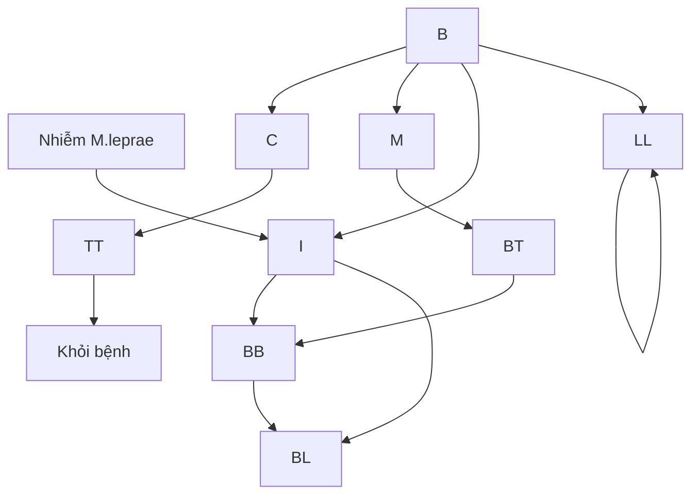

miễn dịch trung gian tế bào (CMI)

**Sơ đồ 1. Các thể phong theo phân loại của Ridley và Jobling**

## 2.5. Chẩn đoán phân biệt

Cần phân biệt các thể bệnh khác nhau với một số bệnh da sau đây:

- Phong thể I: Phân biệt với: lang ben, bạch biến, vảy phấn trắng, bớt sác tố, rối loạn sác tố khác.

- Phong thể T (BT, TT): Phân biệt với: nấm da, sarcoidosis, giang mai II, Lupus ban đỏ, Lao da, U hạt hình nhân, Lupus lao...

- Phong thể B, L (BB, BL, LL): Phân biệt với Sarcoidosis, Mycosis Fungoides, Sarcoma Kaposi, ung thư da...

  - Các tổn thương thần kinh khác:
    + Viêm rễ thần kinh.
    + Các tổn thương thần kinh sau chấn thương.

## 3. **ĐIỀU TRỊ**

### 3.1. Nguyên tắc điều trị

- Áp dụng phác đồ đa hoá trị liệu của WHO cho bệnh nhân phong.

- Điều trị biến chứng của bệnh phong, phòng ngừa tàn tật do phong.

- Điều trị, chăm sóc và quản lý thường xuyên cho bệnh nhân phong tại địa phương.

### 3.1. Điều trị cụ thể


39

## 3.1.1. Theo nhóm bệnh

Theo khuyến cáo của Tổ chức y tế thế giới năm 2018, điều trị bệnh phong đã được thay đổi. Sự thay đổi này dựa trên các khảo sát, nghiên cứu của các chuyên gia toàn cầu. Đặc biệt, điều trị theo phác đồ cũ, bệnh nhân kháng thuốc và tái phát vẫn xuất hiện ở một số nước. Để giảm thiểu tối đa nhược điểm này, WHO đã khuyến cáo thay đổi phác đồ điều trị như sau:

Cả hai nhóm PB và MB điều trị bằng 3 loại thuốc là: Rifampicin, Dapson và Clofazimin với liều lượng, cách uống giống nhau. (Trước đây nhóm bệnh nhân PB chỉ điều trị 2 thuốc là Rifampicin và Dapson)

Thời gian điều trị cụ thể: 6 tháng đối với nhóm PB và 12 tháng đối với bệnh nhân thuộc nhóm MB.

**Bảng 1. Các phác đồ điều trị của WHO (2018)**

| Nhóm tuổi                     | Thuốc      | Liều                                | Thời gian<br/>MB | Thời gian<br/>PB |
| ----------------------------- | ---------- | ----------------------------------- | ---------------- | ---------------- |
| Người lớn                     | Rifampicin | 600 mg/lần/tháng                    | 12 tháng         | 6 tháng          |
|                               | Clofazimin | 300 mg/lần/tháng và 50 mg/ngày      |                  |                  |
|                               | Dapson     | 100 mg/ngày                         |                  |                  |
| Trẻ em (10-14 tuổi) và > 40kg | Rifampicin | 450 mg/lần/tháng                    | 12 tháng         | 6 tháng          |
|                               | Clofazimin | 150 mg/lần/tháng và 50 mg cách ngày |                  |                  |
|                               | Dapson     | 50 mg/ngày                          |                  |                  |
| Trẻ em < 10 tuổi Hoặc < 40 kg | Rifampicin | 10 mg/kg/lần/tháng                  | 12 tháng         | 6 tháng          |
|                               | Clofazimin | 100 mg/lần/tháng, 50 mg 2 lần/tuần  |                  |                  |
|                               | Dapson     | 2 mg/kg/ngày                        |                  |                  |


*Lưu ý:* trẻ em được định nghĩa là dưới 15 tuổi tại thời điểm được chẩn đoán.

Đối với trẻ có trọng lượng cơ thể dưới 40kg có thể tham khảo cách tính liều sau:

- Trẻ có trọng lượng từ 20 - 40 kg:
+ Rifampin: 300 mg/tháng.
+ Clofazimin: 100 mg/lần/tháng, 50 mg 2 lần/tuần (vào các ngày cố định trong tuần, giữa các lần uống cách nhau từ 3 - 4 ngày)
+ Dapson: 25 mg/ngày (1/2 viên 50 mg)
- Trẻ có trọng lượng dưới 20 kg:
+ Rifampicin: 10 mg/kg/tháng
+ Clofazimin: 6 mg/kg/tháng, 1 mg/kg/ngày
+ Dapson: 2 mg/kg/ngày


40

**3.1.2. Điều trị phong kháng thuốc**

Chẩn đoán phong kháng thuốc dựa trên kết quả xét nghiệm PCR phát hiện vùng gen kháng Dapson hoặc Rifampicin của vi khuẩn.

**Nguyên tắc điều trị**

- Kháng rifampicin: Clofazimin kết hợp ít nhất hai loại thuốc: clarithromycin/minocyclin và quinolon trong 6 tháng, sau đó Clofazimin kết hợp với một trong các thuốc trên trong 18 tháng tiếp theo.
- Kháng đồng thời rifampicin và ofloxacin: Phối hợp clarithromycin, minocyclin và clofazimin trong 6 tháng, sau đó clarithromycin hoặc minocyclin kết hợp clofazimin trong 18 tháng tiếp theo.
- Phác đồ điều trị cụ thể:

**Bảng 2. Phác đồ khuyến cáo cho bệnh phong kháng thuốc**

| Loại thuốc bị kháng               | Điều trị<br/>6 tháng đầu (hằng ngày)                          | Điều trị<br/>18 tháng tiếp theo (hằng ngày)                     |
| --------------------------------- | ------------------------------------------------------------- | --------------------------------------------------------------- |
| **Kháng Rifampicin**              | Ofloxacin 400 mg\* + minocyclin 100 mg + Clofazimin 50 mg     | Ofloxacin 400 mg\* hoặc minocyclin 100 mg + Clofazimin 50 mg    |
|                                   | Ofloxacin 400 mg\* + clarithromycin 500 mg + Clofazimin 50 mg | Ofloxacin 400 mg\* + Clofazimin 50 mg                           |
| **Kháng Rifampicin và ofloxacin** | Clarithromycin 500 mg + minocyclin 100 mg + Clofazimin 50 mg  | Clarithromycin 500 mg hoặc minocyclin 100 mg + Clofazimin 50 mg |


* *Ofloxacin 400 mg có thể thay thế bằng *levofloxacin 500 mg* hoặc *moxifloxacin 400 mg*

- Sàng lọc lao trên những bệnh nhân phong bắt đầu điều trị bằng phác đồ có các thuốc trên (do fluoroquinolon có hiệu quả chống lại vi khuẩn lao). Khi đồng mắc lao cần điều trị theo phác đồ hiệu quả với cả hai bệnh để đề phòng bệnh lao kháng thuốc.
- Theo dõi điện tâm đồ, do nguy cơ kéo dài khoảng QT và rối loạn nhịp tim khi sử dụng clarithromycin, minocyclin và quinolon.
- Theo dõi chặt chẽ và báo cáo ca bệnh phong kháng thuốc với chính quyền địa phương, Bộ Y tế và WHO.

**3.2. Điều trị dự phòng**


41

- Sử dụng rifampicin liều duy nhất (Single-dose rifampicin - SDR) điều trị dự phòng cho người lớn và trẻ em từ 2 tuổi trở lên đã hoặc đang *tiếp xúc* với người mắc bệnh phong, sau khi sàng lọc bệnh phong, lao và không có các chống chỉ định.

**Tiếp xúc:** một người ở gần bệnh nhân phong trong một *thời gian dài* được coi là "tiếp xúc" với bệnh phong, có thể đã nhiễm hoặc chưa nhiễm bệnh. "*Thời gian dài*" được định nghĩa là tiếp xúc với bệnh nhân phong chưa điều trị trong 20 giờ mỗi tuần trong ít nhất ba tháng trong một năm.

**Bảng 3. Liều duy nhất rifampicin (SDR)**

| Tuổi/cân nặng           | Rifampicin liều duy nhất |
| ----------------------- | ------------------------ |
| ≥ 15 tuổi               | 600 mg                   |
| 10-14 tuổi              | 450 mg                   |
| Trẻ em 6-9 tuổi (≥20kg) | 300 mg                   |
| Trẻ em <20kg (≥ 2 tuổi) | 10-15 mg/kg              |


**4. DỰ PHÒNG**

Phòng ngừa bệnh phong thông qua dự phòng miễn dịch (vắc-xin):

- BCG khi sinh làm tăng tác dụng bảo vệ của SDR ở những người tiếp xúc từ 57% đến 80%.

- Tiêm lại BCG (liều BCG thứ hai sau liều khi sinh) hiệu quả không rõ ràng.


42

# Phụ lục 1: Quy trình rách da

## 1. Chuẩn bị:

+ Trang thiết bị:
  - Tủ an toàn sinh học cấp 2 (nếu có)
  - Kính hiển vi quang học
  - Dụng cụ sấy lam (nếu có)
  - Cán dao phẫu thuật (Inox)

+ Dụng cụ, hóa chất và vật tư tiêu hao
  - Lưỡi dao phẫu thuật (thường dùng lưỡi dao số 15)
  - Lam kính
  - Đầu soi kính
  - Dung dịch fuchsin 1%, Dung dịch cồn tẩy HCl 1%, Dung dịch xanh methylen 0,2%
  - Bông
  - Cồn 70 độ
  - Đèn cồn
  - Bật lửa
  - Panh
  - Khay đựng bệnh phẩm
  - Bút chì viết kính
  - Găng tay, mũ, khẩu trang

## 2. Vị trí làm rách da: rách da ít nhất 3 vị trí, trong đó rách ra tại dải tai và tổn thương da là yêu cầu bắt buộc. Các vị trí rách da bao gồm:

+ Hai dải tai
+ Tổn thương da: rách tại rìa tổn thương nếu tổn thương ranh giới rõ; rách tại trung tâm tổn thương nếu tổn thương ranh giới không rõ.
+ Vùng da trán dày ở trên cung lông mày.
+ Đầu gối hoặc khuỷu tay
+ Mặt mu ngón tay
+ Vị trí đã phát hiện dương tính trước đó: để theo dõi và phát hiện tái phát bệnh

## 3. Kỹ thuật:

- Bôi tê tại vị trí chỉ định (nếu bệnh nhân vẫn còn cảm giác).
- Sát khuẩn vị trí rách da bằng cồn và để khô
- Dùng ngón trỏ và ngón cái nâng vùng da định lấy bệnh phẩm và kẹp chặt lại để làm ngừng hoặc giảm chảy máu đến mức tối thiểu. Phải duy trì áp lực sao cho phần da bị kẹp trắng ra sau ít giây.
- Tay còn lại dùng dao phẫu thuật rách một đường dài 5mm, sâu 3mm


43

- Giữ nguyên áp lực bằng các ngón tay, xoay lưỡi dao theo một góc vuông với vết rạch và lấy dịch mô bằng cạnh sắc của lưỡi dao nhiều lần theo một hướng.
- Phết dịch mô lên lam kính theo hình tròn đường kính khoảng 8-10mm. Mẫu bệnh phẩm không được có máu.
- Mẫu có chứa máu đều không đạt tiêu chuẩn, có thể lấy tiếp lần thứ hai sau khi lau vết rạch bằng bông gòn trong khi vẫn duy trì áp lực của ngón tay.
- Cố định bệnh phẩm bằng cách ho mặt dưới lam trên ngọn lửa trong 2 giây
- Nhuộm Ziehl – Neelsen, đọc và nhận định kết quả.

4. Nhận định kết quả:

+ Chỉ số vi khuẩn (Bacteriological Index - BI): nằm trong khoảng 1+ đến 6+, tùy thuộc vào số lượng trục khuẩn quan sát được trong vi trường. Bệnh nhân phong thể u không được điều trị thường có BI 5+ đến 6+, sau điều trị chỉ số giảm từ 0,75+ đến 1+ mỗi năm.

| Chỉ số vi khuẩn | Mô tả                                 |
| --------------- | ------------------------------------- |
| 1+              | 1 - 10 vi khuẩn trong 100 vi trường   |
| 2+              | 1 - 10 vi khuẩn trong 10 vi trường    |
| 3+              | 1 - 10 vi khuẩn trong 1 vi trường     |
| 4+              | 10 - 100 vi khuẩn trong 1 vi trường   |
| 5+              | 100 - 1000 vi khuẩn trong 1 vi trường |
| 6+              | Trên 1000 vi khuẩn trong 1 vi trường  |


+ Chỉ số hình thái học (Morphological index - MI): tỷ lệ phần trăm vi khuẩn thể chắc (hình dạng và kích thước vi khuẩn bình thường, gọi ý vi khuẩn sống) trên tổng số vi khuẩn riêng rẽ đếm được. Chỉ số MI sẽ giảm xuống 0% sau 4 - 6 tháng khi điều trị đúng và đủ theo phác đồ.

Bệnh phong ở giai đoạn sớm và các thể bệnh phong nhẹ hơn (thể ít vi trùng, PB) rất khó phát hiện trục khuẩn khi xét nghiệm.


44

# **PHẢN ỨNG PHONG**

**(Leprosy reactions)**

Phản ứng phong (Lepra Reaction) là các đợt viêm cấp tính do đáp ứng miễn dịch của cơ thể đối với kháng nguyên *M. Lepra*. Các cơn phản ứng này có thể xuất hiện trước, trong hoặc sau điều trị. Đây là một trong những biến chứng thường gặp, gây tổn thương dây thần kinh và để lại nhiều di chứng trầm trọng nếu không được phát hiện và xử lý kịp thời. Chính vì vậy nhận biết sớm các triệu chứng để điều trị đúng đắn các phản ứng phong là vô cùng quan trọng, giúp giảm bớt nguy cơ tàn tật cho người bệnh.

Có hai loại phản ứng phong:

- - Phản ứng bệnh phong loại 1 hay còn gọi là phản ứng đảo ngược (RR: Reversal Reaction), hoặc phản ứng lên cấp (Up-grading Reaction).

- - Phản ứng loại 2 hay còn gọi là hồng ban nút ban nút do phong (ENL: Erythema Nodosum Leprosum).


45

# **PHẢN ỨNG PHONG LOẠI 1**

**(Type 1 leprosy reaction)**

## **1. ĐẠI CƯƠNG**

### **1.1. Khái niệm**

Phản ứng phong loại 1 còn gọi là phản ứng lên cấp hay phản ứng đảo ngược. Đây là phản ứng viêm do đáp ứng miễn dịch qua trung gian tế bào (CMI) với kháng nguyên của *M. leprae*. Biểu hiện đặc trưng của loại phản ứng này là các tổn thương da bồng chốc trở nên tấy đỏ, phù nề và có thể loét. Một số trường hợp nghiêm trọng có thể kèm theo sốt cao, phù bàn tay và bàn chân, viêm dây thần kinh cấp tính... Phản ứng phong loại 1 là nguyên nhân chính dẫn tới tàn tật trong bệnh phong. Viêm dây thần kinh ngoại biên do phản ứng phong loại 1 xảy ra rất nhanh, thậm chí chỉ trong một đêm các ngón tay đã có thể bị "cò" hay chân đã bị "cắt cằn".

### **1.2. Căn nguyên/ Cơ chế bệnh sinh**

Phản ứng phong loại 1 được coi là một đáp ứng tốt của CMI đối với các kháng nguyên của trực khuẩn phong. Chính vì vậy, phản ứng này chỉ xảy ra ở các thể phong trung gian như BT, BB và BL. Đây là các thể phong còn có sức đề kháng và thay đổi tùy theo tình trạng miễn dịch cũng như đáp ứng điều trị.

Thời gian xuất hiện cơn phản ứng thường là khi đáp ứng CMI tăng cao và có mặt của kháng nguyên trực khuẩn phong tại tổ chức da, thần kinh. Phản ứng phong loại 1 thường xảy ra từ 6 - 12 tháng sau khi bắt đầu MDT, nhưng có thể xảy ra sau khi hoàn thành MDT, ngay cả sau khi bệnh nhân hoàn thành phác đồ điều trị 3 - 5 năm. Phản ứng cũng có thể gặp ở bệnh nhân chưa được điều trị và là lí do đầu tiên khiến bệnh nhân đến cơ sở y tế.

## **2. CHẨN ĐOÁN**

### **2.1. Triệu chứng lâm sàng**

#### **2.1.1. Phong thể trung gian cũ (BT - borderline tuberculoid )**

Trong thể trung gian cũ, sự chênh lệch giữa CMI và *M. leprae* ít nên tỷ lệ xuất hiện phản ứng RR thấp và mức độ phản ứng nhẹ, hậu quả ít trầm trọng hơn.

- Tổn thương da:
  + Thường xảy ra ở bờ tổn thương với các triệu chứng đỏ, sưng nề, thâm nhiễm. Có thể gặp toàn bộ tổn thương phù nề, sưng lên nhanh chóng.
  + Một vài tổn thương vỡ và loét trong những trường hợp phản ứng nặng.
  + Không phải tất cả các tổn thương da cũ đều có biểu hiện phản ứng đảo ngược và thường không xuất hiện tổn thương mới. Khi lui bệnh, tổn thương xẹp xuống và bong vảy.
  - Tổn thương thần kinh:


46

+ Các dây thần kinh thường bị ảnh hưởng là dây thần kinh trụ, thần kinh giữa, thần kinh quay, thần kinh mác chung, thần kinh chảy sau và thần kinh mặt.

+ Một hoặc nhiều dây thần kinh ngoại biên bị tổn thương có biểu hiện: sưng to, nhạy cảm, đau, mất chức năng vận động hoặc cảm giác.

- Tổn thương thần kinh nhẹ: bệnh nhân chỉ thấy đám đút và rất bồng ở vùng da do dây thần kinh đó chi phối. Sờ nắn có cảm giác đau nhẹ, nhạy cảm.

- Tổn thương thần kinh nặng: bệnh nhân thấy đau nhúc nhiều ở các vùng da do các dây thần kinh bị viêm đó chi phối. Các dây thần kinh này tăng nhạy cảm nhiều khi chạm vào hoặc sờ nắn.

- Toàn trạng: bệnh nhân mệt mỏi, khó chịu kèm theo sốt.

**2.1.2. Phong thể trung gian (BB - borderline borderline)**

Thế này có sự cân bằng giữa CMI và *M. Leprae*, phản ứng có thể xảy ra rất mạnh nếu có sự thay đổi của một trong hai yếu tố này.

- Tổn thương da: tổn thương da đột ngột tấy đỏ, sưng nề, trung tâm lõm. Trường hợp nặng có thể loét, phù mặt, bàn tay, bàn chân, có thể xuất hiện tổn thương mới.

- Tổn thương thần kinh: nhiều dây thần kinh tổn thương sưng to, nhạy cảm, đau nhúc, có thể gây liệt nhanh và mất chức năng vận động, cảm giác, đau.

- Toàn trạng: sốt cao, mệt mỏi, khó chịu, chán ăn.

**2.1.3. Phong thể trung gian u (BL - borderline lepromatous)**

Sự chênh lệch giữa CMI và *M. leprae* ít. Vì vậy, tỷ lệ xuất hiện cơn phản ứng trong phong thể trung gian u không cao và mức độ thường nhẹ.

- Tổn thương da: tổn thương lan rộng nhanh với đặc điểm: đỏ, bồng, căng mọng, ranh giới không rõ với da lành, dễ bị loét. Có thể xuất hiện nhiều tổn thương mới.

- Tổn thương thần kinh: hầu hết các dây thần kinh ngoại biên bị ảnh hưởng ở mức độ nhẹ. Một số trường hợp dây thần kinh ngoại biên sưng to, mềm, đau.

- Toàn trạng: bệnh nhân mệt mỏi, sốt cao liên tục 39 - 40°C. Một số bệnh nhân có kèm theo tổn thương của hồng ban nút hoặc có thêm các biểu hiện của các cơ quan khác như viêm màng mắt, viêm tinh hoàn, viêm ngón tay, ngón chân, chảy máu cam, phù thanh quản.

**2.2. Cận lâm sàng**

**2.2.1. Xét nghiệm hạch da**

Thực hiện khi chẩn đoán nghi ngờ với bệnh tái phát. Trong trường hợp phản ứng phong, các chỉ số trực khuẩn phong (BI, MI) không tăng lên so với xét nghiệm lần gần nhất.

**2.2.2. Mô bệnh học**

- Hình ảnh mô bệnh học tổn thương da thường gặp nhất trong phản ứng phong loại 1 là: xâm nhập lympho bào dạng u hạt, phù nề như trung bì, kết đặc nhân (pyknosis) của tế bào lympho, phù nề trong u hạt; xâm nhập lympho tại mô mỡ, quanh nang lông.


47

## **2.2.3. Siêu âm thần kinh**

- Siêu âm dây thần kinh trong một số trường hợp để xác định mức độ và vị trí tổn thương của dây thần kinh.

- Tổn thương thần kinh có thể đánh giá qua hình ảnh dây lên của dây thần kinh, các tổn thương giảm âm và tín hiệu tăng sinh mạch trên siêu âm doppler.

- Tuy nhiên, xét nghiệm này phần lớn mang tính chủ quan và độ chính xác hạn chế, phụ thuộc nhiều vào kinh nghiệm của các bác sĩ chẩn đoán hình ảnh. Hơn nữa, có rất ít bằng chứng cho thấy có mối quan hệ giữa hình thái trên siêu âm và biểu hiện tổn thương thần kinh.

**_Chú ý: trong quá trình điều trị, cần làm một số xét nghiệm khác như:_**

- Các xét nghiệm cơ bản công thức máu, sinh hóa (chức năng gan, thận, đường máu, điện giải đồ), HIV, nước tiểu.

- Xét nghiệm loại trừ lao (xét nghiệm đờm, X-quang ngực,...).

- Khám phân: xét nghiệm phân nhằm phát hiện nhiễm ký sinh trùng đường ruột (nếu cơ sở có thể thực hiện được).

- Kiểm tra bất kỳ ổ nhiễm trùng nếu nghi ngờ.

## **2.3. Chẩn đoán xác định**

- Chẩn đoán xác định chủ yếu dựa vào lâm sàng:

  + Bệnh nhân được chẩn đoán phong các thể trung gian BB, BT, BL có thể trong giai đoạn đang, đã hoặc chưa MDT.

  + Diễn biến lâm sàng cấp tính.

  + Tổn thương da cũ tái đỏ, có thể xuất hiện thêm các tổn thương mới.

  + Viêm dây thần kinh ngoại biên: sưng, đau, tăng nhạy cảm kèm theo tổn thương chức năng thần kinh (vận động, cảm giác).

  - Cận lâm sàng:

    + Siêu âm: dây thần kinh dày, không đều, tăng kích thước, tăng sinh mạch.

    + Xét nghiệm hạch da: BI, MI không tăng.

  - Xét nghiệm mô bệnh học: có hình ảnh đặc trưng của phản ứng phong loại 1.

## **2.4. Chẩn đoán mức độ cơn phản ứng**

- Phản ứng nhẹ:

  + Phù nề, ban đỏ chỉ ở các tổn thương da hiện có.

  + Không có biểu hiện tổn thương thần kinh (sưng to, đau, tăng nhạy cảm, rối loạn/mất chức năng).

  + Toàn trạng: thường không ảnh hưởng, đôi khi bệnh nhân có thể sốt nhẹ.


48

- Phản ứng nặng: khi xuất hiện một trong các dấu hiệu dưới đây:
  + Đau, suy giảm chức năng thần kinh (cảm giác, vận động).
  + Phù bàn tay, bàn chân
  + Sốt kèm các triệu chứng toàn thân như khó chịu, mệt mỏi…
  + Đau khớp
  + Tổn thương da sung đau, tăng nhạy cảm
  + Loét vùng da tổn thương.

**2.5. Chẩn đoán phân biệt**
- Phản ứng phong loại 2
- Bệnh lý tổn thương dây thần kinh do nguyên nhân khác: đái tháo đường, HIV/AIDS, thiếu vitamin B12, chèn ép thần kinh, bệnh lý rối tuy…
- Phong tái phát

**3. ĐIỀU TRỊ**

**3.1. Nguyên tắc điều trị**
- Tiếp tục phác đồ điều trị đa hoá (MDT) nếu chưa hoàn thành.
- Điều trị nội trú tại cơ sở y tế trong trường hợp phản ứng nặng.
- Điều trị ngay khi phát hiện có phản ứng
- Tăng cường chế độ ăn uống, dinh dưỡng, nâng cao thể trạng
- Nghỉ ngơi, bất động các chi có viêm dây thần kinh
- Vặt lý trị liệu sau khi tình trạng viêm dây thần kinh đã cải thiện.

**3.2. Điều trị cụ thể**

**3.2.1. Mức độ nhẹ**
- Lựa chọn một trong số thuốc giảm đau, chống viêm không corticosteroid (NSAIDs):
  + Aspirin: 325 - 650mg/lần cách nhau 4 - 6 giờ. Tối đa 4g/ngày.
  + Indomethacin: Khởi đầu liều 25 mg x 2 - 3 lần/ngày, tăng thêm từ 25 đến 50 mg mỗi tuần. Tối đa 200mg/ngày.
  + Ibuprofen 200 - 400 mg mỗi 4 giờ. Tối đa 2400mg/ngày.
  + Paracetamol: 500mg/lần cách nhau ít nhất 4h. Tối đa 4g/ngày.
  + Tramadol: 50 - 100mg/lần. Tối đa 400mg/ngày.
- Cần đánh giá nguy cơ tim mạch, hô hấp, xuất huyết tiêu hoá, rối loạn đông máu.


49

- Đánh giá tổn thương sau mỗi 2 tuần, nếu không kiểm soát được xét tăng liều thuốc điều trị. Trường hợp vẫn không kiểm soát được phản ứng hoặc mức độ chuyển nặng cần chuyển phác đồ điều trị theo hướng dẫn điều trị phản ứng nặng (cần hội chẩn chuyên gia).

**3.2.2. Mức độ nặng**

**a. Lựa chọn số 1: Corticosteroid**

- **Chỉ định:**

  + Phản ứng loại 1 không kiểm soát được bằng paracetamol hoặc NSAID;

  + Viêm dây thần kinh: tổn thương chức năng thần kinh mới xuất hiện

    - Đau ở một hoặc nhiều dây thần kinh

    - Bệnh nhân phản nàn về suy giảm chức năng thần kinh (mất cảm giác hoặc yếu cơ...)

    - Rối loạn vận động, cảm giác khi thăm khám

    - Viêm dây thần kinh âm thầm, đôi khi không có triệu chứng rõ ràng. Cần theo dõi và đánh giá chức năng thần kinh để phát hiện sớm các dấu hiệu tổn thương (Tham khảo phụ lục).

Prednisolon là loại corticosteroid thường được sử dụng. Liều khởi đầu từ 0,5-1,0 mg/kg/ngày. Trong hầu hết các trường hợp áp dụng liều khởi đầu khoảng 0,5mg/kg cân nặng sau đó giảm liều chậm, liệu trình kéo dài 20 tuần cho thấy kết quả tốt nhất.

*Bảng 1: Phác đồ điều trị phản ứng phong loại 1 với prednisolon theo khuyến cáo WHO 2020*

| Liều lượng mỗi ngày | Tuần<br/>1-2 | Tuần<br/>3-4 | Tuần<br/>5-8 | Tuần<br/>9-12 | Tuần<br/>13-16 | Tuần<br/>17-20 |
| ------------------- | ------------ | ------------ | ------------ | ------------- | -------------- | -------------- |
| 40 mg               | x            |              |              |               |                |                |
| 30 mg               | x            | x            |              |               |                |                |
| 25 mg               |              | x            |              |               |                |                |
| 20 mg               |              |              | x            | x             |                |                |
| 10 mg               |              |              |              |               | x              |                |
| 5mg                 |              |              |              |               |                | x              |


50

- Phác đồ giảm liều prednisolon (Bảng 1):
  + Liều khởi đầu áp dụng 30mg hoặc 40mg/ngày trong 2 tuần đầu, sau đó giảm xuống 25mg (trường hợp liều khởi đầu là 30mg) hoặc 30mg (trường hợp liều khởi đầu là 40mg) trong 2 tuần tiếp.
    + Từ tuần thứ 5 - 12: dùng liều 20mg
    + Tuần 13 - 16: 10mg
    + Tuần 17 - 20: 5mg

- Trong một số trường hợp phản ứng nặng hoặc dai dẳng, bệnh nhân cần yêu cầu liều khởi đầu cao hơn và thời gian điều trị lâu hơn. Một số bệnh nhân mắc các bệnh kèm theo (bệnh đái tháo đường) có thể sử dụng liều thấp hơn hoặc kết hợp với thuốc khác, liều lượng được điều chỉnh theo đáp ứng lâm sàng. Những trường hợp này cần hội chẩn thêm ý kiến từ chuyên gia.

- Ở bất kỳ liều điều trị nào, nếu các dấu hiệu lâm sàng của phản ứng tăng lên hoặc không thuyên giảm thì tăng liều lên 30 mg/ngày, sau đó giảm dần liều trong khoảng thời gian 20 tuần nữa theo phác đồ tiêu chuẩn. Nếu bệnh nhân đã hoàn thành một liệu trình corticosteroid nhưng lại xuất hiện phản ứng một lần nữa, có thể bắt đầu lại liệu trình tương tự.

- Chức năng thần kinh cải thiện nhanh trong các trường hợp tổn thương thần kinh mới (dưới 6 tháng). Tuy nhiên quá trình phục hồi chức năng thần kinh của các tổn thương nặng sẽ mất nhiều tháng hoặc có thể không hồi phục. Do đó, việc tăng liều prednisolon hoặc kéo dài thời gian điều trị corticosteroid cần được xem xét và hội chẩn.

- Tác dụng phụ của corticosteroid:
  + Suy giảm miễn dịch:
    - Mắc lao, nhiễm trùng huyết, viêm tùy xương.
    - Các bệnh nhiễm khuẩn và nhiễm ký sinh trùng đường ruột. Cần điều trị tình trạng nhiễm trùng theo phác đồ nếu xác định được căn nguyên cụ thể. Trong trường hợp không làm được xét nghiệm, khuyến cáo các trường hợp bệnh nhân trước khi điều trị phác đồ corticosteroid sử dụng albendazol (liều dành cho người lớn 400mg, 2 lần/ngày trong 3 ngày).

  + Đái tháo đường: Nếu bệnh nhân có tiền sử đái tháo đường hoặc tình trạng tăng đường huyết mới phát hiện, cần được hội chẩn chuyên khoa nội tiết để phối hợp điều trị. Tình trạng tăng đường huyết có thể tự hết khi ngừng sử dụng corticosteroid.

  + Loãng xương, hoại tử vô mạch chòm xương đùi: cần chú ý đặc biệt ở các bệnh nhân lớn tuổi, ít vận động.

  + Rối loạn tâm thần: phổ biến là hung cảm.

  + Rối loạn tiêu hóa, loét đường tiêu hóa.


51

- + Hội chứng Cushing: mặt tròn như mặt trăng, mụn trứng cá, rậm lông và tăng cân, béo trung tâm. Tình trạng này sẽ cải thiện khi dùng corticosteroid.
- + Úc chế tăng trưởng ở trẻ em: do ức chế vỏ thượng thận và trục tuyến yên.
- + Teo tuyến thượng thận (bệnh Addison).
- + Tăng huyết áp, tăng nhãn áp, đục thủy tinh thể.

**b. Thuốc lựa chọn thứ hai: Cyclosporin**

- Cyclosporin là một lựa chọn thay thế an toàn cho những bệnh nhân bị viêm dây thần kinh không cải thiện với prednisolon hoặc xuất hiện nhiều tác dụng phụ liên quan đến prednisolon. Trước khi lựa chọn cyclosporin điều trị, cần thiết phải hội chẩn chuyên gia.

- Chống chỉ định: suy thận, suy gan; tăng huyết áp không kiểm soát được; bệnh nhân suy giảm miễn dịch, bệnh nhân mắc HIV; có bệnh ác tính (u lympho T ở da, melanoma…); nghiện rượu.

- Theo dõi: theo dõi thường xuyên huyết áp, theo dõi creatinin máu mỗi 2 tuần trong 3 tháng, sau đó theo dõi hàng tháng, dựa vào creatinin nền của bệnh nhân. Dừng điều trị khi creatinin tăng trên 30% so với creatinin nền.

**3.3. Điều trị khác**

- Các thuốc giảm tác dụng phụ của NSAIDs, corticosteroid lên đường tiêu hóa như ức chế bơm proton, gastropulgit, bổ sung canxi + vitamin D cho các bệnh nhân điều trị corticosteroid kéo dài, có nguy cơ loãng xương (bệnh nhân lớn tuổi, mãn kinh).

- Nghỉ ngơi và hạn chế vận động trong giai đoạn cấp tính của đợt phản ứng, sử dụng nẹp hoặc bó bột hỗ trợ cho các chi có tổn thương thần kinh, đặc biệt vào buổi tối.

- Khi triệu chứng đau của giai đoạn cấp tính giảm, tập kéo giãn thụ động các cơ bị ảnh hưởng để duy trì khả năng vận động của khớp

- Bôi dưỡng ẩm cho da khô.

**3.4. Theo dõi**

**3.4.1. Trong quá trình điều trị**

- Trong giai đoạn cấp: đánh giá chức năng vận động và cảm giác của thần kinh hàng ngày (xem phụ lục).
- Theo dõi toàn trạng, tiến triển của tổn thương da, khớp, thần kinh.
- Trong giai đoạn phản ứng ổn định, các cơn đau giảm, khi bệnh nhân được điều trị ngoại trú, tái khám mỗi 2 tuần hoặc khi có các dấu hiệu bất thường.
- Theo dõi tác dụng phụ của thuốc.


52

**3.4.2. Sau điều trị**

- Kết thúc phác đồ điều trị phản ứng, khám định kỳ theo hướng dẫn của nhân viên y tế.

- Tái khám ngay nếu xuất hiện bất kỳ các dấu hiệu bất thường: ban đỏ tại các tổn thương da, yếu môi cơ, mất cảm giác, sốt.

**4. PHÒNG BỆNH**

- Theo dõi, thăm khám định kỳ bệnh nhân phòng đang điều trị da hoá trị liệu hoặc đã kết thúc da hoá trị liệu.

- Tái khám ngay nếu xuất hiện bất kỳ các dấu hiệu bất thường: ban đỏ tại các tổn thương da, yếu môi cơ, mất cảm giác, sốt.

**Biểu đồ 1: Chẩn đoán loại phản ứng phong (WHO 2020)**

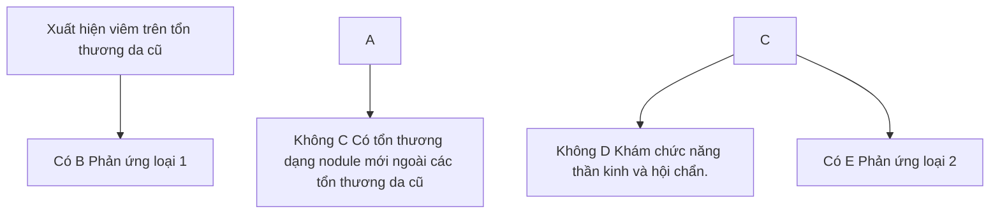


53

**Biểu đồ 2. Điều trị phản ứng phong loại 1 và viêm dây thần kinh (WHO 2020)**

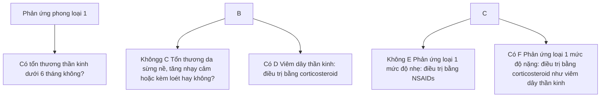


54

**Biểu đồ 3: Theo dõi bệnh nhân phản ứng phong loại 1 và viêm dây thần kinh (WHO 2020)**

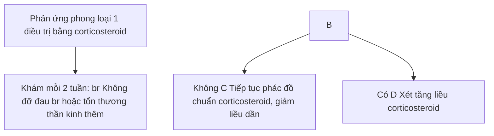


55

# PHẢN ỨNG PHONG LOẠI 2
**(Type 2 leprosy reaction)**

## 1. **ĐẠI CƯƠNG**

### 1.1. **Khái niệm**

- Phản ứng phong loại 2 hay còn gọi là hồng ban nút do phong (ENL: Erythema Nodosum Leprosum) là một phản ứng viêm hệ thống, diễn biến từng đợt, hay tái phát, thường xuất hiện ở những bệnh nhân phong thể u (LL, BL) và hiếm khi gặp ở bệnh nhân thể BB.

- ENL xảy ra khoảng 1,2% các trường hợp bệnh phong và 15,4% trong số các trường hợp phong thể u (Lepromatous leprosy - LL), tỷ lệ này thực tế còn được báo cáo là cao hơn trong một số nghiên cứu. ENL cũng có thể xảy ra nhiều đợt trên cùng bệnh nhân.

- ENL có liên quan đến đáp ứng miễn dịch, ảnh hưởng lan tỏa khắp cơ thể, không chỉ tổn thương ở da.

- ENL có thể xuất hiện cấp tính, trong trường hợp phản ứng nặng nếu không được phát hiện và xử lý kịp thời có thể gây nên những hậu quả nghiêm trọng.

## 1.2. **Căn nguyên/ cơ chế bệnh sinh**

- ENL là một biến chứng do đáp ứng miễn dịch xảy ra phổ biến nhất ở những bệnh nhân đang MDT nhưng cũng có thể xảy ra trước hoặc sau khi kết thúc điều trị.

- Vai trò của các cytokin được giải phóng từ tế bào lympho T, đại thực bào và phức hợp miễn dịch đóng vai trò chính trong cơ chế bệnh sinh của ENL.

- Tế bào lympho T sau khi được kích hoạt sẽ hoạt hóa các đại thực bào chứa trực khuẩn *M.leprae*, đại thực bào sau đó sẽ giải phóng ra các kháng nguyên *M.leprae*, các cytokin (TNF-α, IFN-γ) và trình diện kháng nguyên tới tế bào Th1. Các cytokin được giải phóng kích hoạt bạch cầu da nhân trung tính, các tế bào miễn dịch khác. Từ đó một loạt các cytokin, các tế bào miễn dịch được kích thích tham gia vào phản ứng gây ra các tổn thương các mô cơ quan.

- Quá trình tạo phức hợp miễn dịch kháng nguyên – kháng thể cũng đóng góp vào cơ chế bệnh sinh của bệnh. Các phức hợp miễn dịch thường được hình thành ngoài mạch máu ở những nơi *M. Leprae* hiện diện với nồng độ cao (da, dây thần kinh, hạch bạch huyết và tinh hoàn). Những phức hợp này kết hợp với bổ thể (complement) gây ra phản ứng viêm, dẫn đến các biểu hiện trên lâm sàng. Phức hợp miễn dịch, bổ thể lắng đọng tại tất cả các tổ chức, da, dây thần kinh... gây hiện tượng viêm, phù nề, sung và có thể tạo thành các ổ áp xe.

- Quá trình viêm dây thần kinh trong ENL xảy ra từ từ, khác với quá trình viêm trong phản ứng loại 1. Vì vậy, tàn tật do viêm dây thần kinh trong ENL cũng xảy ra từ từ và tỷ lệ thấp hơn. Tuy nhiên, ENL cũng có thể gây ra phản ứng viêm ở nhiều cơ quan khác: khớp, hạch, tinh hoàn, mắt.


56

# 2. CHẨN ĐOÁN

## 2.1. Triệu chứng lâm sàng

- Nút/nốt (Nodule): Đặc trưng của ENL là sự xuất hiện của hồng ban nút. Các tổn thương có thể ở bất cứ vị trí nào trên cơ thể và không liên quan đến các tổn thương da cũ. Các tổn thương kích thước từ 1 - 2 cm. Một số trường hợp nặng, các nút có thể bị loét.

  - Sốt, mệt mỏi
  - Viêm hạch bạch huyết
  - Viêm khớp
  - Viêm tinh hoàn
  - Viêm màng mắt, thể mi
  - Rối loạn tiêu hóa
  - Phù tay, chân
  - Viêm màng xương
  - Viêm dây thần kinh

Diễn biến tự nhiên của một đợt ENL cấp tính từ 1 - 2 tuần và có thể tái phát nhiều đợt trong nhiều tháng. Một số trường hợp những đợt phản ứng có thể kéo dài trên 2 năm.

Có 3 loại ENL:

- ENL cấp tính: thời gian diễn biến dưới 6 tháng, điều trị giảm liều theo phác đồ và không tái phát.
- ENL tái phát: có đợt phản ứng sau khi kết thúc phác đồ điều trị cơn phản ứng từ 28 ngày trở lên.
- ENL mạn tính: thời gian diễn biến trên 6 tháng hoặc có đợt phản ứng sau khi kết thúc phác đồ điều trị dưới 28 ngày.

## 2.2. Cận lâm sàng

### 2.2.1. Xét nghiệm đánh giá phản ứng viêm

Công thức máu, máu lắng, CRP-hs.

### 2.2.2. Xét nghiệm mô bệnh học

Hình ảnh viêm mô mỡ dạng vách với thành phần viêm là lympho bào, mô bào, bạch cầu đa nhân trung tính và/hoặc ái toan. Có thể có tế bào đa nhân không lồ. Đôi khi có thể thấy tế bào bọt.

### 2.2.3. Siêu âm dây thần kinh

Sự thay đổi trên siêu âm của tổn thương thần kinh trong ENL ít gặp hơn so với phản ứng phong loại 1.

### 2.2.4. Xét nghiệm khác


57

Các xét nghiệm theo dõi việc điều trị corticosteroid (*xem trong bài phản ứng phong loại 1*)

## 2.3. **Chẩn đoán xác định**

Dựa vào:
- Các triệu chứng lâm sàng:
  + Hồng ban nút.
  + Các triệu chứng khác: đau khớp, nổi hạch, viêm dây thần kinh, tổn thương mắt
  + Toàn trạng ảnh hưởng: sốt, mệt mỏi
- Xét nghiệm mô bệnh học: hình ảnh đặc trưng của hồng ban nút.

## 2.4. **Chẩn đoán mức độ**

### 2.4.1. **Mức độ nhẹ:** ENL kéo dài chỉ vài tuần sau đó thoái lui
- Không có sốt hoặc sốt nhẹ, khó chịu
- Tổn thương hồng ban nút đau ít và không loét
- Không đau dây thần kinh
- Không có biểu hiện ở các cơ quan khác (khớp, tinh hoàn, mắt, hạch)

### 2.4.2. **Mức độ nặng:** có một hoặc nhiều các dấu hiệu sau
- Sốt ≥ 38,5C
- Bạch cầu tăng cao
- Tổn thương da đau nhiều và/hoặc loét
- Đau dây thần kinh và/hoặc tăng nhạy cảm dây thần kinh khi sờ nắn
- Đột ngột mất cảm giác hoặc yếu cơ ở bàn tay, bàn chân hoặc mắt
- Phù bàn tay/bàn chân
- Đau khớp
- Viêm tinh hoàn
- Tổn thương mắt: viêm màng bồ đào, viêm củng mạc
- Đau đầu
- Protein niệu

Ngoài ra, có thể áp dụng thang điểm đánh giá mức độ nặng ENL (Erythema Nodosum Leprosum International Study - ENLIST) theo hướng dẫn của WHO 2020 (Bảng 1).

Thang điểm có 10 tiêu chí được chấm điểm từ 0-3 điểm cho mỗi tiêu chí. Điểm mức độ nặng là tổng điểm của 10 tiêu chí.
- Mức độ nhẹ: tổng điểm < 8
- Mức độ nặng: tổng điểm ≥ 8


58

*Bảng 1. Thang điểm ENLIST ENL*

| STT | Tiêu chí                            | Điểm<br/>0          | Điểm<br/>1                                      | Điểm<br/>2                                         | Điểm<br/>3                                  | Điểm đạt |
| --- | ----------------------------------- | ------------------- | ----------------------------------------------- | -------------------------------------------------- | ------------------------------------------- | -------- |
| 1   | Điểm đau theo VAS (mm)\*            | 0                   | 1-39                                            | 40-69                                              | 70-100                                      |          |
| 2   | Sốt (độ C)                          | ≤37,5 °C            | Sốt 7 ngày trước, hiện tại không sốt            | 37,6-38,5 °C                                       | ≥ 38,5 °C                                   |          |
| 3   | Số tổn thương hồng ban nút          | 0                   | 1-10                                            | 11-20                                              | ≥ 21                                        |          |
| 4   | Mức độ viêm tổn thương              | Không đỏ, không đau | Đỏ, không đau                                   | Đỏ kèm đau                                         | Phức hợp\*\*                                |          |
| 5   | Số vùng tổn thương                  | 0                   | 1-2 vùng                                        | 3-4 vùng                                           | 5-7 vùng\*\*\*                              |          |
| 6   | Phù ngoại vi (bàn tay/bàn chân/mặt) | Không               | 1 vị trí                                        | 2 vị trí                                           | cả 3 vị trí                                 |          |
| 7   | Đau xương                           | Không               | Phát hiện khi khám nhưng không hạn chế vận động | Đau ảnh hưởng tới giấc ngủ hoặc ảnh hưởng vận động | Không thể chịu được                         |          |
| 8   | Viêm khớp hoặc ngón do hồng ban nút | Không               | Phát hiện khi khám nhưng không hạn chế vận động | Đau ảnh hưởng tới giấc ngủ hoặc ảnh hưởng vận động | Không thể chịu được                         |          |
| 9   | Viêm hạch                           | Không               | Hạch to, không đau                              | Đau hoặc tăng nhạy cảm đau 1 vùng hạch             | Đau hoặc sưng đau từ 2 vùng trở lên\*\*\*\* |          |
| 10  | Đau thần kinh do hồng ban nút       | Không               | Không đau nếu bị đánh lạc hướng                 | Đau cả khi đánh lạc hướng                          | Rút tay chân khi khám                       |          |


* Đánh giá mức độ đau theo VAS (Visual Analogue Scale) sử dụng thang đo dài 100mm. Hỏi bệnh nhân mức độ đau và đánh dấu X vào vị trí tương ứng mức độ đau trên thang:

(Không đau) 0mm____________X____________100mm (Đau cực độ)


59

**\*\*: Mụn nước, bọng nước, mụn mủ, dạng hồng ban đa dạng, loét...**

**\*\*\*: Các vùng gồm: 1. Đầu và cổ, 2. Cánh tay/đùi trái, 3. Cánh tay/đùi phải, 4. Thân trước và sinh dục, 5. Thân sau và mông, 6. Cẳng - bàn tay - chân trái, 7. Cẳng -bàn tay - chân phải.**

****: 6 vùng hạch: Đầu và cổ 2 bên, nách 2 bên và bẹn 2 bên.

## **2.5. Chẩn đoán phân biệt**

- Hồng ban nút do căn nguyên khác (nhiễm trùng khác, thuốc, bệnh ác tính...).
- U phong (Leproma)
- Hồng ban rắn Bazin
- Sarcoidosis
- Viêm nút quanh động mạch
- Viêm mô mỡ dưới da
- Viêm mô bào
- Mycosis fungoides
- Phản ứng phong loại 1
- Hiện tượng Lucio

## **3. ĐIỀU TRỊ**

### **3.1. Nguyên tắc điều trị**

- Tiếp tục phác đồ điều trị đa hoá (MDT), nếu chưa hoàn thành.
- Điều trị nội trú tại cơ sở y tế trong trường hợp phản ứng nặng.
- Điều trị ngay khi phát hiện có phản ứng
- Điều trị tùy theo mức độ phản ứng.
- Phối hợp điều trị các chuyên khoa (mắt, cơ xương khớp, thần kinh...).
- Tăng cường chế độ ăn uống, dinh dưỡng, nâng cao thể trạng.
- Nghỉ ngơi, bất động các chi có viêm dây thần kinh.
- Vật lý trị liệu sau khi tình trạng viêm dây thần kinh đã cải thiện.

### **3.2. Điều trị cụ thể**

#### **3.2.1. Phản ứng nhẹ**

- Điều trị tại nhà bằng các thuốc giảm đau chống viêm không corticosteroid:
  + Aspirin: 325-650mg/lần cách nhau 4 - 6 giờ. Tối đa 4g/ngày.


60

+ Indomethacin: Khởi đầu liều 25 mg x 2 - 3 lần/ngày, tăng thêm từ 25 đến 50 mg mỗi tuần. Tối đa 200mg/ngày.

+ Ibuprofen 200 - 400 mg mỗi 4 giờ. Tối đa 2400mg/ngày.

+ Paracetamol: 500mg/lần cách nhau ít nhất 4h. Tối đa 4g/ngày.

+ Tramadol: 50 - 100mg/lần. Tối đa 400mg/ngày.

- Để giảm nguy cơ tác dụng phụ cần đánh giá nguy cơ tim mạch và hô hấp, tiêu hoá, nguy cơ tăng đường máu.

- Đánh giá đáp ứng điều trị sau mỗi 2 tuần theo thang điểm ENLIST:

  + Nếu điểm mức độ nặng giảm ≥ 5 điểm: duy trì điều trị.

  + Nếu điểm số mức độ ≥ 8 điểm hoặc giảm dưới 5 điểm thì chuyển phác đồ theo mức độ nặng.

## 3.2.2. Phản ứng nặng

*Lựa chọn số 1: Corticosteroid*

- Liều điều trị khởi đầu trung bình 30 - 40 mg prednisolon/ngày cho người lớn, khi phản ứng được kiểm soát, giảm liều dần theo phác đồ.

- Lưu ý tác dụng phụ của thuốc (*xem thêm trong phần cơn phản ứng phong loại 1*)

- Phác đồ cụ thể:

  *Bảng 2: Phác đồ điều trị phản ứng phong loại 1 với Corticosteroid theo khuyến cáo WHO 2020*

| Liều lượng mỗi ngày | Tuần<br/>1-2 | Tuần<br/>3-4 | Tuần<br/>5-8 | Tuần<br/>9-12 | Tuần<br/>13-16 | Tuần<br/>17-20 |
| ------------------- | ------------ | ------------ | ------------ | ------------- | -------------- | -------------- |
| 40 mg               | x            |              |              |               |                |                |
| 30 mg               | x            | x            |              |               |                |                |
| 25 mg               |              | x            |              |               |                |                |
| 20 mg               |              |              | x            | x             |                |                |
| 10 mg               |              |              |              |               | x              |                |
| 5mg                 |              |              |              |               |                | x              |


- Phác đồ giảm liều prednisolon (Bảng 2):

  + Liều khởi đầu áp dụng 30mg hoặc 40mg trong 2 tuần đầu, sau đó giảm xuống 25mg (trường hợp liều khởi đầu là 30mg) hoặc 30mg (trường hợp liều khởi đầu là 40mg) trong 2 tuần tiếp.

  + Từ tuần thứ 5 - 12: dùng liều 20mg


61

+ Tuần 13 - 16: 10mg

+ Tuần 17 - 20: 5mg

- Trường hợp ENL tái phát hoặc mãn tính: tăng liều corticosteroid hoặc kéo dài corticosteroid hoặc phối hợp điều trị với các thuốc khác.

- Ở bất kỳ liều điều trị nào, nếu các dấu hiệu lâm sàng của phản ứng tăng lên hoặc không thuyên giảm thì tăng liều lên 30 mg/ngày sau đó giảm dần liều trong khoảng thời gian 20 tuần nữa theo phác đồ tiêu chuẩn. Nếu bệnh nhân đã hoàn thành một liệu trình corticosteroid nhưng lại xuất hiện phản ứng một lần nữa, có thể được bắt đầu lại liệu trình tương tự.

*Lựa chọn số 2: điều trị kết hợp với corticosteroid*

- Cần nhắc phối hợp điều trị cùng với corticosteroid trong một số trường hợp:
  + ENL không đáp ứng với corticosteroid đơn độc.
  + ENL tái phát nhiều lần.
  + ENL phụ thuộc corticosteroid (phản ứng nặng hơn khi giảm liều).
  + Có các bệnh kèm theo (Đái tháo đường, suy thượng thận, tăng huyết áp).

**Clofazimin:** được lựa chọn đầu tiên trong điều trị phối hợp với corticosteroid. Clofazimin giúp giảm thời gian kiểm soát được cơn phản ứng, giảm thời gian điều trị corticosteroid, giảm phản ứng tái phát, mạn tính. Phác đồ cụ thể:
- 300 mg/ngày trong 1 tháng
- 200 mg/ngày trong 3 - 6 tháng tiếp
- 100mg/ngày cho đến khi hết triệu chứng.

Clofazimin thường có tác dụng sau 4-6 tuần điều trị. Tác dụng phụ thường gặp là tăng sắc tố da lan tỏa, rối loạn tiêu hóa.

**Methotrexat (MTX)**
- Cần nhắc sử dụng MTX kết hợp corticosteroid như một lựa chọn thứ 2
- Đánh giá trước điều trị:
  + Công thức máu
  + Xét nghiệm chức năng gan (bao gồm albumin huyết thanh)
  + Xét nghiệm chức năng thận
  + Loại trừ viêm gan B và C
  + Loại trừ lao

- Dùng thuốc vào một ngày cố định trong tuần: liều dùng khởi đầu 7,5-10mg/tuần, sau đó 1 tuần cần xét nghiệm lại công thức máu và chức năng gan thận, có thể tăng liều dần đến liều duy trì 15 - 25mg/tuần.

- Cần bổ sung 1mg acid folic/ngày trừ ngày uống MTX.


62

- Theo dõi tác dụng phụ, xét nghiệm lại công thức máu và chức năng gan thận mỗi 1-2 tháng.
- Tác dụng phụ: thường gặp nhất là các triệu chứng rối loạn tiêu hoá (buồn nôn thường gặp nhất), một số trường hợp xuất hiện giảm ba dòng máu.

**3.3. Điều trị khác**
- Buồn dịch, hạ sốt trong những trường hợp sốt cao, kéo dài.
- Phối hợp các chuyên khoa điều trị (mắt, khớp, thần kinh).
- Các thuốc giảm tác dụng phụ của NSAIDs, corticosteroid lên đường tiêu hóa như ức chế bom proton, gastropulgit
- Bổ sung canxi + vitamin D cho các bệnh nhân điều trị corticosteroid kéo dài, có nguy cơ loãng xương (bệnh nhân lớn tuổi, mãn kinh).
- Nghỉ ngơi và hạn chế vận động trong giai đoạn cấp tính của đợt phản ứng, sử dụng nẹp hoặc bó bột hỗ trợ cho các chi có tổn thương thần kinh, đặc biệt vào buổi tối.
- Khi triệu chứng đau của giai đoạn cấp tính giảm, tập kéo giãn thụ động các cơ bị ảnh hưởng để duy trì khả năng vận động của khớp
- Bôi dưỡng ẩm cho da khô

**3.4. Theo dõi**
**3.4.1. Trong quá trình điều trị**
- Trong giai đoạn cấp: đánh giá chức năng vận động và cảm giác của thần kinh hàng ngày (xem phụ lục 1).
  - Theo dõi toàn trạng, tiến triển của tổn thương da, khớp, thần kinh
  - Trong giai đoạn phản ứng ổn định, các cơn đau giảm, khi bệnh nhân được điều trị ngoại trú, tái khám mỗi 2 tuần hoặc khi có các dấu hiệu bất thường
  - Theo dõi tác dụng phụ của thuốc
**3.4.2. Sau điều trị**
- Kết thúc phác đồ điều trị phản ứng, khám định kỳ theo hướng dẫn của nhân viên y tế.
- Tái khám ngay nếu xuất hiện bất kì các các dấu hiệu bất thường: các nốt dưới da đỏ đau, phù nề, đau khớp, yếu mỏi cơ, mất cảm giác, sốt..

**4. PHÒNG BỆNH**
- Theo dõi, thăm khám định kỳ bệnh nhân phong đang điều trị đa hoá trị liệu hoặc đã kết thúc đa hoá trị liệu.
- Tái khám ngay nếu xuất hiện bất kì các các dấu hiệu bất thường: ban đỏ tại các tổn thương da, yếu mỏi cơ, mất cảm giác, sốt.


63

**Biểu đồ 1: Điều trị phản ứng phong loại 2 (WHO 2020)**

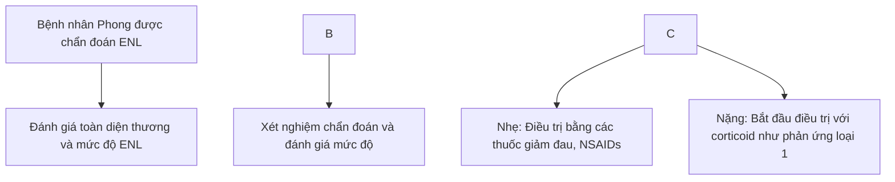


64

**Biểu đồ 2: Theo dõi điều trị phản ứng phong loại 2**

Bệnh nhân đang điều trị ENL

Đánh giá mỗi 2 tuần:
Khám thần kinh và mức độ nặng

Đáp ứng

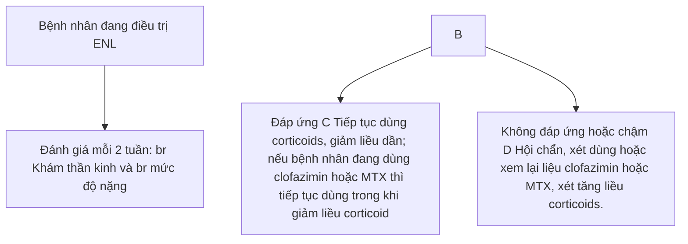


65

# Chương 2

# **BỆNH DA DO NẤM – KÝ SINH TRÙNG**


66

# **BỆNH GHẸ**

*(Scabies)*

## 1. **ĐẠI CƯƠNG**

### 1.1. Khái niệm

Bệnh ghẻ là bệnh da phổ biến, do ký sinh trùng ghẻ có tên khoa học là *Sarcoptes scabiei var. hominis* gây ra.

### 1.2. Dịch tễ học

Bệnh thường xuất hiện ở những vùng dân cư đông đúc, nhà ở chật hẹp, điều kiện vệ sinh kém. Bệnh lây từ người này sang người khác thông qua tiếp xúc trực tiếp hoặc qua quần áo, chăn màn, chiếu dính trứng ghẻ.

### 1.3. Căn nguyên/ Cơ chế bệnh sinh

Ký sinh trùng gây bệnh ghẻ có tên khoa học là *Sarcoptes scabiei hominis*.

## 2. **CHẨN ĐOÁN**

### 2.1. Triệu chứng lâm sàng

- Thời gian ủ bệnh: Khó xác định, trung bình 2-6 tuần ở từng người khác nhau, phụ thuộc vào khả năng miễn dịch. Nhiễm ghẻ lần đầu, thời gian ủ bệnh có thể đến 3 tuần. Trong trường hợp tái nhiễm ghẻ, thời gian ủ bệnh thường là từ 1-3 ngày.

- Yếu tố dịch tễ: nhiều thành viên trong gia đình có biểu hiện tương tự.

- Thể hiện hình:

  + Mụn nước: xuất hiện trên nền da lành, sắp xếp rải rác, riêng lẻ từng cái một. Mụn nước thường ở vùng da mỏng như ở kẽ ngón tay, mặt trước cổ tay, căng tay, vú, quanh thất lung, rốn, kẽ mông, mặt trong đùi và bộ phận sinh dục. Ở trẻ sơ sinh mụn nước ở lòng bàn tay, chân, ở qui đầu. Ở vùng sinh dục tổn thương thường tròn, 5-7 mm đường kính, ở giữa có thể trợt được gọi là sắng ghẻ, dễ nhầm với sắng giang mai.

  + Sẩn cục hay sẩn huyết thanh: hay gặp ở nách, bẹn, bìu.

  + Đường hầm ghẻ: còn gọi là "luống ghẻ", đặc hiệu nhưng không phải lúc nào cũng dễ tìm thấy. Luống ghẻ do con ghẻ cái tạo thành dài 3 -5mm, bên trên mặt da là một mụn nước nhỏ, lấy kim chích dịch chảy ra, đế lộ màu xám hoặc đen, dùng kim khêu sẽ bắt được cái ghẻ bám trên đầu kim, di động khi đặt lên mặt kính

  + Tại nơi gãi do ngứa, xuất hiện những vết xước, vảy da, đỏ da, dát thâm. Có thể có bội nhiễm, chàm hoá, mụn mủ.

- Thể Ghẻ vảy/Ghẻ sùng hóa hay Ghẻ Na Uy (Norwegian Scabies)


67

+ Thường gặp ở những bệnh nhân suy giảm miễn dịch: điều trị bằng corticosteroid dài ngày, HIV/AIDS, người được ghép tạng, dùng các thuốc ức chế miễn dịch, suy dinh dưỡng, người già.

+ Biểu hiện lâm sàng có thể dưới dạng viêm da mạn tính, viêm da dạng vảy nến, viêm da tiết bã hoặc đỏ da toàn thân kèm bong vảy nhiều.

+ Tổn thương cơ bản: các lớp vảy chồng lên nhau và lan tỏa gần như toàn cơ thể, có thể tìm thấy hàng nghìn cái ghẻ trong các vảy nhỏ này. Tại các khu vực bị nhiễm ghẻ vảy nặng, các mảng có ranh giới rõ được bao phủ bởi một lớp vảy rất dày. Ở tay, chân có thể gây nên bệnh da dạng hạt cơm, với dấu hiệu tăng sùng ở giương móng. Tổn thương phân bố toàn thân (thậm chí ở đầu và cổ) hoặc khu trú từng vùng chủ yếu ở các khu vực nếp kẽ. Lớp vảy da, vảy tiết được tìm thấy trên mặt đuôi bàn tay, cổ tay, ngón tay, khớp bàn ngón tay, lòng bàn tay, mặt đuôi của khuỷu tay, da đầu, lòng bàn chân và ngón chân.

- Triệu chứng cơ năng: ngứa nhiều, đặc biệt về đêm, có thể gây mất ngủ.

## 2.2. **Cận lâm sàng**

- Soi tìm ký sinh trùng ghẻ trên kính hiển vi thông thường.

- Soi da trên Dermoscopy: hình ảnh như vệt khói máy bay.

- Xét nghiệm huyết học: có thể thấy tăng bạch cầu ái toan trong ghẻ vảy.

## 2.3. **Chẩn đoán xác định**

Dựa vào triệu chứng lâm sàng và cận lâm sàng.

## 2.4. **Chẩn đoán phân biệt**

- Sẩn ghẻ: có thể cần chẩn đoán phân biệt với một số bệnh da có sẩn kèm theo ngứa như: Mày đay sắc tố (ở trẻ nhỏ), bệnh Darier, sẩn ngứa, sẩn trong giang mai II, viêm hạch lympho giả u, u bạch huyết dạng sẩn.

- Tổ đĩa

- Săng giang mai

- Ngứa, phát ban khu trú hoặc lan tỏa: phát ban do thuốc, viêm da cơ địa, viêm da tiếp xúc, bệnh vảy phấn hồng, viêm da dạng herpes, bệnh rận mu.

- Bệnh viêm da mù: chốc, chốc loét, bệnh nhọt khi có bội nhiễm

- Ghẻ vảy: phân biệt với vảy nến, viêm da dạng chàm, bệnh đỏ da có vảy.


68

# **3. ĐIỀU TRỊ**

## **3.1. Nguyên tắc điều trị**

- Bệnh nhân và những người tiếp xúc gần bệnh nhân cần được điều trị đồng thời (dù có triệu chứng hay không).

- Vệ sinh đồ dùng để hạn chế lây nhiễm: Giặt, phơi, luộc quần áo, chăn đệm, màn, đồ dùng.

- Ngứa có thể kéo dài thêm 1-2 tuần sau khi kết thúc quá trình điều trị hiệu quả.

## **3.2. Điều trị cụ thể**

### **3.2.1. Điều trị tại chỗ**

- Lựa chọn thứ nhất:

  + Permethrin 5%: là thuốc điều trị ghề hiệu quả và an toàn. Dụng kem hoặc dạng xit được sử dụng ở tất cả các vùng của cơ thể từ cổ trở xuống. Sau 8-12 giờ tắm rửa lại. Thuốc ít có tác dụng phụ, có thể gặp kích ứng nhẹ tại chỗ xoa thuốc. Có thể nhắc lại sau 7-14 ngày. Thuốc được cho là an toàn cho phụ nữ có thai, phụ nữ cho con bú và được phép dùng cho trẻ từ 2 tháng tuổi trở lên.

  + Lotion benzyl benzoat 10-25% dùng vào buổi đêm trong 2 ngày liên tiếp, có thể nhắc lại sau 7 ngày.

  + Malathion 0,5% lotion có thể sử dụng nếu không dung nạp với kem permethrin. Bôi toàn bộ cơ thể, tắm lại sau 24h, có thể lặp lại sau 1 tuần. Thuốc có thể gây viêm da kích ứng, đặc biệt là trên mặt và cơ quan sinh dục.

- Lựa chọn thứ hai:

  + Dung dịch DEP (Diethyl – phtalat) bôi lên tổn thương mụn nước tối trước khi đi ngủ.

  + Crotamiton 10% cream: Thoa lớp kem mỏng lên toàn bộ cơ thể từ cổ xuống, bôi liên tiếp 2 đêm, tắm rửa sạch sau 24 tiếng sau khi bôi lần 2.

  + Sulfur 2–10% in petrolatum: Bôi lên da từ 2 đến 3 ngày.

  + Benzyl benzoat kết hợp với sulfiram.

  + Sulfiram 25% lotion: có thể tác dụng tương tự như thuốc điều trị nghiện rượu; không được uống đồ uống có cồn trong ít nhất 48 giờ.

  + Ivermectin 0,8% lotion.

### **3.2.2. Điều trị toàn thân**

- Ivermectin đường uống:

  + Liều dùng: 200 <u>μg/kg</u>; chỉ sử dụng liều duy nhất. Thuốc không dùng cho phụ nữ có


69

thai, phụ nữ cho con bú và trẻ em dưới 15kg.
- + Liều lặp lại sau 1-2 tuần nếu cần thiết
- - Thuốc điều trị triệu chứng:
  - + Kháng histamin: dùng để giảm triệu chứng ngứa.
  - + Kháng sinh: khi có bội nhiễm.

**3.2.3 Điều trị ghẻ ở những trường hợp đặc biệt:**

- - Ghề vẩy:
  - + Ngâm, tắm toàn thân, bôi mỡ salicylic để bong sừng, sau đó bôi thuốc ghẻ. Bôi thuốc trị ghẻ nhiều lần lên da.
  - + Ivermectin đường uống kết hợp với liệu pháp bôi thuốc là phương pháp hiệu quả nhất.
  - + Kiểm soát lây nhiễm: cách ly bệnh nhân, vệ sinh nơi ở, điều trị dự phòng đối với những người đã tiếp xúc với bệnh nhân.

- - Ghề chàm hóa:
  - + Kháng histamin: dùng thuốc kháng histamin an thần như hydroxyzin, doxepin, hoặc diphenhydramin khi đi ngủ.
  - + Thuốc mỡ corticosteroid: bôi các tổn thương viêm da chàm hóa do ghẻ.

- - Ghề bội nhiễm: điều trị với thuốc mỡ mupirocin, acid fusidic. Có thể dùng thêm các loại thuốc kháng sinh đường toàn thân nếu cần.

- - Sẩn ghẻ: có thể tồn tại cùng với ngứa đến một năm sau khi loại bỏ ghẻ. Có thể sử dụng triamcinolon tiêm nội tổn thương, 5-10 mg/ml trên từng tổn thương; lặp lại mỗi 2 tuần (nếu cần thiết); thuốc mỡ corticosteroid phối hợp axit salicylic...

**4. PHÒNG BỆNH**

- - Vệ sinh cá nhân sạch sẽ. Giáo dục cộng đồng, giữ vệ sinh da, diệt nguồn ghẻ sinh sống, tắm, thay đồ hàng ngày, dọn sạch giường, giặt chăn màn.

- - Khi bị ghẻ cần điều trị sớm, tránh tiếp xúc với người xung quanh trong thời gian điều trị.

- - Giáo dục đối tượng có nguy cơ tránh tiếp xúc. Khi phát hiện ra có người trong gia đình bệnh nhân ghẻ cần điều trị sớm, tránh tiếp xúc và dùng chung các đồ dùng của người bị bệnh.

- - Chẩn đoán sớm, điều trị đầy đủ, thích hợp.

- - Điều trị biến chứng, phòng tái phát.


70

# **VIÊM DA DO DEMODEX**
**(Demodicosis)**

## **1. ĐẠI CƯƠNG**

### **1.1. Khái niệm**

Viêm da do *Demodex* là bệnh da do ký sinh trùng thuộc họ *Demodex* ký sinh và phát triển với số lượng lớn ở nang lông, tuyến bã và vảy da.

### **1.2. Dịch tễ**

*Demodex* có thể thường gặp ở trẻ lớn và người trưởng thành, hiếm khi quan sát thấy ở trẻ em dưới 5 tuổi. Viêm da do *Demodex* thường được chẩn đoán ở người lớn tuổi, hoặc người có tình trạng suy giảm miễn dịch.

### **1.3. Căn nguyên/Cơ chế bệnh sinh**

- Bệnh gây ra do *Demodex* thuộc họ ve mặt, giống *Demodex*, thường có hai loài ký sinh trên người là *D. folliculorum* và *D. brevis*.

- Khi xâm nhập vào da người, *Demodex* ký sinh ở nang lông, tuyến bã, dùng mô sắc nhọn chọc thủng tế bào biểu bì và tiết ra men lipase thủy phân chất bã làm nguồn thức ăn. Khi lượng *Demodex* tập trung nhiều làm nang lông giãn rộng, hình thành nút sừng gây tắc nghẽn nang lông và giảm bài tiết chất bã ra ngoài khiến da trở nên khô ráp và bong vảy.

## **2. CHẨN ĐOÁN**

### **2.1. Triệu chứng lâm sàng**

- Gồm viêm da do *Demodex* nguyên phát và viêm da do *Demodex* thứ phát:

  + Viêm da do *Demodex* nguyên phát: khởi phát muộn, thường sau 40 tuổi hoặc người cao tuổi, ảnh hưởng đến mặt, quanh miệng, quanh mắt hoặc quanh tai. Tổn thương thường phân bố không đối xứng, được nhóm lại theo hình dạng không đều có tổn thương vệ tinh. Người bệnh không có triệu chứng hoặc ngứa nhẹ. Không thấy các biểu hiện điển hình của trứng cá đỏ như ban đỏ, con đỏ bùng thoáng qua, giãn mạch.

  + Viêm da do *Demodex* thứ phát xuất hiện sớm hơn, tổn thương phân bố ở mặt hoặc thân mình viêm nhiều và lan tỏa hơn. Người bệnh thường có tiền sử hoặc kèm theo bệnh trứng cá đỏ, viêm da quanh miệng

  - Triệu chứng của viêm da do Demodex thường không đặc hiệu:
    + Vảy mỏng vùng nang lông
    + Đát, sần, mụn mủ, viêm nang lông
    + Có thể kèm theo ngứa, vảy vùng quanh mắt, viêm kết mạc mắt, giảm thị lực.


71

**2.2. Cận lâm sàng**

Soi tìm *Demodex* dưới kính hiển vi:

- Nếu độ tập trung của *Demodex* ≥ 5 con trên một vi trường: *Demodex* là căn nguyên gây bệnh.
- Nếu độ tập trung của *Demodex* < 5 con trên một vi trường: *Demodex* không phải căn nguyên gây bệnh.

**2.3. Chẩn đoán xác định**

Dựa vào biểu hiện lâm sàng và cận lâm sàng.

**2.4. Chẩn đoán thể**

- Viêm nang lông vây phấn: Tổn thương chủ yếu là vây mỏng, màu hơi trắng hoặc hơi vàng, sò thô ráp như giấp ráp ở vùng nang lông (nhất là vùng da đầu) có thể kèm hoặc không dát đỏ nhạt hoặc viêm nhẹ. Thường gặp ở phụ nữ trung niên ít có thói quen rửa mặt, trang điểm nhiều

- *Demodex* dạng trứng cá đỏ, *Demodex* giống viêm da quanh miệng, quanh mắt, quanh tai: Tổn thương là sẩn, mụn mủ thường ở trên mặt quanh miệng, mắt, tai. Kích thước nhỏ hơn trứng cá đỏ. Có thể kèm vây ở nang lông, ngưa. Phân bố thường không đối xứng. Tổn thương thường không có đỏ da dai đẳng (khác với trứng cá đỏ triệu chứng đỏ da hay gặp)

- *Demodex* áp xe: Bệnh nhân có sẩn đỏ, mụn mủ, áp xe sâu và ở một bên mặt, phân bố không đối xứng, tồn tại dai đẳng.

**2.5. Chẩn đoán phân biệt**

- Viêm da đầu.
- Viêm da tiếp xúc dị ứng.
- Trứng cá đỏ.
- Nhiễm nấm da.

**3. ĐIỀU TRỊ**

**3.1. Nguyên tắc điều trị**

- Dùng dầu gội dịu nhẹ.
- Làm sạch da mặt hai lần mỗi ngày bằng sữa rửa mặt không chứa xà phòng, tẩy tế bào chết định kỳ để loại bỏ tế bào da chết.
- Dùng các thuốc có tác dụng diệt *Demodex*.

**3.2. Điều trị cụ thể**

**3.2.1. Điều trị tại chỗ**


72

- Thuốc bong vây: thuốc bong vây thường dùng trong các trường hợp viêm da do *Demodex* dạng viêm nang lông dạng vây phần nhẹ.

+ Acid salicylic 5%

+ Thuốc bôi vitamin A acid.

- Thuốc có tác dụng diệt ký sinh trùng: các thuốc bôi có thể lựa chọn gồm:

+ Dung dịch benzyl benzoat

+ Kem permethrin, kem crotamiton

+ Gel metronidazol

**3.2.2. Điều trị toàn thân**

- Metronidazol: uống 500mg/ngày trong 15 ngày.

- Ivermectin: liều duy nhất 200μg/kg, uống khi đói.

**4. PHÒNG BỆNH**

- Sử dụng các sản phẩm làm sạch mặt dịu nhẹ hàng ngày

- Không tự ý sử dụng thuốc bôi có chứa corticosteroid, thuốc bôi không rõ thành phần, nguồn gốc.


73

# **BỆNH LANG BEN**
*(Pityriasis versicolor)*

## **1. ĐẠI CƯƠNG**

### **1.1. Định nghĩa**

Bệnh lang ben là bệnh phổ biến do *Malassezia* - một loài nấm nông bề mặt trên da gây nên. Bệnh đáp ứng tốt với điều trị, nhưng thường hay tái phát và có thể cần điều trị dự phòng lâu dài.

### **1.2. Dịch tễ**

Bệnh xuất hiện ở khắp nơi trên thế giới, hay gặp hơn ở khu vực có khí hậu nhiệt đới.

### **1.3. Căn nguyên/Cơ chế bệnh sinh**

Lang ben do nấm thuộc nhóm *Malassezia* gây nên. Hiện nay đã xác định và phân loại được 14 chủng *Malassezia* khác nhau, trong đó có 8 chủng hay gây bệnh cho người là *M. sympodialis*, *M. globosa*, *M. restricta*, *M. slooffiae*, *M. furfur*, *M. obtusa* và các chủng mới được phân lập là *M. dermatis*, *M. japonica*, *M. yamotoensis*, *M. nana*, *M. caprae* và *M. equina*.

## **2. CHẨN ĐOÁN**

### **2.1. Triệu chứng lâm sàng**

- Tổn thương cơ bản là các dát, mảng hình tròn hoặc bầu dục kích thước 1-3cm, màu hồng, nâu hoặc trắng trên da, có thể liên kết với nhau thành các tổn thương lớn, cào nhẹ xuất hiện vảy da (dấu hiệu vỏ bào).

- Vị trí thường gặp: ở người lớn thường gặp ở vùng chi trên, ngực, lưng; ở trẻ em thường gặp ở mặt.

- Thường không có triệu chứng cơ năng, một số trường hợp có thể ngứa.

- Nếu không điều trị, lang ben có thể dai dẳng hằng năm, bệnh hay tái phát vào mùa nắng nóng.


74

**2.2. Cận lâm sàng**

- Soi tươi: Bệnh phẩm vảy da được lấy bằng băng dính trong hoặc cạo da bằng dao cùn, soi tươi với KOH 10% hoặc KOH + Parker ink.

- Đèn Wood: Dưới ánh sáng đèn Wood, tổn thương lang ben có huỳnh quang màu vàng sáng. Màu huỳnh quang được phát hiện ở vùng rìa của tổn thương.

- Nuôi cấy và định loại: Bệnh phẩm là vảy da của bệnh nhân lang ben. Các môi trường nuôi cấy có thể sử dụng bao gồm: thạch Sabouraud, thạch m-Dixon, thạch Leeming-Notman.

**2.3. Chẩn đoán xác định**

Dựa vào triệu chứng lâm sàng và cận lâm sàng.

**2.4. Chẩn đoán phân biệt**

- Vảy phấn trắng
- Vảy phấn hồng
- Viêm da dậu
- Erythrasma
- Giang mai II
- Bạch biến
- Phong thể I
- U sùi dạng nấm (mycosis fungoides)

**3. ĐIỀU TRỊ**

**3.1. Nguyên tắc điều trị**

- Vệ sinh cá nhân
- Điều trị thuốc bôi chống nấm tại chỗ.
- Điều trị toàn thân áp dụng trong trường hợp tái phát hoặc tổn thương rộng, thất bại với điều trị bằng thuốc bôi.
- Điều trị dự phòng tái phát
- Đạt tăng/giảm sắc tố có thể tồn tại thêm một vài tháng sau khi kết thúc điều trị.

**3.2. Điều trị cụ thể**


75

# Điều trị tại chỗ khá thi

- Có (đa số)
- Không (số ít)

## Có (đa số)
Thuốc kháng nấm tại chỗ
Cải thiện triệu chứng lâm sàng (ngừng lây lan) trong vòng 1 tháng sau khi hoàn thành điều trị

## Không (số ít)
Fluconazole, Itraconazole đường uống
Cải thiện triệu chứng lâm sàng (ngừng lây lan) được ghi nhận trong vòng 1 tháng sau khi hoàn thành điều trị

### Có
- Cải thiện dần về màu da trong vòng vài tuần đến vài tháng.
- Điều trị lại nếu bệnh nhân tái phát, xem xét điều trị dự phòng nếu bệnh nhân tái phát nhiều lần trong năm.

### Không
- Đánh giá nguyên nhân điều trị thất bại:
  - Chẩn đoán sai
  - Quản lý điều trị không đầy đủ
- Nếu không xác định được nguyên nhân điều trị thất bại, sử dụng thuốc kháng nấm tại chỗ khác hoặc sử dụng đường uống.

### Không
### Có
- Cải thiện dần về màu da trong vòng vài tuần đến vài tháng.
- Điều trị lại nếu tái phát, xem xét điều trị dự phòng nếu bệnh nhân tái phát nhiều lần mỗi năm.

- **Lựa chọn thứ nhất:** Thuốc chống nấm tại chỗ: *terbinafin, nhóm azole*; bôi ngày 2 lần, trong 2-4 tuần.
- **Lựa chọn thứ hai:** Điều trị thuốc kháng nấm đường toàn thân (với các trường hợp nặng, lan tỏa hoặc kháng trị với thuốc bôi). Thuốc kháng nấm đường toàn thân chỉ dùng cho người lớn.

| Thuốc       | Liều điều trị                                   |
| ----------- | ----------------------------------------------- |
| Itraconazol | 200mg/ngày x 5-7 ngày, hoặc 400mg liều duy nhất |
| Fluconazol  | 300mg x 1 lần/tuần x 2-3 tuần                   |


- Điều trị hỗ trợ: có thể dùng một trong các dầu gội sau:
Dầu gội có thành phần ketoconazol 2%, selenium sulfid 2,5% hoặc zinc pyrithion 1%.

**4. PHÒNG BỆNH**
- Loại bỏ và hạn chế các yếu tố thuận lợi; vệ sinh hàng ngày: giữ cơ thể khô ráo, tránh ẩm ướt...
- Bệnh có thể tái phát, đặc biệt là mùa nắng nóng trong năm, dự phòng tái phát bằng cách sử dụng thuốc bôi hoặc uống.


76

- + Sử dụng dầu gội kháng nấm 1-2 lần/tuần (dầu gội ketoconazol 2%, selenium sulfid 2,25% hoặc zinc pyrithion 1%)
- + Nếu dùng dầu gội không hiệu quả để dự phòng tái phát thì có thể uống itraconazol 200mg x 2 lần/ ngày x 1 ngày/ tháng.


77

# **BỆNH DA DO NẤM SỢI**

**(Dermatophytosis)**

## **1. ĐẠI CƯƠNG**

### **1.1. Khái niệm**

Bệnh da do nấm sợi (dermatophyte) là tình trạng nhiễm nấm nông ngoài da, bao gồm nấm thân, nấm mặt, nấm bụng, nấm bàn tay, nấm bàn chân.

### **1.2. Dịch tễ**

- Gặp chủ yếu ở vùng nhiệt đới.
- Yếu tố nguy cơ: nuôi hoặc tiếp xúc với động vật; thể trạng béo và ra nhiều mồ hôi; sử dụng xà phòng có chứa alkaline; thường xuyên đi giày, sử dụng bông tắm hoặc bột công cộng.

### **1.3. Căn nguyên/ Cơ chế bệnh sinh**

Nấm sợi dermatophyte gây bệnh ở da gồm 3 chủng: *Microsporum*, *Trichophyton* và *Epidermophyton*.

## **2. CHẨN ĐOÁN**

### **2.1. Triệu chứng lâm sàng**

- Tổn thương là dát, mảng đỏ, hình tròn hay hình nhiều cung, có vảy da, xu hướng lành giữa và lan rộng ra xung quanh, ngứa nhiều. Một số trường hợp có mụn nước hoặc mụn mủ.
- Tùy từng vị trí tổn thương (mặt, bụng, tay, chân, thân mình) các triệu chứng có thể khác nhau.

### **2.2. Cận lâm sàng**

- Soi tươi tìm sợi nấm: phát hiện các sợi nấm chia đốt trên nền tế bào sừng.
- Nuôi cấy trên các môi trường để định loại chủng nấm dựa vào đặc điểm khuẩn lạc của từng loại nấm.
- Xét nghiệm chức năng gan thận

### **2.3. Chẩn đoán xác định**

Dựa vào triệu chứng lâm sàng và cận lâm sàng.

### **2.4. Chẩn đoán thể**

- Nấm thân
- Nấm bàn chân


78

- Nấm bẹn
- Nấm mặt
- Nấm bàn tay

+ <u>Dạng tổ đỉa:</u> biểu hiện các mụn nước tập trung thành hình đồng xu hoặc phân bố rải rác.

+ <u>Dạng dày sừng:</u> thường không có biểu hiện viêm, có dày sừng lan tỏa lòng bàn tay và ngón tay mà không đáp ứng với đường ăm đơn thuần.

- Nấm bàn chân:

+ <u>Nấm kẽ ngón:</u> Đây là thể hay gặp nhất của nấm bàn chân, hầu hết biểu hiện gồm dày sừng và ăm ướt, màu trắng hoặc đỏ da, bong vảy, nút kẽ vùng giữa và dưới các ngón chân, đặc biệt giữa ngón 3-4, và 4-5. Vùng mu chân thường không bị ảnh hưởng.

+ <u>Dạng dày sừng:</u> vảy da khô dày sừng có thể toàn bộ lòng bàn chân và lan đến bờ bên; vùng mu chân ít gặp. Hội chứng hai chân một tay: khi kèm biểu hiện tương tự ở 1 lòng bàn tay.

+ <u>Dạng mụn nước, bọng nước:</u> Biểu hiện là các mụn nước sâu trong thượng bì, căng >3 mm, mụn nước có thể hợp lại với nhau thành bọng nước lớn, dễ chẩn đoán nhầm với các bệnh khác

**2.5. Chẩn đoán phân biệt**

- Nấm thân: chàm đồng tiền, viêm da cơ địa, viêm da ứ trệ, viêm da tiếp xúc, viêm da dầu, lang ben, vảy phản hồng Gilbert, á vảy nến, hồng ban nhẵn ly tâm, vảy nến thể đồng tiền, u hạt.

- Nấm mặt: viêm da dầu, viêm da quanh miệng, viêm da tiếp xúc, rosacea, lupus ban đỏ, trứng cá, vảy nến đồng tiền (trẻ nhỏ).

- Nấm bẹn: Candida da, chốc, viêm da dầu, vảy nến, erythrasma, viêm da tiếp xúc, Lichen đơn dạng mạn tính, mycosis fungoides, bệnh Hailey–Hailey, bệnh mô tế bào Langerhans.

- Nấm bàn chân: tổ đỉa, viêm da tiếp xúc, vảy nến, giang mai II, erythrasma, nhiễm khuẩn.

- Nấm bàn tay: vảy nến, tổ đỉa, phản ứng nấm "dermatophytid".

**3. ĐIỀU TRỊ**

**3.1. Nguyên tắc điều trị**

- Vệ sinh cá nhân

- Điều trị tại chỗ: sử dụng thuốc bạt sừng, bong vảy, kháng nấm

- Điều trị toàn thân: sử dụng các thuốc kháng nấm đường toàn thân


79

- Điều trị dự phòng

**3.2. Điều trị cụ thể**

**3.2.1 Điều trị tại chỗ**

- Điều trị tại chỗ với các trường hợp tổn thương khu trú.
- Bệnh kháng nấm 1-2 lần/ngày x 2-4 tuần. Tiếp tục sử dụng thêm 2 tuần sau khi hết triệu chứng.
  + Nhóm azole
  + Nhóm allylamines (naftifin, terbinafin).
  + Nhóm hydroxypyridon (ciclopirox olamin)
- Thuốc điều trị hỗ trợ: mỡ salicylic giúp bạt sừng, bong vảy.

**3.2.2. Điều trị toàn thân**

Nhiễm nấm lan rộng, không đáp ứng thuốc bôi tại chỗ, nấm mặt kèm nấm râu.

| Thuốc        | Liều người lớn                                                                                                                               | Liều trẻ em                                                                                                                        |
| ------------ | -------------------------------------------------------------------------------------------------------------------------------------------- | ---------------------------------------------------------------------------------------------------------------------------------- |
| Terbinafin   | 250 mg/ngày x 2 tuần                                                                                                                         | Dùng với trẻ > 4 tuổi:<br/>< 25kg: 125 mg/ngày x 3-4 tuần;<br/>25-35kg: 187,5 mg/ngày x 3-4 tuần;<br/>>35kg: 250mg/ngày x 3-4 tuần |
| Itraconazol  | 200mg x 2 lần/ngày x 1 tuần                                                                                                                  | 3-5mg/kg/ngày x 1 tuần (tối đa 200mg/ngày)                                                                                         |
| Fluconazol   | 150-200mg x 1 lần/tuần x 2-4 tuần                                                                                                            | 6mg/kg x 1 lần/tuần x 2-4 tuần                                                                                                     |
| Griseofulvin | 500-1000mg/ngày x 2-4 tuần, hoặc 375-500mg/ngày x 2-4 tuần<br/>Kéo dài thời gian sử dụng lên 4-8 tuần trong trường hợp nấm bàn tay, bàn chân | 15-20mg/kg/ngày x 2-4 tuần                                                                                                         |


- Phụ nữ có thai:
  + Thuốc chống nấm tại chỗ được ưu tiên.
  + Hạn chế dùng thuốc kháng nấm đường uống.

**4. PHÒNG BỆNH**

- Vệ sinh cá nhân, không mặc quần áo ẩm ướt, không dùng chung quần áo.


- Tránh tiếp xúc với các vật nuôi trong nhà như chó, mèo bị bệnh.
- Điều trị sớm khi mắc bệnh.
- Mặc quần rộng, làm khô sau khi tắm, là quần, áo hoặc ga giường, sử dụng bột làm khô tại chỗ; giảm cân đối với người béo phì.
- Phát hiện và điều trị nấm ở vị trí khác.


81

# **BỆNH DA VÀ NIÊM MẠC DO CANDIDA**
**(Mucocutaneous candidiasis)**

## 1. **ĐẠI CƯƠNG**

### 1.1. **Khái niệm**
Nhiễm nấm Candida là một bệnh nhiễm trùng do nấm *Candida* gây ra, thường là *Candida albicans*. *Candida* có thể gây bệnh ở niêm mạc, da và máu.

### 1.2. **Dịch tễ**
Nấm Candida có thể gây bệnh ở các lứa tuổi khác nhau và ở cả hai giới. Bệnh thường xuất hiện ở những người có yếu tố nguy cơ như đái tháo đường, chứng khô miệng, băng bites, tăng tiết mồ hôi, sử dụng corticosteroid, kháng sinh phổ rộng và suy giảm miễn dịch, bao gồm nhiễm HIV/AIDS.

### 1.3. **Căn nguyên/Cơ chế bệnh sinh**
Chủ yếu do *Candida albicans*. Candida bao gồm hơn 100 chủng khác, hầu hết không phát triển và gây bệnh trên người.

## 2. **CHẨN ĐOÁN**

### 2.1. **Triệu chứng lâm sàng**

- **Nhiễm Candida da:** vị trí hay gặp là kẽ ngón tay, ngón chân, nếp lằn dưới vú, mông, nách, khèo. Các yếu tố thuận lợi mắc bệnh là ngâm nước nhiều, nóng, ẩm và béo phì. Nhiễm Candida da biểu hiện dát đỏ rõ rệt, đôi khi trợt thường đi kèm với mụn mủ vệ tinh. Candida có thể phát triển trên tổn thương vùng kẽ do viêm da dầu hoặc vảy nến.

- **Nhiễm Candida da/niêm mạc mạn tính và u hạt:** gặp ở người suy giảm miễn dịch, có bệnh lý nội tiết, tự miễn dịch, u ác tính. Tổn thương là mảng đỏ, dày sừng, dày da, viêm mạc và có thể tổn thương cả móng. Vị trí hay gặp là ở mặt, da đầu, tay, thân mình. Bệnh tiến triển mạn tính.

- **Nhiễm Candida niêm mạc:**

  + **Viêm lưỡi giả mạc (tra miệng):** biểu hiện có thể cấp hoặc mạn tính. Cấp tính hay gặp ở trẻ em, phụ nữ cho con bú và người già với biểu hiện đỏ giả mạc màu hơi trắng, trên nền niêm mạc đỏ, phù nề ở lưỡi, vòm miệng, má, vùng hầu. Triệu chứng cơ năng là rát và bỏng nhẹ. Ở thể mạn tính, tổn thương ít đỏ và phù nề hơn nhưng lan rộng, có thể xuống thực quản. Giả mạc có thể dễ lấy bỏ để lại nền niêm mạc đỏ hoặc trợt.

  + **Viêm teo:** thượng bì miệng mỏng, cảm giác rát bỏng, phù. Có thể teo, đỏ và loét ở niêm mạc lưỡi, hay gặp ở người sử dụng răng giả.


82

- + Viêm góc miệng: vết nứt ở da góc miệng, vảy da trắng, cảm giác đau khi nhai và tổn thương có thể lan ra xung quanh miệng.

- + Viêm âm hộ/âm đạo: thăm khảo bài viêm âm hộ/âm đạo do *Candida*.

- + Viêm quy đầu: tổn thương là sẩn đỏ, mụn mủ, vảy tiết, cảm giác kích ứng, đau ở quy đầu và bao da quy đầu. Bệnh hay tái phát.

- - Nhiễm Candida quanh móng và móng: (thăm khảo bài Nấm móng).

## **2.2. Cận lâm sàng**

- - Soi tươi trong dung dịch KOH, nước muối sinh lý hay trong tiêu bản nhuộm Gram, Giem-sa thấy hình ảnh bào tử nấm men kèm giả sợi.

- - Nuôi cấy trong môi trường Sabouraud mọc khuẩn lạc màu trắng hoặc vàng kem, bề mặt bóng, mịn.

- - Xét nghiệm PCR: giúp phân loại các loài *Candida*.

- - Sinh thiết được sử dụng trong chẩn đoán nhiễm *Candida* da/niêm mạc mạn tính. Biểu hiện chủ yếu là viêm dạng u hạt mạn tính.

- - Kỹ thuật Maldi – Tof xác định tính chất sinh vật hóa học giúp định danh nấm *Candida*.

- - Kháng nấm đỏ.

## **2.3. Chẩn đoán xác định**

- - Lâm sàng

- - Cận lâm sàng: soi tươi trực tiếp, nuôi cấy, phân lập nấm *Candida*

## **2.4. Chẩn đoán phân biệt**

- - Nhiễm Candida da: viêm kẽ do nguyên nhân khác.

- - Nhiễm Candida niêm mạc

  - + Viêm miệng: viêm niêm mạc do nguyên nhân khác, viêm lưỡi do nhiễm khuẩn.

  - + Viêm âm hộ/âm đạo: viêm âm đạo do nguyên nhân khác.

  - + Viêm quy đầu: viêm quy đầu do nhiễm khuẩn, do Herpes, vảy nến, hồng sán Queyrat.

    - + Nhiễm Candida quanh móng và móng: viêm quanh móng do vi khuẩn, bệnh trắng móng, sang chấn móng, vảy nến, chàm đầu chi.

- - Nhiễm Candida da/niêm mạc mạn tính và u hạt: vảy nến, dày sừng nang lông, bệnh lý đỏ da toàn thân.


83

# 3. **ĐIỀU TRỊ**

## **3.1. Nguyên tắc chung**

- Vệ sinh cá nhân
- Điều trị thuốc kháng nấm tại chỗ
- Điều trị thuốc kháng nấm đường toàn thân
- Điều trị dự phòng, loại trừ các yếu tố nguy cơ

## **3.2. Điều trị cụ thể**

### **3.2.1. Điều trị nhiễm Candida da**

- Lựa chọn thứ nhất: sử dụng thuốc bôi kháng nấm gồm: imidazol (clotrimazol, isoconazol, ketoconazol, miconazol...), allylamine (terbinafin), ciclopirox olamine bôi 2 lần/ngày trong 4 tuần

Một số trường hợp có thể phối hợp corticosteroid bôi ngắn ngày để giảm viêm.

- Lựa chọn thứ 2: sử dụng thuốc toàn thân nếu tổn thương kéo dài, không đáp ứng với thuốc bôi, sử dụng một trong các thuốc dưới đây:

| Thuốc                                  | Liều lượng, cách dùng                                   |
| -------------------------------------- | ------------------------------------------------------- |
| Fluconazol                             | Uống 150 mg/tuần x 4 tuần                               |
| Itraconazol                            | Uống 200 mg x 2 lần/ngày, trong 4 tuần                  |
| Posaconazol                            | Uống 800 mg/ngày x 3 tuần                               |
| Voriconazol                            | Tiêm tĩnh mạch 4mg/kg/12 giờ hoặc uống 100-200mg/12 giờ |
| Echinocandin (caspofungin, micafungin) | Sử dụng cho các trường hợp *Candida* kháng thuốc        |


### **3.2.2. Điều trị nhiễm Candida niêm mạc**

- Điều trị viêm lưỡi giả mạc (tưa miệng):

+ Điều trị tại chỗ: lựa chọn đầu tiên cho trẻ em có tổn thương niêm mạc miệng <50% và không có tổn thương sâu, loét; người lớn.

| Thuốc                  | Liều lượng, cách dùng                                        |
| ---------------------- | ------------------------------------------------------------ |
| Nystatin dạng hỗn dịch | Bôi 400.000-600.000 đơn vị 4 lần/ngày x 7-14 ngày            |
| Nystatin dạng viên     | Bôi 200.000-400.000 đơn vị (1-2 viên) 4 lần/ngày x 7-14 ngày |
| Clotrimazol dạng viên  | Bôi 10mg 5 – 6 lần/ngày x 7 – 14 ngày                        |


+ Điều trị toàn thân:

- Với người lớn: sử dụng khi không đáp ứng với thuốc tại chỗ hoặc những trường hợp nặng. Liều dùng tương tự như nhiễm Candida da.


84

- Với trẻ em: sử dụng khi không đáp ứng với thuốc tại chỗ hoặc với các trường hợp nặng trẻ có tổn thương niêm mạc miệng >50% và có tổn thương sâu, loét hoặc trẻ suy giảm miễn dịch, đau hầu họng nhiều (làm ảnh hưởng đến ăn uống)

<table>
  <thead>
    <tr>
      <th>Thuốc</th>
      <th colspan="2">Liều lượng, cách dùng</th>
    </tr>
<tr>
      <th></th>
      <th>Tổn thương niêm mạc miệng >50% và có tổn thương sâu, loét</th>
      <th>Trẻ suy giảm miễn dịch, đau hầu họng nhiều (ảnh hưởng đến ăn uống)</th>
    </tr>
  </thead>
  <tbody>
    <tr>
      <td>Fluconazol</td>
<td>6mg/kg uống 1 lần vào ngày đầu tiên (liều tối đa 200mg đối với trẻ không nhiễm HIV và 400mg cho trẻ nhiễm HIV). Ngày tiếp theo 3mg/kg mỗi ngày (liều tối đa 100mg cho trẻ không nhiễm HIV, 200mg cho trẻ nhiễm HIV và dương tính) trong vòng 7-14 ngày</td>
<td>Truyền tĩnh mạch 6mg/kg/ngày trong ngày đầu, ngày tiếp theo 3mg/kg/ngày trong 14 ngày</td>
    </tr>
<tr>
      <td>Amphotericin hoặc echinocandin</td>
<td>Sử dụng nếu kháng fluconazol</td>
<td>Sử dụng nếu kháng fluconazol</td>
    </tr>
  </tbody>
</table>

- Điều trị viêm âm hộ/âm đạo: tham khảo bài viêm âm hộ/âm đạo do *Candida*

**4. PHÒNG BỆNH**

- Vệ sinh da, nhiễm mạc thường xuyên.
- Giữ khô các nếp gấp, có thể sử dụng các bột talc làm khô.
- Quần, áo, tất, giày cần làm khô, phơi nắng, là trước khi sử dụng
- Hạn chế dùng các thuốc kháng sinh kéo dài.


85

# **VIÊM ÂM HỘ - ÂM ĐẠO DO NẤM CANDIDA**
**(Vulvovaginal Candidiasis)**

## **1. ĐẠI CƯƠNG**

### **1.1. Khái niệm**
Viêm âm hộ âm đạo do nấm *Candida* là bệnh thường gặp ở phụ nữ.

### **1.2. Dịch tễ**
- Khoảng 25 – 30% phụ nữ khỏe mạnh có thể tìm thấy các chủng nấm *Candida* trong âm đạo dù không có biểu hiện lâm sàng.
- Viêm âm hộ - âm đạo do nấm *Candida* thường không lây qua quan hệ tình dục nên không cần thiết điều trị bạn tình của họ nhưng các trường hợp bệnh tái phát thì cần thiết phải khám cho bạn tình và điều trị cho cả hai.
- Cẩn nguyên thường gặp trong các bệnh lý viêm âm đạo. Hầu hết trường hợp viêm âm hộ - âm đạo do nấm có căn nguyên là *Candida albicans*.

### **1.3. Căn nguyên/ Cơ chế bệnh sinh**
- Tác nhân gây bệnh: hầu hết viêm âm hộ âm đạo do nấm là *Candida albicans*, ngoài ra một số chủng khác gây viêm âm hộ âm đạo: *C. glabrata* và *C. tropicalis*. Các chủng khác như *C. turolosis*, *C. krusei*, *C. Stellatoide* cũng có thể gây bệnh nhưng ít hơn.

  - Yếu tố nguy cơ
    + Dùng kháng sinh, dùng thuốc corticosteroid, thuốc ức chế miễn dịch, dùng thuốc tránh thai kéo dài.
    + Người bị đái tháo đường, có thai, nhiễm HIV/AIDS.
    + Làm các thủ thuật, thực rửa nhiều.

## **2. CHẨN ĐOÁN**

### **2.1. Triệu chứng lâm sàng**
- Triệu chứng cơ năng:
  + Ngứa dữ dội, Trường hợp nặng người bệnh ngứa nhiều, gãi gây xước âm hộ và nấm có thể lan đến tầng sinh môn, bẹn và vùng quanh hậu môn.
  + Cảm giác rát bỏng vùng âm hộ gặp ở hầu hết các trường hợp.
  + Đau rát khi quan hệ tình dục.
  + Tiết dịch âm đạo: khí hư như váng sữa.
- Triệu chứng thực thể:
  + Âm hộ, âm đạo đỏ, phù toàn bộ hoặc từng đám, bờ rõ rệt. Môi lớn đỏ, rãnh giữa môi lớn và môi bé phủ chất nhầy trắng đục, thành âm đạo màu đỏ tươi.
  + Âm đạo: nhiều khí hư trắng đục, có khi lớn nhôn, khi lau khí hư có thể thấy


86

âm đạo phù nề, đỏ, vết trợt đỏ ở dưới. Ở cùng đỏ sau, khí hư đọng lại như những hạt sữa.

+ Cỏ tử cung bình thường, có thể thấy phủ một lớp giả mạc lấy ra dễ dàng.

**2.2. Cận lâm sàng**

- Soi tươi: thấy tế bào nấm men có chồi hoặc không, có trường hợp thấy giả sợi.
- Đo pH dịch âm đạo: thường < 4,5.
- Nhuộm Gram: tế bào nấm men bắt màu Gram dương.
- Nuôi cấy phân lập và làm kháng nấm đồ trong trường hợp cần thiết.

**2.3. Chẩn đoán xác định**

Dựa vào:
- Lâm sàng
- Cận lâm sàng

**2.4. Chẩn đoán phân biệt**

- Viêm âm đạo do trùng roi.
- Bệnh âm đạo do vi khuẩn.
- Viêm âm hộ âm đạo do lậu cầu và/hoặc *C. Trachomatis*.

**3. ĐIỀU TRỊ**

**3.1. Nguyên tắc điều trị**

- Sử dụng thuốc kháng nấm đường bôi hoặc đường uống
- Loại bỏ yếu tố nguy cơ.

**3.2. Điều trị cụ thể**

| Thuốc                    | Liều lượng, cách dùng<br/>Viêm âm hộ âm đạo thông thường                                           | Liều lượng, cách dùng<br/>Viêm âm hộ âm đạo nặng |
| ------------------------ | -------------------------------------------------------------------------------------------------- | ------------------------------------------------ |
| Viên đặt âm đạo nystatin | 100.000 đơn vị, đặt 1 viên vào âm đạo khi đi ngủ trong 14 ngày liên tục (kể cả những ngày có kinh) |                                                  |
| Viên đạn miconazol       | 200mg, đặt 1 viên vào âm đạo khi đi ngủ trong 3 ngày                                               | Sử dụng nhóm azole tại chỗ trong 7 – 14 ngày     |
| Viên đạn miconazol       | 100mg đặt 1 viên vào âm đạo trong 7 ngày                                                           |                                                  |
| Viên đạn clotrimazol     | 200mg, đặt 1 viên vào âm đạo khi đi ngủ trong 3 ngày                                               |                                                  |


87

| Viên đạn clotrimazol | 500mg, đặt 1 viên duy nhất                                       |                                                         |
| -------------------- | ---------------------------------------------------------------- | ------------------------------------------------------- |
| Viên đạn terconazol  | 80mg, đặt 1 viên vào âm đạo trong 3 ngày                         |                                                         |
| Viên đạn econazol    | 150mg, đặt 1 viên vào âm đạo khi đi ngủ trong 2 ngày             |                                                         |
| Fluconazol           | 150mg uống 1 liều duy nhất (nếu không đáp ứng với thuốc tại chỗ) | 150mg uống 2 liều, liều thứ 2 cách liều thứ nhất 72 giờ |


- Viêm âm hộ âm đạo tái phát nhiều lần (tái phát ≥ 3 lần/năm):
  + Nuôi cấy định loại, làm kháng nấm đồ,
  + Sử dụng thuốc kháng nấm dựa trên kết quả kháng nấm đồ hoặc sử dụng một trong các phác đồ sau:
    + Thuốc tại chỗ dùng trong 7 – 14 ngày
    + Fluconazol 150mg/ngày, uống trong 3 ngày (ngày 1, ngày 4, ngày 7). Sau đó duy trì fluconazol 150 mg mỗi tuần 1 lần trong 6 tháng.

**4. PHÒNG BỆNH**
- Vệ sinh cá nhân.
- Loại bỏ yếu tố nguy cơ.


88

# **NẤM DA ĐẦU, NẤM RÂU, NẤM TÓC**
(Tinea capitis)

## **1. ĐẠI CƯƠNG**

### **1.1. Khái niệm**
Nấm tóc, nấm da đầu là tình trạng nhiễm nấm nông ở vùng tóc và da đầu, có nguyên nhân thường do *Microsporum* và *Trichophyton*.

### **1.2. Dịch tễ**
- Nấm tóc chủ yếu gặp ở trẻ nhỏ, ít gặp hơn ở người lớn; dịch tễ thay đổi tùy từng vùng.
- Hay gặp ở vùng nông thôn hơn thành thị. Bệnh thường mang tính lây truyền và gặp ở các thành viên trong gia đình hoặc cùng lớp học.

### **1.3. Căn nguyên/ Cơ chế bệnh sinh**
- Nấm Dermatophyte là nguyên nhân chủ yếu của nấm tóc và da đầu. Trong đó, nấm hay gặp là *Microsporum* và *Trichophyton*, đặc biệt là *M. canis*.
- Tuy nhiên, nghiên cứu Việt Nam chủ yếu gặp *Trichophyton* với nguồn lây từ người. Bao gồm: *T. tonsurant*, *T. mentagrophyte*, *Microsporum* với nguồn lây từ đất và động vật: *M. canis*, ít gặp hơn *M. gypseum*
- Nấm tóc Piedra trắng do nấm *Trichophyton beigelii* gây nên. Nấm tóc Piedra đen do nấm *Piedraia hortae* gây nên.

## **2. CHẨN ĐOÁN**

### **2.1. Triệu chứng lâm sàng**

#### **2.1.1. Nấm da đầu, nấm tóc**
- Nấm Dermatophytes: biểu hiện triệu chứng tùy thuộc vào hình thức xâm nhập và tồn tại của nấm ở tóc. Gồm 3 dạng:
  + **Dạng nội sợi**: biểu hiện lâm sàng đa dạng với vảy da, mảng rụng tóc với chấm đen, hình thành kerion. *T. tonsurans* và *T. violaceum* là hai nguyên nhân quan trọng của nhiễm nấm nội sợi.
  + **Dạng ngoại sợi**: lớp biểu bì bên ngoài sợi tóc bị phá hủy. Biểu hiện lâm sàng đa dạng từ mảng bong vảy hoặc mảng rụng tóc kèm viêm từ ít đến nặng, hình thành kerion.
  + **Dạng Favus** là dạng nặng nhất của nhiễm nấm dermatophyte ở tóc. Nguyên nhân chủ yếu là do *T. schoenleinii*. Favus biểu hiện mảng vảy tiết màu vàng, dày chứa sợi và mảng da chết. Khi nhiễm nấm mãn tính có thể gây nên rụng tóc sẹo.
- Kerion là hậu quả phản ứng quá mức của cơ thể gây biểu hiện mảng mủ, uất, kèm hình thành các ổ áp xe nhỏ và rụng tóc. Một số bệnh nhân có biểu hiện toàn thân, mệt mỏi, suy hạch.


89

- Tình trạng mang nấm *T. tonsurans* là tình trạng không biểu hiện lâm sàng nhưng khi nuôi cấy nấm dương tính, thường gặp hơn ở người lớn, người có tiếp xúc với trẻ bị bệnh.

- Nấm tóc Piedra: có hai dạng chính là Piedra đen và Piedra trắng.
  + Piedra đen: thường biểu hiện nốt màu nâu hoặc đen dọc theo thân tóc, thường bắt đầu dưới lớp biểu bì của sợi tóc và lan rộng ra ngoài. Tóc vỡ, nốt lớn bọc thân tóc.
  + Piedra trắng: cũng bắt đầu bên dưới lớp biểu bì và phát triển thông qua thân tóc gây suy yếu và gãy tóc. Các nốt mềm, ít dính, màu trắng nhưng cũng có thể là màu đỏ, xanh lá cây hoặc màu nâu sáng. Ở những người bệnh suy giảm miễn dịch, *T. beigelii* có thể gây ra nhiễm nấm hệ thống nghiêm trọng với sốt, nấm huyết, thâm nhiễm phổi, tổn thương da (sản mọn nước và xuất huyết, hoại tử trung tâm) và bệnh thận.

**2.1.2. Nấm râu**

Có 2 hình thái lâm sàng

- Hình thái nông: do *Violaceum*, *T. rubrum* gây nên. Sợi râu gãy và bong vảy hoặc khô, không bong, khi nhỏ lên chân vẫn bình thường.

- Hình thái sâu: do *T. mentagrophytes* gây nên. Tiến triển chậm, các u nhỏ liên kết với nhau tạo thành mảng thâm nhiễm và ăn sâu xuống hình thành các áp xe. Da trên bề mặt viêm tấy, sợi râu rụng hoặc không có, mù chảy ra qua lỗ chân râu.

**2.2. Cận lâm sàng**

- Đèn Wood: một số nấm da đầu có ánh sáng xanh khi soi dưới ánh sáng đèn Wood. Tuy nhiên đèn Wood âm tính không có nghĩa là không nhiễm nấm.

- Soi tươi: thấy hình ảnh sợi nấm chia đốt và phân nhánh; có thể thấy hình ảnh tế bào nấm nằm trong lòng sợi tóc (Endothrix), tế bào nấm nằm ngoài sợi tóc (Ectothrix) hoặc trong và ngoài sợi tóc (Endo and Ecthotrix).

- Dermoscopy: Hình ảnh nấm tóc giống hình đầu phẩy, đuôi heo, nút chai, mã vạch, zic-zắc.

- Nuôi cấy: quan sát khuẩn lạc và hình thái đại thể, vì thế trong các môi trường nuôi cấy đặc hiệu và trên kính hiển vi.

- Mô bệnh học: Sinh thiết thường ít được chỉ định trong chẩn đoán nấm nông.

**2.3. Chẩn đoán xác định**

Chẩn đoán xác định chủ yếu dựa vào lâm sàng và xét nghiệm trực tiếp tìm nấm tại thương tổn.

**2.4. Chẩn đoán phân biệt**

- Nấm da đầu với: viêm da tiếp xúc, viêm da đầu, vảy nến thể mảng, vảy nến thể mù, viêm da cơ địa, viêm mù do vi khuẩn, lichen vùng nang lông và da đầu, viêm mô bào da đầu...

- Nấm tóc Piedra: chảy, gãy tóc, tóc nốt, *Trichomycosis axillaris*, rận mu.


90

- Nấm rêu: viêm nang lông vi khuẩn, virus (herpes simplex hoặc zona), trứng cá thông thường, actinomycose vùng mặt cổ, vết dò từ viêm chân răng, rụng rêu xuất hiện ở vùng trung tâm tổn thương và có thể hồi phục.

**3. ĐIỀU TRỊ**

**3.1. Nguyên tắc điều trị**
- Loại bỏ yếu tố nguy cơ.
- Sử dụng thuốc kháng nấm đường bôi và đường uống
- Điều trị hỗ trợ: dầu gội có thành phần kháng nấm

**3.2. Điều trị cụ thể**

**3.2.1. Điều trị tại chỗ**
- Thuốc bôi: điều trị hỗ trợ kèm theo thuốc kháng nấm đường toàn thân
- Sử dụng các thuốc kháng nấm như nhóm azole, nhóm allylamines... bôi 2 lần/ngày
- Chích rạch nếu cần

**3.2.2. Điều trị toàn thân**
- Lựa chọn ưu tiên: Terbinafin có hiệu quả hơn trong điều trị các chủng nấm *Trychophyton* (*T. tonsurans, T. violaceum, T. soudanense*), trong khi đó griseofulvin có hiệu quả hơn trong điều trị các chủng nấm *Microsporum* (*M. canis, M. gypseum, M. audouinii*).

| Thuốc        | Liều người lớn                                                                                                                                                                                                                                     | Liều trẻ em                                                                                                                         |
| ------------ | -------------------------------------------------------------------------------------------------------------------------------------------------------------------------------------------------------------------------------------------------- | ----------------------------------------------------------------------------------------------------------------------------------- |
| Griseofulvin | 10-20 mg/kg/ngày x 6-8 tuần.                                                                                                                                                                                                                       | 10-20mg/kg/ngày x 6-12 tuần                                                                                                         |
|              | Thời gian dùng 6-8 tuần với nhiễm các chủng nấm \*Trychophyton\*, 8-12 tuần với các chủng nấm \*Microsporum\*. Có thể cần sử dụng liều lên tới 25 mg/kg/ngày trong thời gian dài hơn khoảng 12 tuần đối với những trường hợp nghi ngờ kháng thuốc. |                                                                                                                                     |
| Terbinafin   | 250mg/ngày x 3-4 tuần                                                                                                                                                                                                                              | Dùng với trẻ > 4 tuổi:<br/>< 25kg: 125 mg/ngày x 3-4 tuần;<br/>25-35kg: 187,5 mg/ngày x 3-4 tuần;<br/>>35kg: 250mg/ngày x 3-4 tuần. |


91

- Lựa chọn thay thế: Itraconazol có hiệu quả hơn trong điều trị các chủng nấm Microsporum (*M. canis*, *M. gypseum*, *M. audouinii*); Fluconazol có tác dụng chủ yếu diệt nấm: *T. violaceum*, *T. verrucosum* và *M. canis*.

<table>
  <thead>
    <tr>
      <th>Thuốc</th>
      <th>Liều người lớn</th>
      <th>Liều trẻ em</th>
    </tr>
  </thead>
  <tbody>
    <tr>
      <td>Itraconazol</td>
<td>5mg/kg/ngày x 4-8 tuần (tối đa 400mg)</td>
<td>3-5mg/kg/ngày x 4-8 tuần</td>
    </tr>
<tr>
      <td>Fluconazol</td>
      <td colspan="2">6mg/kg/ngày x 3-6 tuần</td>
    </tr>
<tr>
      <td colspan="3">Voriconazol thuộc nhóm new azole có tác dụng chống nấm mạnh hơn griseofulvin hoặc fluconazol nhưng chi phí cao, hạn chế cấp phép và không sẵn có nên hạn chế sử dụng hiện tại.</td>
    </tr>
  </tbody>
</table>

**4. PHÒNG BỆNH**

- Vệ sinh da đầu, tóc thường xuyên.
- Giữ khô tóc.
- Hạn chế trẻ nhỏ chơi với chó, mèo, vật nuôi.


92

# **NẤM MÓNG**

**(Onychomycosis)**

## **1. ĐẠI CƯƠNG**

### **1.1. Khái niệm**

Nấm móng là tình trạng nhiễm nấm vùng móng, bao gồm nấm sợi dermatophyte (gồm 3 chủng nấm *Microsporum*, *Epidermophyton* và *Trichophyton*), nấm mốc và nấm men.

### **1.2. Dịch tễ**

- Nấm móng là bệnh thường gặp.
- Bệnh xuất hiện ở người lớn nhiều hơn trẻ em.
- Bệnh thường gặp hơn ở người tiêu dương, suy giảm miễn dịch, có bệnh lý da nền (nấm da, tang tiết mồ hôi, vảy nến...), công việc thường xuyên tiếp xúc với nước.

### **1.3. Căn nguyên/ Cơ chế bệnh sinh**

- Do nấm sợi (Dermatophyte): hầu hết bệnh nấm móng gây ra bởi các loài *Trichophyton*. Một số căn nguyên khác có thể ít gặp là *Epidermophyton floccosum*, *Microsporum* sp và các loài *Arthroderma*.
- Nấm móng do nấm men: hầu hết do *Candida albicans* gây ra. Các loài *Candida* khác bao gồm *Candida tropicalis* và *Candida parapsilosis*. Ngoài ra, còn do *Malassezia* spp. như *M. furfur* nhưng hiếm gặp.
- Một số loài khác Có thể gây bệnh nấm móng nhưng ít gặp hơn bao gồm các loài *Aspergillus*, loài *Scopulariopsis*, loài *Fusarium*, loài *Acremonium*, loài *Syncephalastrum*, loài *Scytalidium*, loài *Paecilomyces*, loài *Neoscytalidium*, loài *Chaetomium*, loài *Onychocola* và loài *Alternaria*.

## **2. CHẨN ĐOÁN**

### **2.1. Triệu chứng lâm sàng**

- Biểu hiện nấm móng do nấm sợi bao gồm: dày sừng dưới móng, trắng móng, mềm móng. Xen kề với các những vùng sừng hóa là những vùng tách móng, là nơi cư trú của nấm sợi. Bề mặt móng có thể có đốm hoặc khía trắng.
- Biểu hiện chia làm 3 nhóm, phụ thuộc vào vị trí xâm nhập của nấm vào móng:
  + Tổn thương ở phần bên và phần xa dưới móng.
  + Tổn thương ở bề mặt móng.
  + Tổn thương ở gốc móng.


93

**2.2. Cận lâm sàng**

- Soi tươi trực tiếp: hình ảnh tế bào nấm men, sợi nấm chia đốt, phân nhánh.
- Nuôi cấy và phân lập trên môi trường Sabouraud
- Mô bệnh học: ít được chỉ định. Hình ảnh sợi nấm và bào tử arthroconidia có thể gặp ở bản mỏng và giương mỏng khi nhuộm PAS, kèm theo ít hoặc không có hiện tượng viêm.
- Dermoscopy: hình ảnh dày sùng dưới móng, bờ tự do hình răng cưa, bản mỏng màu sắc thay đổi hình ảnh giống cục quang, khối cầu nấm móng

**2.3. Chẩn đoán xác định**

Dựa vào triệu chứng lâm sàng và xét nghiệm soi trực tiếp.

**2.4. Chẩn đoán phân biệt**

- Vày nến
- Lichen móng
- Loạn dưỡng móng
- Ung thư tế bào hắc tố.

**3. ĐIỀU TRỊ**

**3.1. Nguyên tắc điều trị**

- Thuốc bôi tại chỗ trường hợp nhẹ chỉ tổn thương bề mặt móng.
- Điều trị toàn thân khi tổn thương gốc móng, toàn bộ móng, phần bên và phần xa móng.
- Kết hợp bôi và thuốc uống nếu tổn thương nhiều móng hoặc viêm từ 3 móng trở lên.
- Phá hủy móng.

**3.2. Điều trị cụ thể**

**3.2.1. Điều trị tại chỗ**

Sử dụng các loại thuốc bôi móng như: **efinaconazole 10%**, amorolfine 5%, tavaborole 5%, ciclopirox 8%, 1 lần/ngày trong thời gian từ 6-12 tháng.

**3.2.2. Điều trị toàn thân**


94

- Lựa chọn hàng đầu với một trong các thuốc sau đây:

| Thuốc       | Liều người lớn                                                                                                                                                                                                                              | Liều trẻ em                                                                                                                                                                                                                                                                 |
| ----------- | ------------------------------------------------------------------------------------------------------------------------------------------------------------------------------------------------------------------------------------------- | --------------------------------------------------------------------------------------------------------------------------------------------------------------------------------------------------------------------------------------------------------------------------- |
| Itraconazol | - Điều trị ngắn quãng: 200mg x 2 lần/ngày x 1 tuần mỗi tháng x 2 tháng liên tiếp với nấm móng tay hoặc 3-4 tháng liên tiếp với nấm móng chân.<br/>- Điều trị liên tục: 200mg/ngày x 6 tuần với nấm móng tay hoặc 12 tuần với nấm móng chân. | Dùng với trẻ >12 tuổi: Dùng thuốc 1 tuần mỗi tháng trong 2 tháng liên tiếp với nấm móng tay hoặc 3 tháng liên tiếp với nấm móng chân.<br/>- Trẻ < 20kg: 5mg/kg/ngày<br/>- Trẻ 20 - 40kg: 100mg/ngày.<br/>- Trẻ 40 - 50kg: 200mg/ngày.<br/>- Trẻ > 50kg: 200mg x 2 lần/ngày. |
| Terbinafin  | 250mg/ngày x 6 tuần với nấm móng tay hoặc 12 tuần với nấm móng chân                                                                                                                                                                         | Dùng với trẻ > 4 tuổi: Dùng thuốc 6 tuần với nấm móng tay và 12 tuần với nấm móng chân.<br/>Trẻ < 20 kg: 62,5mg/ngày.<br/>Trẻ 20 – 40 kg: 125mg/ngày.<br/>Trẻ > 40kg: 250mg/ngày.                                                                                           |


- Lựa chọn thay thế với một trong các thuốc dưới đây:

| Thuốc        | Người lớn                                                                          | Trẻ em                                                                             |
| ------------ | ---------------------------------------------------------------------------------- | ---------------------------------------------------------------------------------- |
| Fluconazol   | 150-450mg x 1 lần/tuần x 6 tháng với nấm móng tay hoặc 12 tháng với nấm móng chân. | 6mg/kg x 1 lần/tuần x 3-4 tháng với nấm móng tay hoặc 5-7 tháng với nấm móng chân. |
| Griseofulvin | 20 mg/kg/ ngày cho tới khi móng trở về bình thường                                 |                                                                                    |


Lưu ý: cần kiểm tra để phát hiện nấm da chân để điều trị phối hợp đồng thời vì thường cùng tồn tại với bệnh nấm móng. Vùng da xung quanh có thể như một ổ chứa nấm và khiến nấm gây bệnh ở móng có chu kỳ tái nhiễm và tái phát.

**3.2.3. Các phương pháp điều trị khác**

- Photodynamic theraphy (PDT): Phương pháp quang động học gây tổn thương mô bằng cách cho mô tiếp xúc với một bước sóng ánh sáng cụ thể với sự có mặt của chất cần quang và oxy. Nguồn ánh sáng thường dùng là đèn LED, IPL, Laser.

- Phá hủy móng: ure, laser.


95

# 4. **PHÒNG BỆNH**

- - Vệ sinh cá nhân: cắt tỉa gọn gàng móng tay, móng chân.
- - Mang giày tất thoáng rộng, khô ráo. Rắc bột talc giày tất khi sử dụng trong quá trình điều trị.
- - Điều trị sớm tổn thương nấm da, nấm tóc.


96

# Chương 3

# **BỆNH DA DO VIRUS**


97

# **BỆNH ZONA**

**(Herpes zoster hay shingles)**

## 1. **ĐẠI CƯƠNG**

### 1.1. Khái niệm

*Bệnh zona là bệnh nhiễm trùng da gây nên do virus Herpesvirus Varicellae, còn gọi là Varicella zoster virus (VZV). Bệnh thường biểu hiện là các ban đỏ, mụn nước, bong nước tập trung thành đám, thành chòm dọc theo đường phân bố của thần kinh ngoại biên. Bệnh do sự tái hoạt của VZV tiềm ẩn ở rễ thần kinh cảm giác cạnh cột sống.*

### 1.2. Dịch tễ

Tỷ lệ mắc bệnh zona tăng lên theo tuổi có thể do sự suy giảm miễn dịch qua trung gian tế bào chống lại VZV.

### 1.3. Căn nguyên/ Cơ chế bệnh sinh

VZV là một herpesvirus, VZV có thể lây truyền qua nước bọt hoặc lây trực tiếp từ các tổn thương da.

Ở người đã mắc bệnh thủy đậu, sau khi khỏi, virus tồn tại trong các hạch thần kinh cảm giác cạnh cột sống dưới dạng tiềm tàng, im lặng. Khi gặp điều kiện thuận lợi như suy giảm miễn dịch (suy giảm về thần kinh và thể lực, người già yếu, dùng thuốc ức chế miễn dịch, các bệnh về máu, đái tháo đường), bệnh tự miễn, stress, điều trị tia xạ, ung thư, HIV/AIDS..., virus sẽ tái hoạt, nhân lên và lan truyền gây viêm lan tỏa và hoại tử thần kinh. Đồng thời, virus lan truyền ngược chiều đến da, viêm mạc và gây tổn thương.

## 2. **CHẨN ĐOÁN**

### 2.1. Triệu chứng lâm sàng

- Triệu chứng ban đầu: thường kéo dài 1-5 ngày với cảm giác bất thường trên một vùng da như bỏng, nóng rát, châm chích, tê, đau, dị cảm nhất là về đêm. Người bệnh có thể nhức đầu, sợ ánh sáng và khó chịu. Giai đoạn này được cho là virus lan truyền dọc dây thần kinh.

- Khởi phát: khoảng nửa ngày đến một ngày sau, tổn thương là mảng đỏ, hơi nề nhẹ, đường kính khoảng vài cm, gò cao hơn mặt da, sắp xếp dọc theo đường phân bố thần kinh và dần dần nối với nhau thành dải, thành vệt.

- Toàn phát:

  + Triệu chứng da: Trên nền dát đỏ xuất hiện mụn nước, bong nước hình tròn hoặc bầu dục, lõm giữa, tập trung thành đám giống như chòm nho. Mụn nước, bong nước ban đầu chứa dịch trong, sau hóa mủ hoặc xuất huyết, dập vỡ để lại vết trợt đóng vảy


98

tiết, đôi khi có thể hoại tử. Thời gian trung bình từ khi phát tồn thương đến khi lành sẹo khoảng 2-4 tuần. Ở người cao tuổi, tồn thương nhiều, lan rộng. Ở trẻ nhỏ, tồn thương ít, tiến triển nhanh.

+ Vị trí thường gặp ở vùng lưng ngực, đầu mặt cổ và mông đùi hoặc khu trú ở vùng niêm mạc miệng, sinh dục, bàng quang. Tồn thương da thường chỉ ở một bên, không vượt quá đường giữa cơ thể và theo đường phân bố của một dây thần kinh ngoại biên. Các trường hợp suy giảm miễn dịch, tồn thương da lan tỏa như thủy đậu và có thể xuất huyết, đôi khi tiến triển nặng.

+ Triệu chứng hạch: Hạch bạch huyết vùng lân cận sưng to.

+ Các rối loạn khác: rối loạn bài tiết mồ hôi, vận mạch, phản xạ dựng lông nhưng hiếm gặp.

+ Viêm thần kinh cấp: đau là triệu chứng hay gặp nhất, đau bùng rát, đau giật hoặc đau như dao đâm. Mức độ đau đa dạng từ nhẹ như cảm giác rát bỏng, âm ỉ tại chỗ hay nặng như kim châm, giật từng con. Triệu chứng đau thường phụ thuộc vào tuổi. Trẻ em, người trẻ đau ít. Người nhiều tuổi thường đau thành từng con, kéo dài. Cần phân biệt đau cấp với đau sau Zona.

+ Đau sau zona (post herpetic neuralgia-PHN) là hiện tượng đau dai dẳng trên 3 tháng, thậm chí hàng năm với biểu hiện đau nhạy cảm, rát bỏng, đau âm ỉ hay đau nhói như dao đâm ở vùng da tồn thương zona đã lành sẹo. Bệnh thường xuất hiện ở người già, người suy giảm miễn dịch, mắc bệnh ung thư. Nguyên nhân: do VZV gây viêm, hoại tử và xơ hóa các đầu mút thần kinh. Một số trường hợp có thể kèm đau cơ, đau khớp, mất ngủ do đau, ảnh hưởng chất lượng cuộc sống.

**2.2. Cận lâm sàng**

- Xét nghiệm tế bào Tzanck: thấy các tế bào gai lệch hình và tế bào da nhân không lõ.

- PCR với bệnh phẩm lấy từ dịch mụn nước, bong nước và hoặc các mô.

- Xét nghiệm khác với ca bệnh nặng có tồn thương lan tỏa và dai dẳng: xét nghiệm HIV, đường máu,...

**2.3. Chẩn đoán xác định**

- Chủ yếu dựa vào lâm sàng.

- Một số trường hợp không điển hình có thể phối hợp thêm xét nghiệm tế bào Tzanck và PCR để chẩn đoán xác định.

**2.4. Chẩn đoán thể**

- Các thể lâm sàng theo vị trí tổn thương:

+ Zona liên sườn và ngực bụng: hay gặp nhất, chiếm 50% trường hợp

+ Zona cổ (đám rối cổ nông) và cổ cánh tay


99

+ Zona gây cô: có tổn thương ở gáy, da đầu, vành tai
+ Zona hông, bụng, sinh dục, bụng, xương cùng, u ngồi, đùi
- Theo hình thái tổn thương: những hình thái này thường gặp ở những người suy giảm miễn dịch như HIV/AIDS, ung thư, hoá trị liệu..., bao gồm:
+ Zona lan toả
+ Zona nhiều dây thần kinh
+ Zona tái phát
- Các thể zona đặc biệt:
+ Zona mắt: do chiếm 10-15% các thể zona. Do tổn thương thần kinh V hay thần kinh sinh ba chi phối cho mắt, hàm trên và hàm dưới. Trong đó tổn thương nhánh mắt thường gặp hongấp 5 lần các nhánh khác. Biến chứng về mắt có thể gặp như viêm kết mạc, giác mạc, cùng mạc, thậm chí nặng đe dọa thị lực như hoại tử võng mạc cấp tính, viêm dây thần kinh thị giác, hội chứng dính ở mắt, viêm hậu cùng mạc, glaucome thứ phát.
+ Zona hạch gối hay hội chứng Ramsay Hunt: do tổn thương hạch gối của dây thần kinh VII. Bệnh nhân liệt mặt một bên, ù tai, nghe kém hoặc mất khả năng nghe, buồn nôn, nôn, chóng mặt và giật nhãn cầu. Mắt không nhắm kín được (hở mi), có dấu hiệu Charler Bell. Mắt cảm giác vị giác một bên 2/3 trước lưỡi. Mụn nước mọc ở màng nhĩ, ống tai, vành tai. Có thể có viêm não, màng não.
+ Zona vùng xương cùng (S2, S3, S4): do viêm dây thần kinh chi phối vùng bàng quang. Bệnh nhân khó tiểu, tiểu dắt, bí tiểu, có trường hợp tiểu máu và tiểu mù. Đau bụng giống như các triệu chứng ngoại khoa, đau quặn bụng dưới, căng tức, bí trung đại tiện, hậu môn co thắt và cứng như đá không thể khám được, đau nhửc vùng da một bên sinh dục kèm theo tổn thương da điển hình của zona.
+ Zona tai: cảm giác rất bồng, đau vùng tai, có thể lan ra thái dương và gáy. Đau xảy ra từng cơn kéo dài nhiều ngày làm bệnh nhân không ăn, không ngủ được, đặc biệt là zona tai kết hợp với zona họng gây đau họng không nuốt được. Rối loạn cảm giác vùng mặt, liệt mặt ngoại biên, nghe kém.
+ Zona ở người nhiễm HIV/AIDS: bệnh zona ở người nhiễm HIV giai đoạn sớm tương tự như ở người bình thường không nhiễm HIV. Ở giai đoạn muộn (AIDS), zona có thể tái phát thường xuyên, tổn thương không điển hình mà thường lan rộng, mụn nước xuất huyết, hoại tử, nhiễm khuẩn, sẹo xấu, bệnh kéo dài dai dẳng.

**2.5. Chẩn đoán phân biệt**
- Giai đoạn khởi phát: phân biệt với các loại đau như đau đầu, viêm màng mắt, viêm màng phổi, viêm thần kinh cánh tay, đau do bệnh tim, viêm ruột thừa hoặc viêm túi mật, sỏi mật, đau quặn thận, thoát vị đĩa đệm, đau thần kinh tọa.


100

- Giai đoạn mụn nước, bong nước: phân biệt với herpes simplex, viêm da tiếp xúc dị ứng (với một số loại cây cỏ, côn trùng). Hiếm hơn là một số bệnh da bong nước tự miễn như pemphigus, pemphigoid, Duhring-Brocq, bệnh tăng IgA thành dải.

**3. ĐIỀU TRỊ**

**3.1. Nguyên tắc điều trị**
- Điều trị thuốc kháng virus càng sớm càng tốt.
- Điều trị tại chỗ
- Điều trị toàn thân
- Điều trị giảm đau: giảm đau cấp và giảm đau sau Zona.

**3.2. Điều trị cụ thể**
    Trường hợp zona không biến chứng và ở người có miễn dịch bình thường:

**3.2.1. Điều trị zona**
- Điều trị tại chỗ: các dung dịch sát khuẩn, kháng sinh
- Điều trị toàn thân:
  + Thuốc kháng virus: nên được dùng sớm, tốt nhất trong vòng 72 giờ đầu. Cần điều chỉnh liều ở bệnh nhân suy giảm chức năng thận. Có thể lựa chọn một trong các phác đồ sau:
  - Aciclovir 800mg x 5 lần/ngày x 7 ngày hoặc
  - Famciclovir 500mg x 3 lần/ngày x 7 ngày hoặc
  - Valaciclovir 1000mg x 3 lần/ngày x 7 ngày
  - Phụ nữ có thai: aciclovir 800mg x 5 lần/ngày trong 7 ngày
  + Trường hợp suy giảm miễn dịch hay tổn thương lan rộng: Tiêm tĩnh mạch aciclovir 30mg/kg/ngày, chia 3 lần trong 7 ngày hoặc cho đến khi tổn thương đóng vảy tiết
- Điều trị hỗ trợ:
  + Kháng sinh chống bội nhiễm, (nếu có)
  + Kháng viêm, an thần,
  + Các vitamin nhóm B liều cao,
  + Corticosteroid chỉ dùng trong một số trường hợp đặc biệt như hội chứng Ramsey Hunt...
- Điều trị đau cấp:
  + Đau nhẹ có thể dùng NSAIDS hoặc các thuốc giảm đau không chứa opioid như acetaminophen
  + Đau trung bình: nên kết hợp thêm với một loại opioid yếu đến trung bình tùy theo mức độ đáp ứng.
  + Đau nhiều: phối hợp thêm giảm đau opioid mạnh và có thể thêm các uống thuốc chống động kinh, co giật (gabapentin, pregabalin) hoặc thuốc chống trầm cảm ba vòng (amitriptylin).

**3.2.2. Điều trị đau sau zona**


101

**Sơ đồ tiếp cận điều trị đau sau zona**

Dau nhẹ và trung bình, ưu tiên điều trị tại chỗ

Có -> Điều trị tại chỗ (Kem bôi, laser năng lượng thấp)
Không -> Gabapentin hoặc pregabalin

Chống chỉ định hoặc không đáp ứng -> Gabapentin hoặc pregabalin

Gabapentin hoặc pregabalin -> Thêm hoặc chuyển sang thuốc nhóm chống trầm cảm 3 vòng (amitriptylin,..)

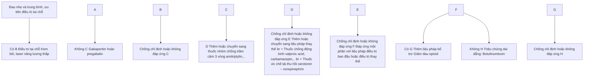

Chống chỉ định hoặc không đáp ứng -> Đáp ứng một phần với liệu pháp điều trị ban đầu hoặc điều trị thay thế

Có -> Thêm liệu pháp bổ trợ Giảm đau opioid
Không -> Triệu chứng dai dẳng: Botulinumtoxin

Chống chỉ định hoặc không đáp ứng -> Triệu chứng dai dẳng: Botulinumtoxin

- Điều trị tại chỗ:


102

+ Kem chứa lidocain và prilocain, ngày 3-4 lần. Miếng dán lidocain 5% có thể giúp giảm nhẹ triệu chứng trong một thời gian ngắn, có thể dán tối đa 3 miếng lên vùng tổn thương trong 12h mỗi ngày.

+ Kem bôi hoặc miếng dán capsaicin bôi tại chỗ: giảm lượng canxi đi vào tiền synap (bằng cách bám vào protein TRPV1 - một kênh canxi, cư trú trên màng tế bào thần kinh cảm giác đau và cảm giác biến nhiệt) nên dây thần kinh không thể truyền cảm giác đau trong một khoảng thời gian, từ đó làm giảm cảm giác đau đớn và phong tỏa viêm thần kinh. Sau khi ngưng sử dụng, tế bào thần kinh sẽ phục hồi. Liệu dùng: bôi ngày 3-4 lần, dừng điều trị nếu sau 7 ngày không có hiệu quả.

+ Điều trị bằng Botulinum toxin: một số thử nghiệm nhỏ đã đánh giá tiêm botulinum toxin tại chỗ có thể làm giảm đau sau 2 tuần, tác dụng kéo dài trung bình 16 tuần. Bệnh nhân cải thiện giấc ngủ và giảm sử dụng các thuốc giảm đau khác.

+ Laser năng lượng thấp: hỗ trợ làm giảm đau sớm.

- Điều trị toàn thân:

+ Thuốc chống co giật, động kinh:

  - Gabapentin: liều 900-2000mg/ngày.

  ✓ Tác dụng phụ: buồn ngủ, ngủ gà, chóng mặt, buồn nôn, đi loạng choạng, run.

  ✓ Hạn chế tác dụng phụ bằng cách tăng dần liều. Dùng 300mg vào ngày 1, 300mg x 2 lần vào ngày thứ 2, 300mg x 3 lần vào ngày thứ 3, sau đó tăng thêm mỗi 300mg/ngày cho đến liều tối đa nếu cần thiết.

  - Pregabalin: 150mg-300mg/ngày.

  ✓ Nên dùng tăng dần liều: 75mg x 2 lần mỗi ngày trong một tuần, sau đó 150mg x 2 lần mỗi ngày trong 1-3 tuần, sau đó 300mg x 2 lần mỗi ngày. Khi ngưng thuốc nên giảm liều pregabalin trong 1 tuần để giảm nguy cơ xuất hiện các triệu chứng cai. Tác dụng phụ có thể gặp như buồn ngủ, chóng mặt, khô miệng, tăng cân.

+ Nếu dùng thuốc chống co giật, động kinh không hiệu quả, có thể phối hợp thêm thuốc chống trầm cảm 3 vòng (amitriptylin). Amitriptylin bắt đầu với liều 10mg/ngày, liều tăng lên khi cần thiết và dung nạp được, tối đa 150mg/ngày. Tác dụng phụ: hạ huyết áp tư thế, ngủ gà, khô miệng, lú lẫn, táo bón, bí tiểu, tăng cân. Hạn chế tác dụng phụ bằng cách dùng liều tăng dần. Thận trọng trên bệnh nhân lớn tuổi, suy giảm nhận thức và sa sút trí tuệ, mắc bệnh tim, động kinh hoặc tăng nhãn áp.

+ Carbamazepin liều 400-1200mg/ngày. Tác dụng phụ: chóng mặt, buồn nôn lúc bắt đầu điều trị, hạn chế bằng tăng dần liều.


103

+ Nhóm thuốc giảm đau opioid (tramadol, fentanyl, morphin,...): có thể sử dụng đường uống hoặc đường truyền.

**4. PHÒNG BỆNH**

- Kiểm soát người cao tuổi có bệnh lý mạn tính, yếu tố nguy cơ cao.

- Sử dụng vắc xin: có 2 loại là vắc xin tái tổ hợp và vắc xin sống giảm độc lực.

  + Chỉ định:

  - ĐỐI TƯỢNG NGƯỜI LỚN TUỔI (TỪ 50 TUỔI TRỞ LÊN).

  - Người trưởng thành từ 19 tuổi trở lên có nguy cơ cao mắc Zona do có tình trạng suy giảm miễn dịch (dùng thuốc ức chế miễn dịch hoặc mắc các bệnh lý gây suy giảm miễn dịch khác). Với đối tượng này chỉ dùng vắc xin tái tổ hợp và chống chỉ định dùng vắc xin sống giảm độc lực

+ Cách dùng:

  - Vắc xin sống giảm độc lực: tiêm dưới da 1 mũi

  - Vắc xin tái tổ hợp: tiêm bắp 2 mũi, mỗi mũi cách nhau 2-6 tháng.


104

# **BỆNH DO HERPES SIMPLEX**
**(Herpes simplex)**

## **1. ĐẠI CƯƠNG**

### **1.1. Khái niệm**

Bệnh da do Herpes simplex là một bệnh gây ra do chủng virus Herpes thông qua hình thức tiếp xúc trực tiếp hoặc từ các chất bài tiết qua da, niêm mạc.

### **1.2. Dịch tễ**

- Bệnh gặp ở mọi lứa tuổi, thường gặp nhất ở người trẻ tuổi. Tỷ lệ nhiễm cao ở những nơi đông dân, chật chội và điều kiện vệ sinh kém.
- Bệnh thường tái phát, có thể một vài lần/năm.
- Bệnh thường nặng hơn và hay tái phát hơn ở người suy giảm miễn dịch, có bệnh ác tính, ghép tạng, điều trị hóa chất, dùng corticosteroid hay thuốc ức chế miễn dịch toàn thân kéo dài.

### **1.3. Căn nguyên/ Cơ chế bệnh sinh**

- Có 2 loại virus Herpes simplex chính là HSV1 và HSV2:
  + HSV1: thường gây bệnh ở da, viêm mạc phần trên của cơ thể như mắt, mũi, miệng. lây truyền bằng tiếp xúc trực tiếp với virus qua tổn thương trực tiếp hoặc qua nước bọt.
  + HSV2: thường gây bệnh ở da, viêm mạc bộ phận sinh dục, hậu môn. Bệnh lây truyền qua quan hệ tình dục.
  + Tuy nhiên hiện nay HSV1 cũng có thể gây bệnh ở bộ phận sinh dục, hậu môn và HSV2 cũng có thể gây bệnh ở phần trên của cơ thể (do quan hệ đường miệng - sinh dục).
- Ở trạng thái tiềm ẩn, virus cư trú ở các hạch thần kinh cảm giác. Khi tái hoạt động virus di chuyển dọc theo dây thần kinh đến da/niêm mạc gây hủy hoại các tế bào sừng.
- Virus có thể được đào thải ra bên ngoài theo nước bọt và chất bài tiết của bộ phận sinh dục ngay cả khi chưa có triệu chứng. Các bất thường về hệ miễn dịch và những bất thường tại da như viêm da cơ địa cũng là điều kiện thuận lợi để virus phát triển.

## **2. CHẨN ĐOÁN**

### **2.1. Lâm sàng**

- Vị trí tổn thương: da, bán niêm mạc, niêm mạc.
- HSV tiên phát:


105

+ Thời gian ứ bệnh: 3 - 5 ngày.

+ Tiền triệu: ngứa, đám đút tại chỗ.

+ Toàn phát: tổn thương cơ bản là mụn nước trên nền dát đỏ, mụn nước bằng đầu đỉnh ghim căng tròn bên trong chứa dịch vàng hoặc trong suốt, thường đứng thành cụm từ 2 - 10 mụn nước. Có khi các mụn nước liên kết với nhau thành bọc nước nhỏ. Các mụn nước, bọc nước sắp xếp thành hình vòng cung, vỡ sau vài ngày để lại các vết trợt hình đa cung.

+ Triệu chứng toàn thân: có thể sốt, mệt mỏi, chán ăn, hạch lân cận sưng to, đau.

- HSV tái phát:

+ Sau khi nhiễm tiên phát, các triệu chứng bệnh khởi, bệnh nhân có thể không có biểu hiện lâm sàng nào trong suốt cuộc đời.

+ Yếu tố nguy cơ có thể như sang chấn nhẹ, các bệnh nhiễm trùng khác, viêm đường hô hấp trên, tia tử ngoại, các phẫu thuật, một số phụ nữ tái phát liên quan đến chu kỳ kinh nguyệt, các stress

+ Triệu chứng lâm sàng thường nhẹ hơn, khu trú hơn.

- Biến chứng: viêm màng não, eczema herpeticum.

**2.2. Cận lâm sàng**

- Xét nghiệm tế bào Tzanck: thấy tế bào da nhân không lõ, tế bào gai lệch hình.

- Xét nghiệm huyết thanh ELISA tìm kháng thể kháng HSV (IgG và IgM).

- Xét nghiệm tìm virus: PCR.

**2.3. Chẩn đoán xác định**

Dựa vào lâm sàng và cận lâm sàng.

**2.4. Chẩn đoán phân biệt**

- Zona

- Chốc bọc nước

- Duhring-Brocq

- Các loét sinh dục khác: hạ cam, giang mai, vết loét sang chấn vùng sinh dục, săng ghề, pemphigus, Behcet..

- Viêm da tiếp xúc kích ứng do côn trùng


106

# 3. **ĐIỀU TRỊ**

## 3.1 Nguyên tắc điều trị

- Điều trị tại chỗ: sử dụng thuốc sát khuẩn tại chỗ làm giảm nguy cơ nhiễm khuẩn.
- Điều trị toàn thân: sử dụng thuốc kháng virus. Trường hợp nhẹ, tổn thương da ít, không có biến chứng có thể không cần điều trị toàn thân.

## 3.1. **Điều trị cụ thể**

### 3.1.1. **Điều trị tại chỗ**
- Dùng các dung dịch sát khuẩn tại chỗ
- Kháng sinh bôi tại chỗ chống nhiễm khuẩn như mupirocin, acid fusidic

### 3.1.2. **Điều trị toàn thân**
Lựa chọn một trong các phác đồ dưới đây, ưu tiên aciclovir do tương đương về hiệu quả và tối ưu chi phí điều trị.

| Điều trị HSV tiên phát                                                                                                                                                                                                                                                                                                                                                                                                                                                                                        | Điều trị HSV tái phát                                                                                                                                                                                                       | Điều trị dự phòng                                                                                                                                                                                                                                                                                                                                                           |
| ------------------------------------------------------------------------------------------------------------------------------------------------------------------------------------------------------------------------------------------------------------------------------------------------------------------------------------------------------------------------------------------------------------------------------------------------------------------------------------------------------------- | --------------------------------------------------------------------------------------------------------------------------------------------------------------------------------------------------------------------------- | --------------------------------------------------------------------------------------------------------------------------------------------------------------------------------------------------------------------------------------------------------------------------------------------------------------------------------------------------------------------------- |
| - Trường hợp mắc mức độ nhẹ và vừa:<br/>+ Aciclovir uống 400mg x 3 lần/ngày x 5 – 10 ngày<br/>+ Aciclovir uống 200mg x 5 lần/ngày 5 – 10 ngày<br/>+ Valaciclovir uống 500mg x 2 lần/ngày 5 – 10 ngày<br/>+ Famciclovir uống 250mg x 3 lần/ngày 5 – 10 ngày<br/>+ Trẻ em: 15mg/kg x 5 lần/ngày x 7 ngày.<br/>+ Trẻ sơ sinh: aciclovir tĩnh mạch 60mg/kg/ngày chia 3 lần x 2 – 3 tuần.<br/>- Trường hợp nặng /nguy cơ biến chứng nghiêm trọng: aciclovir 5mg/kg đường tĩnh mạch mỗi 8 giờ trong ít nhất 5 ngày. | - Aciclovir uống 800mg 3 lần/ngày x 2 ngày hoặc 400mg x 3 lần/ngày trong 3 – 5 ngày.<br/>- Famciclovir 1g 2 lần/ngày x 1 ngày hoặc 125mg x 2 lần/ngày trong 3 – 5 ngày.<br/>- Valaciclovir 500mg x 2 lần/ngày trong 3 ngày. | - Phác đồ ưu tiên:<br/>+ Aciclovir 400mg x 2 lần/ngày (cho tất cả bệnh nhân tái phát ≥6 đợt/năm)<br/>+ Valaciclovir 500mg hàng ngày nếu tái phát ≤ 10 đợt/năm<br/>+ Valaciclovir 1g hàng ngày nếu tái phát > 10 đợt/năm<br/>- Nếu thất bại với phác đồ ưu tiên:<br/>+ Aciclovir 400mg x 3 lần/ngày<br/>+ Aciclovir 200mg x 4 lần/ngày<br/>+ Valaciclovir 500mg x 2 lần/ngày |


- Điều trị biến chứng nếu có.


107

# 4. **PHÒNG BỆNH**

- - Không tiếp xúc trực tiếp hoặc tiếp xúc với chất bài tiết qua da, niêm mạc của người mắc herpes simplex.

- - Nâng cao thể trạng, dự phòng tái phát.


108

# **BỆNH THỦY ĐẬU**
**(Varicella)**

## **1. ĐẠI CƯƠNG**

### **1.1. Khái niệm**

Thủy đậu là bệnh lý phát ban và mụn nước cấp tính, có thể lây truyền thành dịch. Bệnh thường lành tính, tuy nhiên cũng có thể gây biến chứng nguy hiểm như viêm phổi, viêm não...

### **1.2. Dịch tễ**

Bệnh lây truyền trực tiếp từ người sang người, qua đường hô hấp, thường xảy ra ở trẻ em.

### **1.3. Căn nguyên/ Cơ chế bệnh sinh**

Tác nhân gây thủy đậu là Varicella zoster virus-VZV, thuộc họ Herpeviridae. Đường lây chủ yếu qua hô hấp, virus được bài tiết qua niêm mạc mũi họng và truyền cho người khác. Virus cũng được bài xuất qua các tổn thương mụn nước và lây truyền cho trực tiếp cho người nhiễm. Bệnh nhân có thể lây bệnh cho người khác từ 1-2 ngày trước khi nổi ban đỏ cho đến khi mụn nước cuối cùng đóng vảy tiết.

## **2. CHẨN ĐOÁN**

### **2.1. Triệu chứng lâm sàng**

- Thời gian ủ bệnh khoảng 14 ngày (10 - 23 ngày). Trước khi xuất hiện các mụn nước thủy đậu có thể có triệu chứng toàn thân như: sốt, nhức đầu, mệt mỏi...

- Triệu chứng da xuất hiện sớm nhất là các ban đỏ, các sẩn sau đó nhanh chóng thành các mụn nước. Các mụn nước rất nhỏ như những giọt sương trên cánh hoa hồng, nông, xung quanh là quầng đỏ, ở giữa lõm. Kích thước mụn nước khoảng 2-3mm. Mụn nước nhanh chóng thành mụn mủ và đóng vảy tiết, có thể mọc ở niêm mạc mắt miệng, để lại vết trọt nông nhưng thường ít. Trên người bệnh cùng lúc các tổn thương là sẩn, mụn nước, mụn mủ và vảy tiết.

- Những biến chứng nghiêm trọng của thủy đậu có thể xảy ra trên những người có suy giảm miễn dịch như dùng corticosteroid, các thuốc ức chế miễn dịch khác, nhiễm HIV/AIDS... Các biến chứng khác có thể xảy ra là viêm phổi, viêm não - màng não, nhiễm khuẩn tại chỗ... Phụ nữ có thai mắc thủy đậu trong 3 tháng đầu thai kỳ có thể gây sảy thai, tử vong thai nhi hay bị dị tật như đầu nhỏ, bại não, sẹo trên da bẩm sinh do các nốt thủy đậu để lại...

### **2.2. Cận lâm sàng**

- Xét nghiệm tế bào Tzanck: có tế bào da nhân không lõm tại nền bong nước của tổn


109

thương.

- Xét nghiệm tìm căn nguyên: PCR
- Xét nghiệm đánh giá tình trạng viêm: CRP, bạch cầu, máu lắng... có thể tăng
- Xquang ngực trong trường hợp nghi ngờ viêm phổi

**2.3. Chẩn đoán xác định**

Dựa vào lâm sàng và xét nghiệm tế bào học dịch tổn thương trong một số trường hợp không điển hình.

**2.4. Chẩn đoán phân biệt.**

- Bệnh tay chân miệng
- Chốc
- Herpes simplex
- Zona trên bệnh nhân suy giảm miễn dịch
- Eczema herpeticum

**3. ĐIỀU TRỊ**

**3.1. Nguyên tắc điều trị**

- Điều trị sớm, nâng cao thể trạng
- Sử dụng thuốc kháng vi rút
- Điều trị biến chứng

**3.2. Điều trị cụ thể**

**3.2.1. Điều trị tại chỗ**

- Chăm sóc các tổn thương da: dùng các dung dịch sát khuẩn, kháng sinh chống bội nhiễm
- Khi mắc bệnh vẫn cần vệ sinh hàng ngày để tránh nhiễm trùng.

**3.2.2. Điều trị toàn thân**

- Điều trị thuốc kháng virus:

+ Đối với những người có nguy cơ cao bị biến chứng như người lớn chưa tiêm phòng, phụ nữ có thai, người bị suy giảm miễn dịch, nên sử dụng thuốc kháng virus sớm trong vòng 24 giờ đầu sau khi phát ban:

- Người lớn và trẻ $\ge 12$ tuổi: Aciclovir 800 mg, uống 5 viên/ ngày, chia 5 lần, cách 4h uống 1 viên, trong 1 tuần hoặc valaciclovir 1g, uống 3 lần/ ngày, cách nhau 8h, trong 1 tuần, hoặc famciclovir 500mg, uống 3 lần/ ngày, cách nhau 8h, trong 7-10 ngày.


110

- Trẻ <12 tuổi: aciclovir 20 mg/kg 6 giờ một lần hoặc valaciclovir 20mg/kg, cách nhau 8h uống 1 liều, trong 5-7 ngày.

- Người bệnh suy giảm miễn dịch nặng, thủy đậu biến chứng viêm não: ưu tiên aciclovir tĩnh mạch, ít nhất trong giai đoạn đầu, liều 10 - 12,5 mg/kg, 8 giờ một lần, để làm giảm các biến chứng, thời gian điều trị là 7 ngày.

- Điều trị biến chứng viêm phổi, bội nhiễm tổn thương da nếu có.

- Điều trị hỗ trợ:
  + Hạ sốt bằng paracetamol, tránh dùng aspirin để ngăn ngừa hội chứng Reye
  + Giảm ngứa bằng kháng histamin
  + Tăng cường dinh dưỡng

**4. PHÒNG BỆNH**

- Tránh tiếp xúc với nguồn lây, người mắc bệnh nên cách ly với những người khác trong cộng đồng cho đến khi khỏi bệnh.

- Tiêm phòng vắc xin thủy đậu. Vaccin thủy đậu là vaccin sống giảm độc lực, tái tổ hợp được chỉ định cho tất cả trẻ em trên 1 tuổi chưa mắc thủy đậu và người lớn chưa có kháng thể. Vaccin thủy đậu có tính an toàn và hiệu quả cao.


111

# **BỆNH HẠT CƠM**
**(Warts)**

## **1. ĐẠI CƯƠNG**

### **1.1. Định nghĩa**

Bệnh hạt com (bệnh mụn cóc do virus) là tình trạng bệnh lý với sự tăng sinh lành tính của các tế bào biểu bì ở da và niêm mạc, do virus có tên *Human Papilloma Virus* (HPV) gây nên.

### **1.2. Dịch tễ**

Hạt com là bệnh thường gặp, bệnh xuất hiện ở mọi lứa tuổi và mọi giới. Tuy nhiên, thường gặp nhất ở tuổi lao động, đặc biệt là học sinh và sinh viên. Tỷ lệ mắc bệnh cao hơn ở những người suy giảm miễn dịch, đặc biệt là suy giảm miễn dịch bẩm sinh hay mắc phải.

Sự lây nhiễm HPV có thể do tiếp xúc trực tiếp giữa người với người qua da bị xâm sát hoặc qua các vật dụng trung gian như giày dép, dụng cụ thể thao...

### **1.3. Căn nguyên/ Cơ chế bệnh sinh**

Có khoảng trên 100 tuýp HPV đã được xác định và được chia thành 3 nhóm: tuýp gây bệnh da: tuýp 1, 2, 3, 4; tuýp gây bệnh ở niêm mạc sinh dục: tuýp 6, 11, 16, 18 và type gây loạn sản biểu bì dạng hạt com là tuýp 5 và 8.

## **2. CHẨN ĐOÁN**

### **2.1. Triệu chứng lâm sàng**

- Hạt com thông thường (common warts)
  + Thường gặp nhất.
  + Tổn thương ban đầu là những sẩn nhỏ bằng hạt kê, màu da. Sau vài tuần hoặc vài tháng, thương tổn lớn dần, nổi cao, có hình bán cầu, bề mặt sùi thô ráp, dày sừng với nhiều kích thước khác nhau. Các thương tổn rải rác hoặc thành dải hoặc thành đám hay gặp ở mu bàn tay, mu bàn chân, ngón tay và ngón chân, quanh móng, da đầu.

- Hạt com bàn tay, bàn chân (palmo-plantar warts)
  + Hạt com ở bàn tay, bàn chân thường đa dạng. Diễn hình là các sẩn, kích thước từ 2-10mm, bề mặt xù xì làm mất những đường vân trên bề mặt, sắp xếp riêng rẽ hoặc tập trung thành đám ở những vùng tỷ đè, quanh móng được gọi là hạt com thể khám. Đôi khi biểu hiện của hạt com chỉ là sẩn nhẵn, bằng phẳng với mặt da, màu vàng đục hoặc sần xù xì có gai nhỏ và lõm ở giữa. Bệnh nhân thường đau khi đi lại.


112

+ Khi dùng dao mổ gọt bỏ phần dày sừng thấy bên dưới là một mô màu trắng trên có các chấm đen do hiện tượng tắc các mạch máu nhỏ tạo nên. Đây là dấu hiệu có giá trị giúp chẩn đoán phân biệt giữa hạt com với những bệnh khác như chai chân hay dày sừng bàn tay bàn chân khu trú.

- Hạt com phẳng (flat warts): Tổn thương là các sẩn hơi nổi cao trên mặt da, bề mặt phẳng, kích thước nhỏ từ 1 đến 5 mm, hình tròn hay hình đa giác, màu da hay thâm vàng nâu, ranh giới rõ đứng riêng rẽ hay thành đám, đôi khi thành dải (dấu hiệu Koebner). Số lượng tổn thương thường ít nhưng ở những trường hợp lan tỏa có tới vài trăm tổn thương, hay gặp ở vùng da hở nhất là ở mặt, cánh tay và thân mình.

**2.2. Cận lâm sàng**

- PCR HPV: dương tính.

- Mô bệnh học: thường được sử dụng để chẩn đoán phân biệt với ung thư da hoặc các bệnh lý da khác. Hình ảnh tăng sinh thượng bì, các tế bào nhiễm virus là các koilocyte (nhân lớn, bất màu kiềm, xung quanh là quang sáng halo, nguyên sinh chất ít).

- Dermoscopy: trường hợp điển hình có thể quan sát thấy các điểm đen trên nền tổn thương sùi.

**2.3. Chẩn đoán xác định**

Chủ yếu dựa vào triệu chứng lâm sàng và xét nghiệm HPV, mô bệnh học trong trường hợp cần thiết.

**2.4. Chẩn đoán phân biệt**

- Hạt com thông thường: cần phân biệt với dày sừng da đầu, dày sừng ánh nắng, ung thư tế bào gai.

- Hạt com lòng bàn tay, bàn chân: cần chẩn đoán phân biệt với mắt cá, chai chân, dày sừng lòng bàn tay, bàn chân mắc phải.

- Hạt com phẳng: cần phân biệt với các sẩn trong bệnh lichen phẳng, u mềm lây...

**3. ĐIỀU TRỊ**

**3.1. Nguyên tắc điều trị**

- Bệnh có thể tự khỏi trong trường hợp miễn dịch tốt.

- Loại bỏ tổn thương

- Dự phòng tái phát.

**3.2. Điều trị cụ thể**

**3.2.1. Thuốc bôi tại chỗ**

- Mỡ salicylic: mỡ salicylic với nồng độ khác nhau từ 10% đến 40%, có tác dụng bặt sừng mạnh, loại bỏ các tế bào chứa virus. Tùy từng loại tổn thương và tùy theo vị trí


113

mà có thể sử dụng thuốc với nồng độ khác nhau từ 10% đến 40%. Bạng bột làm thuốc có thể ngấm sâu vào thương tổn có tác dụng điều trị tốt hơn.

- Acid trichloracetic 33-100%: có tác dụng đông vốn protein và gây hoại tử tế bào sừng. Ưu điểm là rẻ tiền, nhược điểm là có thể gây đau nhiều và gây loét do bôi thuốc quá nhiều

- Kem tretinoin 0,05%-0,1% có tác dụng bạt sừng, thường được dùng để điều trị hạt cơm phẳng, nhất là ở trẻ em.

- Sulfat kẽm dạng dung dịch bôi tại chỗ, ngày bôi 1 đến 2 lần. Phân tử kẽm gắn lên các phân tử glycoprotein trên bề mặt virus làm ngăn cản sự thâm nhập của virus vào tế bào. Thuốc ít gây kích ứng và cho kết quả tốt đối với những trường hợp nhiều thương tổn.

- Podophyllotoxin 25% là thuốc chống phân bào. Chấm thuốc ngày 2 lần, trong 3 ngày, sau đó ngừng 4 ngày. Nếu còn thương tổn lại tiếp tục điều trị với liệu trình như trên, tối đa có thể điều trị trong thời gian 5 tuần. Cần lưu ý bôi đúng thương tổn và phải rửa tay sau khi dùng thuốc vì thuốc có thể gây kích ứng ở da và niêm mạc. Cần thận trọng sử dụng thuốc đối với phụ nữ có thai vì có thể gây ảnh hưởng đến sự phát triển của thai nhi.

- Immiquimod: Kem immiqimod 5% bôi ngày 2 lần trong 6 đến 12 tuần. Hiệu quả hạn chế với các tổn thương dày sừng, tốt hơn với các tổn thương ở niêm mạc.

**3.2.2. Tiêm nội thương tổn**

Leomycin có tác dụng gây độc tế bào, tiêm nồng độ 1 UI/ml nội thương tổn.

**3.2.3. Liệu pháp lạnh**

Sử dụng nitơ lạnh ở nhiệt độ -196°C gây bỏng lạnh làm bong thương tổn. Phương pháp xịt ni tơ lỏng thường được sử dụng hơn chấm ni tơ lỏng và áp nitơ vì dễ sử dụng và hiệu quả cao. Thời gian liền thương sau thủ thuật nhanh hơn so với laser. Nhược điểm của phương pháp này là có thể cần thực hiện nhiều lần.

**3.2.4. Laser**

- Loại laser thường được sử dụng nhất là laser CO2 làm phá vỡ tế bào và làm bốc bay toàn bộ tổ chức. Phương pháp có ưu điểm làm sạch nhanh thương tổn trong 1 lần điều trị. Tuy nhiên, vết thương thường lâu, tỉ lệ tái phát cao với hạt cơm dưới mỏng và quanh mỏng.

- Laser màu: phá hủy các mạch máu làm giảm nguồn nuôi dưỡng các tế bào chứa virus từ đó có tác dụng điều trị bệnh. Thường áp dụng để điều trị hạt cơm phẳng với số lượng thương tổn nhiều, đặc biệt ở mặt vì ưu điểm ít đau, nguy cơ sẹo sau thủ thuật rất thấp. Khoảng cách giữa các lần điều trị là 1 tháng/lần. Nhược điểm của phương pháp là đắt tiền.


114

- Laser Nd:YAG xung dài cũng có thể sử dụng để điều trị hạt com, cho kết quả cao với số lần điều trị 1-3 lần, cách nhau 2-4 tuần/lần. Ưu điểm là vết thương nhanh liền, ít ảnh hưởng đến sinh hoạt hàng ngày của bệnh nhân. Nhược điểm là đau và đắt tiền.

- Điều trị bằng plasma: hiệu quả cao tương tự như điều trị bằng laser nhưng do nhiệt lan tỏa lớn hơn laser nên thời gian liền thương chậm hơn.

**4. PHÒNG BỆNH**

- Sát khuẩn làm vệ sinh thường xuyên các địa điểm công cộng như bể bơi, nhà tắm công cộng, phòng tập thể thao...

- Cần có bảo hộ lao động đối với một số nghề nghiệp có nguy cơ mắc bệnh cao như: thợ giết mổ gia súc, trồng hoa...

- Điều trị loại bỏ các tổn thương nếu có thể nhằm loại bỏ nguồn lây nhiễm.


115

# **U MỀM LÃY**

**(Molluscum Contagiosum)**

## **1. ĐẠI CƯƠNG**

### **1.1. Khái niệm**

U mềm lây là bệnh nhiễm trùng da do *Molluscum Contagiosum Virus* (MCV) gây nên, đặc trưng bởi các sẩn lồi giữa, sò mềm, rải rác trên cơ thể.

### **1.2. Dịch tễ**

- Bệnh có thể xảy ra ở bất kỳ lứa tuổi nào nhưng thường gặp nhất ở trẻ em.
- Phương thức lây truyền là tiếp xúc trực tiếp hay gián tiếp qua các dụng cụ, tấm cùng bề tấm, dùng khăn, dụng cụ thể thao chung hoặc ngồi cùng ghế.

### **1.3. Căn nguyên/ Cơ chế bệnh sinh**

Virus MCV thuộc nhóm poxvirus, có 4 type virus là MCV 1, 2, 3 và 4. Hai type thường gặp là MCV 1 và MCV 2. Tuy nhiên, type 1 là nguyên nhân chủ yếu còn type 2 thường gây u mềm lây ở người lớn và được xếp vào nhóm các bệnh lây truyền qua đường tình dục.

## **2. CHẨN ĐOÁN**

### **2.1. Triệu chứng lâm sàng**

- Thời gian ủ bệnh: từ 2 tuần đến 6 tháng.

- Tổn thương cơ bản là các sẩn mềm màu hồng nhạt, trắng đục hoặc vàng hoặc màu da thường với kích thước từ 2-6mm đường kính, lồi giữa, đứng riêng rẽ hoặc thành từng đám, có thể sắp xếp thành dải, theo vết (dấu hiệu Koebner). Vị trí thường gặp ở trẻ em là vùng da hở như mặt, cổ, nếp gấp. Vị trí thường gặp ở người lớn là vùng bụng dưới, phía trong đùi, xương mu và sinh dục. Bệnh có thể xuất hiện ở một vài vị trí ít gặp như miệng, lưỡi, lòng bàn tay, bàn chân.

- Ở những bệnh nhân bị suy giảm miễn dịch như nhiễm HIV, mắc các bệnh mạn tính, bẩm sinh, hoặc điều trị bằng các thuốc ức chế miễn dịch, tổn thương u mềm lây thường có kích thước lớn hơn, lan tỏa toàn thân với số lượng nhiều và tồn tại dai dẳng.

### **2.2. Cận lâm sàng**

- Xét nghiệm tế bào Tzanck: phát hiện các tế bào sừng có kích thước lớn, trong chứa nhiều thể virus (tiểu thể mềm lây).

- Mô bệnh học: Ít khi chỉ định, thường làm để chẩn đoán phân biệt với các bệnh da khác.

- Dermoscopy: hình ảnh cấu trúc màu trắng ở trung tâm, giãn mạch máu ở rìa tổn thương tạo hình ảnh vuông miền.


116

- PCR: ít khi sử dụng.

**2.3. Chẩn đoán xác định**

Chủ yếu dựa vào các đặc điểm lâm sàng và xét nghiệm tế bào học

**2.4. Chẩn đoán phân biệt**

- Milia.
- Hạt com phẳng.
- U ống tuyến mồ hôi.
- Tổn thương da do *Penicillium marneffei*.

**3. ĐIỀU TRỊ**

**3.1. Nguyên tắc điều trị**

- Loại bỏ tổn thương.
- Phòng tránh tái nhiễm.
- Điều trị các bệnh kèm theo: viêm da cơ địa, khô da.

**3.2. Điều trị cụ thể**

- Loại bỏ tổn thương bằng curett
- Điều trị bằng các thuốc bôi:
  + Dung dịch KOH 5- 10%: chấm dung dịch lên đúng tổn thương bằng tăm nhọn, ngày một lần cho đến khi tổn thương đỡ, đóng vảy tránh vị trí sát mắt. Ưu điểm là phương pháp rẻ tiền. Thận trọng có thể gây loét hoặc sẹo xấu nếu chấm một lượng thuốc lớn.
  + Salicylic 10-30%: bôi ngày 2-3 lần cho đến khi hết tổn thương.
  + Imiquimod 5%: bôi thuốc vào buổi tối, rửa sạch sau 8-10 giờ. Một tuần bôi ba ngày liên tiếp, nghỉ 4 ngày, tuần tiếp theo điều trị với liều trình tương tự. Thời gian bôi tối đa có thể tới 16 tuần. Không dùng cho trẻ < 12 tuổi
  - Một số phương pháp điều trị khác: bôi cantharidin, podophyllotoxin.

**4. PHÒNG BỆNH**

- Vệ sinh cá nhân.
- Tránh tiếp xúc với nguồn lây bệnh, nhất là ở những nơi có nhiều virus như bể bơi, nhà tắm công cộng.
- Cần theo dõi và điều trị sớm ở những người có nguy cơ mắc bệnh cao như trẻ em mắc viêm da cơ địa, khô da.


117

# Chương 4

# **BỆNH DA TỰ MIỄN**


118

# **BỆNH LUPUS BAN ĐỎ HỆ THỐNG**
*(Systemic lupus erythematosus)*

## **1. ĐẠI CƯƠNG**

### **1.1. Khái niệm**
Lupus ban đỏ hệ thống là bệnh lý tự miễn, do tự kháng thể và phức hợp miễn dịch lưu hành trong máu đến các cơ quan gây tổn thương nhiều cơ quan như da, niêm mạc, gan, thận, khớp, tim, phổi, hệ thần kinh.

### **1.2. Dịch tễ**
Bệnh thường gặp ở phụ nữ trong độ tuổi 20-50 tuổi, nam giới ít gặp hơn.

### **1.3. Căn nguyên/Cơ chế bệnh sinh**
- Căn sinh bệnh học của lupus ban đỏ hệ thống rất phức tạp, do nhiều yếu tố tham gia: di truyền, hormon, rối loạn miễn dịch, yếu tố môi trường. Trong đó hai yếu tố chính, quan trọng nhất được cho là có liên quan trực tiếp đến bệnh là di truyền và rối loạn miễn dịch.
  + Di truyền: đã xác định được một số gen có liên quan đến bệnh, đó là HLA-B8, HLA-DR 3, HLA-DRw52, HLA-DQw1.
  + Rối loạn miễn dịch: có hiện tượng mất cân bằng trong hệ thống miễn dịch. Tế bào lympho B không bị kiểm soát sẽ tăng sinh để sản xuất một lượng lớn các tự kháng thể chống lại các tự kháng nguyên. Tự kháng thể kết hợp với các tự kháng nguyên tạo thành phức hợp miễn dịch lắng đọng tại các mao mạch, cơ quan, tổ chức cùng với các bổ thể gây nên các hiện tượng bệnh lý ở nhiều tổ chức, cơ quan.
    - Một số yếu tố liên quan khác
    + Nội tiết tố nữ: bệnh hay gặp ở nữ giới.
    + Thuốc: một số thuốc có khả năng gây bệnh giống như lupus đã được xác định: hydralazin, procainamid, isoniazid, sulfonamid, phenytoin, D-penicillamin, minocyclin... Thuốc tránh thai cũng có vai trò trong việc khởi động hay làm bệnh nặng thêm.
      + Nhiễm trùng: đặc biệt là các nhiễm trùng kinh điển.
      + Ánh nắng mặt trời: đóng vai trò quan trọng trong sinh bệnh học của bệnh.

## **2. CHẨN ĐOÁN**

### **2.1. Triệu chứng lâm sàng**

#### **2.1.1. Triệu chứng toàn thân**
Sốt, mệt mỏi, gây sút là những biểu hiện hay gặp, đặc biệt trong giai đoạn bệnh tiến triển.

#### **2.1.2. Tổn thương da, niêm mạc, tóc**
- Tổn thương da
+ Tổn thương da đặc hiệu:
  - Tổn thương cấp tính: ban đỏ khu trú hình cánh bướm ở hai má, mặt, hơi phù, có thể tồn tại trong nhiều tuần, nhiều tháng. Dát đỏ lan tỏa xuất hiện ở tay, chân


119

hay, thân mình ít gặp hơn. Các hát nhạy cảm với ánh nắng mặt trời. Hiếm gặp ban cấp tính dạng hoại tử thượng bì.

- Tổn thương bán cấp: tổn thương dát sần bong vảy dạng "vảy nến" vùng ngực, lưng, cánh tay. Tổn thương mảng hình nhẫn, hình vòng, trung tâm không có vảy. Một số trường hợp hiếm gặp bong nước căng hoặc ban đỏ bán cấp dạng hoại tử thượng bì.

- Tổn thương mạn tính: lupus ban đỏ dạng đĩa khu trú hoặc lan tỏa: mảng đỏ, trên có vảy da, sần sùng nang lông, chậm lành, khi khởi để lại tăng sắc tố, sẹo trắng, teo da trung tâm. Lupus thể phi đại, lupus profundus, viêm mô mỡ, lupus tumidus, lupus dạng cuốc là những tổn thương da mạn tính ít gặp.

+ Tổn thương da không đặc hiệu: sần phù, ban xuất huyết, viêm mạch/mao mạch gây xuất huyết, loét, hoại tử, viêm mạch dạng mạng lưới, lắng đọng canxi, hội chứng raynaud, tổn thương bong nước,... có thể gặp.

- Tổn thương niêm mạc: Môi, miệng, mũi, sinh dục trong đó thường gặp nhất ở niêm mạc khẩu cái cứng. Biểu hiện dát đỏ, xuất huyết, trợt, loét và thường không đau.

- Rụng tóc

+ Rụng tóc không sẹo kiểu rụng thưa hay rụng lan tỏa toàn bộ có thể gặp. Tóc có thể mọc lại khi lùi bệnh.

+ Rụng tóc có sẹo gây mất các nang tóc và không thể mọc lại.

**2.1.3. Tổn thương các cơ quan**

- Tổn thương khớp: viêm sưng đau, cứng khớp nhỏ nhỏ (hay gặp khớp bàn ngón tay, ngón chân, cổ tay, khuỷu tay, đầu gối...) gây hạn chế vận động. Một số có thể gặp tràn dịch các khớp.

- Viêm cơ: viêm cơ, yếu cơ. Triệu chứng hồi phục nhanh sau điều trị bằng corticosteroid đường toàn thân.

- Tổn thương thận: viêm thận lupus với tổn thương tiểu cầu thận hoặc mô kẽ, ống thận.

- Tim mạch: tràn dịch ngoài màng tim, nhịp nhanh, có thể gặp tim to, suy tim. Viêm nội tâm mạc cấp và bán cấp do vi khuẩn có thể phối hợp với tổn thương van tim trong hội chứng Libman-Sacks. Tăng áp động mạch phổi ít gặp.

- Phổi: viêm màng phổi, tràn dịch màng phổi số lượng ít, viêm phổi kẽ, có thể gây triệu chứng đau ngực, khó thở.

- Thần kinh, tâm thần: rối loạn phương hướng, tri giác, trí nhớ. Đôi khi có đau đầu dữ dội, rối loạn tâm thần hoặc động kinh, co giật. Biểu hiện của rối loạn vận động như múa giật, múa vờn, bất thường thị lực, rối loạn dây thần kinh sọ cũng có thể gặp. Triệu chứng tâm thần có thể nặng thêm khi dùng corticosteroid liều cao kéo dài.

- Tiêu hóa: nôn, buồn nôn, chán ăn. Đau bụng ít gặp nhưng là một triệu chứng rất quan trọng. Có thể gặp viêm gan, xơ gan, tăng men gan.

- Hạch bạch huyết: hạch ngoại biên to, đặc biệt là giai đoạn bệnh nặng và thường


120

gặp hơn ở trẻ em. Có thể phối hợp với gan to, lách to.
- Huuyết học: thiếu máu (mệt mỏi, da niêm mạc nhợt), xuất huyết dưới da.

**2.2. Cận lâm sàng**

**2.2.1. Tự kháng thể**
- Kháng thể kháng nhân (ANA) bằng kỹ thuật miễn dịch huỳnh quang trên tế bào hep-2 và/hoặc kỹ thuật elisa thường dương tính.
- Kháng thể đặc hiệu: kháng thể kháng DNA chuỗi kép (dsDNA), kháng thể kháng Smith, kháng thể kháng phospholipid.
- Một số kháng thể khác có thể gặp: kháng thể kháng Ro, kháng thể kháng La, kháng thể kháng U1RNP, kháng thể kháng histon,...

**2.2.2. Xét nghiệm khác**
- Xét nghiệm máu
  + Công thức máu: giảm hồng cầu, bạch cầu lympho, tiểu cầu.
  + Máu lắng, protein C phản ứng tăng.
  + Bổ thể: C4, C3, CH50 giảm, đặc biệt trong các đợt bệnh hoạt động.
  + Sinh hóa máu: chức năng gan, thận, men cơ có thể biến đổi nếu có tổn thương cơ quan. Giảm albumin, protein và thay đổi mỡ máu trong hội chứng thận hư do lupus. Đường máu, điện giải đồ, acid uric cần thiết theo dõi điều trị.
    - Xét nghiệm nước tiểu
      + Tổng phân tích nước tiểu: protein niệu, hồng cầu niệu, trụ niệu...
      + Protein niệu 24 giờ
    - Xét nghiệm chẩn đoán hình ảnh
      + Xquang ngực, cắt lớp vi tính ngực phát hiện tổn thương xơ phổi, tràn dịch màng phổi, màng tim
      + Đo chức năng hô hấp.
      + Siêu âm tim, điện tim.
      + Siêu âm thận, chụp cắt lớp vi tính, chụp cộng hưởng từ (MRI) sọ não, điện não... khi có triệu chứng thần kinh.
        + Soi mao mạch nền mỏng có thể thấy giãn mạch nền mỏng.
      - Sinh thiết da: có vai trò quan trọng trong chẩn đoán tổn thương da đặc hiệu trong lupus.
      - Sinh thiết thận: chẩn đoán xác định tổn thương thận lupus.

**2.3. Chẩn đoán xác định**
Có thể sử dụng 1 trong 3 tiêu chuẩn:

**2.3.1. Tiêu chuẩn ACR 1997**
Bệnh nhân được chẩn đoán SLE khi có $\ge 4/11$ tiêu chuẩn cả trong tiền sử bệnh và tại thời điểm thăm khám gồm:
1. Ban hình cánh bướm ở mặt: cố định, phồng hoặc gồ lên mặt da, lan tỏa hai bên má.


121

2. Ban dạng đĩa: hình tròn gờ lên mặt da, lõm ở giữa có thể kèm theo sẹo teo da.
3. Nhạy cảm ánh sáng: khi tiếp xúc với ánh sáng có thể gây ban đỏ xuất hiện.
4. Loét miệng: bao gồm loét miệng, mũi họng do thầy thuốc quan sát thấy.
5. Viêm khớp: một hoặc nhiều khớp ngoại biên với cứng khớp, sung hoặc tràn dịch.
6. Viêm thanh mạc:
  - Viêm màng phổi.
  - Viêm màng ngoài tim.
7. Tổn thương thận: protein niệu thường xuyên cao hơn 0,5g/24h hoặc hơn (+++) nếu không định lượng hoặc cận tế bào.
8. Rối loạn về tâm, thần kinh: co giật hoặc rối loạn tâm thần trong điều kiện không do các nguyên nhân khác.
9. Rối loạn huyết học: thiếu máu tan máu; hoặc giảm bạch cầu dưới 4G/L; hoặc giảm lympho bào dưới 1.5G/L hoặc giảm tiểu cầu dưới 100G/L khi không có sai lầm trong dùng thuốc.
10. Rối loạn miễn dịch: xuất hiện kháng thể kháng dsDNA, kháng Sm và/hoặc kháng phospholipid.
11. Kháng thể kháng nhân (ANA) dương tính.

**2.3.2. Tiêu chuẩn SLICC 2012**

Chẩn đoán Lupus ban đỏ hệ thống khi có ≥ 4/17 tiêu chuẩn trong đó có ít nhất 1 tiêu chuẩn lâm sàng và 1 tiêu chuẩn cận lâm sàng hoặc sinh thiết có tổn thương thận lupus cùng ANA dương tính hoặc dsDNA dương tính.

| Tiêu chuẩn lâm sàng            | Tiêu chuẩn cận lâm sàng                                               |
| ------------------------------ | --------------------------------------------------------------------- |
| Tổn thương da lupus cấp tính   | ANA dương tính                                                        |
| Tổn thương da lupus mạn tính   | Anti dsDNA dương tính                                                 |
| Anti Sm dương tính             |                                                                       |
| Loét miệng hoặc mũi            | Antiphospholipid dương tính                                           |
| Rụng tóc không sẹo             | Giảm bổ thể: C3, C4, CH50.                                            |
| Viêm khớp                      | Test Coomb trực tiếp dương tính (không tính nếu đã thiếu máu tan máu) |
| Viêm thanh mạc                 |                                                                       |
| Tổn thương thận                |                                                                       |
| Tổn thương thần kinh           |                                                                       |
| Thiếu máu tan máu              |                                                                       |
| Giảm bạch cầu hoặc giảm lympho |                                                                       |
| Giảm tiểu cầu (<100G/l)        |                                                                       |


**2.3.3. Tiêu chuẩn EULAR 2019**


122

# Tiêu chuẩn đầu vào
ANA hep2 > 1:80 hoặc một xét nghiệm có giá trị tương đương dương tính

↓

# Nếu không có, loại trừ chẩn đoán SLE
Nếu có, áp dụng tiêu chí bổ sung

↓

# Tiêu chí phụ thêm
**Không tính tiêu chí nếu có lời giải thích hợp lí hơn SLE.**
**Sự xuất hiện của một tiêu chí ít nhất 1 lần là đủ**
**Phân loại SLE yêu cầu ít nhất một tiêu chuẩn lâm sàng và ≥ 10 điểm**
**Tiêu chí cần xảy ra đồng thời.**
**Trong mỗi mục chỉ có tiêu chí điểm cao nhất mới được tính vào tổng điểm**

| Tiêu chuẩn lâm sàng                                                 | Điểm |
| ------------------------------------------------------------------- | ---- |
| Sốt: khi > 38.5 độ                                                  | 2    |
| Huyết học                                                           |      |
| • Bạch cầu < 4G/l                                                   | 3    |
| • Tiểu cầu < 100 G/l                                                | 4    |
| • Tan máu tự miễn                                                   | 4    |
| Thần kinh                                                           |      |
| • Mê sảng                                                           | 2    |
| • Rối loạn tâm thần: hoang tưởng, và hoặc ảo giác(không có mê sảng) | 3    |
| • Co giật: toàn thân hoặc khu trú                                   | 5    |
| Tổn thương da – niêm mạc                                            |      |
| • Rụng tóc không sẹo                                                | 2    |
| • Loét miệng                                                        | 2    |
| • Tổn thương da bán cấp hoặc dạng đĩa                               | 4    |
| • Tổn thương da cấp tính                                            | 6    |
| Thanh mạc                                                           |      |
| • Tràn dịch màng tim, màng phổi                                     | 5    |
| • Viêm màng ngoài tim                                               | 6    |
| Xương khớp                                                          | 6    |
| • Viêm bao hoạt dịch liên quan đến > 2 khớp: sưng hoặc tràn dịch    |      |
| • Hoặc đau > nhiều khớp và cứng khớp ít nhất 30 phút buổi sáng      |      |
| Thận                                                                |      |
| • Protein niệu > 0.5g/24h hoặc tỉ lệ pro/creatinin niệu tương đương | 4    |
| • Sinh thiết thận: loại 2 hoặc 5                                    | 8    |


123

| • Sinh thiết thận: loại 3 hoặc 4 | 10     |
| -------------------------------- | ------ |
| *Tiêu chuẩn miễn dịch học*       | *Điểm* |
| Kháng phospholipid               | 2      |
| • Kháng thể kháng Cardiolipin    |        |
| • Kháng thể kháng β2GP1          |        |
| • KT kháng đông lupus            |        |
| Bổ thể                           |        |
| • C3 thấp hoặc C4 thấp           | 3      |
| • C3 thấp và C4 thấp             | 4      |
| Kháng thể đặc hiệu SLE           |        |
| • Anti DsDNA                     | 6      |
| • Anti Sm                        | 6      |


**2.4. Chẩn đoán mức độ hoạt động bệnh**

Chẩn đoán mức độ hoạt động của bệnh theo chỉ số SLEDAI (systemic lupus erythematosus disease activity index, Bombardier et al, 1992) và/ hoặc BILAG (British Isles Lupus Assessment Group 2004)

**2.4.1 Chỉ số SLEDAI**

| Chỉ số SLEDAI             |      |                     |      |
| ------------------------- | ---- | ------------------- | ---- |
| Triệu chứng               | Điểm | Triệu chứng         | Điểm |
| Co giật                   | 8    | Protein niệu        | 4    |
| Rối loạn tâm thần         | 8    | Đái mù              | 4    |
| Hội chứng não             | 8    | Ban đỏ da mới       | 2    |
| Bất thường thị lực        | 8    | Rụng tóc            | 2    |
| Rối loạn dây thần kinh sọ | 8    | Loét miệng          | 2    |
| Đau đầu lupus             | 8    | Viêm màng phổi      | 2    |
| Tai biến mạch não         | 8    | Viêm màng ngoài tim | 2    |
| Viêm mạch                 | 8    | Bổ thể thấp         | 2    |
| Viêm khớp                 | 4    | Tăng DNA kết hợp    | 2    |
| Viêm cơ                   | 4    | Sốt                 | 1    |
| Trụ niệu                  | 4    | Giảm tiểu cầu       | 1    |
| Đái máu                   | 4    | Giảm bạch cầu       | 1    |


SLEDAI có 24 dấu hiệu của 5 cơ quan, các triệu chứng trên đánh giá trong vòng 10 ngày, tổng số điểm cho 24 dấu hiệu là 105 điểm.

- SLEDAI < 6 điểm: bệnh hoạt động mức độ nhẹ.


124

- SLEDAI từ 6 - 12 điểm: bệnh hoạt động mức độ trung bình.
- SLEDAI > 12: bệnh hoạt động mức độ nặng.

## 2.4.2 Chỉ số BILAG

Là thang ghi lại hoạt động của bệnh xảy ra trong 4 tuần với 4 tuần trước đó. Phân loại mức độ hoạt động của bệnh thành năm cấp độ khác nhau từ A đến E.

Mức độ A: hoạt động bệnh mức độ nặng

Mức độ B: hoạt động bệnh mức độ trung bình

Mức độ C: hoạt động nhẹ

Mức độ D: bệnh không hoạt động nhưng đã bị ảnh hưởng trước đó

Mức độ E: không có tổn thương hệ thống

| TOÀN TRẠNG\*                                          | TIÊU HÓA\*                                              |
| ----------------------------------------------------- | ------------------------------------------------------- |
| 1. Sốt - ghi nhận > 37,5°C                            | 56. Viêm phúc mạc do lupus                              |
| 2. Giảm cân - không chú ý > 5%                        | 57. Viêm huyết thanh bụng hoặc cổ chướng                |
| 3. Bệnh hạch bạch huyết/lách to                       | 58. Viêm ruột/viêm đại tràng Lupus                      |
| 4. Chán ăn                                            | 59. Kém hấp thu                                         |
| **DA NIÊM MẠC\***                                     | 60. Bệnh lý ruột mất đạm                                |
| 5. Phát ban da – nặng                                 | 61. Giả tắc ruột                                        |
| 6. Phát ban da - nhẹ                                  | 62. Viêm gan lupus                                      |
| 7. Phù mạch – nặng                                    | 63. Viêm túi mật lupus cấp tính                         |
| 8. Phù mạch – nhẹ                                     | 64. Viêm tụy cấp do lupus                               |
| 9. Loét niêm mạc – nặng                               | **NHÂN KHOA\***                                         |
| 10. Loét niêm mạc – nhẹ                               | 65. Viêm hốc mắt/viêm cơ/lồi mắt                        |
| 11. Viêm mô mỡ/Lupus bong nước - nặng                 | 66. Viêm giác mạc - nặng                                |
| 12. Viêm mô mỡ/Lupus bong nước - nhẹ                  | 67. Viêm giác mạc - nhẹ                                 |
| 13. Viêm mạch/tắc mạch nặng                           | 68. Viêm màng bồ đào trước                              |
| 14. Nhồi máu ngón hoặc viêm mạch nút                  | 69. Viêm màng bồ đào sau/viêm mạch vòng mạc - nặng      |
| 15. Rụng tóc – nặng                                   | 70. Viêm màng bồ đào sau/viêm mạch vòng mạc - nhẹ       |
| 16. Rụng tóc – nhẹ                                    | 71. Viêm màng cứng                                      |
| 17. Ban đỏ quanh móng / dạng cuốc tay                 | 72. Viêm cùng mạc – nặng                                |
| 18. Xuất huyết ở móng (Splinter haemorrhages)         | 73. Viêm cùng mạc – nhẹ                                 |
| **TÂM THẦN KINH\***                                   | 74. Bệnh tắc mạch vòng mạc/màng mạch                    |
| 19. Viêm màng não vô khuẩn                            | 75. Đốm bong gòn biệt lập (thân tế bào)                 |
| 20. Viêm mạch máu não                                 | 76. Viêm dây thần kinh thị giác                         |
| 21. Hội chứng mất myelin                              | 77. Bệnh thần kinh thị giác thiếu máu cục bộ phía trước |
| 22. Bệnh lý tùy                                       | **THẬN \*\***                                           |
| 23. Tình thái lú lẫn cấp tính                         | 78. Giá trị huyết áp tâm thu (mm Hg)                    |
| 24. Rối loạn tâm thần                                 | 79. Giá trị huyết áp tâm trương (mm Hg)                 |
| 25. Viêm hủy myelin cấp tính<br/>bệnh da rẻ thần kinh | 80. Tăng huyết áp nhanh                                 |
| 26. Bệnh đơn dây thần kinh (đơn/đa)                   | 81. Protein nước tiểu (+=1, ++=2, +++=3)                |
| 27. Bệnh thần kinh sọ não                             | 82. Tỷ lệ albumin-creatinine trong nước tiểu mg/mmol    |
| 28. Bệnh rối loạn thần kinh                           | 83. Tỷ lệ protein-creatinine trong nước tiểu mg/mmol    |
| 29. Bệnh da dây thần kinh                             | 84. Giá trị protein nước tiểu 24 giờ                    |
| 30. Rối loạn cơ giật                                  | 85. Hội chứng thận hư                                   |
| 31. Tình thái động kinh                               | 86. Creatinine (huyết tương/huyết thanh)                |
|                                                       | 87. Mức lọc cầu thậnGFR (được tính) ml/phút/1,73 m2     |


125

| 32. Bệnh mạch máu não (không do viêm mạch)       | 88. Cận niệu tiền triển                             |
| ------------------------------------------------ | --------------------------------------------------- |
| 33. Rối loạn chức năng nhận thức                 | 89. Viêm thận tiền triển                            |
| 34. Rối loạn vận động                            | **HUYẾT HỌC\*\***                                   |
| 35. Rối loạn tự động                             | 90. Giá trị huyết sắc tố (g/dl)                     |
| 36. Thất điều tiêu não (đơn độc)                 | 91. Tổng số bạch cầu                                |
| 37. Đau đầu do lupus – nặng không thuyên giảm    | 92. Bạch cầu trung tính                             |
| 38. Đau đầu do tăng huyết áp IC                  | 93. Tế bào lympho                                   |
| **CƠ XƯƠNG\***                                   | 94. Tiểu cầu                                        |
| 39. Viêm cơ - nặng                               | 95. TTP                                             |
| 40. Viêm cơ - nhẹ                                | 96. Bằng chứng tan máu đang hoạt động               |
| 41. Viêm khớp ( nặng)                            | 97. Xét nghiệm Coombs dương tính                    |
| 42. Viêm khớp (trung bình)/Viêm gân/Viêm bao gân | **\*Chấm điểm từ 0 - 4**                            |
| 43. Viêm khớp (nhẹ)/Đau khớp/Đau cơ              | 0 Không có                                          |
| **TIM MẠCH HÔ HẤP\***                            | 1 Cải thiện                                         |
| 44. Viêm cơ tim – nhẹ                            | 2 Không thay đổi                                    |
| 45. Viêm cơ tim/Viêm nội tâm mạc + Suy tim       | 3 Tệ hơn                                            |
| 46. Rối loạn nhịp tim                            | 4 Xuất hiện mới                                     |
| 47. Rối loạn chức năng van tim mới               | **\*\* Có/Không HOẶC ghi giá trị**                  |
| 48. Viêm màng phổi/viêm màng ngoài tim           | **\*\* Có/Không xác nhận điều này là do hoạt động** |
| 49. Chèn ép tim                                  | SLE                                                 |
| 50. Tràn dịch màng phổi khó thở                  |                                                     |
| 51. Xuất huyết phổi/viêm mạch                    |                                                     |
| 52. Viêm phế nang kẽ/viêm phổi                   |                                                     |
| 53. Hội chứng phổi co lại                        |                                                     |
| 54. Viêm động mạch chủ                           |                                                     |
| 55. Viêm mạch vành                               |                                                     |


**2.5. Chẩn đoán phân biệt**
- Viêm da do ánh nắng
- Viêm da tiếp xúc dị ứng
- Viêm bì cơ
- Hội chứng trùng lắp hoặc bệnh tổ chức liên kết hỗn hợp
- Bệnh phong
- Dị ứng thuốc
- Bệnh máu biểu hiện ở da
- Viêm khớp dạng thấp
- Bệnh Behcet
- Các tổn thương niêm mạc miệng do bệnh khác.

**3. ĐIỀU TRỊ**
**3.1. Nguyên tắc điều trị**
- Kết hợp dùng thuốc với việc điều chỉnh chế độ sinh hoạt của người bệnh: chống nắng, luyện tập nghỉ ngơi hợp lý.
- Lựa chọn thuốc và phương pháp điều trị tùy thuộc vào mức độ hoạt động của bệnh (theo chỉ số SLEDAI và/hoặc BILAG).
- Điều trị tấn công kết hợp với điều trị duy trì.


126

# 3.2. Điều trị cụ thể

## 3.2.1. Điều trị lupus ban đỏ hệ thống không có tổn thương thận

| ĐIỀU TRỊ LUPUS BAN ĐỎ HỆ THỐNG KHÔNG CÓ TỔN THƯƠNG THẬN                                                                                                                                                                                             |                  |           |                    |           |         |           |                                                                                                                                                                                               |
| --------------------------------------------------------------------------------------------------------------------------------------------------------------------------------------------------------------------------------------------------- | ---------------- | --------- | ------------------ | --------- | ------- | --------- | --------------------------------------------------------------------------------------------------------------------------------------------------------------------------------------------- |
| Kết hợp                                                                                                                                                                                                                                             | NHẰO\*           |           | TRUNG BÌNH\*       |           | NẶNG\*  |           | Mục đích                                                                                                                                                                                      |
| - Chóng nắng<br/>- Tiêm phòng vắc xin<br/>- Tập thể dục<br/>- Không hút thuốc<br/>- Kiểm soát:<br/>Cân nặng<br/>huyết áp<br/>Đường máu<br/>Mỡ máu<br/>- Sử dụng thuốc chống ngưng tập tiểu cầu hoặc chống đông ở bệnh nhân có KT kháng phospholipid | Đầu tay          | Kháng trị | Đầu tay            | Kháng trị | Đầu tay | Kháng trị | \*\*Đạt thuyền giảm:\*\*<br/>SLEDAI = 0<br/>HCQ<br/>Không dùng GC<br/>Hoặc<br/>\*\*Bệnh hoạt động ít:\*\*<br/>SLEDAI ≤4<br/>HCQ<br/>Pre ≤ 7.5mg/ngày<br/>UCMD (ở liệu ổn định và đạt đáp ứng) |
|                                                                                                                                                                                                                                                     | HCQ              |           |                    |           |         |           |                                                                                                                                                                                               |
|                                                                                                                                                                                                                                                     | GC uống/tiêm bắp |           | GC uống/ tĩnh mạch |           |         |           |                                                                                                                                                                                               |
|                                                                                                                                                                                                                                                     |                  | MTX/AZA   |                    | BEL       |         |           |                                                                                                                                                                                               |
|                                                                                                                                                                                                                                                     |                  |           | CNI                |           |         |           |                                                                                                                                                                                               |
|                                                                                                                                                                                                                                                     |                  |           | MMF                |           |         |           |                                                                                                                                                                                               |
|                                                                                                                                                                                                                                                     |                  |           |                    |           | CYC     |           |                                                                                                                                                                                               |
|                                                                                                                                                                                                                                                     |                  |           |                    |           | RTX     |           |                                                                                                                                                                                               |


- **Nhẹ:** triệu chứng toàn thân/viêm khớp nhẹ/ban đỏ da ≤ 9% BSA/tiêu cầu 50-100G/l; SLEDAI ≤ 6; BILAG C hoặc ≤ 1 BILAG B
- **Trung bình:** viêm khớp giống viêm khớp dạng thấp/ban đỏ da 9-18% BSA/viêm mạch ở da ≤ 18% BSA; tiêu cầu 20-50G/l; SLEDAI 7-12; ≥ 2 BILAG B
- **Nặng:** tổn thương cơ quan chính (thận, thần kinh, mạch máu, giảm tiêu cầu <20G/l); SLEDAI > 12; ≥ 1 BILAG A

*HCQ: hydroxychloroquine, GC: glucocorticosteroid, Pre: prednisolon, MTX: methotrexat, AZA: azathioprin, BLE: belimumab, CNI: chẹn calcineurin, MMF: mycophenolat mofetil, CYC: cyclophosphamid, RTX: rituximab. UCMD: ức chế miễn dịch, SLEDAI và BILAG : chi số hoạt động bệnh. BSA: diện tích bề mặt cơ thể.*

## 3.2.2. Điều trị lupus ban đỏ hệ thống có tổn thương thận

Chẩn đoán xác định bằng sinh thiết thận, tuy nhiên ở các trường hợp không được làm sinh thiết, bệnh nhân có protein niệu > 0,5g/24h có thể xác định điều trị như tổn thương thận lupus.

- Corticosteroid và các thuốc ức chế miễn dịch như mycophenolat mofetil, cyclophosphamid có thể được lựa chọn để điều trị khởi đầu.
- Mycophenolat mofetil, azathioprin, ức chế calcineurin (tacrolimus) có thể được sử dụng như liệu pháp duy trì kéo dài (trung bình 5 năm để giảm biến cố thận tái phát).


127

- Trong trường hợp bệnh dai dẳng hoặc tái phát, rituximab có thể được xem xét sử dụng.
  - Nhóm ức chế men chuyên có thể được dùng làm giảm protein niệu, giảm biến cố tổn thương thận.

**3.2.3. Điều trị một số tổn thương cơ quan khác**

- Tổn thương da: chống nắng là biện pháp quan trọng. Thuốc bôi corticosteroid và ức chế calcineurin tại chỗ được chỉ định đầu tay cho các tổn thương da cấp, bán cấp và mạn tính. Điều trị toàn thân bằng corticosteroid và HCQ giúp ổn định nhanh tổn thương da. Một số trường hợp kháng trị: methotrexat, retinoids, dapson và mycophenolat mofetil cũng cho thấy hiệu quả.

- Tổn thương huyết học: các biểu hiện huyết học thường cần điều trị corticosteroid hoặc ức chế miễn dịch bao gồm giảm tiểu cầu và thiếu máu tan máu tự miễn. Điều trị đầu tiên đối với mức độ giảm tiểu cầu nặng do lupus (số lượng tiểu cầu dưới 30 G/l) gồm corticosteroid toàn thân liều cao/trung bình kết hợp với thuốc ức chế miễn dịch khác. Globulin miễn dịch tĩnh mạch (IVIG) hoặc rituximab có thể được xem xét trong giai đoạn cấp tính, trong trường hợp không đáp ứng với corticosteroid liều cao hoặc để tránh các biến chứng nhiễm trùng liên quan đến corticosteroid kéo dài.

- Đau khớp: giảm đau các khớp bằng thuốc chống viêm không steroid: diclofenac, meloxicam, celecoxib...

**3.3. Các nhóm thuốc**

- Corticosteroid: được sử dụng với liều lượng và đường dùng phụ thuộc vào mức độ nặng của tổn thương cơ quan và cân nặng của bệnh nhân.
  + Trường hợp nặng, đề dọa tổn thương cơ quan nội tạng liều tái tương đương methyl prednisolon 250-1000mg/ngày trong 1-3 ngày sau đó chuyển sang dùng liều 0,5-1mg/kg.
  + Bệnh mức độ trung bình, liều tương đương methyl prednisolon 0,3-0,5 mg/kg cân nặng.
  + Trường hợp nhẹ, liều tương đương methyl prednisolon khởi đầu 7,5mg/ngày - 0,3mg/kg cân nặng.
  + Giảm liều corticosteroid chậm và phải luôn song song với tình trạng lâm sàng, cần lâm sàng. Nên giảm mỗi 2 tuần/lần đối với liều trên 0,5mg/kg cân nặng, sau đó có thể giảm mỗi 4 tuần/lần. Đối với điều trị duy trì kéo dài, nên giảm tối thiểu corticosteroid xuống dưới 7,5 mg/ngày (tính theo prednison) và sau đó có thể giảm liều chậm hơn mỗi 2-3 tháng/lần. Khi có thể, nên ngừng corticosteroid.

- Nhóm kháng sốt rét tổng hợp (thường dùng trên lâm sàng là HCQ): được khuyến cáo cho tất cả bệnh nhân lupus ban đỏ hệ thống, trừ các trường hợp có chống chỉ định với liều không vượt quá 5 mg/kg. Trong trường hợp không có các yếu tố nguy cơ gây tổn thương vòng mạc, khám mắt (kiểm tra thị trường và/hoặc chụp cắt


128

lớp quang học mắt OCT) nên được thực hiện ngay từ đầu, sau 5 năm và hàng năm sau đó.

- Các thuốc ức chế miễn dịch: Ở những bệnh nhân không đáp ứng với nhóm kháng sốt rét tổng hợp (đơn độc hoặc kết hợp với corticosteroid) hoặc bệnh nhân không thể giảm corticosteroid xuống dưới liều tối thiểu, nên cân nhắc sử dụng các chất ức chế miễn dịch khác như methotrexat (MTX), azathioprin (AZA) hoặc mycophenolat mofetil (MMF). Các chất ức chế miễn dịch có thể được chỉ định sớm, đầu tay khi bệnh có biểu hiện đe dọa tổn thương cơ quan.

  + Azathioprin, methotrexat: nên được cân nhắc sử dụng ở những bệnh nhân đáp ứng kém với corticosteroid và HCQ hoặc HCQ đơn độc. Các tổn thương da và khớp cũng đáp ứng tốt với 2 thuốc này.

  + Mycophenolat mofetil: hiệu quả cho tổn thương thận và không do thận

  + Cyclophosphamid (CYC): đường uống hoặc truyền tĩnh mạch. Có thể sử dụng trong trường hợp tổn thương cơ quan nghiêm trọng họa đe dọa tính mạng (đặc biệt là tim mạch, thận, phổi hoặc thần kinh) hoặc khi không đáp ứng với phương pháp điều trị khác.

- Thuốc sinh học: ở những bệnh nhân đáp ứng không hoàn toàn với điều trị HCQ, corticosteroid, các thuốc ức chế miễn dịch khác (kết hợp HCQ và corticosteroid có hoặc không có thuốc ức chế miễn dịch), được định nghĩa là các biểu hiện hoạt động của bệnh đang tồn tại không cho phép giảm liều corticosteroid và/hoặc tái phát thường xuyên, nên xem xét điều trị bổ sung bằng thuốc sinh học belimumab (BEL). Trong trường hợp bệnh kéo dài đe dọa tổn thương cơ quan hoặc không dung nạp/chống chỉ định với các thuốc ức chế miễn dịch, có thể cân nhắc sử dụng rituximab.

- Thuốc ức chế calcineurin (CNI): có thể được coi là lựa chọn hàng thứ hai trong điều trị khởi đầu hoặc duy trì chủ yếu ở tổn thương thận màng, bệnh lý tế bào chân giả hoặc bệnh viêm cầu thận tăng sinh với hội chứng thận hư kháng trị. CNI có thể được sử dụng một mình hoặc kết hợp với mycophenolat mofetil.

**3.4. Điều trị hỗ trợ**

- Giáo dục sức khỏe cho người bệnh để bệnh nhân có nhận thức về bệnh lý lupus ban đỏ hệ thống và các thuốc điều trị để đảm bảo tuân thủ điều trị bệnh.

  - Điều trị dứt điểm các bệnh nhiễm trùng.

  - Chống nắng, bổ sung calci, đặc biệt cho đối tượng trẻ em, sử dụng corticosteroid kéo dài.

  - Hướng dẫn tập thể dục phù hợp với tình trạng sức khỏe. Dinh dưỡng hợp lý, bổ sung đầy đủ các nhóm thực phẩm. Chế độ ăn giảm muối, ít chất béo, đường giúp giảm tác dụng phụ của thuốc.

  - Trường hợp có kháng thể kháng phospholipid: sử dụng các thuốc dự phòng như ức chế ngưng tập tiểu cầu, chống đông,...

**3.5. Theo dõi điều trị**

- Cần khám và đánh giá tổn thương các cơ quan và triệu chứng đợt hoạt động


129

bệnh bằng chỉ số SLEDAI, theo dõi tác dụng phụ của thuốc điều trị.
- Các xét nghiệm cần chỉ định mỗi 1 đến 3 tháng/lần khi tái khám:
  + Xét nghiệm tế bào máu ngoại vi, tốc độ máu lắng
  + Chức năng gan, thận, mỡ máu, protein, albumin máu (đặc biệt ở các trường hợp nghi ngờ tổn thương thận)
  + Tổng phân tích nước tiểu.
  + Chụp X-quang ngực, chụp cắt lớp vi tính phổi, siêu âm tim, điện tim, siêu âm ổ bụng, siêu âm hạch khi có nghi ngờ tổn thương tim, phổi, hạch bạch huyết,
  + Xét nghiệm miễn dịch kháng thể kháng chuỗi kép (dsDNA), kháng thể kháng nhân (ANA) làm lại mỗi 6 tháng hoặc khi bệnh hoạt động.
  + Xét nghiệm và theo dõi các tác dụng không mong muốn của corticosteroid và các thuốc ức chế miễn dịch: điện giải đồ, calci máu, glucose máu, mỡ máu, cortisol máu... phát hiện tình trạng nhiễm trùng, tăng huyết áp.

**4. PHÒNG BỆNH**
- Tránh dùng một số thuốc có thể gây lupus đỏ hệ thống: hydralazin, procainamid, D-penicillamin, minocyclin,... và một số thuốc gây nhạy cảm ánh sáng.
  - Sử dụng các biện pháp chống nắng: kem chống nắng, mũ nón, quần áo chống nắng khi ra ngoài trời.
  - Khi có thai, cần theo dõi chặt cả tình trạng bệnh lý và tình trạng thai kỳ ở các bác sĩ chuyên khoa. Nên có thai ở thời điểm bệnh đã ổn định (triệu chứng trên làm sáng và xét nghiệm ổn định).
  - Theo dõi lupus sơ sinh: xét nghiệm kháng thể kháng Ro, kháng thể kháng La cho mẹ, theo siêu âm tim thai, khám phát hiện các tổn thương da của trẻ sơ sinh.


130

# **VIÊM DA CƠ**
**(Dermatomyositis)**

## **1. ĐẠI CƯƠNG**

### **1.1. Khái niệm**

Viêm da cơ là một bệnh tự miễn, tổn thương chủ yếu tại da và cơ. Viêm các bó cơ vân với triệu chứng yếu cơ vùng gốc chỉ đối xứng hai bên kèm theo các tổn thương da là biểu hiện đặc trưng của bệnh. Ngoài ra, bệnh còn có thể có các tổn thương cơ quan khác như xương khớp, phổi, tim mạch, tiêu hóa...

### **1.2. Dịch tễ**

Bệnh ít gặp, có tỉ lệ 1/100.000 dân, chủ yếu gặp ở nữ giới, có 2 đỉnh tuổi khởi phát: trẻ em trung bình là 6 – 7 tuổi tuổi và người lớn trung bình 40-60 tuổi. Ở người lớn, bệnh có tỷ lệ liên quan với ung thư cao hơn, mặt khác một số bệnh ung thư có thể biểu hiện các triệu chứng như viêm da cơ.

### **1.3. Căn nguyên/Cơ chế bệnh sinh**

Căn nguyên còn chưa rõ ràng nhưng có một vài yếu tố liên quan đến sự xuất hiện bệnh:

- Di truyền: liên quan đến HLA- DR3, HLA-B8, HLA-DQA1 và HLA-DQA1.
- Nhiễm khuẩn: Coxsackie B, Echovirus, Streptococcus pyogenes, các nhiễm khuẩn đường hô hấp, đường tiêu hóa và/ hoặc sử dụng kháng sinh.
- Bệnh ác tính: viêm da cơ khởi phát ở người lớn tuổi, thường là các khối u hoặc bệnh lý huyết học ác tính.

## **2. CHẨN ĐOÁN**

### **2.1. Lâm sàng**

#### **2.1.1. Tổn thương da**

- Dát đỏ /tím: các dát màu đỏ tím khu trú ở mi mắt trên, sung, phù nề tạo nên dấu hiệu "Heliotrope", dát đỏ tím vùng da hở như tam giác cổ áo (V-sign) hoặc vùng lưng (Shawl sign), đùi (Holster sign).

- Sẩn Gottron (Gottron's papules): là các sẩn hay mảng sẩn ở mu các khớp ngón tay và bàn tay, khuỷu tay, khớp gối, mặt cá chân. Nếu tổn thương này là dát thì được gọi là dấu hiệu Gottron (Gottron's signs).

- Giãn mạch quanh móng, có thể có hiện tượng xuất huyết.


131

- Lắng động canxi dưới da (calcinosis cutis): có thể vỡ, loét hay xuất hiện ở vùng xung quanh các khớp. Có thể sờ thấy các hạt cứng dưới da hoặc nhiều trường hợp chỉ được phát hiện trên Xquang.

- Bàn tay thợ cơ khí (mechanic's hands): các ngón khô, ráp, nứt nẻ, tăng sắc tố, dày sừng.

- Chứng loang lõ da (poikiloderma): là các tổn thương tăng, giảm sắc tố lẫn lộn, hay gặp ở vùng lưng, tam giác cổ áo, ngực...

- Tổn thương không điển hình: các tổn thương này giống tổn thương trong các bệnh lichen phẳng, viêm da ánh nắng, lupus ban đỏ...

**2.1.2. Tổn thương cơ**

- Yếu cơ: bệnh nhân có cảm giác khó cầm nắm các vật nặng, hoặc khó đi lại, nhất là lên cầu thang, đi bộ, ngồi xổm khó, không giơ tay lên được,...

- Đau cơ: các cơ rất đau khi vận động, đi lại. Cơ thanh quản, thực quản cũng bị tổn thương nên có hiện tượng nói khó, nuốt khó.

- Teo cơ: nếu không được điều trị kịp thời, các cơ bị teo, đặc biệt các cơ gốc chi làm bệnh nhân không đi lại được. Các cơ ngón chi ít khi bị ảnh hưởng.

**2.1.3. Các triệu chứng khác**

- Toàn thân: sốt cao, mệt mỏi, rụng tóc, suy kiệt.

- Khớp: đau khớp hoặc viêm khớp với biểu hiện tương tự như viêm khớp dạng thấp, thường hay gặp nhất ở các khớp nhỏ của bàn tay, khớp cổ tay và khớp gối hiếm khi có biến dạng khớp.

- Phổi: biểu hiện lâm sàng bởi triệu chứng ho khan, khó thở, ran ẩm hai phế trường, đặc biệt ở đáy phổi. Thường gặp nhất là viêm phổi kẽ tiến triển chậm.

- Tim mạch: thường xuất hiện khi bệnh đã ở giai đoạn toàn phát. Thường gặp nhất là rối loạn nhịp tim, suy tim.

- Tiêu hóa: viêm thực quản trào ngược mạn tính do yếu cơ thắt thực quản đoạn dưới. Khó nuốt vùng hầu họng có thể làm bệnh nhân bị sặc vào khí phế quản khi ăn dẫn đến viêm phổi do nhiễm khuẩn hoặc do dị vật. Giảm nhu động ruột non và tá tràng có thể dẫn đến đau bụng, chướng bụng, iả chảy và sút cân.

- Mạch máu ngoại vi: hội chứng Raynaud thường gặp ở các bệnh nhân viêm da cơ /viêm da cơ có hội chứng kháng synthetase và khi bệnh kết hợp với lupus ban đỏ hệ thống, hoặc xơ cứng bì toàn thể trong hội chứng trùng lớp.

- Thận: bệnh nhân có thể có protein niệu, hội chứng thận hư do viêm cầu thận tăng sinh gian mạch và viêm cầu thận ố. Nhưng nhìn chung tổn thương thận hiếm gặp.


132

- Các bệnh lý ung thư kèm theo: các cơ quan bị ung thư thường phụ thuộc vào lứa tuổi. Thường gặp ung thư buồng trứng (nữ), ngoài ra là ung thư phổi, dạ dày, gan.

**2.2. Cận lâm sàng**

**2.2.1. Tự kháng thể**

- Kháng thể kháng nhân (ANA) thường dương tính.

- Tự kháng thể liên quan tới bệnh viêm cơ : kháng thể kháng synthetase, kháng thể kháng Jo-1, kháng thể PL-7, PL-1, kháng thể kháng Ku, kháng thể kháng Mi-2,...

- Kháng thể khác có thể gặp: kháng thể kháng DNA, kháng thể kháng RNA, kháng thể kháng SRP, kháng thể kháng CADM- 140, kháng thể kháng MDA5, các yếu tố dạng thấp,...

**2.2.2. Xét nghiệm máu**

- Công thức máu: có thể thấy giảm các dòng tế bào máu.

- Sinh hóa: tăng men cơ CK, CK-MB. Các xét nghiệm khác có thể bất thường như tăng mỡ máu, tăng men gan, CRP tăng, tốc độ máu lắng tăng, rối loạn điện giải đồ, suy giảm chức năng thận.

- Tổng phân tích nước tiểu: ít thay đổi.

**2.2.3. Chẩn đoán hình ảnh**

- Điện cơ đồ (electromyography): có hiện tượng bất thường cơ gốc chi, hình ảnh các sợi cơ dễ bị kích thích khi nghỉ ngơi, các điện thế phức tạp, biên độ thấp khi cơ co.

- Chụp cộng hưởng từ cơ (MRI): hình ảnh thay đổi tín hiệu của cơ (tăng tín hiệu lan tỏa hoặc khu trú).

- Siêu âm ổ bụng: sàng lọc khối u ở bụng.

- Siêu âm tim, điện tim đồ: Rối loạn nhịp tim, suy tim sung huyết do viêm cơ tim hoặc xơ hóa cơ tim, viêm màng ngoài tim, tràn dịch màng tim.

- Siêu âm khớp, Xquang khớp: hình ảnh viêm khớp.

- Siêu âm, chụp Xquang phát hiện lắng đọng canxi ở da.

- Xquang ngực, chụp cắt lớp vi tính lòng ngực: hình ảnh xơ phổi. Viêm phế nang, viêm màng phổi và tràn dịch màng phổi ít gặp.

- Soi mao mạch nền mỏng bằng Dermoscopy.

**2.2.4. Mô bệnh học**

- Sinh thiết cơ: thường sinh thiết cơ vân, quan sát thấy hiện tượng viêm cơ cấp và mạn. Có hình ảnh xâm nhập các tế bào viêm xung quanh các mạch máu và tổ chức mô kẽ xung quanh các sợi cơ, chủ yếu là các tế bào lympho, tương bào, mô bào, bạch


133

cầu đa nhân, các sợi cơ bị thoái hóa và hoại tử, có sự tái tạo các sợi cơ, trong đó hình ảnh đặc hiệu nhất là teo tổ chức liên kết xung quanh các bó cơ. Trong quá trình tiến triển của bệnh, tổ chức liên kết xơ và/hoặc mỡ sẽ thay thế các sợi cơ hoại tử và chia tách các bó cơ.

- Sinh thiết da: viêm da không đặc hiệu, có thể gặp hình ảnh thoái hóa lòng lớp đáy, lắng đọng mucin. Thâm nhiễm nhiều tế bào viêm xung quanh mạch máu.

**2.2.5. Các xét nghiệm tầm soát bệnh lý ác tính**

- Các xét nghiệm siêu âm, X quang, chụp cắt lớp vi tính phát hiện khối u.
- Các xét nghiệm marker ung thư.

**2.3. Chẩn đoán xác định**

Có thể chẩn đoán dựa vào một trong các tiêu chuẩn chẩn đoán sau:

**2.3.1. Tiêu chuẩn Bohan và Peter 1975**

- Gồm 5 tiêu chuẩn:
  1. Yếu cơ gốc chỉ đối xứng hai bên
  2. Sinh thiết có bằng chứng viêm cơ
  3. Tăng men cơ trong huyết thanh
  4. Điện cơ kim có dấu hiệu tổn thương nguồn gốc cơ
  5. Tổn thương da điển hình: dát đỏ màu tím quanh mắt, dấu hiệu Gottron, sần Gottron, ban đỏ hình chữ V ở cổ và ngực, bàn tay thợ cơ khí

- Chẩn đoán xác định khi:
  + Viêm da cơ: khi có đủ cả 4 tiêu chuẩn đầu tiên
  + Viêm da cơ: khi có đủ cả 5 tiêu chuẩn trên

**2.3.2. Tiêu chuẩn Tanimoto 1995**

- Gồm 9 tiêu chuẩn:
  1. Da: ban đỏ ở mi mắt trên (Heliotrope), dấu hiệu Gottron, sần Gottron, ban đỏ thành dải ở mặt đuôi các chi.
  2. Yếu cơ gốc chi: đùi, cánh tay, thân mình
  3. Tăng men cơ (CK) hoặc men Aldolase
  4. Đau cơ: tự phát hoặc khi vận động
  5. Thay đổi trên điện cơ: bệnh lý cơ
  6. Kháng thể kháng Jo-1 dương tính
  7. Viêm khớp hoặc đau khớp không có phá hủy khớp.
  8. Dấu hiệu viêm hệ thống: sốt (> 37 độ đo ở nách), tăng protein C phản ứng (CRP) hoặc máu lắng


134

9. Mô bệnh học: thoái hóa, hoại tử sợi cơ vân, thực bào, tái tạo sợi cơ, thâm nhập bạch cầu đơn nhân ở các khoảng kẽ

- Chẩn đoán:
  + Viêm da cơ: có tiêu chuẩn số 1 kèm với có ≥ 4/8 tiêu chuẩn khác (từ 2-9)
  + Viêm da cơ: khi có ≥ 4/8 tiêu chuẩn (từ 2-9)

## 2.3.3. Tiêu chuẩn EULAR 2017

- Điểm cho các tiêu chí phân loại của EULAR/ACR (Liên đoàn chống Thấp khớp châu Âu và Hội Thấp khớp học Hoa Kỳ) đối với bệnh viêm cơ tự miễn ở người lớn và trẻ vị thành niên được sử dụng khi không có lời giải thích nào tốt hơn cho các triệu chứng hoặc các dấu hiệu tồn tại

<table>
  <thead>
<tr>
      <th>Các tiêu chí</th>
      <th colspan="2">Điểm</th>
    </tr>
<tr>
      <th></th>
      <th>Không sinh thiết</th>
      <th>Sinh thiết</th>
    </tr>
  </thead>
  <tbody>
<tr>
      <td colspan="3">Tuổi bắt đầu xuất hiện các triệu chứng đầu tiên</td>
    </tr>
<tr>
      <td>18-40</td>
<td>1.3</td>
<td>1.5</td>
    </tr>
<tr>
      <td>≥40</td>
<td>2.1</td>
<td>2.2</td>
    </tr>
<tr>
      <td><b>Yếu cơ</b></td>
      <td colspan="2"></td>
    </tr>
<tr>
      <td>Chi trên: Yếu cơ gốc chi đối xứng, thường tiến triển</td>
<td>0.7</td>
<td>0.7</td>
    </tr>
<tr>
      <td>Chi dưới: Yếu cơ gốc chi đối xứng, thường tiến triển</td>
<td>0.8</td>
<td>0.5</td>
    </tr>
<tr>
      <td>Các cơ gấp cổ yếu hơn các cơ đuôi cổ</td>
<td>1.9</td>
<td>1.6</td>
    </tr>
<tr>
      <td>Ở chân, các cơ gốc chi yếu hơn các cơ ngọn chi</td>
<td>0.9</td>
<td>1.2</td>
    </tr>
<tr>
      <td><b>Các biểu hiện ở da</b></td>
      <td colspan="2"></td>
    </tr>
<tr>
      <td>Ban tím sẫm quanh mắt (heliotrope rash)</td>
<td>3.1</td>
<td>3.2</td>
    </tr>
<tr>
      <td>Sẩn Gottron</td>
<td>2.1</td>
<td>2.7</td>
    </tr>
<tr>
      <td>Ban Gottron</td>
<td>3.3</td>
<td>3.7</td>
    </tr>
<tr>
      <td><b>Các biểu hiện lâm sàng khác</b></td>
      <td colspan="2"></td>
    </tr>
<tr>
      <td>Khó nuốt hoặc rối loạn nhu động thực quản</td>
<td>0.7</td>
<td>0.6</td>
    </tr>
<tr>
      <td><b>Xét nghiệm CLS</b></td>
      <td colspan="2"></td>
    </tr>
<tr>
      <td>Kháng thể kháng Jo-1(anti histidyl transfer RNA synthetase) dương tính</td>
<td>3.9</td>
<td>3.8</td>
    </tr>
<tr>
      <td>CK hoặc LDH hoặc AST/ALT huyết thanh tăng cao (trên mức giới hạn bình thường)</td>
<td>1.3</td>
<td>1.4</td>
    </tr>
<tr>
      <td><b>Đặc điểm sinh thiết cơ</b></td>
      <td colspan="2"></td>
    </tr>
<tr>
      <td>Các tế bào đơn nhân thâm nhiễm màng sợi cơ, nhưng không vào các sợi cơ</td>
<td></td>
<td>1.7</td>
    </tr>
<tr>
      <td>Các tế bào đơn nhân thâm nhiễm màng bó cơ hoặc quanh mạch máu</td>
<td></td>
<td>1.2</td>
    </tr>
<tr>
      <td>Teo quanh bó cơ (perifascicular atrophy)</td>
<td></td>
<td>1.9</td>
    </tr>
<tr>
      <td>Không bào có viền (Rimmed vacuoles)</td>
<td></td>
<td>3.1</td>
    </tr>
  </tbody>
</table>

- Chẩn đoán Viêm cơ vô căn (Idiopathic inflammatory myopathies – IIM)


135

- IIM xác định khi ≥ 7,5 điểm
- IIM có khả năng cao khi từ ≥ 5,5 đến < 7,5 điểm
- IIM có thể khi từ 5,3 - 5,4 điểm

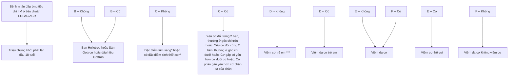

* Điềm yếu cơ gấp ngón tay và phản ứng với điều trị được cải thiện hoặc
**Sinh thiết cơ: không bảo có viêm, cần thiết để chẩn đoán.
***Viêm cơ trẻ em không phải viêm da cơ

**2.4. Chẩn đoán thể bệnh**

- Viêm da cơ người lớn
  + Viêm da cơ cổ điển (classic dermatomyositis)
    * Viêm da cơ cổ điển kèm bệnh ác tính
    * Viêm da cơ cổ điển thuộc hội chứng trùng lặp với bệnh mô liên kết hỗn hợp.
  + Viêm da cơ không điển hình (clinically amyopathic dermatomyositis):
    * Viêm da cơ không có biểu hiện viêm cơ (Amyopathic dermatomyositis)
    * Viêm da cơ tổn thương cơ dưới lâm sàng (Hypomyopathic dermatomyositis)
    * Viêm da cơ sau tổn thương cơ (postmyopathic dermatomyositis)


136

- Viêm da cơ trẻ em
  + Viêm da cơ cổ điển
  + Viêm da cơ không điển hình
    - Viêm da cơ không có biểu hiện viêm cơ (Amyopathic dermatomyositis)
    - Viêm da cơ tổn thương cơ dưới lâm sàng (Hypomyopathic dermatomyositis)

**2.5. Chẩn đoán phân biệt**

- Các bệnh có tổn thương da nhạy cảm ánh sáng: viêm da tiếp xúc ánh sáng, lupus ban đỏ hệ thống.
  - Viêm da tiếp xúc dị ứng/kích ứng.
  - Các bệnh có yếu cơ, mệt mỏi.
  - Nhiễm virus, nhiễm HIV.
  - Hội chứng thai loại mảnh ghép.
  - Các bệnh cơ khác.
  - Các bệnh lý tổ chức liên kết tự miễn khác.

**3. ĐIỀU TRỊ**

**3.1. Nguyên tắc điều trị**

- Kết hợp điều trị thuốc và phục hồi chức năng cơ, cải thiện sức mạnh của cơ, ngăn chặn teo cơ, cứng khớp.
  - Điều trị theo các tổn thương cơ quan của bệnh.
  - Điều trị đồng thời các bệnh lý ác tính nếu có.

**3.2. Điều trị cụ thể**

**3.2.1. Điều trị tổn thương cơ**

- Thường bắt đầu với liều tương đương prednisolon liều 1-2 mg/kg/ngày đáp ứng trong 4 – 6 tuần sau đó giảm liều dần mỗi 2 - 4 tuần. Theo dõi đáp ứng lâm sàng và men cơ trong quá trình giảm liều.

- Tổn thương cơ nghiêm trọng: methylprednisolon truyền tĩnh mạch 500mg/ngày trong 3 - 5 ngày đầu hoặc liều tương đương prednisolon 1 - 2mg/kg/ngày, nên kết hợp với các thuốc ức chế miễn dịch khác để đạt được đáp ứng và giảm liều corticosteroid sớm:

  + Azathioprin liều ban đầu 50mg/ngày, tăng lên 2 - 3mg/kg/ngày trong 2 tuần, không quá 200mg/ngày.


137

+ Methotrexat 10 - 25mg/tuần, bổ sung acid folic 5mg mỗi tuần sau 12 giờ dùng methotrexat.

+ Immunoglobulin truyền tĩnh mạch (IVIG) 0,4g/kg trong 5 ngày, tổng liều là 2g.

+ Trường hợp dai dẳng, không đáp ứng với các điều trị trên, có thể sử dụng: cyclosporin A đường uống liều 2,5 - 5mg/kg/ngày, lưu ý các tác dụng phụ như tăng huyết áp, tổn thương thận hoặc: mycophenolate mofetil 2g/ngày chia 2 lần hoặc tacrolimus uống 0,1mg/kg/ngày,

+ Rituximab: có thể được cân nhắc trong trường hợp kết hợp corticosteroid toàn thân và thuốc ức chế miễn dịch đường uống thất bại.

**3.2.2. Điều trị tổn thương da**

- Tại chỗ: tránh nắng, corticosteroid tại chỗ, ức chế calcineurin bôi duy trì.

- Toàn thân: thuốc kháng sốt rét tổng hợp (HCQ hoặc quinacrin) được ưu tiên lựa chọn, nếu triệu chứng không cải thiện có thể dùng thêm corticosteroid đường toàn thân đơn thuần hoặc kết hợp thêm các ức chế miễn dịch khác như methotrexat hoặc mycophenolat mofetil hoặc azathioprin. Trong trường hợp tổn thương da nặng, diện tích rộng kèm đỏ ngứa nhiều, IVIG hoặc rituximab có thể cân nhắc nếu bệnh nhân thất bại với các phương pháp khác.

**3.2.3. Điều trị tổn thương cơ quan**

- Tổn thương phổi kẽ:

+ Trường hợp viêm phổi kẽ tiến triển nhanh, nguy cơ suy hô hấp:

  - Điều trị tấn công bằng các thuốc tác dụng nhanh như cyclophosphamid đường uống 1 - 2mg/kg/ngày hoặc cyclophosphamid truyền tĩnh mạch 0,5 - 1g/m2 mỗi 4 tuần, kéo dài 4 - 6 đợt hoặc corticosteroid liều tải truyền tĩnh mạch tương đương methylprednisolon 500mg- 1500mg/ngày trong 1-3 ngày hoặc IVIG 0,4g/kg trong 5 ngày hoặc rituximab truyền tĩnh mạch 1g/lần, cách nhau 2 tuần hoặc ức chế calcineurin.

  - Điều trị duy trì bằng mycophenolat mofetil từ 1,5g - 3g/ngày.

+ Trường hợp tổn thương phổi nhẹ hơn: azathioprin hoặc mycophenolat mofetil hoặc tacrolimus được lựa chọn.

- Tổn thương mạch máu: sử dụng corticosteroid toàn thân. Trường hợp kém đáp ứng, rituximab có thể được sử dụng, tuy nhiên không hiệu quả trong điều trị loét. Các thuốc nifedipin, sildenafil, bosentan, thuốc ức chế prostaglandin nên được sử dụng sớm cho trường hợp loét do tổn thương mạch máu.

- Lắng đọng canxi: ít đáp ứng với các thuốc ức chế miễn dịch. Trường hợp viêm da cơ trẻ em có thể ưu tiên sử dụng sớm IVIG để giảm thiểu lắng đọng canxi.


138

- Thuốc ức chế phân tử nhỏ: ruxolitinib có hiệu quả trong điều trị viêm bì cơ kháng thuốc ức chế miễn dịch khác, tofacitinib giảm tổn thương da và lắng đọng canxi.

**3.3. Theo dõi điều trị**

Cần khám và đánh giá tổn thương các cơ quan và triệu chứng đợt hoạt động bệnh bằng triệu chứng lâm sàng, cận lâm sàng, theo dõi tác dụng phụ của thuốc điều trị

Các xét nghiệm cần chỉ định mỗi 1 đến 3 tháng /lần khi tái khám:
- Xét nghiệm tế bào máu ngoại vi, tốc độ máu lắng
- Men cơ, chức năng gan, thận, mỡ máu, protein, albumin máu (đặc biệt ở các trường hợp nghi ngờ tổn thương thận)
- Tổng phân tích nước tiểu
- Chụp Xquang ngực, chụp cắt lớp vi tính phổi, siêu âm tim, điện tim, siêu âm ổ bụng, siêu âm hạch khi có nghi ngờ tổn thương tim, phổi, hạch bạch huyết,…
- Xét nghiệm miễn dịch kháng thể kháng nhân (ANA) làm lại mỗi 6 tháng.
- Xét nghiệm và theo dõi các tác dụng không mong muốn của corticosteroid và các thuốc ức chế miễn dịch: điện giải đồ, calci máu, glucose máu, mỡ máu, cortisol máu... phát hiện tình trạng nhiễm trùng, tăng huyết áp.
- Xét nghiệm tầm soát bệnh lý ác tính định kỳ: siêu âm tuyến giáp, siêu âm tuyến vú, xquang ngực, .....

**4. PHÒNG BỆNH**

- Sử dụng các biện pháp chống nắng: kem chống nắng, mũ nón, quần áo chống nắng khi ra ngoài trời
- Nghỉ ngơi luyện tập hợp lý tránh tình trạng viêm cơ, teo cơ.
- Dinh dưỡng đầy đủ phù hợp với thuốc toàn thân sử dụng.
- Tầm soát tổn thương da, cơ cho bệnh nhân có bệnh lý ác tính
- Các bệnh nhân viêm da cơ người lớn cần được tầm soát ung thư hàng năm bằng các xét nghiệm.


139

# **BỆNH XƠ CỨNG BÌ HỆ THỐNG**
**(Systemic sclerosis - Scleroderma)**

## **1. ĐẠI CƯƠNG**

### **1.1. Khái niệm**
Xơ cứng bì hệ thống (XCBHT) là một bệnh mạn tính được đặc trưng bởi tổn thương chức năng mạch máu nhỏ, rối loạn tự miễn dịch, sự xơ hóa tiến triển của da và các cơ quan nội tạng. Bệnh biểu hiện bởi xơ cứng da và tổn thương nhiều cơ quan khác.

### **1.2. Dịch tễ**
Bệnh thường gặp hơn ở nữ giới, tỷ lệ gặp nữ/nam là 3/1 đến 5/1 và thường khởi phát ở độ tuổi từ 30 đến 50 tuổi.

### **1.3. Căn nguyên/Cơ chế bệnh sinh**
Căn nguyên của bệnh xơ cứng bì chưa được biết rõ nhưng đây là bệnh tự miễn với sự hiện diện của các tự kháng thể như kháng thể kháng nhân (ANA), kháng thể kháng Topoisomerase I (anti Scl-70) và một số tự kháng thể khác. Một số yếu tố về gen và kháng nguyên bạch cầu người (HLA) có liên quan đến cơ chế bệnh sinh của bệnh.

## **2. CHẨN ĐOÁN**

### **2.1. Triệu chứng lâm sàng**

#### **2.1.1. Tổn thương da**
- Thường bắt đầu từ các ngón tay với biểu hiện phù nề, sau đó xuất hiện hiện tượng dày da, cứng da tiến triển lan dần lên cổ tay, cánh tay, mặt, phần trên của cổ, ngực, bụng… Tổn thương xơ cứng da ngày càng tiến triển nặng làm bệnh nhân khó cử động. Da mặt nếp nhăn, rõ nhất ở mặt làm bệnh nhân giảm khả năng biểu hiện tình cảm trên nét mặt và khó há mồm. Hầm lưỡi xơ cứng ít hay nhiều tùy tiến triển của bệnh.
- Da bị mất sắc tố, hay gặp ở phía mu bàn tay, vùng cổ, ngực, lưng, có thể thấy hiện tượng loang lổ sắc tố.
- Lắng đọng canxi tại các mô mềm gây tình trạng ngứa, loét các vùng da lân cận.
  - Thể giới hạn: xơ cứng da ở mặt và chỉ từ vùng khuỷu tay và đầu gối trở xuống, không có tổn thương vùng thân mình và gốc chi.
  - Thể lan tỏa: xơ cứng da có xuất hiện đến vùng gốc chi, thân mình hoặc toàn bộ cơ thể.

#### **2.1.2. Hiện tượng Raynaud**
Tình trạng co thắt các tiểu động mạch hoặc động mạch tại các đầu chi như ngón tay, ngón chân xuất hiện khi tiếp xúc với nhiệt độ lạnh hoặc khi thay đổi cảm xúc với sự thay đổi màu da ở đầu chi theo ba giai đoạn: nhợt nhạt, xanh tái và đỏ tím.


140

Tổn thương loét, hoại tử tại các đầu chi, sẹo lốm đốm ngón do hội chứng Raynaud kéo dài.

**2.1.3. Hội chứng CREST**

Phối hợp các triệu chứng canxi hóa (Calcinosis), hiện tượng Raynaud (Raynaud), co thắt thực quản (Esophageal), xơ cứng da ngón, đầu chi (Sclerodactylic) và giãn mạch (Telangiectasia).

**2.1.4. Tổn thương các cơ quan khác**

- Cơ xương khớp: bệnh nhân có thể đau nhiều khớp chủ yếu là các khớp ở chi trên có thể viêm các khớp nhưng không có di chứng biến dạng khớp. Một số có đau mới cơ, tăng men cơ, viêm cơ, teo cơ.
- Phổi: tổn thương phổi hay gặp nhất là xơ phổi, bệnh nhân ho khan, khó thở khi gắng sức. Nghe phổi có ran rít hoặc ran ẩm khi có bội nhiễm phổi. Có thể có tràn dịch màng phổi với lượng dịch ít.
- Tim mạch: bệnh nhân có nhịp tim nhanh, hoặc rối loạn nhịp tim với nhiều mức độ khác nhau, có thể gặp suy tim.
- Tiêu hóa: tổn thương hay gặp nhất là tổn thương thực quản, cảm giác nóng rát phía sau xương ức, triệu chứng trào ngược, xơ cứng và co thắt thực quản làm bệnh nhân khó nuốt (nhất là với thức ăn đặc). Có thể kèm táo bón hoặc đi ngoài phân lỏng từng đợt.
  - Tổn thương thận: suy thận, xơ hóa cầu thận,...
  - Thần kinh: đau đầu, động kinh, đột quy,...

**2.2. Cận lâm sàng**

**2.2.1. Tự kháng thể**

- Kháng thể kháng nhân (ANA) bằng kỹ thuật miễn dịch huỳnh quang trên tế bào hep2 hoặc elisa thường dương tính.
- Kháng thể đặc hiệu:
  + Kháng thể kháng – centromere (ACA): hay gặp nhất là CENP-A, CENP-B, CENP-C. Thường hay gặp trong thể da giới hạn, có tổn thương mạch máu, lắng đọng canxi và tiêu hóa.
  + Kháng thể kháng – Topoisomerase I (kháng thể kháng Scl-70): thường gặp hơn ở thể da lan tỏa, tiến triển nhanh. Có mối liên quan đến bệnh phổi kẽ, bệnh lý cơ tim, biến chứng mạch máu ngoại vi.
  + Kháng thể kháng – RNA polymerase III: thường gặp ở thể lan tỏa với tổn thương dày da tiến triển nhanh và tổn thương viêm cơ khớp.
  - Kháng thể khác: kháng thể kháng – U3 RNP (anti - fibrillarin), kháng thể kháng – Th/To, kháng thể kháng – U11/U12 RNP, kháng thể kháng – PM-Scl, kháng thể kháng Ku...có thể gặp trong xơ cứng bì hệ thống.

**2.2.2. Xét nghiệm tổn thương các cơ quan**

- Công thức máu: có thể gặp thiếu máu do quá trình viêm mạn tính và/ hoặc suy thận.


141

- Máu lắng, protein C phản ứng tăng.
- Sinh hóa máu: chức năng gan, thận, men cơ có thể biến đổi nếu có tổn thương cơ quan. Giảm albumin, protein trong trường hợp tổn thương thận hoặc suy kiệt. Đường máu, mỡ máu, điện giải đồ, acid uric cần thiết theo dõi điều trị.
  - Tổng phân tích nước tiểu: protein niệu, hồng cầu niệu, trụ niệu...
  - X quang ngực, cắt lớp vi tính ngực độ phân giải cao phát hiện tổn thương xơ phổi, tràn dịch màng phổi, màng tim
    - Đo chức năng hô hấp: hay gặp rối loạn thông khí hạn chế.
    - Siêu âm tim: tràn dịch màng ngoài tim, bệnh cơ tim, suy tim sung huyết, tăng áp lực động mạch phổi (trên 25mmHg khi đo bằng thông tim).
    - Điện tim: một số có rối loạn nhịp.
    - Soi mao mạch đầu chi: giãn mao mạch nền mỏng, mao mạch không lộ, xuất huyết, mao mạch chia nhánh, giảm số lượng mao mạch.
    - Sinh thiết da có giai đoạn viêm và giai đoạn xơ cứng.

**2.3. Chẩn đoán xác định**

- Chẩn đoán xơ cứng bì hệ thống theo Hội thấp học Mỹ (ACR) và Liên đoàn chống thấp khớp châu Âu (EULAR) 2013.

**Bảng 1.1. Tiêu chuẩn chẩn đoán XCBHT theo ACR/EULAR 2013.**

| Đày da các ngón tay ở 2 tay lan đến khớp bàn ngón                  | 9 điểm                                                                   |        |
| ------------------------------------------------------------------ | ------------------------------------------------------------------------ | ------ |
| Đày da ngón tay (chỉ tính điểm cao nhất)                           | Phù nề ngón                                                              | 2 điểm |
|                                                                    | Xơ cứng da các ngón chưa đến khớp bàn ngón nhưng đến khớp gian ngón gần. | 4 điểm |
| Tổn thương đầu ngón (chỉ tính điểm cao nhất)                       | Loét đầu ngón                                                            | 2 điểm |
|                                                                    | Sẹo lõm đầu ngón                                                         | 3 điểm |
| Giãn mạch                                                          |                                                                          | 2 điểm |
| Bất thường mao mạch nền mỏng                                       |                                                                          | 2 điểm |
| Tăng áp lực động mạch phổi và/hoặc bệnh phổi kẽ (điểm tối đa là 2) | Tăng áp lực động mạch phổi                                               | 2 điểm |
|                                                                    | Bệnh phổi kẽ                                                             | 2 điểm |
| Hiện tượng Raynaud                                                 |                                                                          | 3 điểm |
| Các tự kháng thể liên quan (điểm tối đa là 3)                      | Kháng thể kháng centromere                                               | 1 điểm |
|                                                                    | Kháng thể kháng topoisoмерase I                                          | 1 điểm |
|                                                                    | Kháng thể kháng RNA polymerase III                                       | 1 điểm |
| Chẩn đoán xác định khi tổng điểm từ 9 điểm trở lên.                |                                                                          |        |


- Tiêu chuẩn này không sử dụng cho các bệnh nhân có tổn thương dày da không liên quan đến vùng ngón và những bệnh nhân có biểu hiện dày da có thể được giải thích phù hợp với các bệnh cảnh khác như xơ cứng da do rối loạn thần kinh, xơ cứng bì khu trú thể lan tỏa, viêm cân cơ tăng bạch cầu ái toan, phù cứng bì do đái tháo đường,


142

scleromyxedema...

**2.4. Chẩn đoán thể lâm sàng**

- XCBHT thể da giới hạn: xơ cứng da ở mặt và chỉ từ vùng khuỷu tay và đầu gối trở xuống, không có tổn thương vùng thân mình và gốc chi.
- XCBHT thể da lan tỏa: xơ cứng da có xuất hiện đến vùng gốc chi, thân mình hoặc toàn bộ cơ thể.
- Hội chứng CREST bao gồm các biểu hiện: canxi hóa tổ chức dưới da ở đầu chi, hội chứng Raynaud, tổn thương thực quản, xơ cứng da đầu ngón, và giãn mạch da.
- Xơ cứng bì hệ thống không có xơ cứng da: biểu hiện lâm sàng với bệnh lý xơ phổi hoặc thận, tim, ống tiêu hóa. Không có tổn thương da. Có thể có hội chứng raynaud và các kháng thể dương tính (anti Scl 70, ACA hoặc anti RNA polymerase I,II,III).
- Hội chứng trùng lớp của bệnh xơ cứng bì và các bệnh tự miễn khác như lupus ban đỏ hệ thống, viêm da cơ, viêm khớp dạng thấp, hội chứng Sjogren (hội chứng trùng lớp - overlap syndrome).

**2.5. Chẩn đoán phân biệt**

- Lupus ban đỏ hệ thống
- Viêm khớp dạng thấp
- Viêm da cơ
- Xơ cứng bì khu trú thể lan tỏa
- Phù cứng bì (scleromyxedema)
- Scleroderma liên quan đến đái tháo đường hoặc bệnh máu
- Phù niêm (myxedema)
- Hội chứng carcinoid do u nội tiết
- Bệnh ghép chống chủ
- Các bệnh da di truyền có xơ cứng da: hội chứng Werner, lão hóa sớm đầu cực, loạn sản xơ cốt hóa tiến triển...

**3. ĐIỀU TRỊ**

**3.1. Nguyên tắc điều trị**

- Hiện nay chưa có phương pháp hoặc thuốc điều trị khỏi bệnh nên chủ yếu là điều trị triệu chứng nhằm kiểm soát đợt tiến triển của bệnh.
- Điều trị dựa trên tổn thương cơ quan, kết hợp tấn công và duy trì.

**3.2. Điều trị cụ thể**

**3.2.1. Điều trị theo cơ quan**

Tùy từng tổn thương cơ quan mà lựa chọn điều trị khác nhau


143

**Bảng 1.2: Điều trị các cơ quan bị tổn thương**

| Tổn thương                         | Điều trị                                                                                                                                                                                                                                                                                                                                                                                                                                                                                                                                                                                                                                                                                                                                                                                                                                                                                                                                                                                                                                                                                                                                                                                                                                                                                                                                                                                                                           |
| ---------------------------------- | ---------------------------------------------------------------------------------------------------------------------------------------------------------------------------------------------------------------------------------------------------------------------------------------------------------------------------------------------------------------------------------------------------------------------------------------------------------------------------------------------------------------------------------------------------------------------------------------------------------------------------------------------------------------------------------------------------------------------------------------------------------------------------------------------------------------------------------------------------------------------------------------------------------------------------------------------------------------------------------------------------------------------------------------------------------------------------------------------------------------------------------------------------------------------------------------------------------------------------------------------------------------------------------------------------------------------------------------------------------------------------------------------------------------------------------- |
| Bệnh phổi kẽ                       | - Điều trị tổn công: lựa chọn khởi đầu thường là mycophenolat mofetil hoặc cyclophosphamid, có hiệu quả trong cải thiện chức năng hô hấp (đặc biệt là chỉ số dung tích sống gắng sức - FVC). Tocilizumab hoặc azathioprin cũng được xem xét trong điều trị tổn công. + Mycophenolat mofetil (MMF): thường bắt đầu bằng liều thấp, sau đó tăng dần đến liều 1,5 – 3g/ ngày. MMF ít tác dụng phụ hơn cyclosporin. + Cyclophosphamid: thường ưu tiên dùng đường truyền tĩnh mạch mỗi tháng trong 6 tháng thay vì đường uống để giảm liều tích lũy. Liều tĩnh theo diện tích da cơ thể. + Tocilizumab: được FDA chấp thuận sử dụng để làm chậm tiến triển của tổn thương phổi kẽ trong xơ cứng bì hệ thống. Là sự lựa chọn thay thế cho MMF nếu bệnh nhân có chống chỉ định với MMF. - Điều trị duy trì: các thuốc ức chế miễn dịch hoặc nhóm thuốc khác cần được tiếp tục hàng tháng hoặc hàng năm (ít nhất từ 12 đến 24 tháng) + Mycophenolat mofetil hoặc azathioprin được khuyến cáo duy trì để sự cải thiện chức năng phổi. + Tocilizumab, nitedanib, rituximab: là một số thuốc đang được nghiên cứu để làm chậm tiến triển xơ phổi kẽ ở giai đoạn duy trì. - Ghép tế bào gốc tạo máu trong trường hợp bệnh tiến triển nhanh có nguy cơ suy nội tạng (không có chỉ định trong tổn thương phổi kẽ nặng). - Ghép phổi: một trong những sự lựa chọn cho bệnh nhân bị bệnh phổi kẽ mức độ nặng không đáp ứng với các thuốc điều trị. |
| Tăng áp lực động mạch phổi (TADMP) | Điều trị theo mức độ tổn thương (phân độ TADMP theo WHO). Các nhóm thuốc điều trị bao gồm: - Chất đối kháng thụ thể endothelin: ambrisentan, bosentan, macitentan. - Thuốc ức chế Phosphodiesterase-5 (PDE-5): sildenafil, tadalafil,... - Các chất tương tự prostacyclin: iloprost, treprostinil, epoprostenol, .... Epoprostenol tĩnh mạch được sử dụng trong trường hợp nặng (tăng áp lực động mạch phổi loại III và IV). - Chất kích thích guanylate cyclase hòa tan như riociguat - Trường hợp kháng trị: tạo shunt trái phải, ghép phổi                                                                                                                                                                                                                                                                                                                                                                                                                                                                                                                                                                                                                                                                                                                                                                                                                                                                                      |
| Con kích phát thận                 | - Thuốc ức chế men chuyển giúp cải thiện tỷ lệ sống trong con kích phát thận. - Các thuốc huyết áp khác có thể xem xét để kiểm soát tăng huyết áp kháng trị trong con kích phát thận.                                                                                                                                                                                                                                                                                                                                                                                                                                                                                                                                                                                                                                                                                                                                                                                                                                                                                                                                                                                                                                                                                                                                                                                                                                              |


144

|                    | - Corticosteroid liều cao có liên quan đến nguy cơ cơn kịch phát thận cao hơn nên phải theo dõi huyết áp và chức năng thận.                                                                                                                                                                                                                                                                                                                                             |
| ------------------ | ----------------------------------------------------------------------------------------------------------------------------------------------------------------------------------------------------------------------------------------------------------------------------------------------------------------------------------------------------------------------------------------------------------------------------------------------------------------------- |
| Da                 | - Methotrexat cải thiện tổn thương da trong xơ cứng bì hệ thống lan tỏa sớm. - Các lựa chọn khác bao gồm: mycophenolat mofetil, azathioprin, cyclophosphamid. - D-penicillamin hiện tại ít tác dụng nên không được khuyến cáo. - Giãn mạch: laser hoặc IPL (Intense Pulsed Light). - Tại chỗ: kem dưỡng ẩm da.                                                                                                                                                          |
| Khớp               | - Thuốc chống viêm không steroid được sử dụng giảm đau các khớp - Corticosteroid đường toàn thân có thể giảm triệu chứng viêm đau các khớp, lưu ý liều dùng và tác dụng phụ khi dùng kéo dài.                                                                                                                                                                                                                                                                           |
| Hiện tượng Raynaud | - Chẹn kênh canxi loại dihydropyridin, thường là nifedipin đường uống, được coi là liệu pháp đầu tay. - Thuốc ức chế PDE-5. - Iloprost truyền tĩnh mạch với các trường hợp Raynaud nặng, không đáp ứng với thuốc uống. - Thuốc ức chế tái hấp thu serotonin chọn lọc như fluoxetine. - Phẫu thuật cắt thần kinh giao cảm ở ngón tay (có hoặc không kết hợp với tiêm botulinum toxin) nên được xem xét ở những trường hợp nặng hoặc kháng trị                            |
| Loét ngón          | - Iloprost truyền tĩnh mạch: loét ngón nặng đang hoạt động - Thuốc ức chế PDE-5 - Bosentan giúp giảm số lượng loét ngón mới, đặc biệt ở bệnh nhân không đáp ứng với thuốc chẹn kênh canxi, thuốc ức chế PDE-5 hoặc iloprost - Phẫu thuật cắt thần kinh giao cảm ở ngón tay (có hoặc không kết hợp với tiêm botulinum toxin) cũng được xem xét ở những trường hợp nặng hoặc kháng trị                                                                                    |
| Đạ dày-ruột        | - Điều trị trào ngược dạ dày-thực quản và phòng ngừa loét, hẹp thực quản: thuốc ức chế bom proton - Thuốc prokinetic để kiểm soát các rối loạn vận động có triệu chứng (chứng khó nuốt, GERD, no sớm, chứng bụng, giả tắc ruột,...) - Kháng sinh đường uống phổ rộng, ngắn quãng hoặc luân phiên để điều trị quá phát vi khuẩn đường ruột có triệu chứng. - Thuốc chống tiêu chảy (ví dụ như loperamid) hoặc thuốc nhuận tràng có thể sử dụng để kiểm soát triệu chứng. |
| Canxi hóa          | - Biến chứng nhiễm trùng nên được phát hiện và điều trị sớm - Cần nhắc phẫu thuật với các trường hợp nặng, dai dẳng, ảnh hưởng nghiêm trọng đến khả năng vận động và chất lượng cuộc sống.                                                                                                                                                                                                                                                                              |


**3.2.2 Các nhóm thuốc chính**

- **Các thuốc ức chế miễn dịch:** áp dụng điều trị cho các bệnh nhân xơ cứng bì có


145

tổn thương mạch nhiều, có nguy cơ hoại tử đầu chi hoặc tổn thương phổi kẽ... Có thể dùng một trong các thuốc sau:

+ Corticosteroid: thường dùng liều tương đương prednisolon 5-20mg/ngày. Trong một số trường hợp viêm cơ, tổn thương phổi kẽ, xơ cứng tiến triển nhanh có thể dùng liều cao hơn ở giai đoạn đầu, tuy nhiên cần thận trọng khi sử dụng corticosteroid cho bệnh nhân xơ cứng bì vì nguy cơ có thể xuất hiện bệnh lý thận cấp, đặc biệt khi dùng liều cao kéo dài. Ở giai đoạn bệnh ổn định, triệu chứng da khớp đã cải thiện có thể sử dụng corticosteroid liều thấp 5mg - 10mg duy trì. Thường sử dụng kết hợp corticosteroid với nhóm ức chế miễn dịch khác trong điều trị để đem lại hiệu quả cao hơn.

+ Cyclophosphamid: thường truyền tĩnh mạch liều 500-750 mg/m2 diện tích cơ thể mỗi 1 tháng/ lần trong 6 tháng liên tiếp), có thể điều chỉnh liều theo tuổi, chức năng thận và tình trạng cơ thể. Đường uống khởi đầu từ 50-150mg/ngày (tùy cân nặng) sau đó tăng dần liều lên khoảng 1.5-2.5mg/kg/ngày trong 12 tháng, sau đó có thể chuyển tiếp sang thuốc khác ít độc tính hơn.

+ Mycophenolat mofetil: liều phù hợp là 1,5 -3g/ngày. Thường bắt đầu bằng liều thấp để hạn chế tác dụng phụ với đường tiêu hóa sau đó tăng dần lên. Liều khởi đầu là 500mg x 2 lần/ngày sau tăng dần lên đến 1,5g x 2 lần/ngày. Tác dụng phụ thường gặp là ức chế tủy xương và rối loạn tiêu hóa. Do đó nên làm xét nghiệm công thức máu trong 1-2 tuần sau khi bắt đầu dùng thuốc và định kỳ khi sử dụng thuốc.

+ Azathioprin: 1-3mg/kg/ngày, chú ý tác dụng phụ gây ức chế tủy xương (hay gặp nhất là hạ bạch cầu). Nên bắt đầu bằng liều tập 1mg/kg/ngày trong tháng đầu, sau đó tăng liều lên nếu không có tác dụng phụ ức chế tủy xương. Thường dùng kiểm soát tổn thương phổi kẽ sau truyền cyclophosphamid.

+ Methotrexat: được khuyến cáo trong điều trị tổn thương da trên bệnh nhân xơ cứng bì hệ thống. Thuốc còn được sử dụng trong trường hợp có viêm khớp và viêm cơ kèm theo. Liều dùng methotrexat từ 10-25mg/tuần. Thận trọng đối với những bệnh nhân có tổn thương phổi tiến triển.

+ Cyclosporin A: 50-100mg/ngày, ít được sử dụng trong điều trị xơ cứng bì hệ thống hơn các ức chế miễn dịch khác.

- **Các thuốc điều trị tổn thương mạch máu:**

+ Thuốc chặn kênh canxi: thường dùng nifedipin liều tối đa 240mg/ngày, diltiazem liều tối đa 720 mg/ngày, amlodipin liều tối đa 20 mg/ngày, cải thiện tốt trường hợp tổn thương mạch máu ngoại vi, không có bằng chứng cải thiện tăng áp động mạch phổi.

+ Thuốc đối kháng thụ thể Endothelin-1 receptor: bosentan liều 125 - 250 mg/ngày, cải thiện tăng áp động mạch phổi và tình trạng loét ngón. Macitentan, ambrisentan là các thuốc cho thấy hiệu quả trên bệnh nhân xơ cứng bì hệ thống.

+ Thuốc ức chế phosphodiesterase type 5 (Phosphodiesterase type 5 inhibitors-PDE5i): Nhóm PDE5i có tác dụng ức chế quá trình chuyển hóa của cGMP, làm thúc


146

đẩy quá trình giãn mạch máu ở phổi dưới tác động của NO nội sinh. Cho đến nay có 2 thuốc thuộc nhóm này được chấp thuận để điều trị PAH là sildenafil và tadalafil. Sildenafil liều không quá 10-20mg x 3 lần/ ngày.

+ Chất chủ vận con đường prostacyclin: nhóm thuốc có khả năng giãn động mạch phổi như epoprostenol đường tiêm, treprostinil và iloprost đường tiêm hoặc hít và selexipag đường uống. Iloprost qua đường tĩnh mạch còn được lựa chọn trong điều trị loét, hoại tử ngón.

- **Nhóm thuốc sinh học:**

+ Tocilizumab: một kháng thể đơn dòng từ người kháng lại IL-6, được FDA chấp thuận sử dụng để điều trị bệnh phổi kẽ trong xơ cứng bì. Liều 162mg mỗi tuần 1 lần, tiêm dưới da.

+ Nitedanib: là thuốc ức chế nhiều loại tyrosine kinase, đã được chứng minh làm chậm tiến triển của bệnh xơ phổi vô căn. Trong điều trị Xơ cứng bì hệ thống đang cho thấy bước đầu làm chậm quá trình giảm chức năng hô hấp của bệnh nhân phổi kẽ.

+ Rituximab: háng thể đơn dòng chống lại CD20 trên tế bào lympho B. Kết quả bước đầu từ một vài thử nghiệm lâm sàng nhỏ cho thấy rituximab có thể là một loại thuốc điều trị cho bệnh phổi kẽ trong xơ cứng bì.

- **Các thuốc điều trị hỗ trợ khác:**

+ Thuốc ức chế bom proton: liều tiêu chuẩn esomeprazol 40mg/ngày, lansoprazol 30mg/ngày, pantoprazol 40mg/ngày, omeprazol 20mg/ngày, rabeprazol 20mg/ngày. Liều tối đa được sử dụng có thể gấp đôi liều tiêu chuẩn.

+ Thuốc chống viêm không steroid: diclofenac 50-100mg/ngày, meloxicam 7,5-15mg/ngày, celecoxib 200mg/ngày. Cần lưu ý các tác dụng phụ của thuốc trên hệ tiêu hóa dạ dày, ruột.

+ Colchicin : dùng trong điều trị giảm canxi hóa ở da, đau khớp..., liều 1mg/ngày, lưu ý tác dụng phụ trên đường tiêu hóa.

- **Liệu pháp oxy:** chưa có bằng chứng về lợi ích của liệu pháp oxy dài hạn. Có thể chỉ định thở oxy khi phân áp O2 động mạch <8 kPa (60 mmHg) hoặc SpO2 <91%). Có thể xem xét liệu pháp oxy cấp cứu (ambulatory oxygen therapy) trong trường hợp cần thiết.

- **Phương pháp lọc huyết tương:** để loại bỏ các phức hợp miễn dịch trong các trường hợp tiến triển nặng.

**3.3. Theo dõi điều trị**

Cần khám và đánh giá tổn thương các cơ quan và triệu chứng theo dõi tác dụng phụ của thuốc điều trị. Các xét nghiệm cần chỉ định mỗi 1 đến 3 tháng /lần khi tái khám:

- Xét nghiệm tế bào máu ngoại vi, tốc độ máu lắng
- Chức năng gan, thận, men cơ, mỡ máu, protein, albumin máu


147

- Tổng phân tích nước tiểu.
- Chụp Xquang ngực, chụp cắt lớp vi tính phân giải cao phổi, siêu âm tim, điện tim, siêu âm ổ bụng, siêu âm hạch khi có nghi ngờ tổn thương,...
- Xét nghiệm miễn dịch kháng thể kháng nhân (ANA), kháng thể kháng Topoisomerase I (anti Scl 70) có thể làm lại mỗi 6 tháng hoặc khi bệnh hoạt động.
- Xét nghiệm và theo dõi các tác dụng không mong muốn của corticosteroid và các thuốc ức chế miễn dịch: điện giải đồ, calci máu, glucose máu, mỡ máu, cortisol máu... phát hiện tình trạng nhiễm trùng, tăng huyết áp.

**4. PHÒNG BỆNH**
- Tránh các yếu tố làm nặng tổn thương mạch máu: không hút thuốc lá, giữ ấm tay, tránh kích thích lạnh đột ngột.
- Kiểm soát tình trạng trào ngược dạ dày - thực quản: bệnh nhân nên ăn thành nhiều bữa nhỏ, không ăn quá no, nên nằm đầu cao, không nằm ngay sau khi ăn, tránh lạm dụng cà phê, thuốc lá và các chất kích thích khác.
  - Dinh dưỡng hợp lý, đầy đủ các nhóm thực phẩm, tránh vận động gắng sức.
  - Dùng các loại xà phòng ít gây khô da, xoa kem làm mềm da, xoa bóp da thường xuyên.
  - Hướng dẫn tập thể dục, bài tập vật lý trị liệu phù hợp với tình trạng sức khỏe, tập thở và xoa bóp toàn thân thường xuyên.
- Tái khám và dùng thuốc thường xuyên ngăn chặn đợt tiến triển của bệnh.


148

# **HỘI CHỨNG TRÙNG LẮP**
**(Overlap syndrome)**

## **1. ĐẠI CƯƠNG**

### **1.1. Khái niệm**

- Hội chứng trùng lớp (overlap syndromes) trong các bệnh mô liên kết được định nghĩa là tình trạng thỏa mãn tiêu chí phân loại của ít nhất hai bệnh mô liên kết tự miễn (bao gồm lupus ban đỏ hệ thống (SLE), viêm khớp dạng thấp (RA), xơ cứng bì hệ thống (SSc), viêm da co/viêm da cơ (PM/DM) và hội chứng Sjögren) xảy ra cùng lúc hoặc khác thời điểm trên cùng một bệnh nhân.

- Hội chứng trùng lớp thường có tiên lượng nhẹ hơn so với các bệnh mô liên kết hỗn hợp tự miễn đơn thuần.

### **1.2. Dịch tễ**

Bệnh chủ yếu gặp ở bệnh nhân nữ, trẻ tuổi với tỷ lệ nữ/nam khoảng 10/1. Biểu hiện lâm sàng đa dạng với sự chồng chéo của nhiều bệnh lý tự miễn khác nhau.

### **1.3. Căn nguyên/Cơ chế bệnh sinh**

Nguyên nhân của hội chứng trùng lớp còn chưa được biết rõ nhưng đây là bệnh có sự xuất hiện của nhiều các tự kháng thể gây ảnh hưởng đa cơ quan.

## **2. CHẨN ĐOÁN**

### **2.1. Triệu chứng lâm sàng**

Hội chứng trùng lớp có biểu hiện lâm sàng đa dạng của các bệnh lý mô liên kết tự miễn mà bệnh bao gồm.

### **2.1.1 Bệnh Lupus ban đỏ hệ thống:**

- Triệu chứng toàn thân: sốt, mệt mỏi, chán ăn, gây sút cân.

- Tổn thương da, niêm mạc: ban cánh bướm, ban đỏ bán cấp dạng hình nhân hoặc vảy nến, tổn thương dạng đĩa, nhạy cảm ánh sáng, trợt niêm mạc miệng. Một số tổn thương da khác của lupus như viêm mạch, lắng đọng can xi, ....

- Tổn thương tóc: rụng tóc không sẹo, rụng tóc có sẹo.

- Tổn thương cơ xương khớp: đau, viêm một hoặc nhiều khớp tuy nhiên thường không có bào mòn và làm biến dạng khớp.

- Tổn thương nội tạng:

+ Thận: viêm cầu thận có phù, đái ít, protein niệu, hồng cầu niệu, trụ niệu. Đợt cấp thường có hội chứng cầu thận cấp, hội chứng thận hư và suy thận.


149

- + **Máu**: thiếu máu, xuất huyết. Có thể gan, lách, hạch to.

- + **Tim mạch**: hay gặp là viêm màng ngoài tim có tràn dịch màng tim, nhịp nhanh xoang, viêm màng ngoài tim co thắt, viêm cơ tim, viêm nội tâm mạc.

- + **Phổi, màng phổi**: Viêm màng phổi, tràn dịch màng phổi, viêm phổi kế dẫn tới xơ phổi, tăng áp lực động mạch phổi.

- + **Thần kinh, tâm thần**: đau đầu, co giật kiểu động kinh toàn thể hoặc cục bộ, hội chứng thần kinh khu trú, viêm thần kinh ngoại vi, viêm màng não nước trong, ....

- + **Hệ tiêu hoá**: hay gặp nôn, ỉa chảy, ậm ạch, đầy hơi, khó tiêu, giảm nhu động ruột gây giãn quai ruột, viêm tuy cấp, viêm tuyến nước bọt, ....

## **2.1.2 Bệnh xơ cứng bì hệ thống**

- - **Tổn thương da**: Phù nề lan tỏa bàn tay, bàn chân thường gặp ở giai đoạn sớm, trước khi có tổn thương xơ cứng tiến triển (tổn thương thường nặng ở bàn tay, cẳng tay, đầu mặt cổ trước các vùng khác). Bộ mặt đặc trưng: mắt nếp nhăn, bộ mặt vô cảm. Tăng giảm sắc tố, da màu muối tiêu.

- - **Calci hóa da**: Các tổn thương này có thể thấy rõ trên phim chụp X quang. Tổn thương thường gặp nhất ở các ngón tay đặc biệt là phía gan tay của đốt giữa, dọc xương sống, giữa các đốt sống, quanh đầu gối, mu chân và quanh khớp khuy.

- - **Tổn thương mạch máu**: hiện tượng Raynaud's, loét ngón, bất thường mao mạch nền mỏng, giãn mạch.

- - **Tổn thương nội tạng:**

  - + **Tổn thương phổi**: Tổn thương phổi thường gặp biểu hiện dưới hai bệnh chính là bệnh phổi kẽ và tăng áp lực động mạch phổi làm giảm chức năng hô hấp, khó thở.

  - + **Tổn thương đường tiêu hoá**: trào ngược dạ dày thực quản, tăng sinh vi khuẩn đường ruột và bán tác ruột mạn tính. Các triệu chứng phổ biến khác có thể gặp bao gồm: nuốt nghẹn, khan giọng, ho, táo bón và tiêu chảy xen kẽ …

  - + **Tổn thương thận**: thường không có biểu hiện lâm sàng. Con kích phát thận thường xảy ra ở giai đoạn sớm của bệnh học do tăng huyết áp nặng, bệnh mạch máu, thiếu máu tan máu và giảm tiểu cầu, phù phổi, đau đầu, mờ mắt, bệnh não do cao huyết áp.

  - + **Tổn thương cơ xương khớp**: đau nhiều khớp và không có biến dạng khớp. Biểu hiện tổn thương cơ được đánh giá bằng các dấu hiệu lâm sàng như cứng, teo cơ, xuất hiện khi có tổn thương da nặng.

  - + Ngoài các tổn thương hay gặp trên, bệnh nhân có thể gặp tổn thương thương các cơ quan khác như tim, hệ thống thần kinh, sinh dục

## **2.1.3. Bệnh viêm da cơ/viêm da cơ**


150

- Tổn thương da: là những dát màu đỏ tím khu trú ở mi mắt trên, sung, phù nề tạo nên dấu hiệu "Heliotrope", dát đỏ tím vùng da hở như tam giác cổ áo (V-sign) hoặc vùng lưng (Shawl sign), đùi (Holster sign), các sẩn hay mảng sẩn ở mu các khớp ngón tay và bàn tay, khuỷu tay, khớp gối, mắt cá chân (sẩn Gottron), nếu tổn thương này là dát thì được gọi là dấu hiệu Gottron (Gottron's signs), dấu hiệu bàn tay người thợ cơ khí (dày sừng, tăng sắc tố thành dải ở mặt trong và mặt bên các ngón tay).

- Tổn thương cơ: đau cơ, yếu cơ chủ yếu xảy ra ở các cơ gốc chi. Trường hợp nặng có thể lan tỏa ra toàn thân, gây nên hiện tượng nói khó, nuốt khó, khó thở, táo bón...

- Hiện tượng Raynaud: gặp khoảng 10% những bệnh nhân viêm bì cơ người lớn, nhưng lại rất hiếm gặp ở trẻ em.

- Tổn thương viêm khớp: có thể gặp, nhưng viêm khớp nặng có ăn mòn khớp thì hiếm gặp.

- Lắng đọng canxi: hay gặp ở nhóm trẻ em , vị trí hay gặp là ở vùng cạp quần, quanh khuỷu tay, quanh các đốt ngón tay, có những trường hợp dấu hiệu lắng đọng canxi lan tỏa nhiều nơi.

- Những tổn thương khác: viêm phổi kẽ, xơ phổi, tăng áp lực động mạch phổi. Viêm cơ tim, xơ cơ tim dẫn đến suy tim ít gặp. Tổn thương thận hiếm gặp.

**2.1.4. Bệnh viêm khớp dạng thấp**

- Tổn thương khớp:

  + Đau, sưng khớp có tính chất đối xứng, thường ở các khớp nhỏ và nhỏ như cổ tay, bàn ngón tay, ngón gần, khuỷu, vai, háng, gối, cổ chân, bàn chân. Tình trạng cứng khớp buổi sáng thường kéo dài trên 1 giờ.

  + Nếu không được điều trị sớm, dày đù, ngui bệnh sẽ bị dính và biến dạng các khớp viêm do tổn thương phá hủy khớp, gân, dây chằng từ đó gây bán trật khớp, tàn phế. Các kiểu biến dạng thường gặp gồm có: bàn tay gió thổi, cổ tay hình lưng lạc đà, ngón tay người thợ thừa khuỵết, ngón tay hình cổ cò, hội chứng đường hầm cổ tay....

  + Viêm khớp dạng thấp phá hủy làm tổn thương đến hệ khớp gồm 4 giai đoạn:
    - Giai đoạn I: viêm màng trên khớp dẫn đến sưng khớp và đau khớp.
    - Giai đoạn II: trong giai đoạn này có sự gia tăng và lan truyền của viêm trong mô. Mô viêm bắt đầu phát triển ảnh hưởng đến không gian khoang khớp và trên sụn, dần dần phá hủy sụn khớp và khớp bắt đầu thu hẹp do mất sụn. Trong giai đoạn này, thường không có dị dạng khớp,
    - Giai đoạn III: Đây là giai đoạn nặng. Sự mất đi sụn khớp trong các khớp bị tổn thương làm lộ xương dưới sụn. Bệnh nhân thường đau khớp, sưng tấy, hạn chế


151

chuyển động, cứng khớp vào buổi sáng, suy nhược cơ thể, teo cơ, hình thành các nốt sần dị dạng.

- Giai đoạn IV: Giai đoạn IV được gọi là giai đoạn cuối, quá trình viêm giảm đi và hình thành các mô xơ và xương chung (xương kết hợp) dẫn đến việc ngừng chức năng khớp

  - Tổn thương cơ quan khác: do tổn thương da, mắt, phổi, tim và mạch máu

**2.1.5 Hội chứng Sjogren**

Là một rối loạn tự miễn dịch mãn tính xảy ra khi hệ thống miễn dịch tấn công các tuyến tạo ra độ ẩm trong mắt, miệng và các bộ phận khác của cơ thể.

- Khô mắt: gây cảm giác bỏng, ngứa thường gặp. Tình trạng khô mắt có thể gây mờ mắt hoặc nhạy cảm với ánh sáng.

- Khô miệng: gây khó chịu và khó khăn khi nuốt, nói và rối loạn vị giác. Tăng tỉ lệ sâu răng và nhiễm trùng miệng họng (nhiễm nấm, vi khuẩn, herpes...)

- Khô niêm mạc khác: đường mũi, cổ họng, niêm mạc âm đạo.

- Tổn thương cơ quan: đau khớp, đau cơ có thể kèm yếu cơ tứ chi. Khó thở, ho khan ít gặp.

**2.2. Một số hội chứng trùng lắp thường gặp**

**2.2.1. Hội chứng trùng lắp giữa xơ cứng bì hệ thống và lupus ban đỏ hệ thống**

Chiếm khoảng 26,8% trong số các trường hợp. Đặc điểm lâm sàng của cả xơ cứng bì hệ thống và lupus ban đỏ hệ thống với biểu hiện

- Tổn thương da: có thể gặp cả tổn thương da của lupus và xơ cứng bì như: dát đỏ cánh bướm cấp tính ở mặt, tổn thương dạng vòng, dạng sần, dạng đĩa của lupus ban đỏ kèm tổn thương dày da ở đầu ngón hoặc dày da lan tỏa của xơ cứng bì

  - Viêm da màng, viêm khớp, hoại tử xương viêm mạch, viêm cầu thận lupus,...

  - Hội chứng Raynaud, giãn mạch quanh móng.

  - Tổn thương các cơ quan khác: thận, phổi...

**2.2.2. Hội chứng trùng lắp giữa xơ cứng bì hệ thống và viêm bì cơ**

Đặc điểm lâm sàng chủ yếu thường gặp là hội chứng Raynaud, viêm khớp, viêm cơ thường nhẹ. Tổn thương dày da xơ cứng của xơ cứng bì hoặc các dát đỏ tím, sần Gottron, heliotrope... của viêm bì cơ.

**2.2.3. Hội chứng trùng lắp giữa lupus ban đỏ hệ thống và viêm khớp dạng thấp**

Hội chứng này còn có tên gọi khác là hội chứng Rhupus. Triệu chứng khớp thường nổi bật, hay gặp viêm đau các khớp, biến dạng cổ thiên nga và lệch trục không


152

ăn mòn cùng với các biểu hiện cơ quan khác của lupus như tổn thương da, viêm cầu thận, viêm thanh mạc với tỉ lệ thấp và ít nghiêm trọng.

**2.2.4. Hội chứng trùng lặp giữa lupus ban đỏ hệ thống và viêm bì cơ**

Tổn thương da biểu hiện của một trong hai hoặc cả hai bệnh lupus ban đỏ và viêm bì cơ.

**2.3. Cận lâm sàng**

**2.3.1. Tự kháng thể**

- Kháng thể kháng nhân (anti ANA) thường dương tính
- Kháng thể đặc trưng cho các bệnh mô liên kết thường gặp:
  + Bệnh Lupus ban đỏ hệ thống: kháng thể kháng chuỗi kép (anti dsDNA), anti Smith, kháng thể kháng phospholipid
  + Bệnh Xơ cứng bì hệ thống: kháng thể kháng centrome, kháng thể kháng Topoisomerase I (anti Scl-70), kháng thể kháng RNA polymerase I, II, III.
    + Bệnh viêm da/da cơ: kháng thể kháng synthetase, kháng thể kháng Jo-1, kháng thể PL-7, PL-1, kháng thể kháng Ku, MDA5, ...
    + Bệnh viêm khớp dạng thấp: yếu tố dạng thấp (RF), kháng thể kháng CCP2 (cyclic citrullinated peptide-2), kháng thể kháng CarP (anti-carbamylated protein).
    + Hội chứng Sjogren: thường gặp kháng thể kháng Ro (SSA), kháng thể kháng La (SSB), yếu tố dạng thấp RF.
- Kháng thể thường gặp trong hội chứng trùng lặp:
  Kháng thể kháng U1-RNP hoặc kháng thể kháng RNP/SM dương tính trong bệnh mô liên kết hỗn hợp.
- Một số kháng thể trong từng hội chứng trùng lặp:
  + Hội chứng trùng lặp lupus ban đỏ và xơ cứng bì có thể gặp kháng thể kháng centromere, kháng thể kháng PM/Scl, kháng thể kháng Ro52
  + Hội chứng trùng lặp lupus ban đỏ và viêm da/da cơ thường gặp kháng thể anti RNP, anti Sm
  + Hội chứng trùng lặp lupus và viêm khớp dạng thấp có kháng thể kháng CCP - và được coi như là kháng thể đặc trưng.
  + Hội chứng trùng lặp Xơ cứng bì và viêm da cơ có thể gặp kháng thể kháng Ku và kháng thể kháng PM/Scl. Hội chứng trùng lặp xơ cứng bì và viêm khớp dạng thấp thường gặp anti ACPA và yếu tố dạng thấp RF.

**2.3.2. Xét nghiệm tổn thương các cơ quan**


153

Tùy từng bệnh lý trong hội chứng trùng lắp mà đề xuất các xét nghiệm kiểm tra các tổn thương cơ quan.

- Máu lắng, protein C phản ứng tăng.
- Công thức máu, thiếu máu không phục hồi không phục hồi do quá trình viêm mạn tính và/ hoặc suy thận.
- Sinh hóa máu: chức năng gan, thận, men cơ có thể biến đổi nếu có tổn thương cơ quan. Giảm albumin, protein trong trường hợp tổn thương thận hoặc suy kiệt. Đường máu, mỡ máu, điện giải đồ, acid uric cần thiết theo dõi điều trị.
  - Xét nghiệm nước tiểu
  - Tổng phân tích nước tiểu: protein niệu, hồng cầu niệu, trụ niệu...
  - Định lượng protein niệu 24h
  - Xquang ngực, cắt lớp vi tính ngực độ phân giải cao phát hiện tổn thương xơ phổi, tràn dịch màng phổi, màng tim
    - Đo chức năng hô hấp
    - Siêu âm tim: tràn dịch màng ngoài tim, bệnh cơ tim, suy tim sung huyết, tăng áp lực động mạch phổi.
      - Điện tim: rối loạn nhịp.
      - Xquang, siêu âm các khớp
      - Soi mao mạch đầu chi: có thể thấy giảm số lượng và co thắt các mao mạch đầu chi. Giãn mạch nền mỏng, mao mạch không lõ, xuất huyết.
      - Sinh thiết da, sinh thiết cơ
      - Test Schirmer thấy sản xuất không đủ nước mắt để giữ ẩm.

**2.4. Chẩn đoán xác định**

Chẩn đoán hội chứng trùng lắp bệnh mô liên kết khi bệnh nhân có đầy đủ tiêu chuẩn chẩn đoán đồng thời của ít nhất 2 bệnh trong số các bệnh mô liên kết cùng lúc hoặc khác thời điểm trên cùng một bệnh nhân (SSc, SLE, viêm da cơ, viêm khớp dạng thấp, hội chứng Sjogren).

**2.5. Chẩn đoán phân biệt**

- Lupus ban đỏ hệ thống
- Viêm khớp dạng thấp.
- Viêm da cơ/ viêm da cơ
- Xơ cứng bì hệ thống
- Bệnh mô liên kết hỗn hợp tự miễn khác
- Bệnh mô liên kết hệ thống không xác định


154

# **3. ĐIỀU TRỊ**

## **3.1. Nguyên tắc điều trị**
- Điều trị theo phác đồ điều trị của các bệnh lý có mặt trong hội chứng trùng lớp. Tùy từng thương trường hợp cụ thể và tổn cơ quan mà lựa chọn điều trị ưu tiên.
- Sử dụng các thuốc ức chế miễn dịch, các thuốc khác liệu pháp hỗ trợ
- Điều trị tấn công kết hợp điều trị và theo dõi duy trì

## **3.2. Điều trị cụ thể**
Tùy từng tổn thương cơ quan mà lựa chọn điều trị khác nhau.

# **Bảng 1: Điều trị các cơ quan bị tổn thương**

<table>
  <thead>
    <tr>
      <th>Tổn thương</th>
      <th>Điều trị</th>
    </tr>
  </thead>
  <tbody>
    <tr>
      <td>Bệnh phổi kẽ</td>
<td>
        - Cyclophosphamid và mycophenolat mofetil có hiệu quả tương đương trong cải thiện chức năng hô hấp (đặc biệt là chỉ số dung tích sống gắng sức - FVC).
        - Azathioprin hoặc mycophenolat mofetil nên được xem xét sau cyclophosphamid để duy trì sự cải thiện chức năng phổi.
        - Ghép tế bào gốc tạo máu trong trường hợp bệnh tiến triển nhanh có nguy cơ suy nội tạng (không có chỉ định trong tổn thương phổi kẽ nặng).
        - Ghép phổi trong trường hợp nặng
      </td>
    </tr>
<tr>
      <td>Tăng áp lực động mạch phổi</td>
<td>
        - Chất đối kháng thụ thể endothelin như ambrisentan, bosentan, macitentan.
        - Thuốc ức chế Phosphodiesterase-5 (PDE-5) như sildenafil, tadalafil,...
        - Chất kích thích guanylate cyclase hòa tan như riociguat
        - Epoprostenol tĩnh mạch trong trường hợp nặng (tăng áp lực động mạch phổi loại III và IV).
        - Các chất tương tự prostacyclin như iloprost, treprostinil,...
      </td>
    </tr>
<tr>
      <td>Tổn thương thận</td>
<td>
        - Thuốc ức chế men chuyển giúp cải thiện protein niệu và cơn kích phát thận
        - Corticosteroid và ức chế miễn dịch khác như mycophenolat mofetil, azathioprin, cyclosporin được lựa chọn khi có thương thận
        - Bệnh nhân Xơ cứng bì: corticosteroid liều cao có liên quan đến nguy cơ cơn kích phát thận cao hơn nên phải theo dõi huyết áp và chức năng thận. Các thuốc huyết áp khác có thể xem xét để kiểm soát tăng huyết áp kháng trị trong cơn kích phát thận.
      </td>
    </tr>
<tr>
      <td>Da</td>
<td>
        - Tổn thương da lupus, viêm da cơ: corticosteroid và ức chế calcineurin bôi tại chỗ. Thuốc chống sốt rét tổng hợp, corticosteroid toàn thân có hiệu quả điều trị tổn thương da
        - Tổn thương da xơ cứng bì: methotrexat cải thiện tổn thương da trong xơ cứng bì hệ thống lan tỏa sớm. Các lựa chọn khác bao gồm: mycophenolat mofetil, azathioprin, cyclophosphamid.
        - Giãn mạch: laser hoặc IPL (Intense Pulsed Light).
        - Tại chỗ: kem dưỡng ẩm da, chống nắng
      </td>
    </tr>
<tr>
      <td>Cơ</td>
<td>
        - Điều trị sớm tình trạng viêm cơ bằng corticosteroid toàn thân
        - Thuốc ức chế miễn dịch khác: cyclophosphamid, mycophenolat mofetil, azathioprin phối hợp
      </td>
    </tr>
  </tbody>
</table>


155

<table>
  <tr>
    <th></th>
    <td>- IVIG và rituximab cần nhắc sử dụng trong trường hợp tổn thương cơ nặng, đáp ứng kém với ức chế miễn dịch</td>
  </tr>
<tr>
    <td>Khớp</td>
<td>
      - Đau khớp: giảm đau các khớp bằng thuốc chống viêm không steroid<br />
      - Corticosteroid toàn thân, methotrexat được nhắc sử dụng trong trường hợp không đáp ứng với giảm đau NSAID<br />
      - Thuốc sinh học: ức chế TNFα có thể được sử dụng trong trường hợp hội chứng trùng khớp có viêm khớp dạng thấp.
    </td>
  </tr>
<tr>
    <td>Hiện tượng Raynaud</td>
<td>
      - Chẹn kênh canxi loại dihydropyridin, thường là nifedipine đường uống, được coi là liệu pháp đầu tay.<br />
      - Thuốc ức chế PDE-5.<br />
      - Iloprost truyền tĩnh mạch với các trường hợp Raynaud nặng, không đáp ứng với thuốc uống.<br />
      - Thuốc ức chế tái hấp thu serotonin chọn lọc như fluoxetine.<br />
      - Phẫu thuật cắt thần kinh giao cảm ở ngón tay (có hoặc không kết hợp với tiêm botulinum toxin) nên được xem xét ở những trường hợp nặng hoặc kháng trị
    </td>
  </tr>
<tr>
    <td>Loét ngón</td>
<td>
      - Iloprost truyền tĩnh mạch: loét ngón nặng đang hoạt động<br />
      - Thuốc ức chế PDE-5<br />
      - Bosentan giúp giảm số lượng loét ngón mới, đặc biệt ở bệnh nhân không đáp ứng với thuốc chẹn kênh canxi, thuốc ức chế PDE-5 hoặc iloprost<br />
      - Phẫu thuật cắt thần kinh giao cảm ở ngón tay (có hoặc không kết hợp với tiêm botulinum toxin) cũng được xem xét ở những trường hợp nặng hoặc kháng trị
    </td>
  </tr>
<tr>
    <td>Đạ dày ruột</td>
<td>
      - Điều trị trào ngược dạ dày-thực quản và phòng ngừa loét, hẹp thực quản: thuốc ức chế bom proton<br />
      - Thuốc prokinetic để kiểm soát các rối loạn vận động có triệu chứng (chứng khó nuốt, GERD, no sớm, chứng bụng, giả tắc ruột,...)<br />
      - Rối loạn tiêu hóa trong xơ cứng bì: Kháng sinh đường uống phổ rộng, ngát quảng hoặc luân phiên để điều trị quá phát vi khuẩn đường ruột có triệu chứng. Thuốc chống tiêu chảy (ví dụ như loperamide) hoặc thuốc nhuận tràng có thể sử dụng để kiểm soát triệu chứng.
    </td>
  </tr>
<tr>
    <td>Canxi hóa</td>
<td>
      - Biến chứng nhiễm trùng nên được phát hiện và điều trị sớm<br />
      - Cần nhắc phẫu thuật với các trường hợp nặng, dai dẳng, ảnh hưởng nghiêm trọng đến khả năng vận động và chất lượng cuộc sống.
    </td>
  </tr>
<tr>
    <td>Khô niêm mạc</td>
<td>
      - Giảm viêm niêm mạc mắt: thuốc nhỏ mắt duy trì (cyclosporin, lifitegrast), nước mắt nhân tạo. Can thiệp thủ thuật nhân khoa giúp giảm khô mắt<br />
      - Tăng sản xuất nước bọt, nước mắt: thuốc pilocarpine, cevimeline<br />
      - Chất bôi trơn âm đạo
    </td>
  </tr>
</table>


156

**3.3. Theo dõi điều trị**

Cần khám và đánh giá tổn thương các cơ quan và triệu chứng theo dõi tác dụng phụ của thuốc điều trị. Các xét nghiệm cần chỉ định mỗi 1 đến 3 tháng /lần khi tái khám:

- Xét nghiệm tế bào máu ngoại vi, tốc độ máu lắng
- Chức năng gan, thận, men cơ, mỡ máu, protein, albumin máu
- Tổng phân tích nước tiểu.
- Chụp Xquang ngực, chụp cắt lớp vi tính phân giải cao phổi, siêu âm tim, điện tim, siêu âm ổ bụng, siêu âm hạch khi có nghi ngờ tổn thương,…
- Xquang khớp, siêu âm khớp
- Xét nghiệm miễn dịch làm lại mỗi 6 tháng
- Xét nghiệm và theo dõi các tác dụng không mong muốn của orticosteroid và các thuốc ức chế miễn dịch: điện giải đồ, calci máu, glucose máu, mỡ máu, cortisol máu... phát hiện tình trạng nhiễm trùng, tăng huyết áp.

**4. PHÒNG BỆNH**

- Nghỉ ngơi hợp lý, tránh vận động gắng sức gây gánh nặng lên tổn thương tim, phổi, cơ khớp.
- Kiểm soát tình trạng Raynaud: bệnh nhân mặc ấm, đi găng tay, tất chân, không hút thuốc lá, không sử dụng các thuốc có tính chất co mạch (amphetamin, ergotamin...)
- Dùng các loại xà phòng ít gây khô da, xoa kem làm mềm da, xoa bóp da thường xuyên.
- Chống nắng bằng quần áo, mũ nón bảo hộ và kem chống nắng đối với các tổn thương da nhạy cảm ánh nắng của lupus và viêm bì cơ
- Kiểm soát tình trạng trào ngược dạ dày - thực quản: bệnh nhân nên ăn thành nhiều bữa nhỏ, không ăn quá no, nên nằm đầu cao, không nằm ngay sau khi ăn, tránh lạm dụng cà phê, thuốc lá và các chất kích thích khác.
- Hướng dẫn tập thể dục phù hợp với tình trạng sức khỏe, tập thở và xoa bóp toàn thân thường xuyên.
- Tái khám và dùng thuốc thường xuyên ngăn chặn đợt tiến triển của bệnh.


157

# **BỆNH PEMPHIGUS**
**(Pemphigus)**

## **1. ĐẠI CƯƠNG**

### **1.1. Khái niệm**
- Pemphigus thuộc nhóm bệnh bong nước tự miễn do tự kháng thể kháng lại cầu nối liên gai gây hiện tượng ly gai ở thượng bì. Bệnh đặc trưng trên lâm sàng bởi tổn thương bong nước nông, dễ vỡ để lại vết trợt da, tùy thể lâm sàng có thể có hoặc không kèm theo tổn thương niêm mạc.
- Hiện nay bệnh được chia thành 2 nhóm chính là pemphigus sâu gồm pemphigus thông thường và pemphigus sùi; pemphigus nông gồm pemphigus vảy lá và pemphigus đỏ da. Các thể khác ít gặp hơn: pemphigus á u, pemphigus IgA.

### **1.2. Dịch tễ**
- Bệnh xảy ra khắp nơi trên thế giới. Tỷ lệ mắc bệnh từ 0,5 - 4/100.000 dân.
- Bệnh có thể gặp ở mọi lứa tuổi nhưng hay gặp nhất ở lứa tuổi trung niên từ 45 – 65 tuổi.
- Tỷ lệ nữ/nam là 1-2/1.

### **1.3. Căn nguyên/Cơ chế bệnh sinh**
- Căn nguyên gây bệnh chưa được biết chính xác.
- Cơ chế bệnh sinh của bệnh: tổn thương cầu nối gian bào các tế bào gai.
- Nhóm pemphigus nông và sâu: do tự kháng thể IgG tuần hoàn chống lại kháng nguyên desmoglein 1 và 3.
- Pemphigus á u: liên quan đến khối u. Các khối u tạo ra các protein bất thường và là đích của hệ miễn dịch của cơ thể, tạo miễn dịch chéo với các protein của da. Bản chất là kháng thể IgG kháng plakin, với các kháng nguyên đích là: desmoplakin I&II, envoplakin, periplakin, BP230.
- Pemphigus IgA: tự kháng thể IgA chống lại các kháng nguyên desmoglein-1, desmoglein-3 và desmocolin-1.

## **2. CHẨN ĐOÁN**

### **2.1. Triệu chứng lâm sàng**

#### **2.1.1. Pemphigus thể sâu**

**a. Pemphigus thông thường (*Pemphigus vulgaris = P.V*)**
- Tổn thương niêm mạc:
  + Tổn thương niêm mạc hay gặp nhất, bong nước vỡ nhanh tạo thành vết trợt giới hạn rõ, hình tròn hoặc da cung. Vị trí: lợi, môi, vòm khẩu cái, lan tới vòm hầu, rất đau và lâu lành.
  + Tổn thương vùng niêm mạc khác: kết mạc, thực quản, âm đạo, cổ tử cung, dương vật, niệu đạo, hậu môn.
  - Tổn thương da:


158

- + Bọng nước trong, kích thước lớn, mềm, nhẵn nhéo, nằm rời rạc trên nền da bình thường không viêm, rất dễ vỡ, để lại những vết trợt da hình tròn hoặc bầu dục khu trú hoặc lan tỏa. Tổn thương da có thể xuất hiện sau tổn thương niêm mạc vài tuần hoặc vài tháng.

- + Trường hợp bội nhiễm, có thể gặp bọng nước hóa mủ trên nền da viêm đỏ đóng vảy tiết vàng nâu dày.

- + Dấu hiệu Nikolsky dương tính.

- Tổn thương móng: dày sừng, loạn dưỡng móng, viêm quanh móng.

- Toàn thân: có thể sốt, suy kiệt cơ thể nếu đi kèm với tình trạng nhiễm khuẩn, rối loạn điện giải và dinh dưỡng kém.

**b. Pemphigus sùi (*Pemphigus vegetans = P.Veg*)**

    Là biến thể khu trú của pemphigus thông thường. Vị trí thường ở niêm mạc, nếp gấp; tổn thương là các mảng u sùi, có vảy, mủ, hôi thối, hiếm gặp hơn thể thông thường.

**2.1.2. Pemphigus thể nông**

**a. Pemphigus vảy lá (*Pemphigus foliaceu s= P.F*)**

    Biểu hiện lâm sàng gồm 2 giai đoạn:

    - Giai đoạn bọng nước: khởi đầu bọng nước nhỏ, mềm nhẵn nhéo, nhanh chóng dập vỡ, vị trí ở mặt, lưng, ngực. Tổn thương có thể xuất hiện trên da lành hay mảng đỏ da. Niêm mạc không bị tổn thương. Đây là tiêu chuẩn lâm sàng quan trọng để chẩn đoán phân biệt Pemphigus thể thông thường và Pemphigus vảy lá.

    - Giai đoạn đỏ da: bọng nước biến mất nhanh, để lại những mảng ban đỏ tróc vảy, rỉ dịch nhiều, chiếm toàn bộ cơ thể hình thành bệnh cảnh đỏ da toàn thân.

**b. Pemphigus thể đỏ da hay da mễ (*Pemphigus erythematosus, Pemphigus seborrheic, hội chứng Senear - Ushear = P.S*)**

    Đây là một thể khu trú của Pemphigus vảy lá.

    - Tổn thương cơ bản là bọng nước, nhanh chóng dập vỡ để lại những mảng hồng ban đóng vảy tiết. Vảy tròn, dày, màu vàng khu trú ở các vùng tiết bã: mặt, vùng xương trước ức, rãnh lưng, thắt lưng.

        - Niêm mạc không bị tổn thương.

        - Toàn trạng bệnh nhân tương đối tốt.

**2.1.3. Pemphigus á u**

    - Khoảng 2/3 trường hợp bệnh xuất hiện đồng thời với khối u và 1/3 trường hợp còn lại, u được phát hiện sau tổn thương da và niêm mạc.

    - Tổn thương da:

Tổn thương da của pemphigus á u rất đa dạng, bệnh có thể biểu hiện giống 5 bệnh sau:

- + Pemphigus: các bọng nước nhẵn, nông.

- + Pemphigoid: bọng nước căng, nổi trên nền ban đỏ.


159

+ Hồng ban đa dạng: tổn thương da nặng, nhiều hình thái; có/không kèm tổn thương niêm mạc.
  + Hội chứng mảnh ghép chống vật chủ (graft-vs-host disease): tổn thương dạng lichen lan tỏa kèm tổn thương niêm mạc nặng.
    + Lichen phẳng: các sẩn bóng, tím, có vảy, hình đa giác.
    - Tổn thương niêm mạc:
      + Tổn thương sớm nhất và thường gặp nhất: các vết loét miệng đau, lâu lành.
      + Ngoài ra, bệnh có thể ảnh hưởng đến các vùng niêm mạc khác như kết mạc, niêm mạc sinh dục như âm đạo, môi lớn, môi bé, dương vật.
      - Các tổn thương khác:
        + Tổn thương của niêm mạc đường tiêu hóa và hô hấp và là nguyên nhân đáng kể gây tử vong.
        + Tổn thương của phổi bao gồm: bệnh phổi tắc nghẽn và viêm tiểu phế quản tắc nghẽn, có thể gây tử vong. Trên lâm sàng, bệnh nhân thấy khó thở nhưng trên phim chụp X - quang có thể bình thường.

**2.1.4. IgA pemphigus**
  - Tổn thương cơ bản: mụn mủ trên nền da đỏ nhanh chóng vỡ ra tạo thành các lớp vảy hình vòng trên nền da đỏ.
    - Vị trí: các vùng nếp gấp như nách và bẹn. Tuy nhiên, trường hợp tổn thương lan tỏa toàn thân và thân mình không phải là hiếm.
    - Không có tổn thương ở niêm mạc.
    - Cơ năng: thường có đau và ngứa tại tổn thương.
    - Triệu chứng toàn thân như sốt, khó chịu, đau đầu và sụt cân có thể gặp.

**2.2. Cận lâm sàng**
**2.2.1. Xét nghiệm tế bào Tzanck**
Hình ảnh tế bào gai đứt cầu nổi và lệch hình, ngoài ra còn gặp các tế bào viêm như bạch cầu đa nhân trung tính, đa nhân ái toan.

**2.2.2. Mô bệnh học**
- Pemphigus thể sâu (pemphigus thông thường, pemphigus sùi): bong nước trong thượng bì kèm hiện tượng tiêu gai ở sâu ngay trên lớp đáy. Trong dịch bong nước chứa bạch cầu đa nhân trung tính, lympho bào. Ngoài ra với pemphigus sùi còn tăng sản thượng bì với các áp xe chứa bạch cầu đa nhân trung tính và ái toan.
- Pemphigus thể nông (pemphigus vảy lá, pemphigus da mỡ): hiện tượng tiêu gai rất nông, xảy ra ở phần cao của lớp gai hay trong lớp hạt.
- Pemphigus á u: thường có hoại tử thượng bì, ly gai trên lớp đáy, dị sừng của các tế bào biểu mô (dyskeratotic). Hiện tượng dị sừng là một dấu hiệu đặc trưng mô học của pemphigus á u, được thấy trong tất cả các lớp của thượng bì, đặc biệt rõ ở vùng có hiện tượng ly gai.
- Pemphigus IgA: mụn nước dưới lớp sừng thâm nhiễm nhiều bạch cầu da nhân trung tính và mất liên kết nhẹ giữa các tế bào sừng.


160

**2.2.3. Miễn dịch huỳnh quang**

- Miễn dịch huỳnh quang gián tiếp:
  + Với pemphigus thể sâu: kháng thể tuần hoàn IgG kháng màng bào tương của các tế bào thuộc toàn bộ các lớp của thượng bì trong 80-90% trường hợp.
  + Với pemphigus thể nông: kháng thể kháng gian bào thượng bì tuần hoàn chỉ ở phần trên của thượng bì nông.
  + Pemphigus á u: thấy lắng đọng IgG có/không kèm bỏ thể cả gian bào và màng đáy.
  + Pemphigus IgA: lắng đọng kháng thể IgA ở khoảng gian bào các tế bào thượng bì.

- Miễn dịch huỳnh quang trực tiếp
  + Với pemphigus thể sâu: lắng đọng kháng thể IgG hình mạng lưới ở gian tế bào các tế bào biểu mô của thượng bì.
  + Với pemphigus thể nông: kháng thể IgG kháng gian bào thượng bì tuần hoàn chỉ ở phần trên của thượng bì nông
    + Pemphigus á u: tự kháng thể IgG chống lại cả gian bào và màng đáy.
    + Pemphigus IgA: tự kháng thể IgA gian bào các tế bào gai.

**2.2.4. ELISA**

Tự kháng thể IgG kháng Desmoglein dương tính trên 95% trường hợp khi xét nghiệm ELISA.

Giá trị trên ELISA tương quan với độ nặng và mức độ hoạt động của bệnh.

**2.2.5. Xét nghiệm máu**

Tổng phân tích thể bào máu ngoại vi.

Sinh hóa máu: đánh giá tình trạng nhiễm trùng (CRP, procalcitonin...), đánh giá rối loạn nước điện giải (điện giải đồ), đánh giá các chức năng khác nhằm theo dõi điều trị (chức năng gan, thận, mỡ máu...).

Sàng lọc nhiễm viêm gan virus B,C, HIV.....

**2.3. Chẩn đoán xác định:**

Dựa vào lâm sàng và miễn dịch huỳnh quang trực tiếp.

**2.4. Chẩn đoán mức độ**

| Mức độ nhẹ                                                                                                                   | Mức độ vừa                                                                                                                                                           | Mức độ nặng |
| ---------------------------------------------------------------------------------------------------------------------------- | -------------------------------------------------------------------------------------------------------------------------------------------------------------------- | ----------- |
| - Diện tích tổn thương < 5%<br/>- Tổn thương niêm mạc miệng giới hạn, không ảnh hưởng ăn uống, không cần dùng thuốc giảm đau | - Tổn thương từ 2 vị trí niêm mạc trở nên<br/>- Tổn thương niêm mạc miệng nặng hoặc khó nuốt dẫn tới sụt cân<br/>- Đau nhiều<br/>- Và/hoặc diện tích tổn thương > 5% |             |


161

**2.5. Chẩn đoán phân biệt**
- Bệnh Pemphigoid bong nước
- Bệnh Duhring – Brocq
- Dị ứng thuốc
- Hồng ban da dạng
- Chốc
- Bệnh Zona
- Ly thương bì bong nước bẩm sinh
- Bệnh Herpes
- Các bệnh da có tổn thương niêm mạc miệng: lichen phẳng, ....

**3. ĐIỀU TRỊ**
**3.1. Nguyên tắc điều trị**
- Điều trị theo mức độ và giai đoạn bệnh.
- Chống nhiễm khuẩn, bồi phụ nước điện giải.

**3.2. Điều trị cụ thể**
**3.2.1. Điều trị tại chỗ**
Cần điều trị trong môi trường vô khuẩn, bệnh nhân cần được chăm sóc da ở phòng chăm sóc đặc biệt như điều trị bỏng
- Tổn thương bong nước: dùng kim vô khuẩn chọc thăm dịch bong nước.
- Các tổn thương trợt ướt, bong nước vỡ đáp tổn thương bằng dung dịch Jarish
- Thuốc bôi tại chỗ: corticosteroid bôi tại chỗ, dùng mỡ kháng sinh nếu có bội nhiễm
- Tẩm gạc vaselin bằng tổn thương đối với những tổn thương trợt rộng, tổn thương có vảy tiết dày.
- Tẩm bằng dung dịch thuốc tím pha loãng. Tổn thương trợt, nhiễm khuẩn nhiều có thể cho bệnh nhân ngâm tẩm trong thời gian 15- 30 phút.

**3.2.2. Toàn thân**
**a. Pemphigus thể nông và sâu**
- Mức độ nhẹ


162

# + Pemphigus thể nông:

| Lựa chọn hàng đầu:                                                                                                             |
| ------------------------------------------------------------------------------------------------------------------------------ |
| - \*\*Rituximab\*\*: mỗi lần truyền 1g cách 2 tuần, dùng đơn độc hoặc phối hợp với corticosteroid bôi hoặc uống 0,5 mg/kg ngày |
| - \*\*Corticoid toàn thân\*\*: prednisolon 0,5 – 1 mg/kg/ngày                                                                  |
| - \*\*Corticoid bôi\*\*: nhóm III, IV: dùng đơn độc nếu có ít tổn thương                                                       |
| - \*\*Dapsone\*\*: khởi đầu liều 50 – 100mg/day, tăng tới 1,5mg/kg, thường phối hợp với corticoid tại chỗ                      |


| Lựa chọn thứ 2:                                                                                                                                                                                                          |
| ------------------------------------------------------------------------------------------------------------------------------------------------------------------------------------------------------------------------ |
| - \*\*Rituximab\*\*: mỗi lần truyền 1g cách 2 tuần, dùng đơn độc hoặc phối hợp với corticosteroid bôi hoặc uống 0,5 mg/kg ngày trong trường hợp bệnh nhân trước đó sử dụng dapsone hoặc corticoid bôi                    |
| - \*\*Corticoid toàn thân\*\*: prednisolone 0,5 – 1 mg/kg/ngày = azathioprine (1-2,5 mg/kg/ngày) hoặc mycophenolat mofetil 2g/ngày hoặc mycophenolate natri 1440mg/ngày - nếu rituximab không có sẵn hoặc chống chỉ định |


## Đạt kiểm soát bệnh

| *Đạt kiểm soát bệnh*<br/>Tiếp tục điều trị trước đó<br/>- Dapsone 1,5mg/kg ngày **hoặc**<br/>- Prednisolone **hoặc**<br/>- Corticoid bôi |
| ---------------------------------------------------------------------------------------------------------------------------------------- |


| *Không đạt kiểm soát bệnh*<br/>- Thêm Rituximab<br/>- Thêm prednisolone 0,5 – 1mg/kg/ngày<br/>- Và/**hoặc**: azathioprine (1-2,5mg/kg/ngày) **hoặc** mycophenolate mofetil 2g/ngay **hoặc** mycophenolate natri 1440mg/ngày |
| --------------------------------------------------------------------------------------------------------------------------------------------------------------------------------------------------------------------------- |


163

# + Pemphigus thể sâu

## Lựa chọn hàng đầu:
- **Rituximab**: mỗi lần truyền 1g cách 2 tuần, dùng đơn độc hoặc phối hợp với corticosteroid bôi hoặc uống 0,5 mg/kg/ngày, giảm liều nhanh và dừng sau 3 – 4 tháng.
- **Corticoid toàn thân**: prednisolon 0,5 – 1 mg/kg/ngày ± azathioprine (1-2,5 mg/kg/ngày) hoặc mycophenolat mofetil 2g/ngày hoặc mycophenolate natri 1440mg/ngày

### Đạt kiểm soát bệnh
- Tiếp tục điều trị trước đó, giảm liều nhanh corticoid toàn thân và dừng sau 3 – 4 tháng (nếu phối hợp với rituximab) hoặc chậm hơn nếu không dùng cùng rituximab

### Lựa chọn thứ hai = bệnh không đạt kiểm soát hoặc có tác dụng phụ của corticoid hoặc không đáp ứng với thuốc ức chế miễn dịch thông thường
- **Bệnh nhân khởi đầu với prednisone/prednisolone 0,5 – 1mg/kg/ngày**: thêm rituximab (mỗi lần truyền 1g cách 2 tuần) kết hợp giảm nhanh liều prednisolone uống và dừng sau 3 – 4 tháng
- **Bệnh nhân khởi đầu với prednisone/prednisolone 0,5 – 1mg/kg/ngày kết hợp rituximab**: Tăng liều prednisolone lên 1mg/kg/ngày

----

## - Mức độ trung bình và nặng

### Lựa chọn hàng đầu:
- **Rituximab**: mỗi lần truyền 1g cách 2 tuần, dùng đơn độc hoặc phối hợp với corticosteroid (prednisolone 1mg/kg/ngay) với chế độ giảm liều và dùng corticosteroid sau 6 tháng
- **Corticoid toàn thân**: uống prednisolon 1 – 1,5 mg/kg/ngày đơn độc hoặc phối hợp một thuốc ức chế miễn dịch (azathioprine 1-2,5 mg/kg/ngày hoặc mycophenolat mofetil 2g/ngày hoặc mycophenolate natri 1440mg/ngày)

### Không đạt kiểm soát bệnh ở tuần 3-4
- **Khởi đầu điều trị với rituximab và prednisone tăng liều prednisone lên 1,5mg/kg/ngày hoặc dùng liều pulses corticoid đường tĩnh mạch**
- **Khởi đầu điều trị với prednisone (1mg/kg/ngày) đơn độc tăng liều đến 1,5mg/kg/ngày phối hợp với rituximab (2 lần truyền 1g) hoặc thêm ức chế miễn dịch (azathioprine 1-2,5 mg/kg/ngày hoặc mycophenolat mofetil 2g/ngày hoặc mycophenolate natri 1440mg/ngày)**
- **Khởi đầu với prednisolone (1,5mg/kg/ngày) đơn độc thêm rituximab (2 lần truyền 1g) hoặc thêm thuốc ức chế miễn dịch (azathioprine 1-2,5 mg/kg/ngày hoặc mycophenolat mofetil 2g/ngày hoặc mycophenolate natri 1440mg/ngày)**

### Đạt kiểm soát bệnh ở tuần 3-4
tiếp tục điều trị trước đó

#### Duy trì điều trị ở tháng thứ 6
- **Rituximab 500mg hoặc 1g**: với bệnh nhân sạch hoàn toàn tổn thương và ban đầu là pemphigus mức độ nặng và/hoặc vẫn có nồng độ kháng thể kháng desmoglein cao ở tháng thứ 3
- **Rituximab 2g (2 lần truyền 1g cách nhau 2 tuần)**: nếu bệnh nhân không sạch tổn thương hoàn toàn

#### Duy trì điều trị ở tháng thứ 12 và 18
- **Rituximab 500mg ở tháng 12 và tháng 18**: đối với bệnh nhân sạch tổn thương hoàn toàn. Đặc biệt ở bệnh nhân vẫn dương tính với kháng thể kháng desmoglein

## **b. Pemphigus á u**
- - Do khối u ác tính: việc điều trị khối u không ngăn chặn được sự tiến triển của bệnh.
- - Do khối u lành tính: việc loại bỏ khối u sẽ giúp cải thiện bệnh đáng kể do giảm sản


164

xuất tự kháng thể.

- Đáp ứng điều trị trong pemphigus á u thấp, đặc biệt các tổn thương ở niêm mạc; tổn thương da đáp ứng tốt hơn:

  + Thuốc điều trị đầu tay là corticosteroid với liều tương đương prednisolon 1-2 mg/kg/ngày, sau đó giảm liều tùy đáp ứng.

  + Ngoài ra, có thể phối hợp các thuốc ức chế miễn dịch khác như: azathioprin, cyclosporin và mycophenolat mofetil . Tuy nhiên, sự phối hợp thuốc cũng khó tác động lên tổn thương niêm mạc.

  + Các chọn lựa khác bao gồm: tách huyết tương, gammaglobulin tĩnh mạch.

  + Thuốc sinh học: rituximab có tác dụng tốt trên bệnh nhân pemphigus á u kết hợp với u lympho B.

**c. IgA pemphigus**

- Điều trị đầu tay: liều tương đương prednisolon 0,5-1mg/kg phối hợp dapson. Giảm liều tùy theo đáp ứng.

  - Một số loại thuốc khác có tác dụng điều trị: colchicin, retinoids, mycophenolat mofetil và adalimumab.

**3.2.3. Điều trị hỗ trợ:**

  - Bù nước điện giải.

  - Chống nhiễm khuẩn.

**3.2.4. Theo dõi điều trị**

- Giai đoạn bệnh hoạt động: theo dõi tình trạng nhiễm khuẩn (tổng phân tích tế bào máu ngoại vi, máu lắng, CRP, procalcitonin), tình trạng rối loạn nước điện giải (điện giải đồ), chức năng gan, thận: với tình trạng bệnh nhẹ 7-10 ngày/lần, với tình trạng bệnh nặng 3 ngày/lần hoặc tùy theo diễn biến lâm sàng.

  - Giai đoạn bệnh ổn định:

    + Đo hiệu giá kháng thể sau 3 tháng điều trị và sau mỗi 3 – 6 tháng tùy theo tiến triển bệnh.

    + Đánh giá các dụng phụ của điều trị (tùy theo phác đồ sử dụng thuốc).

**4. Phòng bệnh**

- Phát hiện bệnh sớm.

- Điều trị tích cực ở giai đoạn bệnh hoạt động.

- Khám lại theo hẹn kể cả khi bệnh ổn định.

- Tránh sang chấn làm nặng tổn thương da.


165

# **PEMPHIGOID BỌNG NƯỚC**

**(Bullous pemphigoid)**

## **1. ĐẠI CƯƠNG**

### **1.1. Khái niệm**

Bệnh Pemphigoid bọng nước (*Bullous pemphigoid-BP*) là bệnh da bọng nước tự miễn dưới thượng bì, lành tính, tiến triển mạn tính, tồn tại dai dẳng với nhiều đợt tự phát và thuyên giảm. Bệnh biểu hiện ở da, ít gặp ở niêm mạc.

### **1.2. Dịch tễ**

- Là bệnh da bọng nước chiếm tỷ lệ cao nhất trong số các bệnh bọng nước tự miễn dưới thượng bì. Tại Việt Nam, tỷ lệ mắc Pemphigoid trong tổng số các bệnh bọng nước tự miễn là 9,9%. Bệnh thường gặp ở lứa tuổi 60-80 tuổi, hiếm gặp ở trẻ em.

- Bệnh có thể khởi phát sau dùng một số loại thuốc chống viêm không steroid, kháng sinh, sau một số bệnh da mạn tính, sau đột quỵ, Parkinson. BP có thể đồng mắc với một số bệnh như đái tháo đường, tăng huyết áp.

### **1.3. Căn nguyên/Cơ chế bệnh sinh**

- Pemphigoid bọng nước là bệnh lý tự miễn dịch. Cơ chế bệnh sinh phức tạp, liên quan đến nhiều yếu tố.

- Kháng nguyên của bệnh BP (Bullous Pemphigoid Antigen - BPAg) có 2 loại chính nằm chủ yếu ở màng đáy của da là BPAg 1 và BPAg 2 (còn gọi là BP 230 và BP 180). Tự kháng thể trong BP chủ yếu thuộc lớp IgG. Bổ thể trong BP có 2 thành phần chính là C3a và C5a. Các men tiêu đạm protease cũng đóng vai trò quan trọng trong bước cuối cùng hình thành bọng nước.

- Tất cả các yếu tố trên cùng kết hợp tạo nên cơ chế bệnh sinh của bệnh BP. Tế bào B và tương bào bị kích thích sản xuất kháng thể IgG chống lại kháng nguyên BP ở vùng lá trong của màng đáy. Sự kết hợp kháng nguyên kháng thể hoạt hóa bổ thể giải phóng ra các chất trung gian hóa học như các men ly giải, histamin, các yếu tố lôi kéo bạch cầu ái toan, bạch cầu đa nhân trung tính đến tập trung ở trung bì, thậm chí kết dính vào màng đáy. Tại đó các bạch cầu đa nhân sẽ giải phóng ra các men phá hủy tổ chức gây ra sự phân tách thượng bì-trung bì và hình thành bọng nước.

## **2. CHẨN ĐOÁN**

### **2.1. Triệu chứng lâm sàng**

#### **2.1.1. Tổn thương da**

- Bệnh thường khởi phát bằng tổn thương dạng sẩn ngứa, mày đay kéo dài một đến vài tháng trước khi xuất hiện tổn thương bọng nước điển hình.


166

- Tổn thương da điển hình là các bong nước có kích thước lớn thường từ 1-4 cm trên nền da đỏ, hình tròn hoặc bầu dục, rải rác hoặc tập trung thành hình đa cung. Bong nước căng, chứa đầy dịch trong, có thể gặp bong nước xuất huyết, khó vỡ, khi vỡ tạo thành đám vảy tiết. Tổn thương khi lành không để lại sẹo nhưng thường để lại dát tăng hoặc giảm sắc tố, có thể có hạt milia. Dấu hiệu Nikolsky (-).

- Các tổn thương khác: dát đỏ, tổn thương dạng mày đay, sẩn ngứa, vết trợt do cào gãi.

- Vị trí tổn thương: thường gặp ở bụng dưới, mặt trong đùi, bẹn, nách, mặt gấp căng tay, phần dưới căng chân (thường là dấu hiệu đầu tiên). Một số trường hợp bong nước khu trú một vùng cơ thể, thường ở chi dưới.

**2.1.2. Tổn thương niêm mạc**

Tổn thương niêm mạc ít gặp, nếu có thường ở niêm mạc miệng, bong nước nhỏ, khó vỡ, khi vỡ lành nhanh không để lại sẹo. Hiếm gặp ở môi, thực quản, sinh dục, hậu môn.

**2.1.3. Triệu chứng cơ năng và toàn thân**

- Cơ năng: bệnh nhân thường ngứa, mức độ thay đổi có thể ít ngứa hoặc ngứa rất nhiều. Một số trường hợp ngứa kéo dài hoặc ngứa xuất hiện trước tổn thương da.

- Triệu chứng toàn thân: sốt, mệt mỏi khi tổn thương da lan rộng, bệnh nặng hoặc có nhiễm khuẩn kèm theo.

**2.2. Cận lâm sàng**

- Xét nghiệm tế bào Tzanck: không có tế bào gai lệch hình, xâm nhập viêm chủ yếu bạch cầu ái toan.

- Mô bệnh học: nhuộm HE bong nước dưới thượng bì, xâm nhập tế bào bạch cầu đa nhân ái toan, trung tính, lympho trong bong nước.

- Miễn dịch huỳnh quang trực tiếp (MDHQ trực tiếp): kháng thể IgG có thể kèm theo bổ thể C3 lắng đọng thành dải dọc màng đáy.

- Miễn dịch huỳnh quang gián tiếp (MDHQ gián tiếp): huyết thanh bệnh nhân có kháng thể IgG chống lại màng đáy.

- MDHQ tách muối: lắng đọng IgG ở đỉnh bong nước.

- Xét nghiệm ELISA: phát hiện và định lượng tự kháng thể kháng BP180, kháng thể kháng BP230 lưu hành trong máu.

**2.3. Chẩn đoán xác định:** dựa vào lâm sàng và xét nghiệm MDHQ trực tiếp.

**2.4. Chẩn đoán mức độ bệnh**

- Mức độ bệnh nhẹ: xuất hiện < 10 bong nước mới/ngày và tổn thương khu trú ở một vùng cơ thể.


167

- Mức độ bệnh nặng: xuất hiện ≥ 10 bong nước mới/ngày hoặc số lượng bong nước mới/ngày < 10 nhưng nhiều tổn thương viêm phân bố lan rộng trên cơ thể.

**2.5. Chẩn đoán phân biệt**
- Pemphigus thông thường
- Bệnh Duhring-Brocq
- Ly thương bì bong nước mắc phải
- Hồng ban da dạng
- Chốc

**3. ĐIỀU TRỊ**

**3.1. Nguyên tắc điều trị**
- Lựa chọn thuốc điều trị tùy theo mức độ bệnh.
- Chống bội nhiễm, kiểm soát ngứa, nâng cao thể trạng.

**3.2. Điều trị cụ thể:** lựa chọn thuốc điều trị tùy theo mức độ bệnh

Sơ đồ điều trị bệnh Pemphigoid bong nước

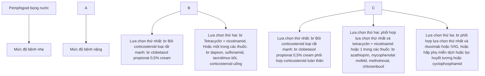


168

- Tái phát: khi xuất hiện ≥ 3 tổn thương mới (bọng nước hoặc trọt) trong 1 tháng, các tổn thương này không lành trong 1 tuần hoặc ở những bệnh nhân đã kiểm soát được bệnh tổn thương cũ lan rộng.

- Điều trị tối thiểu: prednisolon ≤ 0,1 mg/kg/ngày hoặc clobetasol propionat 0,05% ≤ 20 g/ngày hoặc minocyclin, doxycyclin ≤ 100 mg/ngày, azathioprin ≤ 1 mg/kg/ngày hoặc methotrexat (MTX)≤ 5 mg/tuần hoặc mycophenolat mofetil ≤500 mg/ngày hoặc cyclosporin ≤ 1 mg/kg/ngày hoặc nicotinamid ≤ 500 mg/ngày.

**3.2.2. Điều trị tại chỗ**

- Thuốc bôi clobetasol propionate 0,5% cream
+ Mức độ bệnh nặng: 30 - 40g/ngày, bôi lên toàn bộ cơ thể trừ mặt (sử dụng 20g/ngày nếu cân nặng < 45 kg).
+ Mức độ bệnh nhẹ: bôi 1 lần/ngày toàn cơ thể trừ mặt, 20g/ngày (hoặc 10g/ngày nếu cân nặng < 45kg).
  - Nếu sau 1 - 3 tuần không kiểm soát được bệnh tăng liều lên tối đa 40g/ngày.
    Khi đạt kiểm soát được bệnh thì giảm liều bôi.
  - Chăm sóc tổn thương da, thuốc kháng sinh bôi, thuốc sát khuẩn tại chỗ nếu có bội nhiễm, kem dưỡng ẩm làm dịu da, giảm ngứa.

**3.2.3. Điều trị toàn thân**

- Corticosteroid toàn thân:
+ Liều trung bình, khởi đầu tương đương prednisolon 0,5 mg/kg/ngày đến khi đạt kiểm soát bệnh, dùng tiếp 15 ngày, sau đó giảm liều chậm đến liều tối thiểu có tác dụng (0,1 mg/kg/ngày) hoặc cắt thuốc sau 6 tháng dùng. Nếu trong quá trình giảm liều mà tái phát, cần quay trở về liều trước đó và cần nhắc thêm các thuốc toàn thân khác.
+ Nếu sau 1 - 3 tuần dùng liều khởi đầu không kiểm soát được bệnh thì tăng liều lên 0,75 mg/kg/ngày, có thể phối hợp thêm các thuốc toàn thân khác.
  - Các thuốc toàn thân khác:
    + Tetracyclin (tetracyclin 500 - 2000mg/ngày, doxycyclin 200mg/ngày, minocyclin 100 - 200mg/ngày) dùng đơn độc từng loại hoặc phối hợp với nicotinamid 2 g/ngày.
    + Azathioprin 1-3mg/kg/ngày, mycophenolat mofetil 2g/ngày, methotrexat 15 mg/tuần, chlorambucil 2 - 4mg/ngày, cyclosporin 3 - 5mg/kg/ngày, dapson 50 - 200mg/ngày.
    + Nếu kháng trị xét lựa chọn tiếp theo như rituximab, IVIG, hấp thụ miễn dịch, lọc huyết tương, cyclophosphamid.
  - Dùng điều trị: thời gian điều trị trung bình của bệnh là 6 - 12 tháng.
  - Các tiêu chuẩn dùng thuốc:
    + Ổn định bệnh ít nhất 3 - 6 tháng dưới điều trị tối thiểu.
    + Xét nghiệm: miễn dịch huỳnh quang trực tiếp âm tính và hoặc anti-BP180 ELISA âm tính (hoặc < 27 U/ml).


169

**3.2.4. Điều trị hỗ trợ**
- Kháng sinh toàn thân chống bội nhiễm.
- Bù dịch, điện giải.
- Kháng histamin giảm triệu chứng ngứa.

**4. PHÒNG BỆNH**
- Tránh dùng các thuốc nghi ngờ gây khởi phát bệnh.
- Phát hiện và điều trị bệnh sớm, tránh cào gãi, vệ sinh sạch sẽ vùng da bị bệnh để tránh nhiễm khuẩn toàn thân do bội nhiễm vi khuẩn, virus.


170

# **VIÊM DA DẠNG HERPES**
**(Dermatitis herpetiformis)**

## **1. ĐẠI CƯƠNG**

### 1.1. Khái niệm

- Năm 1884, Duhring lần đầu tiên mô tả một thể lâm sàng có các tổn thương da dạng gồm hồng ban, bọng nước, mụn nước, ngứa. Sau đó, năm 1888, Brocq bổ sung và bệnh được mang tên Duhring-Brocq. Bệnh có 4 đặc điểm (gọi là tứ chứng Brocq): tổn thương da dạng (hồng ban, bọng nước); dấu hiệu chủ quan rõ; tiến triển từng đợt; toàn trạng tương đối tốt.

- Do tổn thương chủ yếu là những bọng nước nhỏ tập trung thành đám, thành cụm trên nền da đỏ như bệnh herpes nên bệnh còn được gọi là “viêm da dạng herpes của Duhring-Brocq” (DH). Hiện nay bệnh được xếp vào nhóm bệnh da bọng nước tự miễn có liên quan đến bệnh tiêu chảy mỡ (celiac disease-CD).

### 1.2. Dịch tễ

- Bệnh gặp ở mọi nơi trên thế giới, nam nhiều hơn nữ. Bệnh gặp chủ yếu ở người da trắng, ít gặp ở người da đen.

- Bệnh gặp bất kỳ tuổi nào, tuổi khởi phát thường là 40, nhưng có thể thay đổi từ 20-90 tuổi.

### 1.3. Căn nguyên/Cơ chế bệnh sinh

Mặc dù còn nhiều bàn cãi, song hiện nay người ta đã phát hiện được nhiều yếu tố liên quan tới nguyên nhân và sinh bệnh học của bệnh này.

- Yếu tố di truyền: liên quan tới HLA-B8, HLA-RW3 và HLA-DQ2.

- Yếu tố miễn dịch: Có sự lắng đọng kháng thể IgA ở đỉnh các nhú bì, trong đó chủ yếu là lắng đọng dạng hạt (85-95%), lắng đọng dạng dải chỉ chiếm 5-15%. Bổ thể C3 lắng đọng thành hạt ở nhú bì.

- Liên quan với các bệnh tự miễn: DH liên quan với một số bệnh tự miễn như viêm cầu thận, thiếu máu Biermer, viêm tuyến giáp, lupus ban đỏ hệ thống, viêm đa sụn mạn tính teo. Những tự kháng thể được tìm thấy ở bệnh nhân DH đáng chú ý là kháng thể kháng tuyến giáp, kháng thể kháng reticulin và kháng gluten.

- Liên quan với các bệnh khác và u ác tính: gặp nhiều nhất là bệnh lý tuyến giáp, đặc biệt là viêm tuyến giáp Hashimoto. Một bệnh lý khác là u lympho tế bào T liên quan đến bệnh đường ruột cũng tăng trong DH.

- Vai trò của gluten:

  + Có sự bất thường ở dạ dày - ruột non trên 60-70% bệnh nhân DH. Ở đa số bệnh nhân DH, tình trạng bệnh sẽ nặng hơn khi trong thức ăn có gluten và có các


171

bệnh lý ruột tăng nhạy cảm với gluten.

+ Gluten là một protein có trong ngũ cốc như hạt lúa mì, lúa mạch, lúa mạch đen, lúa yến mạch (trừ lúa gạo và ngô). Trong thành phần của gluten có gliadin được cho là căn nguyên chính gây bệnh. Thụ thể trên tế bào biểu mô ruột sẽ gắn với kháng nguyên gliadin tạo thành phức hợp thụ thể-gliadin. Phức hợp này sẽ xâm nhập vào màng đáy, từ đó kích thích tế bào lympho ở các hạch lympho quanh ruột khởi động đáp ứng miễn dịch niêm mạc gây ra teo các tế bào ống tiêu hóa, làm giảm sự hấp thụ của ruột. Trong DH, tăng độ nhớt ngoài tế bào sẽ kết hợp với sự khuếch tán của dịch tổ chức ở nhu bì dẫn đến hình thành mụn nước. Bệnh có thể điều trị bằng chế độ ăn không có gluten suốt đời.

+ DH và CD: cả hai bệnh đều có những rối loạn nhạy cảm với gluten, đều có khuynh hướng gia đình và đều có rối loạn chức năng ruột non.

## 2. CHẨN ĐOÁN

### 2.1. Triệu chứng lâm sàng

- Tổn thương thường xuất hiện từ từ trên một thể trạng bình thường. Bệnh nhân sốt nhẹ hoặc không sốt, mệt mỏi, sút cân không đáng kể. Trên các vùng da sắp có tổn thương thường có dấu hiệu báo trước là ngứa, sau đó là bỏng rát hoặc đau.

- Tổn thương lúc khởi phát là các ban đỏ, mụn nước, sẩn mề đay, sau dần dần xuất hiện bọng nước. Bọng nước thường xuất hiện trên nền dát đỏ, sắp xếp lẻ tẻ hay cụm lại như trong bệnh herpes nên còn gọi là “viêm da dạng herpes”. Các bọng nước to bằng hạt ngô, căng, tròn và bóng, trong chứa dịch màu vàng chanh, hiếm khi có bọng nước xuất huyết, xung quanh bọng nước có quanh đỏ. Bọng nước tồn tại 5-7 ngày, sau đó trở nên đục nếu có bội nhiễm. Sau vài ngày bọng nước vỡ ra để lại vết trợt, đóng vảy tiết.

- Trên cùng một bệnh nhân, các tổn thương thường đa dạng, nhiều hình thái và nhiều lứa tuổi, có chỗ là ban đỏ, có chỗ là bọng nước, có chỗ là sẩn phù, mụn nước, thậm chí có chỗ chỉ là một dát sẫm màu.

- Dấu hiệu Nikolsky âm tính.

- Vị trí tổn thương thường ở khuỷu tay, đầu gối, mông, đùi, sau đó là ở lưng và bụng, hiếm khi có tổn thương ở kẽ nách, vùng xương cùng. Ở phần lớn các trường hợp, tổn thương có tính chất đối xứng.

- Tổn thương niêm mạc ít gặp, chỉ khoảng 4,6% bệnh nhân DH, nếu có, thường ở họng.

- Ở nhiều bệnh nhân, bệnh xuất hiện hoặc nặng lên trong vòng vài giờ hoặc vài ngày khi ăn chế độ ăn có gluten hoặc iode. Ngoài ra còn có thể thấy trên bệnh nhân đường typ I, bệnh tuyến giáp, bệnh máu ác tính và các u lympho.


172

- Tiến triển: Bệnh tiến triển mạn tính, thành từng đợt, lúc tăng lúc giảm, lúc tạm ổn định. Một phần ba trường hợp có thể tự khỏi. Bệnh có thể tái phát nhưng có thể không chế được nhờ uống sulfon (dapson) hoặc chế độ ăn không có gluten. Có trường hợp bệnh kéo dài suốt đời nhưng bệnh nhân vẫn sinh hoạt, lao động như bình thường, trừ vài trường hợp ở người cao tuổi, lâu ngày có thể bị suy kiệt.

## 2.2. Cận lâm sàng

- Xét nghiệm tế bào Tzanck : không có tế bào gai lệch hình, xâm nhập viêm chủ yếu bạch cầu đa nhân trung tính.

- Mô bệnh học: bọng nước dưới thượng bì. Thượng bì hoàn toàn bình thường và bị đẩy lên cùng màng đáy, không có hiện tượng tiêu gai. Đỉnh như bị thâm nhiễm chủ yếu là bạch cầu đa nhân trung tính, đôi khi có bạch cầu đa nhân ái toan. Ở trung bì nông có thâm nhiễm tế bào lympho, bạch cầu trung tính, bạch cầu ái toan xung quanh mạch máu.

- Miễn dịch huỳnh quang:
  + Miễn dịch huỳnh quang trực tiếp: là tiêu chuẩn vàng trong chẩn đoán bệnh DH. Có sự lắng đọng dạng hạt của IgA ở đỉnh như bì hay ranh giới trung bì-thượng bì. Ngoài ra, có thể thấy sự lắng đọng của bổ thể C3 và fibrinogen. Sự lắng đọng IgA có thể trong vùng tổn thương và ngoài vùng tổn thương.
  + Miễn dịch huỳnh quang gián tiếp: kháng thể IgA tuần hoàn có thể tìm thấy trên khoảng 70% bệnh nhân và hiệu giá kháng thể có liên quan đến mức độ trầm trọng của tổn thương theo các sợi lông nhưng vùng hồng tràng.

- Xét nghiệm máu: nói chung không đặc hiệu, có thể thấy số lượng bạch cầu ái toan tăng trên 10%.

## 2.3. Chẩn đoán xác định:

Chẩn đoán xác định dựa vào lâm sàng và xét nghiệm miễn dịch huỳnh quang trực tiếp.

## 2.4. Chẩn đoán phân biệt

- Hồng ban đa dạng
- Chốc
- Pemphigus
- Bệnh zona
- Bệnh herpes
- Bệnh ly thượng bì bọng nước bẩm sinh
- Bệnh porphyria da
- Ly thượng bì bọng nước mắc phải
- Pemphigoid bọng nước


173

# 3. **ĐIỀU TRỊ**

## 3.1. **Nguyên tắc điều trị**

- Chế độ ăn không có gluten
- Điều trị bằng các thuốc chống viêm như dapson, sulfapyridin.
- Kết hợp điều trị tại chỗ và điều trị toàn thân
- Corticosteroid toàn thân ít có tác dụng

## 3.2. **Điều trị cụ thể**

### 3.2.1. **Tại chỗ**

- Tổn thương ướt, bọng nước: Có thể đắp các tổn thương trợt ướt, bọng nước vỡ bằng dung dịch Jarish, tẩm bằng dung dịch thuốc tím pha loãng.
- Tổn thương khô: bôi mỡ kháng sinh và/hoặc bôi mỡ corticosteroid.

### 3.2.2. **Toàn thân**

- Chế độ ăn không có gluten đơn thuần đã có thể kiểm soát được bệnh hoặc có tác dụng giảm được thuốc dùng toàn thân. Tuy nhiên, điều này khó thực hiện trong thực đơn.
- Thuốc được dùng chủ yếu là dapson 100-300mg/ngày hoặc 0,5mg/kg/ngày đối với trẻ em. Triệu chứng có thể giảm đi trong vòng 3 giờ hoặc vài ngày. Bệnh nhân được khuyến cáo nên duy trì liều thấp để không chế các triệu chứng.
- Sulfapyridin 1-1,5g/ngày có hiệu quả trên một số bệnh nhân, nhất là những bệnh nhân không đáp ứng với dapson.
- Có thể dùng tetracyclin 500mg từ 1 đến 4 lần/ngày hoặc minocyclin 100mg 2 lần/ngày và nicotinamid 500mg 2-3 lần/ngày hoặc phối hợp tetracyclin với nicotinamid. Thuốc nhóm cyclin không dùng cho trẻ em

## 4. **PHÒNG BỆNH**

Để tránh bệnh tái phát, cần thực hiện chế độ ăn không có gluten.


174

# **BỆNH IGA THÀNH DÃI**
*(Linear IgA dermatosis)*

## **1. ĐẠI CƯƠNG**

### **1.1. Khái niệm**

- Bệnh IgA thành dãi (linear IgA bullous dermatosis-LAD) là bệnh da bong nước tự miễn dưới thượng bì hiếm gặp, gây ra do tự phát hay do thuốc, đặc trung bởi sự lắng đọng IgA thành dãi ở màng đáy.

- Bệnh da bong nước IgA thành dãi có thể xuất hiện ở cả người lớn và trẻ em với các tên gọi khác nhau. Ở trẻ em, bệnh được gọi là bệnh da bong nước mạn tính ở trẻ em (chronic bullous disease of childhood-CBDC), trong khi ở người lớn bệnh được gọi là bệnh IgA thành dãi (LAD).

### **1.2. Dịch tễ**

- Bệnh gặp ở tất cả các chủng tộc với tỷ lệ khác nhau.

- Bệnh có 2 đỉnh tuổi phát bệnh. Ở trẻ em, bệnh gặp chủ yếu ở trẻ dưới 5 tuổi, bắt đầu ở độ tuổi từ 6 tháng đến 10 tuổi, trung bình 3,3-4,5 tuổi. Trong khi ở người lớn, bệnh gặp từ 14-80 tuổi, trung bình 50 tuổi và thường phát sau khi sử dụng một số thuốc, đặc biệt là vancomycin.

- Bệnh hay gặp ở nữ nhiều hơn nam, tỉ lệ nữ/nam là 1,6/1.

### **1.3. Căn nguyên/Cơ chế bệnh sinh**

- Căn nguyên gây LAD chưa rõ ràng, đa số là vô căn, phát sinh một cách tự nhiên. Tuy nhiên, LAD có thể gây nên do một số căn nguyên khác. Đôi khi bệnh xảy ra sau một nhiễm trùng, hiếm hơn là do dị ứng thuốc. Vancomycin là thuốc thường được đề cập nhiều nhất liên quan đến khởi phát LAD. Ngoài ra, một số thuốc khác cũng được đề cập đến như diclofenac, captopril, cotrimoxazol, sodium hypochlorit và somatostatin...

- Bệnh IgA thành dãi đi kèm với bệnh ác tính gặp khoảng 5%. Các bệnh ác tính thường là u lympho, đặc biệt là bệnh Hodgkin, không Hodgkin, bệnh bạch cầu dòng lympho mạn tính, ung thư bàng quang, ung thư biểu mô tế bào vảy thực quản, ung thư vú, ung thư tử cung, ung thư biểu mô tuyến mô hôi... Tuy nhiên, mối liên quan giữa IgA thành dãi với bệnh ác tính vẫn chưa được chứng minh.

- Kháng nguyên đích: phần 97 kDa của BPAG2 (kháng nguyên pemphigoid 2 hay còn gọi là BP180) nằm trong lá sáng. Tiêu đơn vị này nằm trong miền NC16A. Trong bệnh pemphigoid bong nước, các kháng thể IgG lưu hành liên kết với vùng MCW-1 của miền NC16A gần đầu amino hơn, trong khi tiêu đơn vị 97kDa nằm ở đầu carboxy.


175

## **2. CHẨN ĐOÁN**

### **2.1. Triệu chứng lâm sàng**

#### **2.1.1. Tổn thương da**

- Tổn thương cơ bản là các đám mụn nước, bong nước chứa dịch trong và/hoặc xuất huyết sắp xếp thành hình tròn hoặc bầu dục trên nền da bình thường hay nền da đỏ/mảng da đỏ phù dạng mây dày. Các tổn thương này sắp xếp thành đám, thành cụm giống bệnh herpes nên còn gọi là hình thái herpes (herpetiform) hay tập trung ở ria bờ dát đỏ theo hình nhân hoặc hình đa cung, hay gặp ở mặt đuôi của đầu gối và khuỷu tay.

- Các loại tổn thương khác là mảng đỏ, dát, sẩn giống hồng ban đa dạng hay các tổn thương thứ phát như vết tiết, vết trợt, vết loét, có thể đối xứng hoặc không, khi lành không để lại sẹo.

- Sự phân bố của các tổn thương khác nhau giữa người lớn và trẻ em

+ Ở trẻ em, tổn thương diễn hình thường xuất hiện trước tuổi dậy thì với một khởi phát đột ngột là bong nước ở bộ phận sinh dục, sau đó lan đến tay, chân và mặt. Thời kì toàn phát, tổn thương chủ yếu ở vùng bụng dưới, sinh dục ngoài và vùng đáy chậu. Ngoài ra còn thấy các tổn thương ở tay, chân, mặt, đặc biệt là vùng quanh miệng.

+ Ở người lớn, vị trí đầu tiên thường ở các chi, sau đó có thể xuất hiện ở bất cứ vị trí nào trên cơ thể. Vùng đáy chậu và quanh miệng ít gặp hơn. Hình ảnh các tổn thương tương tự như viêm da dạng herpes (DH), pemphigoid bong nước (BP) hay hồng ban đa dạng (erythema multiforme-EM).

- Bệnh có thể làm tăng nguy cơ bị u lympho.

- Cơ năng có thể có ngứa.

### **2.1.2. Tổn thương niêm mạc**

- Khoảng 50% các trường hợp LAD ở cả người lớn và trẻ em có tổn thương trong miệng. Triệu chứng bao gồm các mụn nước trợt loét, dát đỏ, viêm lợi, viêm môi trợt… Các biểu hiện này có thể xuất hiện trước khi có tổn thương da.

- Có thể thấy tổn thương ở mắt như kích ứng, khô, nhạy cảm ánh sáng, nhìn mờ, sẹo giác mạc và thậm chí mù loà.

- Nếu bệnh kéo dài, tổn thương niêm mạc khi lành thường để lại sẹo và có thể gây nên hậu quả nặng nề. Viêm lợi thứ phát có thể làm hồng răng. Tổn thương ở mắt rất khó phân biệt được với pemphigoid sẹo (pemphigoid cicatricial) và có thể dẫn đến mù loà. Ngoài ra, có thể thấy tổn thương ở hầu họng, thanh quản, mũi, trực tràng và thực quản.


176

**2.1.3. Tiến triển**

- Bệnh LAD ở trẻ em thường lành tính, tự thuyên giảm, có thể tồn tại một vài tháng đến vài năm, nhưng hiếm khi đến tuổi dậy thì.

- Ở người lớn bệnh thường kéo dài hơn, trung bình 5-6 năm, kéo dài trong khoảng 1-15 năm.

- Các trường hợp bệnh gây nên do thuốc thường mất đi nhanh chóng nếu xác định được thuốc gây bệnh và ngừng sử dụng.

**2.2. Cận lâm sàng**

- Xét nghiệm tế bào Tzanck: không có tế bào gai lệch hình.

- Mô bệnh học: bong nước dưới thượng bì. Thượng bì hoàn toàn bình thường và bị đẩy lên cùng màng đáy, không có hiện tượng tiêu gai. Trung bì có xâm nhập chủ yếu là bạch cầu đa nhân trung tính, ngoài ra còn có bạch cầu đơn nhân và bạch cầu ái toan.

- Miễn dịch huỳnh quang:

  + Miễn dịch huỳnh quang trực tiếp: lắng đọng IgA thành dải ở màng đáy.

  + Miễn dịch huỳnh quang gián tiếp: kháng thể tuần hoàn IgA có thể thấy ở trẻ em (80%), thường xuyên hơn người lớn (30%). Miễn dịch huỳnh quang gián tiếp tách muối cho tỉ lệ IgA dương tính cao hơn và chủ yếu là dương tính ở đỉnh bong nước.

    - Đặc điểm miễn dịch huỳnh quang theo căn nguyên:

      + Nếu LAD tự phát: khoảng 50% cho thấy có lắng đọng cả IgA và IgG ở màng đáy.

      + Nếu LAD do thuốc: chủ yếu lắng đọng IgA (89%) ở màng đáy, không có IgG.

**2.3. Chẩn đoán xác định:**

Dựa vào lâm sàng và xét nghiệm miễn dịch huỳnh quang trực tiếp

**2.4. Chẩn đoán phân biệt**

- Hồng ban đa dạng

- Pemphigoid bong nước

- Viêm da dạng herpes

- Ly thượng bì bong nước mắc phải

- Chốc

- Lupus bong nước

**3. ĐIỀU TRỊ**


177

# 3.1. **Nguyên tắc điều trị**

- Ngừng thuốc nghi ngờ gây bệnh.
- Điều trị bằng các thuốc chống viêm như dapson, sulfapyridin và/hoặc corticosteroid toàn thân.
- Kết hợp điều trị tại chỗ và điều trị toàn thân

# 3.2. **Điều trị cụ thể**

## 3.2.1. **Tại chỗ**

- Dung dịch sát khuẩn (nếu tổn thương còn bọng nước nên dùng kim vô khuẩn chọc thủng dịch trước khi bôi).
- Khi tổn thương khô có thể bôi mỡ kháng sinh và/hoặc mỡ corticosteroid.
- Có thể đắp các tổn thương trợt ướt, bọng nước vỡ bằng dung dịch Jarish, tẩm bằng dung dịch thuốc tím pha loãng.

## 3.2.2. **Toàn thân**

- Lựa chọn thứ nhất: dapson 0,5 - 2 mg/kg/ngày (hoặc 50 - 200 mg/ngày) do cơ chế ức chế hóa ứng động bạch cầu, đáp ứng nhanh sau 1 - 2 ngày. Sử dụng từ liều thấp, tăng dần liều để đạt đáp ứng. Nên làm các xét nghiệm loại trừ thiếu hụt G6PD, theo dõi công thức máu để hạn chế tác dụng phụ của dapson.

- Lựa chọn thứ 2:
  + Sulfasalazin 1 - 1,5mg/ ngày đơn trị hoặc kết hợp, sulfamethoxypyridazin 0,25 - 1,5 g/ngày mang lại tác dụng trong một số báo cáo lâm sàng.
  + Colchicin 0,6 - 1 mg/kg/2 lần/ngày.

- Lựa chọn thứ 3: corticosteroid liều tương đương prednisolon đơn trị 0,5 - 1 mg/kg/ngày. Sau đó giảm liều theo phác đồ đến liều thấp nhất có đáp ứng lâm sàng.

- Lựa chọn khác: methotrexat, mycophenolat mofetil, azathioprin, cyclosporin, dicloxacillin, erythromycin, interferon, IVIG, thalidomid, infliximab cân nhắc trong trường hợp không đáp ứng với lựa chọn đầu tiên và lựa chọn số hai.

# 4. **PHÒNG BỆNH**

- Tránh sử dụng các thuốc có nguy cơ cao gây bệnh.
- Sử dụng kháng sinh khác thay thế vancomycin nếu nguyên nhân do vancomycin.


178

# Chương 5

# **BỆNH DA DỊ ỨNG – MIỄN DỊCH VÀ BỆNH DA VIÊM**


179

# **VIÊM DA TIẾP XÚC**
**(Contact Dermatitis)**

## 1. **ĐẠI CƯƠNG**

### 1.1. **Khái niệm**

- Viêm da tiếp xúc là phản ứng viêm cấp tính hoặc mạn tính của da với một số yếu tố trong môi trường khi tiếp xúc với da.

- Viêm da tiếp xúc dị ứng (VDTXDU) là phản ứng tăng nhạy cảm của da đối với các dị nguyên. Tổn thương là dát đỏ, mụn nước, có khi loét trợt hoại tử, ngứa. Bệnh tiến triển dai dẳng, hay tái phát nếu không phát hiện và loại trừ được dị nguyên.

- Viêm da tiếp xúc kích ứng (VDTXKU) là biểu hiện của phản ứng trên da đối với các tác nhân hóa học, lý học và sinh học bên ngoài. Biểu hiện của VDTXKU khá đa dạng bao gồm dát đỏ, mụn nước, trợt da, loét, kèm cảm giác châm chích, rát bỏng.

### 1.2. **Dịch tễ**

- Viêm da tiếp xúc dị ứng chiếm khoảng 20% trong số các viêm da tiếp xúc. Là bệnh thường gặp, chiếm 1,5-5,4% dân số thế giới. Mọi lứa tuổi, mọi giới và mọi nghề khác nhau đều có thể bị VDTXDU.

- Viêm da tiếp xúc kích ứng chiếm 80% trong số các trường hợp viêm da tiếp xúc, xảy ra ở hầu hết những người tiếp xúc với chất gây kích ứng. Nghiên cứu cộng đồng ở châu Âu về chàm (eczema) do tất cả các loại nguyên nhân cho thấy tỷ lệ VDTXKU từ 0,7-40%. Nghiên cứu tại Mỹ ở đối tượng lao động cho thấy viêm da tiếp xúc chiếm 90-95% bệnh da nghề nghiệp.

### 1.3. **Căn nguyên/Cơ chế bệnh sinh**

- Viêm da tiếp xúc dị ứng là biểu hiện của phản ứng quá mẫn chậm qua trung gian tế bào (typ IV). Lúc đầu kháng nguyên là hapten có trọng lượng phân tử thấp, tiếp xúc trên da, kết hợp với protein tạo phức hợp protein-hapten là kháng nguyên hoàn chỉnh, tác động đến hệ miễn dịch. Quá trình mẫn cảm này xảy ra trong 5-21 ngày. Sự tái tiếp xúc với kháng nguyên đặc hiệu gây tăng sinh rất nhanh các tế bào T đã hoạt hóa, giải phóng chất trung gian hóa học, di chuyển các tế bào T độc, gây phản ứng chàm trên da vùng tiếp xúc. Giai đoạn này xảy ra 48-72 giờ sau khi tiếp xúc và chỉ cần một liều nhỏ dị nguyên cũng đủ kích thích phản ứng viêm. Có trên 3700 dị nguyên được cho là có thể gây VDTXDU ở người. Một số dị nguyên chính là kim loại (nickel, cobalt, chromates đồng), thuốc bôi (chất màu, kháng sinh), dung dịch dầu, một số băng dính, chất dẻo, cao su, thực vật, ánh sáng.

- Có bốn cơ chế có liên quan đến VDTXKU gồm mất lớp lipid bề mặt và các


180

chất giữ nước, màng tế bào bị phá hủy, sự biến tính của keratin thượng bì và tác động độc tế bào trực tiếp. Có trên 2800 chất kích ứng. Tiếp xúc với các chất kích ứng mạnh gây triệu chứng lâm sàng ở hầu hết bệnh nhân, với các chất kích ứng nhẹ thì chỉ có biểu hiện cơ năng. Khi tiếp xúc nhiều lần với chất kích ứng gây ra hiện tượng tích lũy, phá hủy dần lớp sừng do phá hủy enzym hoặc làm tan màng tế bào gây viêm mạn tính.

**2. CHẨN ĐOÁN**

**2.1. Viêm da tiếp xúc dị ứng**

**2.1.1. Triệu chứng lâm sàng**

Tổn thương cơ bản: phụ thuộc vào mức độ nặng, vị trí và thời gian bị bệnh, VDTXDU<sup>7</sup> có thể cấp tính, bán cấp và mạn tính.

- *Viêm da tiếp xúc dị ứng cấp tính*

Biểu hiện là dát đỏ, ranh giới rõ, phù nề, trên bề mặt có mụn nước, sần. Trường hợp phản ứng mạnh có bong nước kết hợp lại với nhau thành mảng. Bong nước vỡ để lại vết trợt tiết dịch và đóng vảy tiết. Cơ năng có ngứa.

- *Viêm da tiếp xúc dị ứng bán cấp*

Biểu hiện là những mảng, dát đỏ nhẹ, kích thước nhỏ, trên có vảy da khô, đôi khi kèm theo những đốm màu đỏ nhỏ hoặc những sần chắc, hình tròn.

- *Viêm da tiếp xúc dị ứng mạn tính:*

Biểu hiện là da dày, lichen hóa, nếp da sâu thành những đường kẻ song song hoặc hình thoi, bong vảy da cùng các sần vệ tính, nhỏ, chắc, hình tròn, phẳng, những vết xùrc, dát đỏ và nhiễm sắc tố.

Bệnh thường gặp ở người đã mẫn cảm với dị nguyên gây viêm da tiếp xúc. Khởi đầu, tại vị trí da tiếp xúc lại với dị nguyên (48 giờ trở lên) xuất hiện tổn thương. Về sau, mỗi khi tiếp xúc với dị nguyên thì tổn thương xuất hiện nhanh hơn. Đa số trường hợp tổn thương vượt qua giới hạn vùng da tiếp tiếp xúc với dị nguyên, có thể rải rác ở những nơi khác. Cơ năng ngứa nhiều, có thể có cảm giác nhúc nhối và đau nếu bệnh nặng. Tổn thương có thể cấp tính hoặc mạn tính phụ thuộc vào hoàn cảnh tiếp xúc, đậm độ của dị nguyên, tần suất tiếp xúc, đa số các trường hợp có tính chất đối xứng.

**2.1.2. Cận lâm sàng**

- Patch test (test áp): Dùng để chẩn đoán xác định dị nguyên gây VDTXDU<sup>7</sup> và phân biệt với VDTXKU<sup>7</sup>.

- Test kích thích (provocative test): Để xác định cá thể nhạy cảm với chất tiếp xúc bằng cách bôi chất đó vào da ở mặt trong cẳng tay hay các vùng da khác ngày vài lần trong 7 ngày.


181

- Mô bệnh học: Ở thể cấp tính có xóp bào rất mạnh, phù gian bào, xâm nhập các lympho bào và bạch cầu ái toan vào thượng bì, bạch cầu đơn nhân và mô bào ở trung bì. Ở thể mạn tính, cùng với xóp bào là hiện tượng tăng gai làm mào liên nhú kéo dài xuống. Các nhú bì nhô cao và mở rộng, có hiện tượng dày sừng và thâm nhiễm lympho bào. Xét nghiệm này có thể giúp chẩn đoán phân biệt với các bệnh viêm da khác.

**2.1.3. Chẩn đoán xác định**

Dựa vào lâm sàng, yếu tố tiếp xúc. Test áp giúp xác định dị nguyên gây dị ứng.

**2.1.4. Chẩn đoán phân biệt**

- Viêm da tiếp xúc do ánh sáng
- Viêm da cơ địa
- Viêm da đầu
- Bệnh vẩy nến (ở lòng bàn tay, bàn chân)
- Nấm da
- Nếu có bong nước: bệnh zona, pemphigoid bong nước

**2.2. Viêm da tiếp xúc kích ứng**

**2.2.1. Triệu chứng lâm sàng**

Biểu hiện lâm sàng của VDTXKU tương đối đa dạng, có thể được xếp thành ba thể chính như dưới đây.

- *Phản ứng kích ứng*

Là biểu hiện nhẹ gồm đỏ da nhẹ, bong vảy, mụn nước hoặc vết trợt, thường gặp ở mặt mu bàn tay và ngón tay. Bệnh hay xảy ra ở người làm các công việc có tiếp xúc với nước, có thể tự khỏi hoặc tiến triển thành VDTXKU.

- *Viêm da tiếp xúc kích ứng*

Xảy ra do tiếp xúc với hoá chất mạnh như acid và kiềm. Biểu hiện nhẹ gồm châm chích, rát bỏng, da khô căng hoặc sần phù thoáng qua. Biểu hiện nặng gồm đỏ, phù nề, đau, mụn nước, bong nước, mụn mủ, loét da, hoại tử. Thương tổn giới hạn rất rõ với da lành, khu trú ở vùng tiếp xúc, xuất hiện nhanh trong vài phút đến vài giờ sau khi tiếp xúc với chất kích ứng. Có thể có trường hợp xuất hiện muộn, sau khi tiếp xúc với chất kích ứng 8-24 giờ hoặc thậm chí 2 tuần. Biểu hiện lâm sàng giống VDTXDU và đôi khi rất khó phân biệt, nhưng tiên lượng tốt hơn. Tổn thương lành nhanh sau vài ngày hoặc vài tuần ngừng tiếp xúc với chất kích ứng.

- *Viêm da tiếp xúc kích ứng mạn tính*

Đây là một bệnh hay gặp, xuất hiện khi tiếp xúc nhiều lần với chất có nồng độ thấp như xà phòng, dầu gội đầu. Các yếu tố thuận lợi gồm cạo xát, sang chân, độ ẩm thấp. Bệnh xảy ra vài tuần, vài tháng, có thể vài năm sau khi tiếp xúc với chất kích


182

úng. Biểu hiện gồm da đỏ, bốc vảy, nút nề, lichen hóa, giới hạn không rõ với da lành, ngứa. Viêm da bàn tay hay gặp ở phụ nữ hơn nam giới do tiếp xúc với các chất kích ứng khi làm công việc nội trợ.

**2.2.2. Cận lâm sàng**

- Patch test (test áp): Dùng để chẩn đoán phân biệt với VDTXDU<sup>7</sup>.
- Mô bệnh học: Không phải là xét nghiệm thường quy để chẩn đoán nhưng có thể giúp chẩn đoán phân biệt với bệnh vảy nến hoặc các bệnh da viêm khác.

**2.2.3. Chẩn đoán xác định**

Dựa vào lâm sàng, yếu tố tiếp xúc.

**2.2.4. Chẩn đoán phân biệt**

- Viêm da tiếp xúc dị ứng
- Viêm da cơ địa
- Viêm da đầu
- Bệnh vảy nến (ở lòng bàn tay, bàn chân)
- Tổ đỉa
- Bệnh nấm da
- Bệnh ghẻ

**3. ĐIỀU TRỊ**

**3.1. Nguyên tắc điều trị**

- Tìm và loại bỏ được căn nguyên gây bệnh.
- Điều trị phụ thuộc vào giai đoạn của bệnh, mức độ bệnh.
- Hồi phục hàng rào bảo vệ da.

**3.2. Điều trị cụ thể**

**3.2.1. Viêm da tiếp xúc dị ứng**

- *Trường hợp cấp tính, khu trú*
  + Corticosteroid tại chỗ.

  - Các vùng da mặt dúi, bàn tay, bàn chân: Dùng corticosteroid tại chỗ loại mạnh. Thuốc được bôi 1-2 lần/ngày trong 2-4 tuần hoặc cho tới khi lành thương tổn. Chú ý các tác dụng phụ của thuốc như teo da, giãn mạch.

  - Mặt và các vùng da mặt gấp: Dùng corticosteroid tại chỗ loại trung bình tới nhẹ. Thuốc được dùng 1-2 lần/ngày trong 1-2 tuần. Sau đó có thể dùng 2 ngày 1 lần trong 2 tuần tiếp theo.

  + Chẹn calcineurin tại chỗ (tacrolimus, pimecrolimus) là một lựa chọn thay


183

thể cho corticosteroid ở những người bệnh cần được tiếp tục điều trị lâu dài (trên 2 tuần). Thuốc được dùng 2 lần/ngày cho tới khi cải thiện thương tổn, sau đó giảm dần số lần bôi. Tác dụng phụ hay gặp là nóng, rát, châm chích tại chỗ nhưng không gây teo da.

+ Các điều trị khác: kem dưỡng ẩm có thể được dùng nhiều lần trong ngày; dung dịch Jarish dùng để đắp vùng thương tổn ướt, rỉ dịch, nhiều vảy tiết; kháng histamin uống để giảm ngứa; kháng sinh tại chỗ và/hoặc toàn thân được sử dụng nếu có bội nhiễm.

- *Trường hợp lan tỏa, nặng hoặc không ổn định*

Khi có trên 20% diện tích cơ thể bị ảnh hưởng hoặc liên quan tới vùng mặt, bàn tay, bàn chân hoặc vùng sinh dục, corticosteroid toàn thân được dùng như là lựa chọn thứ nhất. Sử dụng prednisolon, hoặc hoạt chất corticosteroid tương đương, liều 0,5-1 mg/kg/ngày (tối đa 60 mg/ngày) trong 7 ngày. Sau đó, liều thuốc được giảm 50% trong mỗi 5-7 ngày tiếp theo rồi dừng sau 2 tuần.

- *Trường hợp mạn tính*

+ Hàng rào bảo vệ da bị hỏng, teo da do tác dụng phụ của corticosteroid tại chỗ là một biến chứng hay gặp. Điều trị trường hợp mạn tính nhằm tối thiểu hóa việc sử dụng thuốc kéo dài trên 2-4 tuần. Các loại kem dưỡng ẩm không có dị nguyên được sử dụng tích cực bên cạnh việc dùng thuốc.

+ Sử dụng ngắt quãng corticosteroid tại chỗ: Dùng loại mạnh trong kiểm soát VDTXDU<sup>mạn tính</sup> ở bàn tay, bàn chân và các mặt đuôi. Thuốc được dùng ngày 1 lần trong 7-10 ngày đầu tiên, sau đó cách ngày, không nên dùng thuốc kéo dài quá 4 tuần. Trong trường hợp tái phát, có thể dùng nhắc lại.

+ Tacrolimus tại chỗ: Nên sử dụng trong trường hợp VDTXDU<sup>mạn tính</sup> ở mặt và các nếp khe, hoặc trường hợp không đáp ứng với corticosteroid tại chỗ. Tacrolimus 0,1% hoặc 0,03% được dùng 1-2 lần/ngày cho tới khi lành và nhắc lại nếu tái phát.

+ Có thể dùng thuốc kháng histamin để giảm ngứa. Sử dụng kháng sinh tại chỗ và/hoặc toàn thân nếu có bội nhiễm.

+ Lựa chọn cho VDTXDU<sup>mạn tính</sup> không đáp ứng với các phương pháp trên gồm:

  - Liệu pháp ánh sáng: tia cực tím (ultra violet-UV) B dải hẹp, UVA phối hợp với psoralen (PUVA)

  - Các thuốc ức chế miễn dịch toàn thân khác: methotrexat, azathioprin, mycophenolat mofetil, và cyclosporin.

**3.2.2. Viêm da tiếp xúc kích ứng**


184

- Chất dưỡng ẩm: Chất giữ ẩm, chất làm mềm da, chất tạo độ ẩm cho da được sử dụng như liệu pháp đầu tay.

  + Chất giữ ẩm như axit lactic, urê, glycerin hoặc axit sorbic giúp hút nước, hydrat hóa lớp sừng.

  + Chất làm mềm da (petrolatum, lanolin, dầu khoáng) hoạt động bằng cách làm chậm quá trình mất nước qua da, đồng thời dưỡng ẩm cho da.

  + Các chất tạo độ ẩm cho da: Kem dưỡng ẩm, chất làm mềm, chất tạo độ ẩm cho da có thể được sử dụng nhiều lần trong ngày trên vùng da bị ảnh hưởng hoặc các khu vực tiếp xúc

  - Corticosteroid tại chỗ: Chế phẩm dạng mỡ được sử dụng nhiều hơn dạng kem.

    + Trường hợp nặng, ở các vùng da ngoài mặt và không phải mặt gập: Sử dụng corticosteroid cực mạnh, ngày 1-2 lần trong 2-4 tuần.

    + Trường hợp nhẹ, ở các vùng da ngoài mặt và không phải mặt gập: Sử dụng corticosteroid loại mạnh, ngày 1-2 lần trong 2-4 tuần.

    + Trường hợp ở mặt và các mặt gập: Sử dụng corticosteroid loại trung bình tới nhẹ, ngày 1-2 lần trong 1-2 tuần.

## **4. PHÒNG BỆNH**

- Tránh tiếp xúc với các chất gây dị ứng, kích ứng; dùng đồ bảo hộ phù hợp khi làm việc trong môi trường có chất kích ứng hoặc dị nguyên nghề nghiệp; tư vấn nghề nghiệp phù hợp cho người bệnh.

- Xác định cơ địa nhạy cảm bằng cách đo độ đỏ của da, độ mất nước qua da hoặc dùng test áp để sàng lọc sự kích ứng của sản phẩm định dùng, đồng thời thăm dò phản ứng dị ứng của cơ thể.

  - Dùng kem bảo vệ, sản phẩm làm sạch thích hợp, tránh tắm rửa quá nhiều.

  - Thường xuyên bôi kem làm ẩm, nhất là sau khi làm việc, để chống nứt, khô da, tránh sự xâm nhập của các chất kích ứng, dị ứng.


185

# **VIÊM DA CƠ ĐỊA**
**(Atopic Dermatitis)**

## 1. **ĐẠI CƯƠNG**

### 1.1. **Khái niệm**
Viêm da cơ địa (trước đây được gọi là chàm thể tạng) là bệnh da viêm mạn tính, ngứa, hay tái phát, có tăng IgE, thường gặp ở người có tiền sử gia đình hen, viêm mũi dị ứng, viêm da cơ địa. Bệnh thường xuất hiện ở trẻ em và có thể tồn tại suốt đời.

### 1.2. **Dịch tễ**
Tỉ lệ bệnh viêm da cơ địa rất cao và khác nhau ở từng quốc gia. Bệnh thường khởi phát sớm ở trẻ nhỏ. Trên thế giới có khoảng 5 – 20% trẻ em bị bệnh này. Bệnh gặp ở cả hai giới. Trong những năm gần đây tỉ lệ viêm da cơ địa tăng cả ở những nước phát triển và đang phát triển.

### 1.3. **Căn nguyên/Cơ chế bệnh sinh**
- Yếu tố môi trường đóng vai trò khởi phát:
  + Ô nhiễm môi trường
  + Các dị nguyên có trong bụi nhà, lông súc vật, quần áo, đồ dùng gia đình…
  + Nhiễm khuẩn, đặc biệt là tụ cầu vàng
- Yếu tố di truyền: khoảng 60% người lớn bị viêm da cơ địa có con bị bệnh này, nếu cả bố và mẹ cùng bị bệnh thì con đẻ ra có đến 80% cũng bị bệnh. Đã xác định được một số gen liên quan đến bệnh viêm da cơ địa, trong đó quan trọng nhất là đột biến gen filaggrin – gen mã hóa cho protein có vai trò liên kết các sợi keratin thượng bì cấu trúc thượng bì dẫn đến tổn thương hàng rào bảo vệ da.
- Rối loạn cân bằng đáp ứng miễn dịch, vì vậy mất cân bằng đáp ứng miễn dịch Th1 và Th2.

## 2. **CHẨN ĐOÁN**

### 2.1. **Triệu chứng lâm sàng**
Bệnh viêm da cơ địa có các biểu hiện khác nhau tùy theo lứa tuổi.
- *Viêm da cơ địa ở trẻ nhi nhi*
  + Bệnh phát sớm khoảng 2-3 tháng sau sinh, thường cấp tính với các đám đỏ da, ngứa, sau đó xuất hiện nhiều mụn nước nông nhỏ như đầu đinh ghim tập trung thành từng đám, dễ vỡ, xuất tiết và đóng vảy tiết, có thể bội nhiễm, hạch lân cận sưng to.
  + Vị trí hay gặp nhất là 2 má, có thể ở da đầu, trán, cổ, thân mình, mặt dưới các chi. Khi trẻ biết bò có thể xuất hiện tổn thương ở đầu gối. Không thấy tổn thương ở vùng tá lót.
  + Trẻ có thể dị ứng với một số thức ăn như sữa, hải sản, thịt bò, thịt gà… Khi không ăn các thức ăn gây dị ứng thì bệnh viêm da cơ địa giảm rõ rệt.


186

+ Bệnh hay tái phát, mạn tính và rất nhạy cảm với các yếu tố như nhiễm trùng, mọc răng, tiêm chủng, thay đổi khí hậu hay môi trường sống.
  + Hầu hết bệnh sẽ tự khỏi khi trẻ được 18-24 tháng.
  - *Viêm da cơ địa ở trẻ em*
  + Thường từ viêm da cơ địa nhũ nhi chuyển sang.
  + Tổn thương là các sẩn đỏ, vết trọt, da dày, mụn nước khu trú hay lan toàn cấp tính kèm theo nhiễm khuẩn thứ phát.
  + Vị trí hay gặp nhất là ở khoeo, nếp gấp khuyu tay, mi mắt, hai bên cổ, căng tay, ở cổ có sạm da mạng lưới, ít khi ở mặt đuôi các chi.
  + Bệnh thường trở nên cấp tính khi trẻ tiếp xúc với lông súc vật, gia cầm, mặc đồ len, dạ…
  + Nếu tổn thương trên 50% diện tích da, trẻ thường suy dinh dưỡng.
  + Khoảng 50% sẽ khỏi khi trẻ được 10 tuổi.
  - *Viêm da cơ địa ở thanh thiếu niên và người lớn*
  + Biểu hiện là mụn nước, sẩn đỏ đẹt, có vùng da mỏng trên màng da dày, lichen hoá, ngứa. Vị trí hay gặp: nếp gấp khuyu, khoeo, cổ, rốn, vùng da quanh mắt. Khi bệnh lan toả thì vùng nặng nhất là các nếp gấp.
  + Viêm da lòng bàn tay, chân: gặp ở 20-80% người bệnh, có thể là dấu hiệu đầu tiên của viêm da cơ địa ở người lớn.
  + Viêm da quanh mi mắt, chàm ở vú.
  + Tiến triển mạn tính, ảnh hưởng nhiều bởi các dị nguyên, môi trường, tâm sinh lý người bệnh.
  - *Các biểu hiện khác của viêm da cơ địa*
  + Khô da: do tăng mất nước qua biểu bì.
  + Da cá, dày da lòng bàn tay, bàn chân, dày sừng nang lông, lông mi thưa.
  + Viêm môi bong vảy.
  + Dấu hiệu ở mắt, quanh mắt: mi mắt dưới có thể có 2 nếp gấp, tăng sắc tố quanh mắt, viêm kết mạc tái diễn có thể gây lợn mi.
  + Chứng da về nổi.
  - *Tiến triển và biến chứng:*
  + Khoảng 70% trẻ bị viêm da cơ địa sẽ khỏi khi lớn lên. Còn lại 30% kéo dài dai dẳng.
    + Khoảng 30-50% người bệnh viêm da cơ địa sẽ xuất hiện thêm các bệnh dị ứng khác như viêm mũi dị ứng, hen phế quản.

**2.2. Cận lâm sàng**
  - IgE trong huyết thanh thường tăng
  - Mô bệnh học: thượng bì có xóp bào xen kẽ với hiện tượng á sừng; trung bì có sự xâm nhập của bạch cầu lympho, mono, dưỡng bào, có hoặc không có các tế bào ái kiềm. Trường hợp lichen hoá có hiện tượng tăng sản thượng bì.


187

- Test xác định dị nguyên.
- Các xét nghiệm khác giúp đánh giá biến chứng và theo dõi điều trị, chẩn đoán phân biệt nếu cần: soi tươi tim bẩm, công thức máu, sinh hóa máu, ....

**2.3. Chẩn đoán xác định**

Có thể chẩn đoán xác định dựa vào một trong hai bộ tiêu chuẩn sau:

**2.3.1. Tiêu chuẩn của Hanifin và Rajka**

- *Tiêu chuẩn chính (4 tiêu chuẩn)*
  + Ngứa
  + Hình thái và vị trí tổn thương điển hình:
    - Lichen hoá ở các nếp gấp trẻ em hoặc thành dãi ở người lớn
    - Mụn nước tập trung thành đám ở mặt và mặt đuôi các chi ở trẻ em và trẻ sơ sinh
  + Tổn thương viêm da mạn tính hoặc tái phát.
  + Tiền sử cá nhân hay gia đình có mắc các bệnh dị ứng.

- *Tiêu chuẩn phụ (23 tiêu chuẩn)*
  + Khô da.
  + Vảy cá thông thường.
  + Phản ứng da tức thì.
  + Tuổi phát bệnh sớm.
  + Dễ nhiễm trùng da.
  + Viêm da bàn tay, bàn chân không đặc hiệu.
  + Chàm núm vú.
  + Viêm mũi.
  + Viêm kết mạc tái phát.
  + Nếp dưới mi mắt của Dennie Morgan.
  + Ngứa khi bài tiết mồ hôi.
  + Tăng IgE huyết thanh.
  + Tăng sắc tố quanh mắt.
  + Vảy phản Alba.
  + Nếp lằn cổ trước.
  + Ban đỏ, ban xanh ở mặt.
  + Không chịu được len và chất hòa tan mỡ.
  + Dày sừng quanh nang lông.
  + Dị ứng thức ăn.
  + Viêm kết mạc.
  + Giác mạc hình chóp.
  + Đục thủy tinh thể dưới màng bọc trước.
  + Tiến triển bệnh có ảnh hưởng bởi yếu tố môi trường và tinh thần

Để chẩn đoán xác định cần phải có ≥ 3 tiêu chuẩn chính kết hợp với ≥ 3 tiêu chuẩn phụ.


188

## 2.3.2. Tiêu chuẩn của Anh

| Ngứa da (bắt buộc)          |                                                                                                                                                    |
| --------------------------- | -------------------------------------------------------------------------------------------------------------------------------------------------- |
| **Ít nhất 3/5 triệu chứng** | Hiện tại có tổn thương dạng chàm ở nếp gấp (nếp gấp khuỷu, hố khoeo, mặt trước cổ chân, cổ tay- trên 18 tháng; ở má, mặt đuôi chi- dưới 18 tháng). |
|                             | Tiền sử cá nhân có tổn thương dạng chàm ở các vị trí như trên.                                                                                     |
|                             | Tiền sử cá nhân có khô da trong ít nhất 12 tháng.                                                                                                  |
|                             | Tiền sử cá nhân bị hen hoặc viêm mũi xoang dị ứng (hoặc tiền sử gia đình có bố mẹ/anh chị em bị hen/viêm mũi xoang dị ứng nếu là trẻ dưới 4 tuổi). |
|                             | Khởi phát sớm, dưới 2 tuổi (tiêu chí này không áp dụng cho trẻ dưới 4 tuổi).                                                                       |


## 2.4. **Chẩn đoán phân biệt**

- Chàm vị trùng
- Viêm da đầu
- Viêm da tiếp xúc
- Ghề
- Rôm sảy
- Nấm da

## 3. **ĐIỀU TRỊ**

### 3.1. Nguyên tắc điều trị

- Điều trị tùy theo giai đoạn, mức độ bệnh.
- Dùng các sản phẩm chăm sóc da, dưỡng ẩm thường xuyên, duy trì.
- Tư vấn cho người bệnh và gia đình biết cách điều trị và phòng bệnh.

### 3.2. Điều trị cụ thể

#### 3.2.1. **Điều trị tại chỗ**

- Lựa chọn dạng bào chế thuốc phù hợp với giai đoạn bệnh
  + Giai đoạn cấp tính: Đắp liên tục vào tổn thương bằng các loại dung dịch như Jarish, nước muối sinh lý 0.9%.
  + Giai đoạn bán cấp: dùng các loại hồ.
  + Giai đoạn mạn tính: dùng các loại thuốc dạng kem hoặc dạng mỡ.
- Các thuốc bôi tại chỗ:
  + Corticosteroid được dùng nhiều trong điều trị viêm da cơ địa.
    - Trẻ dưới 3 tháng tuổi dùng loại hoạt tính yếu.
    - Trẻ từ 3 tháng tuổi: có thể dùng các loại có hoạt tính yếu đến trung bình.
    - Trẻ trên 2 tuổi và người lớn có thể dùng các loại corticosteroid có hoạt tính mạnh hơn tùy tình trạng bệnh.
  - Lưu ý: với tổn thương vùng da mỏng, nhạy cảm như mặt dùng mỡ


189

corticosteroid nhẹ hơn, ít ngày, còn vùng da dày, lichen hoá thì dùng loại mạnh hơn để giảm ngứa, giảm viêm.

- Corticosteroid bôi 1 lần/ngày và cần giảm liều một cách từ từ, tránh tái phát. Với vùng da mỏng như mặt, các nếp gấp thời gian bôi thuốc thường không quá 10 ngày liên tục. Với các vùng da dày có thể bôi kéo dài đến khi tổn thương ổn định thì giảm liều dần.

- Khi dùng corticosteroid bôi tại chỗ cần chú ý các tác dụng phụ trên da như mỏng da, teo da, viêm nang lông, trứng cá, giãn mạch, xuất huyết, bội nhiễm nấm-virus...

  + Thuốc bặt sừng bong vảy như mỡ salicylic 5%, 10%, mỡ goudron, ichthyol, crysophanic trong trường hợp vảy dày, lichen hóa nặng.

  + Thuốc chẹn calcineurin: rất hiệu quả đối với viêm da cơ địa và hạn chế được các tác dụng phụ của corticosteroid trên da, tuy nhiên thuốc đắt tiền và hay gặp kích ứng da trong thời gian đầu sử dụng, thường sử dụng sau đợt điều trị corticosteroid tại chỗ. Tacrolimus 0,03% chỉ định cho trẻ từ 2 đến 16 tuổi. Tacrolimus 0,1% chỉ định cho bệnh nhân từ 16 tuổi trở lên. Tacrolimus bôi 2 lần/ngày đến khi tổn thương ổn định hoàn toàn thì duy trì bôi thêm ít nhất 4 đến 8 tuần để tránh tái phát.

**3.2.2. Điều trị toàn thân**

- Kháng histamin H1: dùng khi bệnh nhân có biểu hiện ngứa.

- Kháng sinh trong trường hợp có nhiễm khuẩn đặc biệt là tụ cầu vàng, liên cầu. Cho kháng sinh thuộc nhóm cephalosporin thế hệ 1 hoặc amoxicillin kết hợp acid clavulanic là tốt nhất, cho một đợt từ 10-14 ngày.

- Corticosteroid: có thể được chỉ định trong thời gian ngắn khi bệnh bùng phát nặng, lưu ý không dùng thuốc kéo dài. Thường cho liều tương đương 0,5-1mg prednisolon/kg cân nặng trong 3 đến 7 ngày đầu khi cần khống chế nhanh tình trạng bệnh, sau đó cắt corticosteroid toàn thân chỉ dùng thuốc tại chỗ hoặc chuyển sang các thuốc toàn thân khác.

- Liệu pháp ánh sáng: NB-UVB hoặc UVA1

- Các thuốc khác được chỉ định trong trường hợp bệnh dai dẳng, tái phát nhiều, không đáp ứng với các điều trị trên:

  + Cyclosporin A liều 3-5mg/kg/ngày dùng 4 đến 8 tuần hoặc lâu hơn cho đến khi bệnh ổn định.

  + Methotrexat 10-25 mg/tuần, dùng 2-4 tháng hoặc lâu hơn tùy theo đáp ứng của từng bệnh nhân.

  + Thuốc sinh học dupilumab (thuốc ức chế I4 và IL13)
    - Người lớn dùng liều 300mg- 600mg mỗi 2 tuần
    - Trẻ em trên 6 tuổi liều tính theo cân nặng
      ✓ Cân nặng từ 60kg trở lên: liều khởi đầu 600mg sau đó duy trì 300mg mỗi 2 tuần.
      ✓ Cân nặng từ 30 đến 59kg: liều khởi đầu 400mg sau đó duy trì 200mg


190

mỗi 2 tuần.
✓ Cân nặng từ 15 đến 29kg: liều khởi đầu 600mg sau đó duy trì 300mg mỗi 4 tuần

- Trẻ em từ 6 tháng tuổi đến 5 tuổi liều tính theo cân nặng
  ✓ Cân nặng từ 5 đến 15kg dùng liều 200mg mỗi 4 tuần
  ✓ Cân nặng từ 15 đến 30kg dùng liều 300mg mỗi 4 tuần
  + Thuốc sinh học tralokinumab (thuốc ức chế IL13) 300mg- 600mg mỗi 2 tuần (chỉ dùng cho người lớn).
    + Thuốc ức chế JAK: baricitinib 4mg/ngày (chỉ dùng cho người lớn) hoặc upadacitinib15mg- 30mg/ ngày (trẻ từ 12 tuổi trở lên).

**3.2.3. Các phương pháp điều trị hỗ trợ**
- Sữa tắm: Tắm hàng ngày bằng nước ấm với các sản phẩm làm sạch dịu nhẹ.
- Dưỡng ẩm: sử dụng kem dưỡng ẩm phù hợp lứa tuổi, tình trạng bệnh thường xuyên, duy trì.

**4. PHÒNG BỆNH**
- Duy trì sữa tắm dưỡng ẩm, kem dưỡng ẩm, tăng cường bôi kem dưỡng ẩm khi thời tiết hanh khô, ít nhất 2-3 lần mỗi ngày.
- Tắm nước ấm, không quá nóng, không quá lạnh, nhiệt độ < 36°C, ngay sau khi tắm xong bôi thuốc ẩm da, dưỡng da.
- Giảm các yếu tố khởi phát: giữ phòng ngủ thoáng mát, tránh tiếp xúc lông gia súc, gia cầm, len, dạ, giảm bụi nhà, giảm stress, nên mặc đồ vải cotton.
- Ăn kiêng chỉ áp dụng cho trường hợp bệnh nặng, trẻ nhỏ, khi đã xác định rõ loại thức ăn gây kích thích.
- Giáo dục người bệnh, người nhà người bệnh kiến thức về bệnh, yếu tố khởi động, quan điểm điều trị, lợi ích và nguy cơ.
- Tư vấn cho những người có yếu tố gia đình các biện pháp phòng bệnh.


191

# **VIÊM DA TIẾP XÚC DO ÁNH SÁNG**

**(Photocontact Dermatitis)**

## 1. **ĐẠI CƯƠNG**

### 1.1. **Khái niệm**

Viêm da tiếp xúc do ánh sáng là bệnh da xảy ra do sự tương tác giữa ánh sáng với một loại hóa chất nào đó sử dụng trong da. Hóa chất có thể là thuốc, mỹ phẩm, sản phẩm nông nghiệp hoặc công nghiệp. Viêm da tiếp xúc do ánh sáng bao gồm: viêm da tiếp xúc kích ứng do ánh sáng (phản ứng nhiễm độc ánh sáng) và viêm da tiếp xúc dị ứng do ánh sáng (phản ứng dị ứng ánh sáng).

### 1.2. **Dịch tễ**

Viêm da tiếp xúc do ánh sáng thường gặp ở người lớn, gặp ở tất cả các chủng tộc, màu da. Tỷ lệ gặp ở nam nữ như nhau. Bệnh thường xuất hiện ở những người thường xuyên tiếp xúc với ánh sáng mặt trời, thường nặng vào mùa xuân hè, thuyên giảm vào mùa thu đông. Viêm da tiếp xúc kích ứng do ánh sáng thường gặp hơn viêm da tiếp xúc dị ứng do ánh sáng.

### 1.3. **Căn nguyên/Cơ chế bệnh sinh**

- Viêm da tiếp xúc kích ứng do ánh sáng xảy ra do sự tương tác giữa ánh sáng với một loại hóa chất nào đó trong da tạo ra các sản phẩm như các gốc tự do, chất oxy hóa mạnh gây phá hủy trực tiếp tế bào. Viêm da tiếp xúc dị ứng do ánh sáng xảy ra khi hóa chất tương tác với ánh sáng hình thành kháng nguyên, kích hoạt phản ứng dị ứng type IV.

- Nguyên nhân thường gặp:
  + Thực vật có chứa psoralen như trái cây họ cam quýt (chanh), cần tây (celery), cải đại (wild parsnip), mùi tây (parsley). Bệnh thường gặp ở đầu bếp, công nhân ngành thực phẩm, người nội trợ, người làm vườn, người tiếp xúc với cỏ dại,...
  + Thành phần chống nắng (benzophenones, cinnamat, avobenzon, ...).
  + Hương liệu (6-methylcoumarin, xạ hương, dầu gỗ đàn hương, ...).
  + Chất kháng khuẩn (chlorhexidin, hexachlorophen, triclosan, fenticlor...).
  + Thuốc: nhóm cyclin (tetracyclines (doxycyclin), fluoroquinolones, sulfonamid, griseofulvin, voriconazol, NSAIDs, quinidin, quinin, amiodaron, hydrochlorothiazid, chlorpromazin, phenothiazines (promethazin...), metformin, retinoids, hợp chất nhựa đường, vemurafenib, ...


192

## 2. CHẨN DOÁN

### 2.1. Triệu chứng lâm sàng

**2.1.1. Viêm da tiếp xúc kích ứng do ánh sáng**

- Triệu chứng xuất hiện vài phút đến vài giờ sau khi tiếp xúc với ánh sáng.
- Biểu hiện giống bong nắng như đỏ da, phù nề, mụn nước, bong nước ở vùng tiếp xúc với tác nhân và ánh sáng.
- Viêm da tiếp xúc ánh sáng do thực vật (phytophotodermatitis): các tổn thương xuất hiện thành vệt, thành hình theo vị trí tiếp xúc với thực vật, sau đó để lại dát tăng sắc tố kéo dài.
  - Cơ năng: bỏng rát, châm chích tại tổn thương.
  - Triệu chứng thường nặng nhất sau tiếp xúc ánh sáng 24-48 giờ. Tổn thương có thể để lại dát tăng sắc tố kéo dài hàng tháng, hàng năm.

**2.1.2. Viêm da tiếp xúc dị ứng do ánh sáng**

- Triệu chứng xuất hiện 24 - 48 giờ sau khi tiếp xúc với ánh sáng.
- Biểu hiện giống tổn thương dạng chàm cấp tính như đỏ da, phù nề, sẩn mụn nước, chảy nước, bong vảy da, vảy tiết. Vị trí chủ yếu ở vùng da tiếp xúc với ánh sáng, nhưng có thể xuất hiện ở vùng da cạnh đó dù không tiếp xúc với ánh sáng.
  - Cơ năng: rất ngứa.
  - Bệnh có thể tồn tại dai dẳng nhiều tháng, nhiều năm, tiến triển thành viêm da ánh sáng mạn tính.

## 2.2. Cận lâm sàng

- Test ánh sáng (phototesting): liều đỏ da tối thiểu ở bệnh nhân viêm da tiếp xúc do ánh sáng thấp hơn so với những người bình thường có cùng type da.
- Test áp ánh sáng (photopatch test): dương tính ở bệnh nhân viêm da tiếp xúc dị ứng do ánh sáng.
- Mô bệnh học:
  + Viêm da tiếp xúc kích ứng do ánh sáng: tế bào sừng chết theo chương trình ở thượng bì, hoại tử thượng bì, xâm nhập rải rác lympho, đại thực bào, bạch cầu trung tính ở trung bì.
  + Viêm da tiếp xúc dị ứng do ánh sáng: xóp bào ở thượng bì, xâm nhập dày đặc lympho, mô bào ở trung bì.

## 2.3. Chẩn đoán xác định


193

Dựa vào tiền sử tiếp xúc với ánh sáng, các tác nhân, tiền sử dùng thuốc, triệu chứng lâm sàng và cận lâm sàng.

**2.4. Chẩn đoán phân biệt**

- Viêm da tiếp xúc kích ứng, dị ứng không liên quan đến ánh sáng
- Ban đa dạng do ánh sáng
- Sẩn ngứa do ánh sáng
- Mày đay ánh sáng
- Bệnh mụn nước dạng đậu mùa
- Viêm da mạn tính do ánh sáng
- Porphyria
- Pellagra
- Khô da sắc tố
- Lupus ban đỏ
- Viêm da cơ

**3. ĐIỀU TRỊ**

**3.1. Nguyên tắc điều trị**

- Tránh tiếp xúc với ánh sáng
  + Đội mũ rộng vành, đeo kính, mặc quần áo dài chống tia UV
  + bôi kem chống nắng phổ rộng với chỉ số bảo vệ cao trước khi ra ngoài nắng 30 phút và kể cả khi trời râm
  + Không phơi nắng
- Tránh tiếp xúc, sử dụng hóa chất gây nhạy cảm ánh sáng có trong một số thực vật, thuốc, mỹ phẩm, thức ăn, đồ uống.
  - Điều trị triệu chứng là chủ yếu

**3.2. Điều trị cụ thể**

**3.2.1. Viêm da tiếp xúc kích ứng do ánh sáng**

- Tại chỗ
  + Bọng nước: chọc thoát dịch, giữ nguyên phần da phía trên bọng nước.
  + Trọt da, rỉ dịch: làm sạch với sản phẩm làm sạch dịu nhẹ và nước, đắp gạc thấm dung dịch Jarish hoặc nước muối sinh lý, có thể bôi kháng sinh/kháng khuẩn, băng lại với gạc vô khuẩn.


194

- + Dưỡng ẩm.
- + Điều trị viêm da tiếp xúc ánh sáng do thực vật: thuốc bôi điều trị tăng sắc tố như retinoids, acid azelaic, lột da hóa chất.
  - - Toàn thân
    - + Giảm đau: thuốc giảm đau chống viêm không steroid (NSAIDs).
    - + Đảm bảo cân bằng nước, điện giải.
    - + Kháng sinh (nếu có bội nhiễm).

**3.2.2. Viêm da tiếp xúc dị ứng do ánh sáng**
  - - Tại chỗ
    - + Bọng nước: chọc thoát dịch, giữ nguyên phần da phía trên bọng nước.
    - + Trợt da, rỉ dịch: làm sạch với sản phẩm làm sạch dịu nhẹ và nước, đắp gạc thấm dung dịch Jarish hoặc nước muối sinh lý, có thể bôi kháng sinh/kháng khuẩn, băng lại với gạc vô khuẩn.
      - + Dưỡng ẩm.
      - + Corticosteroid bôi tổn thương.
  - - Toàn thân
    - + Kháng Histamin H1.
    - + Trường hợp nặng: corticosteroid toàn thân.
      - + Trường hợp nặng, kéo dài: thuốc ức chế miễn dịch như mycophenolat mofetil, azathioprin hoặc cyclosporin.
      - + Kháng sinh (nếu có bội nhiễm)

**4. PHÒNG BỆNH**
  - - Hạn chế tiếp xúc với ánh sáng
    - + Đội mũ rộng vành, đeo kính, mặc quần áo dài chống tia UV.
    - + Bôi kem chống nắng phổ rộng với chỉ số bảo vệ cao trước khi ra ngoài nắng 30 phút và kể cả khi trời râm.
    - + Không phơi nắng.
  - - Tránh tiếp xúc, sử dụng hóa chất gây nhạy cảm ánh sáng có trong một số thực vật, thuốc, mỹ phẩm, thức ăn, đồ uống.


195

# **PHẢN ỨNG THUỐC CÓ TĂNG BẠCH CẦU ÁI TOAN VÀ TRIỆU CHỨNG TOÀN THÂN**
**(Drug Reaction with Eosinophilia and Systemic Symptoms)**

## **1. ĐẠI CƯƠNG**

### **1.1. Khái niệm**

DRESS (Drug Reaction with Eosinophilia and Systemic Symptoms) là một phản ứng quá mẫn do thuốc hiếm gặp, phức tạp, có khả năng đe dọa tính mạng. Đặc trưng của bệnh là tổn thương da, bất thường về huyết học (tăng bạch cầu ái toan, tế bào lympho không điển hình), hạch bạch huyết to và tổn thương cơ quan nội tạng. Các biểu hiện bệnh thường khởi đầu chậm 2-6 tuần sau khi bắt đầu điều trị thuốc và có thể tái phát nhiều lần, rất lâu sau khi ngừng thuốc.

### **1.2. Dịch tễ**

- DRESS là phản ứng do thuốc hiếm gặp.
- DRESS có thể xảy ra ở trẻ em, nhưng hầu hết các trường hợp xảy ra ở người lớn và không bị ảnh hưởng bởi giới tính.

### **1.3. Căn nguyên/Cơ chế bệnh sinh**

- Nguyên nhân gây DRESS chủ yếu là allopurinol, các thuốc chống động kinh (carbamazepin, phenobarbital, oxcarbazepin, phenytoin...), sulfonamid (dapson, sulfamethoxazol/trimethoprim), minocyclin, vancomycin, piperacillin/tazobactam, ....
- Yếu tố HLA-B5801 có liên quan chặt chẽ với hội chứng DRESS do allopurinol, đặc biệt ở người châu Á.
- Virus *Herpes* (đặc biệt là HHV6, HHV7, EBV) là yếu tố kích hoạt quan trọng của DRESS trên cơ địa phản ứng thuốc.

## **2. CHẨN ĐOÁN**

### **2.1. Triệu chứng lâm sàng**

DRESS đặc trưng bởi các tổn thương đa dạng, thay đổi theo thời gian và diễn biến bệnh. Biểu hiện lâm sàng thường xuất hiện sau 2-8 tuần dùng thuốc, và có thể xuất hiện nhanh hơn sau vài giờ đến vài ngày nếu dùng lại thuốc đó. Các bất thường về mặt xét nghiệm có thể xuất hiện trước khi có biểu hiện lâm sàng.

### **2.1.1. Tổn thương da**

- Tổn thương da khởi phát thường là ban mận dạng sởi, ngứa nhẹ, bắt đầu ở mặt, cổ, chi trên rồi lan tỏa toàn thân. Các dạng thường gặp là: phát ban dạng sẩn phù, phát ban dạng sởi, đỏ da bong vảy toàn thân và phát ban dạng hồng ban đa dạng. Trong đó, phát ban dạng hồng ban đa dạng thường tiên lượng kém, hay kết hợp với tổn thương gan nặng. Tổn thương mụn mủ, mụn nước hoặc bong nước, xuất huyết gặp trong một vài trường hợp. Có thể gặp phù nề vùng giữa mặt, đôi xứng và đai đẳng.
  - Diện tích tổn thương da thường trên 50%.
  - Tổn thương da phân bố đối xứng ở thân mình, các chi.

### **2.1.2. Tổn thương niêm mạc**

- Khoảng 50% bệnh nhân DRESS có tổn thương niêm mạc mức độ nhẹ, thường chỉ ở 1 vị trí niêm mạc, hay gặp nhất là niêm mạc miệng hoặc hậu họng.


196

- 15% bệnh nhân DRESS có tổn thương từ 2 niêm mạc trở lên.

**2.1.3. Triệu chứng toàn thân:**
- Sốt gặp ở trên 90% trường hợp DRESS và thường xuất hiện trước tổn thương da, với nhiệt độ cao >38 độ C và tăng nhanh.
- Tổn thương cơ quan nội tạng:
  + 85-96% trường hợp DRESS có tổn thương nội tạng, là tiêu chí đánh giá mức độ nặng của bệnh.
  + 50-60% bệnh nhân có tổn thương từ 2 cơ quan trở lên,
  + Các tổn thương thường gặp: bất thường hệ hạch bạch huyết (30-60%), hệ máu, gan (75%), sau đó là thận (10-30%), tim và phổi (5-25%). Các trường hợp rất nặng có thể có tổn thương hệ thần kinh, tiêu hóa và nội tiết.

**2.2. Cận lâm sàng**

**2.2.1. Xét nghiệm chẩn đoán xác định bệnh và đánh giá mức độ nặng:**
- Công thức máu: thường có thay đổi công thức bạch cầu như tăng bạch cầu, tăng bạch cầu ái toan, tế bào lympho bất thường.
- Sinh hóa máu: ure, creatinin, AST, ALT, Bilirubin toàn phần/trực tiếp, ALP…
- Tổng phân tích nước tiểu.
- Các xét nghiệm đánh giá sự tái hoạt virus như PCR hoặc huyết thanh với HHV-6, HHV-7, CMV, EBV.
- Mô bệnh học da không đặc hiệu cho DRESS nhưng giúp phân biệt với các bệnh lý khác, có thể thấy hình ảnh viêm da dạng lichen, viêm da không đặc hiệu, tổn thương dạng hồng ban da dạng. Sự xâm nhập viêm của bạch cầu ái toan vùng trung bì có thể có hoặc không.
- Chẩn đoán hình ảnh: siêu âm hạch ngoại vi, chụp Xquang ngực thẳng, ....

**2.2.2. Xét nghiệm tìm nguyên nhân**
Xét nghiệm chẩn đoán thuốc gây bệnh in vitro như chuyển dạng lympho bào có giá trị hơn các xét nghiệm in vivo như test áp, test lấy da, tiêm nội bì, ....

**2.2.3. Các xét nghiệm khác**
- Các xét nghiệm giúp chẩn đoán phân biệt với bệnh lý khác như kháng thể kháng nhân, cấy máu.
- Các xét nghiệm chẩn đoán loại trừ tổn thương nội tạng do các nguyên nhân khác: viêm gan A, B, C; *Chlamydia/Mycoplasma*.

**2.3. Chẩn đoán xác định**
Có thể áp dụng một trong hai bộ tiêu chuẩn sau.
- *Tiêu chuẩn của Nhật Bản:*
  + Các dấu, sản xuất hiện sau khi dùng một số loại thuốc trên 3 tuần.
  + Các triệu chứng kéo dài ngay cả khi đã ngừng thuốc.
  + Sốt trên 38<sup>0</sup>C.
  + Rối loạn men gan (ALT> 100UI/l) hoặc có thể thay bằng tổn thương các cơ quan khác như thận.
  + Bất thường về công thức bạch cầu: có ít nhất 1 trong các dấu hiệu sau: tăng bạch cầu (>11G/l), tăng tế bào lympho không điển hình (>5%), tăng bạch cầu ái toan (>1.5G/l).
  + Hạch ngoại biên to.
  + Tái hoạt HHV-6.

Chẩn đoán xác định DRESS diễn hình khi có đủ 7/7 tiêu chuẩn trên, DRESS


197

không diễn hình khi có 5/7 tiêu chuẩn trên.
- *Thang điểm RegiSCAR*

| Triệu chứng                                                                                                                | Điểm<br/>-1                                                                             | Điểm<br/>0          | Điểm<br/>1                                              | Điểm<br/>2                                        |   |
| -------------------------------------------------------------------------------------------------------------------------- | --------------------------------------------------------------------------------------- | ------------------- | ------------------------------------------------------- | ------------------------------------------------- | - |
| Sốt ≥ 38,5 độ C (thân nhiệt lõi) hoặc > 38 độ C (thân nhiệt đo ở nách)                                                     | (-)                                                                                     | (+)                 |                                                         |                                                   |   |
| Hạch to (>1cm ở ít nhất 2 vị trí giải phẫu)                                                                                |                                                                                         | (-) hoặc không rõ   | (+)                                                     |                                                   |   |
| Tăng bạch cầu ái toan trong máu                                                                                            |                                                                                         | (-) hoặc không rõ   | 700-1499 hoặc chiếm 10-19,9% nếu có giảm bạch cầu <4000 | ≥1500 hoặc chiếm ≥ 20% nếu có giảm bạch cầu <4000 |   |
| Tế bào lympho không điển hình                                                                                              |                                                                                         | (-) hoặc không rõ   | (+)                                                     |                                                   |   |
| Tổn thương da                                                                                                              | Diện tích tổn thương da                                                                 |                     | (-) hoặc không rõ                                       | >50%                                              |   |
|                                                                                                                            | Tổn thương da gợi ý DRESS: ≥2 đặc điểm sau phù nề mặt, xuất huyết, thâm nhiễm, bong vảy | (-)                 | Không rõ                                                | (+)                                               |   |
|                                                                                                                            | Sinh thiết da gợi ý DRESS                                                               | (-)                 | Không rõ hoặc (+)                                       |                                                   |   |
| Tổn thương nội tạng như gan, thận, phổi, cơ/ tim, tụy hoặc các cơ quan khác.                                               |                                                                                         | (-) hoặc không biết | Nếu có 1 nội tạng (+)                                   | Nếu có ≥ 2 nội tạng (+)                           |   |
| Tiến triển ≥ 15 ngày                                                                                                       | (-)                                                                                     | (+)                 |                                                         |                                                   |   |
| Các xét nghiệm loại trừ bệnh lý khác: ANA<br/>Cấy máu<br/>Huyết thanh virus viêm gan A, B, C;<br/>*Chlamydia*/*Mycoplasma* |                                                                                         |                     | (+)<br/>(ít nhất 3 xét nghiệm đều âm tính)              |                                                   |   |


Tiêu chuẩn chẩn đoán theo thang điểm RegiSCAR:
<2 điểm: loại trừ hội chứng DRESS
2-3 điểm: có thể
4-5 điểm: rất có khả năng
>5 điểm: chẩn đoán xác định hội chứng DRESS


198

**2.4. Chẩn đoán mức độ bệnh**

- DRESS không nghiêm trọng (bệnh nhân không có tổn thương cơ quan nội tạng hoặc tổn thương gan dưới ngưỡng DILI hoặc DILI mức độ nhẹ hoặc tổn thương thận mức độ 1).

- DRESS nghiêm trọng (tổn thương gan DILI từ mức độ vừa trở lên hoặc tổn thương thận từ giai đoạn 2 trở lên hoặc tổn thương tim phổi hoặc cơ quan khác).

- Đánh giá mức độ tổn thương thận: theo tiêu chuẩn sau:

| Mức độ tổn thương thận | Nồng độ Creatinin máu                           | Lượng nước tiểu                                 |
| ---------------------- | ----------------------------------------------- | ----------------------------------------------- |
| Độ 1                   | Tăng 1,5-1,9 lần mức nền hoặc tăng ≥26,5 μmol/l | <0,5ml/kg/h trong 6-12h                         |
| Độ 2                   | Tăng 2-2,9 lần mức nền                          | <0,5ml/kg/h trong ≥12h                          |
| Độ 3                   | Tăng ≥ 3 lần mức nền hoặc tăng ≥353,6 μmol/l    | <0,3ml/kg/h trong ≥24h hoặc vô niệu trong ≥12h. |


- Đánh giá mức độ tổn thương gan theo DILI (drug-induced liver injury)

+ DILI: Có 1 trong các tiêu chuẩn sau: ALT≥5 giới hạn trên hoặc ALP≥2 giới hạn trên (đặc biệt là đi kèm với sự gia tăng nồng độ 5'-nucleotidase hoặc γ-glutamyl transpeptidase trong trường hợp không có bệnh lý xương đã biết dẫn đến sự gia tăng mức độ ALP)

  + Mức độ nhẹ: tăng ALT/ALP đạt tiêu chuẩn DILI nhưng Bilirubin toàn phần dưới 2 lần giới hạn trên.

  + Mức độ trung bình: tăng ALT/ALP đạt tiêu chuẩn DILI và Bilirubin toàn phần tăng ≥ 2 lần giới hạn trên hoặc có biểu hiện lâm sàng của viêm gan.

  + Mức độ nặng: tăng ALT/ALP đạt tiêu chuẩn DILI và Bilirubin toàn phần tăng≥ 2 lần giới hạn trên kèm theo 1 trong các đặc điểm như INR ≥ 1,5; cô chương hoặc bệnh não gan mà không có xơ gan từ trước, hoặc tổn thương cơ quan khác do tổn thương gan gây ra

    + Mức độ rất nặng bắt buộc phải ghép gan.

**2.5. Chẩn đoán phân biệt**

- Hội chứng Stevens-Johnson/Lyell.

- Dị ứng thuốc thể dát đỏ mụn mù cấp tính (acute generalized exanthematous pustulosis-AGEP).

  - Nhiễm khuẩn, nhiễm virus: CMV, EBV, viêm gan virus...

  - Hội chứng tăng bạch cầu ái toan.

  - U lympho T ở da, hội chứng Sezary.

  - Bệnh tổ chức liên kết.

**3. ĐIỀU TRỊ**

**3.1. Nguyên tắc điều trị**

- Ngừng ngay thuốc nghi ngờ và hạn chế dùng nhiều loại thuốc. Trong DRESS, phản ứng chéo xảy ra thường xuyên hơn các thể dị ứng thuốc khác, đặc biệt là trong nhóm thuốc chống động kinh.


199

- Đánh giá tổn thương da và cơ quan nội tạng, điều trị theo cơ quan tổn thương.
- Điều trị hỗ trợ như hạ sốt, giảm ngứa, kem dịu da dưỡng ẩm, ...

**3.2. Điều trị cụ thể**
- DRESS không nghiêm trọng:
  + Dùng corticosteroid tại chỗ nhóm mạnh hoặc vừa (clobetasol, betamethason).
  + Theo dõi sát diễn biến lâm sàng (mỗi 24h) và xét nghiệm (mỗi 48-72h) để đánh giá lại mức độ nặng.
- DRESS nghiêm trọng: sử dụng corticosteroid đường toàn thân và hội chẩn với các bác sĩ chuyên khoa.
  + Corticosteroid: liều trung bình đến cao, tương đương 0,5-2 mg prednisolon/kg/ngày cho đến khi cải thiện lâm sàng và xét nghiệm. Sau đó, nên hạ dần liều thuốc trong 6-12 tuần để tránh tái phát.
  + Nếu các triệu chứng của DRESS tái phát trong khi giảm liều corticosteroid thì quay lại liều corticosteroid gần nhất để kiểm soát bệnh và giảm liều chậm hơn.
  + Bệnh nhân có chống chỉ định dùng corticosteroid toàn thân hoặc không đáp ứng với corticosteroid toàn thân, sử dụng các thuốc khác như cyclosporin 4-5mg/kg/ngày trong 5-7 ngày, giảm liều 50mg/tuần cho đến khi lâm sàng cải thiện, thường dùng trong khoảng 6 tuần. Hoặc IVIG 2g/kg/ngày trong 5 ngày.
  + Các trường hợp có bằng chứng sự tái hoạt của virus gây biến chứng nghiêm trọng của bệnh như viêm não, viêm ruột đại tràng mức độ nặng... nên dùng thêm thuốc kháng virus (ganciclovir, valganciclovir...) tối thiểu trong 1 tuần, đánh giá tải lượng virus hàng tuần cho đến khi âm tính 2 lần liên tiếp mới ngừng thuốc kháng virus.
  + Điều trị hỗ trợ: hạ sốt, bù nước điện giải, giảm ngứa, chống nhiễm khuẩn, chăm sóc da, viêm mạc...

**4. PHÒNG BỆNH**
- Tránh sử dụng thuốc không cần thiết.
- Một số nhóm thuốc cần tránh liên quan đến HLA như allopurinol với HLA B58:01, carbamazepin với HLA 31:01, phenytoin và lamotrigin với HLA-A 24:02,
...


200

# **HỒNG BAN ĐA DẠNG**
**(Erythema multiforme)**

## 1. **ĐẠI CƯƠNG**

### 1.1. Khái niệm

Hồng ban đa dạng (Erythema multiforme-EM) là một bệnh da, viêm mạc cấp tính theo cơ chế miễn dịch do nhiều căn nguyên khác nhau gây nên. Đặc trưng của bệnh là tổn thương da hình bia bắn, có thể kèm theo tổn thương ở niêm mạc.

### 1.2. Dịch tễ

Hiện chưa rõ tỉ lệ mắc mới của EM. Bệnh thường xảy ra ở người trẻ tuổi, ưu thế nhẹ hơn ở nữ giới và không bị ảnh hưởng bởi chủng tộc.

### 1.3. **Căn nguyên/Cơ chế bệnh sinh**

Nhiều yếu tố được xác định có liên quan đến EM.

- Nhiễm trùng: chiếm đến 90% các trường hợp, chủ yếu là *Herpes simplex virus* (HSV). HSV1 phổ biến hơn HSV2. Với trẻ nhỏ, vai trò của *Mycoplasma pneumoniae* cũng là một nguyên nhân quan trọng gây EM.

- Thuốc: chiếm tỷ lệ dưới 10%. Hay gặp nhất là nhóm kháng viêm không steroid (NSAIDs), nhóm sulfonamides, thuốc chống động kinh và kháng sinh.

- Các căn nguyên khác: bệnh ác tính, bệnh tự miễn, phóng xạ, tiêm chủng, ....

## 2. **CHẨN ĐOÁN**

### 2.1. Triệu chứng lâm sàng

#### 2.1.1. Tổn thương da

- Tổn thương đặc trưng của hồng ban đa dạng là hình bia bắn điển hình. Đó là những tổn thương hình tròn, đường kính dưới 3cm, ranh giới rõ với da lành, được tạo nên bởi ít nhất 3 vòng tròn đồng tâm, hai vòng ngoài có màu sắc khác nhau bao quanh một tâm ở giữa sẫm màu (là nơi có sự phá hủy của thượng bì để hình thành nên một mụn nước hoặc vảy tiết).

- Ngoài ra, trên da bệnh nhân còn có các tổn thương khác như dát đỏ, sần phù, mụn nước, bọng nước.

- Phân bố tổn thương: thường xuất hiện ở các chi và vùng mặt, đặc biệt ở chi trên (mặt đuôi của cánh tay, cẳng tay, lòng bàn tay). Ở một số vị trí như khuỷu tay, đầu gối, tổn thương có xu hướng tập trung thành nhóm.

- Có thể gặp hiện tượng Koebner: tổn thương hình bia bắn xuất hiện ở vùng da bị sang chấn.


201

**2.1.2. Tổn thương niêm mạc**

- Tổn thương niêm mạc thường gặp và thường xuất hiện đồng thời với tổn thương da. Hiếm gặp trường hợp chỉ có tổn thương niêm mạc mà không có tổn thương da.

- Thường gặp nhất là tổn thương trọt ở miệng bao gồm vùng niêm mạc môi, niêm mạc má, niêm mạc lợi. Các vị trí khác có thể gặp như niêm mạc sinh dục và niêm mạc mắt.

**2.1.3. Biểu hiện toàn thân**

Biểu hiện toàn thân thường gặp ở hồng ban đa dạng thể nặng. Triệu chứng toàn thân có thể biểu hiện trước khi có tổn thương da, bao gồm các triệu chứng như sốt, mệt mỏi, sưng đau các khớp, viêm phổi không điển hình.

**2.1.4. Tiến triển**

- Hồng ban đa dạng thể điển hình là bệnh da tự giới hạn. Đa số các tổn thương xuất hiện trong 3-5 ngày và thường khỏi sau 1-2 tuần. Thời gian từ khi khởi phát đến khi khỏi thường dưới 4 tuần. Một số trường hợp có tổn thương niêm mạc thì bệnh có thể kéo dài đến 6 tuần.

- Tổn thương da khởi không để lại sẹo, có thể để lại dát tăng sắc tố dai dẳng. Tổn thương niêm mạc có thể để lại di chứng nếu chăm sóc và điều trị không kịp thời như viêm giác mạc, sẹo kết mạc, viêm màng bồ đào, sẹo thực quản, ....

**2.2. Cận lâm sàng**

- Xét nghiệm cơ bản như công thức máu, sinh hóa máu, tổng phân tích nước tiểu để sơ bộ tìm nguyên nhân và đánh giá các rối loạn nếu có.

- Mô bệnh học: Hình ảnh mô bệnh học của hồng ban đa dạng không đặc hiệu để phục vụ cho chẩn đoán xác định, nhưng có giá trị để chẩn đoán phân biệt. Biểu hiện sớm nhất trên hình ảnh giải phẫu bệnh là sự hoại tử của tế bào sừng. Tiếp theo là hiện tượng phù nề lớp gai và hiện tượng thoái hóa từng điểm của các tế bào đáy, xâm nhập viêm dạng lichen từ nhẹ đến vừa của tế bào lympho và mô bào tại vị trí giữa thượng bì và trung bì.

- Miễn dịch huỳnh quang trực tiếp của EM không đặc hiệu, có thể thấy sự lắng đọng của IgM và C3 tại vị trí giữa thượng bì và trung bì hoặc quanh các tế bào thượng bì bị hoại tử.

- Xét nghiệm tìm căn nguyên liên quan đến vi sinh vật

+ HSV: xét nghiệm tế bào học dịch bọt nước, PCR hoặc nuôi cấy virus. DNA HSV có thể tìm thấy trên mẫu sinh thiết da bằng PCR. Các xét nghiệm huyết thanh IgM và IgG đối với HSV không có giá trị đối với EM tái phát.


202

+ *M. pneumoniae*: chụp Xquang ngực, PCR bệnh phẩm dịch hầu họng và xét nghiệm huyết thanh với sự có mặt của IgM hoặc hiệu giá kháng thể IgG tăng gấp 2 lần.

+ Các xét nghiệm virus khác.

**2.3. Chẩn đoán xác định**

Chẩn đoán xác định hồng ban da dạng chủ yếu là dựa vào hình ảnh lâm sàng, có thể làm thêm mô bệnh học đối với trường hợp không điển hình

**2.4. Chẩn đoán mức độ nặng**

Dựa vào vị trí và số lượng tổn thương của niêm mạc, EM được chia thành hai mức độ:

- Mức độ nhẹ: chỉ bị ở một vị trí niêm mạc (miệng hoặc sinh dục hoặc mắt). Số lượng từ 1-5 mụn nước, có thể vỡ ra tạo thành vết trọt nông, đầy sạch.

- Mức độ nặng: từ 2 vị trí niêm mạc trở lên hoặc 1 vị trí với số lượng mụn nước nhiều hơn 5, lan tỏa, hoặc tạo thành vết trọt rộng, loét.

**2.5. Chẩn đoán phân biệt**

- Mày đay
- Hội chứng Steven-Johnson
- Hồng ban cổ định nhiễm sắc
- Bệnh pemphigoid bong nước
- Pemphigus á u
- Hội chứng Sweet
- Hội chứng Rowell
- Phát ban đa dạng do ánh sáng
- Các bệnh lý có tổn thương niêm mạc khác

**3. ĐIỀU TRỊ**

**3.1. Nguyên tắc điều trị**

- Phát hiện, loại bỏ và điều trị theo căn nguyên nếu phát hiện được.
- Điều trị tùy thuộc vào giai đoạn bệnh, mức độ bệnh và nguyên nhân gây bệnh.

**3.2. Điều trị cụ thể**

- Điều trị tại chỗ:
  + Tổn thương da: corticosteroid bôi, kem dưỡng ẩm.
  + Tổn thương niêm mạc: corticosteroid bôi dạng gel hoặc paste, dung dịch sát khuẩn.
  + Tổn thương mắt: khám chuyên khoa mắt để xử trí kịp thời, tránh di chứng.


203

- Điều trị toàn thân:
  + Corticosteroid: với thể nặng, liều tương đương 40-60mg prednisolon/ngày, giảm liều dần trong 2-4 tuần.
  + Bôi phụ nước, điện giải.
  + Kháng histamin nếu có ngứa.
  - Điều trị theo nguyên nhân:
    + Hồng ban đa dạng do thuốc: ngừng ngay thuốc nghi ngờ.
    + Hồng ban đa dạng do virus HSV: nếu tái phát < 6 lần/ năm, chỉ điều trị triệu chứng. Nếu tái phát > 6 lần/ năm, điều trị dự phòng bằng thuốc kháng virus như aciclovir 400mg x 2 lần/ ngày hoặc valaciclovir 500mg x 2 lần/ ngày hoặc famciclovir 250mg x 2 lần/ngày trong 6 tháng.
    + Hồng ban đa dạng do *M. pneumonia* (bệnh nhân có viêm phổi trước đó hoặc xét nghiệm huyết thanh dương tính): điều trị bằng kháng sinh như Rovamycin.

**4. PHÒNG BỆNH**

- Tránh sử dụng thuốc có tiền sử dị ứng.
- Nâng cao thể trạng, tránh nhiễm các loại virus, vi khuẩn.


204

# **HỘI CHỨNG STEVENS – JOHNSON**
# **VÀ HOẠI TỪ THƯƠNG BỊ NHIỄM ĐỘC**
**(Steven Johnson syndrome and Toxic Epidermal Necrolysis)**

## **1. ĐẠI CƯƠNG**

### **1.1. Khái niệm**

- Hội chứng Stevens-Johnson (Steven Johnson syndrome - SJS) và hoại tử biểu bì nhiễm độc (Toxic Epidermal Necrolysis - TEN) là những phản ứng bất lợi nghiêm trọng trên da được đặc trưng bởi hoại tử lan rộng và bong tróc lớp thượng bì.

- Những nghiên cứu gần đây cho rằng SJS và TEN thuộc cùng một loại bệnh, chỉ khác nhau về mức độ nặng và được phân loại như sau:

  + Hội chứng Stevens-Johnson: là một thể nhẹ của TEN với tổn thương da dưới 10% diện tích cơ thể

  + Hội chứng ranh giới SJS-TEN: tổn thương da chiếm 10-30% diện tích cơ thể.

  + TEN: tổn thương da trên 30% diện tích cơ thể.

### **1.2. Dịch tễ**

Gặp ở mọi lứa tuổi, chủng tộc, nam gặp nhiều hơn nữ, tỷ lệ 2:1, tuổi hay gặp khoảng 25-47, có khi rất sớm từ 3 tháng tuổi, tuổi càng cao, nguy cơ mắc bệnh càng lớn.

### **1.3. Căn nguyên/Cơ chế bệnh sinh**

Phần lớn là do thuốc, một số do nhiễm khuẩn hoặc không rõ nguyên nhân.

- Do thuốc: Các thuốc hay gặp gồm

  + Allopurinol

  + Thuốc an thần: carbamazepin, phenytoin, phenobarbital

  + Thuốc kháng viêm không steroid

  + Sulfamid, nhất là sulfamid chậm

  + Thuốc kháng sinh: nhóm beta lactam, cyclin, quinolon.

  + Các thuốc khác (kháng virus, haloperidol, hydantoin, thuốc kháng lao...)

  + Thuốc Đông y: ngày càng gặp nhiều bệnh nhân dị ứng với các thuốc này.

- Do nhiễm trùng: nhiễm *Mycoplasma pneumoniae* hoặc một số loại vi khuẩn/virus khác.


205

- Các nguyên nhân khác:
  + Do tiêm vắc xin, huyết thanh.
  + Nhiễm trùng kèm theo bệnh dị ứng
  + Do thai bỏ mảnh ghép.
  + Người bệnh đang điều trị ánh sáng liệu pháp
  + Một số trường hợp không rõ nguyên nhân.

- Cơ chế bệnh sinh của TEN đến nay vẫn chưa rõ ràng, chủ yếu là phản ứng qua trung gian tế bào T dẫn đến giải phóng các protein gây độc tế bào gây hoại tử thượng bì. Theo một số nghiên cứu những người mang HLA- B1502* và HLA-B5801* dễ có nguy cơ mắc TEN, HLA-B12 hay gặp SJS.

## 2. CHẨN ĐOÁN

### 2.1. Triệu chứng lâm sàng

- Tổn thương da:
  + Là các dát đỏ sầm màu, sau nổi mụn nước, bọng nước nông, nhẵn nhẽo, trợt hoại tử, xen kẽ các mảng sần phù, tổn thương hình bia bắn không điển hình, không ngứa. Da bong trợt từng mảng lớn để lại nền da màu đỏ, tím.
  + Dấu hiệu Nikolsky thường dương tính.
  + Trường hợp nặng, tổn thương tiết dịch rất nhiều hoặc chảy máu.
  + Vị trí tổn thương ban đầu thường ở mặt, ngực, sau nhanh chóng lan ra khắp người kể cả lòng bàn tay chân.

- Tổn thương niêm mạc:
  + Gặp trên 90% trường hợp. Với hội chứng SJS, tổn thương từ 2 hoặc tự nhiên trở lên.
  + Tổn thương niêm mạc miệng, sinh dục: thường gặp nhất. Biểu hiện chủ yếu là các bọng nước nông dễ vỡ, để lại vết trợt, loét, tiết dịch, chảy máu, đóng vảy tiết nâu đen, người bệnh ăn uống khó, đau rất nhiều.
  + Tổn thương ở niêm mạc họng, hầu, thanh quản: gây chít hẹp thanh quản, xuất huyết đường tiêu hóa.
  + Tổn thương ở mắt: gây viêm kết mạc làm mắt viêm đỏ, phù nề, không mở được mắt, có thể bị viêm dính kết mạc, loét giác mạc, nặng hơn có thể gây mù loà.
  + Tổn thương mũi: viêm mũi, xung huyết, chảy máu mũi.

- Toàn thân:
  + Sốt, mệt mỏi, ho, viêm họng, đau khớp, đau đầu, nôn, tiêu chảy.


206

- + Trường hợp nặng, người bệnh sốt cao liên tục 39-40°C, nhiễm trùng da, tổn thương nội tạng, rối loạn nước điện giải, có thể li bì, hôn mê.

- Tiến triển:

  + Nếu được chẩn đoán sớm, tiên lượng tốt, thường tiến triển 2-4 tuần. Sau khi tổn thương khỏi, có thể để lại các sẹo, dát tăng hoặc mất sắc tố.

  + Tỷ lệ tử vong khoảng 5%

  + Nếu không được điều trị sớm có thể có các biến chứng: viêm màng não, nhiễm khuẩn da thứ phát, nhiễm khuẩn huyết, viêm loét kết mạc, giác mạc, mù lòa, xuất huyết tiêu hóa, chít hẹp thực quản, viêm phổi, viêm cơ tim, có thể tử vong do suy đa tạng.

**2.2. Cận lâm sàng**

- Công thức máu: số lượng bạch cầu thường tăng.

- CRP (C- reactive protein): thường tăng.

- Sinh hóa: có thể phát hiện được rối loạn điện giải, chức năng gan, thận, thường có tăng đường máu, ure, creatinin, men gan.

  - Sinh thiết da: có hiện tượng bong tách thượng bì, xâm nhập tế bào viêm.

  - Cấy máu: theo dõi tình trạng nhiễm khuẩn huyết.

  - Cấy vi khuẩn tại tổn thương da.

  - Khí máu: đánh giá chỉ số bicarbonate huyết thanh.

  - Định type HLA trong một số trường hợp cần thiết.

**2.3. Chẩn đoán xác định**

Dựa vào tiền sử sử dụng thuốc nghi ngờ và triệu chứng lâm sàng diễn hình, dấu hiệu Nikolsky dương tính.

**2.4. Chẩn đoán mức độ**

- Tiên lượng mức độ nặng của bệnh để đánh giá nguy cơ tử vong bằng chỉ số SCORTEN được áp dụng cho cả TEN và SJS gồm 7 tiêu chuẩn, mỗi tiêu chuẩn là 1 điểm, bao gồm:

  + Tuổi > 40

  + Nhịp tim > 120 lần/phút

  + Có bệnh lý ác tính

  + Bong tách thượng bì > 10% diện tích cơ thể

  + Chỉ số BUN (Blood Urea Nitrogen – nồng độ urea nitrogen trong máu) > 28 mg/dl (ure > 10mmol/l)


207

- + Glucose huyết thanh > 252 mg/dl (14mmol/l)
- + Bicarbonat huyết thanh < 20mEp/l

- Theo nghiên cứu của Bastuji, những người bệnh có chỉ số SCORTEN: 0-1 điểm thì tỉ lệ tử vong là 3,2%; 2 điểm ≥ 12,1%; 3 điểm ≥ 35,3%; 4 điểm ≥ 58,3%; trên 5 điểm tỉ lệ tử vong là 90%.

**2.5. Chẩn đoán phân biệt:**

- - Hội chứng bong vảy da do tự cầu.
- - Hồng ban đa dạng.
- - Pemphigus thông thường.
- - Hội chứng DRESS.
- - Đỏ da toàn thân.

**3. ĐIỀU TRỊ**

**3.1. Nguyên tắc điều trị**

- - Điều trị nội trú, nên sử dụng phòng vô khuẩn có đầy đủ các phương tiện hồi sức, cấp cứu.
  - - Dùng ngay thuốc xác định là dị ứng hoặc nghi ngờ gây dị ứng.
  - - Hạn chế tối đa dùng thuốc.
  - - Đánh giá người bệnh một cách toàn diện để có kế hoạch điều trị cụ thể.
  - - Điều trị hỗ trợ: bồi phụ nước điện giải, dinh dưỡng, chống nhiễm khuẩn.

**3.2. Điều trị cụ thể**

- - Điều trị hỗ trợ:
  + + Chế độ ăn: lỏng, đủ dinh dưỡng, nhiều đạm, tốt nhất là sữa, cháo dinh dưỡng, ăn nhiều bữa, có thể ăn qua sonde nếu cần.
  + + Truyền đạm, plasma tươi.
  + + Bồi phụ nước, điện giải.
  + + Kháng sinh: chỉ định trong trường hợp nghi ngờ nhiễm khuẩn phối hợp.
- - Điều trị tại chỗ:
  + + Rửa các vùng da tổn thương hàng ngày bằng nước muối sinh lý, dung dịch thuốc tím loãng, đắp gạc ẩm. Nên đắp hoặc quấn băng gạc có tấm thuốc kháng sinh hoặc vaselin.
  + + Nhiễm mạc: vệ sinh bằng nước muối sinh lý
  + + Các tổn thương mắt cần sớm được đánh giá và điều trị theo mức độ, tra


208

thuốc mỡ kháng sinh, dầu vitamin A, bọc tách mi mắt tránh hiện tượng viêm, loét kết mạc, dính mi mắt, mù lòa.

- Điều trị toàn thân: Điều trị toàn thân cho TEN chưa có thống nhất, có thể sử dụng một trong các thuốc sau trong giai đoạn bệnh cấp tính

+ Cyclosporin 3-5 mg/kg/ngày trong vòng 24 đến 48 giờ kể từ khi khởi phát triệu chứng, kéo dài 10-14 ngày.

+ Corticosteroid: liều tương đương prednisolon 1-2 mg/kg cân nặng, có khi tới 4mg/kg cân nặng, hoặc có thể dùng liều 100-250 mg truyền tĩnh mạch trong khoảng 3-4 ngày đầu, khi tổn thương da và toàn thân tiến triển tốt, có thể giảm nhanh liều để tránh các tai biến do thuốc.

+ Globulin miễn dịch liều cao truyền tĩnh mạch: IVIG liều 2 đến 4 g/kg trong 2-5 ngày

+ Các điều trị khác: thuốc ức chế miễn dịch và các thuốc khác (infliximab, etanercept...), lọc huyết tương.

**4. PHÒNG BỆNH**

- Giáo dục cho người bệnh hiểu biết các triệu chứng của bệnh, không tái sử dụng các thuốc đã xác định là dị ứng hoặc nghi ngờ gây dị ứng, có thể chứng nhận người bệnh dị ứng thuốc.

- Thận trọng khi sử dụng thuốc: tránh lạm dụng thuốc, khi cần dùng thuốc, phải thông báo cho bác sĩ tiền sử dị ứng, nếu có bất kì những biểu hiện bất thường nào sau khi sử dụng, phải dừng thuốc ngay và đến các cơ sở y tế khám càng sớm càng tốt.

- Tránh sử dụng một số loại thuốc đối với bệnh nhân có HLA đặc hiệu.


209

# **SÃN NGỬA**
**(Prurigo)**

## **1. ĐẠI CƯƠNG**

### **1.1. Khái niệm**
Sẩn ngứa biểu hiện bằng tổn thương nốt nhỏ hoặc sẩn kèm theo cảm giác ngứa. Sẩn ngứa là phản ứng viêm xuất tiết, xuất hiện ở lớp trung bì nông, có sự tăng thâm nhiễm của tế bào lympho và bạch cầu da nhân trung tính.

### **1.2. Dịch tễ**
Bệnh gặp ở cả nam và nữ với tỉ lệ tương đương nhau. Hay gặp ở người trung tuổi và người già. Người da đen có khả năng mắc sẩn ngứa cao gấp 3,4 lần so với người da trắng.

### **1.3. Căn nguyên/Cơ chế bệnh sinh**
Côn trùng đốt, kích thích về cơ học, vật lý, ánh sáng, dị ứng thức ăn, hóa chất gây giải phóng histamin được cho là yếu tố gây bệnh. Sẩn ngứa cũng có thể là biểu hiện của viêm da cơ địa. Ngoài ra, sẩn ngứa cũng xuất hiện kèm theo một số bệnh như khối u, rối loạn nội tiết, bệnh tuyến giáp, bệnh tuyến cận giáp, chuyển hóa, bệnh lý gan mật, suy thận mạn, bệnh máu, ung thư, bệnh ký sinh trùng, thuốc, thần kinh, tâm thần, khô da, thức ăn, thai kỳ...

## **2. CHẨN ĐOÁN**

### **2.1. Triệu chứng lâm sàng**
- Sẩn huyết thanh: sẩn có mụn nước ở trung tâm, mụn nước có thể vỡ gây tiết dịch và đóng vảy tiết.
  - Sẩn cục: tổn thương sẩn chắc, màu đỏ nâu hoặc xám. Kích thước từ 1 đến 2 cm.
  - Tổn thương rải rác chủ yếu vùng da hở.
  - Cơ năng: ngứa ở các mức độ khác nhau.

### **2.2. Cận lâm sàng**
- Xét nghiệm công thức máu: thường có tăng nhẹ bạch cầu ưa acid.
- Nồng độ IgE huyết thanh bình thường hoặc tăng nhẹ.
- Sinh thiết da: ít được sử dụng do không đặc hiện, có tăng sinh lớp gai và xâm nhập tế bào viêm ở phần nông của trung bì.
- Xét nghiệm khác tìm nguyên nhân tùy từng trường hợp như sẩn ngứa nhiều, lan tỏa, không đáp ứng điều trị, ....

### **2.3. Chẩn đoán**

#### **2.3.1. Chẩn đoán xác định**
Chẩn đoán dựa chủ yếu vào biểu hiện lâm sàng.

#### **2.3.2. Chẩn đoán thể**
- Phân loại sẩn ngứa theo hình thái lâm sàng
  + Sẩn ngứa: sẩn huyết thanh nổi cao, bề mặt có mụn nước, hoặc vết trợt, vảy tiết do chà xát kèm ngứa nhiều.


210

+ Sẩn cục: sẩn cục lớn, phân bố riêng lẻ, rải rác. Có thể có tổn thương vết trợt, vảy tiết đen trên bề mặt sẩn do bệnh nhân ngứa nhiều, chà xát. Vị trí hay gặp ở chi, tổn thương tiến triển kéo dài.

+ Sẩn ngứa mạn tính đa dạng: sẩn mạn tính xuất hiện quanh tổn thương ban đầu, lichen hóa, tạo mảng thâm nhiễm, có thể có vết xước, trợt trên bề mặt mảng lichen hóa. Hay gặp ở người lớn tuổi, tiến triển dai dẳng.

- Phân loại theo căn nguyên:
+ Côn trùng đốt
+ Sẩn ngứa liên quan tới bệnh lý: suy thận, suy gan, đái tháo đường, bệnh máu ác tính, u ác tính nội tạng, viêm da cơ địa, sau tổn thương da dạng chàm, HIV
+ Sẩn ngứa ở người bệnh tâm thần
+ Sẩn ngứa thai kỳ
+ Sẩn ngứa ở người dị ứng thuốc
+ Sẩn ngứa ở người dị ứng kim loại
+ Sẩn ngứa tự phát

**2.3.3. Chẩn đoán phân biệt**
- Viêm da cơ địa.
- Viêm da tiếp xúc dị ứng.
- Bệnh ghề
- Herpes simplex
- Hồng ban da dạng

**3.  ĐIỀU TRỊ**

**3.1. Nguyên tắc điều trị**
- Tìm nguyên nhân để loại bỏ.
- Điều trị tùy từng giai đoạn.
- Hạn chế gãi, chà xát.

**3.2. Điều trị cụ thể**

**3.2.1. Điều trị tại chỗ**
- Corticosteroid bôi tại chỗ: Tùy vào vị trí và mức độ tổn thương có thể sử dụng các thuốc sau
  + Corticosteroid nhẹ (hydrocortison, desonid): bôi cho vùng da mỏng mặt, kề, và cho trẻ em.
  + Corticosteroid trung bình (betamethason, triamcinolon): bôi vùng da tay chân, thân mình.
  + Corticosteroid mạnh (Clobetasol propionat): bôi vùng da dày ở tay , chân thân mình.
  Bôi thuốc 1-2 lần/ ngày. Có thể sử dụng biện pháp băng bịt để tăng khả năng hấp thu của thuốc.
- Tiêm nội tổn thương corticosteroid: sử dụng kết hợp khi bôi corticosteroid đơn thuần không hiệu quả


211

- Các thuốc bôi **kết hợp** khác: tacrolimus, calcipotriol, mỡ capsaicin. Sử dụng sau đợt bôi corticosteroid, tổn thương đã giảm.
- Chăm sóc da: sử dụng các sản phẩm làm sạch dịu nhẹ, kem dưỡng ẩm, dịu da.

**3.2.2. Điều trị toàn thân**
- Kháng histamin uống
  + Thế hệ 1: promethazin, chlorpheniramin, hydroxyzin, mequitazin.
  + Thế hệ 2: loratadin, cetirizin, levocetirizin, fexofenadin, desloratadin, rupatadin, bilastin, ...
- Quang trị liệu và quang hóa trị liệu: UVA, PUVA, UVB, NB-UVB, laser excimer.
- Một số thuốc khác có tác dụng giảm ngứa: pregabalin, gabapentin.
- Thuốc ức chế miễn dịch: corticosteroid đường toàn thân, cyclosporin khi điều trị tại chỗ không hiệu quả.

# Phác đồ điều trị Sẩn ngứa

*(tham khảo theo Hướng dẫn chẩn đoán và điều trị Sẩn ngứa - Hội Da liễu Nhật Bản)*

```mermaid
graph TD
  N0[Chẩn đoán Sẩn ngứa] --> N1[Tìm căn nguyên bệnh lý]
  N2[B] --> N3[Không có bệnh lý]
  N2[B] --> N4[Có bệnh lý]
  N5[C] --> N6[Chăm sóc da]
  N7[D] --> N8[Điều trị bệnh lý]
  N9[E] --> N10[Corticoid tại chỗ]
  N11[G] --> N12[Kết hợp nếu không đạt hiệu quả]
  N11[G] --> N13[Lựa chọn]
  N14[I] --> N15[Kháng histamin]
  N14[I] --> N16[UVB]
  N17[H] --> N18[Tiêm corticoid tại chỗ]
  N17[H] --> N19[Calcipotriol]
  N17[H] --> N20[Tacrolimus]
  N17[H] --> N21[Mỡ capsaicin]
  N17[H] --> N22[Nitro fen]
  N17[H] --> N23[Gabapentin, pregabalin]
  N24[J] --> N25[Không hiệu quả]
  N26[K] --> N27[Cần nhắc kết hợp]
  N28[L] --> N29[Giảm độ mạnh của corticoid tại chỗ]
  N30[M] --> N31[T]
  N32[N] --> N31[T]
  N33[O] --> N31[T]
  N34[P] --> N31[T]
  N35[Q] --> N31[T]
  N31[T] --> N36[Xem xét lại chẩn đoán]
  N37[R] --> N38[U]
  N39[S] --> N25[Không hiệu quả]
  N40[V] --> N38[U]
  N38[U] --> N41[Liệu khuyên cáo]
  N42[W] --> N43[Thuốc chống trầm cảm]
  N42[W] --> N44[Y Kháng sinh macrolide]
```

* Chú ý: chỉ tác dụng khi bôi mỏng đều

## 4. PHÒNG BỆNH
- Giáo dục y tế: tư vấn cho bệnh nhân biết các dấu hiệu bệnh lý, tránh các yếu tố kích thích, dị nguyên để tránh tái phát bệnh.
- Dùng các sản phẩm làm sạch thích hợp, các sản phẩm để giữ độ ẩm cho da.


212

# **BỆNH MÀY DAY**

*(Urticaria)*

## **1. ĐẠI CƯƠNG**

### 1.1. Khái niệm

- Mày day có biểu hiện lâm sàng là các dát đỏ và/hoặc sẩn phù, có thể kèm theo phù mạch hoặc không; tổn thương ở lớp trung bì hoặc hạ bì.

  - Mày day được phân loại thành mày day cấp và mày day mạn:

    + Mày day cấp: thời gian diễn biến bệnh dưới 6 tuần.

    + Mày day mạn: trong vòng ít nhất 6 tuần liên tiếp, xuất hiện triệu chứng của mày day ít nhất 2 ngày/tuần.

### 1.2. Dịch tễ

Mày day là bệnh phổ biến, bệnh có thể gặp ở mọi lứa tuổi nhưng độ tuổi thường gặp nhất là từ sơ sinh tới 9 tuổi và từ 30-40 tuổi.

### 1.3. Căn nguyên/Cơ chế bệnh sinh

- Nhiễm khuẩn: các tế bào viêm tham gia vào phản ứng trong mày day bao gồm tế bào lympho T CD4+, tế bào đơn nhân, bạch cầu da nhân trung tính và bạch cầu ái toan với mức độ khác nhau.

  - Tác nhân vật lý: nhiệt độ, áp lực, ánh nắng, rung động,...

  - Một số tác nhân khác: nước, tiếp xúc, cholinergic...

  - Nhóm mày day tự phát (vô căn) là hay gặp nhất.

  - Cơ chế bệnh sinh: tế bào mast đóng vai trò chính, giải phóng histamin, leukotriene, chemokine, cytokine sau khi khừ hạt. Vai trò bradykinin gây hoạt hóa tế bào nội mô mạch máu, dẫn tới giãn mạch, tăng tính thấm thành mạch gây biểu hiện phù mạch trên lâm sàng.

## **2. CHẨN ĐOÁN**

### 2.1. Triệu chứng lâm sàng

- Sẩn phù: các sẩn phù màu trắng, đỏ ranh giới rõ và/hoặc quầng đỏ, kích thước 1 - 8 cm hình tròn, ovan, đa cung, màng lớn, thường xuất hiện và biến mất trong vòng 24 giờ mà không để lại dát thâm.

- Phù mạch: biểu hiện đau, sưng nề bàn tay, chân, môi, mắt, lưỡi, sinh dục, sưng nề thanh gây khó thở. Phù mạch có thể kéo dài đến 72 giờ.

  - Cơ năng: ngứa, đôi khi nóng rát tại tổn thương.

  - Toàn thân:


213

+ Các triệu chứng cấp tính như khó thở, suy hô hấp, tiếng rít thanh quản xuất hiện khi có phù mạch gây chít hẹp đường hô hấp, bệnh nhân cần phải xử trí cấp cứu.

+ Các triệu chứng khác tùy thuộc nguyên nhân: sốt, viêm long đường hô hấp, viêm đường hô hấp trên trong máy đày do nhiễm khuẩn.

**2.2. Cận lâm sàng**

- Xét nghiệm cơ bản:
  + Công thức máu, sinh hóa máu, máu lắng
  + Định lượng IgE, test dị nguyên
  + Xét nghiệm nội soi dạ dày, test Helicobacter pylori đối với bệnh nhân có viêm loét dạ dày - tá tràng
  + Tìm ký sinh trùng
  + Hormon tuyến giáp
  + Tự kháng thể
- Xét nghiệm tìm nguyên nhân đặc hiệu:
  + Máy đày do lạnh: Thử nghiệm kích thích lạnh – test ice cube (nước lạnh, đá).
  + Máy đày do áp lực: Thử nghiệm áp suất (que có trọng lượng 0,2 - 1,5 kg/cm2 đặt ở đùi hoặc lung trong 10 - 20 phút hoặc đeo 6,8kg túi cát ở vai trong 15 phút ở tư thế ngồi).
    + Máy đày do nhiệt: dùng bồn tắm nóng.
    + Máy đày do ánh sáng: cho tiếp xúc ánh sáng cực tím và ánh sáng nhìn thấy với bước sóng khác nhau.
    + Chứng ve nổi: vạch lên da tạo thành tổn thương máy đày (mất đi sau 30 phút).
    + Phù mạch rung động : kích thích rung trong 1 - 5 phút.
    + Máy đày do nước: kích thích bằng áo ướt ở cẳng tay 15 - 20 phút.
    + Máy đày cholinergic: kích thích bằng tập thể dục hoặc tắm nước nóng 15 - 20 phút.
    + Máy đày tiếp xúc: test lấy da, test áp.

**2.3. Chẩn đoán xác định**

- Dựa vào triệu chứng lâm sàng với tổn thương cơ bản điển hình: dát đỏ, sần phù kèm ngứa thường xuất hiện và biến mất trong vòng 24 giờ, có hoặc không kèm phù mạch.

- Chẩn đoán nguyên nhân dựa vào các xét nghiệm đặc hiệu.

**2.4. Chẩn đoán phân loại**


214

# 2.4.1. Dựa trên thời gian diễn biến bệnh

Dựa trên thời gian diễn biến bệnh, mày đay được phân loại thành mày đay cấp tính và mày đay mạn tính.

- Mày đay cấp tính được định nghĩa là sự xuất hiện tự phát của sẩn phù, phù mạch hoặc cả hai trong thời gian nhỏ hơn hoặc bằng 6 tuần.

- Mày đay mạn tính là mày đay mà triệu chứng sẩn phù hoặc phù mạch hoặc cả hai xuất hiện hàng ngày hoặc gần như hàng ngày trong thời gian trên 6 tuần.

# 2.4.2. Dựa trên yếu tố khởi phát đặc hiệu

Dựa trên yếu tố gây khởi phát đặc hiệu, mày đay mạn tính được chia thành mày đay mạn tính tự phát (chronic spontaneous urticaria) và mày đay mạn tính cảm ứng (chronic inducible urticaria).

- Mày đay mạn tính tự phát: được định nghĩa là sự xuất hiện một cách tự phát của sẩn phù, phù mạch hoặc cả hai trong thời gian lớn hơn 6 tuần do các nguyên nhân đã biết hoặc chưa biết (nguyên nhân đã biết có thể là tự kháng thể hoạt hóa tế bào mast). Mày đay mạn tính tự phát được chia ra thành: mày đay mạn tính tự miễn và mày đay mạn tính tự phát khác.

- Mày đay mạn tính cảm ứng: đặc trưng bởi sự xuất hiện sẩn phù hoặc phù mạch sau kích thích của các tác nhân đặc hiệu bên ngoài như chà xát, cào gãi, áp lực, ánh sáng, nhiệt độ, nước… Mày đay mạn tính cảm ứng được chia ra thành 2 nhóm chính:

  + Mày đay vật lý:
    - Mày đay do lạnh: gây ra bởi vật liệu lạnh, không khí, chất lỏng, gió. Ngưỡng nhiệt độ gây khởi phát triệu chứng tùy thuộc từng người. Mày đay do lạnh có thể liên quan đau đầu, hạ huyết áp, ngất, khó thở, rối loạn tiêu hóa khi cơ thể tiếp xúc trực tiếp môi trường lạnh.
    - Mày đay do áp lực: do áp suất tác động lên da tạo sẩn phù trong vòng 3 - 12 giờ.
    - Mày đay do nhiệt: tác động nhiệt cục bộ gây nên tổn thương da tại chỗ. Thường gặp mày đay nhiệt liên quan nghề nghiệp (công nhân lò than, lò gạch).
    - Mày đay do ánh nắng: do bức xạ từ tia cực tím hoặc ánh sáng nhìn thấy. Vị trí xuất hiện tổn thương ở vùng da tiếp xúc trực tiếp.
    - Chúng về nói: xuất hiện sẩn phù khi vạch lên da (trong vòng 5 - 15 phút), có liên quan đến mày đay áp lực, gặp ở 2 - 4% dân số.
    - Mày đay do rung động: thường xuất hiện khi chịu tác động của lực rung (liên quan nghề nghiệp: công nhân làm đường, lái xe, thợ khoan). Tính chất di truyền cũng đường mô tả đi kèm với triệu chứng đỏ mặt.

  + Mày đay không do tác nhân vật lý:


215

- Mày đay do nước: hiếm gặp, triệu chứng ngứa và/hoặc kèm tổn thương da xuất hiện khi tiếp xúc với nước ở bất kỳ nhiệt độ nào. Các dát đỏ, sẩn phù nhỏ thường nhỏ, đồng đều giống trong mày đay cholinergic. Bệnh thường vô căn, tuy nhiên có liên quan đến chứng da khô ở người cao tuổi, bệnh da hồng cầu, bệnh Hodgkin, hội chứng tăng bạch cầu ái toan.

- Mày đay cholinergic: xuất hiện tổn thương khi gia tăng nhiệt độ cơ thể (sau khi tập thể dục, tắm nước ấm, trong cơn sốt). Thường gặp ở người trẻ (10 - 20 tuổi). Tổn thương da của mày đay mạn thường là sẩn, dát đỏ nhỏ 1 - 2mm, kèm theo ngứa.

- Mày đay tiếp xúc: Xảy ra khi tiếp xúc với các chất khác nhau. Cơ chế qua trung gian IgE hoặc không. Các chất nhựa latex thường gặp gây mày đay tiếp xúc.

**2.5. Chẩn đoán phân biệt**

- Bệnh tế bào mast.
- Viêm da cơ địa.
- Pemphigoid giai đoạn sẩn ngứa.
- Sẩn ngứa ở phụ nữ có thai.
- Phát ban do thuốc.
- Hồng ban đa dạng.
- Lupus ban đỏ hệ thống.
- Mày đay viêm mạch

**3. ĐIỀU TRỊ**

**3.1. Nguyên tắc điều trị**

- Tìm nguyên nhân và loại trừ nguyên nhân (nếu có).
- Điều trị theo thể bệnh.

**3.2. Điều trị cụ thể**

**3.2.1. Điều trị mày đay cấp tính**

- Chỉ định nhập viện:
  + Phù mạch ở lưỡi
  + Đau bụng
- Mày đay cấp nặng: số sẩn phù ≥ 50 nốt/24 giờ và/hoặc phù mạch:
  + Kháng Histamin: 2 – 4 liều tiêu chuẩn trong 10 ngày.
  + Corticosteroid: liều tương đương methylprednisolon người lớn: 16-32mg/ngày, trẻ em ≤ 12 tuổi: 0,5 – 1 mg/kg/ngày trong 5 ngày.
- Mày đay cấp thông thường: kháng histamin liều tiêu chuẩn trong vòng 10 ngày.


216

# **3.2.2. Điều trị mày đay mạn tính**

- Lựa chọn thứ nhất: Thuốc kháng histamin H1 thế hệ 2: fexofenadin, desloratadin, loratadin, cetirizin, bilastin, rupatadin...

+ Điều trị khởi đầu bằng liều chuẩn của thuốc, và theo dõi đáp ứng điều trị. Sau 2 - 4 tuần không có đáp ứng, cần nhắc tăng liều kháng histamin (theo nghiên cứu có thể tăng liều gấp 4 lần bình thường mà không gây tác dụng phụ).

+ Kháng histamin được cho thấy có hiệu quả nếu sử dụng hàng ngày (khác với việc sử dụng khi cần) và nếu đạt được kiểm soát bệnh, nên duy trì liều kháng histamin hiệu quả trong vài tuần đến 1 tháng. Đối với mày đay mạn cần duy trì kéo dài hơn tùy theo ý kiến bác sĩ chuyên khoa.

+ Việc kết hợp 2 loại kháng histamin H1 được cho là không có lợi ích so với sử dụng 1 loại đơn độc.

- Lựa chọn thứ hai: omalizumab được FDA cho phép sử dụng điều trị mày đay mạn tính với liều 150 – 300mg tiêm dưới da mỗi 4 tuần cho trường hợp bệnh nhân không đáp ứng với kháng histamin liều gấp 4 lần liều tiêu chuẩn sau 2 - 4 tuần.

- Lựa chọn thứ ba: cyclosporin được lựa chọn cho mày đay mạn với liều 3 - 5mg/kg/ngày khi bệnh nhân không đáp ứng với liệu pháp kháng histamin H1 thế hệ 2 và omalizumab (trong 6 tháng). Cần theo dõi và cần nhắc tác dụng phụ của cyclosporin khi dùng thuốc.

- Các lựa chọn khác:

+ Kháng leukotrien: như montelukast, đồng thuận mới nhất 2017 chứng minh thuốc ít có tác dụng trong điều trị mày đay mạn tính.

+ Corticosteroid ngắn ngày: được chỉ định trong trường hợp mày đay nặng, mày đay cấp tính có nguy hiểm đến tính mạng. Liều khuyến cáo 0,3 - 0,5 mg/kg trong 10 - 14 ngày. Sử dụng kéo dài corticosteroid không được khuyến cáo do nhiều tác dụng phụ.

- Điều trị trên đối tượng phụ nữ có thai và cho con bú: cetirizin là kháng histamin được lựa chọn hàng đầu.

- Điều trị hỗ trợ: dưỡng ẩm, làm dịu da tránh yếu tố kích thích. Bột talc xoa da giảm ngứa, giảm cào gãi.

- Hạ sốt, kháng sinh điều trị nhiễm khuẩn trong trường hợp mày đay nhiễm khuẩn.


217

# **Hình 1. Phác đồ điều trị mày đay mạn tính**

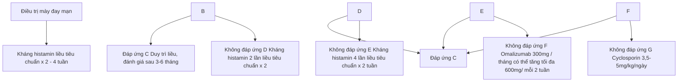

## **4. PHÒNG BỆNH**

- Tránh các tác nhân nghi ngờ gây bệnh hoặc làm khởi phát mày đay.
- Tránh cào gãi
- Dùng thuốc theo đơn, không tự ý ngừng thuốc.


218

# **HỒNG BAN NÚT**
**(Erythema nodosum)**

## **1. ĐẠI CƯƠNG**

### **1.1. Khái niệm**

Hồng ban nút là tổn thương viêm ở vách mô mỡ, lâm sàng đặc trưng bởi các tổn thương dạng cục màu đỏ, đau, thường gặp ở mặt trước hai cẳng chân. Tình trạng này có thể tự phát hoặc sau một số các nguyên nhân như nhiễm khuẩn, virus hoặc sau khi sử dụng thuốc.

### **1.2. Dịch tễ**

Bệnh có thể gặp ở mọi tuổi, giới, chủng tộc nhưng thường gặp ở nữ giới, 20-40 tuổi.

### **1.3. Căn nguyên/Cơ chế bệnh sinh**

- Hồng ban nút được cho là phản ứng quá mẫn của cơ thể đối với nhiều tác nhân khác nhau, tuy nhiên, cơ chế vẫn chưa được hiểu một cách đầy đủ. Các giả thuyết về cơ chế bệnh sinh của hồng ban nút như sau:

  + Hồng ban nút là kết quả của sự lắng đọng phức hợp miễn dịch ở vách của mô mỡ gây nên tình trạng viêm mô mỡ tăng bạch cầu da nhân trung tính

  + Liên quan tới gen: trong một nghiên cứu cho thấy ở những bệnh nhân hồng ban nút có hiện tượng tăng sản xuất TNF alpha.

- Nguyên nhân có thể gây hồng ban nút

  + Nhiễm khuẩn: vi khuẩn, virus, nấm và protozoa, ..... Nhiễm liên cầu đường hô hấp trên là nguyên nhân phổ biến nhất của hồng ban nút ở trẻ nhỏ. Trước đây, nhiễm lao, phong là nguyên nhân phổ biến, tuy nhiên ngày nay tỉ lệ này đã giảm đi đáng kể.

  + Thuốc: penicillin và sulfonamid là 2 loại thường gây hồng ban nút.

  + Các bệnh ác tính: thường gặp nhất là leukemia hoặc lymphoma.

  + Bệnh tự miễn và các rối loạn viêm khác: sarcoidosis và bệnh viêm ruột mạn

  + Hồng ban nút tự phát: thường tiến triển kéo dài trên 6 tháng.

## **2. CHẨN ĐOÁN**

### **2.1. Triệu chứng lâm sàng**

- Triệu chứng da:

  + Các cục hoặc các mảng nóng, đỏ, đau, ranh giới không rõ, kích thước từ 1


219

- 6 cm. Tổn thương có thể tồn tại vài ngày hoặc vài tuần sau đó liên kết với nhau tạo thành mảng đỏ hoặc mảng thâm tím nếu có xuất huyết trong mô mỡ, không có loét và khi khỏi không để lại teo da hay sẹo.

+ **Vị trí:** thường gặp ở mặt dười hai cẳng chân, đối xứng nhau. Các vị trí khác có thể xuất hiện tổn thương bao gồm: cánh tay, đùi, hiếm khi xuất hiện ở thân mình và mặt.

+ **Tiến triển:** Tổn thương thường kéo dài 3 - 6 tuần, tuy nhiên thời gian có thể dài hơn hoặc tái phát nhiều lần.

- Triệu chứng toàn thân: tùy thuộc vào nguyên nhân, hay gặp nhất thường là sốt, mệt mỏi.

- Các triệu chứng khác: đau khớp, viêm khớp, đau đầu, đau bụng, nôn, tiêu chảy và ho. Viêm họng, viêm amidan, viêm đường hô hấp trên thường xuất hiện trước khi có tổn thương da khoảng 20 - 30% các trường hợp và có thể xuất hiện trước khi xuất hiện tổn thương da 1- 3 tuần.

## 2.2. Cận lâm sàng

- **Mô bệnh học:** hồng ban nút được phân loại vào viêm vách mô mỡ (septal panniculitis), mặc dù viêm thủy mô có thể kèm theo trong một vài trường hợp. Thành phần của các tế bào viêm khác nhau tùy thuộc vào độ tuổi của tổn thương. U hạt Miescher là tiêu chuẩn vàng của hồng ban nút – là những u hạt ranh giới rõ có các mô bào (histiocyte) bao xung quanh, ở trung tâm rải rác có các khe hình sao.

- Tốc độ máu lắng tăng cao hoặc CRP tăng.

- Các xét nghiệm tìm nguyên nhân:
  + Công thức máu có thể tăng số lượng bạch cầu hoặc bất thường dòng tế bào trong các bệnh lý ác tính.
  + Nếu nguyên nhân do nhiễm liên cầu thì ASLO tăng cao.
  + Test mantoux hoặc xét nghiệm lao tiềm ẩn (interferon-gamma release assay) để loại trừ hồng ban nút do lao
  + Xquang ngực thẳng: loại trừ hồng ban nút do nhiễm khuẩn, do lao và hồng ban nút do sarcoidosis.

## 2.3. Chẩn đoán xác định

Chẩn đoán xác định hồng ban nút chủ yếu dựa vào lâm sàng, mô bệnh học có vai trò trong một số trường hợp khó.

## 2.4. Chẩn đoán nguyên nhân

Xác định các nguyên nhân có thể gây hồng ban nút, đặc biệt là nhiễm liên cầu


220

khuẩn, sarcoidosis và bệnh lao. Ngoài ra cũng có thể gặp ở bệnh tự miễn, Behcet ác tính hoặc do thuốc, vacxin, có thai, ....

## 2.5. Chẩn đoán phân biệt

- Viêm mô bào.
- Viêm da động mạch hình nút.
- Viêm mô mỡ dưới da khác: hồng ban cứng bazin, xơ da và mô mỡ cấp tính (acute lipodermatosclerosis), viêm mô mỡ do bệnh lý tụy (pancreatic panniculitis).

## 3. **ĐIỀU TRỊ**

### 3.1. Nguyên tắc điều trị

- Điều trị triệu chứng.
- Điều trị nguyên nhân nếu xác định được.

### 3.2. Điều trị cụ thể

#### 3.2.1. **Điều trị triệu chứng**

- Lựa chọn thứ nhất

  + Các thuốc giảm đau chống viêm không steroid (NSAID): ibuprofen hoặc naproxen hoặc indomethacin.

  + Kali iodid: cơ chế của thuốc chưa rõ ràng nhưng có giả thuyết là thuốc tập trung ở tổn thương, giải phóng heparin cũng như ức chế hóa hướng động bạch cầu trung tính. Thuốc giúp làm giảm đau và hết hồng ban nút nhanh. Nếu sau 2-3 tuần không thấy cải thiện thì nên ngừng điều trị.

  - Lựa chọn thứ hai: Nếu đáp ứng kém với NSAID hoặc kali iodid thì có thể sử dụng:

    + Corticosteroid (thận trọng khi sử dụng, đặc biệt là phải loại trừ nguyên nhân do nhiễm khuẩn, đặc biệt là lao): trong trường hợp cấp tính, tổn thương nhiều có thể cho corticosteroid đường toàn thân trong thời gian ngắn tương đương liều prednisolon 0,5mg/kg trong 1- 2 tuần.

    + Tiêm corticosteroid nội tổn thương cho những trường hợp số lượng tổn thương ít, không thể sử dụng corticosteroid toàn thân.

    + Colchicin: đặc biệt tốt đối với bệnh nhân hồng ban nút do Behcet.

    + Một số thuốc khác: dapson, hydroxychloroquine, methotrexat, ức chế TNF alpha, thalidomide...

  - Nếu bệnh mạn tính, tái phát: Không nên sử dụng corticosteroid lâu dài cho những trường hợp này vì có thể gây nhiều tác dụng phụ. Có thể lựa chọn dapson, colchicin và hydroxychloroquine dựa trên tình trạng cụ thể của bệnh nhân.


221

**3.2.2. Điều trị nguyên nhân**

Tùy từng nguyên nhân gây hồng ban nút như nhiễm khuẩn liên cầu: dùng kháng sinh, nhiễm lao: điều trị theo phác đồ lao, do thuốc: ngừng thuốc nghi ngờ.

**4. PHÒNG BỆNH**

- Tránh các nguyên nhân có thể gây ra hồng ban nút.
- Khi có tổn thương: nghỉ ngơi, nâng cao chân, băng ép hoặc sử dụng tất áp lực.


222

# **BỆNH ÁP TƠ**
**(Aphthous stomatitis)**

## **1. ĐẠI CƯƠNG**

### 1.1. **Khái niệm**

Loét aphthous (áp tơ) đặc trưng bởi sự tái phát của một hoặc nhiều vết loét đau, hay tái phát, thường gặp ở miệng/sinh dục hình tròn hoặc oval, riêng rẽ, giới hạn rõ với viền ban đỏ ngoại vi và dịch tiết hơi vàng dính ở trung tâm. Tiến triển có thể khác nhau tùy mức độ, có bệnh nhân chỉ xuất hiện 1 tổn thương không thường xuyên và có người có nhiều tổn thương và nhiều đợt tái phát.

### 1.2. Dịch tễ

Loét aphthous được ghi nhận trên toàn thế giới (5-25% dân số) với tỉ lệ cao nhất ở Trung Đông, khu vực Địa Trung Hải và Nam Á. Hầu hết các tổn thương loét aphthous xuất hiện trong tuổi thanh thiếu niên, tỉ lệ và mức độ nặng của bệnh giảm dần theo tuổi.

### 1.3. **Căn nguyên/Cơ chế bệnh sinh**

- - Nguyên nhân vẫn chưa rõ ràng, tuy nhiên bệnh có khuynh hướng gia đình, ít nhất 40% bệnh nhân có tiền sử gia đình mắc bệnh)

  - - Ngoài ra một số tác nhân gây ra loét aphthous đã được đề cập đến là:
    + Thiếu hụt vitamin và khoáng chất (đặc biệt là vitamin B12)
    + Nhiễm trùng
    + Chấn thương
    + Hút thuốc
    + Một số virus có thể tham gia vào cơ chế bệnh sinh của loét áp như *Cytomegalovirus, Epstein-barr virus.*
    + Thay đổi nội tiết
    + Suy giảm miễn dịch
    + Stress
    + Một số thuốc: chẹn beta, methotraxat, ....

## **2. CHẨN ĐOÁN**

### 2.1. **Triệu chứng lâm sàng**

- - Tổn thương cơ bản:


223

+ Vết loét riêng lẻ, hình tròn hoặc hình oval, xung quanh có quầng đỏ và dịch tiết hơi vàng dính ở trung tâm.

+ Loét aphthous thể nhỏ (minor aphthous ulcer): thường gặp, là các vết loét nông, đường kính <1cm, số lượng 1-5 vết loét, thường tự khỏi sau 1-2 tuần.

+ Loét aphthous thể lớn (major aphthous ulcer): ít gặp, là vết loét sâu, đường kính tổn thương >1cm, lâu lành, thường sau vài tuần hoặc vài tháng, khi lành có thể để lại sẹo.

+ Loét aphthous dạng herpes (herpetiform aphthous) nhiều vết loét nhỏ như đầu đinh ghim.

+ Vị trí thường gặp: niêm mạc tiền đình miệng, lưỡi, vòm họng, họng, và sàn miệng. Lợi và vòm khẩu cái rất hiếm khi có tổn thương.

- Cơ năng: các vết loét đau với mức độ tái phát khác nhau tùy từng thể bệnh. Một số ít bệnh nhân có triệu chứng ngứa ran hoặc rất bỏng tại khu vực hình thành loét.

- Toàn thân: một số trường hợp có triệu chứng sốt nhẹ.

**2.2. Cận lâm sàng**

Chủ yếu để chẩn đoán phân biệt, chẩn đoán nguyên nhân.

- Công thức máu toàn phần
- Tốc độ máu lắng
- Đánh giá tình trạng thiếu hụt dinh dưỡng (như vitamin B12, folate, sắt)
- Soi tươi tìm nấm
- Xét nghiệm tế bào học dịch dạng nang
- Xét nghiệm HIV
- Mô bệnh học cần làm trong các trường hợp nặng hoặc không điển hình để loại trừ các tình trạng khác ở niêm mạc.

**2.3. Chẩn đoán xác định**

Chẩn đoán xác định dựa vào tổn thương cơ bản điển hình và triệu chứng đau.

**2.4. Chẩn đoán phân biệt:**

- Herpes simplex
- Dị ứng thuốc
- Bệnh Behcet
- Lupus ban đỏ hệ thống


224

- Lichen phẳng có loét miệng
- Bệnh viêm ruột Bowel.
- Hội chứng PFAPA: sốt chu kỳ kèm theo viêm loét miệng, viêm họng và viêm hạch
  - Hội chứng MAGIC: loét miệng và sinh dục kèm viêm sưng
  - Các bệnh bong nước tự miễn

**3. ĐIỀU TRỊ**

**3.1. Nguyên tắc điều trị**
- Điều trị giảm đau, thúc đẩy quá trình làm lành vết loét và giảm tần suất cũng như mức độ của các đợt bệnh.
- Vệ sinh răng miệng tốt, tránh các yếu tố làm trầm trọng thêm.

**3.2. Điều trị cụ thể**

**3.2.1. Điều trị tại chỗ**
- Gel corticosteroid ngày 2-3 lần, bôi sớm ngay khi phát bệnh sẽ giảm được đau và thời gian lành một cách rõ rệt. Tuy không thể ngăn ngừa tái phát, nhưng tần xuất tái phát thường giảm sau khi dùng corticosteroid tại chỗ.
- Các thuốc bôi khác có thể sử dụng kết hợp hoặc thay thế corticosteroid bôi bao gồm:
  + Tetracycline bôi
  + Sucralfate huyên phù súc miệng 4 lần/ngày
  + Hyaluronic axit dạng gel 0.2 % hoặc nước súc miệng
  + Amlexanox 5% dạng bột nhão được bôi lên tổn thương sớm 4 lần/ngày. Tác dụng phụ bao gồm cảm giác châm chích và lạnh tại vị trí bôi thuốc và vị kim loại.
  - Liệu pháp laser: chiếu laser hene tại chỗ loét.

**3.2.2. Điều trị toàn thân**
- Lựa chọn thứ nhất: khi không đáp ứng với điều trị tại chỗ đơn thuần, sử thuốc corticosteroid tương đương prednisone uống liều 20-40 mg/ngày trong 4-7 ngày.
- Lựa chọn thứ hai: khi bệnh dai dẳng, tái phát nhiều, không kiểm soát được bằng corticosticoid toàn thân ngắn ngày kết hợp thuốc bôi.
  + Colchicin: liều khởi đầu uống 0.6 mg/ngày trong 1 tuần, nếu dung nạp tăng lên 0.6 mg x 2 lần/ngày kéo dài ít nhất 1 tháng.
  + Dapson: liều khởi đầu 25-50 mg/ngày, tối đa 150mg/ngày, kéo dài ít nhất


225

1 tháng.

- + Có thể kết hợp colchicin và dapson, việc điều trị kết hợp cho kết quả hiệu quả hơn so với chỉ dùng riêng từng chất.

- Các điều trị khác:

  - + Thalidomid: liều 50-100 mg/ngày, duy trì ở liều 25 mg/ngày.

  - + Montelukast: chất ức chế leukotrien, liều 10 mg/ngày trong 1 tháng sau đó là liều 10mg cách ngày.

  - + Apremilast: chất ức chế phosphodiesterase đường uống có tác dụng ức chế sản xuất cytokine tiền viêm, liều 30 mg 2 lần/ngày trong 2-6 tuần.

  - + Pentoxifyllin 400 mg 3 lần/ngày.

**3.2.3. Điều trị hỗ trợ và giảm đau**

- Điều trị nhiễm trùng thứ phát nếu có.

- Vitamin và thực phẩm bổ sung: bổ sung vitamin B12 trong 6 tháng.

- Kiểm soát đau: thuốc tê tại chỗ có thể làm giảm khó chịu tạm thời nếu sử dụng trước khi ăn và vệ sinh răng miệng:

  - + Lidocain 2% dạng nhọt: lựa chọn đầu tay, bôi tổn thương hoặc dạng súc miệng và nhọ

  - + Diphehydramin lỏng : 12.5 mg/5ml; 5ml dạng súc miệng

  - + Dyclonine hình thoi: tan chậm trong miệng

  - + Hỗn dịch nhôm hydroxide, magnesium hydroxide và simethicon 5-10 ml súc miệng và nhọ

  - + Attapulgite huyền phù : 600-750 mg/15ml; 5-10ml súc miệng và nhọ.

**4. PHÒNG BỆNH**

- Giữ vệ sinh răng miệng tốt bằng bàn chải đánh răng mềm, chỉ tơ nha khoa và dụng cụ mát xa nướu đầu mềm để nhẹ nhàng loại bỏ các mảng bám.

- Sử dụng nước súc miệng không chứa cồn.

- Không sử dụng kem đánh răng có chứa sodium lauryl sulfate khi bị viêm loét miệng.

- Không hút thuốc

- Giảm các yếu tố chấn thương trong miệng như vật liệu phục hồi răng sắc/thô, niềng răng, tránh các thói quen gây chấn thương như cắn môi hoặc má và các thức ăn làm nặng lên tình trạng của bệnh.

- Tránh các loại thực phẩm gây kích ứng niêm mạc miệng


226

- - Có chế độ ăn lành mạnh, đầy đủ dinh dưỡng
- - Hạn chế stress, căng thẳng


227

# Chương 6

# **BỆNH ĐỖ DA CÓ VẢY**


228

# **VIÊM DA DẦU**

**(Seborrheic Dermatitis)**

## **1. ĐẠI CƯƠNG**

### **1.1 Khái niệm**

Viêm da dầu là bệnh lý viêm mạn tính, đặc trưng bởi các tổn thương đỏ da, bong vảy tập trung ở những vùng da nhiều tuyến bã như da dầu, mặt và thân trên. Bệnh thường bùng phát tại các thời điểm tuyến bã hoạt động mạnh bao gồm những tháng đầu đời và sau giai đoạn dậy thì.

### **1.2 Dịch tễ**

- Bệnh gặp ở cả trẻ em và người lớn. Ở trẻ em bệnh gặp ở độ tuổi từ 3 tuần đến 12 tháng tuổi, trong đó tỷ lệ trẻ dưới 1 tháng tuổi bị bệnh khoảng 10%, đỉnh của bệnh khoảng 70% ở trẻ 3 tháng tuổi và bệnh thường biến mất sau 1 tuổi. Ở người lớn viêm da dầu gặp ở khoảng 3% với đỉnh vào những năm 30-40 tuổi. Bệnh gặp phổ biến ở nam hơn nữ.

- Bệnh có thể gặp ở mọi chủng tộc, riêng những người Mỹ gốc Phi và những người da đen thường bị viêm da dầu thể hình nhân hoặc hình cánh hoa dễ nhầm với lupus ban đỏ kinh hình đĩa.

### **1.3 Căn nguyên/Cơ chế bệnh sinh**

- Cho đến nay, cơ chế bệnh sinh của bệnh vẫn chưa được hiểu một các rõ ràng nhưng nhiều nghiên cứu cho thấy bệnh liên quan đến nấm *Malassezia*, rối loạn miễn dịch, tăng tiết chất bã và một số yếu tố thuận lợi như HIV/AIDS, parkinson bệnh lý thần kinh, bệnh lý nội tiết, tia tử ngoại, một số thuốc, yếu tố di truyền. Bệnh thay đổi theo nhiệt độ và độ ẩm. Bệnh nặng lên vào mùa mùa đông đầu mùa xuân (độ ẩm thấp và khí hậu lạnh), nhẹ hơn vào mùa hè.

  - Yếu tố thuận lợi: stress, chất kích thích, bia rượu, ....

## **2. CHẨN ĐOÁN**

### **2.1. Triệu chứng lâm sàng**

#### **2.1.1. Viêm da dầu ở trẻ nhỏ**

- Tổn thương là các dát đỏ, mảng đỏ, trên có vảy da, vảy mỡ bong dính, có thể kèm theo các vết nứt.

- Vị trí:

  + Vùng da dầu: hay gặp ở vùng trán và đỉnh đầu, tổn thương có thể lan rộng toàn bộ da dầu.


229

+ Vùng mặt, thân mình: hay gặp ở trán, rãnh mũi má, lông mày, mí mắt, rãnh sau tai, ống tai ngoài và ngực. Tổn thương có thể lan rộng ra toàn bộ thân mình và các chi.

+ Vùng kẽ: hay gặp ở nách, bẹn, quanh rốn, quanh ống hậu môn.

- Bệnh đỏ da toàn thân do viêm da dầu (Leiner's disease): đây là một thể nặng lan tỏa của viêm da dầu ở trẻ em, Tổn thương viêm da dầu lan tỏa dẫn đến tình trạng đỏ da bong vảy toàn thân kèm theo sốt, tiêu chảy, thiếu máu, nôn và sút cân. Trẻ có thể tử vong nếu không được điều trị.

- Viêm da dầu ở trẻ nhỏ có tiên lượng tốt, hầu hết thoái lui sau vài tuần hoặc vài tháng, các trường hợp kéo dài quá 12 tháng rất ít.

**2.1.2. Viêm da dầu ở người lớn**

- Tổn thương là các vảy da màu trắng, mỏng trong một số trường hợp có thể là các vảy da và vảy mỡ màu vàng trên nền da viêm đỏ.

- Vị trí:

  + Ở da dầu: hay gặp ở vùng trán, thái dương và vùng đỉnh nhưng có thể lan tỏa toàn bộ đầu.

  + Ở mặt: tập trung ở má, đầu trong lông mày, rãnh mũi má, rãnh sau tai, vành tai, ống tai ngoài, ngực và lưng.

  + Vùng nếp gấp: nách, nếp lằn dưới vú, quanh rốn.

- Ở bệnh nhân suy giảm miễn dịch: các tổn thương có xu hướng lan tỏa, có thể gặp ở các vùng da không tăng tiết bã như tay chân và rất khó điều trị.

**2.2. Cận lâm sàng**

- Xét nghiệm nấm: có thể thấy tăng số lượng nấm *Malassezia*.

- Xét nghiệm *Demodex*: có thể quan sát thấy hình ảnh *Demodex*.

- Dermoscopy: hình ảnh mạch máu chủ yếu giãn theo hình cành cây.

- Xét nghiệm HIV: cho những trường hợp tổn thương lan tỏa.

- Mô bệnh học: trong những trường hợp không điển hình cần làm mô bệnh học. Viêm da dầu được xếp vào nhóm các bệnh viêm da không đặc hiệu với mức độ khác nhau tùy giai đoạn nhưng có các bất thường sau: á sùng khu trú, lớp hạt bình thường, xóp bào, tăng sản lớp gai dạng vảy nên không đều, giãn mạch với xâm nhập viêm chủ yếu lympho quanh mạch.

- Xét nghiệm máu, định lượng kẽm đối với trường hợp chẩn đoán bệnh đỏ da toàn thân do viêm da dầu.


230

**2.3. CHẨN ĐOÁN**

**2.3.1. Chẩn đoán xác định**

Chủ yếu dựa vào lâm sàng với tính chất tổn thương và vị trí tổn thương điển hình, tuổi, trong những trường hợp nghi ngờ chẩn đoán dựa trên mô bệnh học.

**2.3.2. Chẩn đoán phân biệt**

*Viêm da đầu ở trẻ em*

- Viêm da cơ địa
- Viêm da tã lót
- Vảy nến
- Bệnh mô bào Langerhans
- Nấm da đầu
- Ghẻ

*Viêm da đầu ở người lớn*

- Vảy nến
- Nấm da đầu
- Trứng cá đỏ
- Viêm da do Demodex
- Lupus ban đỏ hệ thống
- Lupus ban đỏ kinh hình đĩa
- Viêm da tiếp xúc dị ứng
- Lang ben
- Nấm da
- Vảy phân hồng gilbert
- Giang mai
- Pemphigus da mở

**3. ĐIỀU TRỊ**

**3.1. Nguyên tắc điều trị**

- Điều trị dựa vào lứa tuổi của bệnh nhân.
- Điều trị dựa vào vị trí tổn thương.
- Xác định và loại bỏ các yếu tố nguy cơ.


231

# 3.2. **Điều trị**

## **3.2.1 Điều trị viêm da dầu ở trẻ nhỏ**

- Sử dụng sữa tắm gội phù hợp.
- Dùng kem làm mềm da chứa các thành phần như dầu oliu, petrolatum giúp bong lớp vảy bề mặt.
- Thuốc bôi tại chỗ: corticosteroid loại nhẹ (desonide, hydrocortison), dùng trong 7-10 ngày.
- Nếu không đáp ứng: phối hợp dầu gội ketoconazol 2%

## **3.2.2 Điều trị viêm da dầu ở người lớn**

# Sơ đồ điều trị Viêm da dầu ở dầu

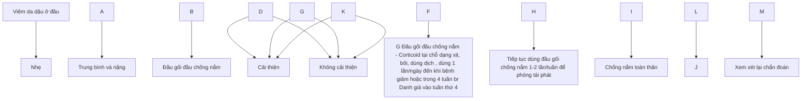


232

# Sơ đồ điều trị Viêm da dầu ở mặt và thân mình

| Chẩn đoán viêm da dầu ở vùng da không có lông tóc (mặt, thân mình, vùng kẽ)                                          | Đánh giá mức độ nặng\*                                                                                  |
| -------------------------------------------------------------------------------------------------------------------- | ------------------------------------------------------------------------------------------------------- |
| Nhẹ                                                                                                                  | Trung bình, nặng                                                                                        |
| Thuốc chống nấm tại chỗ (ví dụ: ketoconazole 2%) 1-2 lần/ngày                                                        | Corticoid nhẹ bôi tại chỗ 1-2 lần/ngày đến khi giảm bệnh, có thể bôi đến 2 tuần<br/>Đánh giá sau 2 tuần |
| Cai thuốc                                                                                                            | Cai thuốc                                                                                               |
| Tiến tục chống nấm tại chỗ bôi ngày 1-2 lần/tuần để phòng tái phát                                                   | Corticoid nhẹ bôi tại chỗ 1-2 lần/ngày đến khi giảm bệnh, có thể bôi đến 2 tuần<br/>Đánh giá sau 2 tuần |
| Không cai thuốc                                                                                                      | Dùng ức chế calcineurin tại chỗ + chống nấm tại chỗ 1 lần/ngày<br/>Đánh giá sau 4 tuần                  |
| Cai thuốc                                                                                                            | Cai thuốc                                                                                               |
| Xem xét lại chẩn đoán                                                                                                | Dùng chống nấm toàn thân (itraconazole 200mg uống 1 lần/ngày x 7 ngày)                                  |
| Không cai thuốc                                                                                                      | Không cai thuốc                                                                                         |
| Tiếp tục chống nấm tại chỗ bôi ngày 1-2 lần/tuần<br/>Hoặc<br/>Tacrolimus 0,1% tại chỗ 1-2 lần/tuần để phòng tái phát | Xem xét lại chẩn đoán                                                                                   |


* Viêm da dầu nhẹ : da, bong vảy nhẹ. Viêm da dầu trung bình và nặng: trong bong vảy mỡ, đỏ, ngứa.
Khi bất thường còn , điều trị thêm dần. Trong trường hợp tái phát, bắt đầu điều trị lại bằng ngày dựa vào mức độ nặng.

## 4. PHÒNG BỆNH

- - Tránh căng thẳng, stress.
- - Hạn chế rượu bia, chất kích thích.
- - Gội đầu bằng ketoconazol 2% hoặc cicloporox 1% 1-2 lần/tuần.
- - Sử dụng tacromimus 2 lần/tuần.


233

# **VẢY PHẨN HỒNG**

(Pityriasis rosea)

## 1. **ĐẠI CƯƠNG**

### 1.1 Khái niệm

Vảy phấn hồng (Pityriasis rosea – PR) là bệnh đồ da bong vảy, có tính chất cấp tính, tự khởi.

### 1.2 Dịch tễ

Bệnh thường gặp ở trẻ lớn và người trẻ tuổi (10-35 tuổi), gặp cả ở nam và nữ nhưng tỷ lệ gặp ở nữ cao hơn nam. Tỷ lệ mắc bệnh khoảng 0,5-2%.

### 1.3 Căn nguyên/Cơ chế bệnh sinh

Cơ chế bệnh sinh đến nay vẫn chưa rõ ràng, một số nghiên cứu chỉ ra sự liên quan của vi rút với bệnh, đặc biệt là nhóm vi rút herpes: HHV 6, HHV 7. Ngoài ra có thể liên quan đến HHV 8, CMV, EBV, H1N1, ...

## 2. **CHẨN ĐOÁN**

### 2.1 Triệu chứng lâm sàng

- Tiền triệu: có thể gặp các triệu chứng gợi ý đến nguyên nhân vi rút như đau đầu, sốt, mệt mỏi, chán ăn, đau họng, hạch to và đau khớp.

- Dát Herald (tổn thương mẹ): là triệu chứng thường gặp, khởi phát cấp tính, xuất hiện đầu tiên. Tổn thương thường đơn độc, kích thước 2-5cm, có hình tròn hoặc bầu dục, giới hạn rõ, màu hồng hoặc màu cá hồi, có vảy mỏng ở rìa tổn thương (dấu hiệu viên vảy), có xu hướng lành ở trung tâm. Vị trí thường gặp ở mạn sườn, lưng.

- Các tổn thương con: xuất hiện sau tổn thương tiên phát từ 2 ngày tới 2 tháng với đặc điểm tổn thương tương tự tổn thương mẹ nhưng kích thước nhỏ hơn (khoảng 0,5-1cm). Vị trí: thường gặp ở thân mình, vùng ít tiếp xúc với ánh sáng, đối xứng tạo hình ảnh cây thông Noel. Tổn thương bùng phát và lan rộng theo hướng ly tâm, từ trên xuống trong vài ngày đến vài tuần.

- Cơ năng: có thể gặp ngứa ở các mức độ khác nhau.

- Tiến triển: Quá trình bong vảy hoàn tất và ban đỏ mờ dần. Đa số các tổn thương sẽ biến mất sau 2-12 tuần, một số trường hợp có thể lâu hơn 5-6 tháng. Bệnh thường khởi hoàn toàn, hiếm khi tái phát. Tăng sắc tố sau viêm thường gặp ở những người có da sẫm màu và thường mất vài tháng hoặc lâu hơn.

## 2.2 Cận lâm sàng


234

- Mô bệnh học: không đặc hiệu, có hiện tượng xóp bào, thâm nhiễm viêm của lympho và mô bào quanh mạch, có thể gặp thoát hồng cầu.

- Xét nghiệm soi tươi tìm nấm: âm tính, sử dụng trong trường hợp cần chẩn đoán phân biệt với nấm da.

- Xét nghiệm huyết thanh học để loại trừ bệnh giang mai.

- Dermoscopy: có hình ảnh nền đỏ xin, thay đổi sắc tố, có vảy trắng mỏng phân bố ở rìa tổn thương. Không có tổn thương mạch máu và nang lông, có thể sử dụng để chẩn đoán phân biệt với bệnh vảy nến.

- Xét nghiệm tìm căn nguyên (HHV6, HHV7 …) trong trường hợp nghi ngờ.

## 2.3 Chẩn đoán xác định

Chẩn đoán dựa vào lâm sàng, một số trường hợp khó cần dựa vào kết quả mô bệnh học.

## 2.4 Chẩn đoán thể bệnh:

- Thể điển hình: Triệu chứng lâm sàng diễn hình như mô tả ở trên.

- Dát Herald ở vị trí không điển hình: có thể gặp tổn thương dát Herald ở lòng bàn chân, với tổn thương thứ phát ở thân mình và các chi.

- PR thể khu trú: tổn thương khu trú ở tay, chân, hông, vai, nách, bẹn. Một số trường hợp phân bố ban không đối xứng, phân bố một nửa người.

- PR thể đảo ngược: tổn thương ở vùng nếp gấp (nách, bẹn, cổ) và đầu cực.

- PR thể đầu cực: tổn thương là các dát đỏ bong vảy diễn hình nhưng khu trú ở đầu cực (bàn tay, bàn chân, cổ tay, cổ chân), không có tổn thương ở nếp gấp (cổ, nách, bẹn).

- PR thể xuất huyết: tổn thương là các ban xuất huyết ở các vị trí khác nhau, có thể kết hợp với các tổn thương khác trong thể điển hình.

- PR thể mày đay: tổn thương dạng sẩn phù với phân bố tương tự như PR thể điển hình.

- PR thể giống hồng ban đa dạng: tổn thương diễn hình của PR có thể kèm theo một số tổn thương hình bia bắn.

- PR thể sẩn: tổn thương là các sẩn đường kính 1 - 3mm với viên vảy ở ngoại vi, phân bố tương tự PR thể điển hình.

- PR thể mụn nước: tổn thương cơ bản là mụn nước 2 - 6mm đường kính, ở ngoại vi dát đỏ bong vảy, phân bố lan tỏa kèm theo ngứa nhiều.

- PR thể không lõ của darier: đường kính của dát Herald lớn hơn bình thường, thường được so sánh với kích thước của một quả lê.


235

- PR thể giảm sắc tố: tổn thương là các dát giảm sắc tố ngay từ lúc mới xuất hiện.
  - PR thể kích ứng: bệnh nhân rất ngứa, đau kèm cảm giác bỏng rát.
  - PR thể dai dẳng: khi bệnh kéo dài trên 3 tháng.

**2.5 Chẩn đoán phân biệt**
- Giang mai giai đoạn II.
- Vảy nến thể giọt.
- Nấm da.
- Chàm đồng tiền.
- Vảy phản dạng lichen mạn tính.
- Phát ban dạng vảy phản hồng do thuốc.

**3. ĐIỀU TRỊ**

**3.1 Nguyên tắc điều trị**
- Điều trị triệu chứng.
- Điều trị căn nguyên do virus nếu có.
- Đa số trường hợp không cần điều trị hoặc chỉ cần điều trị tại chỗ.

**3.2 Điều trị cụ thể**

**3.2.1 Điều trị tại chỗ**
- Thuốc bôi chứa corticosteroid: lựa chọn loại corticosteroid tùy thuộc vào mức độ tổn thương, mức độ ngứa và vị trí tổn thương; thông thường loại có hiệu lực nhẹ đến trung bình đã có thể giúp kiểm soát được bệnh. Thời gian điều trị trung bình 2-3 tuần, có thể bôi ngày 1-2 lần.
- Chất dưỡng ẩm, làm mềm da.

**3.2.2 Điều trị toàn thân**
- Có thể lựa chọn một trong các thuốc điều trị sau:
  + Aciclovir: người lớn: 400-800mg x 5 lần/ ngày trong 7 ngày.
  + Erythromycin: 250mg x 4 lần/ngày trong 2 tuần (20 - 40 mg/kg/ngày chia 4 lần), chú ý tác dụng phụ trên hệ tiêu hóa.
  + Corticosteroid đường toàn thân: sử dụng trong trường hợp tổn thương cấp tính và lan rộng.
  - Liệu pháp ánh sáng: UVB dải hẹp liều khởi đầu tùy từng tuýp da, chiếu 2-5 lần/tuần trong 1-4 tuần.


236

- Thuốc kháng histamin: sử dụng khi bệnh nhân có triệu chứng ngứa nhiều.

**4. PHÒNG BỆNH**
- Nâng cao thể trạng, tránh nhiễm các loại virus.
- Khi có tổn thương: không chà xát, cào gãi.


237

# **VẺY PHẤN ĐỎ NANG LÔNG**
**(Pityriasis Rubra Pilaris)**

## 1. **ĐẠI CƯƠNG**

### 1.1. **Khái niệm**

Vảy phấn đỏ nang lông (Pityriasis Rubra Pilaris - PRP) thuộc nhóm bệnh đồ da bong vảy, đặc trưng bởi sần sừng nang lông, màng da đỏ cam, dày sừng lòng bàn tay bàn chân.

### 1.2. **Dịch tễ**

PRP là một bệnh hiếm gặp, tiến triển mạn tính. Bệnh có thể do mắc phải hoặc có tính chất gia đình. Tỷ lệ gặp ở hai giới như nhau, có thể gặp ở mọi lứa tuổi, tập trung ở 2 nhóm tuổi: từ 5 - 10 tuổi và 50 - 60 tuổi.

### 1.3. **Căn nguyên/Cơ chế bệnh sinh**

Cơ chế bệnh sinh chưa được hiểu đầy đủ:

- TNF-α được giả thuyết là chìa khóa cytokin trong PRP.
- Trực interleukin (IL) 23/Th17 có thể đóng một vai trò quan trọng.
- Tính chất gia đình có liên quan đến đột biến gen trội nhiễm sắc thể thường trong gen CARD14.
- Một số yếu tố liên quan khác có thể gặp như do thuốc, do thiếu vitamin A, HIV, ....

## 2. **CHẨN ĐOÁN**

### 2.1. **Triệu chứng lâm sàng**

- Sần sừng nang lông: sần hình chóp, màu nâu đỏ hoặc vàng đỏ, kích thước bằng đầu ghim, trên đỉnh là nút sừng, ở giữa nút sừng có gắn sợi lông. Các sần tập trung thành màng, có hiện tượng bong vảy lan tỏa làm các sần nang lông mở đi rồi biến mất để lại nền da đỏ, bong vảy khô.

- Dát màu đỏ cam, có thể lan tỏa gây nên đỏ da toàn thân kèm theo đảo da lành đặc trưng của bệnh.

- Vị trí: hay gặp là 2 bên cổ, thân mình, mặt đuôi của chi, đặc biệt là ở mu đốt ngón 1,2.

  - Dày sừng lòng bàn chân, bàn tay màu vàng sáp.

  - Móng đục, dày, xù xì, mùn, có khía, có khuynh hướng nứt và gầy, đôi khi có rỗ móng.


238

- Cơ năng: ngửa nhẹ.

## 2.2. Cận lâm sàng

- Xét nghiệm máu: công thức máu, sinh hóa máu, HIV, ...

- Mô bệnh học: có hiện tượng dày sừng, nút sừng nang lông, á sừng từng điểm tại lỗ nang lông, tăng gai không đều nhẹ. Xâm nhập viêm ở trung bì, quanh nang lông gồm chủ yếu là tế bào đơn nhân.

- Dermoscopy: Thấy rõ sần ở nang lông với nút sừng ở giữa nang lông, giữa nút sừng có lông, mạch máu phân bố thành dải xen kẽ với mạch máu dạng chấm.

- Các xét nghiệm khác: soi tưao tìm nấm, xét nghiệm gen liên quan, ....

## 2.3. Chẩn đoán xác định

Chẩn đoán xác định dựa vào lâm sàng và mô bệnh học.

## 2.4. Chẩn đoán thể bệnh

- Tuyp I: tuyp kinh điển ở người lớn. Là dạng thường gặp nhất. Khởi phát cấp tính, lâm sàng điển hình bao gồm đồ da với những đảo da lạnh, dày sừng lòng bàn tay bàn chân, dày sừng nang lông. Tiên lượng tốt nhất, khoảng 80% bệnh nhân thuyên giảm bệnh trong vòng 3 năm.

- Tuyp II: tuyp không điển hình ở người lớn. Đặc trưng bởi tổn thương dạng vây cá, có thể chàm hoá, rụng tóc. Thường kéo dài từ 20 năm trở lên.

- Tuyp III: tuyp kinh điển ở trẻ em. Giống típ I nhưng khởi phát trong 2 năm đầu tiên của cuộc đời, thường thuyên giảm sớm hơn so với típ I, trung bình là 1 năm.

- Tuyp IV: tuyp vòng cung ở trẻ em. Xuất hiện trước tuổi dậy thì, đặc trưng là dát đỏ, dày sừng nang lông, giới hạn rõ, ở khuyu tay và đầu gối.

- Tuyp V: tuyp không điển hình ở trẻ em. Đặc trưng là dày sừng nang lông, dày da ở lòng bàn tay, bàn chân, hiếm khi đỏ. Hầu hết những trường hợp PRP thuộc tuyp này có tính chất gia đình. Bệnh khởi phát sớm và tiến triển mạn tính.

- Tuyp VI: liên quan với HIV. Bệnh không đáp ứng với những điều trị thông thường nhưng đáp ứng với thuốc kháng retrovirus.

## 2.5. Chẩn đoán phân biệt

- Vẩy nến.

- Viêm da đầu

- Viêm bì cơ

- Đỏ da toàn thân do căn nguyên khác.

- Các bệnh lý ít gặp khác: hội chứng tăng bạch cầu ái toan, hội chứng thái ghp, ...

## 3. ĐIỀU TRỊ

### 3.1. Nguyên tắc điều trị


239

- Điều trị theo mức độ nặng của bệnh.
- Chăm sóc da bằng các sản phẩm tắm gội dịu nhẹ, kem dưỡng ẩm phù hợp.

**3.2. Điều trị cụ thể:**

**3.1.1 Điều trị tại chỗ**

- Corticosteroid bôi làm giảm phản ứng viêm tại chỗ, mức độ trung bình với vùng da thân mình, tay chân, corticosteroid mức độ nhẹ với vùng da mặt, nếp kẽ.
- Calcipotriol: giai đoạn duy trì, bôi không quá 30% diện tích cơ thể.
- Thuốc bôi khác: chất tương tự vitamin A (Tazarotene).
- Dưỡng ẩm: chứa ure 5-10%, acid salicylic 1-5%.

**3.1.2 Điều trị toàn thân**

- Ức chế IL-17:
  + Người lớn:
    - Ixekizumab: 160mg tuần 0, 80mg tuần 2-4-6-8-10-12, 80mg mỗi 4 tuần sau đó.
    - Secukinumab 300mg tuần 0-1-2-3-4 và mỗi 8 tuần sau đó.
    - Brodalumab 210mg tuần 0-1-2 và mỗi 2 tuần sau đó.
  + Trẻ em:
    - Ixekizumab: <25kg, 40mg tuần 0 và 20mg mỗi 4 tuần sau đó. 25-50kg, 80mg tuần 0 và 40mg mỗi 4 tuần sau đó. >50kg, 160mg tuần 0 và 40mg mỗi 4 tuần sau đó.
    - Secukinumab: <50kg, 75mg tuần 0-1-2-3-4 và mỗi 8 tuần sau đó. ≥50kg, 75mg tuần 0-1-2-3-4 và mỗi 8 tuần sau đó.

- Ức chế IL-23:
  + Người lớn:
    - Ustekinumab: ≤100kg, 45mg tuần 0-4 và mỗi 12 tuần sau đó. >100kg, 90mg tuần 0-4 và mỗi 12 tuần sau đó.
    - Guselkumab 100mg tuần 0-4 và mỗi 8 tuần sau đó.
    - Risankizumab 150mg tuần 0-4 và mỗi 12 tuần sau đó.
    - Tildrakizumab 100mg tuần 0-4 và mỗi 12 tuần sau đó.
  + Trẻ em:
    Ustekinumab ≤60kg, 0,75mg/kg; >60 to ≤100 kg, 45 mg; >100 kg, 90 mg; tuần 0-4 và mỗi 12 tuần sau đó.

- Retinoids:
  + Isotretinoin 0.5-2 mg/kg/ngày hoặc acitretin 0,5 - 0,75 mg/kg/ngày.


240

+ Tác dụng phụ thường gặp nhất của retinoid là khô da và niêm mạc, tăng lipid máu, tăng men gan và giảm thị giác.

+ Tránh thai trong và sau dùng thuốc 3 năm khi điều trị acitretin và trong 1 tháng sau khi điều trị isotretinoin.

- Methotrexat: 15-25 mg/tuần.

- Liệu pháp ánh sáng: UVA, UVB - NB hoặc PUVA có hiệu quả trong một số trường hợp.

### Đánh giá diện tích tổn thương da và mức độ nặng

| Loại thương tổn                                                                                                                                                                                                                              |                                                                          |                   |                                    |
| -------------------------------------------------------------------------------------------------------------------------------------------------------------------------------------------------------------------------------------------- | ------------------------------------------------------------------------ | ----------------- | ---------------------------------- |
| **Tổn thương lan tỏa**                                                                                                                                                                                                                       | **Tổn thương khu trú**                                                   |                   |                                    |
| Bắt đầu với một trong các thuốc sau:                                                                                                                                                                                                         | Kem dưỡng ẩm và corticoid tại chỗ mức độ trung bình.                     |                   |                                    |
| - Kháng IL-17 hoặc IL-23                                                                                                                                                                                                                     | Nếu không đáp ứng, chuyển sang thuốc điều trị tổn thương lan tỏa         |                   |                                    |
| - Retinoid uống                                                                                                                                                                                                                              |                                                                          |                   |                                    |
| - Methotrexate                                                                                                                                                                                                                               |                                                                          |                   |                                    |
| Sử dụng kháng IL-17 hoặc IL-23                                                                                                                                                                                                               | Uống retinoid hoặc methotrexate                                          |                   |                                    |
| Đánh giá lại sau 2-3 tháng:                                                                                                                                                                                                                  | Đánh giá lại sau 2-3 tháng                                               |                   |                                    |
| - Nếu đáp ứng 1 phần: tiếp tục thuốc sinh học, có thể kết hợp thêm retinoid uống hoặc methotrexate, đánh giá lại sau 4-5 tháng                                                                                                               | - Nếu không đáp ứng: xem phần xử trí ở dưới                              |                   |                                    |
| Không đáp ứng                                                                                                                                                                                                                                | Đáp ứng hoàn toàn                                                        | Đáp ứng hoàn toàn | Không đáp ứng                      |
| \*Chuyển sang thuốc sinh học khác (từ kháng IL-17 sang IL-23 và ngược lại)<br/>Đánh giá lại sau 2-3 tháng:<br/>Nếu đáp ứng 1 phần: tiếp tục thuốc sinh học, có thể kết hợp thêm retinoid uống hoặc methotrexate, đánh giá lại sau 4-5 tháng. | Chuyển sang thuốc kháng IL-17 hoặc IL-23.<br/>Đánh giá lại sau 2-3 tháng |                   |                                    |
| - Nếu đáp ứng 1 phần: tiếp tục thuốc sinh học, có thể kết hợp thêm retinoid uống hoặc methotrexate, đánh giá lại sau 4-5 tháng.                                                                                                              | - Nếu không đáp ứng: xem phần xử trí ở dưới                              |                   |                                    |
| Không đáp ứng                                                                                                                                                                                                                                | Đáp ứng hoàn toàn                                                        | Đáp ứng hoàn toàn | Không đáp ứng                      |
| Chuyển sang điều trị khác như kháng TNF alpha, apremilast, IVIG, ánh sáng...                                                                                                                                                                 | Ngừng điều trị. Có thể điều trị lại nếu bệnh tái phát                    |                   | Tiếp tục điều phối do giống mạc \* |


Lưu ý: sơ đồ này dùng tiếp cận điều trị RPR ở người lớn, không áp dụng với type VI (liên quan HIV) và những trường hợp đột biến gen CARD14.

**4. PHÒNG BỆNH**

Chủ yếu là các chăm sóc khi bị bệnh:

- Tránh chà xát, cào gãi tổn thương.

- Sử dụng các sản phẩm tắm gội dịu nhẹ, kem dưỡng ẩm.

# **VẪY NỀN THỂ THÔNG THƯỜNG**
**(Psoriasis vulgaris)**


241

# 1. **ĐẠI CƯƠNG**

## 1.1. **Khái niệm**

Vậy nên là bệnh viêm mạn tính, tiến triển từng đợt, dai dẳng. Bệnh đặc trưng bởi dát, sần đồ ranh giới rõ, trên có nhiều vảy da trắng, dày, dễ bong, có thể gây tổn thương ở móng, khớp và các cơ quan khác.

## 1.2. **Dịch tễ**

Tỷ lệ bệnh vảy nến chiếm khoảng 2-3% dân số tùy theo từng khu vực. Bệnh có thể gặp ở hai giới và mọi lứa tuổi nhưng thường gặp nhiều ở người lớn hơn trẻ em.

## 1.3. **Căn nguyên/Cơ chế bệnh sinh**

Căn nguyên của bệnh vảy nến chưa rõ. Người ta cho rằng bệnh vảy nến có liên quan đến rối loạn miễn dịch, yếu tố di truyền, yếu tố môi trường.

- **Yếu tố di truyền:** nhiều gen đã được phát hiện ở những người có HLA - B13, B17, BW57 và CW6. Đặc biệt gen HLA - CW6 gặp ở 87% bệnh nhân vảy nến.

- **Cơ chế miễn dịch:** bệnh vảy nến có liên quan đến tế bào lympho T ở da đặc biệt là tế bào Th1, Th17 và Th22. Hiện tại trục TNF-α - IL-23 – IL-17A được coi là đóng vai trò chủ đạo trong cơ chế bệnh sinh của bệnh vảy nến.

- Các yếu tố môi trường: stress, chấn thương, nhiễm khuẩn hoặc sử dụng thuốc,
....

# 2. **CHẨN ĐOÁN**

## 2.1. **Triệu chứng lâm sàng**

- **Tổn thương da:** diễn hình là những sần, mảng màu đỏ tươi, giới hạn rõ với da lành, trên có vảy da trắng, dày, dễ bong. Vị trí thường ở chỗ tỷ dê, vùng hay bị cọ xát như khuỷu tay, đầu gối, mấu chuyen, mặt đuôi các chi. Tổn thương có khuynh hướng đối xứng.

- **Tổn thương móng:** rỗ móng, rãnh ngang móng, móng xù xì, vạch trắng ngang móng, dấu hiệu giọt dầu, tách móng, dày sừng dưới móng, xuất huyết.

- **Tổn thương khớp:** sưng nóng đỏ đau các khớp, viêm một/nhiều khớp, hình ảnh lâm sàng giống viêm da khớp dạng thấp, viêm khớp cột sống, viêm điểm bám gân và phần mềm quanh khớp tạo hình ảnh ngón tay, ngón chân hình khúc dôi.

- **Tổn thương niêm mạc:** thường gặp ở niêm mạc quy đầu, âm hộ. Đó là dát màu hồng, không thâm nhiễm, giới hạn rõ, ít hoặc không có vảy, tiến triển mạn tính. Ở lưỡi tổn thương giống viêm lưỡi hình bàn đỏ hoặc viêm lưỡi phi đại tróc vảy.


242

- Các triệu chứng của bệnh phối hợp: tim mạch, rối loạn chuyển hóa, tâm thần, ruột,...

**2.2. Cận lâm sàng**

- Mô bệnh học: hình ảnh đặc trưng là á sừng, mất lớp hạt, lớp gai quá sần đều hình dùi trống, mào liên nhú dài ra, có vi áp xe của Munro trong lớp gai, lớp đáy tăng sinh, bình thường chỉ có một hàng tế bào, bệnh vậy nên có thể đến 3 hàng.

- Dermoscopy: mạch máu dạng chấm sáp xếp đều đặn trên nền da đỏ với vây da trắng.

- Xét nghiệm ASLO hay nuôi cấy vi khuẩn (ngoáy họng) đối với bệnh nhân mắc vây nên thể giọt.

- Xét nghiệm máu: công thức máu, sinh hoá: glucose, ure, creatinin, AST, ALT, mỡ máu, ... để tầm soát các rối loạn chuyển hoá trong bệnh vây nên và theo dõi điều trị.

  - Các xét nghiệm trước khi sử dụng thuốc sinh học:
    + Tầm soát lao và lao tiềm ẩn: chụp X quang ngực thẳng kết hợp Quantiferon hoặc test Mantoux.
    + Xét nghiệm tầm soát viêm gan B, C, HIV, ....

**2.3. Chẩn đoán xác định**

Chủ yếu dựa vào lâm sàng, mô bệnh học có vai trò trong một số trường hợp khó, lâm sàng không điển hình.

**2.4. Chẩn đoán thể bệnh**

- Thể thông thường: theo kích thước tổn thương có vây nên thể giọt (dưới 1 cm) và thể màng.

- Theo vị trí giải phẫu: vây nên ở các nếp gấp (vây nền đảo ngược); vây nên ở da đầu và ở mặt; vây nên lòng bàn tay, lòng bàn chân; vây nên thể móng.

- Vây nền đỏ da toàn thân: thường là biến chứng của vây nên thể thông thường hoặc do dùng corticosteroid toàn thân, đôi khi là biểu hiện đầu tiên của bệnh vây nên.

**2.5. Chẩn đoán mức độ**

- Theo PASI (psoriasis area and severity index): dựa vào mức độ đỏ da, dày da, vây da và diện tích của tổn thương theo từng vùng cơ thể; PASI < 10: mức độ nhẹ, PASI ≥10: bệnh mức độ vừa - nặng.

- DLQI (dermatology life quality index): gồm bộ 10 câu hỏi đánh giá mức độ ảnh hưởng của bệnh đến cuộc sống bệnh nhân: 0 - 1, 2 - 5, 6 - 10, 11 - 20, 21 - 30 điểm lần lượt: không ảnh hưởng, ảnh hưởng nhỏ, ảnh hưởng trung bình, ảnh hưởng lớn, ảnh hưởng rất lớn đến chất lượng cuộc sống.


243

- BSA (body surface areas): theo diện tích cơ thể tổn thương; BSA ≤ 10%: vảy nến thể màng mức độ nhẹ, BSA > 10%: vảy nến thể màng mức độ vừa, nặng.

**2.6. Chẩn đoán phân biệt**

- Giang mai thời kỳ thứ II
- Lupus ban đỏ dạng đĩa
- Vảy phản dạng lichen mạn tính
- Vảy phản hồng Gibert
- Vảy phản đỏ nang lông
- Nấm da
- Viêm da dầu
- U lympho T
- Dị ứng thuốc
- Đỏ da toàn thân do nguyên nhân khác.

**3. ĐIỀU TRỊ**

**3.1. Nguyên tắc điều trị**

- Điều trị theo mức độ bệnh: Điều trị xoay vòng và phối hợp các phương pháp với nhau.

- Điều trị phối hợp các chuyên khoa: tầm soát các bệnh lý chuyển hoá và khám các chuyên khoa khi cần.

- Quản lý bệnh thường xuyên: Điều trị nhằm kiểm soát và duy trì bệnh ở mức thấp nhất, giảm đỏ da và bong vảy, nâng cao chất lượng cuộc sống cho bệnh nhân.

**3.2. Điều trị cụ thể**

**3.2.1. Điều trị tại chỗ**

- Corticosteroid tại chỗ: bôi ngày 1 đến 2 lần, lựa chọn loại thuốc phù hợp với độ tuổi, vị trí tổn thương. Khi dùng kéo dài có thể gặp các tác dụng không mong muốn nên cần sử dụng ở mức thấp nhất có thể kiểm soát bệnh, phối hợp các thuốc điều trị khác.

- Calcipotriol là một dẫn chất của vitamin D3, liều tối đa không quá 100mg/tuần. Calcipotriol kết hợp với corticosteroid bôi ngày 1 lần, dùng điều trị tấn công, dạng gel dùng điều trị vảy nến da đầu, dạng mỡ dùng điều trị vảy nến ở thân mình

- Vitamin A acid: thuốc hay dùng nhất là tazaroten. Thuốc có tác dụng chậm sau vài tuần nhưng lại duy trì được tác dụng lâu dài hơn corticosteroid bôi. Nhược điểm đó là hay gặp tác dụng phụ kích ứng da.

- Dithranol, anthralin: hiệu quả tuy nhiên có thể kích ứng da.


244

- Salicylic axit đơn thuần hay được sử dụng ở Việt Nam, thuốc có tác dụng bạt sừng, bong vảy. Salicylic axit kết hợp với corticosteroid vừa có tác dụng bạt sừng vừa chống viêm
- Chẹn calcineurin: thuốc chống viêm tác dụng chậm hơn nhưng giúp hạn chế các tác dụng phụ của corticosteroid, có thể sử dụng các thuốc như tacrolimus, pimecrolimus nếu tổn thương ở mặt hoặc sau đợt bôi corticosteroid.
- Dưỡng ẩm: dưỡng ẩm giúp vùng da tổn thương giảm ngứa/dau, ngăn ngừa kích ứng, do đó ngăn ngừa hiện tượng Koebner. Có thể bôi dưỡng ẩm ngày nhiều
Sơ đồ điều trị vậy nên thông thường

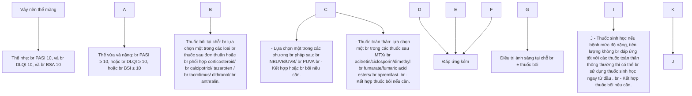

**3.2.2. Điều trị ánh sáng (phototherapy).**

- Quang trị liệu áp dụng khi vậy nền ở mức độ trung bình, nặng.
- Thường sử dụng UVB dài hẹp do có hiệu quả và hạn chế được tác dụng không mong muốn. Chiếu liều khởi đầu dựa trên liều đỏ da tối thiểu hoặc tuyp da bệnh nhân, tăng mỗi lần 50 mJ/cm2.


245

- PUVA (Psoralen phối hợp UVA) áp dụng khi tổn thương dày, không đáp ứng với UVB dài hẹp: meladinin 0,6 mg/kg uống 2 giờ trước khi chiếu UVA, liều UVA khởi đầu dựa trên liều đồ da tối thiểu hoặc tuýp da bệnh nhân, tăng mỗi lần 0,5 J/cm2. Sau uống thuốc cần đeo kính chống tia UV trong suốt 24 giờ sau đó.

- Liệu trình: 2 - 3 lần/tuần x 20 - 30 lần chiếu tấn công, sau đó chiếu duy trì. Hiệu quả: đạt tỷ lệ PASI 75 từ 50 - 90%. Phương pháp này giúp ổn định bệnh lâu dài. UVB dài hẹp có thể điều trị được cho trẻ em, phụ nữ có thai, người mắc các bệnh mạn tính.

- Tác dụng phụ: hay gặp nhất là đỏ da, ngứa, thâm da. Với PUVA có thể gặp nôn, buồn nôn do thuốc. UVB dài hẹp ít tăng nguy cơ ung thư da hắc tố và không hắc tố trong khi PUVA có tăng nguy cơ này vì vậy nên theo dõi chặt liều, tổng số lần chiếu.

## 3.2.3. Điều trị toàn thân

- Methotrexat: Liều khởi đầu thường 7,5- 10mg/tuần, uống hoặc tiêm bắp cố định vào 1 ngày trong tuần. Bổ sung acid folic khác ngày uống MTX. Nếu bệnh nhân đáp ứng kém có thể tăng liều (tùy thuộc cân nặng), nếu đáp ứng tốt có thể giảm liều dần. Tổng liều tích lũy khoảng 3,5g hoặc 1,5g đối với bệnh nhân nguy cơ (uống nhiều rượu, đái tháo đường, ... ). Khi đạt tổng liều tích lũy, cần sàng lọc tình trạng xơ gan cho bệnh nhân.

- Acitretin, dẫn chất của vitamin A axít, tác dụng điều hòa quá trình sừng hóa, điều trị các thể vảy nến vừa và nặng. Người lớn dùng liều khởi đầu 25 mg/ngày, sau 1-2 tuần, tùy theo kết quả và dung nạp thuốc sẽ điều chỉnh (tăng hoặc giảm liều) cho phù hợp. Tác dụng phụ rất hay gặp trên da và niêm mạc: khô da, khô môi, rụng tóc, chảy máu cam, bong tróc bàn tay, chân. Phụ nữ nên tránh thai trong và sau ngừng thuốc ít nhất 3 năm do thuốc có nguy cơ gây quái thai.

- Cyclosporin: tác dụng ức chế miễn dịch, điều trị những thể vảy nến nặng, liều khởi đầu 2,5-5 mg/kg/ngày chia làm 2 lần. Sau 1 tháng có thể tăng liều nhưng không quá 5mg/kg/ngày. Sau 6 tuần dùng liều cao mà không thấy hiệu quả thì ngừng thuốc. Khi đạt hiệu quả có thể dùng liều thấp duy trì nhưng không nên dùng thuốc quá 2 năm.

- Apremilast: một chất ức chế phosphodiesterase 4, là một loại thuốc uống khác để điều trị bệnh vảy nến mảng bám. Sự ức chế phosphodiesterase 4 làm giảm sản xuất nhiều cytokine liên quan đến sinh bệnh học của bệnh vảy nến

- Dimethyl fumarat/fumaric acid esters: thường được sử dụng ở Bắc Âu, hiệu quả tương đương MTX.

- Deucravacitinib là một chất ức chế chọn lọc qua đường uống của tyrosine kinase 2 (TKY2), một kinase làm trung gian truyền tín hiệu của các cytokine liên


246

quan đến sinh bệnh học của bệnh vảy nến, như IL-23. Vào năm 2022, FDA đã phê duyệt deucravacitinib để điều trị bệnh vảy nến thể mảng từ trung bình đến nặng ở những người trưởng thành phù hợp với liệu pháp toàn thân hoặc liệu pháp quang học.

- Thuốc sinh học (biotherapy): Trước đây thuốc sinh học sử dụng khi thất bại với các phương pháp toàn thân cổ điển. Tuy nhiên, hiện nay quan điểm đã thay đổi, nhóm thuốc này có thể được chỉ định ngay từ đầu. Một số thuốc sinh học đã được cấp phép sử dụng cho trẻ em mắc vảy nến như: Adalimumab, etanercept cho trẻ ≥ 4 tuổi, ustekinumab, secukinumab, ixekinumab cho trẻ ≥ 6 tuổi.

+ Nhóm ức chế TNF-α: etanercept, infliximab, adalimumab, certolizumab pegol.

+ Nhóm ức chế IL17: secukinumab, ixekizumab, brodalumab, bimekizumab.

+ Nhóm ức chế IL 23: ustekinumab, guselkumab, tildrakizumab, risankizumab.

+ Phác đồ một số thuốc sinh học hiện có ở Việt Nam cho người trưởng thành

| Thuốc       | Cơ chế              | Đường dùng       | Phác đồ                                           |
| ----------- | ------------------- | ---------------- | ------------------------------------------------- |
| Infliximab  | ức chế TNF-α        | truyền tĩnh mạch | 3 - 5 mg/kg tuần 0, 2, 6 → mỗi 8 tuần             |
| Adalimumab  | ức chế TNF-α        | Tiêm dưới da     | 80mg tuần 0, 40mg tuần 1 sau đó 40mg mỗi 2 tuần.  |
| Ustekinumab | ức chế IL-12, IL-23 | Tiêm dưới da     | 45 hoặc 90mg tuần 0 và 4; sau đó mỗi 12 tuần      |
| Secukinumab | ức chế IL-17        | Tiêm dưới da     | 300mg tuần 0, 1, 2, 3, 4 sau đó mỗi 4 tuần 1 lần. |
| Guselkumab  | ức chế IL-23        | Tiêm dưới da     | 100mg tuần 0 và 4, sau đó mỗi 8 tuần              |


247

+ Phác đồ điều trị ở trẻ em

| Thuốc       | Đối tượng | Đường dùng   | Phác đồ                                                                                                                          |
| ----------- | --------- | ------------ | -------------------------------------------------------------------------------------------------------------------------------- |
| Etanercept  | ≥ 4 tuổi  | tiêm dưới da | 0,8 mg/kg/tuần (tối đa: 50mg/lần)                                                                                                |
| Adalimumab  | ≥ 4 tuổi  | Tiêm dưới da | 0,8 mg/kg ở tuần 0,1 sau đó cách tuần (tối đa: 40mg/lần)                                                                         |
| Ustekinumab | ≥ 6 tuổi  | Tiêm dưới da | ≤ 60kg: 0,75mg/kg, 60-100kg: 45 mg; >100kg: 90 mg ( tuần 0, 4 và mỗi 12 tuần)                                                    |
| Secukinumab | ≥ 6 tuổi  | Tiêm dưới da | < 50kg: 75mg, ≥ 50kg: 150 mg với phác đồ 0,1,2,3,4 và mỗi 4 tuần                                                                 |
| Ixekizumab  | ≥ 6 tuổi  | Tiêm dưới da | < 25kg: 40mg tuần 0, → 20mg *mỗi 4 tuần*<br/>25-50kg: 80mg ở tuần 0 -> 40mg mỗi 2 tuần<br/>>50kg: 160 tuần 0 -> 80 mg mỗi 2 tuần |


**4. PHÒNG BỆNH**

- Tránh các yếu tố kích thích: nhiễm khuẩn, chấn thương, stress, ...
- Thăm khám định kì theo hẹn.
- Không tự ý sử dụng các thuốc điều trị.


248

# **VẼY NỀN THẖ MỦ**

(Pustular psoriasis)

## **1. ĐẠI CƯƠNG**

### **1.1 Khái niệm**

Vảy nến thể mủ là một thể nặng, ít gặp của vảy nến hoặc là một bệnh riêng biệt, đặc trưng bởi các mụn mủ vô khuẩn trên nền da đỏ.

### **1.2 Dịch tễ**

- Vảy nến thể mủ là bệnh ít gặp.
- Những bệnh nhân không đồng mắc với vảy nến thể thông thường có khởi phát sớm.
  - Vảy nến thể mủ toàn thân ở người lớn không khác biệt giữa 2 giới còn vảy nến thể mủ toàn thân ở trẻ nhỏ thường gặp hơn ở trẻ nam.
  - Vảy nến thể mủ khu trú thường gặp ở nữ tuổi trung niên.

### **1.3 Căn nguyên/Cơ chế bệnh sinh**

Cho đến nay căn nguyên, cơ chế bệnh sinh của vảy nến thể mủ chưa hoàn toàn được hiểu rõ nhưng nhiều nghiên cứu ủng hộ giả thuyết bệnh có liên quan đến yếu tố di truyền. Ngoài ra, có một số tác nhân làm khởi phát của vảy nến thể mủ đã được ghi nhận bao gồm: nhiễm trùng, thuốc và mang thai.

- **Về yếu tố di truyền:** một số đột biến gen đã được ghi nhận trong vảy nến thể mủ đặc biệt là vảy nến thể mủ toàn thân bao gồm: đột biến gen IL-36 RN, đột biến gen CARD14, đột biến gen AP1S3.

- **Các yếu tố khởi phát:**
  + Thuốc: corticosteroid toàn thân hay gặp nhất và một số loại thuốc khác bao gồm amoxicillin, terbinafin, codein, ceftriaxon, oxacillin, rituximab, pegylated interferon-alpha-2b và vắc-xin trực khuẩn *Calmette-Guérin*.
  + Nhiễm trùng: nhiễm trùng đường hô hấp trên, cytomegalo virus, varicella zoster virus, Epstein Barr virus, Coronavirus 2...
  + Mang thai: một số phụ nữ xuất hiện vảy nến mủ khi mang thai, cơ chế bệnh sinh chưa rõ nhưng sự thay đổi hormon trong quá trình mang thai được dự đoán là nguyên nhân gây ra tình trạng này.

## **2. CHẨN DOÁN**

### **2.1. Triệu chứng lâm sàng**

- Tổn thương cơ bản:
  + Tổn thương da: Là các mụn mủ vô khuẩn, nông, nhỏ bằng đầu đinh ghim, màu trắng đục trên nền da đỏ, các mụn mủ đứng riêng rẽ hoặc tập trung thành hồ mủ.


249

Khi mụn mủ khô để lại vết da trắng mỏng. Các mụn mủ phân bố lan tỏa toàn bộ cơ thể trong vết nên thể mủ toàn thân hoặc khu trú tại các vùng da ở đầu chi hoặc lòng bàn tay bàn chân trong vết nên thể mủ khu trú.

- + Tổn thương móng: có thể gặp đặc biệt là ở vết mủ đầu chi có thể gây loạn dưỡng móng hoặc mất móng.
- + Tổn thương niêm mạc: có thể gặp viêm lưỡi bàn đồ, viêm màng tiếp hợp, viêm quy đầu.

- - Triệu chứng cơ năng: sưng đau tại vùng tổn thương, có thể có ngứa
- - Triệu chứng toàn thân: thường gặp ở vết mủ toàn thân bao gồm sốt cao, mệt mỏi, suy kiệt.
- - Tiến triển: các triệu chứng lâm sàng tái phát nhiều lần.
- - Biến chứng: Đột cấp của vết mủ toàn thân nếu không được điều trị kịp thời có thể gây ra các biến chứng: nhiễm trùng thứ phát, rối loạn nước điện giải, mất protein gây giảm albumin dẫn đến sốc giảm thể tích, suy giảm chức năng gan thận, suy tim, ....

## 2.2. **Cận lâm sàng**

- - Xét nghiệm giúp chẩn đoán xác định và điều trị:
  - + Mô bệnh học: Thương bì: dày sừng, á sừng, mất lớp hạt, mụn mủ xóp bào Kogoj đây là biểu hiện đặc trưng của vết mủ toàn thân, các bạch cầu đa nhân trung tính di chuyển từ trung bì lên tập trung thành từng ổ ở phần nông của thương bì ở kẽ giữa các tế bào sừng đã bị thoái hóa. Trung bì xâm nhập viêm bạch cầu lympho quanh mạch.
    - + Xét nghiệm đánh giá tình trạng viêm hệ thống: công thức máu, máu lắng, CRP.
    - + Xét nghiệm đột biến gen: Đột biến gen IL36RN và gen CARD14 thường gặp ở vết mủ toàn thân và vết mủ đầu chi nhưng ít gặp ở bệnh nhân vết mủ lòng bàn tay bàn chân.
      - - Xét nghiệm giúp chẩn đoán phân biệt:
        - + Nhuộm soi và nuôi cấy vi khuẩn tại tổn thương: âm tính
        - + Nhuộm soi hoặc soi tươi tìm nấm tại tổn thương: âm tính
        - + Xét nghiệm PCR herpes tại tổn thương: âm tính
        - + Xét nghiệm tế bào dịch tổn thương không có tế bào gai lệch hình và không có tế bào đa nhân không lồ.
      - - Xét nghiệm đánh giá biến chứng: Tăng cao số lượng bạch cầu, tăng procalcitonin, giảm albumin máu, giảm calci máu, rối loạn điện giải, suy giảm chức năng gan thận...

## 2.3. **Chẩn đoán**

### 2.3.1. **Chẩn đoán xác định**


250

- Chẩn đoán xác định vẩy nến thể mù toàn thân:
  Năm 2018, Hội Da liễu Nhật Bản đã đưa ra bảng tiêu chuẩn chẩn đoán vẩy nến thể mù toàn thân gồm các tiêu chuẩn sau:
  1. Có các triệu chứng hệ thống như sốt, mệt mỏi…
  2. Đỏ da lan rộng kèm nhiều mụn mù vô trùng.
  3. Về mô bệnh học: mụn mù dưới lớp sừng chứa bạch cầu da nhân trung tính với đặc trưng là các mụn mù xóp bào Kogoj.
  4. Tái phát các triệu chứng lâm sàng hoặc mô bệnh học.
  
  Chẩn đoán xác định vẩy nến thể mù toàn thân khi có cả 4 tiêu chuẩn trên (độ nhạy 78%). Chẩn đoán nghi nhiều đến vẩy nến thể mù toàn thân khi có ít nhất 1 tiêu chuẩn số 2 hoặc số 3.

- Chẩn đoán xác định vẩy nến thể mù khu trú

  Dựa vào biểu hiện lâm sàng và mô bệnh học phù hợp đồng thời loại trừ các nguyên nhân khác có thể gây ra biểu hiện tương tự như nấm, virus herpes, vi khuẩn…

**2.3.2. Chẩn đoán thể bệnh**

- Vẩy nến thể mù toàn thân: các mụn mù phân bố toàn bộ cơ thể kèm theo các triệu chứng toàn thân như sốt cao mệt mỏi suy kiệt.

- Vẩy nến thể mù khu trú: thường không có triệu chứng toàn thân, tổn thương da khu trú trên những vùng da nhỏ.
  + Vẩy nến thể mù khu trú đầu chi: các mụn mù tập trung ở đầu ngón tay ngón chân.
  + Vẩy nến thể mù lòng bàn tay bàn chân: các mụn mù tập trung ở lòng bàn tay bàn chân 2 bên.

**2.3.3. Chẩn đoán giai đoạn bệnh**

- Giai đoạn bùng phát: tổn thương da lan rộng với nhiều mụn mù vô trùng trên nền da đỏ, thường kèm theo các triệu chứng toàn thân như mệt mỏi, sốt cao…

- Giai đoạn ổn định: đặc trưng bởi sự hiện diện của các triệu chứng da còn sót lại như đỏ da, bong vảy và có thể có một vài mụn mù nhỏ.

**2.3.4. Chẩn đoán phân biệt**

- Chẩn đoán phân biệt của vẩy nến thể mù toàn thân
  + Phát ban mụn mù cấp tính
  + Viêm da bội nhiễm
  + Pemphigus IgA
  + Bệnh da mụn mù dưới lớp sừng
  + Nấm da

- Chẩn đoán phân biệt của vẩy nến thể mù đầu chi
  + Viêm da nhiễm trùng
  + Nấm da
  + Herpes đầu chi
  + Tổ đỉa

- Chẩn đoán phân biệt của vẩy nến thể mù lòng bàn tay bàn chân
  + Vẩy nến thông thường lòng bàn tay bàn chân
  + Nấm da bàn tay bàn chân


251

+ Tổ đĩa

# 3. **ĐIỀU TRỊ**

## 3.1. Nguyên tắc điều trị

- Điều trị tấn công giai đoạn bùng phát và điều trị duy trì ở giai đoạn ổn định để ngăn ngừa các đợt bùng phát bệnh trong tương lai.
- Xác định và loại bỏ yếu tố khởi phát.
- Kết hợp điều trị tại chỗ và toàn thân.
- Điều trị và phòng ngừa các biến chứng nặng: rối loạn nước điện giải, bội nhiễm, tăng cường dinh dưỡng, ...

## 3.2. Điều trị cụ thể

### 3.2.1. Điều trị vảy nến thể mủ toàn thân

```mermaid
graph TD
  N0[DIỀU TRỊ TOÀN THÂN] --> N1[Ở người lớn không mang thai không cho con bú]
  N2[A] --> N3[Ở trẻ em]
  N2[A] --> N4[Phụ nữ mang thai]
  N5[B] --> N6[Lựa chọn thứ 1]
  N7[E] --> N8[Giai đoạn bùng phát: + Cyclosporin + Ức chế IL-36 + Ức chế IL17 + Ức chế IL-23 + Ức chế TNF-α: Infliximab]
  N9[F] --> N10[Giai đoạn ổn định: + Acitretin + Methotrexat + Ức chế IL-36 + Ức chế IL17 + Ức chế IL-23 + Ức chế TNF-α]
  N5[B] --> N11[Lựa chọn thứ 2]
  N12[H] --> N13[PUVA br Ức chế TNF-α khác: adalimumab, certolizumab, etanercept br Kết hợp các phương pháp: Etanercept + cyclosporin, Infliximab + methotrexat, adalimumab + acitretin...]
  N5[B] --> N14[Lựa chọn thứ 3]
  N15[J] --> N16[Corticoid br Phương pháp gan bạch cầu, Mycophenolat mofetil, dapson, Anakinra, canakinumab...]
  N17[C] --> N18[Giai đoạn bùng phát: + Cyclosporin + Infliximab + Secukinumab + Adalimumab]
  N19[L] --> N20[Giai đoạn ổn định: + Acitretine + Methotrexate + Etanercept]
  N21[D] --> N22[- Phối hợp với bác sĩ chuyên khoa phụ sản br - Cyclosporin br - Điều trị ánh sáng br - Cân nhắc thuốc ức chế TNF-α: Infliximab br - Corticoid]
  N23[DIỀU TRỊ HỖ TRỢ TOÀN THÂN] --> N24[Kiểm soát nhiệt độ br Kiểm soát rối loạn nước điện giải br Bổ phụ albumin br Điều chỉnh rối loạn chức năng gan, thận...]
  N25[DIỀU TRỊ TẠI CHÒ] --> N26[Kem dưỡng ẩm, corticoid bôi, tacrolimus bôi, calcipotriol bôi]
```

*Sơ đồ điều trị vảy nến thể mủ toàn thân*

- *Điều trị toàn thân*

+ Cyclosporin: Liều điều trị 2,5- 5 mg/kg/ngày cho đến khi kiểm soát được bệnh thì hạ dần liều trong vòng 2-3 tháng sau đó dừng và chuyển sang thuốc điều trị duy


252

trị khác.

+ Thuốc ức chế IL-36: spesolimab

- Điều trị đợt bùng phát liều tĩnh mạch 900 mg truyền trong 90 phút, nếu các triệu chứng không thuyên giảm bổ sung thêm 1 liều tương tự sau 1 tuần.

- Điều trị giai đoạn ổn định: 300mg hoặc 150mg tiêm dưới da hàng tháng hoặc mỗi 3 tháng tùy mức độ bệnh.

+ Ức chế IL17

- Secukinumab: tiêm dưới da 300mg tại các tuần 0,1,2,3,4, sau đó là 300mg mỗi 4 tuần; liều 150mg có thể có tác dụng ở một số bệnh nhân.

- Ixekizumab: tiêm dưới da 160 mg tại tuần 0 sau đó là 80mg tại tuần 2,4,6,8,10 và 12 sau đó 80mg mỗi 4 tuần.

- Brodalumab: tiêm dưới da 210mg tại tuần 0,1,2 và sau mỗi 2 tuần.

+ Thuốc ức chế IL-23

- Ustekinumab: bệnh nhân nặng dưới 100kg tiêm dưới da 45mg tại tuần 0,4 và sau mỗi 12 tuần, đối với bệnh nhân nặng trên 100kg tăng liều lên 90 mg mỗi lần tiêm.

- Guselkumab: tiêm dưới da 100mg tại tuần 0,4 và sau mỗi 8 tuần

+ Thuốc ức chế TNF-α:

- Infliximab: Liều dùng truyền tĩnh mạch 5 mg/kg ở tuần 0,2,6 và mỗi 6-8 tuần sau đó

- Etanercept: <63kg: 0,8 mg/kg/1 lần mỗi tuần, ≥63 kg: 50 mg một lần mỗi tuần

+ Acitretin: Liều khởi đầu 0,5-1mg/kg cân nặng thường bắt đầu đáp ứng sau 7-10 ngày và đạt hiệu quả hoàn toàn sau 2-3 tháng, khi đạt được cải thiện có thể giảm liều.

+ Methotrexat: Liều tối đa: 15-25mg/tuần tuy nhiên nên khởi đầu với liều thấp 5-10mg/tuần trước sau đó tăng liều dần, đối với người cao tuổi hoặc suy thận liều khởi đầu không quá 10mg/tuần.

+ Điều trị ánh sáng: UVA, PUVA

+ Corticosteroid: corticosteroid giúp kiểm soát nhanh chóng triệu chứng của vây nên thể mũ toàn thân nhưng cũng là nguyên nhân gây tái phát bệnh khi ngừng thuốc do đó không nên sử dụng, chỉ sử dụng trong các trường hợp có biến chứng hội chứng suy hô hấp cấp tiến triển hoặc có chống chỉ định với những thuốc khác. Chỉ dùng ngắn ngày và cần kết hợp với các liệu pháp khác để hạn chế sự bùng phát của bệnh khi giảm liều.


253

+ Một số thuốc khác: phương pháp gan bạch cầu hạt và bạch cầu đơn nhân, anakinra, canakinumab, mycophenolat mofetil, kê mống, dapson và apremilast.

- *Điều trị tại chỗ*

Các thuốc điều trị tại chỗ được sử dụng phối hợp với các thuốc điều trị toàn thân bao gồm:

+ Kem dưỡng ẩm: giúp làm dịu, bong vảy

+ Corticosteroid bôi

+ Tacrolimus bôi

+ Calcipotriol bôi

- *Điều trị hỗ trợ*

Trong đợt cấp, ở các trường hợp nặng cần nhập viện theo dõi và kiểm soát các rối loạn kèm theo nếu có:

+ Kiểm soát nhiệt độ

+ Kiểm soát rối loạn nước điện giải

+ Bôi phụ albumin

+ Điều chỉnh rối loạn chức năng gan thận....

**3.2.2. Điều trị vảy nến thể mủ khu trú**

- Lựa chọn thứ 1:

  + Tổn thương khu trú: corticosteroid đơn độc hoặc phối hợp calcipotriol bôi

  + Tổn thương lan rộng: acitretin hoặc ánh sáng trị liệu kết hợp với corticosteroid bôi.

- Lựa chọn thứ 2: Nếu thất bại với các phương pháp trên lựa chọn RePuva hoặc các thuốc ức chế miễn dịch khác: cyclosporin, methotrexat, ...

- Lựa chọn thứ 3: Nếu thất bại với các phương pháp trên, thuốc sinh học là lựa chọn tiếp theo.

**4. PHÒNG BỆNH**

- Phát hiện loại bỏ và hạn chế các yếu tố nguy cơ gây bùng phát bệnh.

- Bệnh nhân vảy nến thông thường cần được thăm khám, điều trị đúng theo hướng dẫn của bác sĩ chuyên khoa để tránh tiến triển thành vảy nến thể mủ.

- Thăm khám định kỳ theo hẹn.

- Xét nghiệm gen cho các đối tượng nguy cơ.

# **VẢY PHẨN DẠNG LICHEN**

(Pityriasis Lichenoides)


254

# 1. **ĐẠI CƯƠNG**

## 1.1. **Khái niệm**

Vảy phản dạng lichen (trước đây gọi là một thể của á vảy nến) là bệnh viêm có biểu hiện đồ da, bong vảy tiến triển dai dẳng, được chia thành 2 thể chính: vảy phản dạng lichen mạn tính và vảy phản dạng lichen và đậu mùa cấp tính.

## 1.2. **Dịch tễ**

Vảy phản dạng lichen hay gặp ở trẻ em và những người trưởng thành. Tỷ lệ nam ưu thế hơn nữ. Không có sự khác biệt tỷ lệ mắc phái giữa các chủng tộc, vùng miền địa lý.

## 1.3. **Căn nguyên/ Cơ chế bệnh sinh**

Căn nguyên của bệnh chưa rõ ràng, một số yếu tố khởi phát như: nhiễm trùng (virus, vi khuẩn, ký sinh trùng), vắc xin, thuốc, mất cân bằng estrogen-progesteron, một số tác giả cho rằng bệnh vảy phản dạng lichen có liên quan tới bệnh lý tăng sinh lympho bào.

# 2. **CHẨN ĐOÁN**

## 2.1. **Triệu chứng lâm sàng**

- Tổn thương cơ bản: là các sẩn chắc, hơi nổi cao (còn được xếp vào nhóm bệnh da có sẩn), màu đỏ hồng hoặc nâu xám, lúc đầu nhỏ bằng hạt đỗ, sau lớn dần, trên sẩn xuất hiện vảy da màu trắng xám, khô và dính vào tổn thương. Tổn thương rải rác khắp thân mình và các chi.

- Cào vảy theo phương pháp Brocq: vảy bong cả mảng nhưng còn dính một bên, gọi là dấu hiệu kẹp chì hay dấu hiệu gắn xi.

- Ngoài sẩn điển hình còn thấy dát đỏ có vảy da, đôi khi chỉ có vảy da hoặc vảy hơi hồng, vảy tiết màu xám.

- Trường hợp cấp tính, tổn thương là dát đỏ và sẩn phù, trung tâm có thể thấy mụn nước và xuất huyết. Các sẩn, mụn nước nằm sâu, có dạng đậu mùa là dấu hiệu quan trọng để chẩn đoán. Các sẩn này sau loét, hoại tử và đóng vảy tiết; khi lành để lại sẹo lõm, màu thâm, dạng đậu mùa và có thể tăng hoặc giảm sắc tố da.

- Cơ năng: không ngứa, không đau. Trường hợp cấp tính có nhúc nhúc, suy nhược, mệt mỏi.

- Toàn trạng ít bị ảnh hưởng. Trường hợp cấp tính có thể có đôi khi sốt nhẹ, tăng tốc độ lắng máu, hạch ngoại biên to.

## 2.2. **Cận lâm sàng**

- Mô bệnh học


255

+ Thượng bì có hiện tượng á sừng, lớp gai có thâm nhiễm bạch cầu đơn nhân rải rác (hiện tượng thoát bào), thoái hóa lòng lớp đáy, có hiện tượng thoát hồng cầu, có thể có các ổ áp xe nhỏ giống ổ vảy nến. Trường hợp cấp tính có nhiều tế bào hoại tử thượng bì, nhiều vùng có thể tạo thành mụn nước.

+ Trung bì: Viêm mạch của bạch cầu đơn nhân và xuất huyết, thoát hồng cầu ở trung bì nông, xâm nhập viêm dạng lichen.

- Hóa mô miễn dịch: Các tế bào lympho dương tính với dòng T, các thể mạn tính thường dương tính T CD4, thể cấp tính dương tính T CD8. Có một số nghiên cứu dấu ấn CD30 bộc lộ ở bệnh này đây là dấu hiệu chỉ điểm một biến thể giống dạng u lympho ở da khác.

- Các xét nghiệm máu: Công thức máu: số lượng bạch cầu, protein C phản ứng chẩn đoán tình trạng nhiễm trùng khi bệnh nhân có sốt, mệt mỏi nhiều.

- Các xét nghiệm tìm căn nguyên: Vi khuẩn, virus, nấm, ký sinh trùng… hay gặp vi rút *Streptococcus nhóm A, T. gondii, HIV* và *Epstein-Barr*.

- Dermoscopy: Ít có ý nghĩa chẩn đoán.

**2.3. Chẩn đoán xác định.**

Chẩn đoán xác định dựa vào lâm sàng và mô bệnh học.

**2.4. Chẩn đoán thể bệnh:**

Biểu hiện lâm sàng và hình ảnh mô bệnh học giúp phân chia các thể:

- Vảy phản dạng lichen mạn tính (pityriasis lichenoide chronique- PLC)
  + Tổn thương diễn biến chậm và các sẩn có vảy màu nâu đỏ vảy da khô dính, toàn trạng ít bị ảnh hưởng và không thấy dấu hiệu cơ năng.
  + Mô bệnh học có đặc điểm ít tế bào hoại tử vùng thượng bì, vùng xâm nhập viêm trung bì nông và dạng lichen.

- Vảy phản dạng lichen và đậu mùa cấp tính (pityriasis lichenoide et varioliforme acute-PLEVA): Bệnh được đặc trưng bởi sự khởi phát cấp tính của các sẩn xuất huyết và đóng vảy Mô bệnh học thâm nhiễm tế bào lympho dày đặc, hình nêm, ở lớp hạ bì kèm hoại tử, mụn nước, xuất huyết.

- Bệnh loét hoại tử sốt Mutcha-Habermann
  + Là biến thể nặng hiếm gặp của bệnh vảy phản dạng lichen và đậu mùa cấp tính được đặc trưng lâm sàng bởi các tổn thương da loét hoại tử nặng nề, sốt cao liên tục, kéo dài.
  + Mô bệnh học có các đặc điểm điển hình của bệnh vảy phản dạng lichen và đậu mùa cấp tính với hoại tử nặng nề tế bào thượng bì, nhiều vùng có thể tạo thành mụn nước. Trung bì viêm mạch xuất huyết lan rộng xuống vùng hạ bì.


256

**2.5. Chẩn đoán phân biệt**
- Vảy phấn hồng Gibert
- Vảy nến thể giọt
- Giang mai II
- Bệnh sẩn dạng u lympho
- U sùi dạng nấm thể giảm sắc tố
- Á lao sẩn hoại tử
- Thủy đậu
- Herpes simplex
- Vết cắn của động vật chân khớp
- Hội chứng Gianotti-Crosti
- Bệnh mô bào tế bào Langerhans

**3. ĐIỀU TRỊ**

**3.1. Nguyên tắc điều trị:**
- Điều trị phụ thuộc vào thể bệnh và giai đoạn bệnh.
- Loại bỏ các yếu tố khởi phát.

**3.2. Điều trị cụ thể**

**3.2.1. Vảy phấn dạng lichen mạn tính và vảy phấn dạng lichen và đậu mùa cấp tính**
- Bệnh có thể tự khỏi nên không phải lúc nào cũng cần điều trị.
- Tại chỗ dùng các loại kem bôi giữ ẩm, dịu da, kem corticosteroid mức độ trung bình.
- Toàn thân:
  + Kháng sinh uống: Lựa chọn một trong các loại sau:
    - Tetracyclin 2g/ngày, khi triệu chứng thoái lui giảm xuống 1g/ngày trong 1 tháng.
    - Erythromycin 30-50mg/kg cân nặng/ngày trong 2 tuần – 3 tháng.
    - Doxycyclin 100mg x 2 lần/ngày trong 2 tuần – 3 tháng.
    - Minocyclin 100mg x 2 lần/ngày trong 2 tuần – 3 tháng.
    - Azithromycin 2g chia liều 3-5 ngày.
  + Methotrexat: người lớn 10-25mg/tuần, trẻ em 0,2-0,7 mg/kg/tuần trong 3-4 tháng.


257

+ PUVA, UVB-NB (UVB dải hẹp-narrow band): 3 lần/tuần, sau đó giảm theo đáp ứng, thời gian chiếu kéo dài 2-3 tháng.

PLC, PLEVA <u>Mức độ nhẹ: dùng corticosteroid tại chỗ.</u>
<u>Mức độ lan rộng: Kháng sinh uống kết hợp UVB.</u>
<u>Mức độ nặng: Dùng methotrexat.</u>

**3.2.2. Bệnh loét hoại tử sót Manya-Habermann**

- Bắt buộc điều trị nội trú

- Dữ liệu nghiên cứu chưa khẳng định phương pháp điều trị tốt nhất cho bệnh này. Methotrexat được ưu tiên sử dụng. Corticosteroid toàn thân đã được sử dụng trong nhiều trường hợp được báo cáo, nhưng hiệu quả chưa rõ ràng. Một số phương pháp cũng được đề cập tới như globulin miễn dịch tiêm tĩnh mạch, kháng sinh, aciclovir, dapson, cyclosporin và liệu pháp quang học.

- Có những báo cáo trường hợp điều trị thành công với infliximab. Trong một báo cáo, chỉ cần hai liều là có thể thuyên giảm hoàn toàn.

**4. PHÒNG BỆNH**

- Tìm kiếm và loại bỏ tất cả các yếu tố phát động như nhiễm trùng, thuốc, thực phẩm, các loại vắc xin, cân bằng nội tiết.

- Dự phòng tiến triển thành u lympho, sinh thiết ít nhất 1 năm/lần nếu tổn thương tồn tại dai dẳng.


258

# **ĐỖ DA TOÀN THÂN**

**(Erythroderma)**

## **1. ĐẠI CƯƠNG**

### **1.1. Khái niệm**

Đỏ da toàn thân là tình trạng da đỏ bong vảy lan tỏa, chiếm trên 90% diện tích cơ thể kèm theo những biểu hiện toàn thân, có thể nguy hiểm đến tính mạng.

### **1.2. Dịch tễ**

Bệnh xảy ra ở mọi lứa tuổi, gặp ở cả hai giới, tỉ lệ nam gấp 2 đến 4 lần nữ, phân bố ở tất cả các chủng tộc và các khu vực.

### **1.3. Căn nguyên/Cơ chế bệnh sinh**

#### **1.3.1 Đỏ da toàn thân ở người lớn**

<table>
  <tr>
    <th>Nhóm căn nguyên</th>
    <th>Bệnh/tác nhân cụ thể</th>
  </tr>
<tr>
    <td>Đỏ da toàn thân vô căn</td>
<td>Không rõ căn nguyên</td>
  </tr>
<tr>
    <td>Bệnh da viêm</td>
<td>Vảy nến</td>
  </tr>
<tr>
    <td></td>
<td>Viêm da cơ địa và các viêm da khác</td>
  </tr>
<tr>
    <td></td>
<td>Vảy phản đồ nang lông</td>
  </tr>
<tr>
    <td></td>
<td>Lichen phẳng</td>
  </tr>
<tr>
    <td></td>
<td>Viêm da ánh sáng mạn tính</td>
  </tr>
<tr>
    <td></td>
<td>Bệnh Ofuji</td>
  </tr>
<tr>
    <td></td>
<td>Sarcoidosis</td>
  </tr>
<tr>
    <td>Phản ứng với thuốc</td>
<td>Penicillin, sulfonamid, carbamazepin, phenytoin, allopurinol,...</td>
  </tr>
<tr>
    <td>Bệnh lý ác tính</td>
<td>U lympho T tại da, hội chứng Sezary</td>
  </tr>
<tr>
    <td></td>
<td>U lympho khác</td>
  </tr>
<tr>
    <td></td>
<td>Bạch cầu cấp</td>
  </tr>
<tr>
    <td></td>
<td>Ung thư biểu mô thận, gan, phổi, đại tràng,...</td>
  </tr>
<tr>
    <td>Bệnh da bong nước tự miễn</td>
<td>Pemphigus thông thường, pemphigus vảy lá</td>
  </tr>
<tr>
    <td></td>
<td>Pemphigoid bong nước</td>
  </tr>
<tr>
    <td></td>
<td>Pemphigus á u</td>
  </tr>
<tr>
    <td>Bệnh mô liên kết tự miễn</td>
<td>Viêm bì cơ</td>
  </tr>
<tr>
    <td></td>
<td>Lupus bán cấp</td>
  </tr>
</table>


259

<table>
  <tr>
    <td>Nhiễm vi khuẩn – nấm – ký sinh trùng</td>
<td>Ghẻ</td>
  </tr>
<tr>
    <td></td>
<td>Hội chứng bong vảy da do tụ cầu vàng</td>
  </tr>
<tr>
    <td></td>
<td>Hội chứng đỏ da do liên cầu tan huyết nhóm beta</td>
  </tr>
<tr>
    <td></td>
<td>Nhiễm nấm lan tỏa</td>
  </tr>
<tr>
    <td>Bệnh lý huyết học</td>
<td>Hội chứng tăng bạch cầu ái toan</td>
  </tr>
<tr>
    <td></td>
<td>Mastocytosis</td>
  </tr>
<tr>
    <td></td>
<td>Bệnh màng ghép chống chủ</td>
  </tr>
</table>

**1.3.2. *Đồ da toàn thân ở trẻ sơ sinh và trẻ em***

<table>
  <tr>
    <th>Nhóm căn nguyên</th>
    <th>Bệnh/tác nhân cụ thể</th>
  </tr>
<tr>
    <td>Bệnh da nhiễm khuẩn</td>
<td>Hội chứng bong vảy da do tụ cầu vàng</td>
  </tr>
<tr>
    <td></td>
<td>Nhiễm candida da bẩm sinh</td>
  </tr>
<tr>
    <td></td>
<td>Giang mai bẩm sinh</td>
  </tr>
<tr>
    <td></td>
<td>Ghẻ</td>
  </tr>
<tr>
    <td>Bệnh da viêm</td>
<td>Viêm da cơ địa</td>
  </tr>
<tr>
    <td></td>
<td>Viêm da đầu</td>
  </tr>
<tr>
    <td></td>
<td>Vảy nến</td>
  </tr>
<tr>
    <td></td>
<td>Vảy phản đỏ nang lông</td>
  </tr>
<tr>
    <td></td>
<td>Mastocytosis da lan tỏa</td>
  </tr>
<tr>
    <td>Vảy cá</td>
<td>Vảy cá bẩm sinh</td>
  </tr>
<tr>
    <td></td>
<td>Hội chứng Netherton</td>
  </tr>
<tr>
    <td>Suy giảm miễn dịch tiên phát</td>
<td>Hội chứng suy giảm miễn dịch nặng</td>
  </tr>
<tr>
    <td></td>
<td>Hội chứng tăng IgE</td>
  </tr>
<tr>
    <td></td>
<td>Hội chứng Wiskott-Aldrich, DiGeorge</td>
  </tr>
<tr>
    <td>Rối loạn chuyển hóa</td>
<td>Viêm da đầu chi ruột</td>
  </tr>
<tr>
    <td></td>
<td>Rối loạn chuyển hóa biotin</td>
  </tr>
<tr>
    <td>Quá mẫn với thuốc</td>
<td>Ceftriaxon, vancomycin,...</td>
  </tr>
</table>

**2. CHẨN ĐOÁN**

**2.1. Triệu chứng lâm sàng**

- Tổn thương da
+ Đồ da màu sắc thay đổi tùy theo thời gian, căn nguyên, và sự tiến triển của


260

bệnh, tổn thương chiếm >90% diện tích cơ thể.

- + Vảy da có thể bong sớm nhưng thường thấy xuất hiện đồng thời với dát đỏ và kéo dài trong suốt quá trình tiến triển của bệnh. Kích thước vảy ở giai đoạn cấp thường lớn thành mảng, giai đoạn mạn tính thì thường nhỏ dạng vảy cám.

- + Phù nề cũng thường gặp nhưng ít hơn so với hai triệu chứng trên. Phù có thể toàn thân, cũng có thể chỉ khu trú ở chi dưới. Đôi khi thấy có mọn nước kèm tiết dịch hoặc không tiết dịch.

- + Da dày và các nếp da hằn sâu xuống, đặc biệt là khi phù nề và thâm nhiễm tế bào ở trung bì hoặc lichen hóa. Lòng bàn tay, bàn chân trên 80% có thể bị dày sừng ở những trường hợp đỏ da toàn thân mạn tính.

- + Tăng hoặc giảm sắc tố làm da thâm sạm hay tạo thành những đám loang lổ.

- + Da quanh hốc mắt có thể bị viêm đỏ, lộn mi, chảy nước mắt. Ở mặt có thể biến dạng do phù nề hoặc thâm nhiễm làm mất đi các nếp nhăn trên mặt, thay vào đó là những khối gồ lên trông như mặt sư tử.

- + Nếu bội nhiễm sẽ có mù, vảy tiết làm cho bệnh nặng thêm.

- - Tổn thương niêm mạc: viêm môi, viêm kết mạc, viêm miệng...

- - Tổn thương tóc, móng: da số trường hợp có rụng tóc, thưa lông mày, lông mi. Móng xù xì, màu nâu, dày sừng dưới móng, tạo thành những rãnh sâu mủn móng, viêm quanh móng, loạn dưỡng móng thậm chí bong móng thường gặp ở những trường hợp bệnh tiến triển sau nhiều tuần.

- - Cơ năng

- + Ngứa là triệu chứng nổi bật và thường gặp.

- + Ngứa có thể rất dữ dội, làm mất ngủ, gây ra các tổn thương do cào gãi, đặc biệt ở những người bệnh có tổn thương nặng và lan rộng.

- + Một số ít trường hợp người bệnh chỉ ngứa nhẹ hoặc có cảm giác râm rút khó chịu.

- + Có cảm giác da khô làm hạn chế cử động.

- - Triệu chứng toàn thân

- + Người bệnh có thể sốt cao hoặc có cảm giác ớn lạnh hay rét run. Đôi khi thấy hạch ngoại biên, gan, lách to.

- + Ảnh hưởng đến toàn trạng: sốt hoặc hạ nhiệt độ, tình trạng suy kiệt, gây sút, mất nước, hạ huyết áp, nhiễm trùng huyết.

- - Triệu chứng khác tùy theo căn nguyên gây đỏ da toàn thân.

- - Biến chứng:


261

- Bội nhiễm da thường do tự cầu.
- Rối loạn điện giải, kèm theo mất nước.
- Loét tỷ đờ có thể là lối vào gây nhiễm trùng hệ thống như: viêm phổi, tắc mạch, huyết khối, đặc biệt ở những người cao tuổi.
- Những biến chứng điều trị do dùng corticosteroid tại chỗ hoặc toàn thân kéo dài gây châm hóa, kích ứng, suy giảm miễn dịch, viêm nhiễm mạn tính.

**2.2. Cận lâm sàng**

Các xét nghiệm chỉ định tùy trường hợp để chẩn đoán nguyên nhân, chẩn đoán biến chứng, theo dõi điều trị.

- Công thức máu.
- Huyết đồ.
- Tổng phân tích nước tiểu.
- Sinh hóa máu.
- Chẩn đoán hình ảnh.
- Cấy máu, cấy vi khuẩn ở da.
- Xét nghiệm HIV.
- Mô bệnh học: Đa số trường hợp hình ảnh mô bệnh học không đặc hiệu, một số trường hợp có căn nguyên thì hình ảnh mô bệnh học có những biểu hiện đặc trưng.
- Các xét nghiệm khác tùy theo nguyên nhân gây đỏ da toàn thân: nhuộm hóa mô miễn dịch, đếm tế bào dòng chảy ngoại vi, xét nghiệm tìm kháng thể kháng nhân,...

**2.3. Chẩn đoán xác định**

Dựa vào lâm sàng có đỏ da bong vảy trên 90% diện tích cơ thể.

**2.4. Chẩn đoán phân biệt**

Chủ yếu chẩn đoán phân biệt giữa các nguyên nhân với nhau.

**3. ĐIỀU TRỊ**

**3.1. Nguyên tắc điều trị**

- Điều trị triệu chứng bằng các phương pháp tại chỗ và các thuốc toàn thân.
- Kết hợp điều trị triệu chứng với tìm và điều trị căn nguyên gây bệnh.

**3.2. Điều trị cụ thể**

**3.2.1 Điều trị chung**

- Điều trị tại chỗ: nhằm làm giảm thiểu sự kích thích ở da, niêm mạc, giữ ẩm,


262

chống nhiễm trùng và cải thiện tình trạng viêm.

+ Tổn thương da
  - Thuốc làm dịu, giữ ẩm da.
  - Thuốc bặt sùng, bong vảy: mỡ salicylic.
  - Ngâm tẩm thuốc tím pha loãng.
  - Tẩm nước suối khoáng.

+ Tổn thương niêm mạc: súc miệng, nhò mắt hàng ngày bằng nước muối sinh lý. Bôi dung dịch glycerin borat trong tổn thương miệng.

- Điều trị toàn thân
+ Chống ngứa bằng kháng histamin.
+ Bôi phụ nước và điện giải theo điện giải đồ.
+ Nâng cao thể trạng bằng các vitamin, truyền đạm, truyền máu...
+ Phòng ngừa tác tính mạch, vật lý trị liệu trong những trường hợp nằm lâu.

**3.2.2 Điều trị theo nguyên nhân gây bệnh**

- Dị ứng thuốc: ngừng thuốc nghi ngờ. Sử dụng corticosteroid toàn thân hoặc các thuốc ức chế miễn dịch khác tùy mức độ nặng của bệnh.

- Vậy nên: điều trị bằng các thuốc điều trị toàn thân như cyclosporin A, methotrexat, acitretin, thuốc sinh học.

- Viêm da cơ địa: phản lớn đáp ứng với thuốc bôi mạnh trong thời gian ngắn. Bệnh tiến triển có thể điều trị ngắn ngày bằng thuốc ức chế/điều hòa miễn dịch như dupilumab, cyclosporin A, methotrexat, azathioprin.

- Hội chứng Sézary: quang hóa trị liệu ngoài cơ thể, retinoid uống, methotrexat, thuốc ức chế histone deacetylase (romidepsin, vorinostat, belinostat,...).

- Vảy phản đồ nang lông: retinoid uống, methotrexat, thuốc kháng IL-17 hoặc IL-23.

- Điều trị đồ da toàn thân chưa rõ căn nguyên: Bệnh nhân không đáp ứng với thuốc bôi có thể cân nhắc corticosteroid toàn thân hoặc các thuốc ức chế miễn dịch khác (methotrexat, cyclosporin, azathioprin,....)

**4. PHÒNG BỆNH**

- Điều trị sớm các bệnh lý có thể gây ra đồ da toàn thân.

- Nâng cao thể trạng.


263

# **BỆNH LICHEN PHẲNG**
**(Lichen planus)**

## 1. **ĐẠI CƯƠNG**

### 1.1. Khái niệm

Lichen phăng là tình trạng viêm da với các tổn thương đặc trưng là sẩn phăng, hình đa giác, màu đỏ tím và ngứa, ngoài ra còn có tổn thương ở niêm mạc và móng.

### 1.2. Dịch tễ

Lichen phăng chiếm khoảng 0,5-1% dân số với tỉ lệ mắc bệnh giữa nam và nữ ngang nhau. Lứa tuổi hay gặp từ 30-60 tuổi và ít gặp ở trẻ em.

### 1.3. Căn nguyên/Cơ chế bệnh sinh

Cơ chế bệnh sinh của lichen phăng chưa được sáng tỏ, liên quan đến phản ứng miễn dịch liên quan đến hoạt hóa tế bào lympho T, đặc biệt là tế bào TCD8.

Các yếu tố liên quan đến khởi phát bệnh bao gồm:

- Thuốc: thuốc ức chế ACE, thuốc chẹn beta, methyldopa, quinidine, cloroquin, hydroxychloroquine, thuốc lợi tiểu thiazide, muối vàng.
- Virus: đặc biệt là viêm gan C, HSV.
  + Các bệnh phối hợp: pemphigoid, lupus, ....
  + Nhiều trường hợp không rõ nguyên nhân.

## 2. **CHẨN ĐOÁN**

### 2.1. Triệu chứng lâm sàng

- Tổn thương da:
  + Sẩn nhẵn, bóng, đẹt, hình đa giác, màu tím hoa cà, kích thước 1-10mm, bề mặt thường có những khía ngang dọc gọi là mạng lưới Wickham. Sẩn có thể liên kết thành mảng, khi khởi đề lại vết thâm. Tổn thương ở da đầu có thể gây rụng tóc vĩnh viễn.
  + Vị trí thường gặp: cổ tay, thắt lưng, căng chân, đầu, dương vật.
  + Có thể gặp hiện tượng Koebner: người bệnh gãi, dọc theo vết gãi xuất hiện tổn thương mới.
- Tổn thương niêm mạc:
  + Tổn thương đặc trưng là những dải hoặc mạng lưới màu trắng như sứ hoặc màu xám.
  + Vị trí thường gặp: lưỡi và niêm mạc má, ngoài ra còn có thể gặp ở thanh


264

quần, amidan, quy đầu, âm đạo, viêm mạc dạ dày-ruột, quanh hậu môn.

- Tổn thương mỏng gặp ở 10% người bệnh với các biểu hiện là những khía dọc, dày mỏng, tách mỏng hoặc teo mỏng.

- Cơ năng: ngứa ít hoặc nhiều tùy từng trường hợp.

## **2.2. Cận lâm sàng**

- Mô bệnh học: Thường bì: dày sừng, dày lớp hạt, thoái hóa lông lớp đáy. Phần trung bì nông các tế bào thâm nhiễm làm biến dạng như bì tạo thành vòm, giới hạn rõ. Tế bào thâm nhiễm chủ yếu là lympho T như CD4+, CD8+ và tương bào.

- Dermoscopy: góp phần chẩn đoán sớm bệnh lichen phẳng. Các dấu hiệu trên da của lichen phẳng bao gồm mạng lưới Wickham, mao mạch hướng tâm, tăng sắc tố dạng chấm lan tỏa màu nâu.

- Xét nghiệm soi nấm: âm tính.

- Miễn dịch huỳnh quang trực tiếp: lắng đọng phức hợp miễn dịch mà chủ yếu là IgM ở thượng bì và trung bì, một phần nhỏ IgA và C3. Lắng đọng sợi fibrin ở vùng tiếp giáp trung bì thương bì cũng là một đặc trưng của lichen phẳng.

- Các xét nghiệm khác: xét nghiệm viêm gan virus B và C, nhất là viêm gan C. Ngoài ra nên xét nghiệm đánh giá chức năng gan do bệnh lichen phẳng liên quan đến xơ gan.

## **2.3. Chẩn đoán xác định:**

Chẩn đoán xác định dựa vào lâm sàng và mô bệnh học.

## **2.4. Chẩn đoán thể bệnh:**

- Thể thông thường
  + Hay gặp nhất.
  + Biểu hiện lâm sàng và mô bệnh học như trên

- Thể teo
  + Các sản thoái triển để lại sẹo teo, xơ cứng, màu sáng, hơi lõm, khu trú ở cổ, cổ tay, ngực, bụng.
  + Ở da đầu có thể gây rụng tóc mảng nhỏ, rụng lông nách, lông mu,...
  + Trên hình ảnh giải phẫu bệnh thấy có thượng bì teo, ít tế bào viêm, di chuyển sắc tố xuống trung bì, ít thể Civatte.

- Thể phi đại
  + Sần sùi màu tím hoặc đỏ nâu, trên phủ một lớp vảy sừng.
  + Vị trí: hay gặp mặt trước căng chân, bàn chân, quanh mắt cá.
  + Trên hình ảnh giải phẫu bệnh thấy có thêm lớp gai quá sần dạng vảy nên


265

không đều, lớp sừng dày, nén chặt. Có thể nhìn thấy bạch cầu ái toan trong thể này.

- Thể vòng
  + Đặc trưng bởi sự phát triển của các mảng màu tím, lành ở vùng trung tâm, có thể có teo trung tâm.
  + Vị trí thường gặp là dương vật, bìu và các vùng kẽ, có thể gặp ở các vị trí khác.

- Thể có mụn nước, bọng nước
  + Ngoài các sản điển hình của lichen phẳng, còn có thể thấy mụn nước, bọng nước chứa huyết tương trên nền da bình thường.
  + Miễn dịch huỳnh quang trực tiếp: hình ảnh thấy nhiều tế bào chết theo chương trình tại vùng tiếp giáp thượng bì và trung bì, sự lắng đọng của IgM, IgG và IgA.

- Thể quanh nang lông
  Sẩn xung quanh nang lông hình nón nhọn, riêng rẽ hoặc liên kết thành mảng đỏ xung quanh nang lông. Tổn thương ở da đầu gây sẹo teo da, rụng tóc vĩnh viễn.

- Thể đảo ngược:
  Đặc trưng bởi các sẩn, mảng từ đỏ đến tím ở các vị trí nếp kẽ, chẳng hạn như nách, bẹn, vùng dưới vú hoặc các nếp gấp tay chân.

- Thể tăng sắc tố:
  Biểu hiện là các mảng màu nâu xám hoặc nâu sẫm, thường gặp ở các vùng tiếp xúc với ánh nắng hoặc mặt gấp.

**2.5. Chẩn đoán phân biệt:**

- Phản ứng thuốc dạng lichen
- Hội chứng manh ghép chống vật chủ
- Các bệnh đỏ da bong vảy: vảy nến, lichen đơn dạng mạn tính, giang mai II...
- Viêm miệng do Candida
- Loạn đường mỏng

**3. ĐIỀU TRỊ**

**3.1. Nguyên tắc điều trị**

- Phát hiện và kiểm soát căn nguyên.
- Điều trị theo vị trí, mức độ tổn thương.

**3.2. Điều trị cụ thể**

**3.2.1. Điều trị tại chỗ**

- Điều trị tổn thương da:
  + bôi corticosteroid: dạng kem, mỡ, có thể băng bịt.


266

- + Tiêm corticosteroid tại chỗ khi tổn thương dày, nhiều. Thường dùng trimcinolone acetonide, cần theo dõi các biến chứng teo da, giảm sắc tố.

- + Acid salicylic: dạng mỡ có các nồng độ 3%, 5% và 10%, tác dụng làm tiêu sưng, bong vảy. Nên bôi mỗi ngày 2-3 lần.

- - Điều trị tổn thương viêm mạc:

  - + Bôi hoặc tiêm corticosteroid tại chỗ.

  - + Tacrolimus 0,1% dạng bôi trong miệng chỉ định đối với những trường hợp có tổn thương viêm mạc miệng, nhất là tổn thương có loét, trọt.

  - + Gel lidocain khi bệnh nhân đau nhiều.

**3.2.2. Điều trị toàn thân:**

- - Lựa chọn thứ nhất: corticosteroid uống. Có thể dùng riêng rẽ hoặc kết hợp với liệu pháp corticosteroid tại chỗ, liều tương đương 30-60 mg prednisolon/ngày trong 4-6 tuần, sau đó giảm dần liều và dùng trong 4-6 tuần tiếp.

- - Lựa chọn thứ hai: acitretin 0,5-1 mg/kg/ngày trong 2-3 tháng, cần lưu ý ở phụ nữ trong độ tuổi sinh đẻ phải dùng thuốc 3 năm mới được có thai.

- - Các điều trị khác

  - + Ánh sáng: PUVA hoặc UVB, điều trị 3 lần/tuần trong 6 tuần cho hiệu quả tốt, tỷ lệ tái phát của UVB thấp hơn PUVA.

  - + Chống ngứa: kháng histamin H1 thế hệ 1, thế hệ 2.

  - + Cyclosporin: Chỉ định trong trường hợp lan tỏa, không đáp ứng với các trị liệu khác. Liều 1-6mg/kg trong thời gian vài tháng.

  - + Trong những trường hợp nặng, tổn thương lan tỏa: có thể sử dụng các thuốc ức chế miễn dịch khác như: azathioprin, cyclophosphamid, mycophenolat mofetil, methotrexat.

  - - Phối hợp điều trị các bệnh khác nếu có như viêm gan, xơ gan.

**4. Phòng bệnh:**

- - Tránh sử dụng các thuốc có nguy cơ gây bệnh

- - Hạn chế gãi, chà xát.

- - Tránh các chất kích thích như rượu bia, thuốc lá.


# Chương 7

# **BỆNH LÃY TRUYỀN QUA ĐƯỜNG TÌNH DỤC**


268

# **BỆNH GIANG MAI**
**(Syphilis)**

## **1. ĐẠI CƯƠNG**

- Bệnh giang mai là bệnh lây truyền từ người sang người qua đường tình dục do xoắn khuẩn giang mai (*Treponema pallidum*) gây nên. Bệnh có thể gây tổn thương ở da, niêm mạc, nếu không được điều trị có thể gây tổn thương các tổ chức và cơ quan khác của cơ thể như cơ, xương, khớp, tim mạch và thần kinh.

- Theo ước tính của Tổ chức Y tế Thế giới (WHO), trong năm 2020, thế giới có khoảng 7,1 triệu trường hợp giang mai mới mắc. Số ca mắc mới ở khu vực Tây Thái Bình Dương trong đó có Việt Nam, chiếm 1,1 triệu ca.

- Xoắn khuẩn giang mai rất yếu, ở ngoài cơ thể chỉ sống được vài giờ. Nhiệt độ thích hợp cho xoắn khuẩn phát triển là 37oC. Xà phòng và các chất sát khuẩn có thể diệt được xoắn khuẩn trong vài phút. Xoắn khuẩn xâm nhập vào cơ thể người lành qua quan hệ tình dục đường âm đạo, đường hậu môn hoặc đường miệng. Bệnh cũng có thể lây gián tiếp qua các đồ dùng, vật dụng bị nhiễm xoắn khuẩn hoặc lây qua các vết xước trên da, niêm mạc. Ngoài ra, bệnh có thể lây truyền qua đường máu hoặc từ mẹ bị giang mai sang con trong thời kỳ mang thai.

## **2. CHẨN ĐOÁN**

### **2.1. Các giai đoạn của giang mai**

Bệnh giang mai nếu không được chẩn đoán và điều trị có thể tồn tại rất nhiều năm và được chia làm 2 giai đoạn: giang mai sớm và giang mai muộn.

- Giang mai sớm, gồm:
  + Giang mai thời kỳ I (primary syphilis)
  + Giang mai thời kỳ II (secondary syphilis)
  + Giang mai kín sớm: giang mai kín (không có biểu hiện lâm sàng) và thời gian mắc ≤ 2 năm.

- Giang mai muộn, gồm:
  + Giang mai kín muộn: giang mai kín (không có biểu hiện lâm sàng) và thời gian mắc > 2 năm
  + Giang mai thời kỳ III (có tổn thương ăn sâu vào tổ chức da, niêm mạc, tim mạch, thần kinh).


269

## 2.2. Triệu chứng lâm sàng

### 2.2.1. Giang mai mắc phải

#### 2.2.1.1. *Giang mai thời kỳ I*

- Biểu hiện lâm sàng đặc trưng: sảng đơn độc, xuất hiện tại nơi xoắn khuẩn xâm nhập vào cơ thể, thường ở âm đạo, dương vật, hậu môn (hoặc có thể ở những vị trí ngoài sinh dục). Sảng thường xuất hiện khoảng 3 tuần sau lây nhiễm (khoảng 9-90 ngày), có thể hết trong vòng 3-10 tuần dù điều trị hay không. Người bệnh có thể không để ý khi thấy xuất hiện sảng hoặc thấy sảng tự mất.

- Nếu không được chẩn đoán và điều trị trong thời kỳ này, sau 4-8 tuần từ khi xuất hiện tổn thương ban đầu, bệnh sẽ tiến triển sang giang mai thời kỳ II.

#### 2.2.1.2. *Giang mai thời kỳ II*

- Biểu hiện lâm sàng đặc trưng: tổn thương da và niêm mạc, lan rộng.

+ Đào ban có hình thái đa dạng, có thể giống với tổn thương ban/dát đỏ ở các bệnh lý khác. Nhưng tổn thương trong giang mai đặc trưng ở vị trí lòng bàn tay, bàn chân, tổn thương đối xứng hai bên và không ngứa. Tổn thương cũng có thể rất kín đáo, dễ bị bỏ qua trên lâm sàng.

+ Mảng niêm mạc: các vết trợt màu trắng, hay gặp ở niêm mạc miệng, lưỡi, sinh dục.

+ Sẩn giang mai: màu đỏ hồng, hình bán cầu, xung quanh có viền vây (viên vây Biett), có thể xuất hiện ở các vùng da khác nhau, đa dạng về hình thái (sẩn dạng vây nến, sẩn dạng trứng cá, sẩn dạng thủy đậu, sẩn loét). Sẩn sùi giang mai (condylomata lata) thường xuất hiện ở các vị trí nóng, ẩm như hậu môn, âm hộ. Đây là các tổn thương trợt nông màu trắng/xám, nổi gồ cao, là kết quả của sự lây lan xoắn khuẩn giang mai từ tổn thương tiên phát.

+ Có thể đi kèm các triệu chứng không đặc hiệu khác như mệt, sốt, nổi hạch vùng, rụng tóc, đau đầu.

- Triệu chứng của giang mai thời kỳ II có thể tự mất đi dù không điều trị gì. Tuy nhiên, nếu bệnh nhân không được điều trị, bệnh sẽ tiến triển sang giang mai kín. Người bệnh trong thời kỳ giang mai II có nguy cơ cao lây nhiễm cho người khác.

#### 2.2.1.3. *Giang mai kín (giang mai tiềm ẩn)*

- Không có dấu hiệu, triệu chứng lâm sàng. Vì thế, chỉ có thể phát hiện bằng xét nghiệm huyết thanh.

- Được chia làm 2 giai đoạn: giang mai kín sớm (thời gian mắc ≤ 2 năm) và giang mai kín muộn (thời gian mắc > 2 năm). Những bệnh nhân không biết chắc chắn thời gian nhiễm bệnh nên được điều trị theo phác đồ giang mai kín muộn. Giang mai


270

lây truyền qua đường tình dục thường chỉ xảy ra ở giang mai thời kỳ I, thời kỳ II và giang mai kín sớm. Tuy nhiên, lây truyền từ mẹ sang con thì có thể xảy ra sau nhiều năm kể từ thời điểm nhiễm khuẩn ban đầu.

- Nếu không được chẩn đoán và điều trị, hầu hết bệnh nhân vẫn ở giai đoạn giang mai kín. Khoảng 25% bệnh nhân sẽ tiến triển thành giang mai thời kỳ III.

*2.2.1.4. Giang mai thời kỳ III*

- Bệnh ảnh hưởng đến bất kỳ cơ quan nào trong cơ thể, có thể xảy ra sau thời điểm nhiễm khuẩn ban đầu thậm chí ≥ 30 năm.

- Biểu hiện lâm sàng đặc trưng: biểu hiện thần kinh (giang mai thần kinh), biểu hiện tim mạch (giang mai tim mạch) và các tổn thương gồm giang mai.

+ Giang mai thần kinh có thể xuất hiện ở bất kỳ giai đoạn nào của bệnh, thậm chí trong vài tháng đầu. Các triệu chứng thần kinh sớm bao gồm: thay đổi trạng thái tâm thần cấp tính, viêm màng não, đột quỵ, rối loạn chức năng dây thần kinh sọ, bất thường về thính giác, mắt và thị giác. Giang mai thần kinh muộn có thể xảy ra 10-30 năm hoặc lâu hơn kể từ thời điểm mắc bệnh và đặc trưng bởi tổn thương các rễ thần kinh sau của cột sống và liệt nhẹ toàn thể.

+ Giang mai tim mạch thường biểu hiện: viêm động mạch chủ, phình động mạch chủ, hở van động mạch chủ, hẹp động mạch vành, một số trường hợp có thể có viêm cơ tim.

+ Gôm giang mai: là tổn thương đặc trưng của giang mai thời kỳ III. Gôm là tổn thương chắc ở hạ bì, tiến triển qua 4 giai đoạn: ban đầu là những cục dưới da, các cục này dần to ra, mềm, vỡ chảy dịch dính giống như nhựa cao su tạo thành vết loét; vết loét dần lên da non rồi thành sẹo. Gôm có thể nhiều hoặc ít và có thể khu trú ở bất kỳ chỗ nào. Vị trí thường gặp là mặt, da đầu, móng, đùi, mặt ngoài phần trên căng chân… Ở niêm mạc, vị trí thường gặp là miệng, môi, vòm miệng, lưỡi, mũi, hầu…, ngoài ra có thể có gôm trong não.

**2.2.2. Giang mai bẩm sinh**

- Giang mai bẩm sinh được xác định khi:

+ Sảy thai, thai chết lưu hoặc trẻ được sinh ra từ tuần thứ 20 của thai kỳ trở đi hoặc cân nặng trên 500gam (tương đương tuổi thai 20 tuần trở lên), có mẹ xét nghiệm huyết thanh giang mai dương tính và không được điều trị đúng, đủ;

+ Trẻ sinh ra dưới 2 tuổi, có triệu chứng lâm sàng của giang mai bẩm sinh hoặc có xét nghiệm giang mai dương tính (xem phần chẩn đoán giang mai bẩm sinh).

- Biểu hiện thường gặp nhất của giang mai bẩm sinh là thai lưu hoặc đẻ non ở 3 tháng giữa hoặc 3 tháng cuối của thai kỳ. Vì vậy, tất cả các bà mẹ bị thai lưu cần


271

làm xét nghiệm huyết thanh giang mai. Ở hầu hết các quốc gia, đa số giang mai bẩm sinh gây hậu quả thai chết lưu và những trường hợp này thường bỏ sót nguyên nhân thai chết lưu do giang mai.

- Trẻ em được sinh ra từ những bà mẹ có xét nghiệm huyết thanh giang mai dương tính cần được khám, phát hiện những dấu hiệu, triệu chứng của giang mai bẩm sinh sớm bao gồm: bọng nước, viêm mũi, viêm thanh quản, hạch, gan lách to, viêm xương sườn, viêm màng bụng, viêm màng não, viêm màng mạch-vòng mạc.

- Biểu hiện của giang mai bẩm sinh muộn ở trẻ > 2 tuổi bao gồm: viêm mắt, tai, khớp, dị dạng xương và các di chứng do các tổn thương của giang mai bẩm sinh sớm.

- Tuy nhiên, rất nhiều trẻ sơ sinh bị giang mai mà không có các dấu hiệu, triệu chứng rõ ràng, diễn hình.

## 2.3. Cần làm sáng

### 2.3.1. **Phương pháp gián tiếp: xét nghiệm huyết thanh giang mai**

- Có 2 loại xét nghiệm phản ứng huyết thanh chẩn đoán giang mai: xét nghiệm không đặc hiệu và đặc hiệu.

- Bệnh phẩm chủ yếu là huyết thanh. Một số xét nghiệm không đặc hiệu có thể dùng bệnh phẩm là huyết tương. Ngoài ra, bệnh phẩm dịch não tủy được dùng để chẩn đoán giang mai bẩm sinh, giang mai III và khi có triệu chứng thần kinh.

### 2.3.2. **Xét nghiệm không đặc hiệu**

- Các xét nghiệm không đặc hiệu phổ biến và hay được sử dụng nhất là RPR (rapid plasma reagin card test) và VDRL (venereal disease research laboratory).

- Các xét nghiệm này phát hiện kháng thể IgM hoặc IgG kháng lipid không đặc hiệu. Những kháng thể này cũng có thể được phát hiện ở một số bệnh khác như sốt vi rút, một số bệnh tự miễn, vì vậy có thể cho kết quả dương tính giả và không đặc hiệu cho bệnh giang mai.

- Có thể có kết quả âm tính giả trong vòng 4 tuần đầu sau khi xuất hiện tổn thương sơ phát và trong giang mai muộn.

- Trong giang mai thời kỳ I và II, phản ứng không đặc hiệu có thể âm tính giả do hiện tượng trước vùng phát hiện (phản ứng prozone: do nồng độ kháng thể trong bệnh phẩm rất cao, ngăn cản sự hình thành mạng lưới kháng nguyên - kháng thể). Bệnh nhân có tổn thương nghi ngờ giang mai thời kỳ I, cần làm xét nghiệm lại sau 2-4 tuần để khẳng định chẩn đoán. Xét nghiệm không đặc hiệu âm tính ở thời điểm 3 tháng sau khi xuất hiện tổn thương sáng có thể loại trừ bệnh giang mai.

- Các trường hợp dương tính giả thường có hiệu giá kháng thể < 1/4.


272

- Xét nghiệm không đặc hiệu định tính được sử dụng phối hợp với xét nghiệm đặc hiệu để chẩn đoán giang mai.

- Xét nghiệm không đặc hiệu định lượng được sử dụng để theo dõi hiệu quả điều trị dựa vào sự thay đổi của hiệu giá kháng thể. Nếu điều trị hiệu quả, hiệu giá kháng thể sẽ giảm. Nếu bệnh không đáp ứng tốt với điều trị, hiệu giá kháng thể sẽ tăng.

- Hiệu giá kháng thể thay đổi (tăng/giảm) ≥ 4 lần, tương đương ≥ 2 lần pha loãng huyết thanh giữa 2 lần xét nghiệm liên tiếp nhau thì được xem là thay đổi có ý nghĩa (cùng một phương pháp (RPR hoặc VDRL) và cùng một phòng xét nghiệm) (ví dụ: từ 1/16 giảm xuống 1/4 ở bệnh nhân có đáp ứng với điều trị, hoặc từ 1/8 tăng lên 1/32 đối với trường hợp không đáp ứng tốt với điều trị).

- Nếu hiệu giá kháng thể chỉ thay đổi ≤ 2 lần, tương đương 1 lần pha loãng (ví dụ: 1/8 và 1/4, 1/2 và 1/1) thì được xem không có ý nghĩa.

**2.3.3. Xét nghiệm đặc hiệu**

- Bao gồm TPHA (treponema pallidum hemagglutination's assay), TPPA (treponema pallidum particle agglutination assay) và FTA abs (fluorescent treponema antibody absorption's test).

- Phát hiện kháng thể kháng lại kháng nguyên giang mai đặc hiệu nên có tính đặc hiệu cao. Tuy nhiên, xét nghiệm này không phân biệt được kháng nguyên trong bệnh giang mai và các bệnh do xoắn khuẩn khác gây nên (ví dụ: bệnh ghề cóc).

- Sau khi điều trị đúng, xét nghiệm đặc hiệu vẫn dương tính kéo dài suốt đời (85%), vì vậy xét nghiệm đặc hiệu không phân biệt được bệnh đang trong thời kỳ hoạt động hay đã được điều trị và không dùng để theo dõi sau điều trị.

- Xét nghiệm đặc hiệu được chỉ định sau khi có kết quả dương tính với xét nghiệm không đặc hiệu để chẩn đoán khẳng định hoặc ngược lại.

**2.3.4. Phương pháp trực tiếp**

**2.3.4.1. Xét nghiệm soi tìm xoắn khuẩn trên kính hiển vi nền đen**

- Bệnh phẩm: dịch tiết từ tổn thương nghi ngờ trên da, niêm mạc, hạch…

- Soi tìm xoắn khuẩn trên kính hiển vi nền đen thấy xoắn khuẩn giang mai dưới dạng lò xo, di động.

- Đây là phương pháp đặc hiệu nhất để chẩn đoán giang mai ở giai đoạn sớm. Xét nghiệm có độ đặc hiệu cao, nhưng độ nhạy thấp (thường < 50%), nên xét nghiệm soi tìm xoắn khuẩn âm tính không loại trừ được giang mai.

- Xét nghiệm cần được thực hiện ngay sau khi lấy bệnh phẩm.

- Xét nghiệm cần các thiết bị đặc biệt và kỹ thuật viên đã được tập huấn, có


273

kinh nghiệm, vì vậy thường chỉ có thể tiến hành trong các phòng xét nghiệm chuyên sâu. Đây là một trong những phương pháp có độ tin cậy cao nhất để trực tiếp phát hiện *T. pallidum*, nhưng tính ứng dụng không cao.

### 2.3.4.2. Xét nghiệm tìm kháng thể huỳnh quang trực tiếp (DFA-direct fluorescent antibody)

- Dùng kính hiển vi huỳnh quang để phát hiện xoắn khuẩn được nhuộm kháng thể globulin kháng *T. pallidum* có gắn huỳnh quang.

- Bệnh phẩm được lấy như xét nghiệm soi tìm xoắn khuẩn trên kính hiển vi nền đen nhưng xoắn khuẩn được nhuộm kháng thể gắn huỳnh quang nên dễ được phát hiện hơn, không bị nhầm lẫn với các vi sinh vật khác, nên xét nghiệm DFA có độ nhạy và độ đặc hiệu cao hơn.

- Xét nghiệm cần các thiết bị và chế phẩm huỳnh quang đặc biệt, vì vậy tính ứng dụng không cao.

### 2.3.4.3. Xét nghiệm khuếch đại axit nucleic (NAATs – nucleic acid amplification tests)

- Xét nghiệm trực tiếp tìm ADN xoắn khuẩn *T. pallidum* bằng phản ứng khuếch đại axit nucleic (còn gọi là xét nghiệm khuếch đại gen, trong đó có xét nghiệm PCR).

  - Bệnh phẩm: dịch tiết từ tổn thương da, mô, dịch cơ thể.

  - Độ nhạy khác nhau, phụ thuộc vào bộ sinh phẩm PCR.

- Giá thành cao hơn so với các xét nghiệm chẩn đoán giang mai khác; cần có các thiết bị xét nghiệm chuyên dụng và cán bộ xét nghiệm được đào tạo để thực hiện xét nghiệm PCR.

### 2.3.4.4. Xét nghiệm nhanh chẩn đoán giang mai

- Các xét nghiệm nhanh chẩn đoán giang mai (rapid diagnostic tests) đã và đang được phát triển mạnh trong vài thập kỷ qua.

- Hiện nay, xét nghiệm nhanh chẩn đoán giang mai được sử dụng rộng rãi để sàng lọc trong cộng đồng, đặc biệt cho các nhóm đối tượng nguy cơ cao (phụ nữ mại dâm, nam quan hệ tình dục đồng giới) và trong chương trình phòng chống HIV/AIDS.

- Các xét nghiệm nhanh có thể được thực hiện tại các cơ sở y tế hoặc tại cộng đồng. Xét nghiệm tại cộng đồng được thực hiện bởi các nhân viên tiếp cận cộng đồng đã được tập huấn đầy đủ.

- Xét nghiệm nhanh cho kết quả xác định kháng thể kháng giang mai trong 10-15 phút và không cần tủ lạnh bảo quản bệnh phẩm hay dụng cụ xét nghiệm nên có thể tiến hành được ở nhiều tuyến khác nhau.

- Xét nghiệm nhanh có độ nhạy từ 85-98% và độ đặc hiệu từ 93-98% (lấy xét


274

nghiem đặc hiệu TPHA hoặc TPPA làm chuẩn).

- Nhìn chung, xét nghiệm nhanh có độ nhạy cao có xu hướng có độ đặc hiệu thấp hơn và ngược lại.

- Có 3 loại xét nghiệm nhanh chẩn đoán giang mai: đặc hiệu, không đặc hiệu và phối hợp.

### 2.3.4.5. *Xét nghiệm đặc hiệu*

- Hầu hết các xét nghiệm nhanh sử dụng kháng nguyên *T. pallidum* để phát hiện kháng thể đặc hiệu giang mai. Nguyên lý của xét nghiệm nhanh chẩn đoán giang mai giống với xét nghiệm huyết thanh đặc hiệu, nên kết quả xét nghiệm nhanh dương tính không phân biệt được bệnh giang mai đang hoạt động hay trước đây đã được điều trị.

- Xét nghiệm nhanh kép HIV/giang mai phát hiện kháng thể kháng HIV và kháng thể đặc hiệu giang mai trong một lần xét nghiệm đã được nghiên cứu và sử dụng tại cơ sở y tế và tại cộng đồng. Sau khi có kết quả dương tính cần làm thêm xét nghiệm không đặc hiệu để chẩn đoán xác định. Hiện nay, xét nghiệm nhanh kép này đang được sử dụng cho các quần thể nguy cơ cao (phụ nữ mại dâm, nam quan hệ tình dục đồng giới, người chuyển giới) và phụ nữ mang thai. Việc sử dụng xét nghiệm nhanh kép HIV/giang mai đã làm tăng sự tiếp cận với xét nghiệm cũng như có chi phí-hiệu quả cao.

### 2.3.4.6. *Xét nghiệm không đặc hiệu*

Gần đây, các xét nghiệm nhanh phát hiện kháng thể kháng kháng nguyên cardiolipin, có nguyên lý hoạt động giống xét nghiệm huyết thanh không đặc hiệu đang được nghiên cứu và ứng dụng.

### 2.3.4.7. *Xét nghiệm nhanh phối hợp đặc hiệu và không đặc hiệu*

Các xét nghiệm nhanh không đặc hiệu được kết hợp với xét nghiệm đặc hiệu giang mai, nên có thể vừa sàng lọc (tương đương RPR/VDRL) vừa khẳng định chẩn đoán (tương đương TPHA/TPPA). Tuy nhiên, những xét nghiệm kép này chưa được đánh giá và kiểm định bởi Tổ chức Y tế Thế giới.

## **2.4. Chẩn đoán xác định**

### **2.4.1. Giang mai mắc phải**

- Người bệnh được chẩn đoán xác định giang mai khi có kết quả dương tính với 01 xét nghiệm huyết thanh đặc hiệu (bao gồm cả xét nghiệm nhanh) và 01 xét nghiệm huyết thanh không đặc hiệu. Việc lựa chọn và phối hợp xét nghiệm đặc hiệu và không đặc hiệu phụ thuộc vào sự sẵn có của các xét nghiệm này tại mỗi cơ sở y tế. Các chiến lược xét nghiệm, chẩn đoán và điều trị giang mai theo tuyến y tế được trình bày tại *Phụ lục 1*.

- Ngoài ra có thể dựa vào các xét nghiệm trực tiếp như kính hiển vi nền đen,


275

xét nghiệm kháng thể huỳnh quang trực tiếp và xét nghiệm khuếch đại gen.

**2.4.2. Giang mai bẩm sinh**

- Tất cả trẻ sinh ra từ những bà mẹ có kết quả huyết thanh giang mai dương tính, cần được khám và làm xét nghiệm để tìm bằng chứng giang mai bẩm sinh. Đối với trẻ sinh ra từ mẹ bị giang mai nhưng không được điều trị đầy đủ ít nhất 30 ngày trước khi sinh hoặc không được điều trị, cần được xét nghiệm ngay ở thời điểm mới sinh ra và hằng tháng trong vòng 3-4 tháng cho đến khi khẳng định về mặt huyết thanh là âm tính. Một số trường hợp kháng thể thụ động từ mẹ có thể tồn tại tới 18 tháng. Vì vậy, nếu xét nghiệm huyết thanh của trẻ vẫn dương tính và hiệu giá kháng thể tăng ≥ 4 lần hiệu giá kháng thể của mẹ thì trẻ cần được điều trị giang mai bẩm sinh.

- Trẻ sinh ra dưới 2 tuổi có mẹ bị giang mai được chẩn đoán giang mai bẩm sinh khi có triệu chứng lâm sàng của giang mai bẩm sinh hoặc có xét nghiệm giang mai dương tính, bao gồm một trong những xét nghiệm sau:

  + Xét nghiệm tìm xoắn khuẩn trên kính hiển vi nền đen hoặc xét nghiệm kháng thể huỳnh quang trực tiếp: thấy sự có mặt của *T. pallidum*. Bệnh phẩm lấy từ dây rốn, nhau thai, dịch tiết từ mũi hoặc tổn thương da.

  + Xét nghiệm huyết thanh không đặc hiệu dương tính và có hiệu giá kháng thể cao gấp ≥ 4 lần hiệu giá kháng thể của mẹ.

  - Trong một số trường hợp giang mai bẩm sinh, có thể phối hợp X-quang để xác định chẩn đoán.

**2.5. Chẩn đoán phân biệt**

Tùy thuộc vào biểu hiện lâm sàng của bệnh nhân.

- Chẩn đoán phân biệt sắng/loét giang mai:

  + Loét ở sinh dục: nhiễm herpes simplex sinh dục, hạ cam, loét áp sinh dục, chấn thương, ung thư.

  + Loét ở hậu môn: nhiễm herpes simplex hậu môn-sinh dục, nứt kẽ hậu môn, chấn thương, nhiễm khuẩn khác.

  + Loét ở miệng: herpes simplex miệng, loét áp, chấn thương.

  - Chẩn đoán phân biệt đào ban giang mai: dị ứng thuốc, vảy phấn hồng, vảy nến, chàm/viêm da cơ địa.

  - Chẩn đoán phân biệt sần sùi giang mai (condylomata lata): sùi mào gà và các bệnh lý hạt com khác.

**3. ĐIỀU TRỊ**

**3.1. Nguyên tắc điều trị**


276

- Lựa chọn phác đồ điều trị dựa vào giai đoạn bệnh: giang mai sớm (≤ 2 năm) hay giang mai muộn (> 2 năm hoặc không xác định thời gian).
- Bệnh tình hiện tại và trong vòng 1 năm cần được đi khám, làm xét nghiệm giang mai và điều trị nếu mắc bệnh.
- Chủ yếu điều trị ngoại trú, chỉ điều trị nội trú trong trường hợp giang mai thời kỳ III (có biểu hiện tim mạch và thần kinh) và giang mai bẩm sinh.

**3.2. Điều trị cụ thể**

**3.2.1 Đối với bệnh nhân người lớn và vị thành niên**

|                                                         | Phác đồ ưu tiên                                                                                                                      | Phác đồ thay thế                                                                                                                                                                                                                                                                                                                                                                                                                                                |
| ------------------------------------------------------- | ------------------------------------------------------------------------------------------------------------------------------------ | --------------------------------------------------------------------------------------------------------------------------------------------------------------------------------------------------------------------------------------------------------------------------------------------------------------------------------------------------------------------------------------------------------------------------------------------------------------- |
| **Giang mai sớm (≤ 2 năm)**                             | Benzathin penicillin 2,4 triệu đơn vị, tiêm bắp sâu, liều duy nhất                                                                   | Trong trường hợp không có benzathin penicillin, thay thế bằng phác đồ sau:<br/>- Procain penicillin 1,2 triệu đơn vị, tiêm bắp sâu, 1 lần/ngày, trong 10-14 ngày.<br/>Nếu không có procain penicillin hoặc bệnh nhân có tiền sử dị ứng với penicillin ☐ lựa chọn một trong các phác đồ sau:<br/>- Doxycyclin 100mg, uống 2 lần/ngày, trong 14 ngày;<br/>- Ceftriaxon 1g, tiêm bắp sâu, 1 lần/ngày, trong 10-14 ngày;<br/>- Azithromycin 2g, uống liều duy nhất. |
| **Giang mai muộn (>2 năm hoặc không rõ thời gian mắc)** | Benzathin penicillin 2,4 triệu đơn vị, tiêm bắp sâu, 1 lần/ tuần trong 3 tuần liên tiếp, thời gian giữa 2 lần tiêm không quá 14 ngày | Trong trường hợp không có benzathin penicillin, thay thế bằng phác đồ sau:<br/>- Procain penicillin 1,2 triệu đơn vị, tiêm bắp sâu, 1 lần/ngày, trong 20 ngày.<br/>Nếu không có procain penicillin hoặc bệnh nhân có tiền sử dị ứng với penicillin ☐ lựa chọn phác đồ sau:<br/>- Doxycyclin 100mg, uống 2 lần/ngày, trong 30 ngày                                                                                                                               |


**3.2.2 Các trường hợp đặc biệt**

3.2.2.1. *Phụ nữ có thai*


277

|                                                                     | Phác đồ ưu tiên                                                                                                                     | Phác đồ thay thế                                                                                                                                                                                                                                                                                                                                                                                                                                     |
| ------------------------------------------------------------------- | ----------------------------------------------------------------------------------------------------------------------------------- | ---------------------------------------------------------------------------------------------------------------------------------------------------------------------------------------------------------------------------------------------------------------------------------------------------------------------------------------------------------------------------------------------------------------------------------------------------- |
| **Giang mai sớm** (≤2 năm)                                          | Benzathin penicillin 2,4 triệu đơn vị, tiêm bắp sâu, liều duy nhất                                                                  | Nếu không có benzathin penicillin, có thể thay bằng các phác đồ sau:<br/>- Procain penicillin 1,2 triệu đơn vị, tiêm bắp sâu, 1 lần/ngày, trong 10 ngày<br/>Nếu không có procain penicillin hoặc bệnh nhân có tiền sử dị ứng với penicillin ☐ lựa chọn một trong các phác đồ sau:<br/>- Erythromycin 500mg, uống 4 lần/ngày, trong 14 ngày<br/>- Ceftriaxon 1g, tiêm bắp sâu, 1 lần/ngày, trong 10-14 ngày<br/>- Azithromycin 2g, uống liều duy nhất |
| **Giang mai muộn** (>2 năm hoặc không biết chính xác thời gian mắc) | Benzathin penicillin 2,4 triệu đơn vị, tiêm bắp sâu, 1 lần/tuần trong 3 tuần liên tiếp, thời gian giữa 2 lần tiêm không quá 14 ngày | Nếu không có benzathin penicillin, có thể thay bằng các phác đồ sau:<br/>- Procain penicillin 1,2 triệu đơn vị, tiêm bắp sâu, 1 lần/ngày, trong 20 ngày.<br/>Nếu không có procain penicillin hoặc bệnh nhân có tiền sử dị ứng với penicillin ☐ lựa chọn phác đồ sau:<br/>- Erythromycin 500mg, uống 4 lần/ngày, trong 30 ngày                                                                                                                        |


*Lưu ý:*

- Erythromycin, azithromycin là những thuốc không đi qua nhau thai nên trẻ có mẹ giang mai mới sinh ra cần được điều trị ngay theo phác đồ dưới đây.

- Doxycyclin chống chỉ định cho phụ nữ mang thai vì có thể gây ra biến chứng bất lợi nghiêm trọng cho thai nhi.

3.2.2.2. *Giang mai bẩm sinh*

- *Chỉ định điều trị:*

  + Giang mai bẩm sinh được chẩn đoán xác định.

  + Trẻ sơ sinh không có biểu hiện lâm sàng, nhưng có mẹ bị giang mai chưa được điều trị hoặc điều trị chưa đầy đủ hoặc điều trị muộn (trong vòng 30 ngày trước khi sinh) hoặc điều trị với phác đồ không dùng penicillin, không theo hướng dẫn điều


278

trị cho phụ nữ mang thai ở *mục 3.2.2*.

- *Phác đồ điều trị: lựa chọn một trong các phác đồ sau*

  + Benzyl penicillin 100.000 – 150.000 đơn vị/kg/ngày, tiêm tĩnh mạch chậm trong 10-15 ngày

  + Procain penicillin 50.000 đơn vị /kg/ngày, tiêm bắp 10-15 ngày.

  Nên ưu tiên dùng phác đồ benzyl penicillin hơn phác đồ procain penicillin nếu có thể tiêm tĩnh mạch.

  - Trẻ sơ sinh không có triệu chứng lâm sàng và mẹ đã được điều trị giang mai đầy đủ, không có dấu hiệu tái nhiễm, chỉ cần theo dõi chặt chẽ. Nguy cơ lây truyền giang mai từ mẹ sang con phụ thuộc vào nhiều yếu tố, bao gồm hiệu giá kháng thể xét nghiệm không đặc hiệu của mẹ (ví dụ: RPR), thời gian điều trị và giai đoạn bệnh của mẹ. Nếu cần điều trị, sử dụng phác đồ dưới đây:

    + Benzathin penicillin G 50.000 đơn vị/kg/ngày, tiêm bắp, liều duy nhất.

## 4. **PHÒNG BỆNH**

- Xét nghiệm giang mai cho tất cả phụ nữ mang thai vào lần khám thai đầu tiên sử dụng test nhanh giang mai để phát hiện, điều trị sớm, ngăn ngừa lây truyền giang mai từ mẹ sang con.

- Truyền thông giáo dục cho cộng đồng, đặc biệt quần thể nguy cơ cao (gái mại dâm, nam quan hệ tình dục đồng giới) về nguyên nhân gây bệnh, đường lây, biến chứng, cách phòng bệnh, lợi ích của việc xét nghiệm và điều trị sớm.

- Thực hành tình dục an toàn.

- Tập huấn chuyên môn cho các bác sĩ đa khoa, bác sĩ chuyên khoa da liễu và sản phụ khoa ở các tuyến từ trung ương đến địa phương về chẩn đoán sớm, điều trị đúng và đủ bệnh giang mai, giảm tối đa giang mai bẩm sinh.


279

# Phụ lục 1. Các chiến lược xét nghiệm, chẩn đoán và điều trị giang mai theo tuyến y tế

**1) Chiến lược A:** Xét nghiệm nhanh tại chỗ, nếu dương tính thì điều trị

- Áp dụng: tuyến phường/xã, hoặc tuyến huyện không có điều kiện xét nghiệm RPR

- Chỉ làm duy nhất xét nghiệm nhanh tại chỗ, nếu kết quả dương tính thì điều trị luôn.

- Chủ yếu áp dụng cho phụ nữ mang thai để dự phòng lây truyền giang mai từ mẹ sang con. Phụ nữ mang thai nếu trong lần mang thai trước có xét nghiệm nhanh dương tính và đã được điều trị đầy đủ, nếu có nguy cơ cao tái mắc bệnh sẽ phải điều trị lại mà không cần làm xét nghiệm nhanh. Ở những nơi có cơ sở vật chất tốt hơn, đối tượng này nên được tiến hành xét nghiệm RPR định lượng thay xét nghiệm nhanh.

- Nhược điểm: xét nghiệm nhanh không phân biệt được giang mai chưa điều trị và tiền sử đã được điều trị đầy đủ.

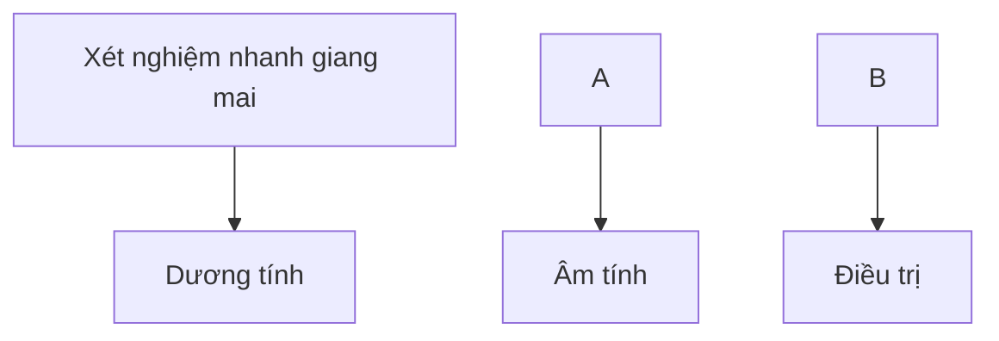

**Sơ đồ 1.** Chiến lược A (xét nghiệm nhanh tại chỗ, nếu dương tính thì điều trị).

**2) Chiến lược B:** **Xét nghiệm RPR tại chỗ, nếu dương tính thì điều trị**

- Áp dụng: tuyến huyện.

- Nếu kết quả RPR dương tính thì có thể điều trị luôn trong cùng 1 ngày.

- Nếu kết quả RPR âm tính, có thể làm lại xét nghiệm sau 1 tháng để tránh bỏ sót trường hợp âm tính giả trong giang mai sớm.

- Chủ yếu áp dụng điều trị cho phụ nữ mang thai để dự phòng lây truyền giang mai từ mẹ sang con.


280

- Cần máy lắc, máy li tâm, tủ lạnh bảo quản sinh phẩm, nguồn điện để vận hành các máy móc.

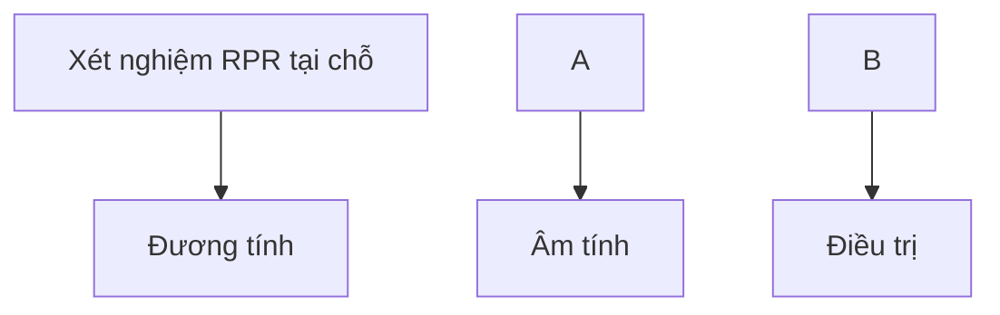

Sơ đồ 2. Chiến lược B (xét nghiệm RPR tại chỗ, nếu dương tính thì điều trị).

**3) Chiến lược C:** Xét nghiệm nhanh (đặc hiệu) tại chỗ, nếu dương tính thì điều trị liệu đầu tiên và làm xét nghiệm RPR theo sơ đồ dưới đây.

- Áp dụng: tuyển huyện hoặc tuyển tỉnh.

- Xét nghiệm nhanh (đặc hiệu), nếu âm tính thì xem như không mắc bệnh, không cần điều trị.

- Nếu xét nghiệm nhanh dương tính, cần điều trị ngay mũi benzathin penicillin đầu tiên. Sau đó tiến hành xét nghiệm RPR. Nếu RPR dương tính, bệnh nhân sẽ được tiếp tục điều trị theo phác đồ (tùy theo giai đoạn bệnh). Nếu RPR âm tính, cần làm lại xét nghiệm sau khoảng 1 tháng để tránh bỏ sót trường hợp âm tính giả.


281

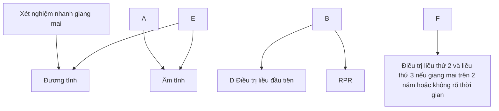

**Sơ đồ 3.** Chiến lược C (xét nghiệm nhanh (đặc hiệu) tại chỗ, nếu dương tính thì điều trị liều đầu tiên và làm xét nghiệm RPR).

**4) Chiến lược D:** Chiến lược xét nghiệm chuẩn ở phòng xét nghiệm chuyên biệt
- Áp dụng: tuyến tính hoặc tuyến trung ương.
- Xét nghiệm RPR hoặc VDRL ở phòng xét nghiệm, nếu dương tính làm xét nghiệm TPPA hoặc TPHA (cùng một mẫu bệnh phẩm máu).
- Quyết định điều trị khi chẩn đoán giang mai theo sơ đồ dưới đây.


282

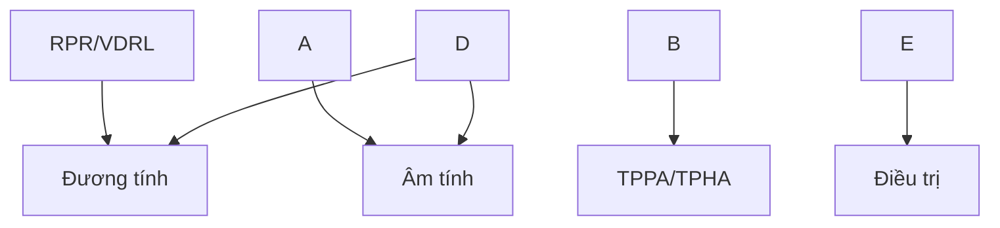

**Sơ đồ 4. Chiến lược D (xét nghiệm chuẩn ở phòng xét nghiệm chuyên biệt).**


283

# **VIÊM ÂM ĐẠO DO TRÙNG ROI**
*(Trichomoniasis)*

## **1. ĐẠI CƯƠNG**

### **1.1. Khái niệm**

Viêm âm đạo do trùng roi là bệnh nhiễm trùng đường tình dục do kí sinh trùng có tên khoa học là *Trichomonas* gây nên.

### **1.2. Dịch tễ**

Hàng năm trên thế giới có khoảng 180 triệu trường hợp mới nhiễm trùng roi, chủ yếu ở các nước đang phát triển như châu Phi và Đông Nam Á.

### **1.3. Căn nguyên/ Cơ chế bệnh sinh**

- Tác nhân gây bệnh: Có trên 100 loài trùng roi, trong đó có 3 loài có thể gây bệnh ở người nhưng chỉ có *Trichomonas vaginalis* gây viêm âm đạo.

- Cách lây truyền: Bệnh lây chủ yếu qua quan hệ tình dục. Ngoài ra bệnh có thể lây do tiếp xúc với nguồn nước nhiễm *T. vaginalis*.

## **2. CHẨN ĐOÁN**

### **2.1. Triệu chứng lâm sàng**

- Âm đạo là nơi bị nhiễm nhiều nhất, sau đó đến niệu đạo, các tuyến Bartholin và Skène, cổ tử cung.

- Thời gian ủ bệnh từ 1- 4 tuần. Nhiễm trùng roi sinh dục nữ có thể từ không triệu chứng đến viêm âm đạo nặng. Khoảng 1/4 trường hợp không có biểu hiện lâm sàng.

- Triệu chứng thường gặp nhất là khí hư âm đạo. Dịch tiết nhiều, loãng, có bọt, màu vàng xanh, mùi hôi.

- Có thể kèm theo ngứa âm hộ, đi tiểu khó, đau bụng dưới và đau khi giao hợp.

- Khám: âm hộ - âm đạo viêm đỏ, phù nề. Cổ tử cung viêm đỏ có thể có xuất huyết điểm giống hình ảnh "quả dâu tây". Cùng độ có nhiều khí hư màu vàng xanh loãng và có bọt.

- Các biến chứng: viêm tiểu khung, vỡ ối sớm, đẻ non.

### **2.2. Cận lâm sàng**

- Soi tươi dịch âm đạo: có thể thấy hình thể điển hình của trùng roi có hình hạt chanh đang di động.

- Nuôi cấy

- Test nhanh

- PCR


284

**2.3. Chẩn đoán xác định**

Dựa vào:
- Lâm sàng
- Cận lâm sàng

**2.4. Chẩn đoán phân biệt**
- Viêm âm đạo do nấm *Candida*
- Bệnh âm đạo do vi khuẩn (bacterial vaginosis-BV)
- Viêm âm đạo do lậu cầu và/hoặc *Chlamydia trachomatis*

**3. ĐIỀU TRỊ**

**3.1. Nguyên tắc điều trị**
- Điều trị cho cả bạn tình.
- Kiêng quan hệ tình dục trong quá trình điều trị và đến khi hết triệu chứng lâm sàng.

**3.2. Điều trị cụ thể**
- Đối với người bệnh: Metronidazol 500mg uống 2 lần/ngày trong 7 ngày.
- Đối với bạn tình: Metronidazol 2g liều duy nhất.
- Không uống rượu bia cho đến 24 giờ sau khi ngừng điều trị.
- Phác đồ thay thế: Tinidazol 2g uống liều duy nhất (không dùng cho phụ nữ có thai).
- Trường hợp điều trị thất bại: sử dụng metronidazol 2g hoặc tinidazol 2g 1 lần/ngày trong 7 ngày.
- Theo dõi: Xét nghiệm kiểm tra lại sau điều trị 3 tháng.
- Chú ý: Phụ nữ nhiễm trùng roi không triệu chứng lâm sàng vẫn được điều trị theo phác đồ như có triệu chứng.

**4. PHÒNG BỆNH**
- Quan hệ tình dục an toàn.
- Vệ sinh cá nhân.


285

# **BỆNH LẬU**

**(Gonorrhea)**

## **1. ĐẠI CƯƠNG**

Bệnh lậu là một trong những bệnh lây truyền qua đường tình dục hay gặp, do song cầu khuẩn Gram âm *Neisseria gonorrhoeae* gây ra.

Bệnh lây truyền chủ yếu qua quan hệ tình dục đường âm đạo, đường miệng và đường hậu môn. Ở nam giới, nhiễm lậu cầu thường gây ra viêm niệu đạo, nếu không được điều trị có thể dẫn đến viêm mào tinh hoàn, hẹp niệu đạo và vô sinh. Ở nữ giới, nhiễm lậu cầu nếu không điều trị có thể dẫn đến viêm tiểu khung, tắc vòi trứng, chữa ngoài tử cung và vô sinh. Trẻ sơ sinh có mẹ bị bệnh lậu có thể bị lây nhiễm trong quá trình chuyển dạ, dẫn đến viêm kết mạc mắt.

Theo ước tính của Tổ chức Y tế thế giới (WHO), trong năm 2020, thế giới có khoảng 82,4 triệu trường hợp lậu mới mắc, trong đó khu vực Tây Thái Bình Dương có 23,2 triệu ca. Đồng nhiễm *Chlamydia trachomatis* được phát hiện ở 10–40% số người mắc bệnh lậu.

## **2. CHẨN ĐOÁN BỆNH LẬU**

### **2.1. Triệu chứng lâm sàng**

Thời gian ủ bệnh ở nam giới trung bình từ 3-5 ngày. Ở nữ giới thời gian ủ bệnh thường kéo dài hơn, trung bình 5-7 ngày. Thời gian này người bệnh không có triệu chứng nhưng vẫn có khả năng lây lan cho người khác.

#### **2.1.1. Nhiễm lậu cầu không biến chứng**

- Nam giới: thường có biểu hiện tiết dịch niệu đạo và tiểu buốt. Khám thấy dịch tiết niệu đạo có thể ít hoặc nhiều, nhầy hoặc mủ.

- Nữ giới: thường không có triệu chứng cơ năng, dưới 50% bệnh nhân có tiết dịch âm đạo bất thường, tiểu buốt, đau vùng bụng dưới và đau khi quan hệ tình dục. Khám thấy dịch âm đạo và viêm cổ tử cung, có thể có mủ. Phần lớn bệnh nhân không có triệu chứng rõ ràng nên không được phát hiện và điều trị.

- Lậu trực tràng: phần lớn không có triệu chứng ở cả hai giới; đôi khi có đau hoặc tiết dịch ở hậu môn, trực tràng.

- Lậu hậu họng: chủ yếu không có triệu chứng, có thể đau họng nhẹ và viêm họng.

#### **2.2.2. Nhiễm lậu cầu có biến chứng**

- Ở nam giới, nhiễm lậu cầu không được điều trị có thể dẫn đến viêm mào tinh hoàn, hẹp niệu đạo và vô sinh. Nguy cơ biến chứng tăng lên khi bị tái nhiễm nhiều lần.


286

- Ở nữ giới, nhiễm lậu cầu không được điều trị có thể dẫn đến các biến chứng nghiêm trọng như viêm tiểu khung, viêm nội mạc tử cung, viêm vòi trứng và áp xe vòi trứng, chữa ngoài tử cung và vô sinh.

- Ở trẻ sơ sinh, viêm kết mạc mắt do lậu có biểu hiện chảy mủ ở mắt và sung mí mắt, nếu không được điều trị có thể dẫn đến loét, sẹo giác mạc và mù.

## 2.2. Cận lâm sàng

### 2.2.1. Nhuộm Gram

- Nhuộm Gram thấy song cầu Gram âm hình hạt cà phê nằm trong và ngoài bạch cầu đa nhân trung tính.

- Là xét nghiệm dễ làm, ít tốn kém và có giá trị giúp chẩn đoán sơ bộ bệnh lậu, đặc biệt là ở bệnh nhân nam có triệu chứng. Tuy nhiên, chỉ 50–70% trường hợp lậu không triệu chứng ở nam giới là dương tính với nhuộm Gram, do đó nhuộm Gram âm tính không đủ để loại trừ bệnh.

- Xét nghiệm nhuộm Gram ít tin cậy hơn đối với bệnh phẩm cổ tử cung và trực tràng do độ nhạy thấp (độ nhạy khi soi bệnh phẩm cổ tử cung là 30-50%).

### 2.2.2. Nuôi cấy

- Nuôi cấy phân lập lậu cầu trên môi trường Thayer-Martin chứa vancomycin là tiêu chuẩn vàng trong chẩn đoán bệnh (độ nhạy đối với lậu niệu đạo và cổ tử cung là 85–95%), đồng thời xác định được sự nhạy cảm của vi khuẩn lậu với kháng sinh qua kháng sinh đồ.

- Việc phân lập *N. gonorrhoeae* một cách tối ưu đòi hỏi phải lấy bệnh phẩm tốt, cấy kịp thời vào môi trường nuôi cấy thích hợp, vận chuyển đúng cách và ủ trong môi trường thích hợp.

- Vị trí lấy bệnh phẩm có tỷ lệ dương tính cao nhất ở nam giới là niệu đạo, ở nữ giới là cổ tử cung.

### 2.2.3. Xét nghiệm khuếch đại axit nucleic (Nucleic acid amplification tests - NAATs)

- Xét nghiệm khuếch đại axit nucleic (hay còn gọi là xét nghiệm khuếch đại gen, trong đó có xét nghiệm PCR) để phát hiện axit nucleic của vi khuẩn lậu.

- Độ đặc hiệu và độ nhạy cao (độ nhạy trên 90%), cao hơn so với nuôi cấy, có thể sử dụng nhiều loại bệnh phẩm như nước tiểu, dịch âm đạo, cổ tử cung và dịch niệu đạo. Các kỹ thuật NAATs khác nhau có độ nhạy khác nhau, bệnh phẩm trực tràng và hầu họng thường có độ nhạy thấp.

- Xét nghiệm NAATs phổ biến nhất hiện nay là Real time PCR đa mồi, thường kết hợp chẩn đoán cùng lúc hai bệnh lậu và Chlamydia.


287

- Hạn chế: không cung cấp được thông tin về tính nhạy cảm của vi khuẩn với kháng sinh.

## 2.3. Chẩn đoán bệnh lậu

### 2.3.1. Chẩn đoán xác định

- **Lâm sàng:**
  + Tiết dịch hoặc mù ở niệu đạo/âm đạo, kèm tiểu buốt
  + Có tiền sử quan hệ tình dục không an toàn.

- **Xét nghiệm:**
  + Nhuộm Gram (bệnh phẩm dịch niệu đạo hoặc cổ tử cung) thấy song cầu Gram âm nằm trong và ngoài bạch cầu đa nhân trung tính. Nếu nhuộm Gram âm tính cần thêm ít nhất một trong hai xét nghiệm nuôi cấy hoặc xét nghiệm huyết học đại axit nucleic để khẳng định chẩn đoán.
    + Nuôi cấy: tiêu chuẩn vàng để chẩn đoán lậu.
    + Xét nghiệm huyết học đại axit nucleic.
  - Tại cơ sở không có đủ điều kiện xét nghiệm, chẩn đoán và điều trị có thể dựa vào lâm sàng. Tại cơ sở có điều kiện, chẩn đoán dựa vào lâm sàng và các xét nghiệm.

## 2.3.2. Chẩn đoán phân biệt

- **Lậu sinh dục:**
  + Nhiễm *Chlamydia trachomatis*
  + Trùng roi âm đạo (*Trichomonas vaginalis*)
  + Nấm *Candida* âm hộ - âm đạo
  + Viêm niệu đạo-sinh dục do *Ureaplasma, Mycoplasma*.
  + Viêm niệu đạo, âm đạo do các căn nguyên khác: nhiễm khuẩn (*E. coli, liên cầu nhóm A, Proteus,...*) hoặc không do nhiễm khuẩn (chấn thương, viêm da tiếp xúc kích ứng, các bệnh viêm hệ thống như Behcet,...).

- **Lậu hậu môn trực tràng:** chẩn đoán phân biệt với viêm trực tràng do các nguyên nhân khác như *Chlamydia trachomatis, Herpes simplex, nấm...* và các viêm trực tràng hậu môn không do nhiễm trùng.

- **Lậu hậu họng:** chẩn đoán phân biệt với viêm họng do nguyên nhân khác như liên cầu nhóm A, *Mycoplasma, Chlamydia trachomatis, viêm họng do vi rút...*

- **Viêm kết mạc mắt do lậu ở trẻ sơ sinh:** chẩn đoán phân biệt với viêm kết mạc sơ sinh do nguyên nhân khác như tụ cầu, phế cầu, *Haemophilus influenzae...*


288

# 3. **ĐIỀU TRỊ BỆNH LẬU**

## 3.1. **Nguyên tắc điều trị**

- Điều trị sớm.
- Điều trị đúng phác đồ.
- Điều trị đồng nhiễm Chlamydia.
- Điều trị cả bạn tình. Tất cả bạn tình có quan hệ tình dục với bệnh nhân trong vòng 60 ngày cần được khám và điều trị. Nếu lần quan hệ tình dục gần nhất trên 60 ngày thì điều trị bạn tình của lần quan hệ gần nhất.
- Không quan hệ tình dục, không làm thủ thuật tiết niệu trong thời gian điều trị và trong vòng 7 ngày sau khi kết thúc điều trị.
- Xét nghiệm huyết thanh giang mai và HIV trước và sau khi điều trị.
- Chủ yếu điều trị ngoại trú, chỉ điều trị nội trú trong trường hợp có biến chứng.

## 3.2. **Điều trị cụ thể**

Các khuyến cáo dưới đây áp dụng cho người lớn, trẻ vị thành niên (10-19 tuổi), người nhiễm HIV và các <u>quần thể nguy cơ cao</u> (phụ nữ mại dâm, nam quan hệ tình dục đồng giới, người chuyển giới). Ngoài ra, hướng dẫn này bao gồm cả phác đồ điều trị và dự phòng lậu mắt ở trẻ sơ sinh.

### 3.2.1. **Nhiễm lậu sinh dục và hậu môn trực tràng**

- Tốt nhất là dựa vào kháng sinh đồ.
- Nếu không có kháng sinh đồ, chọn một trong các phác đồ sau:
  + Ceftriaxon 250 mg, tiêm bắp, liều duy nhất
  + Spectinomycin 2 g, tiêm bắp liều duy nhất
  + Cefixim 400 mg, uống liều duy nhất
- Kết hợp azithromycin 1g uống liều duy nhất để điều trị đồng nhiễm Chlamydia.
- Phác đồ này được áp dụng cho cả phụ nữ mang thai, nhưng cần được theo dõi chặt chẽ.

### 3.2.2. **Nhiễm lậu hậu họng**

- Tốt nhất là dựa vào kháng sinh đồ.
- Nếu không có kháng sinh đồ, chọn một trong các phác đồ sau:
  + Ceftriaxon 250 mg, tiêm bắp, liều duy nhất
  + Cefixim 400 mg, uống liều duy nhất.


289

- Kết hợp azithromycin 1g uống liều duy nhất để điều trị đồng nhiễm Chlamydia.

- Phác đồ này được áp dụng cho cả phụ nữ mang thai, nhưng cần được theo dõi chặt chẽ.

**3.2.3. Thất bại điều trị**

- Cần phân biệt thất bại điều trị với tái nhiễm. Xác định thất bại điều trị khi có một trong các tiêu chuẩn sau:

  + Không giảm triệu chứng sau 3-5 ngày điều trị mặc dù không quan hệ tình dục.

  + Nuôi cấy dương tính sau ≥ 3 ngày điều trị hoặc PCR dương tính sau ≥ 7 ngày điều trị mặc dù không quan hệ tình dục.

  + Nuôi cấy dương tính và có giảm nhạy cảm các kháng sinh cephalosporin trên kháng sinh đồ, bất kể có quan hệ tình dục lại hay không.

  - Khi xác định thất bại điều trị, sử dụng phác đồ sau:

    + Nếu đã được điều trị theo phác đồ được quy định trong hướng dẫn này (*mục 3.2.1 và 3.2.2*) thì chọn một trong các phác đồ sau:

      - Ceftriaxon 500 mg, tiêm bắp liều duy nhất và azithromycin 2 g, uống liều duy nhất

      - Cefixim 800 mg, uống liều duy nhất và azithromycin 2 g, uống liều duy nhất

      - Gentamicin 240 mg, tiêm bắp liều duy nhất và azithromycin 2 g, uống liều duy nhất

      - Spectinomycin 2 g, tiêm bắp liều duy nhất (nếu không phải là nhiễm trùng hậu họng) và azithromycin 2 g, uống liều duy nhất.

      + Nếu đã điều trị nhưng không theo phác đồ được quy định trong hướng dẫn này (*mục 3.2.1 và 3.2.2*) thì điều trị lại theo hướng dẫn tại *mục 3.2.1 và 3.2.2*

      + Nếu thất bại điều trị và có kháng sinh đồ, điều trị lại dựa vào kết quả kháng sinh đồ.

    - Nếu nghi ngờ tái nhiễm, điều trị lại theo mục 3.2.1, 3.2.2 và điều trị cho bạn tình.

**3.2.4. Lậu mắt ở trẻ sơ sinh**

- Điều trị viêm kết mạc mắt do lậu cầu ở trẻ sơ sinh, lựa chọn một trong các phác đồ sau:

  + Ceftriaxon 50 mg/kg (tối đa 150 mg), tiêm bắp liều duy nhất

  + Kanamycin 25 mg/kg (tối đa 75 mg), tiêm bắp liều duy nhất


290

+ Spectinomycin 25 mg/kg (tối đa 75 mg), tiêm bắp liều duy nhất.

Chú ý theo dõi các tác dụng không mong muốn của thuốc.

- Điều trị dự phòng viêm kết mạc mắt do lậu và Chlamydia cho tất cả trẻ sơ sinh ngay sau sinh và cho cả hai mắt.

Lựa chọn một trong các phác đồ sau:

+ Mỡ tra mắt tetracyclin hydrochlorid 1%

+ Mỡ tra mắt erythromycin 0,5%

+ Dung dịch povidon iod 2,5% (dung môi nước)

+ Dung dịch bạc nitrat 1%

+ Mỡ chloramphenicol 1%

Lưu ý: Cần tránh chạm vào mắt trong khi tra thuốc. Không khuyến cáo sử dụng dung dịch povidon iod dung môi còn.

**4. PHÒNG BỆNH**

- Truyền thông, giáo dục cho cộng đồng đặc biệt là các quần thể có nguy cơ cao mắc các bệnh lây truyền qua đường tình dục về nguyên nhân, đường lây truyền, các biến chứng hay gặp và cách phòng bệnh.

- Tập huấn chuyên môn cho các bác sĩ đa khoa, chuyên khoa da liễu và sản phụ khoa để hạn chế tối đa lậu có biến chứng.

- Thực hành tình dục an toàn.

- Khám sàng lọc định kỳ các nhiễm trùng lây truyền qua đường tình dục cho các quần thể có nguy cơ cao.


291

# **NHIỄM HERPES SIMPLEX SINH DỤC**

**(Genital herpes simplex)**

## **1. ĐẠI CƯƠNG**

Nhiễm herpes simplex sinh dục là một trong những bệnh lây truyền qua đường tình dục phổ biến, diễn biến mạn tính, có các đợt tái phát tại vị trí nhiễm trùng. Người nhiễm vi rút có thể có triệu chứng hoặc không và ngay cả khi không có triệu chứng vẫn có thể lây cho bạn tình. Bệnh lây truyền qua quan hệ tình dục đường âm đạo, hậu môn hoặc miệng, có thể lây cho trẻ sơ sinh khi mẹ bị bệnh.

Nguyên nhân gây bệnh do vi rút Herpes simplex (Herpes simplex virus - HSV) gây ra. HSV có 2 type là HSV-1 và HSV-2. Herpes sinh dục chủ yếu do HSV-2. Tuy nhiên, HSV-1 hiện nay đang có xu hướng tăng do quan hệ miệng -sinh dục. Nhiễm HSV là tình trạng mạn tính suốt đời, có thể có các đợt tái phát. Hầu hết các trường hợp nhiễm HSV không có triệu chứng hoặc triệu chứng không điển hình, do đó phần lớn người nhiễm HSV-2 không được chẩn đoán.

Bệnh thường gặp ở người trẻ, trong độ tuổi hoạt động tình dục, đặc biệt các đối tượng có hành vi tình dục nguy cơ cao. Theo ước tính của Tổ chức Y tế thế giới năm 2016, có khoảng 491,5 triệu người nhiễm HSV-2 trong độ tuổi từ 15 đến 49 trên toàn cầu, trong đó nữ giới mắc nhiều hơn nam giới.

Herpes simplex sinh dục có thể gây ra các biến chứng ngoài sinh dục như viêm rễ thần kinh, viêm màng não vô khuẩn, bí tiểu, viêm niêm mạc trực tràng (đặc biệt ở đối tượng nam quan hệ đồng giới).

Trẻ sơ sinh bị nhiễm HSV, mặc dù hiếm gặp nhưng vẫn có tỷ lệ tàn tật nặng và tử vong.

Người nhiễm HSV-2 có nguy cơ mắc HIV cao gấp 3 lần. Người đồng nhiễm HIV và HSV-2 có thể tăng nguy cơ lây HIV cho người khác. Nhiễm HSV-2 trên người HIV có thể gây các biến chứng nghiêm trọng như nhiễm trùng mắt, não, phổi.

## **2. CHẨN ĐOÁN**

### **2.1. Triệu chứng lâm sàng**

Người bệnh mắc bệnh lần đầu tiên được gọi là nhiễm HSV sinh dục tiên phát. Tuy cách lây truyền HSV-1, HSV-2 khác nhau và gây bệnh ở những vị trí khác nhau nhưng biểu hiện lâm sàng của nhiễm HSV-1 và HSV-2 sinh dục thường khó phân biệt về mặt lâm sàng mà chỉ có thể phân biệt bằng xét nghiệm.

Hầu hết bệnh nhân nhiễm HSV-2 sinh dục tiên phát có triệu chứng sau đó sẽ bị những đợt tái phát. Nhiễm HSV-1 sinh dục thường ít tái phát hơn. Triệu chứng của các đợt tái phát thường nhẹ hơn đợt tiên phát.


292

Sau đợt nhiễm HSV-2 tiên phát, thường xuất hiện những đợt thái vi rút từ các tổn thương sinh dục mặc dù không có triệu chứng lâm sàng. Vì vậy HSV-2 thường lây truyền từ những người không biết mình bị nhiễm hoặc những người không có triệu chứng ở thời điểm quan hệ tình dục.

**2.1.1. Nhiễm HSV sinh dục tiên phát**

- Thời gian ủ bệnh khoảng 4-7 ngày.

- Tổn thương là các mụn nước trên nền dát đỏ, tập trung thành đám ở bộ phận sinh dục ngoài, quanh hậu môn, mông. Các mụn nước tiến triển thành mụn mủ, vết trợt bờ đa cung, đóng vảy tiết và lành không để lại sẹo trong vòng 2-3 tuần. Tổn thương tại niêm mạc có thể trợt, loét mà không có biểu hiện mụn nước trước đó.

- Tổn thương không điển hình của nhiễm HSV-2 sinh dục có thể gặp như vết loét, vết nứt nhỏ, khó tiêu, viêm niệu đạo mà không có tổn thương.

- Triệu chứng tại chỗ: đau, ngứa bộ phận sinh dục hoặc bí tiểu.

- Triệu chứng toàn thân: có thể sốt, nhức đầu, đau cơ, hạch bẹn sưng đau, viêm cổ tử cung.

**2.1.2. Nhiễm HSV sinh dục tái phát**

- Tiền triệu: đau, bỏng rát, dị cảm trước khi xuất hiện mụn nước.

- Lâm sàng: các tổn thương tái phát thường ít hơn, ở một bên và không đau nhiều như nhiễm HSV tiên phát, thường tự lành sau 5-10 ngày.

- Hầu như không có triệu chứng toàn thân.

- Ở những bệnh nhân suy giảm miễn dịch, bệnh nhân HIV, các đợt tái phát diễn ra thường xuyên hơn và có triệu chứng rầm rộ, ảnh hưởng nhiều đến thể chất và tinh thần.

**2.2. Cận lâm sàng**

Các phương pháp xét nghiệm chẩn đoán HSV-2 gồm phát hiện trực tiếp từ tổn thương và gián tiếp qua huyết thanh:

- Xét nghiệm huyết thanh: có thể áp dụng sàng lọc HSV-2 để phát hiện kháng thể đặc hiệu. Kháng thể đặc hiệu xuất hiện sau khi nhiễm vi rút vài tuần và tồn tại vĩnh viễn.

- Nuôi cấy vi rút: trước đây được coi là tiêu chuẩn vàng chẩn đoán HSV-2, nhưng độ nhạy không cao, đặc biệt ở các tổn thương bắt đầu lành và các đợt tái phát.

- Xét nghiệm khuếch đại axit nucleic (Nucleic Acid Amplification Test – NAATs, trong đó có xét nghiệm PCR với HSV-1 và HSV-2): so với nuôi cấy vi rút, xét nghiệm NAATs có độ nhạy cao hơn, bệnh phẩm dễ thu thập và vận chuyển, cho kết quả nhanh hơn nên ngày càng được ưu tiên hơn.


293

- Trong trường hợp không có các xét nghiệm trên, có thể làm xét nghiệm chẩn đoán tế bào Tzanck: nhuộm Giemsa hoặc Wright dịch mụn nước thấy tế bào gai lệch hình và tế bào đa nhân không lõ. Tuy nhiên, xét nghiệm này không đặc hiệu để chẩn đoán nhiễm herpes simplex sinh dục.

## **2.3. Chẩn đoán xác định**

- Chẩn đoán chủ yếu dựa vào lâm sàng: mụn nước tập trung thành đám trên nền dát đỏ, sau vài ngày vỡ để lại các vết trợt hình đa cung; ở niêm mạc, bán niêm mạc, da vùng sinh dục.

- Xét nghiệm: trong điều kiện không thực hiện được nuôi cấy vi rút, xét nghiệm khuếch đại gen (trong đó có PCR) được xem xét là xét nghiệm có giá trị cao trong chẩn đoán herpes simplex sinh dục.

- Trong trường hợp không làm được các xét nghiệm trên, có thể làm xét nghiệm tế bào Tzanck để hỗ trợ chẩn đoán.

## **2.4. Chẩn đoán phân biệt**

- Săng giang mai
- Hạ cam mềm
- Bệnh áp to
- Bệnh Behcet
- Nấm Candida
- Dị ứng thuốc...

## **3. ĐIỀU TRỊ**

### **3.1. Nguyên tắc điều trị**

Điều trị càng sớm càng tốt trong vòng 72 giờ sau khi xuất hiện tổn thương đối với nhiễm HSV tiên phát mà không cần chờ kết quả xét nghiệm. Thuốc kháng vi rút đường uống làm giảm thời gian và mức độ nặng của bệnh, giảm triệu chứng và khả năng phát tán vi rút. Tuy nhiên, sau 72 giờ vẫn nên

- Sử dụng thuốc kháng vi rút đường uống nếu bệnh nhân vẫn xuất hiện tổn thương mới và/hoặc triệu chứng đau đáng kể.

- Chủ yếu điều trị ngoại trú, chỉ điều trị nội trú trong trường hợp bệnh nặng (viêm loét sinh dục nặng, sưng đau nhiều...) hoặc có biến chứng (viêm rễ thần kinh, viêm màng não vô khuẩn, bí tiểu, viêm niêm mạc trực tràng...).

- Tư vấn điều trị cho bạn tình và phòng tránh nhiễm các bệnh lây truyền qua đường tình dục khác, trong đó có nhiễm HIV.

- Nếu có bội nhiễm, dùng kháng sinh phổ rộng.

- Nâng cao thể trạng.


294

## 3.2. Điều trị cụ thể

Lựa chọn một trong các phác đồ dưới đây, ưu tiên aciclovir do tương dương về hiệu quả và tối ưu chi phí điều trị.

|                                                                                                    | Vị thành niên, người trưởng thành và phụ nữ có thai                                                                                                                                                                                     | Người nhiễm HIV và suy giảm miễn dịch                                                                                                                                                             |
| -------------------------------------------------------------------------------------------------- | --------------------------------------------------------------------------------------------------------------------------------------------------------------------------------------------------------------------------------------- | ------------------------------------------------------------------------------------------------------------------------------------------------------------------------------------------------- |
| **Herpes sinh dục tiên phát**                                                                      | • aciclovir 400 mg uống 3 lần/ngày trong 10 ngày (liều chuẩn) • aciclovir 200 mg uống 5 lần/ngày trong 10 ngày • valaciclovir 500 mg uống 2 lần/ngày trong 10 ngày • famciclovir 250 mg uống 3 lần/ngày trong 10 ngày                   |                                                                                                                                                                                                   |
| **Herpes sinh dục tái phát**<br/>Điều trị nên được bắt đầu trong vòng 24h kể từ khi có triệu chứng | • aciclovir 400 mg uống 3 lần/ngày trong 5 ngày, hoặc 800 mg uống 2 lần/ngày trong 5 ngày, hoặc 800 mg uống 3 lần/ngày trong 2 ngày • valaciclovir 500 mg uống 2 lần/ngày trong 3 ngày • famciclovir 250 mg uống 2lần/ngày trong 5 ngày | • aciclovir 400 mg uống 3 lần/ngày trong 5 ngày • valaciclovir 500 mg uống 2 lần/ngày trong 5 ngày • famciclovir 500 mg uống 2 lần/ngày trong 5 ngày                                              |
| **Điều trị dự phòng**<br/>Cho bệnh nhân tái phát 4-6 đợt/năm hoặc hơn.                             | • aciclovir 400 mg uống 2 lần/ngày hàng ngày, trong 6-12 tháng • valaciclovir 500 mg uống 1 lần/ngày hàng ngày, trong 6-12 tháng • famciclovir 250 mg uống 2 lần/ngày hàng ngày, trong 6-12 tháng                                       | • aciclovir 400 mg uống 2 lần/ngày hàng ngày, trong 6-12 tháng • valaciclovir 500 mg uống 2 lần/ngày hàng ngày, trong 6-12 tháng • famciclovir 500 mg uống 2 lần/ngày hàng ngày, trong 6-12 tháng |


Phối hợp điều trị tại chỗ: rửa nước muối sinh lý, bôi tê tại chỗ như lidocain. Thuốc bôi aciclovir hiệu quả kém.

## 4. PHÒNG BỆNH

- Đây là bệnh lây truyền qua đường tình dục, phải thực hiện các biện pháp phòng tránh như các bệnh lây truyền qua đường tình dục khác.

- Bao ca su có hiệu quả phòng tránh lây truyền bệnh nhưng không đạt được


295

hiệu quả 100%.

- Người nhiễm HSV có nguy cơ rất cao lây truyền HIV nên bệnh herpes simplex sinh dục cần được quan tâm trong phòng chống bệnh lây truyền qua đường tình dục và HIV/AIDS.


296

# **BỆNH DO CHLAMYDIA TRACHOMATIS**

*(Chlamydia trachomatis)*

## 1. **ĐẠI CƯƠNG**

Nhiễm Chlamydia sinh dục – tiết niệu là một trong những nhiễm khuẩn lây truyền qua đường tình dục hay gặp nhất. Theo ước tính của Tổ chức y tế thế giới, trong năm 2020, thế giới có khoảng 128,5 triệu người mắc bệnh.

Chlamydia trachomatis có 3 biến thể sinh học khác nhau, mỗi biến thể bao gồm nhiều kiểu gen, gây nên nhiễm khuẩn đường sinh dục – tiết niệu, bệnh hột xoài (lymphogranuloma venereum – LGV) và bệnh mắt hột.

Nhiễm Chlamydia sinh dục – tiết niệu nếu không được điều trị có thể gây ra một số biến chứng như viêm phần phụ ở nữ giới, viêm mào tinh hoàn ở nam giới và vô sinh ở cả hai giới. Nhiễm Chlamydia ở phụ nữ có thai có thể dẫn đến sinh non và/hoặc trẻ sinh ra thiếu cân. Trẻ sơ sinh có thể bị nhiễm Chlamydia từ mẹ trong quá trình chuyển dạ dẫn đến viêm kết mạc, viêm mũi họng, viêm phổi. Nguy cơ biến chứng tăng lên khi tái nhiễm nhiều lần.

## 2. **CHẨN ĐOÁN**

### 2.1. Triệu chứng lâm sàng

#### 2.1.1. **Nhiễm Chlamydia không biến chứng**

- Nhiễm Chlamydia sinh dục – tiết niệu: 70% ở nữ và 50% ở nam giới nhiễm Chlamydia sinh dục – tiết niệu không có biểu hiện lâm sàng. Các trường hợp có triệu chứng lâm sàng bao gồm:

  + Ở nữ giới: tiết dịch âm đạo bất thường; tiểu khó; chảy máu khi quan hệ tình dục; viêm, tiết dịch cổ tử cung.

  + Ở nam giới: tiết dịch niệu đạo, tiểu khó, đau tinh hoàn

  - Nhiễm Chlamydia ngoài sinh dục:

    + Trực tràng: phần lớn không có biểu hiện lâm sàng, một số trường hợp có tiết dịch, đau và có máu trong phân.

    + Hậu họng: hiếm khi có triệu chứng, có thể viêm họng, đau họng nhẹ.

#### 2.1.2. **Nhiễm Chlamydia có biến chứng**

- Ở nam giới: viêm mào tinh hoàn, viêm ống dẫn tinh, túi tinh và có thể dẫn đến vô sinh.

- Ở nữ giới: viêm tiểu khung, chữa ngoài tử cung, viêm vòi trứng, ống dẫn trứng và có thể dẫn đến vô sinh.


297

- Ở phụ nữ có thai: sinh non và/hoặc trẻ sinh ra thiếu cân.

- Ở trẻ sơ sinh: có thể bị nhiễm Chlamydia từ mẹ trong quá trình chuyển dạ dẫn đến viêm kết mạc (tiết dịch, sung mí mắt), viêm mũi họng, viêm phổi.

**2.1.3. Biểu hiện lâm sàng của bệnh hột xoài (lymphogranuloma venereum)**

- Do các biến thể L1-3 của *C. trachomatis* xâm nhập sâu hơn đến tổ chức dưới niêm mạc và hạch lân cận.

- Tổn thương thường gặp ở hạch bẹn hoặc hạch đùi một bên, hạch mềm và vết loét hoặc sần ở bộ phận sinh dục.

- Tổn thương ở hậu môn trực tràng có thể biểu hiện viêm hậu môn trực tràng, tiết dịch, đau, táo bón hoặc mót rặn. Nếu không được điều trị, có thể dẫn đến chít hẹp hoặc rò hậu môn.

**2.2. Cận lâm sàng**

- Nuôi cấy: là phương pháp có thể dùng để chẩn đoán nhiễm Chlamydia nhưng tính ứng dụng không cao vì đắt tiền và đòi hỏi kỹ thuật cao.

- Xét nghiệm khuếch đại axit nucleic (Nucleic acid amplification tests - NAATs)
  + Độ nhạy, độ đặc hiệu cao và có thể áp dụng với nhiều loại bệnh phẩm đường sinh dục - tiết niệu như âm hộ, âm đạo, cổ tử cung, niệu đạo và nước tiểu.
  + So với các phương pháp khác như nuôi cấy và phát hiện kháng nguyên, độ nhạy của xét nghiệm khuếch đại gen cao hơn, thu thập mẫu bệnh phẩm không xâm lấn và có thể áp dụng ở các tuyến cơ sở.
  + Một số xét nghiệm có thể thực hiện tại phòng xét nghiệm hoặc tại điểm khám bệnh (POC) như xét nghiệm kép Chlamydia – Lậu (*C. trachomatis/N. gonorrhoeae: CT/NG*) dựa trên nguyên lý NAATs cho kết quả nhanh trong vòng 90 phút, được FDA chấp thuận cho mẫu bệnh phẩm ở cổ tử cung, âm đạo, nước tiểu.

- Xét nghiệm phát hiện kháng nguyên: Xét nghiệm miễn dịch huỳnh quang trực tiếp (Direct immunofluorescence assays – DFAs); xét nghiệm miễn dịch gắn men (Enzyme linked immunosorbent assay – ELISA) tại phòng xét nghiệm hoặc tại điểm khám bệnh.

- Xét nghiệm khuếch đại gen và xét nghiệm phát hiện kháng nguyên được khuyến cáo do tính thuận tiện và có giá trị chẩn đoán cao.

**2.3. Chẩn đoán xác định**

- Chẩn đoán xác định nhiễm Chlamydia dựa vào xét nghiệm khuếch đại gen hoặc xét nghiệm phát hiện kháng nguyên.

- Trong trường hợp hạn chế về nguồn lực có thể chẩn đoán dựa vào xét nghiệm tại điểm (POC) như xét nghiệm kép Chlamydia – Lậu.

Lưu ý: Nếu không có điều kiện xét nghiệm, hướng tới chẩn đoán nhiễm


298

Chlamydia sinh dục – tiết niệu dựa vào các triệu chứng lâm sàng và các yếu tố dịch tễ (người trẻ tuổi, đối tượng nguy cơ cao...).

**2.4. Chẩn đoán phân biệt**

- Viêm đường sinh dục – tiết niệu do các tác nhân gây bệnh lây truyền qua đường tình dục khác, bao gồm *N. gonorrhoeae*, *Trichomonas vaginalis*, *Mycoplasma genitalium*; và các căn nguyên không lây truyền qua đường tình dục.

- Viêm cổ tử cung do các tác nhân khác: lậu, Herpes simplex, *Trichomonas vaginalis*, trực khuẩn lao, Mycoplasma, Ureaplasma, Cytomegalovirus và liên cầu khuẩn tan huyết beta nhóm B... Các tác nhân trên có thể gây bệnh độc lập hoặc phối hợp với nhau.

- Viêm hậu môn – trực tràng do các tác nhân lây truyền qua đường tình dục khác như lậu, Herpes simplex, giang mai; và các căn nguyên không lây truyền qua đường tình dục.

Đồng nhiễm lậu và *C. trachomatis* thường gặp trên lâm sàng, vì vậy nên tiến hành xét nghiệm lậu cho tất cả các bệnh nhân nhiễm Chlamydia.

**3. **ĐIỀU TRỊ****

**3.1. Nguyên tắc điều trị**

- Nhiễm Chlamydia có thể điều trị khỏi dễ dàng bằng kháng sinh. Nên điều trị sớm, đúng phác đồ, đủ liều để tránh biến chứng.

- Điều trị bạn tình để ngăn ngừa tái nhiễm và lây nhiễm cho người khác.

- Tránh quan hệ tình dục trong vòng 7 ngày sau khi bắt đầu điều trị, để tránh lây nhiễm cho bạn tình.

- Nếu các triệu chứng còn tiếp tục sau khi hoàn thành phác đồ điều trị, bệnh nhân nên tái khám để đánh giá lại.

**3.2. Điều trị cụ thể**

Hướng dẫn này bao gồm các phác đồ điều trị nhiễm Chlamydia không biến chứng cho người lớn, vị thành niên (10-19 tuổi), người nhiễm HIV, các quần thể đích (người mại dâm, nam có quan hệ đồng giới, người chuyển giới); điều trị và dự phòng viêm kết mạc do Chlamydia ở trẻ sơ sinh.

**3.2.1. **Nhiễm Chlamydia sinh dục - tiết niệu không biến chứng**

- Có thể lựa chọn một trong những phác đồ ưu tiên sau:

  + Azithromycin 1g, uống liều duy nhất.

  + Doxycyclin 100mg, uống 2 lần/ngày trong 7 ngày.

- Hoặc một trong các phác đồ thay thế sau:

  + Tetracyclin 500mg, uống 4 lần/ngày trong 7 ngày.

  + Erythromycin 500mg, uống 4 lần/ngày trong 7 ngày.


299

+ Ofloxacin 200-400mg, uống 2 lần/ngày trong 7 ngày.

Lưu ý: Không sử dụng doxycyclin, tetracyclin, ofloxacin cho phụ nữ mang thai.

**3.2.2. Nhiễm Chlamydia hậu môn - trực tràng**

- Lựa chọn phác đồ theo thứ tự ưu tiên:

  + Doxycyclin 100mg, uống 2 lần/ngày trong 7 ngày.

  + Azithromycin 1g, uống liều duy nhất.

- Áp dụng cho các trường hợp đã được chẩn đoán xác định nhiễm Chlamydia hậu môn – trực tràng và cả những trường hợp nghi ngờ nhiễm sinh dục và hậu môn - trực tràng (theo khai thác tiền sử quan hệ tình dục đường hậu môn).

**3.2.3. Nhiễm Chlamydia ở phụ nữ có thai**

Các thuốc được lựa chọn ưu tiên theo thứ tự: azithromycin, amoxicillin, erythromycin.

+ Azithromycin 1g, uống liều duy nhất.

+ Amoxicillin 500mg, uống 3 lần/ngày trong 7 ngày.

+ Erythromycin 500mg, uống 4 lần/ngày trong 7 ngày.

**3.2.4. Bệnh hột xoài (LGV)**

- Ở bệnh nhân vị thành niên và người trưởng thành mắc bệnh hột xoài, ưu tiên lựa chọn phác đồ theo thứ tự:

  + Doxycyclin 100mg uống 2 lần/ngày trong 21 ngày. Doxycyclin không dùng ở phụ nữ mang thai.

  + Azithromycin 1g uống 1 lần/tuần trong 3 tuần.

- Khi cả 2 loại trên đều không thể sử dụng thì thay thế bằng erythromycin 500mg, uống 4 lần/ngày trong 7 ngày.

**3.2.5. Viêm kết mạc ở trẻ sơ sinh**

- Lựa chọn phác đồ điều trị theo thứ tự ưu tiên:

  + Azithromycin uống 20mg/kg/ngày, 1 lần/ngày trong 3 ngày

  + Erythromycin uống 50mg/kg/ngày chia 4 lần/ngày trong 14 ngày.

  *Lưu ý:* Erythromycin có nguy cơ gây hẹp môn vị ở trẻ sơ sinh. Tuy nhiên ở một số cơ sở không có azithromycin dạng hỗn dịch, erythromycin có thể được cân nhắc sử dụng và cần phải theo dõi chặt chẽ.

- Dự phòng viêm kết mạc mắt do Chlamydia và lau cho tất cả trẻ sơ sinh. Lựa chọn một trong các phác đồ sau (cho cả 2 mắt, ngay sau khi sinh):

  + Mỡ tra mắt tetracyclin hydrochloride 1%

  + Mỡ tra mắt erythromycin 0.5%


300

- Dung dịch povidon iodine 2.5% (dung môi nước)
- Dung dịch bạc nitrate 1%
- Mỡ chloramphenicol 1%

**Lưu ý:** Lựa chọn thuốc tra mắt phụ thuộc vào giá thành và tình hình kháng thuốc erythromycin, tetracyclin và chloramphenicol tại địa phương. Cần tránh chạm vào mắt trong khi tra thuốc. Dung dịch povidon iod dung môi cồn không được khuyến cáo sử dụng.

**3.3. Theo dõi**

Nên khám lại sau 3 tháng cho tất cả các trường hợp, bất kể bệnh tình của họ đã được điều trị hay không. Nếu không thể khám lại sau 3 tháng, có thể kiểm tra lại bất kì thời điểm nào trong khoảng thời gian 3-12 tháng sau điều trị ban đầu.

**4. PHÒNG BỆNH**

- Truyền thông, giáo dục cho cộng đồng về nguyên nhân, đường lây, biến chứng và cách phòng bệnh.
- Tập huấn chuyên môn cho các bác sĩ đa khoa, chuyên khoa da liễu và sản phụ khoa để hạn chế tối đa nhiễm Chlamydia có biến chứng.
- Thực hành tình dục an toàn.
- Khám sàng lọc định kỳ các nhiễm trùng lây truyền qua đường tình dục cho quần thể đích.


301

# **BỆNH SÙI MÀO GÀ**
**(Genital warts)**

## **1. ĐẠI CƯƠNG**

- Sùi mào gà, hay còn gọi là bệnh mụn cóc ở hậu môn sinh dục, do vi rút Human papilloma (HPV) gây nên. Đây là bệnh lây truyền qua đường tình dục thường gặp với đặc trưng là các tổn thương dạng như lành tính ở cơ quan sinh dục, bẹn, mu, hậu môn, quanh hậu môn.

- Theo ước tính của Tổ chức Y tế thế giới (WHO), trong năm 2016, thế giới có khoảng 300 triệu phụ nữ nhiễm HPV. Tại Việt Nam, chưa có con số thống kê cụ thể.

- Sùi mào gà gây ra bởi nhiều tuýp HPV, trong đó thường gặp nhất là tuýp 6 và 11 (chiếm 90% số trường hợp). Một số tuýp HPV có nguy cơ gây loạn sản tế bào và ung thư như tuýp 16, 18, 31, 33, 35...

- HPV lây truyền chủ yếu qua quan hệ tình dục đường âm đạo, đường hậu môn hoặc đường miệng. Vi rút xâm nhập vào niêm mạc sinh dục qua các tổn thương nhỏ ở thượng bì và nằm ở lớp tế bào đáy. Tuy thời gian tồn tại ngoài môi trường ngắn nhưng HPV có thể lây truyền qua các vật dụng, dụng cụ y tế. HPV rất ít khi lây truyền từ mẹ sang con trong quá trình chuyển dạ, mặc dù hiếm gặp nó có thể gây ra u như đường hô hấp tái phát ở trẻ sơ sinh và trẻ nhỏ.

- Hầu hết người nhiễm HPV không có biểu hiện lâm sàng, tỉ lệ có triệu chứng chỉ khoảng 1-2%. Thời kì ủ bệnh thay đổi, trung bình là 2,9 tháng ở nữ và 11 tháng ở nam giới. Khả năng lây truyền HPV cho bạn tình cao và có thể xảy ra ngay cả khi không có tổn thương sùi mào gà. Các yếu tố thuận lợi cho nhiễm HPV là nhiều bạn tình và mắc các bệnh lây truyền qua đường tình dục khác.

## **2. CHẨN ĐOÁN**

### **2.1. Lâm sàng**

#### **2.2.1. Tổn thương cơ bản**

- Tổn thương điển hình là các sần nông, kích thước từ 1-10mm, có thể đơn độc hoặc nhiều. Các loại tổn thương khác có thể gặp là sần mịn hình vòm, màu da; sần giống súp lơ màu hồng hoặc màu da; sần tăng sừng có lớp vảy dày, giống như mụn cóc ở da hay dày sừng da đầu; sần loét hơi nhô lên trên vùng da xung quanh, màu hồng, phẳng, bề mặt nhẵn.

- Vị trí tổn thương: ở nam giới thường gặp ở dương vật, rãnh quy đầu, dây hãm dương vật, mặt trong bao quy đầu, bìu; ở nữ giới thường gặp ở âm hộ, môi bé, môi lớn, âm vật, lỗ niệu đạo, âm đạo và cổ tử cung. Ngoài ra, tổn thương sùi mào gà có thể thấy ở bẹn, vùng dây chậu và hậu môn. Tổn thương ở hậu môn có thể gặp ở cả hai giới và ngay cả khi không có tiền sử quan hệ đường hậu môn. Tổn thương sùi


302

mào gà ống hậu môn hay gặp hơn ở nam có quan hệ đồng giới. Sùi mào gà còn có thể thấy ở môi, họng, vòm họng kèm theo các tổn thương vùng sinh dục-hậu môn trên người có tiền sử quan hệ tình dục đường miệng.

- Ở phụ nữ có thai và người có suy giảm miễn dịch, tổn thương thường phát triển nhanh, kích thước lớn và số lượng nhiều.

- Theo diễn biến tự nhiên, sùi mào gà có thể thoái triển, không thay đổi hoặc tăng dần kích thước và số lượng.

**2.2.2. Triệu chứng khác**

- Thường không có triệu chứng cơ năng, hiếm khi ngứa, bỏng rát, đau.

- Nữ giới bị sùi mào gà xuất hiện triệu chứng ra khí hư có thể viêm âm đạo kèm theo. Nam giới có sùi ở miệng sáo, niệu đạo có thể tiểu ra máu tươi cuối dòng và có bất thường dòng nước tiểu.

- Có thể kèm theo triệu chứng của các bệnh lây truyền qua đường tình dục khác.

**2.1.3. Các lưu ý khi khám lâm sàng**

- Sùi mào gà có thể có nhiều tổn thương và ở nhiều vị trí khác nhau nên khi khám phải rất cẩn thận và tỉ mỉ, khám toàn bộ vùng sinh dục, hậu môn.

- Đối với cả hai giới cần kiểm tra cẩn thận sinh dục ngoài bằng nguồn sáng mạnh, sử dụng kính lúp để phát hiện các tổn thương nhỏ.

- Đối với nữ đã quan hệ tình dục đường âm đạo, cần khám bằng mỏ vịt để phát hiện tổn thương sùi trong âm đạo, cổ tử cung. Soi cổ tử cung được chỉ định khi có tổn thương sùi ở cổ tử cung, để phát hiện các tổn thương dạng sần đét.

- Đối với nam giới, để khám miệng sáo chỉ cần dùng tăm bông mở hai mép miệng sáo ra nhưng muốn khám kỹ hố thuyền cần sử dụng panh nhỏ hoặc soi niệu đạo. Thông thường, niệu đạo không bị tổn thương nếu không thấy có sùi mào gà ở miệng sáo.

- Chỉ định soi hậu môn đối với người có tiền sử quan hệ tình dục qua đường hậu môn hoặc người có sùi mào gà vùng quanh hậu môn tái phát nhiều lần.

- Đối với các trường hợp nghi ngờ, có thể sử dụng test axít axetic 5% bôi vào tổn thương, sau vài phút tổn thương có màu xám trắng. Kết quả của test này không đặc hiệu mà chỉ hỗ trợ cho việc chọn tổn thương khi sinh thiết hoặc loại bỏ tổn thương.

**2.1.4. Biến chứng**

- Ảnh hưởng đến sức khỏe tâm thần: mệt mỏi, lo lắng, sợ hãi, mất tự tin.

- Tiền ung thư và ung thư: sùi mào gà là những tổn thương lành tính. Tuy nhiên, các tổn thương tiền ung thư hoặc ung thư có thể cùng tồn tại hoặc phát triển cùng các tổn thương sùi mào gà và có thể chẩn đoán nhầm là sùi mào gà. Các dấu


303

hiệu của tổn thương ác tính gồm có dễ chảy máu, loét, xâm lấn. Trong những trường hợp này, cần sinh thiết để khẳng định chẩn đoán.

- Sẩn dạng Bowen là một tổn thương tân sản biểu mô ở hậu môn sinh dục, do các tuýp HPV nguy cơ cao gây ra.

- Sùi mào gà không lồ (u Buschke-Lowenstein) rất hiếm gặp và được xem là một dạng của ung thư biểu mô tế bào vảy dạng nhú do HPV 6 và 11 gây nên. Bệnh có đặc điểm là xâm lấn xuống dưới trung bì. Tổ chức bệnh học có những vùng tổ chức dạng nhú lành tính xen kẽ với các ổ tế bào thượng bì bất thường hoặc các tế bào biệt hoá ung thư tế bào vảy (SCC). Chẩn đoán u Buschke-Lowenstein cần phải sinh thiết nhiều vị trí, chụp cắt lớp vi tính hoặc cộng hưởng từ.

**2.2. Cận lâm sàng**

- Mô bệnh học: Cần sinh thiết khi tổn thương không điển hình hoặc nghi ngờ ung thư; tổn thương không đáp ứng hoặc nặng lên sau điều trị. Hình ảnh trên mô bệnh học đặc trưng của sùi mào gà là tăng sinh nhú, tăng sinh sừng; thoái hóa dạng hốc sáng koilocytosis (tế bào không bào nhân lớn, không đều).

- Xét nghiệm HPV PCR: không được khuyến cáo để chẩn đoán xác định, theo dõi hay thay đổi phác đồ điều trị. Xét nghiệm nhằm mục đích xác định tình trạng nhiễm các tuýp HPV nguy cơ cao để theo dõi nguy cơ ung thư.

- Xét nghiệm các bệnh lây truyền qua đường tình dục khác, bao gồm cả HIV.

**2.3. Chẩn đoán xác định**

Chẩn đoán sùi mào gà chủ yếu dựa vào lâm sàng và tiền sử quan hệ tình dục. Đối với những tổn thương không điển hình (tăng sắc tố, xâm lấn, loét, dễ chảy máu) có thể cần các xét nghiệm cận lâm sàng khác để chẩn đoán.

**2.4. Chẩn đoán phân biệt**

- Các tổn thương sần cần phân biệt với u mềm treo, sần ngọc quy đầu, các u tuyến bã (tuyến Tyson), nốt ruồi, u mềm lây, bệnh Crohn, dày sừng da đầu, lichen phẳng, lichen dạng chàm (lichen nitidus), sùi sùi giang mai (condylomata lata).

- Các tổn thương sần đẹt cần phân biệt với vây nến, viêm da đầu, hội chứng Reiter, bệnh Bowen, hồng sần Queyrat ở qui đầu và ung thư tế bào vảy.

**3. ĐIỀU TRỊ**

**3.1. Mục đích và nguyên tắc điều trị**

- Mục đích điều trị là loại bỏ tổn thương, không phải là tiêu diệt vi rút.

- Lựa chọn phương pháp điều trị dựa vào tuổi bệnh nhân, vị trí, số lượng, kích thước tổn thương, chi phí và khả năng chuyên môn cũng như trang thiết bị của cơ sở điều trị (**Bảng 1**).

- Không có phương pháp nào được coi là vượt trội và phù hợp cho tất cả các bệnh nhân cũng như tất cả các tổn thương. Các phương pháp điều trị không diệt được vi rút HPV. Thời gian đào thải vi rút ra khỏi cơ thể chưa được biết rõ. Tái phát có thể


304

xảy ra ở tất cả các phương pháp.

- Đa số bệnh nhân điều trị ngoại trú, chỉ điều trị nội trú khi cần theo dõi trước và sau điều trị đối với bệnh nhân có nguy cơ biến chứng, phụ nữ có thai, tổn thương lớn hoặc số lượng nhiều.

# Bảng 1. Lựa chọn điều trị theo vị trí tổn thương

| Vị trí tổn thương                     | Lựa chọn điều trị                            |
| ------------------------------------- | -------------------------------------------- |
| **Sinh dục ngoài, hậu môn**           | Imiquimod cream 3.75% hoặc 5%¹               |
|                                       | Podofilox 0.5% dung dịch hoặc gel¹           |
|                                       | Sinecatechins mỡ 15%¹                        |
|                                       | Liệu pháp lạnh                               |
|                                       | Các phương pháp phá hủy, loại bỏ tổn thương² |
|                                       | Dung dịch TCA hoặc BCA³ 80%-90%              |
| **Đường sinh dục trong, ống hậu môn** | Niệu đạo                                     |
|                                       | Liệu pháp lạnh                               |
|                                       | Các phương pháp phá hủy, loại bỏ tổn thương² |
|                                       | Âm đạo                                       |
|                                       | Liệu pháp lạnh                               |
|                                       | Các phương pháp phá hủy, loại bỏ tổn thương² |
|                                       | Dung dịch TCA hoặc BCA³ 80%-90%              |
|                                       | Cỏ tử cung                                   |
|                                       | Liệu pháp lạnh                               |
|                                       | Các phương pháp phá hủy, loại bỏ tổn thương² |
|                                       | Dung dịch TCA hoặc BCA³ 80%-90%              |
|                                       | Ống hậu môn                                  |
|                                       | Liệu pháp lạnh                               |
|                                       | Các phương pháp phá hủy, loại bỏ tổn thương² |
|                                       | Dung dịch TCA hoặc BCA³ 80%-90%              |
| **Niêm mạc miệng, lưỡi, hậu họng**    | Liệu pháp lạnh                               |
|                                       | Các phương pháp phá hủy, loại bỏ tổn thương² |
|                                       | Dung dịch TCA hoặc BCA³ 80%-90%              |


<sup>1</sup>: Bệnh nhân tự bôi ở nhà

<sup>2</sup>: Bằng dao, kéo, nạo, laser, đốt điện

<sup>3</sup>: Trichloroacetic hoặc bichloroacetic

**3.2. Các điều trị cụ thể**

**3.2.1. Thuốc gây độc tế bào: Podophyllotoxin (podofilox)**

- Podophyllotoxin có tác dụng làm ngừng phân chia các tế bào bị nhiễm vi rút gây hoại tử mô.


305

- Có hai chế phẩm: podophyllotoxin 0,5% dạng dung dịch dùng cho sùi mào gà ở dương vật và podophyllotoxin 0,15% dạng kem dùng cho sùi mào gà ở hậu môn, âm hộ.

- Cách sử dụng: bôi ngày 2 lần bằng tăm bông, bôi 3 ngày liên tiếp rồi nghỉ 4 ngày, điều trị một đợt 4-5 tuần. Diện tích bôi không quá 10cm2 và bôi dưới 0,5ml podophyllotoxin/ngày.

- Tác dụng không mong muốn: kích ứng và đau rát, trợt tại chỗ.

- Chống chỉ định cho các vết thương hở, phụ nữ có thai.

- Tỷ lệ sạch tổn thương của podophyllotoxin dung dịch là 36-83%, của dạng kem là 43-74%. Tỷ lệ tái phát thay đổi từ 6-100% thường sau 8-12 tuần sạch tổn thương.

- Ngày nay không còn khuyến cáo sử dụng podophyllin dạng nhựa thô do hiệu quả thấp và nhiều độc tính.

## 3.2.2. Các phương pháp phá hủy tổn thương

### 3.2.2.1. *Liệu pháp lạnh*

- Dùng ni tơ lỏng (-196°C) gây đóng băng bằng tế bào nhiễm bệnh, gây ra tổn thương không hồi phục màng tế bào.

- Xịt hoặc dùng tăm bông chám tổn thương cho đến khi xuất hiện quang mô đông lạnh 1mm quanh tổn thương, thời gian quang đông từ 5-20 giây, mỗi lần 1-2 chu kì đông lạnh và lặp lại 1-3 lần/tuần tối đa 12 tuần.

- Tác dụng phụ: đau, hoại tử, bọng nước, sẹo. Có thể cần gây tê vùng nếu nhiều vị trí hoặc tổn thương rộng.

- Tỷ lệ sạch tổn thương là 44-87%, tái phát 12-42% sau 1-3 tháng và có thể lên đến 59% sau sạch tổn thương 12 tháng. Các nghiên cứu gần đây cho thấy tác dụng của liệu pháp lạnh kém hơn đốt điện tuy nhiên không khác biệt so với TCA, podophyllotoxin và imiquimod.

- Phương pháp này cần trang thiết bị khá đơn giản, rẻ tiền, an toàn cho phụ nữ có thai. Nhược điểm của phương pháp này là người bệnh cần đến cơ sở y tế nhiều lần và các bác sĩ điều trị phải được đào tạo về cách sử dụng liệu pháp này.

### 3.2.2.2. *Các phương pháp vật lý loại bỏ, phá hủy tổn thương*

- Bao gồm: laser CO2, cắt, nạo, đốt điện.

- Chỉ định ưu tiên cho các tổn thương sùi lớn, lan rộng, sùi ở niệu đạo, âm đạo, cổ tử cung và các tổn thương không đáp ứng điều trị khác. Laser CO2 được lựa chọn nhiều hơn vì duy trì được giải phẫu, kiểm soát được độ sâu và dễ thực hiện hơn so với phẫu thuật cắt bỏ; ít chảy máu hơn và ít gây khó chịu hơn so với đốt điện. Chống chỉ định đốt điện cho người bệnh mang máy tạo nhịp tim, tổn thương ở gần hậu môn.


306

- Gây tê tại chỗ trước khi tiến hành; trường hợp tổn thương lớn, trong ống hậu môn hoặc ở trẻ em có thể gây mê toàn thân.

- Những phương pháp này có tác dụng loại bỏ hầu hết (89-100%) tổn thương trong một lần, tuy nhiên nguy cơ tái phát từ 19-29%.

- Nhược điểm: có thể để lại sẹo, thay đổi sắc tố, nút hậu môn, tổn thương cơ thất hậu môn.

**3.2.2.3. *Trichloroacetic (TCA) hoặc bichloroacetic (BCA) 80-90%***

- Chỉ định bôi cho các tổn thương nhỏ, dạng sần; do nhân viên y tế thực hiện.

- Chấm gọn thuốc lên bề mặt tổn thương sùi, để khô xuất hiện sương trắng. Thực hiện 1 lần/tuần trong tối đa 8-10 tuần. Nếu đau nhiều hoặc lượng thuốc bôi nhiều, có thể trung hòa bằng bột Na2CO3, bột talc hoặc rửa bằng xà phòng. Cần phải cẩn thận khi bôi để tránh tổn hại vùng da, viêm mạc bằng cách dùng bicarbonate hay vaselin bôi xung quanh tổn thương.

- Có thể dùng cho phụ nữ có thai do không ảnh hưởng đến thai và không hấp thu toàn thân.

- Các báo cáo cho thấy tỉ lệ sạch tổn thương là 56-94%, tỉ lệ tái phát là 36%.

- Nhược điểm: có thể gây bong, phá hủy mô xung quanh, để lại sẹo.

**3.2.3. **Các thuốc điều hòa miễn dịch**

**3.2.3.1. *Imiquimod***

- Đây là một thuốc bôi tại chỗ kích thích hệ miễn dịch thông qua tăng sản xuất interferon và các cytokin.

- Có hai chế phẩm chủ yếu: imiquimod 5% cream: bôi 3 lần/tuần đến khi sạch tổn thương trong tối đa 16 tuần và imiquimod 3,75% cream: bôi hàng ngày trong tối đa 8 tuần.

- Sau khi bôi 6-10 giờ phải rửa bằng nước và xà phòng nhẹ. Hướng dẫn người bệnh xác định đúng tổn thương và bôi đúng cách trong lần đầu và yêu cầu khám định kỳ để theo dõi và đánh giá hiệu quả điều trị.

- Tác dụng phụ: đỏ, kích ứng, loét, trọt, mụn nước.

- Tỉ lệ sạch tổn thương từ 35-75%, cao hơn ở phụ nữ. Tỉ lệ tái phát thấp từ 6-26%. Imiquimod không gây quái thai ở chuột và thỏ. Không có đủ liệu về sự an toàn đối với phụ nữ có thai và trẻ em dưới 12 tuổi.

**3.2.3.2. *Sinecatechin***

- Chiết xuất từ trà xanh với chất có hoạt tính chủ yếu là catechin với cơ chế là chống tăng sinh, điều hòa gen liên quan đến phản ứng viêm do nhiễm HPV.

- Mỡ sinecatechin 15% bôi 3 lần/ngày cho đến khi sạch tổn thương nhưng không nên dùng kéo dài trên 16 tuần. Không cần rửa sau khi dùng.


307

- Tác dụng phụ: đỏ, ngứa, nóng rát, đau, xuất hiện mụn nước, loét, trọt.

- Không nên dùng cho người nhiễm HIV hoặc các tình trạng suy giảm miễn dịch cũng như phụ nữ có thai.

- Tỷ lệ sạch tổn thương là 47 - 59% và tỷ lệ tái phát tương đối thấp (7-11%).

**3.2.3.3. *Interferon***

- Interferon bôi/tiêm nội tổn thương: interferon là một nhóm các protein tự nhiên được sản xuất bởi các tế bào hệ miễn dịch ở người và động vật nhằm chống lại các tác nhân ngoại lai.

- Dữ liệu về điều trị sùi mào gà bằng interferon còn hạn chế tuy nhiên một số cho thấy kết quả khá quan.

- Khuyến cáo xem xét dùng interferon trong các trường hợp kháng trị.

**3.2.4 **Kết hợp các phương pháp**

Kết hợp một thuốc bôi và một phương pháp phá hủy tổn thương (ví dụ: podophyllotoxin và liệu pháp lạnh) có thể dùng trên lâm sàng, tuy nhiên cho đến thời điểm này, còn thiếu dữ liệu lâm sàng về hiệu quả sạch tổn thương và tỷ lệ tái phát.

**3.3. Đối tượng đặc biệt**

**3.3.1. Phụ nữ có thai**

- Các phương pháp điều trị ưu tiên ở phụ nữ có thai là: liệu pháp lạnh, TCA và các phương pháp cắt bỏ tổn thương. Chống chỉ định với podophyllotoxin, podophyllin. Sinecatechine, imiquimod có nguy cơ thấp nhưng nên tránh do chưa đủ bằng chứng.

- Không có khuyến cáo về đẻ mỗ ở phụ nữ mang thai mắc sùi mào gà. Chỉ định đẻ mỗ khi sùi mào gà làm cản trở đường ra của thai hoặc nguy cơ chảy máu cao. Tổn thương có thể thoái triển sau sinh. Nhiều tác giả khuyến cáo nên trì hoãn điều trị trong thời kì mang thai.

- U nhú đường hô hấp là một biến chứng hiếm gặp, ở 4/100.000 trẻ sinh ra sống. Không có bằng chứng chứng minh việc điều trị ở mẹ sẽ làm giảm nguy cơ này.

**3.3.2. **Bệnh nhân nhiễm HIV và các đối tượng suy giảm miễn dịch khác**

Điều trị như thông thường tuy nhiên đáp ứng với điều trị thường kém hơn và có nguy cơ tiến triển thành ung thư biểu mô vảy cao hơn.

**3.4. Theo dõi và quản lý**

- Hầu hết tổn thương đáp ứng trong 3 tháng điều trị. Các yếu tố ảnh hưởng đến hiệu quả gồm có: tình trạng suy giảm miễn dịch và biến chứng điều trị. Tùy theo điều kiện của từng địa phương, có thể đánh giá lại bệnh nhân mỗi 2-4 tuần về hiệu quả, tác dụng phụ, biến chứng của điều trị.

- Bản tính của bệnh nhân mắc sùi mào gà có thể nhiễm HPV mặc dù không nhìn thấy tổn thương, do vậy xét nghiệm PCR HPV là không cần thiết đối với bạn tình. Cần khám lâm sàng để phát hiện sớm tổn thương sùi mào gà và các bệnh lây


308

truyền qua đường tình dục khác. Thời gian tồn tại vi rút sau khi hết tổn thương chưa được biết rõ nên không có khuyến cáo rõ ràng về thời gian kiêng quan hệ tình dục. Trên thực hành lâm sàng, thường khuyến cáo bệnh nhân hạn chế quan hệ tình dục khi đang có tổn thương và trong thời gian điều trị.

## 4. PHÒNG BỆNH

- Biện pháp phòng ngừa hữu hiệu nhất hiện nay vẫn là sử dụng bao cao su đúng cách, tuy nhiên chỉ có tác dụng một phần.

- Nếu người bệnh được điều trị bằng đốt điện thì nên sử dụng kim đốt dùng một lần nhằm hạn chế lan truyền sùi mào gà và các bệnh do vi rút khác như HIV.

- Tiêm vắc xin phòng nhiễm HPV. Hiện nay có 3 loại vắc xin HPV đã được FDA chấp thuận: vắc xin nhị giá (Cervarix phòng được HPV type 16 và 18), vaccin tứ giá (Gadasil phòng được HPV type 6, 11, 16, 18) và vắc xin 9 giá (Gardasil 9 phòng được HPV type 6, 11, 16, 18, 31, 33, 45, 52, 58). Trong đó vắc xin Gadasil và Gadasil 9 có thể phòng HPV type 6 và 11. Cả 3 loại vắc xin đều được tiêm bắp 3 mũi vào tháng 0, tháng 1-2 và tháng 6.

+ Đối với nữ, tuổi tiêm được khuyến cáo là 11-12 tuổi, có thể bắt đầu từ 9 tuổi, và có thể tiêm cho những người từ 13-26 tuổi mà chưa tiêm trước đó.

+ Đối với nam, vắc xin tứ giá hoặc 9 giá được khuyến cáo tiêm thường quy trong độ tuổi từ 11-12 tuổi, có thể tiêm từ 9 tuổi và từ 13-21 tuổi chưa được tiêm trước đó.

+ Đối với người suy giảm miễn dịch và quan hệ đồng giới, vắc xin được khuyến cáo tiêm ngay cả trên 26 tuổi. Không dùng cho phụ nữ mang thai.


309

# Chương 8

**UDA**


310

# **UNG THƯ BIỂU MÔ TẾ BÀO ĐÁY**

**(Basal cell carcinoma - BCC)**

## **1. ĐẠI CƯƠNG**

### **1.1. Khái niệm**

Ung thư biểu mô tế bào đáy là loại ung thư da không hắc tố thường gặp nhất, chiếm khoảng 75% trong các loại ung thư da. Bệnh thường gặp ở người trên 50 tuổi. Nguồn gốc thực sự của ung thư biểu mô tế bào đáy còn chưa rõ ràng.

### **1.2. Dịch tễ**

Trên thế giới, ung thư biểu mô tế bào đáy gặp nhiều nhất là ở Úc (trên 1.000/100.000 dân/năm), người châu Âu và châu Á thấp hơn, thấp nhất là các nước châu Phi (dưới 1/100.000 dân/năm).

### **1.3. Căn nguyên/ Cơ chế bệnh sinh**

- Tia cực tím được cho là nguyên nhân chủ yếu gây ung thư biểu mô tế bào đáy. Chùm tia cực tím có thể tác động trực tiếp hay gián tiếp lên quá trình phân bào.
- Gen p53 mã hóa cho protein p53 có tác dụng ức chế sự phát triển của các tế bào u. Người có gen p53 không hoạt động, khả năng bị ung thư da sẽ cao hơn.
- Gen BRAF thuộc họ raf/mil có vai trò điều hòa sự dẫn truyền thông tin trong tế bào theo hệ thống MAP kinase/ERKs trong quá trình phân chia và biệt hóa tế bào.
- Gen "patched" nằm trên nhiễm sắc thể 9, có tác dụng trực tiếp làm tăng cường quá trình chết theo chương trình (apoptosis) của các tế bào u.

## **2. CHẨN ĐOÁN**

### **2.1. Triệu chứng lâm sàng**

- Ung thư biểu mô tế bào đáy thường gặp ở người lớn tuổi, vị trí thường gặp là ở vùng mặt, nơi tiếp xúc trực tiếp với ánh sáng mặt trời, tiến triển chậm, tổn thương có thể lan rộng, xâm lấn tổ chức xung quanh gây biến dạng và làm rối loạn chức năng của một số cơ quan bộ phận như mũi, miệng và mắt. Nếu được phát hiện sớm và điều trị kịp thời, cắt bỏ tổn thương, tiên lượng bệnh rất tốt.
- Ung thư biểu mô tế bào đáy có nhiều thể lâm sàng. Các triệu chứng lâm sàng thay đổi tùy thuộc vào thể lâm sàng:
  + **Thể u:** thường gặp ở vùng đầu, cổ và nửa trên thân mình. Tổn thương ban đầu là khối u nhỏ, mặt độ chắc, trên có giãn mạch, không ngứa, không đau, tiến triển chậm, tăng dần về kích thước, lan ra xung quanh, thâm nhiễm, xâm lấn đến các tổ chức dưới da. Tổn thương có thể loét, dễ chảy máu, đóng vảy tiết đen, bờ nổi cao với các sần bóng, chắc được gọi là "hạt ngọc ung thư".
  + **Thể nông:** thường gặp là ở vùng thân và ít có xu hướng xâm lấn. Tổn thương là những dát, sần màu hồng hoặc đỏ nâu, có vảy da, trung tâm tổn thương thường lành, bờ hơi nổi cao giống như sợi chỉ.
  + **Thể xo:** thường gặp ở vùng mũi hoặc trán. Tổn thương bằng phẳng với mặt da, đôi khi lõm nhẹ, thâm nhiễm, trên có các mạch máu giãn, giới hạn không rõ ràng với da lành.


311

+ **Thẻ hỗn hợp:** Ung thư biểu mô tế bào vảy – đáy (BSCC)
+ **Thẻ tăng sắc tố.**

- Ung thư biểu mô tế bào đáy nhiều tổn thương:
  + Hội chứng Gorlin là hội chứng thường gặp nhất, biểu hiện nhiều tổn thương BCC, kèm theo nang xương hàm dưới, dây sừng điểm lòng bàn tay, bàn chân...
  + Những bệnh nhân bị bệnh khô da sắc tố, hội chứng Muir-Torre có nguy cơ cao xuất hiện nhiều tổn thương BCC và các loại ung thư da khác.

**2.2. Cận lâm sàng**

**2.2.1. Dermoscopy**
Có thể thấy các hình ảnh: giãn mạch hình cành cây, tăng sắc tố dạng ồ, cấu trúc giống nan hoa bánh xe, vùng giống hình lá, chất nền hồng sữa, loét. Tuy nhiên, dermoscopy chỉ có vai trò định hướng, không dùng để chẩn đoán xác định.

**2.2.2. Xét nghiệm mô bệnh học**
- Mô bệnh học là tiêu chuẩn vàng, có vai trò quyết định chẩn đoán BCC.
- Trên tiêu bản mô bệnh học là các tế bào ác tính: bào tương kiềm, nhân quái, nhân chia, tập trung thành đám, bao quanh bởi tổ chức xơ, phá vỡ cấu trúc của thượng bì và màng đáy; đôi khi có loét.
- Mô bệnh học còn xác định thể bệnh; mức độ biệt hóa, xâm lấn và nguy cơ

**2.2.3. Hóa mô miễn dịch**
- Vai trò: xác định nguồn gốc tế bào.
- BerEP4 dương tính có giá trị cao trong chẩn đoán (độ nhạy và đặc hiệu cao). Ngoài ra, các marker EMA, p63... âm tính, giúp phân biệt với SCC; S100, HMB-45 âm tính... giúp phân biệt với các ung thư tế bào hắc tố.

**2.2.4. Các xét nghiệm phát hiện di căn**
Trong một số trường hợp cần thiết, các xét nghiệm: X-quang, CT-scan, MRI, PET-CT... có thể phát hiện di căn.

**2.3. Chẩn đoán xác định**
Dựa vào:
- Triệu chứng lâm sàng
- Xét nghiệm mô bệnh học nhuộm HE
- Hóa mô miễn dịch: trong 1 số trường hợp để xác định nguồn gốc tế bào

**2.4. Chẩn đoán thể lâm sàng**
- Ung thư biểu mô tế bào đáy thể u
- Ung thư biểu mô tế bào đáy thể nông
- Ung thư biểu mô tế bào đáy thể xơ
- Ung thư biểu mô tế bào đáy thể hỗn hợp
- Ung thư biểu mô tế bào đáy thể tăng sắc tố

**2.5. Chẩn đoán phân biệt**
- Lupus lao
- Lupus ban đỏ kinh điển
- Ung thư tế bào hắc tố
- Bệnh Paget ngoài vú


312

## 2.5. Chẩn đoán giai đoạn bệnh

**Chẩn đoán TNM theo AJCC (American Joint Committee on Cancer):**

| T (Tumour - khối u): Xâm lấn tại chỗ (pT tương tự cT)  |                                                                                                                             |
| ------------------------------------------------------ | --------------------------------------------------------------------------------------------------------------------------- |
| Tx                                                     | Khối u nguyên phát không đánh giá được                                                                                      |
| T0                                                     | Không có bằng chứng của khối u nguyên phát                                                                                  |
| Tis                                                    | Ung thư biểu mô tại chỗ                                                                                                     |
| T1                                                     | Khối u có kích thước ≤ 20mm                                                                                                 |
| T2                                                     | Khối u có kích thước > 20 đến ≤ 40mm                                                                                        |
| T3                                                     | Khối u có kích thước > 40mm, hoặc T1/T2 nguy cơ cao: xâm lấn quanh thân kinh, xâm lấn sâu (độ dày > 6mm hoặc đến lớp hạ bì) |
| T4                                                     | Xâm lấn xương, sụn                                                                                                          |
| N (Node - hạch)                                        |                                                                                                                             |
| pNx                                                    | Không đánh giá được xâm lấn hạch vùng                                                                                       |
| pN0                                                    | Không phát hiện di căn hạch vùng                                                                                            |
| Đối với thân mình (Hạch đối bên được coi là di căn xa) |                                                                                                                             |
| pN1                                                    | Di căn 1 hạch vùng cùng bên ≤ 30mm                                                                                          |
| pN2                                                    | Di căn 1 hạch vùng cùng bên >30 đến ≤60mm, hoặc nhiều hạch ≤60mm                                                            |
| pN3                                                    | Di căn 1 hạch > 60mm                                                                                                        |
| Đối với vùng đầu cổ (trừ vị trí môi)                   |                                                                                                                             |
| pN1                                                    | Di căn 1 hạch cùng bên ≤ 30mm, không xâm lấn ngoài hạch                                                                     |
| pN2a                                                   | Di căn 1 hạch cùng bên > 30 đến ≤ 60mm, không xâm lấn ngoài hạch                                                            |
| pN2b                                                   | Di căn nhiều hạch cùng bên ≤ 60mm, không xâm lấn ngoài hạch                                                                 |
| pN2c                                                   | Di căn hạch đối bên hoặc hai bên ≤60mm, không xâm lấn ngoài hạch                                                            |
| pN3a                                                   | Di căn 1 hạch > 60mm, không xâm lấn ngoài hạch                                                                              |
| pN3b                                                   | Di căn 1 hạch kích thước bất kỳ, xâm lấn ngoài hạch                                                                         |
| Di căn xa                                              |                                                                                                                             |
| M0                                                     | Không có di căn xa                                                                                                          |
| M1                                                     | Phát hiện di căn xa                                                                                                         |


**Chẩn đoán giai đoạn**

- Giai đoạn 0: T0N0M0
- Giai đoạn I: T1N0M0
- Giai đoạn II: T bất kỳ, N1-3, M0
- Giai đoạn III: T bất kỳ, N bất kỳ, M1


313

## 2.6. Chẩn đoán mức độ nguy cơ

| Đặc điểm                                                        | Nguy cơ thấp                      | Nguy cơ cao                                                     |
| --------------------------------------------------------------- | --------------------------------- | --------------------------------------------------------------- |
| Lâm sàng                                                        |                                   |                                                                 |
| - Vị trí/Kích thước                                             | Vùng L: < 20mm<br/>Vùng M: < 10mm | Vùng L: > 20mm<br/>Vùng M: > 10mm<br/>Vùng H: kích thước bất kì |
| - Ranh giới                                                     | Bờ rõ                             | Bờ không rõ                                                     |
| - Tái phát                                                      | U nguyên phát                     | U tái phát                                                      |
| - Yếu tố ức chế miễn dịch                                       | Không                             | Có                                                              |
| - Vùng da bị xạ trị                                             | Không                             | Có                                                              |
| Mô bệnh học                                                     |                                   |                                                                 |
| Thể bệnh                                                        | Thể u, thể nông                   | Thể xơ, thể BSCC                                                |
| Xâm lấn quanh thần kinh                                         | Không                             | Có                                                              |
| - Vùng L: thân mình, chỉ thể (trừ sinh dục, bàn tay, bàn chân). |                                   |                                                                 |
| - Vùng M: má, trán, da đầu, cổ, mặt trước xương chày.           |                                   |                                                                 |
| - Vùng H: mặt (trừ má, trán), sinh dục, bàn tay, bàn chân.      |                                   |                                                                 |


## 3. ĐIỀU TRỊ

### 3.1. Nguyên tắc điều trị
- Loại bỏ triệt để tổ chức ung thư.
- Điều trị phù tồn khuyết, đảm bảo chức năng và thẩm mỹ
- Các phương pháp điều trị khác

### 3.2. Điều trị cụ thể

#### 3.2.1. Loại bỏ tổ chức ung thư
- Phẫu thuật cắt rộng tiêu chuẩn:
  + Chỉ định cho BCC nguy cơ thấp. BCC nguy cơ cao, chỉ định cho trường hợp đặc biệt hoặc không có điều kiện phẫu thuật Mohs.
  + Cách thức: cắt bỏ khối u cách bờ tổn thương ít nhất 4mm.
  - Phẫu thuật Mohs: Khuyến cáo mức độ cao với BCC nguy cơ cao. BCC nguy cơ thấp, chỉ định trong những trường hợp cần tiết kiệm da hoặc nếu có điều kiện.
  - Nạo và đốt điện: Chỉ định cho bệnh nhân lớn tuổi, thể trạng kém, mắc bệnh mạn tính không có chỉ định phẫu thuật hoặc tổn thương nhỏ, giới hạn rõ.
  - Áp lạnh: Phương pháp này chủ yếu áp dụng cho thể nông. Có thể kết hợp nạo bỏ tổn thương và áp lạnh để cho kết quả tốt hơn.
  - Laser CO2: Áp dụng cho bệnh nhân không có chỉ định phẫu thuật, hoặc ung thư biểu mô tế bào đáy thể nông.

### 3.2.2. Che phủ tổn khuyết
Phẫu thuật che phủ tổn khuyết sau cắt bỏ tổn thương theo bậc thang tạo hình, đảm bảo chức năng và thẩm mỹ.

### 3.2.3. Các biện pháp điều trị khác
- Quang động lực (PDT): áp dụng cho trường hợp nhiều tổn thương như hội chứng Gorlin... Phương pháp này sử dụng 5-méthylaminolévunilate (MAL) kết hợp


314

với chiếu laser màu 635nm.

- Xạ trị: Áp dụng cho những bệnh nhân không có chỉ định phẫu thuật hoặc có tình trạng da không thể phẫu thuật, hoặc tổn thương không cắt bỏ được hoàn toàn, ung thư thâm nhiễm thần kinh trên mô bệnh học.

  + Tia xạ chiếu ngoài: Sử dụng tia X hoặc tia Gamma (télécobalt. Liều chiếu không quá 2 Gy/lần. Số lần chiếu 10-30 lần/3-6 tuần. Tổng liều không quá 60Gy. Chiều cách bờ tổn thương 1-1,5cm.

  + Tia xạ bên trong: Cấy vào khối u sợi Iridium 192.

- Thuốc bôi tại chỗ: chỉ định cho thể nông, nhiều tổn thương, người già yếu không có khả năng phẫu thuật. Kết quả điều trị có thể đạt hiệu quả 60-100%.

  + Fluouracin (5FU) 5%: bôi 1-2 lần/ngày trong thời gian 3-4 tuần.

  + Imiquimod 5%: bôi mỗi ngày một lần, mỗi tuần 3 ngày, tối đa là 16 tuần.

**3.3. Theo dõi sau điều trị**

- Mục đích: phát hiện tái phát, tổn thương ung thư da mới (BCC, SCC, MM)

- Thời gian theo dõi:

  + 2 năm đầu tái khám 6-12 tháng/lần.

  + Sau đó tái khám hàng năm.

**4. PHÒNG BỆNH**

- Tránh ánh nắng mặt trời: mặc quần áo dài tay, mang mũ rộng vành, sử dụng các sản phẩm chống nắng đúng quy cách.

- Một số thuốc uống: retinoid, selenium, beta-carotene, celecoxib, alpha-difluoromethylornithine (DFMO), nicotinamid... được chỉ định phòng bệnh cho các đối tượng nguy cơ cao: loạn sản thượng bì, bệnh da do ánh sáng, khô da sặc tồ, sử dụng thuốc ức chế miễn dịch, ghép tạng...


315

# **UNG THƯ BIỂU MÔ TẾ BÀO VẢY**

**(Squamous cell carcinoma - SCC)**

## 1. Đại cương

### 1.1. Khái niệm

Ung thư biểu mô tế bào vảy (squamous cell carcinoma - SCC) là ung thư không hắc tố chiếm khoảng 20% các ung thư da và đứng hàng thứ hai sau ung thư biểu mô tế bào đáy. Khác với ung thư biểu mô tế bào đáy, ung thư biểu mô tế bào vảy nguy hiểm hơn vì nguy cơ xâm lấn, tái phát và di căn xa.

### 1.2. Dịch tễ học

Trên thế giới, ung thư biểu mô tế bào vảy hay gặp ở những người da trắng với tỷ lệ mắc mới ở Mỹ khoảng hơn 100/100.000 dân, ở Úc là 250/100.000 dân. SCC ít gặp hơn ở những người có da type IV-V theo phân loại của Fitzpatrick.

### 1.3. Căn nguyên/ Cơ chế bệnh sinh

- Yếu tố môi trường:
  + Ánh nắng mặt trời, bức xạ ion hoá.
  + Chất hoá học: thuốc trừ sâu, nhựa đường, hydrocarbon vòng, thom, arsen.
  + Nhiễm HPV: liên quan đến SCC da với nhiều type như 8, 36 và 38...
- Suy giảm miễn dịch: ung thư, sử dụng thuốc ức chế miễn dịch, HIV/AIDS.
- Khô da sặc sỏ, loạn sản thượng bì dạng hạt com, ly thương bì bong nước...
- Yếu tố nguy cơ khác: loét mạn tính, sẹo bỏng, hút thuốc lá (SCC ở môi).

## 2. CHẨN ĐOÁN

### 2.1. Triệu chứng lâm sàng

Biểu hiện thay đổi tùy thuộc vào từng thể lâm sàng

#### 2.1.1. Tổn thương tiền ung thư

- Dây sừng ánh sáng: Tổn thương ban đầu là chấm nhỏ, gồ ghề như giấy nhám. Tăng dần kích thước, đỏ da, bong vảy, ở vùng tiếp xúc với ánh sáng.
- Bạch sạn miệng: tổn thương là một mảng màu trắng bám chắc ở niêm mạc miệng, lưỡi, ranh giới thường rõ, không có triệu chứng cơ năng.
- Hồng sạn Queyrat: tổn thương là mảng đỏ giới hạn rõ, bề mặt ướt, khu trú ở niêm mạc sinh dục nam, không ngứa, không đau, tiến triển chậm.

#### 2.1.2. Ung thư biểu mô tế bào vảy tại chỗ (in-situ)

Bệnh Bowen: Tổn thương là mảng da màu hồng hoặc đỏ, trên có vảy, giới hạn rõ với da lành. Vị trí ở vùng da tiếp xúc với ánh nắng. Cần xét nghiệm mô bệnh học để xác định chẩn đoán.

#### 2.1.3. Ung thư biểu mô tế bào vảy xâm nhập (invasive)

- Tổn thương cơ bản: dạng sần hoặc màng, dây sừng bong vảy ở các mức độ khác nhau, có thể loét, sùi, trợt, đóng vảy tiết. Tiến triển tự nhiên của khối u thay đổi khác nhau. Tổn thương do ánh sáng thường ở giai đoạn sớm, tỷ lệ di căn thấp (0,5%), những tổn thương có kích thước > 2cm và ở các vị trí như môi, tai, sinh dục (âm hộ,


316

duong vật) có nguy cơ di căn cao hơn. Hạch vùng lân cận tổn thương có thể to do viêm phản ứng hoặc là hạch di căn (to, dính, mật độ không đều)

- Một số thể đặc biệt của ung thư biểu mô bào vảy:

+ SCC quanh miệng: thường gặp ở môi dưới, tổn thương là mảng cứng thâm nhiễm, màu hồng, loét, dễ chảy máu, xâm lấn tổ chức xung quanh, dễ di căn xa.

+ SCC quanh móng: dễ nhầm với hạt corn, chẩn đoán dựa vào sinh thiết, thường liên quan đến HPV tuýp 16

+ U quá sần sùng (Keratoacanthoma): tổn thương là u màu đỏ, nổi cao, bóng, trung tâm có tổ chức sừng như miệng núi lửa, xuất hiện và tiến triển nhanh.

- Một số thể SCC nguy cơ di căn thấp:

+ Ung thư biểu mô tế bào sùi (verrucous carcinoma): tổn thương khối sùi lớn, bề mặt nhiều thùy, mũi.

+ Ung thư biểu mô tế bào vảy – đáy (BSCC): biểu hiện mô bệnh học cả ung thư biểu mô tế bào vảy, xu hướng xâm lấn và di căn cao hơn BCC.

**2.2. Cận lâm sàng**

- Mô bệnh học:

  + Ung thư biểu mô tế bào vảy tại chỗ: dày sừng, loạn sừng toàn bộ chiều dày của thượng bì và không có sự xâm nhập vào lớp trung bì. Các tế bào sừng với nhân bất màu đậm kiêm tính, có nhân chia.

  + Ung thư biểu mô tế bào vảy xâm nhập: thượng bì biến đổi như trong SCC tại chỗ và có sự xâm nhập của tế bào ung thư đến lớp trung bì hoặc lớp sâu hơn. Mức độ xâm lấn của khối u được tính bằng chỉ số Breslow hoặc phân độ Clack.

  + Đánh giá các đặc điểm nguy cơ cao: các thể ung thư nguy cơ cao, mức độ biệt hóa, độ dày của khối u (Breslow hoặc Clark), hiện tượng xâm lấn mạch máu và quanh thần kinh.

  - Hóa mô miễn dịch xác định nguồn gốc tế bào vảy
    + Khẳng định chẩn đoán: AE1/AE3 (+), EMA (+), p63(+)
    + Phân biệt với tế bào đáy: BerEp4 (-)
    + Phân biệt với tế bào hắc tố: S100 (-), HMB45 (-)
  - Xét nghiệm xác định tình trạng di căn:
    + Siêu âm hạch tại chỗ, chọc hạch dưới hướng dẫn siêu âm
    + Xác định di căn xa: chụp PET-CT là phương pháp tổng quát nhất. Có thể sàng lọc bằng chụp Scan CT, MRI sọ não, lồng ngực, bụng, siêu âm ổ bụng...

**2.3. Chẩn đoán xác định**

Dựa trên:
- Lâm sàng
- Mô bệnh học.
- Hóa mô miễn dịch: trong 1 số trường hợp để xác định nguồn gốc tế bào

**2.4. Chẩn đoán thể**

- Ung thư biểu mô tế bào vảy tại chỗ
- Ung thư biểu mô tế bào vảy xâm nhập


317

## **2.5. Chẩn đoán phân biệt**

- Lao da
- Nấm sâu (Chromoblastomycosis)
- Ung thư tế bào đáy
- Mycosis fungoides
- Ung thư tế bào hắc tố

## **2.6. Chẩn đoán giai đoạn**

- Chẩn đoán TNM (T: Tumour - khối u, N: Node - Hạch, M: metastases - di căn) theo UICC (Union for International Cancer Control) lần thứ 8 năm 2017.

| Xâm lấn tại chỗ (pT tương tự cT)                       |                                                                                                         |
| ------------------------------------------------------ | ------------------------------------------------------------------------------------------------------- |
| Tx                                                     | Khối u nguyên phát không đánh giá được                                                                  |
| T0                                                     | Không có bằng chứng của khối u nguyên phát                                                              |
| Tis                                                    | Ung thư biểu mô tại chỗ                                                                                 |
| T1                                                     | Khối u có kích thước ≤ 20mm                                                                             |
| T2                                                     | Khối u có kích thước > 20 - ≤ 40mm                                                                      |
| T3                                                     | Khối u có kích thước > 40mm, hoặc<br/>T1/T2 xâm lấn quanh thần kinh, xâm lấn sâu (> 6mm hoặc đến hạ bì) |
| T4                                                     | Xâm lấn xương, sụn                                                                                      |
| Xâm lấn hạch vùng (pN)                                 |                                                                                                         |
| pNx                                                    | Không đánh giá được xâm lấn hạch vùng                                                                   |
| pN0                                                    | Không phát hiện di căn hạch vùng                                                                        |
| Đối với thân mình (Hạch đối bên được coi là di căn xa) |                                                                                                         |
| pN1                                                    | Di căn hạch vùng cùng bên, 1 hạch ≤ 30mm                                                                |
| pN2                                                    | Di căn hạch vùng cùng bên, 1 hạch > 30 - 60mm, nhiều hạch ≤ 60mm                                        |
| pN3                                                    | Di căn 1 hạch > 60mm                                                                                    |
| Đối với vùng đầu cổ (trừ vị trí môi)                   |                                                                                                         |
| pN1                                                    | Di căn 1 hạch cùng bên ≤ 30mm, không xâm lấn ngoài hạch                                                 |
| pN2a                                                   | Di căn 1 hạch cùng bên > 30 - 60mm, không xâm lấn ngoài hạch                                            |
| pN2b                                                   | Di căn nhiều hạch cùng bên ≤ 60mm, không xâm lấn ngoài hạch                                             |
| pN2c                                                   | Di căn hạch đối bên hoặc hai bên ≤ 60mm, không xâm lấn ngoài hạch                                       |
| pN3a                                                   | Di căn 1 hạch > 60mm, không xâm lấn ngoài hạch                                                          |
| pN3b                                                   | Di căn 1 hạch kích thước bất kỳ, xâm lấn ngoài hạch                                                     |
| Di căn xa                                              |                                                                                                         |
| M0                                                     | Không có di căn xa                                                                                      |
| M1/pM1                                                 | Phát hiện di căn xa                                                                                     |


318

# **Chẩn đoán giai đoạn**

| Giai đoạn     | Tis        | N0       | M0 |
| ------------- | ---------- | -------- | -- |
| Giai đoạn 0   | Tis        | N0       | M0 |
| Giai đoạn I   | T1         | N0       | M0 |
| Giai đoạn II  | T2         | N0       | M0 |
| Giai đoạn III | T3         | N0       | M0 |
|               | T1, T2, T3 | N1       | M0 |
| Giai đoạn IVA | T1, T2, T3 | N2, N3   | M0 |
|               | T4         | N bất kỳ | M0 |
| Giai đoạn IVB | T bất kỳ   | N bất kỳ | M1 |


## 2.6. Chẩn đoán mức độ nguy cơ của SCC:

| Lâm sàng<br/>Vị trí/kích thước<br/>Giới hạn bờ tổn thương<br/>Tiên phát/tái phát<br/>Suy giảm miễn dịch<br/>Nền chiếu xạ hoặc viêm mạn tính<br/>Tiến triển nhanh<br/>Triệu chứng thần kinh<br/>Mô bệnh học<br/>Mức độ biệt hoá<br/>Các thể mô bệnh học nguy cơ cao<br/>Phân độ Clark hoặcChỉ số Breslow<br/>Xâm lấn mạch máu hoặc quanh thần kinh<br/>- Vùng nguy cơ: + Vùng H gồm: mặt (trung tâm khuôn mặt, mí mắt, lông mày, da quanh hốc mắt, mũi, môi, cằm, hàm dưới, da/lỗ rãnh tai và da sau tai, thái dương, tai) cơ quan sinh dục, bàn tay và bàn chân. + Vùng M gồm: mặt (má, trán, da đầu, cổ), xương chày, mắt cá chân + Vùng L gồm: thân và tứ chi (phần còn lại)- Các thể mô bệnh học nguy cơ cao: + Thể ly gai + Thể tuyến + Thể xơ (carcinosarcomatous)- Chỉ số Clark đánh giá mức độ xâm lấn của khối u: + Mức I: Xâm lấn ở thượng bì hay ung thư tại chỗ. + Mức II: Xâm lấn trung bì nông, chỉ có một vài tế bào ở nhú bì. + Mức III: Xâm lấn toàn bộ nhú bì. + Mức IV: Xâm lấn trung bì sâu. | Nguy cơ thấp<br/>Lâm sàng<br/>Vùng M < 10mmVùng L < 20mm<br/>Rõ ràng<br/>Tiên phát<br/>Không<br/>Không<br/>Không<br/>Không<br/>Mô bệnh học<br/>Tốt đến trung bình<br/>Không<br/>I, II, III hoặc< 4mm<br/>Không | Nguy cơ cao<br/>Lâm sàng<br/>Vùng HVùng M ≥ 10mmVùng L ≥ 20mm<br/>Không rõ<br/>Tái phát<br/>Có<br/>Có<br/>Có<br/>Có<br/>Mô bệnh học<br/>Kém<br/>Có<br/>IV, V hoặc≥ 4mm<br/>Có |
| --------------------------------------------------------------------------------------------------------------------------------------------------------------------------------------------------------------------------------------------------------------------------------------------------------------------------------------------------------------------------------------------------------------------------------------------------------------------------------------------------------------------------------------------------------------------------------------------------------------------------------------------------------------------------------------------------------------------------------------------------------------------------------------------------------------------------------------------------------------------------------------------------------------------------------------------------------------------------------------------------------------- | -------------------------------------------------------------------------------------------------------------------------------------------------------------------------------------------------------------- | ----------------------------------------------------------------------------------------------------------------------------------------------------------------------------- |


319

# **3. ĐIỀU TRỊ**

## **3.1. Nguyên tắc điều trị**
- Phẫu thuật loại bỏ triệt để tổ chức ung thư
- Kiểm soát hạch và di căn
- Điều trị che phủ tổn khuyết.
- Kết hợp phẫu thuật với các phương pháp khác trong trường hợp cần thiết.

## **3.2. Điều trị cụ thể**

### **3.2.1. Loại bỏ tổ chức ung thư**
- Phẫu thuật cắt rộng tiêu chuẩn:
  + Chỉ định: SCC nguy cơ thấp, SCC nguy cơ cao không thể thực hiện phẫu thuật Mohs
  + Cách thức: cắt cách bờ tổn thương 4 - 6 mm, độ sâu đến hạ bì (nên kết hợp với kiểm soát tế bào ung thư bằng mô bệnh học).
  - Phẫu thuật Mohs:
    + Chỉ định: SCC nguy cơ cao, SCC nguy cơ thấp cần tiết kiệm da lành
    + Cách thức: Kiểm soát hoàn toàn bờ và đáy của tổn thương bằng mô bệnh học.
    - Nạo và đốt điện: chỉ định cho các khối u nhỏ, nguy cơ thấp (không chỉ định ở vùng đầu cực có lông tóc: da đầu, nách, vùng mu, vùng mọc râu ở nam).
    - Áp Nito lỏng: chỉ định cho khối u có nguy cơ thấp, không điều trị được bằng các phương pháp khác

### **3.2.2. Kiểm soát hạch và di căn**
- Sinh thiết hạch gác: ít có giá trị với điều trị và quản lý bệnh
- SCC nguy cơ cao, khám thấy hạch vùng trên lâm sàng: vét hạch toàn bộ
- SCC di căn hạch
  + Nạo vét hạch toàn bộ và xạ trị bổ trợ
  + Không nạo vét hạch được: hóa xạ trị

### **3.2.3. Che phủ tổn khuyết**
Phẫu thuật che phủ tổn khuyết sau cắt bỏ tổn thương theo bậc thang tạo hình, đảm bảo chức năng và thẩm mỹ.

### **3.2.4. Các phương pháp điều trị khác**
- Xạ trị: Chỉ định cho khối u nguy cơ thấp nhưng không thể thực hiện phẫu thuật hoặc sau khi cắt bỏ tổn thương mà vẫn còn tế bào ung thư tại bờ tổn thương và không tiếp tục thực hiện phẫu thuật được; hoặc SCC nguyên phát xâm lấn thần kinh hoặc có nguy cơ cao di căn xa, di căn vùng sau điều trị phẫu thuật.
- Hóa trị gồm cisplatin đơn trị hoặc kết hợp 5-fluorouracil (5-FU) được khuyến cáo, tuy nhiên các thử nghiệm lâm sàng có cỡ mẫu không đủ lớn. Cetuximab, gần đây có thêm panitumumab, cho thấy hiệu quả ở bệnh nhân ung thư giai đoạn tiền triển không cắt bỏ được. FDA gần đây đã chấp thuận pembrolizumab cho các bệnh nhân ung thư tế bào vảy tiền triển ở đầu và cổ.


320

**3.3. Theo dõi, quản lý bệnh**

**3.3.1. Theo dõi**
- SCC nguy cơ thấp: tái khám 1 lần duy nhất và tự theo dõi trong 5 năm sau khi được giải thích về nguy cơ tái phát và xuất hiện tổn thương ung thư da mới.
- SCC nguy cơ cao tái khám mỗi 4 tháng trong năm đầu, mỗi 6 tháng trong năm thứ 2. Sau đó, tự theo dõi như đối với SCC nguy cơ thấp.

**3.3.2. Quản lý**
- Tầm soát tái phát SCC, sự xuất hiện ung thư da khác như BCC và MM
- Đánh giá hạch được khuyến cáo cho những tổn thương nguy cơ cao.
- Bệnh nhân có tiền sử SCC nên được tư vấn để tự kiểm tra da, chống nắng.

**4. THEO DÕI, QUẢN LÝ VÀ PHÒNG BỆNH**
- Điều trị tích cực các tổn thương da mạn tính như loét mạn tính, viêm da do quang tuyến, lao da.
- Tránh ánh sáng mặt trời: mặc quần áo dài tay, mang mũ rộng vành, sử dụng sản phẩm chống nắng đúng quy cách, đặc biệt là đối với trẻ em.
- Chẩn đoán và điều trị sớm tổn thương tiền ung thư.


321

# **UNG THƯ TẾ BÀO HẮC TÓ**
**(Malignant melanoma)**

## **1. ĐẠI CƯƠNG**

### **1.1. Khái niệm**
Ung thư tế bào hắc tố (malignant melanoma - MM) là một trong những loại ung thư ác tính nhất trong các loại ung thư da, tỉ lệ tử vong cao nếu phát hiện và điều trị muộn.

### **1.2. Dịch tễ**
Ung thư tế bào hắc tố chiếm khoảng **5%** các ung thư da và khoảng **1%** các loại ung thư nói chung. Bệnh gặp ở mọi chủng tộc, thường gặp ở người da trắng, người lớn tuổi. Tỉ lệ mắc bệnh ở cả hai giới là tương đương nhau.

### **1.3. Căn nguyên/ Cơ chế bệnh sinh**
- Ánh nắng mặt trời là tác nhân chủ yếu gây ung thư tế bào hắc tố.
- Bọt hắc tố bẩm sinh không lõ có nguy cơ ung thư tế bào hắc tố trên 5%.
- Ung thư tế bào hắc tố liên quan đến gen p16 trên chromosome 9p21.
- Tủy da 1, 2, 3 có nguy cơ ung thư tế bào hắc tố cao hơn tủy da 4, 5, 6.

## **2. CHẨN ĐOÁN**

### **2.1. Triệu chứng lâm sàng**
Biểu hiện thay đổi tùy thuộc vào thể lâm sàng:

- **Thể u:** thường gặp ở tuổi 50 đến 60, tổn thương là khối u, nổi cao, hình vòm, đôi khi có cuống, màu nâu đen không đồng nhất, có thể loét, dễ chảy máu, thường gặp ở thân mình, tiến triển nhanh và tiên lượng xấu.

- **Thể nông:** thường gặp ở người da trắng, tuổi từ 40 đến 50. Nữ thường gặp ở căng chân, nam thường gặp ở lung. Tổn thương có màu không đều, nâu xen lẫn xanh, bờ không đều, bề mặt phẳng, xu hướng lan rộng.

- Ung thư tế bào hắc tố của Dubreuilh: thường gặp ở người lớn tuổi. Tổn thương là các dát màu nâu hoặc đen, không đều, thường xuất hiện ở vùng da hở, tiến triển chậm, có xu hướng lan rộng, lành ở giữa, sau đó xâm lấn xuống sâu.

- **Thể đầu chỉ:** thường gặp ở bàn tay, bàn chân, đặc biệt là ở gót chân. Khởi phát là mảng da tăng sắc tố, màu không đều, màu nâu xen lẫn đen xám, ranh giới không rõ, nổi cao hơn mặt da, có thể loét, dễ chảy máu, không đau, không ngứa.

+ Ung thư tế bào hắc tố dưới móng: thường được chẩn đoán muộn vì dễ nhầm cần được khám kỹ, phát hiện dấu hiệu Hutchinson và các bất thường khác bằng Dermoscopy để chẩn đoán ung thư tế bào hắc tố dưới móng.

- **Thể niêm mạc:** hiếm gặp, có thể xuất hiện ở miệng, sinh dục, quanh hậu môn. Tổn thương là mảng da tăng sắc tố, tiến triển nhanh, lan ra xung quanh. Trường hợp nghi ngờ cần làm sinh thiết mặc dù chưa có biểu hiện ác tính.

- **Thể không nhiễm hắc tố:** hiếm gặp, tổn thương là u sùi, màu đỏ, có thể loét, dễ chảy máu, giống với u hạt nhiễm khuẩn. Trường hợp này cần làm mô bệnh học và hóa mô miễn dịch để chẩn đoán xác định.

- Ung thư tế bào hắc tố thứ phát: khoảng 5% trường hợp không thấy tổn thương nguyên phát. Tổn thương thường là khối u đơn độc, không tăng sắc tố, khu trú dưới da, niêm mạc. Di căn đến từ u hắc tố ở tạng hoặc da đã thoái triển.


322

## **2.2. Cận lâm sàng**

- **Dermatoscopy:** Có hình ảnh mạng lưới sắc tố không điển hình, đường sợi không đều, sắc tố dạng chấm, nốt, hình cầu, mạng xanh trắng, mạch máu dạng chấm, cành cây.

- **Mô bệnh học**

+ Đặc điểm mô bệnh học: Hình ảnh xâm nhập các tế bào u kém biệt hóa, nhân to, bất màu đậm, có hiện tượng rối loạn phân bào, thâm nhiễm bạch cầu, tăng sinh mạch máu, có thể loét.

+ Cần xác định các đặc điểm giúp chẩn đoán, điều trị và tiên lượng: chỉ số Breslow, loét, tỷ lệ phân bào, phân độ Clark, vị vệ tinh, xâm lấn mạch bạch huyết, thể mô bệnh học, xâm lấn quanh thần kinh, thâm nhiễm lympho bào tại khối u.

+ Phân độ Clark đánh giá sự xâm lấn của khối u theo 5 mức độ:
  - Độ 1: xâm lấn ở thượng bì
  - Độ 2: xâm lấn trung bì nông, chỉ có một vài tế bào ở nhú bì
  - Độ 3: xâm lấn toàn bộ nhú bì
  - Độ 4: xâm lấn trung bì lưới
  - Độ 5: xâm lấn mô mỡ.

+ Chỉ số Breslow được coi là yếu tố quan trọng dùng để đánh giá mức độ xâm lấn của tế bào ung thư, giúp cho việc quyết định mức độ cắt bỏ rộng của khối u và tiên lượng bệnh.

- **Hóa mô miễn dịch:** Marker Melan-A, S100 và HMB-45 dương tính.

- **Xét nghiệm chẩn đoán di căn:** Chẩn đoán hình ảnh có giá trị khi bệnh ở giai đoạn từ IIB. Chụp Scan CT, MRI và PET-CT... được khuyến cáo khi có di căn hạch hạch (từ giai đoạn III).

## **2.3. Chẩn đoán xác định**

Dựa vào:
- Lâm sàng: Dựa vào hệ thống triệu chứng ABCDE. Cụ thể:
  + A (Asymmetry): Tồn thương không đối xứng
  + B (Border): Bờ không đồng đều
  + C (Color): Màu không đều
  + D (Diameter): Kích thước trên 6 mm
  + E (Evolution): Tiến triển nhanh trong thời gian 6 tháng trở lại.
- Dermatoscopy
- Mô bệnh học và hóa mô miễn dịch.

## **2.4. Chẩn đoán thể lâm sàng**

- Ung thư tế bào hắc tố thể u
- Ung thư tế bào hắc tố thể nông
- Ung thư tế bào hắc tố của Dubreuilh
- Ung thư tế bào hắc tố thể đầu chi
- Ung thư tế bào hắc tố thể niêm mạc
- Ung thư tế bào hắc tố thể không nhiễm hắc tố
- Ung thư tế bào hắc tố thứ phát


323

## 2.5. Chẩn đoán giai đoạn bệnh

- Chẩn đoán TNM

| Giai đoạn T (T: tumor - khối u)                                                                                | Giai đoạn T (T: tumor - khối u)                                                                                                                                              |
| -------------------------------------------------------------------------------------------------------------- | ---------------------------------------------------------------------------------------------------------------------------------------------------------------------------- |
| T1 ≤ 1.0 mm                                                                                                    | T1a: Độ dày < 0.8 mm, không có loét<br/>T1b: < 0.8 mm có loét hoặc 0.8 - 1.0 mm                                                                                              |
| T2 > 1.0 – 2.0 mm                                                                                              | T2a: Không có loét. T2b: Có loét                                                                                                                                             |
| T3 > 2.0 – 4.0 mm                                                                                              | T3a: Không có loét. T3b: Có loét                                                                                                                                             |
| T4 > 4.0 mm                                                                                                    | T4a: Không có loét. T4b: Có loét                                                                                                                                             |
| Giai đoạn N (Node - hạch vùng và M: Metastasis – di căn)                                                       |                                                                                                                                                                              |
| N1: đi căn 1 hạch hoặc<br/>Không đi căn hạch nhưng có in-transit hoặc vệ tinh hoặc vi vệ tinh                  | N1a. Không phát hiện hạch trên lâm sàng<br/>N1b. Phát hiện hạch trên lâm sàng<br/>N1c. Không đi căn hạch. Di căn bạch huyết                                                  |
| N2. Đi căn 2 - 3 hạch hoặc<br/>Đi căn 1 hạch và có in-transit hoặc vệ tinh hoặc vi vệ tinh                     | N2a. Không phát hiện hạch trên lâm sàng<br/>N2b. Phát hiện hạch trên lâm sàng<br/>N2c. Đi căn 1 hạch và đi căn bạch huyết                                                    |
| N3: Đi căn ≥ 4 hạch hoặc<br/>Đi căn hạch chùm hoặc đi căn ≥ 2 hạch kèm in-transit hoặc vệ tinh hoặc vi vệ tinh | N3a: Không phát hiện hạch trên lâm sàng.<br/>N3b: Phát hiện hạch trên lâm sàng hoặc có hạch chùm và không có đi căn bạch huyết<br/>N3c: Đi căn ≥ 2 hạch và đi căn bạch huyết |
| M1a. Di căn xa ở da, hạch xa                                                                                   | LDH tăng hoặc bình thường                                                                                                                                                    |
| M1b: Di căn phổi                                                                                               | LDH tăng hoặc bình thường                                                                                                                                                    |
| M1c: Di căn tạng                                                                                               | LDH tăng hoặc bình thường                                                                                                                                                    |
| M1d: Di căn thần kinh trung ương                                                                               | LDH tăng hoặc bình thường                                                                                                                                                    |


- Chẩn đoán giai đoạn

<table>
<thead>
<tr>
<th>T</th>
<th>N</th>
<th>M</th>
<th>Giai đoạn</th>
</tr>
  </thead>
  <tbody>
<tr>
<td>Tis</td>
<td>N0</td>
<td>M0</td>
<td>0</td>
</tr>
<tr>
<td>T1a/T1b</td>
<td>N0</td>
<td>M0</td>
<td>IA</td>
</tr>
<tr>
<td>T2a</td>
<td>N0</td>
<td>M0</td>
<td>IB</td>
</tr>
<tr>
<td>T2b/T3a</td>
<td>N0</td>
<td>M0</td>
<td>IIA</td>
</tr>
<tr>
<td>T4a</td>
<td>N0</td>
<td>M0</td>
<td>IIB</td>
</tr>
<tr>
<td>T4b</td>
<td>N0</td>
<td>M0</td>
<td>IIIC</td>
</tr>
<tr>
<td>T1a/T1b/T2a/T2b</td>
<td>N1a/N2a</td>
<td>M0</td>
<td>IIIA</td>
</tr>
<tr>
<td>T0</td>
<td>N1b/N1c</td>
<td>M0</td>
<td>IIIB</td>
</tr>
<tr>
<td>T1a/T1b/T2a</td>
<td>N1b/N1c/N2b</td>
<td>M0</td>
<td>IIIB</td>
</tr>
<tr>
<td>T2b/T3a</td>
<td>N1a/N1b/N1c/N2a/N2b</td>
<td>M0</td>
<td>IIIB</td>
</tr>
<tr>
<td>T0</td>
<td>N2b/N2c/N3b/N3c</td>
<td>M0</td>
<td>IIIC</td>
</tr>
<tr>
<td>T1a-T3a</td>
<td>N2c/N3a/N3b/N3c</td>
<td>M0</td>
<td>IIIC</td>
</tr>
<tr>
<td>T3b/T4a</td>
<td>N bất kỳ ≥ N1</td>
<td>M0</td>
<td>IIIC</td>
</tr>
<tr>
<td>T4b</td>
<td>N1a/N1b/N1c/N2a/N2b/N2c</td>
<td>M0</td>
<td>IIIC</td>
</tr>
<tr>
<td>T4b</td>
<td>N3a/N3b/N3c</td>
<td>M0</td>
<td>IIID</td>
</tr>
<tr>
<td>T bất kỳ, Tis</td>
<td>N bất kỳ</td>
<td>M1</td>
<td>IV</td>
</tr>
  </tbody>
</table>

* Melanoma tại chỗ và T1 không cần sinh thiết hạch gốc để chẩn đoán giai đoạn.
** T0: Không xác định được khối u nguyên phát.


324

**2.6. Chẩn đoán phân biệt**
- U mạch máu, u máu xơ hóa.
- Ung thư biểu mô tế bào đáy thể tăng sắc tố.
- Nốt ruồi không điển hình (Atypical Lentigo).
- Xuất huyết do sang chấn, đặc biệt là ở dưới móng, gót chân.

**3. ĐIỀU TRỊ**
**3.1. Nguyên tắc điều trị**
- Phẫu thuật loại bỏ triệt để tổ chức ung thư
- Kiểm soát hạch và di căn
- Điều trị che phủ tổn khuyết.
- Kết hợp phẫu thuật với các phương pháp khác trong trường hợp cần thiết.

**3.2. Điều trị cụ thể**
**3.2.1. Phẫu thuật loại bỏ triệt để tổ chức ung thư**
- Phẫu thuật cắt rộng được lựa chọn hàng đầu, dựa vào chỉ số Breslow:
  + Ung thư tại chỗ: cắt cách bờ tổn thương 0,5 - 1 cm
  + Chỉ số Breslow ≤ 1 mm: cắt cách bờ tổn thương 1 cm
  + 1 < Chỉ số Breslow ≤ 2 mm: cắt cách bờ tổn thương 1 - 2 cm
  + Chỉ số Breslow > 2 mm: cắt cách bờ tổn thương 2 cm
- Đảm bảo bờ tổn thương không còn tế bào u bằng mô bệnh học.
- Phẫu thuật Mohs: được chỉ định trong ung thư tế bào hắc tố tại chỗ, nốt ruồi ung thư hoá vùng đầu mặt, một số trường hợp đặc biệt cần tiết kiệm da lành.

**3.2.2. Kiểm soát hạch và di căn**
- Sinh thiết hạch gác được chỉ định cho MM từ T1b đến T4b và T1a nếu kèm theo các yếu tố nguy cơ: bệnh nhân dưới 40 tuổi, xâm lấn mạch bạch huyết, bờ mảnh sinh thiết có tế bào u (nếu gần 0.8 mm), tỷ lệ nhân chia cao.
- Nạo vét hạch vùng được chỉ định cho ung thư tế bào hắc tố nghi ngờ di căn trên siêu âm hạch hoặc chọc hút hạch có tế bào ung thư hoặc di căn hạch gác.

**3.2.3. Che phủ tổn khuyết**
Phẫu thuật che phủ tổn khuyết sau cắt bờ tổn thương theo bậc thang tạo hình, đảm bảo chức năng và thẩm mỹ.

**3.2.4. Các phương pháp khác**
- Xạ trị: chỉ định trong trường hợp bệnh nhân không phẫu thuật được, MM tại chỗ, nốt ruồi ung thư hoá, hỗ trợ sau cắt rộng MM thể Desmoplastic, nguy cơ cao (Breslow > 4mm, Clark V, xâm nhập thần kinh, quanh thần kinh, vị trí đầu mặt cổ, và/hoặc cắt bỏ bờ tổn thương hẹp).
- Các thuốc sinh học: nhóm ức chế BRAF (vemurafenib và dabrafenib), nhóm MEKI (trametinib và cobimetinib) và một số nhóm khác (ipilimumab, pembrolizumab, nivolumab, atezolizumab) điều trị ung thư hắc tố di căn.


325

**3.3. Tiên lượng, theo dõi sau điều trị**

**3.3.1. Tiên lượng**

Tiên lượng bệnh phụ thuộc vào nhiều yếu tố trong đó độ dày của tổn thương (chỉ số Breslow) quan trọng nhất. Trường hợp có di căn, tiên lượng xấu. Di căn chủ yếu ở phổi, gan, não và xương. Người bệnh thường tử vong sau 3-6 tháng.

| Độ dày của tổn thương (mm) | Tỉ lệ % sống trên 5 năm |
| -------------------------- | ----------------------- |
| < 0,75                     | 96                      |
| 0,75 - 1,49                | 87                      |
| 1,5 - 2,49                 | 75                      |
| 2,5 - 3,99                 | 66                      |
| > 4                        | 47                      |


**3.3.2. Theo dõi sau điều trị**

| Giai đoạn                                                                                                                                                             | Thời gian theo dõi                                                           | Khám lâm sàng                                                        | Chẩn đoán hình ảnh\*      |
| --------------------------------------------------------------------------------------------------------------------------------------------------------------------- | ---------------------------------------------------------------------------- | -------------------------------------------------------------------- | ------------------------- |
| 0 (MM tại chỗ)                                                                                                                                                        | 6-12 tháng trong 1-2 năm<br/>Sau đó hàng năm                                 | Đánh giá tái phát (đặc biệt thể Malignant Lentigo), phát hiện MM mới | Không khuyến cáo          |
| IA-IIA                                                                                                                                                                | 6-12 tháng trong 2-5 năm<br/>Sau đó hàng năm                                 | Khám tổng thể, chú ý tổn thương da và hạch vùng                      | Không khuyến cáo          |
| Từ IIB trở đi                                                                                                                                                         | 3-6 tháng trong 2 năm đầu<br/>6 tháng trong 3-5 năm tiếp<br/>Sau đó hàng năm | Khám tổng thể, chú ý tổn thương da và hạch vùng                      | Thực hiện đến 3-5 năm\*\* |
| \* Gồm xquang ngực (tâm soát di căn phổi); chụp cắt lớp vi tính ngực, bụng, khung chậu; Chụp cộng hưởng từ sọ não; và/hoặc PET-CT.<br/>\*\* Nguy cơ tái phát cao nhất |                                                                              |                                                                      |                           |


**4. PHÒNG BỆNH**

- Chống nắng
- Điều trị sớm các nốt tế bào hắc tố bẩm sinh đặc biệt là nốt không lõ
- Loại bỏ sớm nốt tế bào hắc tố khi có các dấu hiệu, triệu chứng thay đổi.


326

# **UNG THƯ BIỂU MÔ TẾ BÀO VẤY DƯƠNG VẬT**
**(Penile squamous cell carcinoma )**

## **1. ĐẠI CƯƠNG**

### **1.1. Khái niệm**
Ung thư dương vật (Penile cancer) bao gồm ung thư biểu mô tế bào đáy, biểu mô tế bào vảy, tế bào hắc tố, sarcoma... Trong đó, ung thư biểu mô tế bào vảy dương vật (Penile squamous cell carcinoma - PSCC) là loại hay gặp nhất, chiếm 95% các trường hợp ung thư dương vật.

### **1.2. Dịch tễ**
Ung thư biểu mô tế bào vảy dương vật chiếm 0.4 đến 0.6% ung thư ở nam giới tại Mỹ và Châu Âu. Bệnh thường gặp hơn ở các nước đang phát triển như châu Phi, châu Á và Nam Mỹ. Tỷ lệ ung thư dương vật ở Việt Nam là 0,67/100.000 dân. Độ tuổi thường gặp là từ 50 đến 70.

### **1.3. Cấn nguyên/ Cơ chế bệnh sinh**
- Hẹp bao quy đầu làm tăng nguy cơ ung thư dương vật 25% đến 60%.
- Các yếu tố nguy cơ khác: viêm mạn tính bao quy đầu, chấn thương, hút thuốc lá, lichen xơ teo, vệ sinh sinh dục kém, nhiễm HPV. Có 45 – 80% bệnh nhân PSCC nhiễm HPV, đặc biệt là các type 6, 16, 18.

## **2. CHẨN ĐOÁN**

### **2.1. Triệu chứng lâm sàng**
- Tổn thương thường là những khối sùi, nổi cao trên bề mặt da, sần sùi, màu đỏ, mặt độ chắc, có vảy.
- Có hai thể lâm sàng: thể sùi và thể loét.
  + **Thể sùi:** tổn thương cơ bản là các khối u, mùi hôi, nổi cao, có thể loét trên bề mặt khối sùi, tổn thương có thể đơn độc hoặc kết hợp với nhau thành khối như súp lơ; vị trí thường gặp ở quy đầu và bao quy đầu, ít gặp hơn ở thân dương vật.
  + **Thể loét:** khối u xâm lấn đến các tổ chức sâu hơn, thường nhỏ, nông, loét hình tròn, có thể gò cao trên nền cứng.
- Trường hợp đến muộn, khối u có thể loét, nhiễm khuẩn, mùi hôi, di căn tới các hạch lân cận hoặc đến các cơ quan nội tạng như phổi, não, khi đó có thể gặp các triệu chứng toàn thân.

### **2.2. Cận lâm sàng**
- **Mô bệnh học:** Hình ảnh mô bệnh học là các tế bào ác tính, to nhỏ không đều, nhân to, nhân chia, không điển hình, kiêm tính. Cấu trúc bị đảo lộn, tổn thương có thể phá vỡ màng đáy, xâm lấn các cấu trúc xung quanh.
- **Hoá mô miễn dịch (HMMD):** Sử dụng các dấu ấn CK (cytokeratin), EMA (epithelial membrane antigen) và Ki67 để xác định nguồn gốc tế bào, phân biệt với các khối u ác tính khác của da hoặc với các tổn thương tiền ung thư.
- Xét nghiệm khác: Để xác định sự di căn hạch và di căn xa, gồm:


327

- + X-Quang/Siêu âm/MRI/CT scan.
- + Chọc hút hạch bằng kim nhỏ, sinh thiết hạch
- + PET-CT...

**2.3. Chẩn đoán xác định:**

Dựa vào:
- - Lâm sàng.
- - Mô bệnh học là tiêu chuẩn vàng để chẩn đoán bệnh.
- - HMMD trong trường hợp cần thiết.

**2.4. Chẩn đoán thể lâm sàng**
- - Ung thư biểu mô tế bào vảy dương vật thể sùi
- - Ung thư biểu mô tế bào vảy dương vật thể loét

**2.5. Chẩn đoán phân biệt**
- - Sùi mào gà
- - Lao da
- - Nấm
- - Mycosis fungoides

**2.6. Chẩn đoán giai đoạn**

Chẩn đoán giai đoạn TNM theo AJCC lần thứ 8 năm 2017:
T (tumour): Khối u
- Tx: Không đánh giá được
- T0: Không có bằng chứng của khối u nguyên phát
- Tis: Ung thư biểu mô tế bào vảy tại chỗ.
- Ta: Ung thư biểu mô tế bào vảy khu trú chưa xâm lấn
- T1: Quy đầu: xâm lấn đến lớp đệm niêm mạc
  - Bao quy đầu: xâm lấn lớp đệm, trung bì, mạc nông dương vật
  - Thân dương vật: xâm lấn mô liên kết giữa thượng bì và thân dương vật bất kể vị trí
- T1a: Khối u không xâm lấn bạch mạch hoặc quanh thần kinh và độ ác tính khối u thấp (trừ độ 3 và sarcomatoid)
- T1b: Khối u xâm lấn bạch mạch và/hoặc quanh thần kinh hoặc độ ác tính khối u cao (độ 3 hoặc sarcomatoid)
- T2: Khối u xâm lấn vật xốp (cả quy đầu và thân dương vật)
- T3: Khối u xâm lấn vật hang (bao gồm cả màng trắng)
- T4: Khối u xâm lấn các cơ quan lân cận: bìu, tuyến tiền liệt, xương mu

N (node): Hạch
- - cN: hạch vùng (đánh giá trên lâm sàng)
  - + cNx: Không đánh giá được di căn hạch vùng
  - + cN0: Không phát hiện hạch to trên lâm sàng
  - + cN1: Sờ thấy 1 hạch benign, hạch di động
  - + cN2: Sờ thấy trên 1 hạch benign cùng bên hoặc hai bên, hạch di động
  - + cN3: Sờ thấy hạch benign kém di động hoặc hạch chậu
- - pN: hạch vùng (đánh giá trên mô bệnh học)


328

+ pNx: Không đánh giá được di căn hạch vùng
+ pN0: Không phát hiện hạch di căn
+ pN1: Di căn ≤2 hạch bệnh 1 bên, không phá vỡ vỏ hạch
+ pN2: Di căn trên 2 hạch bệnh cùng bên hoặc hai bên
+ pN3: Di căn hạch bệnh có phá vỡ vỏ hoặc di căn hạch chậu.

M (Distant metastases) : di căn xa
- M0: Không thấy di căn xa
- M1: Di căn xa

**Chẩn đoán giai đoạn:**

- Giai đoạn 0is: TisN0M0
- Giai đoạn 0a: TaN0M0
- Giai đoạn I: T1aN0M0
- Giai đoạn IIa: T1bN0M0 hoặc T2N0M0
- Giai đoạn IIb: T3N0M0
- Giai đoạn IIIa: T1-3N1M0
- Giai đoạn IIIb: T1-3N2M0
- Giai đoạn IV: T4N*M0 hoặc T*N3M0 hoặc T*N*M1 (*: bất kì)

**2.6. Phân loại độ mô học: G**
- G1: Biệt hóa cao.
- G2: Biệt hóa vừa.
- G3: Biệt hóa kém.
- G4: Không biệt hóa.

**2.7. Đánh giá nguy cơ**
Bệnh nhân được xếp nhóm tiên lượng dựa trên giai đoạn và độ mô học:
- Nhóm nguy cơ thấp: Tis, Ta (Verrucous carcinoma) hoặc T1a.
- Nhóm nguy cơ trung bình: T1b.
- Nhóm nguy cơ cao: T2 hoặc G3.

**3. ĐIỀU TRỊ**

**3.1. Nguyên tắc điều trị**
- Loại bỏ triệt để tổ chức ung thư
- Kiểm soát hạch và di căn
- Tạo hình sau khi loại bỏ tổ chức ung thư
- Xạ trị
- Hóa trị
- Các phương pháp điều trị khác

**3.2. Điều trị cụ thể**

**3.2.1. Phẫu thuật loại bỏ tổ chức ung thư**
- Phẫu thuật cắt rộng (cắt cách bờ khối u 1-2cm) bảo tồn dương vật: Chỉ định cho trường hợp khối u nguyên phát ở giai đoạn Tis, Ta, T1
- Phẫu thuật Mohs: Chỉ định cho các trường hợp khối u nhỏ ở thân dương vật Tis, Ta, T1G1-2


329

- Phẫu thuật cắt bỏ quy đầu: Chỉ định: Ung thư ở vùng quy đầu giai đoạn Tis, Ta, T1G1-2.
  - Phẫu thuật cắt cụt một phần dương vật:
    + Chỉ định: các trường hợp khối u nguyên phát từ giai đoạn T1 trở lên
    + Chống chỉ định đối với T4 hoặc có di căn xa.
    + Cách thức phẫu thuật: cắt cách bờ tổn thương tối thiểu 1-2 cm.
  - Phẫu thuật cắt cụt toàn bộ dương vật: Chỉ định: các trường hợp T1G3-4 và T2 trở lên
    - Cắt bỏ phần sinh dục ngoài: Chỉ định: các trường hợp T4N0-2M0.

## 3.2.2. **Kiểm soát hạch và di căn**
- Trường hợp không sờ thấy hạch trên lâm sàng

| Không sờ thấy hạch trên lâm sàng | T1b trở lên | Tis, Ta, T1a→ | →CT hoặc MRI bụng hoặc chậu và XQ hoặc CT ngực | →<br/>Sinh thiết hạch gác<br/>→<br/>→ | Theo dõi<br/>→Nạo vét hạch bẹn | Theo dõi<br/>Xem Sinh thiết hạch gác<br/>Sinh thiết hạch gác<br/>Nạo vét hạch bẹn | Theo dõi |
| -------------------------------- | ----------- | ------------- | ---------------------------------------------- | ------------------------------------- | ------------------------------ | --------------------------------------------------------------------------------- | -------- |


- Trường hợp sờ thấy hạch trên lâm sàng

| Hạch dưới 4cm, cùng bên, di động | →→<br/>→ | Nguy cơ thấpNguy cơ cao | →Nguy cơ cao | Sinh thiết hạch qua daNguy cơ cao | →→<br/>→                  | (-)(+) | →→<br/>Vết hạch bẹn | Sinh thiết hạch<br/>Theo dõi<br/>Vết hạch bẹn<br/>→ | Sinh thiết hạch<br/>Theo dõi<br/>→<br/>pN2 hoặc pN3<br/>Hoá xạ trị<br/>Hoá trị | Sinh thiết hạch<br/>Theo dõi<br/>pN1<br/>→ | →<br/>Vết hạch chậu ± hoá xạ trị (hạch +) | Theo dõi |
| -------------------------------- | -------- | ----------------------- | ------------ | --------------------------------- | ------------------------- | ------ | ------------------- | --------------------------------------------------- | ------------------------------------------------------------------------------ | ------------------------------------------ | ----------------------------------------- | -------- |
| Hạch ≥ 4cm                       |          |                         |              | →                                 | Xem quản lý hạch không lõ |        |                     |                                                     |                                                                                |                                            |                                           |          |
| Hạch < 4cm, kém di động          |          |                         |              | →                                 | Xem quản lý hạch không lõ |        |                     |                                                     |                                                                                |                                            |                                           |          |
| Hạch 2 bên                       |          |                         |              | →                                 | Xem quản lý hạch không lõ |        |                     |                                                     |                                                                                |                                            |                                           |          |
| Hạch chậu to                     |          |                         |              | →                                 | Xem quản lý hạch chậu     |        |                     |                                                     |                                                                                |                                            |                                           |          |


(-): Âm tính, (+): Dương tính


330

- Trường hợp hạch không lõ

|                           |   |                        |   |     | 0 - 1 hạch (+)          | →                      | Theo dõi     |               |                   |                      |        |          |   |
| ------------------------- | - | ---------------------- | - | --- | ----------------------- | ---------------------- | ------------ | ------------- | ----------------- | -------------------- | ------ | -------- | - |
| Hạch 1 bên ≥ 4cm, di động | → | Sinh thiết hạch qua da | → | (+) | →                       | Vết hạch bẹn ± hoá trị | ≥ 2 hạch (+) | →             | Hoá trị           |                      |        |          |   |
|                           |   |                        |   |     |                         |                        |              | →             | Nạo vết hạch chậu | →                    | (-)    | Theo dõi |   |
|                           |   |                        |   |     |                         |                        |              |               |                   | (+)                  | xạ trị |          |   |
|                           |   |                        |   |     |                         |                        |              |               | Hoá xạ trị        |                      |        |          |   |
|                           | → | (-)                    |   |     | Sinh thiết toàn bộ hạch | →                      | Âm tính      | →             | Theo dõi          |                      |        |          |   |
| Hạch 1 bên cố định        | → | Sinh thiết hạch qua da | → | (-) | →                       |                        | Dương tính   | →             | Hóa trị           |                      |        |          |   |
|                           |   |                        | → | (+) | →                       | Hóa trị                | →            | Đáp ứng       | →                 | Vết hạch bẹn và chậu |        |          |   |
| Hạch 2 bên                |   |                        |   |     |                         |                        |              | Không đáp ứng | →                 | Điều trị dị căn      |        |          |   |


(-): Âm tính, (+): Dương tính

- Quản lý hạch chậu to

<table>
  <tr>
    <th></th>
    <th>→</th>
    <th>Âm tính</th>
    <th>→</th>
    <th colspan="6">Quản lý theo tình trạng hạch bẹn</th>
  </tr>
<tr>
    <td>Sinh thiết hạch chậu qua da</td>
<td>→</td>
<td>Dương tính</td>
<td>→</td>
<td>Có thể cắt bỏ</td>
<td>→</td>
<td>Tân hoá trị</td>
<td>→</td>
<td>CT hoặc MRI bụng hoặc chậu và XQ hoặc CT ngược</td>
<td>→</td>
<td>Ổn định hoặc có đáp ứng</td>
<td>→</td>
<td>Phẫu thuật cùng cổ</td>
  </tr>
<tr>
    <td></td>
<td></td>
<td></td>
<td></td>
<td></td>
<td></td>
<td></td>
<td></td>
<td></td>
<td>→</td>
<td>Tiến triển hoặc không phẫu thuật được</td>
<td>→</td>
<td>Quản lý như di căn</td>
  </tr>
<tr>
    <td></td>
<td></td>
<td></td>
<td>→</td>
    <td colspan="4">Không thể phẫu thuật</td>
<td>→</td>
    <td colspan="4">Hóa xạ trị</td>
  </tr>
</table>

- Quản lý di căn xa

<table>
  <tr>
    <th></th>
    <th></th>
    <th></th>
    <th></th>
    <th></th>
    <th></th>
    <th></th>
    <th></th>
  </tr>
<tr>
    <td>Di căn xa</td>
<td>→</td>
<td>Hóa trị</td>
<td></td>
<td>CT hoặc MRI bụng hoặc chậu và XQ hoặc CT ngược</td>
<td>→</td>
<td>Đáp ứng hoàn toàn hoặc một phần hoặc ổn định</td>
<td>→</td>
<td>Phẫu thuật cùng cổ (vết hạch chậu hạch bẹn)</td>
  </tr>
<tr>
    <td></td>
<td></td>
<td>Xạ trị</td>
<td>→</td>
<td></td>
<td>→</td>
<td>Không đáp ứng hoặc bệnh tiến triển</td>
<td>→</td>
<td>Điều trị toàn thân khác</td>
  </tr>
<tr>
    <td></td>
<td></td>
<td>Hóa xạ trị</td>
<td></td>
<td></td>
<td></td>
<td></td>
<td>→</td>
<td>Xạ trị vùng</td>
  </tr>
<tr>
    <td></td>
<td></td>
<td></td>
<td></td>
<td></td>
<td></td>
<td></td>
<td>→</td>
<td>Chăm sóc giảm nhẹ</td>
  </tr>
</table>

- Tis, Ta, T1a: sinh thiết hạch gác
+ Hạch gác âm tính: theo dõi


331

- + Hạch góc dương tính: nẹo vét hạch bẹn
- T1b trở lên: chụp cắt lớp vi tính hoặc cộng hưởng từ ở bụng/khung chậu và xquang ngực. Sinh thiết hạch góc hoặc nẹo vét hạch bẹn.

**3.2.3. Tạo hình sau khi loại bỏ tổ chức ung thư**

Phẫu thuật tạo hình niệu đạo, tạo hình quy đầu, tạo hình thân dương vật cho bệnh nhân trong trường hợp bị cắt bỏ

**3.2.4. Xạ trị**

Chỉ định kết hợp với phẫu thuật trong trường hợp có di căn.
- Xạ trị chiều ngoài
  + Giai đoạn T1-2N0
  - Khối u <4cm: Xạ trị cách rìa khối u 2cm, liều 65-70Gy (2Gy/ngày)
  - Khối u ≥4cm: Xạ trị toàn bộ dương vật, hạch chậu, hạch đùi liều 45-50,4Gy, nâng liều xạ cách rìa u 2cm đến tổng 65-70Gy (1,8-2Gy/ngày)
  + Giai đoạn T3-4 hoặc N+ (không phẫu thuật được):
    Xạ trị toàn bộ dương vật, hạch chậu, hạch đùi liều xạ trị 45-50,4Gy, nâng liều xạ cách rìa u 2cm đến tổng 65-70Gy (1,8-2Gy/ngày).
  + Giai đoạn T3-4 hoặc N+ (phẫu thuật được):
    - Nếu không còn u: xạ trị điện phẫu thuật liều 45-60Gy.
    - Nếu còn u: xạ như trường hợp không phẫu thuật được.
  + Hạch đùi bẹn di căn:
    Xạ trị rộng diện hạch vùng đùi bẹn 45-50,4Gy, nâng liều xạ trị tại vị trí hạch di căn lên đến 65-70Gy.
  - Xạ trị triệu chứng: xạ trị giảm đau, xạ trị toàn não di căn não, xạ trị chống chèn ép. Liều xạ 30Gy (3Gy/ngày) hoặc 40Gy (2Gy/ngày).
  - Cây hạt phóng xạ (Radioactive seed implant): điều trị khối hạch di căn tái phát sau phẫu thuật, xạ trị. Hạt phóng xạ có thể dùng là I-125 hoặc 90Y.
  - Xạ trị trong mô (Intraoperative Radiation Therapy: IORT): Trường hợp khối u không được cắt hoàn toàn, di căn xa như cột sống, xương chậu.

**3.2.5. Hóa trị**

Hóa trị toàn thân ít được sử dụng, được dùng kết hợp phẫu thuật trong các trường hợp có di căn xa hoặc ung thư tái phát.

**3.2.6. Các phương pháp điều trị khác:**

Được sử dụng khi bệnh nhân không phẫu thuật hoặc phối hợp với phẫu thuật:
- Thuốc bôi: Thuốc đang được nghiên cứu là 5-FU và imiquimod.
- Laser CO2 hoặc đốt điện: có tác dụng phá hủy, bốc bay tổ chức ung thư.

**3.3. Theo dõi sau điều trị**
- Tổn thương nguyên phát:
  + Phẫu thuật cắt cục dương vật (một phần hoặc hoàn toàn): 2 năm đầu, theo dõi mỗi 6 tháng. Năm thứ 3-5, theo dõi hàng năm.
  + Phẫu thuật khác: 2 năm đầu, theo dõi 3 tháng/lần. Năm thứ 3-5, theo dõi 6 tháng/lần. Năm thứ 5-10, theo dõi hàng năm.
- Di căn hạch:


332

+ N0, N1: 2 năm đầu, theo dõi 6 tháng/ lần. Năm thứ 3-5, theo dõi hàng năm

+ N2, N3: 2 năm đầu, theo dõi 3-6 tháng/lần. Năm thứ 3-5, theo dõi 6-12 tháng/lần. Chụp Xquang/CT lồng ngực 6 tháng/lần trong 2 năm. Chụp CT/MRI ở bụng/khung chậu 3 tháng/lần trong năm đầu sau đó 6 tháng/lần năm thứ 2.

**4. PHÒNG BỆNH**

Tránh các yếu tố nguy cơ


333

# **BỆNH PAGET**

(Paget's disease)

## **1. ĐẠI CƯƠNG**

### **1.1. Khái niệm**

Bệnh Paget là một bệnh lý ung thư biểu mô tuyến, có liên quan đến vùng giàu tuyến appocrin, có hai loại Paget đó là: Paget vú và Paget ngoài vú. Bệnh do James Paget mô tả lần đầu vào năm 1874. Paget vú thường liên quan tới biểu mô ống dẫn sữa. Paget ngoài vú liên quan tới phần phụ của da hoặc các cơ quan nội tạng khác (tiêu hóa, tiết niệu).

### **1.2. Dịch tễ**

- Bệnh Paget vú chiếm khoảng 1-3% các ung thư vú. Tuổi hay gặp nhất là 50-60 tuổi ở nữ giới, sau mãn kinh.
- Bệnh Paget ngoài vú ít gặp hơn, thường gặp ở âm hộ, quanh hậu môn, bìu và sinh dục. Độ tuổi hay gặp nhất là từ 50-80 tuổi

### **1.3. Căn nguyên/ Cơ chế bệnh sinh**

- Paget vú thường kết hợp với ung thư biểu mô ống dẫn sữa, chiếm 98% trường hợp, các trường hợp hiếm gặp do nguồn gốc từ thượng bì quầng vú.
- Paget ngoài vú có cơ chế bệnh sinh rất phức tạp, chưa thống nhất. Khoảng 25% trường hợp có ung thư biểu mô phần phụ nguyên phát ở da, chủ yếu là appocrine và khoảng 10 đến 15% có ung thư biểu mô liên quan đến bàng quang, trực tràng, cổ tử cung, tuyến tiền liệt hoặc niệu đạo.

## **2. CHẨN ĐOÁN**

### **2.1. Triệu chứng lâm sàng**

- Paget vú: tổn thương cơ bản là mảng đỏ, xuất phát từ núm vú một bên, tiến triển chậm, lan rộng ra xung quanh, bề mặt có vảy, tiết dịch; núm vú có thể biến dạng làm sụt núm vú. Người bệnh có thể ngửa hoặc không. Phần lớn các trường hợp có thể phát hiện khối u ở vú và hạch ở nách cùng bên.
- Bệnh Paget ngoài vú: tổn thương cơ bản giống với tổn thương Paget ở vú, hay gặp ở vùng sinh dục, hậu môn, nách. Ngoài ra còn có thể gặp ở vị trí khác như bụng, đùi… Thường chẩn đoán nhầm với các bệnh da khác. Có thể phát hiện các khối u nội tạng khác (đại trực tràng, âm đạo, cổ tử cung, niệu đạo, tuyến tiền liệt, bàng quang).

### **2.2. Cận lâm sàng**

#### **2.2.1. Mô bệnh học**

Các tế bào u có thể đơn độc hoặc thành nhóm với nhân rộng chiếm ưu thế, bào tương sáng, không có cầu nối liên tế bào. Các tế bào này xâm lấn hết thượng bì, có thể vào cả nang lông và ống tuyến mồ hôi. Có hiện tượng ly gai, dày sừng và á sừng.

#### **2.2.2. Hóa mô miễn dịch**

Có giá trị chẩn đoán xác định và chẩn đoán phân biệt.

- CK7 và anti-cytokeratin (CAM 5.2) dương tính. CK20 dương tính.
- Để chẩn đoán phân biệt cần làm hóa mô miễn dịch với các dấu ấn như EMA, S100, Melan-A (MART-1), HMB-45…


334

- Các dấu ấn gợi ý nguồn gốc như GCDFP-15 (Gross cystic disease fluid protein-1334) dương tính trong Paget ngoài vú tiên phát nhưng âm tính trong Paget ngoài vú thứ phát, CDX2 gợi ý có u ở đại tràng...

**2.2.3. Xét nghiệm khác**

- Các xét nghiệm khác nhằm tìm các khối u nội tạng liên quan.
- Paget vú cần chụp Mammography hoặc MRI xác định khối u ở vú, nếu có sẽ làm sinh thiết để khẳng định chẩn đoán.
- Paget ngoài vú sử dụng các chẩn đoán hình ảnh vùng ở bụng và tiểu khung nhằm tìm các khối u ở đường tiêu hóa và tiết niệu như chụp đại tràng có thuốc cản quang, nội soi đại tràng, soi bàng quang, chụp tiết niệu cản quang, X-quang phổi, chụp Mammo.
  - Định lượng CEA có giá trị tiên lượng.
  - Các xét nghiệm tầm soát di căn: PET-CT, chụp hạch gác.

**2.3. Chẩn đoán xác định**

Dựa vào:
- Lâm sàng
- Mô bệnh học
- Hóa mô miễn dịch

**2.4. Chẩn đoán phân biệt**

- Paget vú cần phân biệt với chàm vú, vảy nến, nấm da, pemphigus, bệnh Bowen, ung thư biểu mô tế bào đáy...
- Paget ngoài vú cần phân biệt với nấm da, vảy nến, viêm da đầu, chàm đồng xu, pemphigus, lichen phẳng, bệnh Bowen, Hailey-Hailey...

**3. ĐIỀU TRỊ**

**3.1. Nguyên tắc điều trị**

- Phẫu thuật loại bỏ các khối u
  + Paget vú: điều trị phụ thuộc vào có ung thư vú kèm theo hay không.
  + Paget ngoài vú tiên phát: phẫu thuật là phương pháp điều trị ưu tiên.
  + Paget ngoài vú thứ phát: kết hợp chuyên khoa liên quan để điều trị.
- Kiểm soát hạch và di căn xa.
- Xạ trị.
- Hóa trị.
- Các phương pháp khác.

**3.2. Điều trị cụ thể**

**3.2.1. Phẫu thuật loại bỏ các khối u**

- Phẫu thuật cắt rộng tổn thương: cắt cách bờ khối u 2cm và sâu 0,5cm. Một số khuyến cáo cắt rộng tổn thương cách bờ 5cm. Tuy nhiên, tổn thương thường ở vùng hậu môn- sinh dục thì việc cắt bỏ rộng sẽ khó khăn và dễ gây biến dạng. Tỷ lệ tái phát sau phẫu thuật là 33- 60%.
- Cắt rộng có kiểm soát bờ khối u bằng cắt lạnh sinh thiết tức thì giúp kiểm soát bờ tổn thương tốt hơn và hạn chế tỷ lệ tái phát.


335

- Phẫu thuật Mohs có tỷ lệ tái phát thấp hơn so với phẫu thuật cắt rộng, tái phát khoảng 16% với bệnh Paget tiền phát và 50% với bệnh Paget tái phát.
- Paget vú không kèm u vú (trên lâm sàng hoặc siêu âm, chụp vú...): phẫu thuật cắt bỏ tổn thương và bảo toàn vú.
- Paget vú kèm u vú (trên lâm sàng hoặc chẩn đoán hình ảnh) thì cắt vú hình chêm hoặc cắt toàn bộ vú, xử trí theo giai đoạn của khối u.

**3.2.2. Kiểm soát hạch và di căn xa**

Đối với các khối u nguyên phát tiên triển (khối u to, xâm lấn sâu xuống hạ bì, mô dưới da, xâm lấn mạch bạch huyết) hoặc phát hiện hạch trên lâm sàng thì khuyến cáo sinh thiết hạch hoặc vét hạch toàn bộ. Nếu sinh thiết hạch dương tính thì vét hạch toàn bộ.

**3.2.3. Xạ trị**

Chỉ định khi không có khả năng phẫu thuật hoặc ảnh hưởng nhiều đến chức năng hoặc hỗ trợ điều trị sau phẫu thuật để giảm tỉ lệ di căn. Tổng liều sử dụng là 45–80,2 Gy (trung bình = 60 Gy) chia làm 30 lần chiếu.

**3.2.4. Hóa trị**

Chỉ định trong các trường hợp không có chỉ định xạ trị hoặc phẫu thuật. Thuốc được dùng kết hợp: liệu thấp 5-fluorouracil và cisplatin, hoặc kết hợp 5-FU, cisplatin, mitomycin C, epirubicin và vincristin, docetaxel.

**3.2.5. Các phương pháp điều trị khác**

- Các thuốc bôi tại chỗ: Có hiệu quả thay đổi tùy thuốc và ít tác dụng vì khả năng xâm lấn của khối u. Các thuốc được sử dụng: 5-fluorouracil (5FU), bleomycin, imiquimod. Bôi imiquimod 5% ít nhất 3 lần/tuần tối thiểu 8 tuần và có thể kéo dài đến 16 tuần có hiệu quả điều trị cao đến 88%. Có thể đơn trị liệu hoặc bổ trợ trước phẫu thuật, hoặc bổ trợ các phương pháp khác khi không có khả năng phẫu thuật.
- Quang động liệu pháp: Có hiệu quả nhất định, giúp giảm tỉ lệ tái phát hoặc những trường hợp khó khăn khi phẫu thuật rộng và nguy cơ tái phát cao. Thuốc được sử dụng là Natri porfimer IV hoặc axit 5-aminolevulinic (ALA).
- Điều trị đích: ức chế PI3K, ức chế ERBB2.

**3.3. Theo dõi sau điều trị**

Tái khám định kỳ phát hiện sớm tái phát và di căn: 3 – 6 tháng/lần trong 3 năm đầu, 6 – 12 tháng/lần trong 2 năm tiếp theo.

**4. PHÒNG BỆNH**

- Truyền thông, giáo dục sức khỏe.
- Phát hiện và điều trị sớm.


336

# **U ỐNG TUYẾN MÔ HÔI**
**(Syringoma)**

## 1. **ĐẠI CƯƠNG**

### 1.1. **Khái niệm**
U ống tuyến mô hôi thuộc u lành tính của phần phụ da, do sự phát triển quá mức của các tế bào ống tuyến mô hôi.

### 1.2. **Dịch tễ**
- Bệnh thường gặp, người da trắng có tỉ lệ mắc bệnh cao hơn người da đen, thường xảy ra ở tuổi từ 30 – 40, nữ nhiều hơn nam.
- Bệnh ảnh hưởng đến thẩm mỹ và tác động nhiều đến tâm lý, khiến người bệnh kém tự tin khi giao tiếp trong cuộc sống.

### 1.3. **Căn nguyên/ Cơ chế bệnh sinh**
- Nguyên nhân của bệnh chưa rõ
- Một số yếu tố thuận lợi như mùa hè, môi trường làm việc có nhiệt độ cao, stress, hormon sinh dục, đặc biệt là progesteron.
- Bệnh có tính chất gia đình.

## 2. **CHẨN ĐOÁN**

### 2.1. **Triệu chứng lâm sàng**
- Tổn thương cơ bản: là các sẩn nhỏ, kích thước 1-5mm, màu da hay màu vàng nhạt, nâu nhạt, trắng, chắc, trơn nhẵn và thường có tính phân bố đối xứng. Một số tổn thương lớn hơn, tập trung thành mảng.
- Vị trí: thường ở vùng quanh mắt, nhất là mi dưới, gò má, trán, mặt, cổ, nách, ngực, bụng, đùi, sinh dục, căng chân. Đôi khi có ở vùng đầu và gây ra tình trạng rụng tóc không sèo.
- Triệu chứng cơ năng: thường không có triệu chứng cơ năng, có thể có ngứa khi tăng tiết mồ hôi.
- Toàn trạng không bị ảnh hưởng.

### 2.2. **Cận lâm sàng**
Mô bệnh học: tăng sinh các ống tuyến mô hôi, lòng ống chứa mảnh vụn không bắt màu thuốc nhuộm, một số ống có đuôi hình đầu phẩy.

### 2.3. **Chẩn đoán xác định**
- Chủ yếu dựa vào lâm sàng.
- Mô bệnh học trong trường hợp cần thiết.


337

**2.4. Chẩn đoán thể lâm sàng**

Các thể lâm sàng :

- **Thể khu trú:** Tổn thương gồm nhiều sẩn nhỏ và phân bố ở một vị trí giải phẫu, gặp ở vùng dưới mi mắt, vùng má. Tuy nhiên, các sẩn cũng có thể gặp ở vùng nách, cổ, ngực, bụng, sinh dục, cánh tay, ria mép.

- **Thể gia đình:**
  + Hiếm gặp, di truyền trội trên nhiễm sắc thể thường. Có gia đình ghi nhận đặc tính di truyền bệnh đến 3 thế hệ.
  + Lâm sàng thường các sẩn tập trung thành đám như khảm trai.

- **Thể kết hợp hội chứng Down:**
  + Tỷ lệ hiện mắc bệnh ở những người bệnh Down nhiều gấp 30 lần so với tỷ lệ hiện mắc của dân số không bị bệnh Down.
  + Tổn thương có thể xuất hiện ở dạng khu trú hay lan tỏa.

- **Thể lan tỏa:** hiếm gặp. Khởi phát đột ngột ở tuổi thanh thiếu niên với hàng loạt tổn thương lan tỏa, tiến triển từng đợt ở vùng thân trước như cổ, nách, ngực, bụng trên, vùng quanh rốn và tay, thậm chí còn xuất hiện trên vùng da sau khi tẩy lông bằng sáp. Tổn thương thể lan tỏa thường xảy ra ở hai bên và có khuynh hướng đối xứng.

**2.5. Chẩn đoán phân biệt**

- Hạt cơm phẳng
- U tuyến bã
- Trichoepithelioma

**3. ĐIỀU TRỊ**

**3.1. Nguyên tắc điều trị**

Loại bỏ tổn thương

**3.2. Điều trị cụ thể**

- Thuốc bôi tại chỗ:
  + Tretinoin: bôi mỏng đúng các sẩn vào buổi tối có tác dụng làm phẳng tổn thương hơn. Isotretinoin uống có tác dụng trên u ống tuyến mồ hôi thể phát ban.
  + Chấm TCA 33%

- Can thiệp:
  + Laser CO2 sử dụng chế độ siêu xung, đục lỗ với công suất 0,5-1W, khoảng cách mỗi lần điều trị 4 - 6 tuần, thường chỉ cần 1 - 3 lần điều trị là đáp ứng. Không ghi nhận tác dụng phụ như đỏ da kéo dài hay thay đổi sắc tố.


338

+ Laser Er:YAG: mật độ năng lượng 9 J/cm<sup>2</sup>, độ rộng xung 250 giây, đường kính điều trị hình trứng 2 - 4mm, điều trị dừng lại khi nhìn thấy trung bì. Với thể sản điều trị 1 lỗ, thể màng dùng nhiều lỗ cách nhau 2mm, điều trị 2 tháng/lần.

+ Phẫu thuật cắt bỏ: có thể lấy đi u ống tuyến mô hôi hoàn toàn song dễ bị sẹo hay bị biến dạng nên chỉ có thể áp dụng trong trường hợp có diện tích nhỏ.

+ Radio surgery: sử dụng sóng cao tần gây phá hủy đúng mô của u ống tuyến mô hôi.

**4. PHÒNG BỆNH**

Không có biện pháp phòng bệnh đặc hiệu.


339

# **BỐT HẮC TỔ BẰM SINH**
*(Congenital Melanocytic Nevus)*

## **1. ĐẠI CƯƠNG**

### **1.1. Khái niệm**
Bót hắc tố bẩm sinh (CMN) là một tổn thương da đặc trưng bởi sự tăng sinh lành tính của tế bào hắc tố, thường xuất hiện từ ngay khi mới sinh hoặc phát triển trong hai năm đầu tiên.

### **1.2. Dịch tễ**
Bót hắc tố bẩm sinh gặp ở nữ nhiều hơn nam với tỷ lệ 3:2. Bót nhỏ (đường kính dưới 1,5cm) tương đối phổ biến, gặp khoảng 1/100 trẻ sơ sinh. Bót lớn (đường kính từ 1,5 đến dưới 20cm) có tỷ lệ là 1/1.000 trẻ sơ sinh. Bót không lõm (đường kính trên 20cm) hiếm gặp hơn, tỷ lệ xuất hiện từ 1/200.000 đến 1/500.000 trẻ sơ sinh.

### **1.3. Căn nguyên/ Cơ chế bệnh sinh**
Nguyên nhân gây bệnh là do sự phát triển bất thường của các nguyên bào hắc tố thần kinh có nguồn gốc từ trung mô. Người ta đã xác định được đột biến gen mã hóa protein NRAR và KRAS.

## **2. Chẩn đoán**

### **2.1. Triệu chứng lâm sàng**
- Hầu hết các bót hắc tố bẩm sinh có kích thước nhỏ và đơn độc, có thể xuất hiện ở bất kể vị trí nào trên cơ thể, ngay sau sinh. Bót lớn cũng thường có 1 tổn thương đơn độc, một số ít đi kèm các vệ tinh nhỏ.
- Tổn thương cơ bản là các mảng có màu sắc nâu đen, ranh giới rõ ràng, bề mặt xù xì, nhiều lông đen cứng. Một số ít các trường hợp, bót có màu nâu nhạt, ranh giới không rõ, bề mặt bằng phẳng, lông màu nâu, mềm.
- Bót hắc tố bẩm sinh không lõm thường đi kèm nhiều tổn thương vệ tinh, có trường hợp trên 100 vệ tinh và hội chứng hắc tố thần kinh da với biểu hiện cơn động kinh, tăng áp lực nội sọ, liệt dây thần kinh sọ khu trú, não úng tý…
- Tỷ lệ tiến triển thành ung thư tế bào hắc tố trên các bót nhỏ thấp, chiếm khoảng 0,7% đến 2,2% nhưng cao hơn ở những bót không lõm, có thể lên đến 3% đến 8%.

### **2.2. Cận lâm sàng**

#### **2.2.1. Dermoscopy**
Trên dermoscopy có thể thấy hình ảnh mạng lưới sắc tố dạng cầu hoặc dạng đá cuội, đồng nhất hoặc hỗn hợp của các dạng này.


340

**2.2.2. Mô bệnh học**

Tế bào hắc tố tập trung thành đám ở hạ bì, trung bì, ranh giới giữa thượng bì và trung bì, chúng thường phân bố dọc theo cấu trúc mạch máu thần kinh và phần phụ của da.

**2.2.3. Hóa mô miễn dịch**

Dương tính với Melan A, S100 và HMB-45

**2.3. Chẩn đoán xác định**

- Dựa trên biểu hiện lâm sàng, tiền sử bệnh.
- Trường hợp không điển hình, cần dựa vào dermoscopy, mô bệnh học và hóa mô miễn dịch (nếu cần).

**2.4. Chẩn đoán phân biệt**

- Bọt hắc tố mắc phải
- Bọt xanh
- Bọt Mông Cò
- Bọt Becker
- Dát cà phê sữa
- Bọt thượng bì tăng sắc tố
- Ung thư tế bào hắc tố.

**3. ĐIỀU TRỊ**

**3.1. Nguyên tắc điều trị**

- Trẻ mắc bọt hắc tố bẩm sinh lớn và không lộ cần có kế hoạch điều trị sớm
- Theo dõi tiến triển ung thư hóa
- Loại bỏ tổn thương để phòng ngừa ung thư và cải thiện thẩm mỹ
- Lựa chọn phương pháp điều trị phù hợp.

**3.2. Điều trị cụ thể:**

**3.2.1. Lựa chọn phương pháp điều trị phù hợp**

Cần dựa trên: đặc điểm tổn thương, kích thước, vị trí,... đặc điểm da lành xung quanh như diện tích, tính chun giãn,... tuổi người bệnh, quyết định của người bệnh và gia đình...

**3.2.2. Loại bỏ tổn thương**

- Phẫu thuật loại bỏ tổn thương bao gồm cắt bỏ tổn thương và che phủ khuyết da sau cắt bỏ. Cắt bỏ tổn thương có thể toàn bộ hay 1 phần, cắt bỏ 1 lần hay nhiều lần.


341

Che phủ khuyết da bằng các biện pháp tạo hình theo bậc thang tạo hình, đơn thuần hay kết hợp: vặt da tại chỗ, ghép da tự do, giãn da...

- Loại bỏ tổn thương bằng thủ thuật: các thủ thuật điều trị gồm nhiều loại khác nhau: laser CO2, laser phân hủy quang nhiệt chọn lọc, đốt điện, liệu pháp lạnh, mài da, lột da hóa chất...

**4. PHÒNG BỆNH**

- Hướng dẫn bệnh nhân và người nhà tự theo dõi, ghi nhận những thay đổi về màu sắc, ranh giới, kích thước, bề mặt hoặc bất kỳ dấu hiệu, triệu chứng bất thường nào khác như ngứa, rát, chảy máu, loét...

- Khám lâm sàng định kì đánh giá sự thay đổi của tổn thương.

- Dermoscopy là công cụ hữu ích để đánh giá sự thay đổi.

- Sinh thiết tổn thương nếu bệnh nhân có những dấu hiệu thay đổi như:
  + Tiến triển lớn nhanh bất thường, vượt qua ranh giới ban đầu của nốt.
  + Màu sắc thay đổi: tăng hoặc giảm sắc tố, xuất hiện các màu lạ...
  + Ranh giới thay đổi, bị xóa nhòa, xuất hiện các tổn thương vệ tinh mới.
  + Bề mặt thay đổi, xù xì hơn, xuất hiện nhiều u cục...

- Hoặc các dấu hiệu, triệu chứng bất thường như:
  + Loét, chảy máu
  + Đau, ngứa dai dẳng.


342

# **BỐT SÙI THƯƠNG BÌ**
**(Verrucous epidermal nevus)**

## **1. ĐẠI CƯƠNG**

### **1.1. Khái niệm**
- Bốt sùi thương bì đặc trưng bởi sự quá sản lành tính của các tế bào thương bì với triệu chứng hình là đám tổn thương dạng mảng sùi màu da hoặc màu nâu, có xu hướng đi theo các đường tuyến tính trên da (đường Blaschko).
- Tổn thương thường xuất hiện từ ngay sau khi sinh (khoảng 50%) hoặc phát triển trong năm đầu tiên của cuộc đời.

### **1.2. Dịch tễ**
Bốt sùi thương bì có tỷ lệ khoảng 1-3/1000 trẻ em, bệnh có thể gặp cả hai giới và mọi chủng tộc.

### **1.3. Căn nguyên/ Cơ chế bệnh sinh**
Căn nguyên gây bệnh đến nay chưa được rõ ràng, có thể liên quan tới đột biến một số gen.

## **2. CHẨN ĐOÁN**

### **2.1. Triệu chứng lâm sàng**
- Tổn thương da:
  + Tổn thương cơ bản: là dát hoặc mảng sùi sùi, ranh giới rõ, màu da hoặc màu nâu, dày hơn và sẫm màu hơn theo thời gian, phân bố theo đường Blaschko có dạng dài.
  + Tổn thương có thể phát triển quá sản dạng u nhú, viêm, loét, mùi hôi do sự phát triển của vi khuẩn tại chỗ.
  + Vị trí: vùng thân mình, các chi và ít khi gặp ở mặt hay da đầu, ở một bên cơ thể, đối xứng hai bên hoặc lan tỏa toàn thân.
  - Một số ít trường hợp có thể kèm theo bất thường ở các cơ quan khác như tim mạch, thần kinh và mắt.
  - Triệu chứng cơ năng: có thể có ngứa trong trường hợp viêm (inflammatory linear verrucous epidermal nevus - ILVEN).
  - Tiến triển: lành tính, không ảnh hưởng tới chức năng các cơ quan, chủ yếu gây mất thẩm mỹ.

### **2.2. Cận lâm sàng**
- Mô bệnh học: đặc trưng bởi quá sản thương bì dạng u nhú, tăng gai, tăng sừng. Không có hình ảnh quá sản tuyến bã giống như trong bốt tuyến bã.

### **2.3. Chẩn đoán xác định**
Dựa vào:
- Lâm sàng
- Mô bệnh học


343

**2.4. Chẩn đoán phân biệt**
- Lichen thành dải
- Vây nến thành dải
- Porokeratosis thành dải
- Bệnh Darier thành dải
- Bệnh sác tố đốm đê

**3. ĐIỀU TRỊ**

**3.1. Nguyên tắc điều trị**
- Điều trị càng sớm càng tốt.
- Loại bỏ tổn thương bằng các biện pháp can thiệp.

**3.2. Điều trị cụ thể**

Điều trị bớt sùi thượng bì còn gặp nhiều khó khăn, với tỷ lệ tái phát cao và nguy cơ để lại sẹo.
- Tổn thương ít, kích thước nhỏ: phẫu thuật cắt bỏ là phương pháp điều trị triệt để nhất. Ngoài ra có thể sử dụng laser bảo mòn hoặc liệu pháp lạnh.
- Tổn thương rộng, lan tỏa: laser bảo mòn là phương pháp phổ biến nhất, bao gồm laser CO2 và laser Erbium YAG. Laser CO2 là phương pháp dễ tiếp cận hơn, tuy nhiên tỷ lệ hình thành sẹo cao, do đó, nên điều trị từng phần tổn thương và chăm sóc sau laser một cách tích cực. Laser Erbium YAG có tỷ lệ sẹo thấp hơn tuy nhiên tỷ lệ tái phát khá cao.
- Với bớt sùi thượng bì thành dải có viêm (inflammatory linear verrucous epidermal nevus) có thể kết hợp với các thuốc bôi chống viêm.

**4. PHÒNG BỆNH**

Không có biện pháp phòng bệnh đặc hiệu. Điều trị sớm là cách dự phòng tổn thương tiến triển.


344

# **U LYMPHO B Ở DA**
**(Cutaneous B cell Lymphoma)**

## **1. ĐẠI CƯƠNG**

### **1.1. Khái niệm**
U lympho B ở da là u lympho không Hodgkin do tăng sinh dòng tế bào lympho B.

### **1.2. Dịch tễ**
U lympho B ở da chiếm khoảng 25% tổng số các ca u lympho ở da. Một vài nghiên cứu cho thấy tỉ lệ bệnh này thấp hơn không đáng kể tại Nam Mỹ và Châu Á so với Mỹ và Châu Âu. Bệnh hay gặp nhất ở nam trên 50 tuổi.

### **1.3. Căn nguyên/ Cơ chế bệnh sinh**
Chưa xác định được căn nguyên. Nhiễm khuẩn cũng là một giả thuyết được đưa ra. Một số nghiên cứu cho rằng xác định được *Helicobacter pylori* hoặc *Borrelia burgdorferi* ở các bệnh nhân u lympho B ở châu Âu, nhưng không thấy trên các bệnh nhân ở Mỹ. Giả thuyết về di truyền cũng được đề cập.

## **2. CHẨN ĐOÁN**

### **2.1. Triệu chứng lâm sàng**
Biểu hiện tùy thuộc và thể bệnh

#### **2.1.1. U lympho B vùng ngoại vi nguyên phát**
- Tổn thương cơ bản là các nốt, mảng, sẩn màu đỏ đến tím, kích thước nhỏ, căng, bóng.
- Vị trí thường gặp là chi trên và thân mình.
- Tuổi trung bình là 55 tuổi và ưu thế ở nữ giới.
- Liên quan đến nhiễm khuẩn *B. burgdorferi*.

#### **2.1.2. U lympho B thể nang nguyên phát**
- Tổn thương cơ bản là các u, mảng, sẩn đơn độc hoặc thành nhóm không có vảy, tổn thương có thể hình nhẵn.
- Vị trí thường gặp ở đầu, cổ, có thể ở thân mình nhưng hiếm khi ở chân.
- Tuổi trung bình là 58, nam thường gặp nhiều gấp đôi nữ.

#### **2.1.3. U lympho B tế bào lớn, tiên phát lan tỏa ở chân**
- Đây là thể ác tính hơn với các tế bào u lympho B lớn, liên quan đến mất đoạn gen trên nhiễm sắc thể 9p21.
- Tổn thương cơ bản là các u, mảng màu đỏ hơi xanh đơn độc hoặc thành mảng


345

khu trú ở chân.

- Các tổn thương thường loét nên dễ nhầm với loét do suy tĩnh mạch mạn.
- Tuổi trung bình là 65 tuổi, ưu thế ở nữ.

**2.2. Cận lâm sàng**

**2.2.1. U lympho B vùng ngoại vi nguyên phát ở da**

- Mô bệnh học: thâm nhiễm lan tỏa hoặc nốt dày đặc của các tế bào u kích thước từ nhỏ đến trung bình, các tế bào vùng bờ, tương bào lympho, tương bào, tế bào lympho T phản ứng ở trung bì và lan đến thượng bì.

- Miễn dịch huỳnh quang dương tính với các dấu ấn CD20, CD79a, bcl-2 và âm tính với các dấu ấn CD5, CD10, Bcl-6. Ig chuỗi nhẹ có trong 75-85% các trường hợp.

**2.2.2. U lympho B thể nang nguyên phát ở da**

- Mô bệnh học: thâm nhiễm lan tỏa hoặc nốt ở trung bì của hỗn hợp các tế bào trung tâm (centrocyte), tế bào non trung tâm (centroblasts) và tế bào T hoạt hóa tạo thành hình ảnh các nang lông, có các tế bào tua gai nang lông CD21+ (CD21+ follicular dendritic cells (fDC)). Bất thường ở nang lông, thiếu lớp vỏ.

- Hóa mô miễn dịch: CD20, bcl-6, CD79a dương tính. Bcl-2 dương tính trong các trường hợp u lympho B da thứ phát. Ig chuỗi nặng có trong 60-80% các trường hợp.

**2.2.3. U lympho B tế bào lớn, tiên phát lan tỏa ở chân**

- Mô bệnh học: thâm nhiễm lan tỏa các tế bào u gồm các tế bào miễn dịch non, tế bào non trung tâm (centroblasts), tế bào T phản ứng ở trung bì lan ra thượng bì và các mô dưới da. Tỷ lệ phân bào cao.

- Hóa mô miễn dịch dương tính với các dấu ấn CD20, CD79a, multiple myeloma-1/IFN regulatory factor-4 (MUM-1/IRF4), bcl-2, bcl-6, âm tính với CD10.

**2.3. Chẩn đoán xác định**

Dựa vào:
- Lâm sàng
- Xét nghiệm cận lâm sàng: mô bệnh học nhuộm HE và hóa mô miễn dịch

**2.4. Chẩn đoán thể bệnh**

- U lympho B vùng ngoại vi nguyên phát ở da
- U lympho B thể nang nguyên phát ở da
- U lympho B tế bào lớn, tiên phát lan tỏa ở chân

**2.5. Chẩn đoán phân biệt**


346

- U lympho T ở da
- Sarcoidosis
- U hạt ở mặt
- Ung thư da khác

**3. ĐIỀU TRỊ**

**3.1. Nguyên tắc điều trị**
- Phát hiện và điều trị sớm.
- Điều trị tại chỗ.
- Điều trị toàn thân.

**3.2. Điều trị cụ thể**
**3.2.1. Điều trị tại chỗ**
Phẫu thuật cắt bỏ với tổn thương đơn độc.

**3.2.2 Điều trị toàn thân**
- Xạ trị được ưu tiên sử dụng với các tổn thương khu trú với liều 3- 4 Gy, tổng liều là 30 - 40Gy.
- Miễn dịch trị liệu với IFN-α hoặc kháng thể đơn dòng chống CD20 như rituximab trong trường hợp lan tỏa.
- Hóa trị liệu: có thể dùng chlorambucil, ít chi định, thường dùng trong tổn thương da toàn thân.
- Với tổn thương ác tính ở thể u lympho da tiên phát lan rộng tế bào B to lan tỏa, thể ở chân kết hợp giữa da hóa trị liệu với các thuốc miễn dịch bao gồm CHOP (cyclophosphamid, hydroxy-daunomycin, vincristin, prednison) kết hợp với kháng thể kháng CD20.

**4. PHÒNG BỆNH**
Không có biện pháp phòng bệnh đặc hiệu.


347

# **U LYMPHO T Ở DA**
**(Cutaneous T cell Lymphoma)**

## **1. ĐẠI CƯƠNG**

### **1.1. Khái niệm**
U lympho T ở da là u lympho không Hodgkin, chiếm 80% các loại u lympho ở da, trong đó, u sùi dạng nấm (mycosis fungoides- MF) là thể hay gặp nhất. Bệnh thường tiến triển qua nhiều giai đoạn với biểu hiện đa dạng về lâm sàng, mô bệnh học, do vậy chẩn đoán thường khó ở giai đoạn đầu.

### **1.2. Dịch tễ**
U lympho T hay gặp ở trung niên và người già, người có nhiễm *HTLV-1* (*Human T-cell lymphotrophic virus type 1*) ở các vùng Nhật Bản, Caribê, Nam Mỹ... Tỷ lệ nam/nữ là 2/1.

### **1.2. Căn nguyên/ Cơ chế bệnh sinh**
Đến nay, nguyên nhân gây bệnh u lympho T ở da vẫn chưa rõ, một số yếu tố liên quan tới sinh bệnh học đã được ghi nhận:
- Các yếu tố ngoại lai (các kháng nguyên) hoạt hóa tế bào lympho T mạn tính gây ra phản ứng viêm và dẫn đến sự ác tính của dòng tế bào này.
- Vai trò của HLA lớp II: người ta thấy sự có mặt nhiều của HLA-DRB1*11 và DQB1*03 ở những bệnh nhân MF hoặc hội chứng Sezary.
  - Vai trò của virus: *Human T- lymphotropic virus 1 (HTLV-1)*, *Epstein-Barr virus (EBV)* không phải là nguyên nhân gây bệnh nhưng có thể là yếu tố tiên lượng nặng.
- Yếu tố môi trường: một số nghề làm tăng tỉ lệ bị u lympho T ở da như trong các ngành công nghiệp thủy tinh, gỗ, gỗ...

## **2. CHẨN ĐOÁN**

### **2.1. Triệu chứng lâm sàng**
Biểu hiện tùy thuộc vào thể bệnh

### **2.1.1. Triệu chứng lâm sàng của MF**
- Thương tổn ở da: tùy từng giai đoạn có những biểu hiện khác nhau. Trên một bệnh nhân có thể có cùng lúc nhiều loại tổn thương
  + Giai đoạn dát: một hoặc nhiều dát hồng trên có vây da mỏng, kích thước đa dạng, ranh giới rõ. Màu sắc từ hồng nhạt đến tím đỏ, có thể mất sắc tố. Vị trí thường ở vùng kín nhất là các nếp gấp, nếp kẽ ở giai đoạn sớm.
  + Giai đoạn mảng: các mảng ranh giới rõ, thâm nhiễm, có vây da, màu đỏ sẫm hoặc tím, lành ở giữa ở bờ nổi cao, hình nhẫn hoặc rạn bò, có thể có chấm tăng hoặc giảm sắc tố, loang lổ (*poikiloderma*). Vì có hình ảnh giống nấm da nên có tên gọi là u sùi dạng nấm.
  + Giai đoạn u: các u màu đỏ nâu hoặc đỏ tím bề mặt mềm và thường loét, có thể nhiễm trùng thứ phát. Vị trí hay gặp ở vùng mặt, các nếp gấp lớn như nách, nếp vú.
- Hạch ngoại vi to.
- Có thể thấy biểu hiện ở cơ quan khác như: phổi, lách, gan, đường tiêu hoá.


348

## **2.1.2. Triệu chứng lâm sàng của các dạng khác của MF**

- MF hướng nang lông: thương tổn cơ bản là sần nang lông, dạng trứng cá, có thể có các mảng thâm nhiễm, u chủ yếu ở đầu và cổ. Thường kèm rụng lông và tóc, nhất là vùng lông mày kèm ngứa.

- U lympho dạng Paget: thường tiến triển chậm và không thấy thương tổn ở nơi khác ngoài ở trên da. Thương tổn cơ bản là dát, mảng dạng vây nến, dày sừng thường khu trú ở các chi.

- U lympho có phản ứng u hạt nhão da: hiếm gặp, thương tổn cơ bản là mảng/dát với da chảy nhão, thường ở vùng hõm nách, khoeo.

## **2.1.3. Triệu chứng lâm sàng của một số dạng u lympho T ở da khác**

Hội chứng Sézary: có thể là nguyên phát, không liên quan tới MF hoặc tiến triển từ MF. Thương tổn là các mảng đỏ tươi, bong vảy, chiếm phần lớn diện tích cơ thể (trên 90%), thường ở các vùng gấp như bụng, nách, khủy tay được gọi là dấu hiệu cái ghề gấp. Một số triệu chứng khác có thể gặp như sốt, hạch to, ngứa, giảm cân, loạn đường máu, dày sừng lòng bàn tay, bàn chân.

## **2.2. Cận lâm sàng**

- Mô bệnh học: tùy từng giai đoạn có thể thấy các đặc điểm khác nhau. Diễn hình là thâm nhiễm các tế bào lympho không điển hình ở thượng bì và dưới thượng bì. Hiện tượng hướng thượng bì rõ ràng hơn với vi áp xe Pautrier, không có hiện tượng xóp bào…

- Tế bào Sézary trong máu ngoại vi: là tế bào đơn nhân dạng cuộn não, có thể được quan sát được với số lượng nhỏ ở người bình thường. Ở bệnh nhân MF, tế bào này tăng số lượng $\ge 1000$ tế bào/ml.

- Hoá mô miễn dịch: Các dấu hiệu tế bào T trưởng thành bao gồm CD2, CD3, CD5 và CD7. Thiếu một hoặc nhiều dấu hiệu này cho thấy một tế bào chưa trưởng thành hơn và rất gợi ý về u lympho T. Sự không phù hợp về kháng nguyên thượng bì/trung bì đối với CD2, CD3, CD5 và CD7 gợi ý chẩn đoán ung thư hạch tế bào T nhưng bị hạn chế về khả năng phân loại nó thành MF.
  - Một số marker khác để chẩn đoán, tiên lượng, điều trị như: <u>CD30, CD45...</u>
  - Các xét nghiệm khác như sinh thiết hạch, CT, PET, MRI ... để đánh giá sự di căn xa.

## **2.3. Chẩn đoán xác định**

Chẩn đoán MF dựa trên tiêu chuẩn của Hiệp hội quốc tế U lympho da (ISCL) và Tổ chức nghiên cứu và điều trị ung thư châu Âu (EORTC):


349

<table>
  <tr>
    <th></th>
    <th colspan="2">Tiêu chuẩn</th>
    <th colspan="2">Điểm</th>
  </tr>
<tr>
    <th></th>
    <th>Chính</th>
    <th>Phụ</th>
    <th>2 điểm</th>
    <th>1 điểm</th>
  </tr>
<tr>
    <td>Lâm sàng</td>
<td>Đát, màng dày không đáp ứng điều trị hoặc tiến triển nhanh</td>
<td>(1) Vùng không tiếp xúc ánh sáng<br />(2) Hình dạng, kích thước đa dạng<br />(3) Poikiloderma</td>
<td>chính<br />2 phụ</td>
<td>chính + 1 phụ</td>
  </tr>
<tr>
    <td>Mô bệnh học</td>
<td>Xâm nhập lympho thượng bì</td>
<td>1. Không có hiện tượng xóp bào<br />2. Tế bào Lympho không điển hình</td>
<td>chính<br />2 phụ</td>
<td>chính + 1 phụ</td>
  </tr>
<tr>
    <td>Hoá mô miễn dịch</td>
<td>&#x3C;50% tế bào CD2+, CD3+ và hoặc CD5+<br />&#x3C;10% tế bào CD7 (+)<br />Sự bất hòa hợp thượng bì, trung bì: CD2, 3, 5, 7</td>
<td></td>
<td></td>
<td>1 điểm cho >=1 tiêu chuẩn</td>
  </tr>
<tr>
    <td>Sinh học phân tử</td>
<td>Tái sắp xếp gen quy định receptor lympho T</td>
<td></td>
<td></td>
<td>1 điểm</td>
  </tr>
<tr>
    <td colspan="5"><b>Chẩn đoán MF: có tối thiểu 4 điểm, kết hợp bất kỳ các tiêu chuẩn trên</b></td>
  </tr>
</table>

- Chẩn đoán hội chứng Sézary dựa vào triệu chứng lâm sàng, hình ảnh mô bệnh học và xét nghiệm máu ngoại vi với các tiêu chuẩn sau đây:
  + Đỏ da toàn thân: đỏ da trên 90% diện tích cơ thể.
  + Tế bào lympho bất thường trong máu, xác định nếu có các tiêu chuẩn sau:
    - Tăng tế bào CD4+ với số lượng tuyệt đối tế bào CD4+CD26- hoặc CD4+CD7- lớn hơn 1000 tế bào/μl.
    - Tăng tỉ lệ tế bào CD4+CD7- ≥ 40% hoặc CD4+CD26- ≥ 30%
    - Số lượng tế bào Sézary ≥ 1000 tế bào/μl.

**2.4. Phân loại**

Theo tổ chức y tế thế giới và tổ chức nghiên cứu và điều trị ung thư châu Âu (WHO-EORTC classification)/Mã ICD-10, u lympho được phân loại như sau:
- U lympho T và u lympho tế bào diệt tự nhiên (NK) ở da bao gồm:
  - U sùi dạng nấm (Mycosis fungoides - MF)
  - Các biến thể và dưới type Mycosis fungoides:
    + U sùi dạng nấm hướng nang lông (Folliculotropic mycosis fungoides)
    + U lympho dạng Paget (Pagetoid reticulosis)
    + U lympho có phản ứng u hạt nhão da (Granulomatous slack skin)
  - Hội chứng Sézary (Sézary syndrome).
  - U lympho/leukemia tế bào T ở người lớn (Adult T-cell leukemia/lymphoma- Rối loạn tăng sinh lympho CD30 dương tính tiền phát ở da (Primary cutaneous CD30-positive lymphoproliferative disorders) bao gồm : Sẩn dạng lympho (Lymphomatoid papulosis) và U lympho tế bào lớn (Primary cutaneous anaplastic large-cell lymphoma) – U lympho T dạng viêm mô mỡ dưới da (Subcutaneous panniculitis-like T-cell lymphoma).


350

- U lympho T/NK ngoài hạch dạng mũi (Extra-nodal NK/T-cell lymphoma, nasal type).
- U lympho T ngoại vi tiên phát ở da không đặc hiệu (Primary cutaneous peripheral T-cell lymphoma, unspecified) gồm : U lympho T tiên phát ở da hướng thượng bì tiến triển CD8+ (Primary cutaneous aggressive epidermotropic CD8+ T-cell lymphoma) và U lympho tế bào T γ/δ da (Cutaneous γ/δT-cell lymphoma) và U lympho T đa hình thái - kích thước tiên phát ở da CD4 dương tính (Primary cutaneous CD4+ small or medium-sized pleomorphic T-cell lymphoma).

**2.5. Chẩn đoán phân biệt**

Tùy vào từng giai đoạn có thể phân biệt với các bệnh khác nhau:
- Vảy nến
- Nấm da
- Viêm da cơ địa
- U lympho B
- Bệnh phong
- Vảy phấn đỏ nang lông

**2.6. Chẩn đoán giai đoạn MF và hội chứng Sezary theo Hiệp hội quốc tế U lympho da (ISCL) và Tổ chức nghiên cứu và điều trị ung thư châu Âu (EORTC)**

| Giai đoạn | T (tumor) | N (lymph node) | M (metastases) | B (blood)  |
| --------- | --------- | -------------- | -------------- | ---------- |
| IA        | T1        | N0             | M0             | B0 hoặc B1 |
| IB        | T2        | N0             | M0             | B0 hoặc B1 |
| IIA       | T1-2      | N1 hoặc N2     | M0             | B0 hoặc B1 |
| IIB       | T3        | N0-2           | M0             | B0 hoặc B1 |
| IIIA      | T4        | N0-2           | M0             | B0         |
| IIIB      | T4        | N0-2           | M0             | B1         |
| IVA1      | T1-4      | N0-2           | M0             | B2         |
| IVA2      | T1-4      | N3             | M0             | B0-2       |
| IVB       | T1-4      | N0-3           | M1             | B0-2       |


T1: dát/mảng ≤ 10% diện tích cơ thể; T2: dát/mảng ≥ 10% diện tích cơ thể; T3: u ở da; T4: đồ da toàn thân.

N0: hạch bình thường; N1: sờ thấy hạch nhưng mô học không rõ u lympho; N2: sờ thấy hạch, mô bệnh học có chứng cứ là u lympho, cấu trúc hạch vẫn rõ ràng; N3: sờ thấy hạch, mô học là u lympho, và phá hủy cấu trúc hạch.

M0: không thấy di căn nội tạng; M1: mô học khẳng định di căn tạng.

B0: ≤ 5% tế bào Sézary (cho B0 và B1, "a" hoặc "b"); B1: >5% tế bào Sézary nhưng ít hơn 1,0 K/microL tế bào Sézary (số tuyệt đối), hoặc tăng CD4+ (CD4/CD8 ≥ 10, hoặc CD4+/CD7 > 40% hoặc CD4+/CD26 > 30%).

**3. ĐIỀU TRỊ U SÙI DẠNG NẤM VÀ HỘI CHỨNG SÉZARY**

**3.1. Nguyên tắc điều trị**
- Điều trị dựa vào giai đoạn, mức độ bệnh và các bệnh lý kèm theo.
- Nâng cao chất lượng cuộc sống, kéo dài cuộc sống.


351

- Cần phối hợp nhiều chuyên khoa như: da liễu, huyết học, ung thư.

**3.2. Điều trị cụ thể**

Lựa chọn điều trị theo khuyến cáo của Tổ chức nghiên cứu và điều trị ung thư châu Âu (EORTC) 2017

| Giai đoạn        | Lựa chọn đầu tay                                                                                                                                                                                                                                                                                   | Lựa chọn thứ 2                                                                                                                           |
| ---------------- | -------------------------------------------------------------------------------------------------------------------------------------------------------------------------------------------------------------------------------------------------------------------------------------------------- | ---------------------------------------------------------------------------------------------------------------------------------------- |
| IA, IB, IIA      | - Chờ đợi, theo dõi (IA) - Corticosteroid tại chỗ (chủ yếu Ia, IIa) - UVB (chủ yếu IA và IIA) - PUVA - Xạ trị tại chỗ (MF dạng u lympho thể Paget) - Mechlorethamine                                                                                                                               | - Toàn thân: retinoids hoặc IFN-α: thường kết hợp với PUVA - MTX liều thấp - chùm tia electron (Total skin electron beam therapy - TSEB) |
| IIB              | - Liệu pháp toàn thân\* + Retinoids +IFN-α - TSEB (Chủ yếu cho T2b) - Đơn hóa trị liệu (gemcitabin, doxorubicin) - MTX liều thấp - Xạ trị tại chỗ\*\* \* Thường kết hợp với PUVA, hoặc các phương pháp khác. \*\* Như một biện pháp hỗ trợ cho liệu pháp toàn thân và liệu pháp da trực tiếp khác. | - Đa hóa trị liệu\* - Ghép tế bào gốc\*\* \*: Phác đồ CHOP được sử dụng rộng rãi nhất \*\*: Nên hạn chế với bệnh nhân không ổn định      |
| IIIA, IIIB       | - Liệu pháp toàn thân\* + Retinoids + IFN-α - Quang hóa trị liệu ngoài cơ thể (ECP) \*\* - MTX liều thấp - TSEB \* Thường kết hợp với PUVA, các phương pháp khác. \*\*: ECP đơn độc hoặc phối hợp toàn thân và tại chỗ.                                                                            | Đa hóa trị liệu\* Ghép tế bào gốc\*\* \*: Phác đồ CHOP được sử dụng rộng rãi nhất \*\*: Nên hạn chế với bệnh nhân không ổn định          |
| IVA, IVB         | - Hóa trị (gemcitabin, doxorubicin, CHOP và CHOP-like) - Xạ trị (Xạ electron và xạ tại chỗ) - Alentuzumab - Ghép tế bào gốc                                                                                                                                                                        |                                                                                                                                          |
| Hội chứng Sézary | **Lựa chọn đầu tay** -ECP - Chlorambucil + prednisone                                                                                                                                                                                                                                              | **Lựa chọn thứ 2**                                                                                                                       |


352

<table>
  <tr>
    <td></td>
<td>- Liệu pháp toàn thân kết hợp với ECP hoặc:
    +PUVA
    +Retinoid
    +IFN-α
    + MTX liều thấp</td>
<td>Hóa trị (gemcitabin, doxorubicin, CHOP and CHOP-like)
    -Alentuzumab
    - Ghép tế bào gốc</td>
  </tr>
</table>

- Giai đoạn sớm (IA-IIA): ưu tiên các phương pháp điều trị tại chỗ, ánh sáng trị liệu. Nếu tổn thương da dạng mảng rộng hoặc có tổn thương máu, hoặc đáp ứng kém với các phương pháp tại chỗ, ánh sáng trị liệu thì có thể sử dụng các thuốc toàn thân như: bexaroten, methotrexat liều thấp...

- Giai đoạn từ IIB đến IVB: điều trị toàn thân phối hợp nhiều chuyên khoa: da liễu, ung thư, huyết học.

**3.2.1. Điều trị triệu chứng**

Giảm ngứa/ khô da: kem dưỡng ẩm, corticosteroid tại chỗ, thuốc kháng histamin uống...

**3.2.2. Điều trị tại chỗ**

- Corticosteroid tại chỗ: hiệu quả trong giai đoạn đầu của MF, với phần lớn bệnh nhân đạt được phản ứng hoàn toàn, thường dùng corticosteroid có hiệu lực mạnh 1-2 lần/ngày và đạt được đáp ứng trong vòng 3 tháng.

- Mechlorethamin: bôi cách ngày sau đó có thể bôi hàng ngày để giảm kích ứng.

- Bexaroten tại chỗ: là retinoid, dùng 1 lần/tối trong tuần đầu, nếu không kích ứng có thể tăng 2 lần/ngày, <u>được FDA chấp nhận để điều trị u lympho T giai đoạn IA, IB tuy nhiên không được phê duyệt ở châu Âu nên không có trong hướng dẫn điều trị trên.</u>

- Liệu pháp ánh sáng: UVB dài hẹp chủ yếu điều trị MF giai đoạn dát, nếu có tổn thương mảng nên sử dụng PUVA. Thời gian chiếu trung bình là 2-6 tháng có thể sạch tổn thương. Việc tiếp tục chiếu duy trì còn chưa mang lại hiệu quả rõ ràng. Tác dụng phụ: ban đỏ, ngứa, khô da, buồn nôn, tiềm ẩn nguy cơ ung thư da, đục thủy tinh thể...

- Xạ trị tại chỗ: nông, khu trú cho kết quả điều trị giảm bệnh tốt đối với những tổn thương đơn độc, thậm chí đạt lùi bệnh trong thời gian dài.

- Chùm tia electron: tỷ lệ lùi bệnh cao, đặc biệt giai đoạn T2, T3.

**3.2.3. Điều trị toàn thân**

- Retinoid: retinoid là các dẫn xuất của vitamin A, các thuốc đã được dùng để điều trị u lympho T ở da bao gồm isotretinoin, etretinate, acitretin, bexaroten và alitretinoin.

- Interferon α: IFN-α có thể dùng đơn trị liệu từ 3- 18 triệu đơn vị tiêm dưới da 3 lần/tuần hoặc hàng ngày, có thể kết hợp với quang trị liệu hoặc retinoid như etretinat hoặc isotretinoin.

- Methotrexat khuyến cáo dùng liều 5 - 25mg một lần/tuần.


353

- Điều trị hóa chất: công thức CHOP [(C)yclophosphamid-(H)ydroxydaunorubicin-(O)ncovin- (P)rednison or (P)rednisolon] vẫn là lựa chọn tiêu chuẩn. Hóa trị liệu nên là phương pháp cân nhắc cuối cùng.
- Điều trị miễn dịch nhắm đích: Denileukin difitox, alemtuzumab, b rentuximab vedotin.
- Quang hóa trị liệu ngoài cơ thể: là phương pháp có độ an toàn rất cao.
- Ghép tế bào gốc tạo máu: là phương pháp mới, có nhiều hứa hẹn. Ghép tế bào gốc allogeneic hiện là lựa chọn duy nhất mang ý nghĩa chữa khỏi bệnh đối với MF.
- Các thuốc ức chế histone deacetylase: hiện tại có ba thuốc là vorinostat, romidepsin và belinostat được FDA chấp thuận trong một số trường hợp u lympho ở da.

**3.3. Điều trị duy trì**

Có thể sử dụng các liệu pháp để đạt được lùi bệnh lâu dài như: ECP hoặc IFN-α, liệu thấp MTX hoặc mechlorethamine, PUVA/ UVB, retinoids, corticosteroid tại chỗ.

**4. PHÒNG BỆNH**

Không có biện pháp phòng bệnh đặc hiệu


354

# **U MẠCH MÁU TRẺ EM**
**(Infantile hemangioma)**

## **1. ĐẠI CƯƠNG**

### **1.1. Khái niệm**

- Tổn thương mạch máu ở trẻ em được chia thành hai loại chính: u mạch máu và dị dạng mạch máu.

- U mạch máu là những khối u do sự tăng sinh tế bào nội mô quá mức, bao gồm u mạch máu sơ sinh và u mạch máu bẩm sinh.

- U mạch máu sơ sinh là những khối u mạch máu chưa phát triển đầy đủ khi trẻ mới sinh ra và tiến triển nhanh trong những tháng đầu đời. U mạch máu bẩm sinh là loại u mạch máu đã phát triển đầy đủ khi mới sinh.

### **1.2. Dịch tễ**

- U mạch máu sơ sinh là khối u mạch máu lành tính thường gặp nhất ở trẻ sơ sinh.

- Bệnh thường gặp ở người da trắng (gấp 10 - 12 lần so với người châu Á và châu Phi), nữ thường gặp nhiều hơn nam (tỷ lệ 3/1).

- Một số yếu tố nguy cơ: trẻ gái, da trắng, đẻ non, sinh đôi, sinh ba, tuổi mẹ khi sinh cao, gia đình có tiền sử u mạch máu sơ sinh.

### **1.3. Căn nguyên/ Cơ chế bệnh sinh**

Căn sinh bệnh học của bệnh chưa được sáng tỏ.

## **2. CHẨN ĐOÁN**

### **2.1. Triệu chứng lâm sàng**

#### **2.1.1. Giai đoạn tăng sinh (sau sinh đến khoảng 5 - 6 tháng tuổi)**

- Khi trẻ mới sinh tổn thương chỉ là các tia máu hoặc các dát hơi đỏ, sau đó có màu đỏ tươi hoặc đỏ thẫm. Tổn thương tiến triển nhanh, gồ cao lên mặt da trong vòng 4 tuần đầu tiên.

- Tùy thuộc vào kích thước và độ sâu mà tổn thương có thể có dạng vòm, dạng thùy, dạng khối u hoặc hỗn hợp. Màu sắc của u mạch máu phản ánh mức độ sâu của tổn thương, thay đổi từ màu đỏ nhạt hoặc đỏ đậm (u mạch máu nông), xanh, tím hoặc hồng nhạt (u sâu hơn).

- Tổn thương căng, chắc, đàn hồi và màu đậm hơn khi tăng áp lực trong mạch máu (như khi trẻ khóc).

- U mạch máu có kích thước trung bình từ 0,5 - 5cm, có thể tới 20cm đường kính.

- Tổn thương có thể khu trú (ở một vùng nhỏ) hoặc phân đoạn (đơn vị da thần kinh lớn hơn - neuroectodermal unit). U mạch máu thể phân đoạn nặng hơn u mạch máu thể khu trú và có thể kèm theo các bất thường bẩm sinh khác như hội chứng PHACE, hội chứng PELVIS.


355

- U mạch máu được chia thành: thể nông, thể sâu và thể hỗn hợp.

+ Thể nông còn được gọi là u mạch máu mao mạch (capillary haemangioma) hay u mạch máu đơn giản, do sự bất thường của các mạch máu ở lớp nông của da, biểu hiện thường là các dát, mảng màu đỏ tươi.

+ Thể sâu: còn được gọi là u mạch máu dạng hang, nằm sâu hơn ở lớp trung bì và hạ bì, biểu hiện là những khối dưới da và có màu xanh nhạt hoặc không màu, mặt độ mềm hoặc chắc.

+ Thể hỗn hợp: mang đặc điểm của cả hai thể.

- U mạch máu thường xuất hiện ở vùng đầu cổ, tiếp đến là thân mình và tay chân. Ngoài ra, bệnh có thể xuất hiện ở cơ quan nội tạng như gan, ruột, lách, tuyến giáp…

**2.1.2. Giai đoạn thoái lui (sau 1 tuổi)**

- Giai đoạn này có thể xảy ra sớm vài tháng sau sinh hoặc muộn 2 - 3 năm sau sinh. Tổn thương trở nên nhạt màu hơn, mềm dần từ trung tâm ra ngoại vi và thường không để lại di chứng.

- Với tổn thương thoái lui muộn, đa số các trường hợp để lại thay đổi vĩnh viễn ở da như giãn mạch nông, teo da, giảm sắc tố hoặc thừa da.

- Khoảng 50% thoái lui hoàn toàn sau 5 năm, 70% sau 7 năm và thoái lui hoàn toàn sau 9 năm mà không cần can thiệp.

**2.1.3. Biến chứng**

- Loét: xảy ra khoảng 10% với tuổi trung bình là 4 tháng, đặc biệt là những tổn thương ở môi, vùng hậu môn sinh dục hoặc vùng nếp gấp.

- Chảy máu: hiếm khi chảy máu nhiều và thường có thể cầm được bằng cách ấn trực tiếp lên tổn thương.

- Biến dạng ảnh hưởng đến chức năng:

  + Vị trí ở khoang miệng, lưỡi gây cản trở việc ăn, nuốt hoặc nói

  + Vị trí quanh mắt gây ảnh hưởng tới thị giác: giảm thị lực, chứng loạn thị, lác mắt, một số ảnh hưởng khác như tắc nghẽn tuyến lệ, viêm giác mạc, lồi mắt.

  + Vị trí đầu mũi, nhân trung, môi (đặc biệt khi u vượt qua viền môi): nguy cơ cao gây biến dạng cấu trúc mặt (cũng như gây loét với u mạch máu môi).

  + Vị trí ở tai: gây giảm/mất thính giác nếu gây bit ống tai

  + Vị trí ở ngực (nữ): có thể ảnh hưởng tới quần vú

- Biến chứng liên quan tới nội tạng: nguy cơ có u mạch máu nội tạng khi có trên 5 tổn thương ở da.

  + U mạch máu vùng mặt dưới thường liên quan tới u mạch máu đường thở, gây thở khô khè, tiếng thở lớn.

  + Hội chứng Kasabach-Merritt (Kasabach-Merritt syndrome)


356

+ Suy tim: có thể xảy ra với những u mạch máu lớn ở gan với thông động tĩnh mạch gan dẫn đến suy tim sung huyết.

+ Biến chứng liên quan tới một số hội chứng: hội chứng PHACE, hội chứng PELVIS.

## 2.2. Cận lâm sàng

- Dermoscopy: hình ảnh mạch máu dạng thùy (globular vessel) gợi ý tổn thương nông. Các dạng mạch máu gợi ý tổn thương sâu là dạng dài (linear vessel), dạng sóng (wavy vessel) và giãn mạch (dilated vessel).

- Các thăm dò chẩn đoán hình ảnh bao gồm: siêu âm, chụp mạch, mô bệnh học... để xác định và khảo sát các bất thường mạch máu ở sâu hơn và mức độ xâm lấn.

## 2.3. Chẩn đoán phân biệt

- Dị dạng mạch máu.

- U mạch máu khác.

- Các khối u khác ở da.

- Đối với u mạch máu ở da:
  + U mạch máu bẩm sinh (congenital hemangioma)
  + U mỡ ở da (cutaneous lipoma)
  + U mạch máu anh đào (cherry angioma)
  + U xơ ác tính ở trẻ sơ sinh
  + Dị dạng mạch máu (vascular malformation)
  + U nội mô mạch máu dạng Kaposi
  + U mạch dạng bụi
  + U hạt sinh mù
  + Các u dưới da khác

## 2.4. Phân tầng nguy cơ

U mạch máu là nguy cơ cao nếu có 1 trong các trường hợp sau:

- Các biến chứng đe dọa tính mạng (u mạch máu ở đường thở, gan, đường tiêu hóa).

- Suy giảm chức năng (ví dụ, u mạch máu quanh hốc mắt làm giảm thị lực) hoặc loét.

- Các bất thường về cấu trúc liên quan (ví dụ như hội chứng PHACE, PELVIS).

- Nguy cơ biến dạng vĩnh viễn, đặc biệt khi u mạch máu nằm ở khu vực nhạy cảm về mặt thẩm mỹ.

- U mạch máu kích thước lớn (≥ 5cm), phát triển nhanh.

- Các u mạch máu lớn, dạng mảng (phân đoạn) hoặc kết hợp, đặc biệt ở những vị trí dễ bị chấn thương, dễ bị loét và dễ lại sẹo.

- Bất kỳ tổn thương nào trên mặt, đặc biệt là khi có kích thước lớn hoặc phân đoạn.

## 3. ĐIỀU TRỊ


357

**3.1. Nguyên tắc điều trị**

- Theo phân tầng nguy cơ.
- Phòng ngừa các biến chứng đe dọa tính mạng hoặc đe dọa chức năng
- Ngăn ngừa hoặc giảm thiểu biến dạng sau giai đoạn thoái triển hoặc sau điều trị.
- Thời điểm điều trị: càng sớm càng tốt trong giai đoạn tăng sinh của u mạch máu, lý tưởng nhất là trong vòng hai đến ba tháng đầu sau khi sinh.

**3.2. Điều trị cụ thể**

**3.2.1. U mạch máu nguy cơ thấp và không biến chứng**

- Không can thiệp và theo dõi: áp dụng với u mạch máu không biến chứng, không ảnh hưởng đến thẩm mỹ và chức năng.
- Liệu pháp tại chỗ:
  + Thuốc chặn beta:
    - Bao gồm propranolol, timolol, carteolol. Thường sử dụng gel hoặc dung dịch timolol maleate 0,5%.
    - Chỉ định: Điều trị u mạch máu mỏng (độ dày < 2 mm), nông hoặc các vết loét nhỏ, giảm tái phát ở trẻ đang giảm liều propranolol đường uống.
    - Cách bôi: bôi một lớp mỏng được bôi lên bề mặt tổn thương 2-3 lần/ngày cho đến khi đạt hiệu quả.
    - Tác dụng phụ: có thể gặp là kích ứng tại chỗ và co thắt phế quản.
  + Corticosteroid bôi tại chỗ và tiêm nội tổn thương:
    - Bôi tại chỗ: chỉ định trong điều trị u mạch máu loét nhẹ và/hoặc tái phát.
    - Tiêm nội tổn thương: chỉ định ở các u mạch máu khu trú tốt. Liều không vượt quá 3 mg/kg cân nặng, mỗi tháng một lần. Số lần tiêm thay đổi từ 1 đến 12 lần tiêm tùy theo đáp ứng lâm sàng của bệnh nhân, không có khuyến cáo thời gian cụ thể. Đã gặp trường hợp bệnh nhân tái phát. Đối với u mạch máu mí mắt, chỉ nên tiêm corticosteroid nội tổn thương bởi bác sĩ nhãn khoa hoặc chuyên gia khác có kinh nghiệm.

**3.2.2. U mạch máu nguy cơ cao, có biến chứng**

- Điều trị toàn thân, càng sớm càng tốt.
- Propranolol đường uống:
  + Đánh giá trước điều trị: đánh giá các bất thường về tim mạch, hô hấp (bú kém, khó thở, thở nhanh, toát mồ hôi, thở khò khè, tim có tiếng thổi), tiền sử gia đình có bệnh tim, rối loạn nhịp.
  + Chống chỉ định: Chống chỉ định điều trị propranolol ở trẻ em:
    - Sốc tim
    - Nhịp chậm xoang
    - Hạ huyết áp mạn tính
    - Block nhĩ thất cấp II, III
    - Suy tim
    - Tiền sử co thắt phế quản hoặc thở khò khè
    - Quá mẫn với propranolol


358

- Trẻ sinh non với tuổi hiệu chỉnh < 5 tuần
+ Bắt đầu điều trị và liều lượng: cả ở trẻ sơ sinh khỏe mạnh mới bốn tuần tuổi và ở trẻ sinh non ở bốn tuần tuổi hiệu chỉnh, việc điều trị có thể được bắt đầu.
+ Trẻ cần nhập viện dùng propranolol đường uống trong các trường hợp sau:
  - Trẻ < 4 tuần tuổi.
  - Trẻ bất kỳ lứa tuổi nào nhưng không được chăm sóc đầy đủ.
  - Mắc các bệnh kèm theo ảnh hưởng đến hệ tim mạch hoặc hô hấp, bao gồm u mạch máu đường thở có triệu chứng.
  - Mắc các bệnh ảnh hưởng đến việc duy trì đường huyết.
+ Bắt đầu điều trị bằng propranolol đường uống với liều 1 mg/kg mỗi ngày chia làm hai lần, tăng lên 2 mg/kg mỗi ngày chia làm hai lần sau một tuần, và sau đó lên đến 3 mg/kg mỗi ngày chia hai lần mỗi ngày, phụ thuộc vào độ nặng và đáp ứng của bệnh nhân. Để giảm nguy cơ hạ đường huyết, propranolol được dùng ngay sau khi ăn.
+ Nếu trẻ có các triệu chứng nghiêm trọng về hô hấp, bao gồm thở khô khè, nên tạm thời ngừng dùng propranolol và sau đó dùng lại với liều thấp hơn và tăng liều dần dần với sự theo dõi chặt chẽ.
+ Giám sát:
  - Tại phòng khám: vì tác dụng của propranolol đường uống đạt đỉnh sau một đến ba giờ sau khi dùng, khuyến cáo bệnh nhân nên được theo dõi nhịp tim và huyết áp sau một và hai giờ sau liều ban đầu và sau mỗi lần tăng liều 0,5 mg/kg/ngày.
  - Tại nhà: cha mẹ hoặc người chăm sóc cần nhận biết các dấu hiệu của tác dụng phụ nghiêm trọng, bao gồm hạ huyết áp, nhịp tim chậm, thở khô khè và hạ đường huyết. Các dấu hiệu lâm sàng sớm của hạ đường huyết bao gồm: đỏ mỏ hôi, bồn chồn, cầu gắt, tím tái, bú kém, hạ thân nhiệt, thở ơ.
  - Đánh giá đáp ứng và thời gian điều trị: thông thường đáp ứng đáng kể (giảm kích thước) sau ba đến bốn tháng điều trị bằng propranolol, nhưng nhiều chuyên gia vẫn tiếp tục điều trị sau giai đoạn tăng sinh. Do đó, việc điều trị thường được tiếp tục cho đến 6 đến 18 tháng tuổi nhưng thay đổi tùy thuộc vào kích thước u mạch máu, vị trí, biến chứng và đáp ứng cũng như thời điểm (ở độ tuổi) bắt đầu điều trị. Nếu thất bại sau 3 tuần có thể cân nhắc phương pháp điều trị khác.
+ Tác dụng phụ: hạ đường huyết, hạ huyết áp, nhịp tim chậm, co thắt phế quản và tăng kali máu. Nhẹ hơn có thể là khó ngủ, táo bón hoặc tiêu chảy, lạnh đầu chi.
+ Điều trị ngoại trừ bằng propanolol đường uống cho các trường hợp bệnh nhân:
  - Tuổi hiệu chỉnh > 5 tuần.
  - Cân nặng khi sinh bình thường.
  - Khám tim mạch bình thường trong vòng bốn tuần trước đó
  - Khám hô hấp bình thường trong vòng bốn tuần trước đó.
  - Không có nguy cơ mắc hội chứng PHACE hoặc PELVIS.
  - Không có vết loét hoặc vết loét nhỏ/nông.
  - Nhiều khối u với siêu âm gan bình thường và không có khối u ở da có nguy cơ


359

cao.

+ Liều điều trị ngoại trú: liều khởi đầu là 0,5 mg/kg mỗi ngày, chia hai lần mỗi ngày và tăng dần sau mỗi ba đến bốn ngày thêm 0,5 mg/kg mỗi ngày cho mục tiêu liều 2 - 3 mg/kg mỗi ngày chia hai lần.

- Corticosteroid toàn thân:

+ Chỉ định: u mạch máu phức tạp, chống chỉ định thuốc chẹn beta.

+ Liều lượng: liều khởi đầu thông thường cho prednisolon là 1 đến 3 mg/kg mỗi ngày. Đáp ứng thường xuất hiện trong vài tuần đầu tiên. Điều trị thường được tiếp tục trong 4 – 8 tuần hoặc hơn, tùy thuộc vào chỉ định điều trị, đáp ứng và tuổi của trẻ khi bắt đầu điều trị. Sau đó prednisolon sẽ được giảm dần liều 0,5 mg/kg mỗi 2-4 tuần. Nên giảm liều prednison từ từ vì việc ngừng đột ngột hoặc giảm liều nhanh chống glucocorticosteroid trong khi u máu vẫn đang trong giai đoạn phát triển tích cực có thể dẫn đến tái phát và suy thượng thận.

- Laser màu xung (bước sóng 585/595nm):

+ Chỉ định: các u mạch máu nhỏ, mỏng, nông sớm trong giai đoạn tăng sinh hoặc u mạch máu loét và ban đỏ sau thoái triển và giãn mao mạch.

+ Tần suất mỗi 2 - 4 tuần cho tới khi lành hẳn.

- Laser Nd:YAG: sử dụng trong trường hợp u mạch máu sâu trên 2cm, đường kính mạch lớn.

- Phẫu thuật: thường được dành cho các tổn thương phức tạp có sẹo hoặc da thừa; u mạch máu ở những khu vực nhạy cảm về mặt thẩm mỹ; và u mạch máu da có cuống. Phẫu thuật cắt bỏ cũng có thể được xem xét đối với các u mạch máu bị loét nghiêm trọng.

- Thuyên tắc mạch (nút mạch): chỉ định trong trường hợp u mạch máu lớn, nội tạng (đặc biệt là ở gan) hoặc những u mạch máu biến chứng chảy máu nặng thất bại với điều trị nội khoa.

**3.2.3. Điều trị một số trường hợp đặc biệt**

- U mạch máu quanh mắt:

+ U mạch máu quanh mắt lớn hơn 1 cm, liên quan đến mí mắt trên và ở sâu có thể ảnh hưởng đến thị lực và gây ra nhược thị, loạn thị hoặc lác. Những u mạch máu này nên được đánh giá và theo dõi bởi bác sĩ nhãn khoa có kinh nghiệm.

+ U mạch máu nông, quanh mắt có thể được điều trị bằng thuốc chẹn beta tại chỗ. Phẫu thuật cắt bỏ cũng có thể là một lựa chọn cho các tổn thương nhỏ, khu trú.

+ Các trường hợp đe dọa thị lực thường được điều trị toàn thân bằng propranolol hoặc ít phổ biến hơn là tiêm corticosteroid nội tổn thương. Corticosteroid tiêm nội tổn thương nên được quản lý bởi bác sĩ chuyên khoa có kiến thức và kinh nghiệm trong lĩnh vực này.

- U mạch máu loét:

+ Chăm sóc vết thương và thuốc bôi: làm sạch và chăm sóc tại chỗ, sử dụng kháng sinh nếu cần.

+ Có thể sử dụng timolol tại chỗ để điều trị u mạch máu bị loét.


360

+ Propranolol đường uống: chỉ định cho u mạch máu bị loét có thể gây biến dạng vĩnh viễn, cản trở các hoạt động sinh hoạt hàng ngày (ví dụ: thay tã, tắm, cho ăn, ngủ) và/hoặc là không đáp ứng với việc chăm sóc vết thương, giảm đau và kiểm soát nhiễm trùng.

+ Laser màu xung 595 nm có thể được sử dụng như một phương pháp điều trị bổ trợ cho các u mạch máu bị loét không lành sau khi điều trị nội khoa và chăm sóc vết thương tối ưu. Điều trị có thể được lặp lại trong khoảng thời gian từ hai đến bốn tuần.

- U mạch máu đường thở: Propranolol toàn thân là phương pháp điều trị đầu tiên cho trẻ em bị u mạch máu đường thở có triệu chứng. Loại bỏ bằng laser, steroid trong tổn thương và/hoặc phẫu thuật cắt bỏ khối u là những liệu pháp điều trị bậc hai không thường xuyên. Trường hợp đặc biệt có thể phải phẫu thuật mở khí quản.

- Suy tim cung lượng cao: trẻ sơ sinh có u mạch máu ở gan hoặc rất lớn có thể gây suy tim cung lượng cao trong vài tháng đầu đời. Điều trị trong những trường hợp như vậy có thể bao gồm propranolol đường uống và/hoặc glucocorticosteroid, truyền tác động mạch gan trong một số trường hợp và/hoặc điều trị suy tim (với hạn chế, thuốc lợi tiểu và digoxin theo chỉ định).

- Hội chứng PHACE: sự bất thường động mạch nghiêm trọng có thể hạn chế hoặc thay đổi việc sử dụng propranolol ở bệnh nhân mắc hội chứng PHACE. Ngoài các u mạch máu lớn ở mặt, bệnh nhân mắc chứng rối loạn này có thể biểu hiện các bất thường về mạch máu não, cổ và tim. Do đó, việc điều trị nên được thảo luận với sự tư vấn của các chuyên gia về thần kinh và/hoặc tim mạch.

**4. PHÒNG BỆNH**

- Hiện tại chưa có biện pháp phòng bệnh hữu hiệu.
- Cần quản lý thai sản tốt.
- Phát hiện sớm, giám sát chặt chẽ, tránh biến chứng.


361

# **BỐT RUỘU VANG**
**(Port Wine Stain)**

## **1. ĐẠI CƯƠNG**

### **1.1. Khái niệm**
Bót rượu vang là dị dạng mạch máu bẩm sinh của da do sự giãn và tăng sinh các mao động mạch và mao tĩnh mạch ở nhú bì.

### **1.2. Dịch tễ học**
Tỷ lệ mắc bệnh chiếm khoảng 0,3 - 0,5% trẻ sơ sinh.

### **1.3. Căn nguyên/ Cơ chế bệnh sinh**
Nguyên nhân gây bệnh còn chưa rõ ràng, nhưng có nhiều bằng chứng về vai trò của thần kinh giao cảm và bất thường hình thái gen ở các bệnh nhân có bót rượu vang.

## **2. CHẨN ĐOÁN**

### **2.1. Triệu chứng lâm sàng**
- Bót rượu vang có thể xuất hiện ở bất cứ đâu trên cơ thể, gặp nhiều nhất ở vùng đầu mặt cổ, cánh tay và cảng chân.
- Thời điểm xuất hiện tổn thương: thường xuất hiện ngay khi sinh.
- Trong giai đoạn đầu, tổn thương là dạng dát phẳng, ranh giới rõ với da lành, từ vài milimet đến vài centimet, màu hồng hoặc hồng nhạt. Giai đoạn sau, ở trẻ lớn và người lớn, tổn thương tăng lên về kích thước, dày hơn và có thể phát triển thành tổn thương dạng sần hay cục, dễ chảy máu khi chà xát, cào gãi hay chấn thương.
- Tiến triển: song song với sự phát triển của cơ thể và không tự thoái triển.
- Trường hợp bót rượu vang vùng mắt có thể kèm theo Glocom, đặc biệt khi tổn thương ở cả hai mắt hoặc cả mi trên, mi dưới. Những trường hợp này cần được tầm soát các tổn thương màng não, hội chứng Sturge Weber.
- Biến chứng: quá sần mô mềm và xương vùng bót, rối loạn đông máu, thuyền tắc mạch, phù bạch huyết, chảy máu, viêm mô bào, ...
- Tổn thương có thể đơn thuần, hoặc là triệu chứng trong các hội chứng:
  + Hội chứng Sturge Weber: Bót rượu vang, co giật, động kinh, dị dạng mạch não, liệt nửa người hoặc các biểu hiện giống đột quỵ, khuyết tật trí tuệ, rối loạn hành vi, các biểu hiện bất thường ở mắt như tăng nhãn áp, khiếm khuyết thị trường và một số các biểu hiện khác.
  + Hội chứng Klippel Trenaunay: biểu hiện gồm bót rượu vang, giãn tĩnh mạch nông chủ yếu chi dưới, dị dạng bạch huyết, phì đại xương và mô mềm.

### **2.2. Cận lâm sàng**
- Cận lâm sàng thường không cần sử dụng để chẩn đoán bót rượu vang.
- Dermoscopy: hỗ trợ chẩn đoán trong trường hợp khó.
- Ở những bệnh nhân có bót rượu vang vùng mặt và glocom, cần chụp MRI để loại trừ tổn thương màng não, hội chứng Sturge Weber.


362

- Trường hợp có biểu hiện nóng, đau ở tổn thương cần làm thêm siêu âm xác định bất thường dị dạng động, tĩnh mạch khác.
  - Chụp MRI/CT cột sống thắt lưng cùng phát hiện bất thường trong trường hợp bớt rượu vang vùng cùng cuts.
**2.3. Chẩn đoán xác định**
  Chủ yếu dựa vào đặc điểm lâm sàng.
**2.4. Chẩn đoán phân biệt**
  - U máu ở trẻ em giai đoạn sớm
  - Dát cá hồi
  - Dị dạng động tĩnh mạch
  - Xơ cứng bì khu trú dạng dài, đặc biệt ở vùng mặt.
**3. ĐIỀU TRỊ**
**3.1. Nguyên tắc điều trị**
  - Loại bỏ tổn thương.
  - Điều trị càng sớm càng tốt
**3.2. Điều trị cụ thể**
  - Laser màu xung (PDL) là điều trị tiêu chuẩn cho bớt rượu vang. Các thông số cơ bản:
    + Bước sóng: 585nm, 595nm.
    + Độ rộng xung 0,45 ms - 10 ms, với kích thước mạch máu lớn cần chọn độ rộng xung dài hơn và ngược lại, chọn độ rộng xung nhỏ hơn cho mạch máu có kích thước nhỏ.
    + Kích thước chùm tia 5 - 10 mm, với tổn thương nằm ở sâu cần spot size lớn hơn (spot size càng lớn độ đậm sâu của laser càng lớn).
    + Mật độ năng lượng điều chỉnh vừa đủ để đạt được đích điều trị: tổn thương chuyển màu tím hoặc sẫm lại, mạch lớn có thể co lại hoặc mất đi khi điều trị.
    + Laser có thể được tiến hành càng sớm càng tốt, khoảng cách giữa các lần điều trị nên là khoảng 4 tuần cho đến khi đạt được mục tiêu điều trị.
  - Các phương pháp laser khác: laser Nd: YAG xung dài, laser alexandrite xung dài, IPL... có thể được sử dụng.
**4. PHÒNG BỆNH**
  Bệnh tự phát, không có biện pháp phòng bệnh. Nếu có tổn thương nghi ngờ cần đi khám sớm và điều trị sớm.


363

# **U MẠCH SÙNG HÓA**
**(Angiokeratoma)**

## **1. ĐẠI CƯƠNG**

### **1.1. Định nghĩa**

U mạch sùng hóa là một nhóm bệnh lý đặc trưng bởi tình trạng giãn các mạch máu ở trung bì nông kèm theo quá sản thượng bì dạng u nhú, tăng sùng và tăng gai.

### **1.2. Dịch tễ**

Tùy theo thể lâm sàng, u mạch sùng hóa phân bố khác nhau theo giới:
- Nữ gặp nhiều hơn nam: thể của Mibelli, thể khu trú
- Nam thường gặp hơn nữ: thể Fordyce, thể lan tỏa.

### **1.3. Căn nguyên/ Cơ chế bệnh sinh**
- Thể lan tỏa (angiokeratoma corporis diffusum hay bệnh Fabry) là bệnh di truyền, liên quan đến đột biến gen liên kết với NST X.
- Các thể khác vẫn chưa xác định được căn nguyên.

## **2. CHẨN ĐOÁN**

### **2.1. Triệu chứng lâm sàng**

U mạch sùng hóa được chia thành 5 thể lâm sàng:

- **Thể đơn độc (solitary angiokeratoma):**
  + Thường gặp nhất
  + Tổn thương là một sẩn hoặc cục duy nhất, kích thước từ 2 - 10 mm, màu đỏ đậm ánh xanh hoặc màu đen, bề mặt sùng hóa. Ban đầu tổn thương có thể là sẩn mềm, không dày sùng, sáng màu, sau đó mới tăng kích thước và sùng hóa.
  + Vị trí hay gặp: chân.

- **Thể của Mibelli (angiokeratoma of Mibelli):**
  + Biểu hiện ở da là các sẩn dày sùng ở mặt đuôi ngón tay, ngón chân, bàn tay, bàn chân, đầu gối, khuỷu tay, thường đối xứng 2 bên. Tổn thương có thể chảy máu khi va chạm nhẹ và thường liên quan tới biểu hiện ngứa.
  + Bệnh thường gặp ở nữ nhiều hơn nam.

- **Thể khu trú (angiokeratoma circumscriptum):**
  + Bệnh thường xuất hiện từ ngay sau đẻ, đôi khi gặp ở trẻ em hoặc người trưởng thành.
  + Biểu hiện gồm nhiều mảng màu đỏ hơi tím, bề mặt dày sùng tạo thành hình ảnh giống như chiếc thuyền, thường ở 1 bên.
  + Vị trí thường gặp: phần dưới của chân, bàn chân, mông.
  + Nữ mắc nhiều hơn nam.


364

- Thế Fordyce (angiokeratoma of Fordyce):
  + Thường gặp ở nam trên 40 tuổi.
  + Tổn thương cơ bản: sần màu đỏ tím hoặc màu xanh đen, mềm, bề mặt thường có vảy.
    + Số lượng: 1 hoặc nhiều tổn thương, có thể trên 100 tổn thương.
    + Vị trí hay gặp: vùng da bìu. Ít gặp ở: thân dương vật, môi lớn, âm hộ, mặt trong đùi và vùng bụng dưới.
    + Bệnh có thể liên quan đến tình trạng viêm tắc tĩnh mạch, giãn tĩnh mạch ở bìu và tình trạng thoát vị bẹn.
  - Thế lan tỏa (angiokeratoma corporis diffusum hay bệnh Fabry):
    + Bệnh hiếm gặp, di truyền liên kết NST giới tính X
    + Đột biến gen tổng hợp men alpha-galactosidase A gây thiếu hụt enzyme này, dẫn đến rối loạn chuyển hóa, lắng đọng glycosphingolipid tại nội mô thành mạch của nhiều cơ quan, dẫn đến biểu hiện dị dạng mạch máu lan tỏa ở nhiều cơ quan: da, mắt, thận, tim, não và thần kinh ngoại biên.
    + U mạch sùng hóa tiến triển lành tính, tăng dần theo lứa tuổi, thường không tự mất đi.
    + Phần lớn các trường hợp không gây ảnh hưởng đến sức khỏe trừ khi có biến chứng chảy máu hoặc đau do huyết khối và viêm hoặc ảnh hưởng đến vấn đề thẩm mỹ.
    + Bệnh Fabry là bệnh di truyền, do đột biến gen liên kết NST X dẫn đến ảnh hưởng nhiều cơ quan. Vì vậy, cần khám sớm và kết hợp các chuyên khoa khi có biểu hiện nghi ngờ bệnh để đánh giá và theo dõi, điều trị phù hợp. Thực hiện chẩn đoán trước sinh bằng cách phân tích DNA hoặc kiểm tra hoạt tính của galactosidase trước khi sinh ở tế bào trong nước ối hoặc nhung mao màng đệm và trong huyết thanh sau khi sinh hoặc bạch cầu là cần thiết khi có bố hoặc mẹ mắc bệnh.

**2.2. Cận lâm sàng**
- Dermoscopy:
  + Hình ảnh ồ khuyết tối màu hoặc màu đỏ xen kẽ với mạng lưới màu trắng.
  + Hình ảnh mạch máu giãn rộng trong chứa các chất màu tím.
  + Hình ảnh ban đỏ ngoại vi và vảy tiết xuất huyết ở trung tâm.
- Mô bệnh học:
  + Giãn mạch máu ở trung bì nông, trong lòng mạch chứa đầy hồng cầu.
  + Dày sừng
  + Tăng gai

**2.3. Chẩn đoán xác định**
- Chủ yếu dựa vào triệu chứng lâm sàng.
- Mô bệnh học có giá trị chẩn đoán phân biệt trong một số trường hợp khó.


365

- Dermoscopy cũng được đánh giá là một trong những công cụ hữu ích cho chẩn đoán.

**2.4. Chẩn đoán phân biệt**
- U máu anh đào
- Ung thư tế bào đáy thể tăng sắc tố
- Ung thư hắc tố thể u
- U hạt nhiễm khuẩn
- Hội chứng Osler - Weber - Rendu
- Hội chứng Blue Rubber Bleb

**3. ĐIỀU TRỊ**

**3.1. Nguyên tắc điều trị**
- U mạch sùng hóa là các tổn thương mạch máu nông, lành tính, thường tồn tại thời gian dài mà không có triệu chứng.
- Chỉ điều trị loại bỏ tổn thương khi chảy máu nhiều, đau tại tổn thương hoặc mục đích thẩm mỹ.

**3.2. Điều trị cụ thể**
- Thể đơn độc/thể của Mibelli/thể Fordyce/ thể khu trú: có thể lựa chọn một trong các phương pháp điều trị sau:

| Laser               | Phẫu thuật                                                                                                | Loại bỏ và bốc bay tổ chức không dùng phẫu thuật |
| ------------------- | --------------------------------------------------------------------------------------------------------- | ------------------------------------------------ |
| Nd: YAG 1064nm      | Phẫu thuật cắt bỏ                                                                                         | Áp lạnh                                          |
| Diode 940nm         | Liệu pháp làm xơ hóa: tiêm tại chỗ hỗn hợp 0,5% ethanolamine oleate hoặc 0,25% sodium tetradecyl sulfate. | Đốt điện                                         |
| PDL 595nm           |                                                                                                           |                                                  |
| CO2                 |                                                                                                           |                                                  |
| Copper vapor 578 nm |                                                                                                           |                                                  |
| Argon 578 nm        |                                                                                                           |                                                  |
| KTP 532nm           |                                                                                                           |                                                  |


+ Trong đó ưu tiên sử dụng PDL hoặc Nd: YAG hơn so với các phương pháp khác như: CO2, KTP, phẫu thuật,... do nguy cơ sẹo, chảy máu, đỏ da ít hơn.

+ Tuy nhiên, tùy điều kiện thực tế về trang thiết bị, máy móc, vị trí tổn thương, khả năng chi trả của bệnh nhân và kinh nghiệm điều trị của bác sĩ để lựa chọn phương pháp điều trị phù hợp.

- Thể lan tỏa toàn thân: điều trị theo nguyên tắc phối hợp nhiều chuyên khoa: thần kinh, tim mạch, thận, khớp,... Trong đó liệu pháp thay thế enzym là liệu pháp tác động vào căn nguyên gây bệnh. Các tổn thương u mạch sùng hóa có thể được điều trị từng phần giống như các thể khác.

**4. PHÒNG BỆNH**

Không có biện pháp phòng bệnh đặc hiệu.


366

# **BỆNH SARCOIDOSE**
(Sarcoidosis)

## 1. **ĐẠI CƯƠNG**

### 1.1. **Khái niệm**
- Sarcoidose là bệnh hệ thống có tổn thương da cơ quan và mô bệnh học đặc trưng bởi phản ứng u hạt không hoại tử.
- Bệnh có tính chất lành tính, mạn tính và tiến triển dai dẳng.

### 1.2. **Dịch tễ**
- Tỷ lệ mắc thay đổi theo vị trí địa lý, chủng tộc và giới tính, cao hơn ở nữ giới và người Mỹ gốc Phi. Bệnh thường khởi phát từ 30 đến 40 tuổi.
- Biểu hiện kiểu hình của bệnh cũng khác nhau giữa các chủng tộc và dân tộc. Người Mỹ gốc Phi có biểu hiện nặng hơn và tiến triển nhanh hơn so với người da trắng.

### 1.3. **Căn nguyên/ Cơ chế bệnh sinh**
- Nguyên nhân của bệnh còn chưa rõ ràng, có thể liên quan đến các tác nhân nhiễm trùng như *Mycobacteria*, *Propionibacterium Acnes*, virus *Epsteine Barr*, *virus Herpes*... hay môi trường, phơi nhiễm nghề nghiệp.
- Phản ứng u hạt khởi đầu bằng sự nhận biết và thực bào kháng nguyên của các tế bào trình diện kháng nguyên (APC), sau đó trình diện kháng nguyên cho tế bào T CD4 gây đáp ứng miễn dịch trung gian tế bào thông qua các cytokine (TNF-α, IL-12, IL-15, IL-18,...).
- Một số các gen trong hệ thống HLA có thể liên quan đến bệnh, hiện đang được tiếp tục nghiên cứu.

## 2. **CHẨN ĐOÁN**

### 2.1. Triệu chứng lâm sàng
- Tổn thương da gồm tổn thương đặc hiệu và tổn thương không đặc hiệu.
  + Tổn thương đặc hiệu gồm có:
    - Tổn thương dạng sần: thường gặp nhất, tổn thương dạng sần chắc, màu da hoặc màu vàng nâu, nâu đỏ, đỏ tím, có trường hợp giảm sắc tố, kích thước từ 1 đến 10mm. Các sần có thể tập trung tạo thành hình nhân, thành mảng và phân bố chủ yếu vùng đầu mặt, các chi, đối xứng hoặc không. Dấu hiệu "thạch táo" - tổn thương chuyển màu vàng nâu khi ấn kính.
    - Tổn thương dạng nốt: là thể thường gặp, biểu hiện bằng các nốt, sần màu nâu đỏ hoặc vàng nâu, sờ chắc, ranh giới rõ, đường kính từ 1cm đến 2cm, đứng đơn độc hoặc thành đám. Tổn thương thể nốt ở mũi cần phân biệt với mũi su từ (rhinophyma) trong bệnh trứng cá dầu.


367

- Tổn thương dạng màng: tổn thương hình ovan hoặc hình nhẫn màu đỏ hoặc nâu, đôi lúc có vảy da. Vị trí thường gặp ở tay, lưng, hông.

- Tổn thương dạng dát sần: tổn thương là các mảng thâm nhiễm nhẹ có hoặc không kèm các sần nhỏ, tổn thương tăng sắc tố hoặc có màu đỏ, nâu hoặc tím, tổn thương thường kèm theo ngứa nhẹ, hay gặp ở vùng mặt, mí mắt; ở cổ, tay chân và thân mình ít gặp hơn.

- Tổn thương dạng "lupus" pernio: là các mảng màu tím, chắc, đối xứng ở chóp mũi, vành tai, má, môi, ngón tay. Lâm sàng dễ nhầm với lupus ban đỏ. Thể này có thể gặp tổn thương xương mũi, chảy máu cam do lan rộng vào khoang mũi. Tổn thương dạng "angiolupoid" là các sần mảng màu hồng hoặc tím kèm giãn mạch, phân bố thường ở mặt cũng có thể là một dạng của lupus pernio.

- Sẹo sarcoidose: là tổn thương gặp trên nền sẹo hoặc vị trí da bị chấn thương hoặc tại vị trí đặt dụng cụ trong da như sau đặt silicon. Biểu hiện sẹo viêm, sò thâm nhiễm và mềm hơn so với tổn thương sẹo bình thường.

- Tổn thương giảm sắc tố: thường gặp ở người da đen với dấu hiệu lâm sàng là các dát giảm sắc tố, phẳng so với bề mặt da, ranh giới tương đối rõ, hình ovan hoặc tròn. Tổn thương có thể kèm theo dạng sần ở trung tâm tổn thương giảm sắc tố, có hình ảnh giống như trứng ốp.

- Tổn thương teo - loét: ít gặp, biểu hiện lâm sàng là các dát, mảng teo da có thể kèm theo loét hoặc không.

- Nốt dưới da: có kích thước từ 0.5 – 2 cm, chắc, không đau, di động, số lượng thay đổi từ 1 đến 100. Các nốt này thường liên quan tới tổn thương ở phổi, gan, lách trong bệnh sarcoidose.

+ Các tổn thương da không đặc hiệu gồm có: hồng ban nút với hội chứng Löfgren: diễn biến cấp tính có tam chứng: hồng ban nút, hạch rốn phổi hai bên, đau khớp. Có thể có sốt và đảy thường là biểu hiện khởi đầu của sarcoidose.

- Bệnh lý khác kèm theo: viêm da mù hoại thư, phù hai chân, đỏ da toàn thân, hội chứng Sweet, hồng ban đa dạng.

- Tổn thương cơ quan khác:
  + Phổi là cơ quan thường gặp tổn thương sarcoidose nhất (90%), giai đoạn sớm không biểu hiện triệu chứng, giai đoạn sau có khó thở, đau ngực, rít thanh quản. Chẩn đoán sớm bằng X - quang và cắt lớp vi tính lòng ngực...
  + Các cơ quan khác: triệu chứng về mắt như đỏ mắt, nhìn mờ gặp trong 25 - 50% các trường hợp. Triệu chứng tim mạch có thể gặp rối loạn nhịp tim, suy tim, ngón tay hình dùi trống. Triệu chứng thần kinh thường do tổn thương dây thần kinh nội sọ như liệt mặt (tổn thương dây thần kinh số VII) cũng có thể gặp. Các triệu chứng khác như rụng tóc sọ, mỏng dày sừng, hạch ngoại


368

vi to, gan lách to, sốt, đỏ mặt hồi về đêm ít gặp hơn.

- Sarcoidose có thể biểu hiện cấp tính hoặc mạn tính:
  + Tổn thương cấp tính: sẩn đỏ, dát đỏ xuất hiện đột ngột kèm theo đau khớp, hoặc hội chứng Löfgren, thường gặp ở người da trắng.
  + Tổn thương mạn tính: thường biểu hiện âm thầm ở các cơ quan nội tạng và da, tiến triển chậm. Biểu hiện khó thở, sung to các hạch ở giai đoạn muộn.

**2.1. **Cận lâm sàng**
- Mô bệnh học tại tổn thương da: phản ứng u hạt dạng nang trần, không có hoại tử gồm tế bào da nhân không lõ, có thể có thể sao, tế bào dạng biểu mô bao quanh bởi tế bào lympho. Tăng sinh xơ thành dài nguyên bào sợi bọc xung quanh u hạt.
  - Xét nghiệm ở các cơ quan khác:
    + X - quang ngực thẳng, cắt lớp vi tính lòng ngực: hình ảnh thâm nhiễm nhu mô, hạch rốn phổi.
    + Công thức máu: thay đổi chức năng gan, thận...

**2.2. **Chẩn đoán xác định**
Dựa vào:
- Lâm sàng
- Mô bệnh học

**2.3. **Chẩn đoán phân biệt**
- U lympho
- Nấm da
- Lupus ban đỏ
- Phong
- Lao da
- U hạt hình nhân

**3. **ĐIỀU TRỊ**
**3.1. Nguyên tắc điều trị:**
Việc điều trị tổn thương da của sarcoidose tùy thuộc vào loại tổn thương và mức độ lan rộng của tổn thương, bao gồm điều trị tại chỗ và điều trị toàn thân.

**3.2. Điều trị cụ thể**
- Điều trị tại chỗ với tổn thương da khu trú hoặc dạng sẩn nhỏ:
  + Bôi corticosteroid mạnh 2 lần/ngày trong 8 đến 10 tuần hoặc tiêm corticosteroid nội tổn thương (triamcinolon) 5 đến 10 mg/ml cách mỗi 3 đến 4 tuần cho đến khi cải thiện tổn thương.
  + Ngoài ra, tacrolimus bôi 2 lần/ngày cho thấy cải thiện một phần hoặc hoàn toàn tổn thương da.


369

- Điều trị toàn thân với trường hợp tổn thương da lan rộng hoặc không đáp ứng với điều trị tại chỗ:

  + Lựa chọn thứ nhất: nhóm cyclin (tetracyclin hoặc minocyclin 200mg/ngày), thuốc kháng sốt rét tổng hợp (chloroquin liều tối đa 3,5 mg/kg/ngày hoặc hydroxychloroquine liều tối đa 6,5 mg/kg/ngày) hoặc methotrexat liều khởi đầu từ 15-20mg/tuần.

  + Trường hợp không đáp ứng, có thể điều trị với prednison liều 1 mg/kg/ngày (tối đa 60mg/ngày) trong 3 tháng, khi triệu chứng thuyên giảm duy trì liều 5 – 10 mg/ngày trong vài tháng. Tăng liều khi có đợt bùng phát bệnh.

  + Methotrexat hoặc HCQ được dùng kết hợp với prednison giúp giảm liều, hạn chế tác dụng phụ của prednison. Methotrexat 10 - 25 mg/tuần kéo dài 6 tháng đến 2 năm, HCQ 200 – 400 mg/ngày kéo dài nếu như không có tổn thương vòng mạc mắt được khuyến cáo.

  + Lựa chọn thứ hai: trường hợp không đáp ứng cần cân nhắc sử dụng thuốc ức chế TNF alpha. Infliximab và adalimumab cho thấy có hiệu quả trong điều trị sarcoidose. Infliximab 3 - 5 mg/kg mỗi 0, 2, 6 sau đó cứ 8 tuần truyền một lần cho thấy có hiệu quả cao nhất lên tới gần 90%. Ngừng điều trị có thể dẫn đến tái phát tổn thương da ở gần 50% bệnh nhân.

  + Ngoài ra, điều trị với Mycophenolat mofetil 45 mg/kg/ngày kéo dài 12 tháng cho thấy có cải thiện ở một số bệnh nhân.

**4. PHÒNG BỆNH**

Cần phát hiện và điều trị bệnh sớm.


370

# Chương 9

# **CÁC BỆNH DA DI TRUYỀN**


371

# **ĐÀY SÙNG LÒNG BÀN TAY, BÀN CHÂN DI TRUYỀN**
**(Hereditary Palmoplantar Keratoderma)**

## **1. ĐẠI CƯƠNG**

### 1.1. Khái niệm

Đày sùng lòng bàn tay bàn chân di truyền là nhóm bệnh lý rối loạn sùng hóa có liên quan đến đột biến gen.

### 1.2. Dịch tễ

Đày sùng lòng bàn tay chân di truyền là bệnh lý hiếm gặp, tỷ lệ mắc chính xác hiện chưa biết rõ.

### 1.3. Căn nguyên/ Cơ chế bệnh sinh

Bệnh do đột biến gen mã hóa cấu trúc thành phần của tế bào sùng, có thể là di truyền trội, di truyền lặn hay liên quan đến nhiễm sắc thể giới tính (nhiễm sắc thể X) gồm:

- Thể có ly thượng bì: đột biến gen keratin 9 và 16.
- Thể không ly thượng bì: đột biến gen keratin 1 và 16.

## **2. CHẨN ĐOÁN**

### 2.1. Triệu chứng lâm sàng

Biểu hiện tùy thuộc vào thể lâm sàng:

- Đày sùng lòng bàn tay, bàn chân lan tỏa gồm:
  + Thể có ly thượng bì của Vorner: thể hay gặp nhất, di truyền trội, da khô như da rắn, ít tổn thương ở khuỷu, gối.
  + Thể không có ly thượng bì (bệnh Unna-Thost): di truyền trội trên nhiễm sắc thể thường, dày sùng không vượt quá lằn chỉ cổ tay, có thể tổn thương đầu gối, khuỷu tay, nếp gấp khớp kèm tăng tiết mồ hôi nên ẩm ướt dễ nhiễm nấm.
  + Type Nagashima: phổ biến nhất ở châu Á, di truyền lặn, không có ly thượng bì, bị ở cả mặt mu tay chân, mặt trong cổ tay, mắt cá và gần Achilles, tiếp xúc với nước lòng bàn tay bàn chân chuyển thành màu trắng, hơi xóp rất đặc trưng.
  + Hội chứng Huriez: di truyền trội với xơ cứng ngón tay, xuất hiện từ khi sinh, dày sùng đối xứng lòng bàn tay, chân.
  + Hội chứng Mal de Meleda: di truyền lặn, dày sùng lan rộng tới vùng mu của bàn tay như đi găng, có thể dày sùng bề mặt khớp đốt ngón tay, khuỷu tay, đầu gối, "giả ainhum" quanh ngón, có thể chốc mép, tăng tiết mồ hôi và chậm phát triển.
  + Hội chứng Naegeli-Franceschetti-Jadasohn: di truyền trội trên nhiễm sắc thể thường, dát sắc tố hình mạng lưới có thể lan rộng, hay gặp ở cổ và nách. Đày sùng lan tỏa dạng điểm, hồng men răng, hình dạng bất thường và mất răng sớm.


372

Giảm mồ hôi hoặc không có mồ hôi nên không chịu được nóng.

- Dây sừng lòng bàn tay, bàn chân khu trú gồm:

  + Dây sừng lòng bàn tay, chân dạng dài: đột biến gen trội trên nhiễm sắc thể thường, có thể thấy ít vết chai, có thể tổn thương khuỷu tay và đầu gối, móng và tóc.

  + Dây móng bẩm sinh type I hay hội chứng Jadasohn-Lewandowsky: đột biến gen trội trên nhiễm sắc thể thường, chủ yếu lòng bàn chân ở điểm tỳ đè, dây sừng dưới gốc móng, có thể có bất thường tóc và miệng, thực quản và dây sừng nang lông.

  + Dây sừng lòng bàn tay, chân thành ồ với dây sừng niêm mạc miệng: di truyền gen trội trên nhiễm sắc thể thường, chai các điểm tỳ đè lòng bàn tay. Dây sừng trong miệng, đặc biệt vùng niêm mạc môi gần với lưỡi.

  + Bệnh Buschke-Fischer-Brauer: di truyền gen trội trên nhiễm sắc thể thường, phát triển ở độ tuổi 20-30, nhiều các đốm chấm dây sừng, có thể thành khối lan tỏa tại các điểm tỳ đè.

  + Dây sừng dạng gai: do gen trội trên nhiễm sắc thể thường, khởi phát muộn 12-15 tuổi. Nhiều nút sừng nhỏ, như là các gai nhỏ toàn bộ lòng bàn tay, bàn chân. Có thể phối hợp với tăng sản tuyến bã ở mặt.

- Dây sừng và các hội chứng phối hợp:

  + Dây sừng lòng bàn tay, chân lan tỏa kết hợp với tóc quăn như len và rối loạn nhịp nguyên phát cơ tim thất phải (bệnh Naxos): di truyền trội và lặn. Rối loạn gen lặn phối hợp với bệnh cơ tim. Tóc quăn như len trên đầu và ngón, lông mày ít, lông mi, râu và có lông ở xương mu và nách kèm bất thường nhịp, cơ tim.

  + Dây sừng lòng bàn tay bàn chân dạng dài, tóc quăn và bệnh cơ tim giãn thất trái (Hội chứng Carvajal): di truyền trội và lặn.

**2.2. Cận lâm sàng**

- Mô bệnh học: không đặc hiệu, có hình ảnh lớp sừng dày, tăng sinh lớp gai có thể có hiện tượng ly thượng bì.

- Giải trình tự gene xác định các đột biến gene: CK1, CK16, CK9...

- Các xét nghiệm phát hiện bất thường liên quan như: siêu âm tim, điện tim, nội soi thực quản,...

**2.3. Chẩn đoán xác định**

Dựa vào:

- Triệu chứng lâm sàng: đặc điểm dây sừng và các triệu chứng kèm theo.

- Cận lâm sàng: mô bệnh học, giải trình tự gene (nếu có điều kiện).

**2.4. Chẩn đoán thể bệnh**

- Dây sừng lòng bàn tay, bàn chân lan tỏa:

  + Thể có ly thượng bì của Vorner

  + Thể không có ly thượng bì (bệnh Unna-Thost)

  + Type Nagashima


373

- + Hội chứng Huriez
- + Hội chứng Mal de Meleda
- + Hội chứng Naegeli-Franceschetti-Jadasohn
- - Đày sừng lòng bàn tay, bàn chân khu trú:
  - + Đày sừng lòng bàn tay, chân dạng dài
  - + Đày mỏng bẩm sinh type I hay hội chứng Jadasohn-Lewandowsky
  - + Đày sừng lòng bàn tay, chân thành ổ với dày sừng niêm mạc miệng
  - + Bệnh Buschke-Fischer-Brauer
  - + Đày sừng dạng gai
- - Đày sừng và các hội chứng phối hợp

**2.4. Chẩn đoán phân biệt**

- - Đày sừng lòng bàn tay, chân mắc phải (khởi phát muộn)
- - Vày nến lòng bàn tay, chân.
- - Mất cá, chai chân.
- - Vày phản đỏ nang lòng.
- - Đày sừng do nhiễm độc arsen.
- - Nấm bàn chân mạn tính.
- - Chàm bàn tay, chân.

**3. ĐIỀU TRỊ**

**3.1. Nguyên tắc điều trị**

- - Điều trị tại chỗ.
- - Điều trị toàn thân.

**3.2. Điều trị cụ thể**

- - Tại chỗ:
  - + Thuốc bột sừng: thường được bằng bột để tăng hiệu quả: ví dụ salicylic mỡ 5 – 10%, urea 20 – 40%, lactic acid, propylene glycol.
  - + Chất làm mềm da: sử dụng thường xuyên.
  - + Thuốc khác: retinoid, calcipotriol, corticosteroid tại chỗ.
  - + Biện pháp cơ học: có thể ngâm chân hàng ngày hoặc hàng tuần sau đó dùng dụng cụ gọt bớt lớp sừng.
    - + Bệnh nhân cần đi giày dép đặc biệt để tránh bị áp lực đè nén, đi tất thấm hút mồ hôi tốt.
    - + Điều trị bội nhiễm nấm, vi khuẩn (nếu có).
  - - Toàn thân: retinoid thể hệ 1 đường uống, ưu tiên acitretin với liều bắt đầu 0,5mg/kg/ngày, chỉnh liều theo đáp ứng lâm sàng. Cần theo dõi tác dụng phụ của thuốc trong khi điều trị.


374

**4. PHÒNG BỆNH**
- Tư vấn di truyền.
- Xét nghiệm trước sinh trong trường hợp có bố mẹ bị bệnh.


375

# **LY THƯƠNG BỊ BỌNG NƯỚC BẦM SINH**
**(Inheried epidermolysis bullosa)**

## **1. ĐẠI CƯƠNG**

### **1.1. Khái niệm**

Ly thương bì bong nước bẩm sinh (IEB) là bệnh da bong nước di truyền do đột biến gen mã hóa các protein có vai trò kết nối tại thượng bì và trung bì, làm cho da dễ bị tổn thương do các chấn thương cơ học.

### **1.2. Dịch tễ**

Ly thương bì bong nước bẩm sinh là bệnh hiếm gặp.

### **1.3. Căn nguyên/ Cơ chế bệnh sinh**

Đột biến gen ở 4 nhóm khác nhau tương ứng với 4 thể lâm sàng như sau:
- Ly thương bì bong nước thể đơn giản (EBS): Đột biến keratin 5, keratin 14.
- Ly thương bì bong nước thể vùng tiếp nối (JEB): Đột biến 1 trong 3 dưới tyếp của laminin 332 (α3, β3, γ2).
- Ly thương bì bong nước thể loạn dưỡng (DEB): Đột biến gen quy định collagen tyếp VII.
- Hội chứng Kindler: Đột biến gen, thiếu hụt protein kindlin-1.

## **2. CHẨN ĐOÁN**

### **2.1. Triệu chứng lâm sàng**

- Tổn thương cơ bản:
  + Bọng nước tại vị trí sang chấn, xuất hiện sau chấn thương. Tùy thuộc vào vị trí tổn thương tại vùng nối thượng bì – trung bì, bọng nước có thể ở nông hoặc sâu.
  + Trợt, loét vùng có bọng nước hoặc viêm mạc miệng, thực quản, khí quản, sinh dục, tiết niệu và mắt.
  + Dát tăng, giảm sắc tố.
  + Sẹo ở da và niêm mạc.
  + Teo da, hoặc milia.
  + Biến chứng: bội nhiễm, co rút các chi, hẹp khí quản, biến dạng và hẹp thực quản, chậm phát triển, thiếu máu, loãng xương, co rút khớp, bệnh cơ tim hoặc bệnh amyloidosis ở thận...
- Triệu chứng cơ năng: ngứa, đau tại tổn thương...


376

## **2.2. Cận lâm sàng**

- Mô bệnh học: loại trừ các nguyên nhân khác.
- Immunofluorescene mapping (IFM) xác định kháng nguyên tại vùng nổi thượng bì – trung bì:
  + BP230
  + Laminin 332
  + Collagen type VII
  + Keratin 14...
- Xét nghiệm di truyền xác định gen đột biến.

## **2.3. Chẩn đoán xác định**

Dựa vào:
- Lâm sàng
- Cận lâm sàng:
  + Mô bệnh học, IFM.
  + Phân tích gen (trong trường hợp cần thiết).

## **2.4. Chẩn đoán thể lâm sàng**

- Ly thương bì bong nước đơn giản (EBS): hay gặp nhất với tổn thương bong nước trong thượng bì, khi lành không để lại sẹo hay milia, có thể tăng sắc tố. Di truyền chủ yếu theo gen trội trên nhiễm sắc thể thường. EBS được chia thành 3 dưới nhóm.
  + Ly thương bì bong nước bẩm sinh thể đơn giản mức độ nhẹ: hay gặp nhất, tổn thương bong nước khu trú, chủ yếu ở lòng bàn tay và lòng bàn chân, kèm tăng tiết mồ hôi tay và chân. Răng, tóc, móng thường bình thường.
  + Ly thương bì bong nước bẩm sinh đơn giản thể lan tỏa mức độ trung bình: Bong nước lan tỏa ở bàn tay, bàn chân, tứ chi, lành để lại tăng sắc tố, ít gặp teo da và milia. Móng tay có thể dày hoặc loạn dưỡng. Tóc và răng bình thường.
  + Ly thương bì bong nước bẩm sinh đơn giản thể lan tỏa mức độ nặng: Các bong nước hợp lại thành hình vòng cung, sắp xếp "dạng herpes" có thể ở thân mình, chi trên hoặc cổ, tổn thương niêm mạc miệng thường gặp, hay gặp dày sừng lòng bàn tay và lòng bàn chân, khi tổn thương da lành thường để lại milia và teo da. Thường gặp loạn dưỡng móng và rụng tóc, bệnh nặng lên trong môi trường nóng ẩm. Biến chứng hẹp thanh quản làm tăng tỷ lệ tử vong do nhiễm trùng, suy dinh dưỡng và suy hô hấp.
- Ly thương bì bong nước thể tiếp nổi (JEB): hiếm gặp, di truyền lặn trên nhiễm sắc thể thường đặc trưng bởi bong nước trên da và niêm mạc khi lành lại để lại sẹo.
  + Ly thương bì bong nước thể tiếp nổi lan tỏa mức độ trung bình: không gây tử vong, khởi phát ở trẻ sơ sinh và trẻ em. Ở người lớn, bệnh đặc trưng bởi các bong nước chứa dịch xuất huyết hoặc huyết thanh chủ yếu ở những vị trí ma sát, chấn


377

thương hoặc nhiệt, khi lành để lại teo da với biểu hiện poikiloderma, rối loạn sắc tố, sẹo, kèm rụng tóc vĩnh viễn; móng bị loạn dưỡng hoặc không có móng, thiếu sán men răng và sâu răng.

+ Ly thương bì bong nước thể tiếp nối nổi lan tỏa mức độ nặng: xuất hiện từ khi mới sinh, tiến triển nhanh, xuất hiện bong nước ở da, viêm mạc lan tỏa, u hạt phi đại phát triển xung quanh miệng, trung tâm mặt hoặc mũi. Tổn thương thứ phát là sẹo co kéo, dính ngón và milia. Thường có teo hoặc mất móng. Hẹp và tắc nghẽn thực quản có thể gây tử vong.

- Ly thương bì bong nước thể loạn dưỡng (DEB): bong nước khi lành để lại sẹo teo kèm milia. Bệnh di truyền lặn hoặc trội trên nhiễm sắc thể thường.

+ Thể di truyền trội: tổn thương viêm mạc rất hiếm và không có tổn thương răng.

+ Thể di truyền lặn: có sẹo teo, co rút của bàn tay và bàn chân, dính ngón, rụng tóc sẹo. Tổn thương viêm mạc thường để lại sẹo chít hẹp, có nguy cơ ung thư hóa rất cao (thường gặp ung thư biểu mô tế bào vảy) gây tử vong.

- Ly thương bì bong nước KINDLER (KEB) là thể di truyền lặn trên nhiễm sắc thể thường. Bệnh đặc trưng bởi bong nước, nhạy cảm với ánh nắng, poikiloderma tiến triển và có nguy cơ ung thư da không hắc tố tuổi trưởng thành.

**2.5. Chẩn đoán phân biệt**

- Pemphigoid bong nước.
- Lupus ban đỏ hệ thống thể bong nước.
- Ly thương bì bong nước mắc phải.
- IgA bong nước thành dài.

**3. ĐIỀU TRỊ**

**3.1. Nguyên tắc điều trị**

- Chăm sóc vết thương, kiểm soát nhiễm trùng.
- Hỗ trợ dinh dưỡng.
- Phòng ngừa và điều trị các biến chứng.

**3.2. Điều trị cụ thể**

- Điều trị tại chỗ: là điều trị chính
  + Tránh các sang chấn.
  + Chăm sóc da và vết thương:
    - Bôi kem dưỡng ẩm để bảo vệ vùng da lành.
    - Băng quấn tránh chấn thương chuyên dụng dành cho bệnh nhân ly thương bì: băng silicon mềm, băng lipid - colloid chống dính, băng hydrogen, băng chứa bạc tác dụng diệt trùng...


378

- Chọc hút đáy bụng nước, rửa bằng nước muối, bôi kháng sinh, băng gạc ẩm.

- Phòng ngừa và kiểm soát nhiễm trùng. Trường hợp nặng cần dùng kháng sinh toàn thân dựa trên kết quả nuôi cấy vi khuẩn và kháng sinh đồ.

- Quản lý đau và ngứa:

  + Điều trị giảm đau theo 3 bậc. Gabapentin/pregabalin có thể được sử dụng trong trường hợp đau mạn tính nghiêm trọng.

  + Ngứa: kháng histamin, thuốc chống trầm cảm và gabapentin hoặc pregabalin đường uống.

  + Sử dụng sản phẩm dưỡng ẩm da toàn thân hàng ngày kể cả vùng da lành.

- Dinh dưỡng, nâng cao thể trạng: chế độ ăn đủ dinh dưỡng, bổ sung thêm kẽm, sắt, canxi và vitamin D. Kiểm tra định kỳ nồng độ các yếu tố vi lượng trong huyết thanh: 3 - 6 tháng đối với sắt, 12 tháng đối với vitamin và các nguyên tố vi lượng khác.

  - Điều trị bội nhiễm nếu có.

  - Quản lý các biến chứng ở da:

    + Quản lý và điều trị các biến chứng mắt, đường tiêu hóa (hẹp thực quản), biến dạng bàn tay.

    + Dự phòng, phát hiện và điều trị ung thư biểu mô tế bào vảy sớm.

  - Điều trị toàn thân: Retinoid đường toàn thân có tác dụng dự phòng ung thư da tuy nhiên hiệu quả còn hạn chế.

  - Các phương pháp điều trị mới:

    + Liệu pháp gen.

    + Liệu pháp tế bào: bao gồm liệu pháp nguyên bào sợi và cấy ghép tùy xương.

    + Liệu pháp tế bào gốc.

    + Liệu pháp thay thế protein.

**4. PHÒNG BỆNH**

Tư vấn di truyền trong trường hợp gia đình có người mắc bệnh.


379

# **BỆNH KHÔ DA SẮC TÔ**
**(Xeroderma pigmentosum)**

## **1. ĐẠI CƯƠNG**

### **1.1. Khái niệm**
Khô da sắc tố là một bệnh da di truyền lặn trên nhiễm sắc thể thường, rất hiếm gặp. Bệnh đặc trưng bởi tình trạng tăng nhạy cảm với ánh nắng, thay đổi sắc tố, lão hóa da sớm và sự xuất hiện các khối u ác tính. Ngoài ra, bệnh nhân có thể tổn thương ở mắt, thần kinh.

### **1.2. Dịch tễ**
Là một bệnh rất hiếm gặp, tỉ lệ tương đương ở nam và nữ. Ở Việt Nam chưa có thống kê chính xác, đến nay ghi nhận được khoảng 40 bệnh nhân trên toàn quốc.

### **1.3. Căn nguyên/ Cơ chế bệnh sinh**
Bệnh do sự đột biến gen mã hóa enzyme sửa chữa DNA bị tổn thương do tia cực tím (UV) gây tăng nguy cơ ung thư. Có 8 gen đột biến bao gồm XPA, B, C, D, E, F, G và gen mã hóa protein ADN polymerase η (XPV). XPA thường phổ biến nhất và XPE hiếm gặp nhất. XPG có biểu hiện bệnh nặng nhất, XPF có biểu hiện nhẹ nhất.

## **2. CHẨN ĐOÁN**

### **2.1. Triệu chứng lâm sàng**

#### **2.1.1. Tổn thương da**
- - Triệu chứng sớm thường bắt đầu xuất hiện từ lúc 1 đến 2 tuổi (75%).
- - Bòng nặng: là biểu hiện đầu tiên thường gặp, nhất là các thể XPA, XPB, XPD, XPF, XPG.
- - Tổn thương da mạn tính ở vùng da hở (mặt, cổ, tay) xuất hiện sớm: khô da, tăng sắc tố giống tàn nhang, lão hóa da sớm, tổn thương dạng poikiloderma, có thể xơ hóa quanh các hốc tự nhiên gây dính góc miệng, môi, lỗ mũi.
- - Tổn thương tiền ung thư và ung thư da vùng da hở: thường xuất hiện sớm bao gồm dày sừng ánh sáng, ung thư biểu mô tế bào đáy, ung thư biểu mô tế bào vảy, ung thư tế bào hắc tố.

#### **2.1.2. Tổn thương mắt**
- - Gặp ở 40-100% bệnh nhân khô da sắc tố, xuất hiện sớm trong 10 năm đầu đời. Thường gặp vùng mí mắt, giác mạc, kết mạc. Hay gặp ở nhóm XPC, XPE, XPV hơn nhóm XPA, XPB, XPD, XPF, XPG.


380

- Nhạy cảm với ánh nắng (đỏ mắt, chảy nước mắt), sợ ánh sáng, viêm kết mạc, viêm giác mạc, loét/sẹo/đục giác mạc, khô mắt, đục thủy tinh thể, giảm thị lực, mù.

- Tổn thương da vùng mí mắt: tăng sắc tố, teo da, rụng lông mi.

- Khối u ác tính ở bề mặt nhãn cầu và mí mắt: ung thư biểu mô tế bào vảy, ung thư biểu mô tế bào đáy, ung thư tế bào hắc tố.

**2.1.3. Triệu chứng khác**

- Thần kinh: Khởi phát có thể sớm ở tuổi nhi nhi hoặc muộn hơn sau tuổi 20, chiếm 20-30% bệnh nhân khô da sắc tố, mỗi bệnh nhân có thể có một hoặc nhiều triệu chứng thần kinh. Triệu chứng từ nhẹ giảm phân xạ khu trú đến nặng với tật đầu nhỏ, suy giảm trí tuệ tiền triễn, mất khả năng nghe bắt đầu với tần số cao, co cứng, co giật, múa vòv, liệt tứ chi, mắt điều hòa, động kinh, hay xảy ra ở thể XPA, XPD, XPB, XPF, XPG; hiếm khi ở XPC, XPE.

- Ung thư ở cơ quan khác gấp 10-20 lần so với người không bị khô da sắc tố: ở khoang miệng, não, tụy sống, phổi, tử cung, vú, tinh hoàn, thận, tụy, máu, dạ dày.

**2.2. Cận lâm sàng**

**2.2.1. Đo độ nhạy cảm ánh sáng (photo test):** Đo liều đỏ da tối thiểu.

- Nhóm XP-A, XP-B, XP-D, XP-F và XP-G: giảm liều đỏ da tối thiểu, tăng thời gian đỏ da.

- Nhóm XP-C, XPE và XP-V: liều đỏ da tối thiểu và thời gian đỏ da bình thường.

**2.2.2. Xét nghiệm phân tích gen:** để chẩn đoán xác định, phân loại nhóm bệnh, giải thích cơ chế di truyền và tư vấn di truyền cho gia đình bệnh nhân.

**2.2.3. Xét nghiệm chẩn đoán trước sinh:** với gia đình đã được chẩn đoán xác định bệnh khô da sắc tố bằng xét nghiệm sinh học hoặc di truyền.

**2.3. Chẩn đoán xác định**

Dựa vào lâm sàng, phối hợp với tiền sử gia đình và xét nghiệm phân tích gen.

**2.4. Chẩn đoán phân biệt**

- Tàn nhang.

- Bệnh da di truyền nhạy cảm ánh sáng khác.

- Porphyria hồng cầu di truyền.

- Bỏng nắng.

- Viêm da cơ địa.

**3. ĐIỀU TRỊ**

**3.1. Nguyên tắc điều trị**


381

- Tránh tiếp xúc trực tiếp với tia cực tím.
- Phát hiện sớm và điều trị các biến chứng ở da và mắt, đặc biệt là các khối u ác tính.
- Chăm sóc toàn diện, phối hợp các chuyên khoa liên quan: da liễu, mắt, thần kinh, ung thư, phẫu thuật, di truyền, tâm thần...

**3.2. Điều trị cụ thể**

**3.2.1. Tránh tiếp xúc với tia cực tím**
- Tránh nắng, đặc biệt khung giờ từ 9 giờ - 15 giờ hàng ngày:
- Sản phẩm chống nắng phổ rộng với SPF 50+, đủ liều (2mg/cm²), bôi lại mỗi 2 tiếng.
  - Trang phục chống nắng: mũ rộng vành, kính râm...
  - Dán tấm chắn tia cực tím hoặc rèm chắn thích hợp ở cửa sổ phòng học, ô tô, nhà ở...
  - Cần bổ sung vitamin D ở trẻ nhỏ trong trường hợp thiếu hụt vitamin D.

**3.2.2. Theo dõi và điều trị tổn thương da**
- Bệnh nhân tự theo dõi và khám định kì bác sĩ da liễu mỗi 3-6 tháng để phát hiện và điều trị sớm tổn thương ác tính.
  - Điều trị sớm các khối u ở da.
  - Uống retinoid (thế hệ 1) phòng ung thư ở da.
  - Điều trị khô da: sử dụng sản phẩm dưỡng ẩm hàng ngày.

**3.2.3. Theo dõi và điều trị tổn thương mắt**
- Nhỏ nước mắt nhân tạo, thuốc nhỏ mắt và vitamin theo chỉ định.
- Bảo vệ mắt khỏi tia cực tím: đeo kính râm đủ tiêu chuẩn chống tia cực tím, phù hợp với từng bệnh nhân.
- Khám định kì chuyên khoa mắt 3-6 tháng để phát hiện tổn thương mắt, giáo dục cách bảo vệ mắt và dự phòng biến chứng.
- Điều trị biến chứng khối u ở mắt: phẫu thuật, tạo hình, ghép giác mạc... theo chuyên khoa.

**3.2.4. Theo dõi và điều trị tổn thương thần kinh**
- Không có phương pháp dự phòng tổn thương thần kinh.
- Điều trị triệu chứng khi có tổn thương theo chuyên khoa.

**4. DỰ PHÒNG**


382

- Chẩn đoán và điều trị sớm các triệu chứng và biến chứng.
- Tránh ánh nắng mặt trời.
- Tư vấn di truyền, xét nghiệm phân tích gen.


383

# **U XƠ THẦN KINH**
**(Neurofibromatosis - NF)**

## **1. ĐẠI CƯƠNG**

### **1.1. Khái niệm**
U xơ thần kinh (NF) là một bệnh di truyền đặc trưng bởi các tổn thương da và các khối u tại các mô thần kinh, bao gồm não, tủy sống và sợi thần kinh.

### **1.2. Dịch tễ**
Bệnh có 3 tuýp khác nhau, thường gặp là NF tuýp 1 và tuýp 2. Ước tính tỷ lệ mắc tuýp 1 khoảng 1/3.000 dân.

### **1.3. Căn nguyên/ Cơ chế bệnh sinh**
- Tuýp 1 thường gặp nhất, di truyền trội. Gen đột biến NF-1 nằm trên nhánh dài của chromosome 17 mã hoá cho protein neurofibromin, một protein rất cần thiết cho sự phát triển và biệt hóa của tế bào với chức năng ức chế tổ chức u.
- Tuýp 2 đặc trưng bởi u tế bào Schwann ở tiền phòng của cơ quan thính giác, u màng não và các u khác của hệ thần kinh. Gen đột biến nằm trên nhiễm sắc thể 22, mã hoá cho protein Merlin hay Schwannoma, một protein ức chế phát triển u.

## **2. CHẨN ĐOÁN**

### **2.1. Triệu chứng lâm sàng**

#### **2.1.2. U xơ thần kinh tuýp 1 (bệnh Von Recklinghausen)**
- Dát cà phê sữa giới hạn rõ, màu nâu sáng, kích thước từ 0,5 đến 50cm và thường là biểu hiện đầu tiên của bệnh. Nhiều người bệnh có dát cà phê bắt đầu từ 4 tuổi. Tổn thương tăng dần về kích thước và số lượng trong vòng 10 năm đầu đời.
- Các u xơ thần kinh ở da có hình tròn, mặt độ mềm, kích thước vài milimet đến vài centimet, đôi khi có cuống. Số lượng có thể đến hàng trăm tổn thương ở bất kỳ vị trí nào của cơ thể, chủ yếu gặp ở thân mình. Ở nữ hay gặp xung quanh quang vú.
- Các u dạng bụi (plexiform) lan tỏa, dọc theo đường đi của dây thần kinh thường ở thần kinh tam thoa hoặc ở cổ, xuất hiện sớm. Trên bụi xơ có dát tăng sắc tố. Khi tổn thương lan đến đường giữa cơ thể biểu hiện khối u đã lan đến tủy sống.
- U xơ thần kinh "voi" do quá sần các tổ chức dưới da làm cho cơ thể biến dạng.
- Đám tàn nhang (freckling) 70% tổn thương gặp ở vùng nách.
- Tổn thương dạng u nhú ở miệng thường không đối xứng gặp ở 5 đến 10%.
- Nốt Lisch với biểu hiện là các tổn thương hình vòm, nông quanh màng mắt, gặp trong 90% các trường hợp. Số lượng tổn thương tăng theo tuổi. Nốt Lisch thường không ảnh hưởng tới thị lực nhưng lại có giá trị chẩn đoán.
- Các u có thể xuất hiện trong não (glioma thị giác), astrocytoma gây động kinh, hoặc u ở tủy sống.
- Hiện tượng ung thư hoá từ các u xơ thần kinh có thể gặp từ 1,5 đến 15% các


384

trường hợp. Một số bệnh lý ác tính khác có thể kết hợp với u xơ thần kinh như u Wilm, Rhabdomyosarcoma, ung thư máu hoặc ung thư tế bào hắc tố.

- Các biểu hiện khác của bệnh như chậm phát triển thể chất hoặc chứng đầu to, biến dạng xương, bệnh Addison, cường tuyến cận giáp...

**2.1.2. U xơ thần kinh tuýp 2 (Bilateral acoustic neurofibromatosis)**

- Biểu hiện lâm sàng đặc trưng là các u tiền phòng hai bên và các u thần kinh trung ương khác như u màng não, u các tế bào đệm.

- Đạt cà phê sữa và u xơ thần kinh ở da có thể thấy nhưng ít hơn so với thể NF-1.

1. Tuổi xuất hiện bệnh thường muộn (trung bình là 22,6 tuổi).

**2.2. Cận lâm sàng**

**2.2.1. Mô bệnh học**

Thượng bì bình thường, trung bì có mô u gồm các tế bào hình thoi, nhân lượn sóng, xếp thành bó, mô đệm tăng sinh xơ, lắng đọng mucin, rải rác các tế bào mast.

**2.2.2. Xét nghiệm gen đột biến**

- Gen đột biến NF-1 nằm trên nhánh dài của nhiễm sắc thể 17.

- Gen đột biến NF-2 nằm trên nhiễm sắc thể 22.

**2.2.3. Hình ảnh trên phim cộng hưởng từ**

50% các trường hợp người bệnh tuýp 1 có biểu hiện tăng tín hiệu T2 ở não.

**2.3. Chẩn đoán xác định**

**2.3.1. U xơ thần kinh tuýp 1**

- Chẩn đoán xác định chủ yếu dựa vào lâm sàng

- Chẩn đoán xác định khi có biểu hiện ít nhất 2 trong 7 tiêu chuẩn sau (theo Viện Y tế quốc gia Anh năm 1988):

1. Từ 6 tổn thương dát cà phê sữa có kích thước trên 5mm xuất hiện trước tuổi vị thành niên hoặc trên 15mm xuất hiện sau tuổi vị thành niên.

2. Có từ 2 u xơ thần kinh trở lên hoặc một u búi thần kinh (plexiform).

3. Đám tàn nhang ở nách hay bẹn.

4. U glioma thị giác.

5. Có trên hai nốt Lisch.

6. Có tổn thương xương đặc trưng (loạn sản xương bướm, mỏng màng xương dài, giả cứng khớp)

7. Tiền sử trong gia đình có cha mẹ hoặc anh chị em mắc NF-1.

**2.3.2. U xơ thần kinh tuýp 2**

Chẩn đoán xác định khi có 1 trong những tiêu chuẩn sau:

- U tế bào Schwann ở tiền phòng hai bên, phát hiện bằng Scan CT hoặc MRI

- Bố hoặc mẹ hoặc anh chị em bị NF2 và

  + U tế bào Schwann ở tiền phòng một bên hoặc

  + 2 trong số các triệu chứng sau: u xơ thần kinh, u màng não, u tế bào đệm, u tế bào Schwann, dục thủy tinh thể dưới bao phía sau.

- Những trường hợp nghi ngờ cần được khuyến cáo theo dõi hàng năm bao


385

gồm khám da và mắt để phát hiện và xác định chẩn đoán.

**2.3.3. Các thể lâm sàng khác**
- Thể u xơ thần kinh khu trú: đặc trưng bởi dát cà phê và u xơ thần kinh khu trú
- U xơ thần kinh type 1 kết hợp với u vàng và bạch cầu kinh dòng tùy ở trẻ em
- Bệnh Schwann: có từ 2 u tế bào Schwann trong da, không có bằng chứng u tế bào Schwann ở tiền phòng trên MRI, không biết NF1 đột biến gen, mô bệnh học khẳng định và tiền sử bố mẹ anh chị em trong gia đình.

**2.4. Chẩn đoán phân biệt**
- Dát cà phê sữa
- Hội chứng McCune-Albright.

**3. ĐIỀU TRỊ**
**3.1. Nguyên tắc điều trị**
- Theo dõi định kỳ phát hiện các biến chứng.
- Phối hợp nhiều chuyên khoa để phát hiện và điều trị các bệnh lý liên quan.
- Loại bỏ các dát tăng sắc tố, khối u ảnh hưởng đến chức năng, thẩm mỹ.

**3.2. Điều trị cụ thể**
**3.2.1. Theo dõi định kỳ phát hiện các biến chứng**
Mặc dù ít biến chứng ác tính nhưng cần theo dõi để phát hiện và điều trị kịp thời.

**3.2.2. Phối hợp nhiều chuyên khoa để phát hiện và điều trị các bệnh lý liên quan**
Các chuyên khoa liên quan: mắt, thần kinh, tâm thần, nhi, huyết học,...

**3.2.3. Loại bỏ những tổn thương ảnh hưởng đến chức năng và thẩm mỹ**
- Dát cà phê có thể đốt bằng laser phân hủy quang nhiệt chọn lọc.
- Các khối u có thể loại bỏ bằng phẫu thuật, laser, đốt điện...
- Thuốc mới đang nghiên cứu như ức chế MEK (selumetinib), ức chế mTOR (sirolimus).

**4. PHÒNG BỆNH**
- Tư vấn di truyền
- Chẩn đoán trước sinh


386

# **DỊ SÙNG DARIER**

(Darier's disease)

## **1. ĐẠI CƯƠNG**

### **1.1. Khái niệm**

Dị sùng Darier là bệnh di truyền trội trên nhiễm sắc thể thường với biểu hiện da là những sản sùng nhỏ, màu nâu vàng bóng, trên có vây xám bắn, thô ráp ở những vùng da mỡ.

### **1.2. Dịch tễ**

- Tỷ lệ lưu hành của bệnh khoảng từ 1/100.000 đến 1/30.000, gặp ở mọi chủng tộc, không có sự khác biệt về giới.

- Bệnh có thể gặp ở mọi lứa tuổi nhưng thường gặp hơn ở độ tuổi từ 6 đến 20 tuổi, đỉnh cao ở tuổi dậy thì, có trường hợp mắc bệnh khi mới sinh.

### **1.3. Căn nguyên/ Cơ chế bệnh sinh**

- Do đột biến gen ATP2A2 (hơn 120 đột biến) nằm trên nhánh dài của nhiễm sắc thể số 12 vị trí 12q23-24.1, mã hóa cho protein SERCA2 (Sarcoplasmic/endoplasmic reticulum Ca2+- ATP isoform 2 protein). SERCA2 gồm 2 loại là SERCA2a ở cơ tim, cơ vân cơ chậm và SERCA2b ở hầu hết tất cả các mô bao gồm cả thượng bì.

- SERCA2 kiểm soát sự gắn kết của các tế bào sùng phụ thuộc ion Ca2+ hay sự bất thường của nồng độ canxi làm tế bào tăng nhạy cảm với các chấn thương dẫn đến tế bào chết theo chương trình.

- Cơ chế về sự suy giảm hoạt động của kênh canxi dẫn đến sự bất thường về liên kết giữa các tế bào sùng cũng như sự sùng hóa của thượng bì hiện chưa sáng tỏ.

## **2. CHẨN ĐOÁN**

### **2.1. Triệu chứng lâm sàng**

- Da:
  + Các sản sùng ở nang lông và ngoài nang lông, kích thước 1-3mm, màu vàng nâu bóng hoặc trên có vây xám bắn, sần sùi, thô ráp dính. Ban đầu tổn thương khu trú ở vùng da mỡ như trán, da đầu, rãnh mũi má, tai, ngực, lưng, vùng nếp gấp như nách, bẹn, nếp dưới vú ở nữ sau có thể lan rộng toàn thân. Một số ít trường hợp có tổn thương là các mảng sùi, bề mặt xù xì thô ráp gặp ở nách, bẹn, quanh hậu môn.
  + Dày sùng từng điểm, các chấm lỗ rõ ở lòng bàn tay hay các sản dính phẳng ở mu tay.
  - Móng: sọc trắng, đỏ dọc theo chiều dài của móng, tạo nên hình ảnh bánh


387

sandwich, các khía dọc mỏng, tách mỏng theo chiều dọc, khía hình chữ V ở bờ tự do, dày sừng dưới mỏng; tổn thương thường gặp ở mỏng tay, đôi khi gặp mỏng chân.

- **Niêm mạc:** gặp khoảng 15% trường hợp, chủ yếu ở niêm mạc miệng là các sản màu trắng lõm trung tâm, đôi khi gây cắn trở bit tắc tuyến nước bọt. Một số trường hợp có tổn thương ở vùng niêm mạc hậu môn, sinh dục.

- **Tổn thương khác**
  + Bất thường về thần kinh: một số trường hợp có bất thường về thần kinh như động kinh, chậm phát triển tâm thần, rối loạn cảm xúc.
  + Tổn thương cơ quan khác: có thể thấy tổn thương tuyến giáp, phổi, loạn sản mạch máu, u nang xương nhưng rất hiếm gặp.
  + Một số trường hợp nhiễm khuẩn thứ phát: nhiễm khuẩn tại chỗ hoặc HSV lan tỏa (eczema herpeticum).

**2.2. Cận lâm sàng**
- **Mô bệnh học:** Đặc trưng là hiện tượng ly gai và dị sừng với hai loại tế bào dị sừng dạng hạt và dạng tròn. Nút sừng, á sừng từng ổ, dày sừng.
- **Giải trình tự gen:** giúp xác định kiểu đột biến và xác định chẩn đoán.

**2.3. Chẩn đoán xác định**

Dựa vào:
- Lâm sàng
- Mô bệnh học.

**2.4. Chẩn đoán thể bệnh**
- **Thể khu trú:** tổn thương sắp xếp theo dây thần kinh ngoại biên.
- **Thể da mở:** bề mặt tổn thương nhiều bả nhón, gặp ở vùng ngực lưng, cần phân biệt với viêm da đầu hay pemphigus da mở.
  - **Thể nhẹ:** tổn thương là các sản dẹt, bóng, ít dày sừng.
  - **Thể mụn nước, bong nước:** tổn thương là các mụn nước trên sàn sừng hoặc bong nước chứa dịch đục. Mụn nước, bong nước phát triển thành từng đợt, có khi xuất hiện trước dày sừng. Bong nước dập vỡ để lại các đám tiết dịch.

**2.5. Chẩn đoán phân biệt**
- Bệnh Grover (Grover disease, Transient and persistent acantholytic dermatosis)
- Viêm da đầu
- Bệnh gai đen (Acanthosis nigricans): sần, u nhú dày sừng đen sạm ở nếp gấp như nách, bẹn và cổ.
  - Bệnh loạn sản thượng bì dạng hạt com (Epidermodysplasia verruciformis).
  - Pemphigus sùi
  - Bệnh Hailey-Hailey


388

# 3. ĐIỀU TRỊ

## 3.1. Nguyên tắc điều trị

- Điều trị tại chỗ
- Điều trị toàn thân
- Giáo dục y tế tránh yếu tố làm nặng bệnh và kiểm soát tình trạng của da.

## 3.2. Điều trị cụ thể

### 3.2.1. Điều trị tại chỗ

Mục đích là kiểm soát viêm, giảm tình trạng dày sừng, làm mỏng tổn thương.

- Mỡ Salicylic 5-10%
- Corticosteroid
- Retinoid: isotretinoin 0.05%, tretinoin 0,1%, adapalene 0,1% hay tazarotene 0,05% được dùng trong trường hợp bệnh nhẹ hoặc khu trú giúp giảm tình trạng dày sừng, làm mỏng tổn thương, có thể gây kích ứng.
  - Một số thuốc tại chỗ khác: 5-fluorouracil, tacrolimus, pimecrolimus, tacalcitol hay diclofenac sodium 3%, tiêm botulinum toxin A.
  - Kháng sinh bôi tại chỗ trong các trường hợp nhiễm trùng.
  - Điều trị phẫu thuật, phá hủy: với các tổn thương dày, quá phát sử dụng các phương pháp phá hủy như đốt điện, laser bảo mòn, phẫu thuật.

### 3.2.2. Điều trị toàn thân

- Dẫn xuất vitamin A axit: Acitretin liều 0,5mg/kg/ngày, thường khởi đầu với 10-25mg/ngày. Isotretinoin liều 0,5-1mg/kg/ngày.
- Cyclosporin A đáp ứng trong bệnh Darier có tổn thương dạng chàm lan tỏa (eczematized Darier's disease) nhưng không có đáp ứng khi tổn thương dạng sần sừng.
  - Corticosteroid đường uống có thể dùng ở thể bọng nước không đáp ứng với điều trị thông thường với liều prednisolon 40 mg/ngày giảm liều trong 4 tuần.
  - Kháng sinh toàn thân khi có nhiễm khuẩn, nhiễm HSV khi không kiểm soát được bằng biện pháp tại chỗ.

## 4. PHÒNG BỆNH

- Vệ sinh, tránh các yếu tố làm nặng bệnh
- Tư vấn di truyền.

# BỆNH VẨY CÁ


389

**(**Ichthyosis**) **

# 1. ĐẠI CƯƠNG

## 1.1. Khái niệm

Da vảy cá thuộc một nhóm các bệnh do rối loạn quá trình sừng hoá, đặc trưng bởi các tổn thương vảy da trông như vảy cá, dày, khô, diễn biến dai dẳng và có thể tiến triển thành viêm da.

## 1.2. Dịch tễ

Tỷ lệ mắc bệnh của 2 giới nam và nữ là như nhau trừ các thể gen liên kết NST X thì tỷ lệ nam mắc nhiều hơn nữ. Các dạng phổ biến nhất của bệnh vảy cá là vảy cá thông thường (tỷ lệ 1:100 – 1:250), vảy cá gen lặn liên kết NST X (tỷ lệ 1:4.000), bệnh vảy cá bẩm sinh di truyền lặn trên nhiễm sắc thể thường (tỷ lệ 1:60.000 – 1 : 200.000) và vảy cá bọng nước (tỷ lệ 1:200.000 –1:500.000). Tất cả các thể còn lại là cực kỳ hiếm.

## 1.3. Căn nguyên/ Cơ chế bệnh sinh

Điểm chung của tất cả các bệnh vảy cá là những thay đổi cấu trúc thượng bì, dẫn đến giảm khả năng giữ nước và suy giảm chức năng hàng rào da.

**Đột biến gen:**

- Đột biến gen mã hoá protein filaggrin (FLG) nằm ở phức hợp biệt hoá thượng bì trên NST 1q21: gây vảy cá thông thường
- Đột biến gen mã hóa nằm trên nhiễm sắc thể X khu trú ở vị trí Xp22.3. gây thiếu hụt enzym steroid sulfatase (STS), gây ra tích tụ cholesterol sulfat dẫn đến rối loạn chức năng hàng rào bảo vệ của da và tích lũy các tế bào sừng, gây vảy cá gen lặn liên kết NST X
  - Đột biến các gen liên quan đến NST 14q11 và 2q32 gây nhóm các thể vảy cá bẩm sinh gen lặn di truyền NST thường .
  - Đột biến gen trên NST 12 và 17 liên quan đến tổng hợp chất sừng gây nhóm các thể vảy cá bọng nước là bệnh di truyền trội.
  - Nhóm các thể vảy cá có hội chứng chủ yếu do rối loạn chuyển hóa di truyền.
    + Đột biến gen phytanoyl-CoA hydroxylase (PHYH) hoặc ít phổ biến hơn là gen PEX7 gây giảm PHYH, tích lũy axit phytanic gây ra hội chứng Refsum.
    + Thiếu hụt enzym fatty aldehyde dehydrogenase (FALDH) gây hội chứng Sjogren-Larsson là một rối loạn thần kinh da di truyền lặn.
    + Đột biến gen lặn ở gen CGI58 gây tích trữ lipid trung tính đa hệ thống với quá trình oxy hóa axit béo chuỗi dài bị suy giảm.

Vảy cá mắc phải khởi phát sau các bệnh lý như: bệnh lý tuyến giáp, bệnh thận, sarcoidosis, u lympho Hodgkin, nhiễm HIV. Ngoài ra, một số loại thuốc cũng


390

có thể gây ra bệnh vảy cá, như thuốc điều trị ung thư (thuốc ức chế vemurafenib, protein kinase).

## **2. CHẨN DOÁN**

### **2.1. Triệu chứng lâm sàng**

Biểu hiện tùy thuộc vào thể bệnh

#### **2.1.1. Vảy cá thông thường**

- Biểu hiện sau sinh khoảng 2 tháng, đa số các trường hợp trước 5 tuổi. Triệu chứng có thể nặng lên cho đến tuổi dậy thì, và đôi khi cải thiện theo tuổi.

- Khô da: ở mặt, ở mặt ngoài chi, đối xứng, nếp gấp không có tổn thương, da đầu bong vảy phân nhẹ, có thể thấy rụng tóc sẹo lan tỏa kết hợp với dày sừng nang lông. Lòng bàn tay khô, nếp lõm sâu. Cơ năng: không ngứa, bệnh nhân cảm thấy da khô, sờ thô ráp và ảnh hưởng đến thẩm mỹ.

- 35% bệnh nhân kết hợp với các bệnh cơ địa như: viêm da cơ địa, hen phế quản, viêm mũi dị ứng. Do đó, cần chẩn đoán phân biệt với các bệnh cơ địa.

- Tiến triển thường nặng về mùa đông, giảm đi về mùa hè. Bệnh giảm dần, đặc biệt khi đến tuổi dậy thì, tuy nhiên có thể nặng thêm.

- Mức độ nghiêm trọng của bệnh có thể rất khác nhau, từ thể nhẹ, phổ biến như vảy cá thông thường, có thể dễ nhầm với tình trạng khô da thông thường cho đến các thể nặng có thể đe dọa tính mạng như vảy cá Harlequin.

- Có hơn 20 thể bệnh vảy cá được phân loại dựa vào biểu hiện lâm sàng, mức độ nghiêm trọng, nguyên nhân và phương thức di truyền.

- Bệnh vảy cá được phân loại thành 2 nhóm chính: vảy cá không hội chứng và vảy cá có hội chứng:

  + Vảy cá không hội chứng (Nonsyndromic ichthyoses) là nhóm các thể bệnh chỉ có tổn thương da: vảy cá thông thường, vảy cá bẩm sinh di truyền lặn nhiễm sắc thể thường, vảy cá dạng ly thượng bì,...(Bảng 1)

  + Vảy cá có hội chứng (Syndromic ichthyoses) là nhóm các thể bệnh vảy cá có tổn thương da và các cơ quan khác: hội chứng Chanarin-Dorfman, hội chứng Netherton, hội chứng KID, bệnh Refsum, hội chứng Sjögren-Larsson [SLS], và những bệnh khác (Bảng 1)

    + Ngoài ra còn có thể bệnh vảy cá không có tính chất di truyền: bệnh vảy cá mắc phải

### **2.1.2. Vảy cá gen lặn liên kết NST X**

- Bệnh biểu hiện nặng hơn so với vảy cá thông thường, biểu hiện lâm sàng ngay từ lúc sinh hoặc sau khi sinh ít ngày.

- Vảy da to, dày, màu nâu bẩn. Tổn thương lan tỏa ở chi trên, chi dưới, mặt và thân mình có tính chất đối xứng, các nếp gấp thường bị ảnh hưởng.

- Không có dày sừng nang lông; lòng bàn tay, bàn chân hoàn toàn bình thường, bệnh không kết hợp với các bệnh cơ địa dị ứng.

- Những phụ nữ mang gen bệnh dẫn đến thiếu hụt steroid sulfat, ảnh hưởng


391

đến vấn đề sinh đẻ (chuyển dạ lâu, khó xóa cò từ cung). Nam giới có thể gặp tình hoàn lạc chỗ (20%), đục giác mạc (50%).
- Tiến triển: bệnh không giảm theo theo tuổi, nặng lên vào mùa đông.

**2.1.3. Vảy cá bong nước**

- Đỏ da toàn thân dạng vảy cá bẩm sinh bong nước: hình ảnh lâm sàng khác nhau theo tuổi của người bệnh. Lúc đẻ thì biểu hiện như bong toàn thân, sau đó đỏ da toàn thân, có khuynh hướng hình thành các bong nước mềm nhão và da bong thành mảng lớn. Có thể tử vong do nhiễm khuẩn.
- Sau 2-4 năm, những bong nước giảm dần thay thế bằng dày sừng màu vàng nâu hoặc hơi đen lan tỏa nhưng không đồng đều. Ở các nếp gấp và mu bàn tay, bàn chân, dày sừng giống như da rắn. Ngoài dạng lan tỏa toàn thân còn có dạng bó. Mùi rất khó chịu do bội nhiễm vi khuẩn, dày sừng kéo dài. Điều đó làm cho người bệnh khó hòa nhập với cộng đồng. Ở người lớn thể này dần chuyển thành thể vảy cá đỏ da toàn thân không có bong nước.
- Vảy cá bong nước của Siemens: là bệnh di truyền trội, được coi như là một hình thái của đỏ da toàn thân dạng vảy cá bẩm sinh bong nước nhưng các biểu hiện lâm sàng nhẹ hơn, khu trú hơn.

**2.1.4. Vảy cá bẩm sinh gen lặn di truyền NST thường**

- Bệnh vảy cá bẩm sinh di truyền NST thường tạo thành một phổ với hai cực: từ dạng vảy lá đến đỏ da toàn thân. Trẻ mới sinh khi thì biểu hiện là bệnh màng keo khi thì là đỏ da toàn thân bẩm sinh. Sau một vài tuần thì mới phát triển thành tuy đặc thù:
  + Bệnh vảy cá vảy lá: lâm sàng nổi trội là những lá vảy da lớn, màu nâu sẫm đôi khi có dát đỏ kèm theo. Tốn thương lan tỏa toàn thân, thấy rõ ở các nếp gấp, thường kết hợp với lông mi.
  + Đỏ da toàn thân dạng vảy cá bẩm sinh không bong nước: đặc trưng là da đỏ toàn thân, vảy da nhỏ hơn, trắng xám và hơi dính vào da.
  + Bệnh màng keo: là sự thay đổi của da có màu sáng căng và bóng giống như keo khô, lông mi, môi lật ra ngoài, tai co rúm lại, ngón tay cong queo. Màng keo được hình thành là do các lá sừng dán vào nhau tạo nên dày sừng thực sự. Khoảng 60% trường hợp bệnh đỏ da toàn thân dạng vảy cá bẩm sinh không có bong nước và vảy cá vảy lá là bắt đầu bằng bệnh màng keo. Khoảng 10% trường hợp bệnh màng keo là biểu hiện đầu tiên của bệnh vảy cá thể thông thường. Ngược lại bệnh vảy cá liên quan đến nhiễm sắc thể X không bao giờ biểu hiện bắt đầu bằng màng keo. Tiến triển: hiếm khi bệnh màng keo tự khởi.
- Vảy cá Harleyquin (Bào thai thẳng hè) là bệnh di truyền lặn, rất hiếm gặp. Mô bệnh học có hiện tượng quá gai, dày sừng cực mạnh. Siêu cấu trúc chính và đặc hiệu của bệnh là không có các đĩa lipit trong vật thể Odland. Lâm sàng: là bệnh dày sừng nặng nhất, thường chết khi đẻ hoặc đẻ non, trẻ kém phát triển, da phủ màng dày


392

sùng lớn được chia ra bằng các vết nút sâu

**2.1.5. Vảy cá trong các hội chứng**

- Hội chứng Netherton với bất thường về lông tóc, dễ bị nhiễm trùng da do vi khuẩn, đặc biệt là do *Staphylococcus aureus*, hoặc dễ nhiễm papilloma virus ở người. Bệnh có hai kiểu hình khác nhau:
  + Vảy cá tuyến tính, với các tổn thương hình khuyên và da vòng diễn hình, thường có vảy hai lưỡi.
  + Ban đỏ dạng vảy bẩm sinh nghiêm trọng khi mới sinh, tồn tại suốt đời.
- Hội chứng Sjogren-Larsson: trẻ sơ sinh thường được sinh ra với chứng ban đỏ dạng vảy cá và sau đó phát triển thành bệnh vảy cá đặc trưng bởi sự lichen hóa giống như đá cuội. Có thể xuất hiện tình trạng co cứng cơ thể nghiêm trọng, dẫn đến co rút và thường phải ngồi xe lăn, chậm phát triển tâm thần. Hầu như tất cả bệnh nhân đều ngửa rất nhiều.
- Bệnh tích trữ lipid trung tính với bệnh vảy cá là một bệnh tích trữ chất béo trung tính đa hệ thống với quá trình oxy hóa axit béo chuỗi dài bị suy giảm do đột biến gen lặn ở gen **CGI58** gây ra.
- Bệnh Refsum, còn được gọi là bệnh thần kinh cảm giác và vận động di truyền loại 4 bao gồm quang gà, mất khứu giác, điếc tiền triễn, bệnh lý thần kinh ngoại biên và mất điều hòa tiêu não.

**2.2. Cận lâm sàng**

- Mô bệnh học: hình ảnh dày sùng, tùy từng thể bệnh khác nhau mà cho hình ảnh khác nhau với biểu hiện dày sùng, không có á sùng, bất thường ở lớp hạt.
- Xét nghiệm máu: đo hoạt tính steroid sulfatase trong trường hợp nghi ngờ mắc bệnh vảy cá liên kết với X.
- Xét nghiệm trước sinh: bằng kỹ thuật chọc ối xét nghiệm sinh hóa, men và sinh học phân tử
  - Xét nghiệm gen: đối với thể bệnh hiếm và các thể bệnh nghiêm trọng
  - Xét nghiệm loại trừ các bệnh lý gây khởi phát tình trạng vảy cá mắc phải: HIV, siêu âm tuyến giáp, siêu âm hạch, chức năng gan, thận.

**2.3. Chẩn đoán xác định**

Dựa vào:
- Lâm sàng
- Tiền sử gia đình
- Mô bệnh học
- Hóa mô miễn dịch trong trường hợp cần thiết

**2.4. Chẩn đoán thể bệnh**


393

# **Bảng 1: Phân loại bệnh vẩy cá**

| Vảy cá không hội chứng                                                                                                                                                                                                                                                                                                                                                                   | Vảy cá có hội chứng                                                                                                                                                                                                                                                           |
| ---------------------------------------------------------------------------------------------------------------------------------------------------------------------------------------------------------------------------------------------------------------------------------------------------------------------------------------------------------------------------------------- | ----------------------------------------------------------------------------------------------------------------------------------------------------------------------------------------------------------------------------------------------------------------------------- |
| Khởi phát muộn                                                                                                                                                                                                                                                                                                                                                                           |                                                                                                                                                                                                                                                                               |
| - Vảy cá thông thường<br/>(Ichthyosis vulgaris )<br/>- Vảy cá gen lặn liên kết NST X<br/>(Recessive X-linked ichthyosis)                                                                                                                                                                                                                                                                 | - Hội chứng Refsum<br/>(Refsum syndrome)<br/>- Bệnh vảy cá gen lặn liên kết NST X với hội chứng gen liền kề<br/>(Recessive X-linked ichthyosis with contiguous gene syndrome)                                                                                                 |
| Khởi phát sớm                                                                                                                                                                                                                                                                                                                                                                            |                                                                                                                                                                                                                                                                               |
| Bệnh vảy cá bẩm sinh gen lặn di truyền NST thường (Autosomal recessive congenital ichthyosis)<br/>- Vảy cá Harlequin<br/>(Harlequin ichthyosis)<br/>- Vảy cá dạng vảy lá<br/>(Lamellar ichthyosis)<br/>- Đỏ da toàn thân dạng vảy cá bẩm sinh<br/>(Congenital ichthyosiform erythroderma)<br/>- Vảy cá dạng bộ đồ tắm<br/>(Bathing suit ichthyosis)<br/>- Bệnh màng keo (collodion baby) | - Hội chứng Netherton<br/>(Netherton syndrome)<br/>- Hội chứng Sjogren-Larsson<br/>(Sjogren-Larsson syndrome)<br/>- Bệnh dự trữ lipid trung tính với bệnh vảy cá (Neutral lipid storage disease with ichthyosis)<br/>- Rối loạn trichothiodystrophy<br/>(Trichothiodystrophy) |
| Bệnh vảy cá bong nước (Bullous ichthyosis)<br/>- Đỏ da toàn thân dạng vảy cá bẩm sinh bong nước (Bullous ichthyosiform erythroderma)<br/>- Bệnh vảy cá bong nước Siemens<br/>(Bullous ichthyosis of Siemens)<br/>- Bệnh vảy cá Curth-Mackli<br/>(Ichthyosis Curth-Macklin)                                                                                                               |                                                                                                                                                                                                                                                                               |
| Bệnh vảy cá mắc phải                                                                                                                                                                                                                                                                                                                                                                     |                                                                                                                                                                                                                                                                               |


**2.5. Chẩn đoán phân biệt**

- Khô da


394

- Chẩn đoán phân biệt giữa các thể vây cá với nhau.

**3. ĐIỀU TRỊ**

**3.1. Nguyên tắc điều trị**
- Điều trị tại chỗ
- Điều trị toàn thân
- Giáo dục y tế, tư vấn di truyền

**3.2. Điều trị cụ thể**

**3.2.1. Điều trị tại chỗ**

Thuốc bôi tại chỗ là chỉ định đầu tay:

- Dưỡng ẩm:
  + Sử dụng các sản phẩm làm mềm da, dưỡng ẩm cho da.
  + Dưỡng ẩm da được khuyến dùng cho tất cả các thể vây cá. Sử dụng thường xuyên, ít nhất hai lần một ngày và lý tưởng nhất là sau tắm để cải thiện độ ẩm cho da.
  + Đây là phương pháp khá an toàn vì tác phụ rất ít, chỉ có các triệu chứng nhỏ thoáng qua như ngứa hoặc nóng rát. Chất dưỡng ẩm có chứa ure không được khuyến cáo sử dụng trên vùng da đang viêm.
  + Những sản phẩm sử dụng bao gồm: urea (≥10%), alphahydroxyaxit (5-12%), propylene glycol (> 20%) và axit salicylic (> 2%), đơn lẻ hoặc kết hợp. Trong đó ure được sử dụng thường xuyên nhất với nồng độ có thể lên đến 20%, thậm chí 40% ở những vùng da dày, tăng sừng hoá mạnh.
  - Bọt sừng, bong vây da: Mỡ Salicylic 5-10% có tác dụng loại bỏ vây da và làm giảm sừng hoá. Sử dụng từ 1 đến 2 lần một ngày và giảm dần tùy vào đáp ứng. Lưu ý tác dụng phụ có thể gặp như tình trạng kích ứng, ngứa rát, đỏ da đặc biệt là ở trẻ em. Do đó không được dùng cho trẻ sơ sinh và trẻ nhỏ.
  - Retinoid bôi: Tazaroten bôi tại chỗ được khuyến cáo sử dụng hơn so với tretinoin. Chống chỉ định sử dụng trong thời kỳ mang thai và cho con bú.
  - Các thuốc bôi khác:
    + Dẫn xuất của vitamin D (calcipotriol) được sử dụng ở người lớn, liều tối đa 100g/tuần.
    + N-Acetylcystein cũng được khuyến cáo sử dụng tuy nhiên gây mùi khó chịu.
  - Vệ sinh cá nhân

**3.2.2. Điều trị toàn thân:**

Trong trường hợp các phương pháp điều trị tại chỗ không hiệu quả


395

# Retinoid toàn thân

- Acitretin
  + Acitretin đặc biệt phù hợp đối với những bệnh nhân có vảy dày ( vảy cá vảy lá và vảy cá Harleyquin ), nhưng nó cũng hữu ích cho các dạng nhẹ hơn như bệnh vảy cá gen lặn liên kết NST X.
  + Liều lượng 0,5-1mg/kg/ngày tùy từng trường hợp. Không sử dụng cho trẻ em <12 tuổi, trường hợp cần thiết cần có sự đồng thuận với gia đình.
  + Lưu ý một số tác dụng không mong muốn của thuốc
  - Các thuốc retinoid khác: Alitretinoin và isotretinoin có ưu điểm là tác dụng nhanh hơn thanh thải nhanh hơn acitretin. Chúng đã được chứng minh có hiệu quả trong điều trị vảy cá vảy lá và bệnh vảy cá bọng nước. Tuy nhiên mức độ an toàn, độ hiệu quả của chúng vẫn bị đánh giá thấp hơn so với acitretin

## 3.2.3. Điều trị khác

- Chăm sóc đặc biệt được sử dụng với các thể vảy cá bẩm sinh rất nặng ví dụ như bệnh màng keo, vảy cá harleyquin. Trẻ cần được hội chẩn với bác sĩ nhi.
- Điều trị các biến chứng của bệnh như: ngứa, đau, phản ứng chăm, viêm da, biến chứng mắt, tai, tóc, chậm phát triển và thiếu hụt dinh dưỡng (nhiều bằng chứng cho rằng bệnh nhân vảy cá có sự thiếu hụt vitamin D).

## 4. PHÒNG BỆNH

- Để tránh bệnh nặng và các biến chứng của bệnh, cần luôn bồi dưỡng ẩm để giữ ẩm cho da, chế độ dinh dưỡng và chăm sóc da, thăm khám lại theo lịch hẹn.
- Chẩn đoán trước sinh và tư vấn di truyền.


396

# Chương 10

# **RỒI LOẠN SẮC TÔ**


397

# **BỆNH BẠCH BIỂN**
(Vitiligo)

## **1. ĐẠI CƯƠNG**

### **1.1. Khái niệm**
Bạch biến là bệnh có yếu tố tự miễn gây giảm hoặc mất sắc tố ở da và niêm mạc, đặc trưng là các dát hoặc các đám giảm sắc tố có ranh giới rõ.

### **1.2. Dịch tễ**
- Bệnh chiếm khoảng 0,5-2% dân số trên toàn thế giới, 30% ở quần thể người có tiền sử gia đình mắc bệnh bạch biến.
- **Giới:** bệnh gặp cả 2 giới.
- **Tuổi:** có thể xuất hiện ở bất kỳ tuổi nào, tuy nhiên tuổi khởi phát trung bình là 10-30 tuổi.

### **1.3. Căn nguyên/ Cơ chế bệnh sinh**
Cho đến nay, căn nguyên của bệnh vẫn chưa rõ, tuy nhiên nhiều giải thuyết cho rằng bệnh có liên quan đến yếu tố gen và các yếu tố ngoài gen.

- **Yếu tố gen:** Khoảng 20-30% người bệnh có tiền sử gia đình. Các nghiên cứu cho thấy mối liên quan của bệnh bạch biến với HLA-A30, HLA-DR4, HLA-CW6, HLA-CW7, HLA-DR6, HLA-DQW3.

- **Rối loạn hệ thống oxy hóa - chống oxy hóa (oxidant - antioxidant):** Stress oxy hóa được coi là một trong những sự kiện đầu tiên dẫn tới hoạt hóa các tế bào hệ miễn dịch tự nhiên của cơ thể. Có bằng chứng cho thấy sự tích lũy các gốc tự do trong tế bào hắc tố sẽ làm phá hủy các tế bào này.

- **Rối loạn miễn dịch và tự miễn:** Khi tế bào hắc tố bị stress sẽ gây rối loạn miễn dịch trong đó có kích hoạt các tế bào TCD8+ gây độc trực tiếp tế bào hắc tố hoặc thông qua cytokine <sub>INFγ</sub>, TNF-*α*, IL-17... và chemokines CXCL9, CXCL10.

- **Thuyết thần kinh thể dịch:** Các nghiên cứu cho thấy trong và rìa tổn thương có tăng neuropeptide Y và norepinephrin. Sự tăng tiết các chất dẫn truyền thần kinh này trực tiếp làm tổn thương tế bào hắc tố hoặc gián tiếp thông qua cơ chế co mạch máu dẫn tới thiếu dưỡng tế bào.

- **Sự mất bám dính của tế bào hắc tố:** Do sự thiếu hụt E-cadherin và sự có mặt của MIA (Melanoma inhibitory activity) làm cho tế bào hắc tố không còn khả năng bám dính và mất khỏi thượng bì.


398

# 2. CHẨN ĐOÁN

## 2.1. Triệu chứng lâm sàng

- Trên da xuất hiện các dát, đám giảm, mắt sắc tổ hình tròn hay bầu dục, giới hạn rõ. Tổn thương có khuynh hướng phát triển ra ngoại vi và liên kết với nhau, xung quanh có một vùng da tăng sắc tố hơn màu da bình thường. Tổn thương không có vảy, không ngứa, không đau.

- Hình hình là hình ảnh ba màu (trichrome): vùng mắt sắc tố, vùng giảm sắc tố và vùng da lành xen kẽ.

- Hình ảnh giảm sắc tố kiểu rắc hoa giấy (confetti-like depigmentation) hay gặp ở bạch biến do tiếp xúc với hóa chất.

- Lông hoặc tóc trên vùng tổn thương có nhiều trường hợp cũng mất sắc tố.

- Đôi khi thấy hình ảnh bạch biến viêm, ria tổn thương viêm đỏ, ít có vảy.

- Vị trí thường gặp ở mặt, cổ, mu bàn tay, cổ tay, căng tay, bộ phận sinh dục và vùng xung quanh bộ phận sinh dục. Có đến 80% trường hợp các dát mắt sắc tố khu trú ở vùng hờ. Lồng bàn tay, bàn chân và niêm mạc thường không xuất hiện tổn thương. Tổn thương thường có tính chất đối xứng, tuy nhiên, cũng có nhiều trường hợp chỉ có một bên của cơ thể. Đôi khi thấy giảm sắc tố xuất hiện ở vị trí chấn thương (dấu hiệu Koebner).

- Bạch biến có thể đi kèm với bệnh lý tuyến giáp, tiểu đường, bệnh Addison, rụng tóc từng mảng, bớt Halo, ung thư da.....

## 2.2. Cận lâm sàng

- Đèn Wood: giúp chẩn đoán xác định và theo dõi diễn biến của bệnh. Dưới ánh sáng đèn Wood tổn thương bạch biến phát huỳnh quang màu xanh trắng, ranh giới rõ so với xung quanh.

- Dermoscopy: các dấu hiệu hình ảnh vụ nổ sao, micro - Kobner, bờ tổn thương ranh giới không rõ thường gặp trong bạch biến giai đoạn hoạt động; trong khi đó hình ảnh ranh giới tổn thương rõ thường thấy trong bạch biến giai đoạn ổn định.

- Mô bệnh học: giảm hoặc mất tế bào hắc tố tại tổn thương; thâm nhiễm bạch cầu lympho xung quanh mạch máu giai đoạn sớm.

- Hóa mô miễn dịch trong một số trường hợp cần thiết: S100, HMB45, Melan A...

- Xét nghiệm định lượng hormon tuyến giáp, tuyến thượng thận, tuyến yên và insulin để phát hiện các bệnh kèm theo.

- Xét nghiệm gen phát hiện các đột biến gen liên quan.

## 2.3. Chẩn đoán xác định


399

Dựa vào:
- Lâm sàng
- Cận lâm sàng

**2.4. Chẩn đoán thể và mức độ hoạt động bệnh**

- Chẩn đoán thể dựa vào tiêu chuẩn của Hội nghị đồng thuận các vấn đề bạch biến toàn cầu (Vitiligo Global Issue Consensus Conference) năm 2012:

# Bảng 1. Phân loại bạch biến

| Thể bạch biến                                                                       | Dưới tuýp                                                                                                                                                                            |
| ----------------------------------------------------------------------------------- | ------------------------------------------------------------------------------------------------------------------------------------------------------------------------------------ |
| Bạch biến không phân đoạn hay bạch biến thể thông thường (non - segmental vitiligo) | Thể mặt - đầu cực (acrofacial)<br/>Thể niêm mạc (mucosal): >1 niêm mạc<br/>Thể lan tỏa (generalized)<br/>Thể toàn thân (universal)<br/>Thể hỗn hợp (mixed)<br/>Các thể hiếm gặp khác |
| Bạch biến thể đoạn (segmental vitiligo)                                             | Thể đoạn đơn (uni - segmental)<br/>Thể đoạn đôi (bi - segmental)<br/>Thể đa đoạn (multi-segmental)                                                                                   |
| Bạch biến không xác định (undetermined/unclassified vitiligo)                       | Thể ổ (focal)<br/>Thể niêm mạc (mucosal): 1 niêm mạc                                                                                                                                 |


- Đánh giá mức độ hoạt động dựa vào chỉ số VIDA (vitiligo disease activity score):

# Bảng 2. Mức độ hoạt động của bệnh

| Mức độ                   | Thời gian                             | Chỉ số VIDA |
| ------------------------ | ------------------------------------- | ----------- |
| Hoạt động                | Trong vòng ≤ 6 tuần                   | +4          |
|                          | Trong vòng 6 tuần - 3 tháng trước đây | +3          |
|                          | Trong vòng 3 - 6 tháng trước đây      | +2          |
|                          | Trong vòng 6 - 12 tháng trước đây     | +1          |
| Ổn định                  | ≥ 1 năm                               | 0           |
| Ổn định có tái nhiễm sắc | ≥ 1 năm                               | -1          |


+ Hoạt động: tổn thương cũ tăng kích thước và/hoặc xuất hiện tổn thương mới trong vòng 1 năm qua.


400

+ Ổn định: trong vòng 1 năm qua tổn thương cũ không lan rộng và/hoặc không xuất hiện tổn thương mới và/hoặc không có hiện tượng Kobner.

## **2.5. Chẩn đoán phân biệt**

- Giảm sắc tố sau viêm: Sau viêm da cơ địa, vảy nến, vảy phản dạng lichen mạn tính, viêm da tiếp xúc dị ứng, vảy phản trắng Alba, sau lichen thành dài, giảm sắc tố sau laser...

- Giảm hoặc mất sắc tố do di truyền, bẩm sinh: Piebaldism, bạch tạng, hội chứng Waardenburg, hội chứng Hermansky–Pudlak, hội chứng Griscelli, hội chứng Menkes, Vogt-Koyanagi-Harada syndrome, u xơ cũ, giảm sắc tố của Ito, bớt giảm sắc tố bẩm sinh, rối loạn sắc tố dạng mạng lưới ở đầu cực của Dohi...

- Giảm sắc tố trong bệnh lý ung thư: Mycosis fungoides, giảm sắc tố trong ung thư hắc tố.

- Bệnh tự miễn: Xơ cứng bì khu trú giai đoạn đầu, lichen xơ teo, xơ cứng bì hệ thống, Addison...

- Giảm sắc tố do thuốc, nghề nghiệp: Bôi, tiêm corticosteroid nội tổn thương, imiquimod, nhóm phenolic (hydroquinon và dẫn xuất, trong lá trà không, hoá chất trong nghề thuốc da), thuốc uống (chloroquin, physostigmin, imatinib...).

  - Giảm sắc tố sau chấn thương: Sau bỏng, sau chấn thương.

  - Giảm sắc tố do nhiễm khuẩn: Lang ben, phong, Leishmaniasis, Onchocerciasis, giang mai.

  - Nguyên nhân khác: Giảm sắc tố hình giọt tự phát, amyloidosis giảm sắc tố, dát giảm sắc tố tiền triển, bớt thiếu máu...

## **3. ĐIỀU TRỊ**

### **3.1. Nguyên tắc điều trị**

- Điều trị theo thể bệnh và giai đoạn bệnh.

- Điều trị các bệnh lí kèm theo.

### **3.2. Điều trị cụ thể**

#### **3.2.1. Điều trị bạch biến không ổn định**

- Corticosteroid toàn thân: betamethason hoặc dexamethason 5 mg trong 2 ngày liên tiếp/tuần trong 4 - 6 tháng, liệu pháp này làm ngừng tiến triển bệnh ở trên 90% bệnh nhân.

- Methotrexat (MTX): 5 - 10 mg/tuần trong 24 tuần có hiệu quả tương đương dexamethason trong kiểm soát tiến triển bệnh.


401

- Minocyclin: liều 100 mg/ngày x 6 tháng cho kết quả tương đương betamethason.
- Thuốc Ginkgo Biloba làm giảm tiến triển của bệnh với liều 40 mg x 3 lần/ngày trong 6 tháng.

**3.2.2. Điều trị bạch biến ổn định**

- Corticosteroid tại chỗ: dùng loại mạnh (betamethasone valerat, clobetasol) bôi 1 lần/ngày, không quá 3 tháng. Có thể phối hợp với liệu pháp ánh sáng cho hiệu quả cao.
- Thuốc ức chế calcineurin: có hiệu quả tương đương với clobetasol 0,05% và ít tác dụng phụ hơn. Do đó, thuốc được ưu tiên điều trị cho tổn thương vùng mặt, cổ.
- Thuốc calcipotriol: không được khuyến cáo sử dụng đơn độc nhưng dùng kết hợp với corticosteroid làm tăng hiệu quả điều trị.
- UVB dài hẹp (NB-UVB): hiện nay là phương pháp ưu tiên trong điều trị bạch biến. Liệu pháp này có thể làm phục hồi sắc tố > 75% ở trên 70% bệnh nhân và tỉ lệ tái phát thấp hơn các phương pháp điều trị tại chỗ khác. Liều ban đầu 100 mJ/cm2, tăng liều mỗi lần 20%, tần suất chiếu 2 -3 lần/tuần trong ít nhất 3 tháng, sau đó có thể kéo dài đến 1 năm, liều tối đa cho 1 lần chiếu 2J/cm2.
- Excimer (bước sóng 308 - 311nm): gồm laser excimer và ánh sáng excimer. So với NB-UVB, excimer có hiệu quả hơn trong bạch biến đoạn. Liều chiếu tương tự như UVB dài hẹp. Có thể phối hợp với bôi tacrolimus để đạt kết quả cao.
- Các phương pháp điều trị mới như thuốc ức chế JAK (Janus kinase inhibitors) và ức chế STAT (có vai trò trong cơ chế bệnh sinh của bệnh) như tofacitinib cho hiệu quả cao khi phối hợp với ánh sáng trị liệu.
- Một số phương pháp điều trị khác như laser UVA1, laser UVB-311nm cũng cho hiệu quả tốt, đáp ứng điều trị nhanh.
- Phẫu thuật trong bạch biến gồm ghép da hoặc ghép tế bào tự thân.


402

# 3.2.3. Sơ đồ hướng dẫn tiếp cận điều trị bạch biến

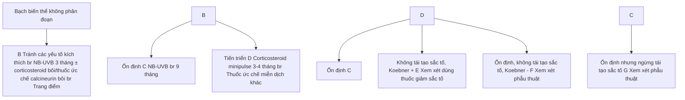

**Hình 1. Sơ đồ tóm tắt quản lý và điều trị bạch biến thể không phân đoạn**

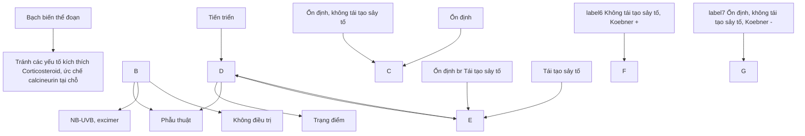

**Hình 2. Sơ đồ tóm tắt quản lý và điều trị bạch biến thể đoạn**


403

# Hướng dẫn điều trị bệnh bạch biến của hội Da liễu Anh năm 2021:

- - Lựa chọn thứ nhất:
  + Bôi corticosteroid nhóm mạnh, hoặc rất mạnh ngày 1 lần (tránh vùng quanh mắt). Để hạn chế tác dụng phụ có thể bôi xen kẽ mỗi tuần corticosteroid loại mạnh, rất mạnh ± tacrolimus ở những vùng da mỏng.
  + Tacrolimus 0,1% ngày 2 lần cho vùng mặt, đặc biệt là quanh mắt.
  + Tacrolimus 0,1% ngày 2 lần, dưới băng bịt ở vùng tiếp xúc với ánh sáng (áp dụng cho vùng ngoài mặt).

- - Lựa chọn thứ hai:
  + NB-UVB tại chỗ hoặc toàn thân ± corticosteroid bôi hoặc ức chế calcineurin.
  + Nếu bệnh tiến triển nhanh, sử dụng betamethason 0.1 mg/kg tuần 2 ngày liên tiếp trong 3 tháng, sau đó giảm liều 1mg/tháng cho 3 tháng tiếp theo phối hợp với NB-UVB.

- - Lựa chọn thứ ba:
  + Laser hoặc đèn excimer + ức chế calcineurin nếu bạch biến ở diện nhỏ.
  + Ghép tế bào thượng bì tự thân không qua nuôi cấy cho bạch biến ổn định.
  + Laser CO<sub>2</sub> + bôi 5-FU bạch biến không phân đoạn ở đầu cực của người lớn.
  + Cân nhắc làm mất sắc tố cho trường hợp bạch biến lan rộng.

## 4. PHÒNG BỆNH

Một số biện pháp dự phòng tái phát và nặng bệnh:
- - Giảm tress, hạn chế dùng chất kích thích như caffe, rượu...
- - Tránh bỏng nắng.
- - Làm xét nghiệm định kỳ phát hiện một số bệnh liên quan như hormone tuyến giáp, tuyến thượng thận, tuyến yên và định lượng insulin máu.


404

# **TĂNG SẮC TỔ SAU VIÊM**
*(Postinflammatory hyperpigmentation- PIH)*

## **1. ĐẠI CƯƠNG**

### **1.1. Khái niệm**
Tăng sắc tố sau viêm (PIH) là tình trạng tăng sắc tố mắc phải, xảy ra sau phản ứng viêm của da với các yếu tố nội sinh và ngoại sinh.

### **1.2. Dịch tễ**
PIH có thể gặp ở mọi chủng tộc, mọi tuýp da, tuy nhiên thường gặp hơn ở người có tuýp da tối màu.

### **1.3. Căn nguyên/ Cơ chế bệnh sinh**
PIH là kết quả của việc sản xuất quá nhiều melanin hoặc sự phân tán sắc tố không đều sau khi bị viêm da. Sự gia tăng hoạt động của tế bào hắc tố này được kích thích bởi các cytokin, chemokin (prostaglandin, leucotrien,...) và các chất trung gian gây viêm khác cũng như các gốc oxy hóa được giải phóng trong quá trình viêm.

## **2. CHẨN ĐOÁN**

### **2.1. Triệu chứng lâm sàng**
- Tổn thương cơ bản là dát tăng sắc tố, đa dạng về hình dáng và kích thước, xuất hiện tại nơi chấn thương hay viêm trước đó. Theo độ sâu của tổn thương, PIH được phân thành 2 loại:

  + PIH nông (thượng bì):
    - Dát màu nâu, nâu đen hay đen.
    - Có thể tự hết sau vài tháng đến vài năm mà không điều trị.
    - Nhìn rõ dưới ánh sáng đèn Wood.

  + PIH sâu (trung bì):
    - Dát màu xanh xám.
    - Có thể tồn tại vĩnh viễn hoặc tự hết sau một thời gian rất dài không điều trị.
    - Không nhìn rõ dưới ánh sáng đèn Wood.


405

- PIH thường xuất hiện sau quá trình viêm trung bình 1-2 tháng. Đa số các trường hợp có thể tự biến mất mà không cần điều trị. Thời gian trung bình là 6 tháng ở mặt, 1-2 năm ở thân mình, chi trên và 2-4 năm ở chi dưới. PIH ở người trẻ có tiên lượng tốt hơn ở người già, ở thượng bì tốt hơn ở trung bì.

**2.2. Cận lâm sàng**

- Soi đèn Wood: Giúp đánh giá PIH nông hay sâu

- Mô bệnh học: Thường không cần thiết cho chẩn đoán, mô bệnh học không đặc hiệu.

  + Thượng bì: quá sản thượng bì, tăng số lượng tế bào hắc tố và tăng lắng đọng melanin.

  + Trung bì: lắng đọng melanin, thâm nhập các đại thực bào sắc tố.

  + Nhuộm Fontana - Masson bạc (+).

**2.3. Chẩn đoán xác định**

Chủ yếu dựa vào lâm sàng với các tiêu chí chính:

- Có phản ứng viêm trước đó

- Đất tăng sắc tố xuất hiện trên nền tổn thương viêm

**2.4. Chẩn đoán phân biệt**

Tùy thuộc vào vị trí có phản ứng PIH trên cơ thể mà cần phân biệt với các bệnh lý khác nhau.

**3. ĐIỀU TRỊ**

**3.1. Nguyên tắc điều trị**

- Tránh nắng

- Điều trị tại chỗ

- Điều trị toàn thân

**3.2. Điều trị cụ thể**

**3.2.1. Thuốc bôi**

- Hydroquinon 2-4%:

  + Lựa chọn đầu tay trong điều trị PIH.


406

- + Cơ chế: ức chế tyrosinase, ngăn chặn sự chuyển đổi DOPA thành melanin

- + Cách dùng: bôi ngày 2 lần, bắt đầu bôi thử trên diện tích da nhỏ, sau 24h không bị ngứa hay rát thì bắt đầu điều trị chính thức.

- + Bắt đầu có tác dụng sau 4 tuần. Nếu sau 12 tuần không có đáp ứng thì nên ngừng điều trị.

- - Mequinol: mequinol, 4-hydroxyanisol là các dẫn xuất của hydroquinon

  - + Cơ chế: có thể liên quan đến sự ức chế cạnh tranh của tyrosinase; tuy nhiên con đường chính xác vẫn chưa rõ ràng

  - + Mequinol/tretinoin bôi tại chỗ đã được chứng minh là không thua kém 4% HQ

- - Retinoid: tretinoin, adapalen và tazaroten

  - + Cơ chế: ức chế sự hình thành melanin bằng cách tăng chu kì đổi mới tế bào gai, giảm quá trình vận chuyển melanosome và ức chế sự dịch mã tyrosinase.

  - + Retinoid an toàn và hiệu quả trong điều trị PIH, đặc biệt là PIH do mụn trứng cá. Có thể dùng kéo dài.

  - + Tác dụng phụ thường gặp là viêm da kích ứng, có thể làm PIH nặng lên sau điều trị.

  - + Cách dùng: bắt đầu ở nồng độ thấp hơn và tăng dần dựa trên đáp ứng điều trị và lựa chọn các công thức dễ dung nạp hơn, chẳng hạn như kem thay vì gel, có thể giúp giảm nguy cơ làm trầm trọng thêm PIH. Nếu có kích ứng nhiều thì dùng thêm kem dưỡng ẩm.

- - Kết hợp thuốc bôi:

  - + Công thức hay dùng: hydroquinon 4%, tretinoin 0,05%, và fluocinolon acetonid 0,01%.

  - + Vừa an toàn vừa hiệu quả trong điều trị PIH.

  - + Cách dùng: bôi ngày một lần buổi tối trong 8 tuần sau đó bôi cách ngày trong 8 tuần, sau đó bôi duy trì tuần hai lần.

- - Acid azelaic:

  - + Cơ chế: ức chế có hồi phục với tyrosinase và ức chế tổng hợp DNA và gây độc tế bào có chọn lọc trên tế bào hắc tố tăng hoạt hóa.


407

+ Acid azelaic 20% bôi hai lần một ngày có hiệu quả tương đương hydroquinon 4%, ít tác dụng phụ hơn hydroquinon. Hiệu quả bắt đầu thấy được sau 2 - 4 tuần, có thể dùng kéo dài.

- Acid kojic 1-4%: được sản xuất bởi nhiều loài nấm (ví dụ: Aspergillus oryzae, Penicillium spp, Acetobacter spp) có tác dụng điều trị PIH theo cơ chế ức chế enzym tyrosinase.

- Đậu nành: làm giảm PIH thông qua cơ chế ức chế vận chuyển melanin vào tế bào sừng và ức chế tia UVB.

- Arbutin/deoarbutin: một hydroquinon được glycosyl hóa, có tác dụng ức chế cạnh tranh với tyrosinase, ức chế hình thành melanosome nhưng ít gây độc tế bào hơn hydroquinon.

+ Cách dùng: bôi ngày 1 lần, thường dùng kết hợp với các thuốc khác.

- Acid ascorbic:

+ Cơ chế: ức chế tyrosinase và trung hòa các gốc tự do hay các gốc oxy phản ứng do quá trình viêm sinh ra và ức chế miễn dịch tại chỗ

+ Chế phẩm: có nhiều dạng như cream, lotion, serum,... đơn độc hay kết hợp với vitamin E, retinoid. Nồng độ vitamin C để có tác dụng sinh học cần cao > 8%. Hiện nay các sản phẩm vitamin C thường có nồng độ khoảng 10 - 20%.

- Niacinamide: một dạng amid của niacin (vitamin B3). Cơ chế: ức chế chuyển melanosome đến tế bào gai.

- Phương pháp bôi là phương pháp chính và hiệu quả trong điều trị PIH. Các thủ thuật khác như laser, lột da nên được cân nhắc thận trọng, chỉ trong các trường hợp kháng trị với các phương pháp thông thường hoặc PIH ở trung bì.

**3.2.2. Lột da (peeling)**

- Phân loại:

+ Rất nông (very superficial): loại bỏ lớp sừng (độ sâu 0,06 mm).

+ Nông (superficial): loại bỏ tổn thương từ lớp hạt đến trên lớp màng đáy (độ sâu 0,45 mm).

+ Trung bình (medium): đạt đến nhú trung bì (độ sâu 0,6 mm).

+ Sâu (deep): đạt đến giữa lớp lưới trung bì (độ sâu 0,8 mm).

- Chống chỉ định:


408

- + Nhiễm khuẩn cấp (virus, vi khuẩn, nấm) hoặc đang có viêm da ở vùng loét.
- + Suy giảm miễn dịch tự nhiên/mắc phải.
- + Đang dùng các thuốc làm tăng nhạy cảm da với ánh sáng (doxycyclin, vitamin A acid,...),
- + Điều trị bằng isotretinoin trong vòng 1 tháng gần đây (chống chỉ định tương đối hay tuyệt đối phụ thuộc loại loét, liều và thời gian dùng isotretinoin).
- + Cơ địa sẹo lõm, bệnh lý tim mạch (loét bằng phenol),...

- - Biến chứng:
  - + Tăng sắc tố sau viêm nhất là những người da tối màu (type da IV - VI).
  - + Nhiễm trùng, nhiễm độc: hiếm gặp.
  - + Viêm da dạng trứng cá: thường xuất hiện ở giai đoạn tái tạo biểu mô.
  - + Milia: gặp khoảng 20%, thường ở tuần thứ 8 - 16 sau loét.
  - + Sẹo lõm: thường khi dùng peel sâu.

- - Các hóa chất thường dùng:
  - + Alpha-hydroxyacids (AHAs): α-Hydroxyacids (AHA) là các acid hữu cơ yếu có trong trái cây, thực vật và đường sữa, gồm có glycolic acid (GA), lactic acid, pyruvic acid, malic acid, tartaric acid, citric acid.
  - + Acid glycolic (GA): là AHAs được sử dụng để peel nhiều nhất có ưu điểm: ổn định, không nhạy cảm ánh sáng, rẻ tiền, an toàn không cần thời gian nghỉ dưỡng. Cách dùng: peel rất nồng: 30% - 50% GA để 1 - 2 phút; peel nồng: 50% - 70% GA để 2 - 5 phút; peel trung bình: 70% GA để 3 - 15 phút. Mỗi đợt điều trị khoảng 3 - 6 lần, khoảng cách giữa các lần là 2 - 4 tuần.
  - + Acid lactic (LA): là cũng là một AHAs có tính chất tương tự GA, hiệu quả peel tốt mà giá thành rẻ và có sẵn. Cách dùng: thường dùng dung dịch LA 92% (pH = 3,5), mỗi đợt điều trị có thể lên đến 6 lần, khoảng cách giữa các lần là 3 tuần.
  - + Acid pyruvic: thường dùng dạng gel 40%, mỗi đợt điều trị khoảng 4 - 5 lần, 1 tháng/lần.
  - + Acid mandelic: thường dùng nồng độ 30 - 50%, mạnh hơn GA.
  - + Beta-hydroxyacids (BHAs): thường dùng nhất là acid salicylic (SA). Cách dùng: acid salicylic (SA) 20 - 30%, mỗi đợt 5 lần, cách nhau 2 tuần. Hiệu quả cho


409

thấy cải thiện rõ, không tái phát sau 6 tháng điều trị, không gây tăng sắc tố sau viêm nên an toàn cho da tối màu.

+ Acid trichloroacetic (TCA): Là acid mạnh, pH = 0,26, ít được sử dụng cho tuýp da tối màu và thường peel nông do tăng nguy cơ sẹo và rối loạn sắc tố sau peel. Nồng độ TCA 35% có thể đạt đến như trung bì, do đó peel TCA thích hợp cho điều trị tăng sắc tố trung bì và hỗn hợp. Cách dùng: TCA 10 - 25%, mỗi 2 tuần, cho thấy cải thiện nhanh và rõ hơn so với GA 55 75%. Tuy nhiên, tỷ lệ tái phát cao hơn so với GA.

**3.2.3. Laser**

Laser và IPL có hiệu quả điều trị các tổn thương sắc tố thông qua cơ chế quang nhiệt chọn lọc. Tuy nhiên, một trong những tác dụng phụ của laser là gây ra PIH nên laser ít được chỉ định trong điều trị PIH, chỉ trong các trường hợp kháng trị với các phương pháp thông thường hoặc PIH ở trung bì.

**3.2.4. Chống nắng**

- Chống nắng là biện pháp bắt buộc trong điều trị PIH
- Kết hợp nhiều biện pháp chống nắng khác nhau

+ Biện pháp cơ học: tránh nắng nhất là từ 9h đến 16h, đội mũ rộng vành, mang khẩu trang- găng- tất- quần áo dài tay làm bằng chất liệu vải sợi dày, khít và có màu sậm khi ra nắng.

+ Kem chống nắng:

- Chống nắng vật lý ( titanium dioxide, oxid kêm): khúc xạ và phát tán tia UV, ánh sáng nhìn thấy, tia hồng ngoại.

- Chống nắng hóa học (PABA, cinnamates, salicylates, ensulizole, benzophenons,...): hấp thu tia UV và chuyển thành năng lượng nhiệt.

**4. PHÒNG BỆNH**

**4.1. Đánh giá nguy cơ PIH trước khi làm thủ thuật**

- Tuýp da tối màu có nguy cơ PIH cao hơn
- Đánh giá tình trạng tăng sắc tố của các tổn thương cũ, sẹo cũ của bệnh nhân

**4.2. Dự phòng**

- Khi quá trình viêm đang xảy ra, tích cực điều trị bệnh lý nên để làm giảm tối thiểu phản ứng viêm.


410

- Trước khi làm thủ thuật: chống nắng trước và sau khi làm thủ thuật ít nhất 2 tuần.

- Trong khi làm thủ thuật:
  + Nên có hệ thống làm mát trong quá trình làm thủ thuật laser
  + Lựa chọn năng lượng, mật độ tia phù hợp

- Sau khi làm thủ thuật: bôi corticosteroid loại mạnh trong thời gian vài ngày sau laser

**RÁM MÁ**
(Melasma)


411

# 1. ĐẠI CƯƠNG

## 1.1. Khái niệm

Rám má (melasma) là tình trạng tăng sắc tố mắc phải ở da vùng mặt, đặc trung bởi những đốm, mảng nâu, nâu đen hoặc đen, phân bố đối xứng.

## 1.2. Dịch tễ

- Bệnh thường gặp ở những người tuýp da III - V (phân loại Fitzpatrick).
- Rám má gặp ở nữ nhiều hơn nam, đặc biệt là nữ giới trong độ tuổi sinh đẻ.

## 1.3. Căn nguyên/ Cơ chế bệnh sinh

Rám má là bệnh da tăng sắc tố mắc phải có căn nguyên và cơ chế bệnh sinh rất phức tạp. Cơ chế bệnh sinh của bệnh chưa rõ ràng, nhiều nguyên nhân được cho là có liên quan đến bệnh: di truyền, ánh sáng mặt trời, bệnh lý tuyến giáp, buồng trứng, hay nội tiết tố khác,...

# 2. CHẨN ĐOÁN

## 2.1. Triệu chứng lâm sàng

- Tổn thương cơ bản: các dát tăng sắc tố màu nâu, nâu đen, xanh đen; đồng đều hoặc không; ranh giới thường không rõ; không ngứa, không đau; đối xứng ở hai bên gò má, thái dương, trán, mũi, cằm.
  - Tổn thương tăng đậm về mùa xuân hè, giảm về mùa thu đông.
  - Phân loại: có nhiều cách phân loại rám má.
    + Dựa vào vị trí tổn thương: thể trung tâm (tổn thương ở trán, má, môi trên, mũi, cằm); thể má và mũi; thể góc hàm.
    + Phân loại theo độ sâu của tổn thương (Gilchrest 1977): thượng bì, trung bì, hỗn hợp.
    + Phân loại theo mức độ nặng: dựa theo thang điểm MSS (Melasma Severity Scale) và MASI (Melasma area and severity index).

## 2.2. Cận lâm sàng

- Đèn Wood: giúp xác định vị trí tăng sắc tố ở trung bì hay thượng bì.
- Dermoscopy: rám má thượng bì quan sát bằng ánh sáng không phân cực thấy hình ảnh tăng sắc tố màu nâu, không đồng đều. Rám má ở trung bì quan sát bằng ánh sáng phân cực thấy hình ảnh tăng sắc tố màu xám xanh hoặc xám nâu, không đồng đều; rám má hỗn hợp có cả 2 đặc điểm trên. Ngoài ra, có thể quan sát thấy sự thay đổi về phân bố và hình thái mạch máu.
  - Mô bệnh học:
    + Độ dày của thượng bì hoàn toàn bình thường.
    + Tăng sắc tố thượng bì và/hoặc trung bì.
    + Số lượng tế bào sắc tố bình thường hoặc tăng nhẹ.
    + Có thể thấy tế bào đại thực bào chứa các hạt sắc tố ở trung bì.

## 2.3. Chẩn đoán xác định:

Dựa vào:
- Lâm sàng


412

- Cần làm sáng

**2.4. Chẩn đoán phân biệt**
- Tăng sắc tố sau viêm
- Bọt tăng sắc tố, đặc biệt bọt Hori.
- Tàn nhang.
- Dày sừng da đầu.
- Tăng sắc tố do các bệnh da khác.

**3. ĐIỀU TRỊ**
**3.1. Nguyên tắc chung**
- Tránh ánh nắng mặt trời.
- Điều trị tại chỗ.
- Điều trị toàn thân.
- Kết hợp điều trị các bệnh lý liên quan.

**3.2. Điều trị cụ thể**
Có thể áp dụng một hoặc nhiều phương pháp tùy thuộc cá thể.

**3.2.1. Áp dụng các biện pháp tránh ánh nắng mặt trời**
- Đội mũ nón rộng vành, mặc quần áo chống nắng, kính...
- Sử dụng các sản phẩm chống nắng.

**3.2.2. Điều trị tại chỗ**

Bảng phân loại các tác nhân làm trắng da dựa trên cơ chế hoạt động

| Các giai đoạn tổng hợp melanin   | Cơ chế tác dụng             | Phân tử hoạt động                                                                                                                                                                                                                                 |
| -------------------------------- | --------------------------- | ------------------------------------------------------------------------------------------------------------------------------------------------------------------------------------------------------------------------------------------------- |
| Trước tổng hợp Melanin           | Ức chế phiên mã Tyrosinase  | Tretinoin, c-2 ceramide                                                                                                                                                                                                                           |
|                                  | Glycosyl hóa Tyrosinase     | PaSSO₃Ca                                                                                                                                                                                                                                          |
|                                  | Ức chế plasmin              | Tranexamic acid                                                                                                                                                                                                                                   |
| Trong quá trình tổng hợp Melanin | Ức chế hoạt động Tyrosinase | Hydroquinon, mequinol, azelaic acid, kojic acid, arbutin, deoxyarbutin, licorice extract, elanosome, 2,5-dimethyl-4-hydroxy-3(2H)-furanone, *N-acetyl glucosamine*, resveratrol, oxyresveratrol, ellagic acid, methyl gentisate, 4-hydroxyanisole |
|                                  | Ức chế Peroxidase           | Hợp chất Phenolic                                                                                                                                                                                                                                 |


413

|                                | Đạn đẹp phản ứng oxy hóa                  |                                                                                                               |
| ------------------------------ | ----------------------------------------- | ------------------------------------------------------------------------------------------------------------- |
|                                | Đạn đẹp phản ứng oxy hóa                  | Ascorbic acid, ascorbic acid palmitate, glutathione, hydrocumarins                                            |
| Sau quá trình tổng hợp Melanin | Thoái hóa Tyrosinase                      | Linoleic acid, α-linoleic acid                                                                                |
|                                | Ức chế vận chuyển elanosome               | Niacinamid, ức chế serine protease, retinoids, lecithins, neoglycoproteins, Ức chế trypsin nguồn gốc đậu nành |
|                                | Tăng tốc độ luân chuyển da                | Lactic acid, glycolic acid, linoleic acid, retinoic acid                                                      |
|                                | Điều hòa môi trường của các tế bào hắc tố | Corticosteroids, glabiridin                                                                                   |
|                                | Tương tác với đồng                        | Kojic acid, ascorbic acid                                                                                     |
|                                | Ức chế hình thành elanosome               | Arbutin, deoxyarbutin                                                                                         |
|                                | Ức chế protease activated receptor 2      | Ức chế trypsin nguồn gốc đậu nành                                                                             |


**3.2.3. Điều trị toàn thân**

- Tranexamic uống
- Glutathion
- Thuốc uống chống oxy hoá: Vitamin C, vitamin E, pycnogenol,...

**3.2.4. Các phương pháp điều trị khác**

- Điện chuyển ion: đưa hoạt chất vào da bằng phương pháp dòng điện 1 chiều.
- Mesotherapy: sử dụng phương pháp tiêm trong da (thường tiêm trung bì) để đưa các thành phần hoạt chất vào da hoặc sử dụng bằng máu tự thân (phương pháp tiêm huyết tương giàu tiêu cầu - PRP).
- Chemical peels (Jessner, Vitalize, Yellow peel, TCA, AHA, Mandelic acid,...): tăng bong tróc da, tẩy các tế bào sừng chứa sắc tố, hiệu quả cho nám mức độ trung bình – nhẹ. Nên phối hợp với thuốc thoa tại chỗ.
- Laser: ưu tiên dùng cho các trường hợp rám má trung bì, rám má hỗn hợp, ưu tiên dùng IPL cho làn da người Châu Á, có thể sử dụng các loại laser khác như: Q-switch Ruby, Alexandrite, 532-nm Nd: YAG, Yellow laser, 510-nm Pulsed-dye laser...


414

- Fractional photothermolysis/ Fractional Radiofrequency: Fractional CO2 và Erbium laser là lựa chọn mới trong điều trị nám da với cơ chế làm bốc bay tế bào thượng bì, hiệu quả trong điều trị nám thượng bì.

**4. PHÒNG BỆNH**

- Áp dụng các biện pháp tránh ánh nắng mặt trời để tránh tái phát và làm nặng tình trạng bệnh.
- Loại trừ các yếu tố nguy cơ.


415

# Chương 11

# **BỆNH DA DO RỐI LOẠN CHUYỂN HÓA**


416

# **U VÀNG**
**(Xanthoma)**

## **1. ĐẠI CƯƠNG**

### **1.1. Khái niệm**

U vàng (xanthoma) là tổn thương lành tính của da, đặc trưng bởi các sẩn, mảng, cục có màu vàng, gặp ở bất kỳ vị trí nào của cơ thể thường gặp nhất mi mắt.

### **1.2. Dịch tễ**

- Bệnh gặp ở cả hai giới.
- U vàng ở mắt gặp ở 1-4% dân số.

### **1.3. Căn nguyên/ Cơ chế bệnh sinh**

- Tổn thương được hình thành bởi các mô bào, đại thực bào có chứa lipid, thường là cholesterol trong nguyên sinh chất.
- U vàng có thể xuất hiện liên quan đến rối loạn tăng lipid máu, bệnh kháng thể đơn dòng, da u tủy xương và một số bệnh lý huyết học khác.
- Thể sùi có thể liên quan đến đáp ứng với chấn thương tại chỗ mà không liên quan đến tăng lipid máu.

## **2. CHẨN ĐOÁN**

### **2.1. Triệu chứng lâm sàng**

Biểu hiện tùy theo thể bệnh

### **2.1.1. Thể bùng phát (eruptive xanthoma)**

- Biểu hiện là các sẩn nhỏ, màu vàng, kích thước đều, thường có ngứa, đầu tổn thương có thể hơi nút nhẹ.
- Vị trí lan tỏa ở mông, vai, mặt đuôi chi, hiếm khi ở mặt hoặc niêm mạc miệng.
- Liên quan đến tăng triglycerid máu.

### **2.1.2. Thể phẳng (plane xanthoma)**

Tổn thương chủ yếu là các dát – sẩn màu vàng dựa vào vị trí chia làm các loại sau đây:

- U vàng mi mắt (xanthelasma): dát, mảng màu vàng quanh mắt, 50% trường hợp có liên quan đến tăng cholesterol.
- U vàng ở nếp gấp lòng bàn tay: liên quan tới bất thường mỡ máu tiên phát beta III.


417

- U vàng ở kẽ các ngón tay (interdigital xanthoma): liên quan đến tăng cholesterol gia đình.
- U vàng phảng phảng lan tỏa: dát - sần màu vàng chủ yếu ở thân mình, cổ, một phần mặt. Mỡ máu bình thường, có thể liên quan đến các bệnh lý về máu.

**2.1.3. Thể củ (tuberous xanthoma)**
- Các sẩn, củ cứng màu vàng nhạt, dính vào da, tiến triển chậm, không đau, thường không loét, có thể kết hợp lại tạo thành các khối nhiều thùy, hay gặp ở vị trí từ nề như đầu gối, khuỷu tay, mông, tai và gót chân, hiếm gặp ở mặt.
- Thường liên quan đến tăng cholesterol gia đình, gammopathies đơn dòng, đa u tủy xương, bệnh bạch cầu.

**2.1.4. Thể ở gân (tendinous xanthoma)**
- Tổn thương là các nốt màu vàng ở vùng gân hay dây chằng, tiến triển từ từ trong nhiều tháng, thường liên quan đến chấn thương.
- Bệnh liên quan đến tăng cholesterol máu gia đình hoặc thiếu protein vận chuyển và chuyển hóa cholesterol.

**2.1.5. Thể sùi (verruciform xanthoma)**
Tổn thương sùi màu vàng thường gặp ở niêm mạc miệng, hậu môn - sinh dục. Bệnh thường không đi kèm với rối loạn mỡ máu, có thể kết hợp với các bệnh tính ở da, u mạch máu... hoặc bệnh lý da như lichen phẳng, vảy nến, lupus.

**2.2. Cận lâm sàng**
- Xét nghiệm máu và nước tiểu, chụp Xquang để xác định các nguyên nhân và nồng độ lipoprotein (tương ứng với nguy cơ các bệnh lý tim mạch, đột quy...).
- Mô bệnh học: có nhiều tế bào bọt bản chất là các đại thực bào có chứa lipid. Ở thể bùng phát, ngoài các tế bào bọt, còn có các tế bào lympho, mono, bạch cầu trung tính và lipid tự do trong lớp hạ bì. Thể củ có các tế bào bọt và các khe cholesterol. U vàng ở gân cũng có mô bệnh học tương tự.
  - Dermoscopy các tổn thương u vàng rõ hơn với các đặc điểm:
    + Cấu trúc dạng cầu, bụi màu vàng, ranh giới rõ.
    + Có thể có giãn mạch tại tổn thương.

**2.3. Chẩn đoán xác định**
Dựa vào:
- Triệu chứng lâm sàng.
- Cận lâm sàng điển hình.


418

**2.4. Chẩn đoán thể bệnh**

- Thể bùng phát
- Thể phảng
- Thể củ
- Thể ở gan
- Thể sùi

**2.4. Chẩn đoán phân biệt**

- Thể bùng phát phân biệt với: sarcoidosis, u hạt vòng, u vàng trẻ em.
- Thể gan, thể cục phân biệt với: kén thượng bì, u mỡ, u xơ thần kinh.
- Thể phảng phân biệt với: pseudoxanthoma elasticum, amyloidosis, sarcoidosis.

**3. **ĐIỀU TRỊ**

**3.1. Nguyên tắc điều trị**

- Điều trị rối loạn lipid máu (nếu có).
- Điều trị bệnh lý nền (nếu có).
- Loại bỏ tổn thương.

**3.2. Điều trị cụ thể**

- Điều chỉnh chế độ sinh hoạt:
  + Chế độ ăn nhiều rau xanh, ngũ cốc và cá.
  + Giảm chất béo bão hòa (có trong thịt, bơ, các sản phẩm từ sữa khác, dầu dừa, dầu cọ).
  + Giảm lượng đường trong đồ uống có ga, kẹo, bánh quy và bánh ngọt.
  + Nếu béo phì, thừa cân, giảm cân bằng cách giảm lượng calo và tăng tập thể dục.
- Điều trị thuốc đường toàn thân điều chỉnh lipid máu thường cho hiệu quả cao:
  + Statins (HMG CoA reductase): atorvastatin 10 - 20 mg/ngày, simvastatin 10 - 20 mg/ngày. Tác dụng phụ thường gặp là tăng men cơ, men gan nên cần làm xét nghiệm định kỳ để kiểm tra.
  + Fibrate: fenofibrat 200 - 300 mg/ngày. Có thể có tác dụng phụ trên đường tiêu hóa.


419

- + Ezetimibe: là một nhóm thuốc mới làm hạ lipid máu, liều 10 mg/ngày, thường kết hợp với statin để tăng hiệu quả.
  - - Điều trị loại bỏ tổn thương:
    - + Phẫu thuật cắt bỏ tổn thương cho kết quả cao nhất, đặc biệt với thể sùi.
    - + Đốt điện, plasma, laser CO2
    - + Châm trichloroacetic acid (TCA), imiquimod 5%.

**4. PHÒNG BỆNH**

Đối với các trường hợp u vàng liên quan đến rối loạn lipid máu, cần có chế độ ăn hợp lý, giảm lượng dầu mỡ, kiểm tra sức khỏe định kỳ để phát hiện sớm và điều trị các rối loạn lipid máu.


420

# **BỆNH GAI ĐEN**
**(Acanthosis nigricans)**

## **1. ĐẠI CƯƠNG**

### **1.1. Khái niệm**
Gai đen là bệnh đặc trưng bởi tổn thương tăng sắc tố, dày da thường ở vị trí các nếp gấp (nách, bẹn, cổ, lưng), đối xứng hai bên.

### **1.2. Dịch tễ**
- Tỷ lệ mắc bệnh khác nhau tùy chủng tộc.
- Bệnh thường xảy ra ở những người bị béo phì hoặc tiểu đường.

### **1.3. Cơ nguyên/ Cơ chế bệnh sinh**
Cơ chế bệnh sinh còn chưa rõ ràng, tuy nhiên bệnh có liên quan đến rối loạn nội tiết (đái tháo đường đề kháng insulin, tăng nội tiết tố nam, bệnh Cushing, bệnh Addison, thiếu năng tuyến giáp), người béo phì, sau sử dụng một số thuốc hoặc các bệnh lý ác tính như ung thư dạ dày, u lympho...

## **2. CHẨN ĐOÁN**

### **2.1. Triệu chứng lâm sàng**
- Triệu chứng cơ năng: thường không có triệu chứng kèm theo, một vài trường hợp có thể ngứa nhẹ.
- Tổn thương cơ bản: các mảng dày da, tăng sắc tố màu nâu hoặc đen, bề mặt có nhú, sờ cảm giác mượt, hay gặp nhất ở vùng nếp gấp nách, bẹn, cổ, lưng với tính chất đối xứng 2 bên. Trường hợp nặng có thể gặp quanh các hốc tự nhiên.
- Các tổn thương khác: quá sần dạng u nhú lành tính ở da và niêm mạc; u mềm treo ở xung quanh tổn thương tăng sắc tố; tăng sắc tố ở niêm mạc mắt, miệng, mũi, thanh quản, quảng vú.

### **2.2. Cận lâm sàng**
- Mô bệnh học: quá sần dạng nhú (dạng các ngón tay), dày sừng, tăng sắc tố lớp đáy.
- Các xét nghiệm loại trừ rối loạn nội tiết, khối u: glucose máu, insulin máu, siêu âm, cắt lớp vi tính, MRI...

### **2.3. Chẩn đoán xác định**
- Chẩn đoán xác định chủ yếu dựa vào lâm sàng.
- Mô bệnh học hỗ trợ chẩn đoán và giúp chẩn đoán phân biệt.


421

**2.4. Chẩn đoán thể bệnh**

Chủ yếu dựa vào nguyên nhân:

- Gai đen liên quan đến béo phì: thường gặp nhất, có thể gặp ở bất kỳ độ tuổi nào, hay gặp hơn ở người trưởng thành. Béo phì thường có nguyên nhân từ rối loạn insulin.

- Gai đen liên quan đến khối u: tổn thương gai đen ở vị trí đầu cực, dây sừng và tăng sắc tố ở da hoặc niêm mạc, 25-50% có tổn thương xuất hiện ở lưỡi, môi. 90% các trường hợp liên quan đến ung thư đường tiêu hóa: dạ dày, tụy, ruột...

- Gai đen thuộc các hội chứng khác: tổn thương da chỉ là một biểu hiện đi kèm trong các hội chứng tăng insulin máu, hội chứng Cushing, hội chứng Crouzon, hội chứng Down, hội chứng buồng trứng đa nang...

- Gai đen do thuốc: hiếm gặp. Một số thuốc liên quan như: steroid toàn thân, acid nicotic, estrogen, insulin, niacin, triazine, methyltestosterone, acid fusidic, chẹn protease...

**2.5. Chẩn đoán phân biệt**

- Erythrasma

- Bệnh Hailey – Hailey

**3. ĐIỀU TRỊ**

**3.1. Nguyên tắc điều trị**

- Điều trị tại chỗ.

- Điều trị toàn thân.

- Điều trị nguyên nhân.

**3.2. Điều trị cụ thể**

**3.2.1. Điều trị tại chỗ**

- Mỡ Salicylic.

- bôi tretinoin 0,05 %-0,1% 2 lần/ngày.

- Calcipotriol: bôi 2 lần/ ngày.

- Lột da bằng hóa chất, laser: trong trường hợp tổn thương dày.

**3.2.2. Điều trị toàn thân**

- Điều trị bệnh lý kèm theo: béo phì, đái tháo đường...

- Uống retinoids (isotretinoin và acitretin): trong một số trường hợp cần thiết.


422

## 4. **PHÒNG BỆNH**

- Tránh béo phì.
- Điều trị các hội chứng liên quan.


423

# **VIÊM DA ĐẦU CHI RUỘT**
**(Acrodermatitis Enteropathica)**

## 1. ĐẠI CƯƠNG

### 1.1. Khái niệm

Viêm da đầu chi ruột hay còn gọi là viêm da đầu chi thiếu kẽm, đặc trưng bởi các dát đỏ quanh các hốc tự nhiên, đầu chi kết hợp với rụng tóc, tiêu chảy mạn tính và các rối loạn về tâm thần.

### 1.2. Dịch tễ

Bệnh hiếm gặp. Tỷ lệ mắc bệnh khoảng 1/500.000 trẻ em. Bệnh thường gặp ở trẻ bú bình hoặc sau cai sữa mẹ.

### 1.3. Căn nguyên/ Cơ chế bệnh sinh

Bệnh di truyền lặn do đột biến gen **SLC39A** trên NST số **8**, là gen mã hóa protein có vai trò vận chuyển kẽm từ ruột non vào trong máu.

## 2. CHẨN ĐOÁN

### 2.1. Triệu chứng lâm sàng

#### 2.1.1. Biểu hiện da, niêm mạc

- Dát đỏ, ranh giới rõ với da lành trên có vảy da và vảy tiết, có thể có tổn thương mụn nước, bong nước, mụn mủ. Bệnh thường kèm thêm nhiễm khuẩn thứ phát như tụ cầu vàng, nấm *Candida*…
- Vị trí: hay gặp quanh các hốc tự nhiên, đầu cực như tai, mũi, đầu các ngón tay, chân.
- Bệnh kéo dài có thể khô da, tăng sắc tố, bong vảy da, dày sừng, nứt gót chân 2 bên, viêm niêm mạc miệng lưỡi, loạn đường mỏng, viêm quanh mỏng, tóc giòn, dễ gãy, rụng tóc.

#### 2.1.2. Biểu hiện khác

- Rối loạn tiêu hóa và chuyển hóa: chán ăn hoặc giảm ăn, giảm bú, chậm tiêu, táo bón nhẹ, buồn nôn và nôn kéo dài.
- Rối loạn tâm thần kinh: rối loạn giấc ngủ, khó ngủ, thức giấc nhiều lần trong đêm, khóc đêm kéo dài, suy nhược thần kinh, đau đầu, dễ kích thích, suy giảm trí nhớ; rối loạn cảm xúc, thờ ơ, lạnh nhạt, trầm cảm, thay đổi tính tình. Nặng hơn có thể suy yếu hoạt động của não, mơ màng chậm chạp, hoang tưởng, mất điều hòa lời nói, rối loạn vị khứ giác, khuyết tật, bại não, chậm phát triển tâm thần vận động…
- Thiếu dinh dưỡng: suy dinh dưỡng nhẹ và vừa, chậm tăng trưởng chiều cao…


424

- Suy giảm khả năng miễn dịch: nhiễm trùng tái diễn đường hô hấp như viêm mũi họng, viêm phế quản, viêm đường tiêu hóa...
  - Tổn thương mắt: sợ ánh sáng, giảm khả năng thích nghi với bóng tối, quáng gà, khô mắt, loét giác mạc...

**2.2. Cận lâm sàng**
- Kém trong huyết thanh, nước tiểu, tóc giảm.
- Kiềm phosphate giảm.
- Một số xét nghiệm khác:
  + Thử nghiệm dung nạp kém
  + Xét nghiệm máu có thể thấy thiếu máu hoặc hạ bạch cầu
- Mô bệnh học: trong giai đoạn sớm không đặc hiệu với hình ảnh giống phản ứng châm hoặc vây nến, giai đoạn sau có thể thấy á sừng, hoại tử tế bào sừng, lớp tế bào gai mỏng, mất lớp tế bào hạt.

**2.3. Chẩn đoán xác định**

Dựa vào:
- Lâm sàng
- Xét nghiệm kém huyết thanh giảm dưới mức bình thường.

**2.4. Chẩn đoán phân biệt**
- Viêm kẽ do *Candida*
- Viêm da do tã lót
- Viêm da dầu

**3. ĐIỀU TRỊ**

**3.1. Nguyên tắc điều trị**
- Bổ sung kém bằng đường toàn thân kết hợp chăm sóc tại chỗ.
- Nâng cao thể trạng.
- Điều trị bội nhiễm, biến chứng nếu có.

**3.2. Điều trị cụ thể**

**3.2.1. Tại chỗ**

Có thể đắp các tổn thương trợt ướt bằng dung dịch Jarish, bôi mỡ kháng sinh nếu có nhiễm khuẩn hoặc bôi thuốc chống nấm nếu có nhiễm nấm kèm theo.

**3.2.2. Toàn thân**

- Bổ sung kém đường uống: Liều kém nguyên tố bắt đầu được bổ sung từ 3mg/kg/ngày, tương đương 13,2 mg kém sulfat/kg/ngày hoặc 10,1 mg kém axetat/kg/ngày. Định lượng kém huyết thanh 3-6 tháng/lần để điều chỉnh lượng kém


425

cho phù hợp. Tác dụng phụ do bổ sung kém rất hiếm, sử dụng liều cao trong thời gian dài có thể dẫn đến thiếu hụt các khoáng chất khác như sắt và đồng.

- Trường hợp bội nhiễm gây nên nhiễm khuẩn nặng cần phối hợp kháng sinh toàn thân, nâng cao thể trạng và điều trị các rối loạn đi kèm.

**4. Phòng bệnh**

Tăng cường nuôi con bằng sữa mẹ.


426

# **BỆNH PELLAGRA**
(Pellagra)

## **1. ĐẠI CƯƠNG**

### **1.1. Khái niệm**

- Pellagra là bệnh do thiếu hụt niacin hoặc tryptophan, đặc trưng bởi tam chứng gồm 3 chữ D: tiêu chảy (diarrhea), viêm da (dermatitis) và giảm trí nhớ (dementia), trường hợp nặng có thể tử vong.

- Pellagra có thể gặp ở những người suy dinh dưỡng; người bệnh đang điều trị bằng isoniazid. Chế độ ăn nghèo dinh dưỡng đặc biệt chế độ ăn ngô đơn thuần là yếu tố nguy cơ thường gặp nhất gây bệnh Pellagra.

### **1.2. Dịch tễ**

- Pellagra chủ yếu gặp ở các nước đang phát triển đặc biệt khu vực Châu Phi, vùng cao nguyên Deccan của Ấn Độ do chế độ ăn thiếu dinh dưỡng. Ở những người suy dinh dưỡng, bệnh nặng hơn vào cuối mùa xuân và đầu mùa hè.

- Ngoài ra, Pellagra còn hay gặp ở những người nghiện rượu mạn tính, ăn kiêng.

### **1.3. Căn nguyên/ Cơ chế bệnh sinh**

- Bệnh được chia thành 2 thể:

  + Thể nguyên phát: do thiếu niacin và/ hoặc tryptophan trong chế độ ăn.

  + Thể thứ phát: có đầy đủ niacin trong chế độ ăn, nhưng niacin không được hấp thụ đầy đủ do:

    - Rối loạn hấp thụ của cơ quan tiêu hoá. Trường hợp này ngoài thiếu vitamin PP còn kèm theo thiếu các vitamin nhóm B khác như B1, B2, B6.

    - Viêm đường tiêu hoá: viêm đại tràng mạn tính, đặc biệt là loét đại tràng; viêm hồi, manh tràng.

    - Do thuốc: một số thuốc làm ảnh hưởng tới chuyển hoá và hấp thụ vitamin PP như isoniazid, sulfamid, thuốc chống co giật, thuốc chống trầm cảm.

    - Do khối u ác tính.

    - Tiêu chảy kéo dài.

    - Nghiện rượu mạn tính.

## **2. CHẨN ĐOÁN**


427

## 2.1. Triệu chứng lâm sàng

Bệnh đặc trưng bởi tam chứng gồm 3 chữ D: tiêu chảy (diarrhea), viêm da (dermatitis) và giảm trí nhớ (dementia). Các triệu chứng thường xuất hiện lần lượt theo thứ tự như trên.

- Tồn thương da:
  + Bắt đầu là dát đỏ giới hạn rõ, trên có vảy da, có khi có bọt nước, mụn nước, da vùng bị bệnh phù nhẹ, dần dần trở nên khô dày và sẫm màu, kèm theo có ngứa, hoặc cảm giác nóng ở vùng tổn thương.
  + Vị trí: hay gặp vùng hở
    - Ở mặt: hai bên vành tai, rãnh mũi, má (có khi tạo thành hình cánh bướm), trán, cằm, tháp mũi (ít khi xuất hiện ở mi mắt).
    - Vùng tam giác cổ áo.
    - Mu tay, mặt dùi căng tay, bà vai cánh tay, khuỷu tay, đầu gối, mu chân.
    Giai đoạn muộn: có thể có triệu chứng khô da, dày da, tăng sắc tố...

- Tồn thương nội tạng:
  + Tiêu hoá: ỉa chảy, chán ăn, buồn nôn, đôi khi có rối loạn chức năng gan. Các triệu chứng rối loạn tiêu hoá thường xuất hiện trước khi có tổn thương da.
  + Thần kinh: người bệnh thường đau đầu, chóng mặt, đau các dây thần kinh ngoại biên, giảm trí nhớ, có khi có dấu hiệu thiếu năng tinh thần, rối loạn thị giác.

- Tiến triển và biến chứng:

Bệnh thường xuất hiện và nặng lên vào mùa hè. Nếu không được điều trị bệnh tiến triển càng ngày càng nặng. Da dần dần thâm, khô, dày, bong vảy liên tục. Các biểu hiện nội tạng sẽ nặng dần lên nhất là rối loạn tiêu hoá và đau dây thần kinh ngoại biên. Một số trường hợp nặng nếu không điều trị kịp thời có thể dẫn tới tử vong.

## 2.2. Cận lâm sàng

- Định lượng Vitamin PP trong máu.

- Mô bệnh học: không đặc hiệu, có thể có sự tăng sùng dạng vảy nến, kèm theo hình ảnh các tế bào thượng bì nhạt màu, phù nề. Có thể thấy hình ảnh bọt nước ngay dưới thượng bì.

## 2.3. Chẩn đoán xác định

Dựa vào:

- Lâm sàng


428

- Cần làm sáng: Vitamin PP trong máu giảm.

**2.4. Chẩn đoán phân biệt**

- Các bệnh lí da do ánh sáng khác: Viêm da tiếp xúc do ánh sáng...
- Lupus ban đỏ
- Viêm da đầu
- Dị ứng thuốc (các thuốc nhạy cảm với ánh sáng)
- Porphyrin da muộn
- Pemphigus do thuốc

**3. ĐIỀU TRỊ**

**3.1 Nguyên tắc điều trị**
- Bổ sung vitamin PP.
- Điều trị các bệnh lí gây giảm hấp thu niacin.

**3.2 Điều trị cụ thể**
- Điều trị tại chỗ:
  + Sử dụng các biện pháp chống nắng: đội mũ rộng vành, quần áo chống nắng, kính... và sản phẩm chống nắng.
  + Sản phẩm làm mềm da, dưỡng ẩm.
- Điều trị toàn thân:
  + Vitamin PP là thuốc điều trị đặc hiệu.
  - Liều lượng: 500mg/24 giờ chia làm 4 lần.
  - Lưu ý: phải uống thuốc sau khi ăn no. Thuốc có thể gây dị ứng.
  - Bổ sung thêm vitamin khác: B1, B2, B6...
  - Chế độ dinh dưỡng tốt, nâng cao thể trạng.
  - Điều trị các bệnh lí kèm theo.

**4. PHÒNG BỆNH**
- Nên ăn đa dạng các loại ngũ cốc đủ dinh dưỡng.
- Chế độ ăn nên kèm theo thịt cá và các chất có nhiều vitamin nhất là vitamin nhóm B.
- Kiểm tra sức khoẻ định kì, phát hiện một số bệnh có liên quan.
- Hạn chế uống rượu bia.
- Sử dụng các biện pháp chống nắng.


429

# **BỆNH PORPHYRIN DA CHẠM**
**(Porphyria cutanea tarda)**

## 1. **ĐẠI CƯƠNG**

### 1.1. **Khái niệm**

Porphyrin da là bệnh do rối loạn tổng hợp nhân heme gây nên. Tùy theo vị trí rối loạn tổng hợp heme mà có những nhóm bệnh khác nhau. Porphyrin cấp tính có hoặc không có biểu hiện ở da, thường tiến triển nặng, có thể ảnh hưởng đến tính mạng. Tuy nhiên, porphyrin da chậm là hình thái làm sàng phổ biến hơn và tiến triển lành tính.

### 1.2. Dịch tễ

- Tỉ lệ mắc từ 1/10.000- 25.000 ở Mỹ, tỉ lệ này cao hơn ở châu Âu.
- Bệnh xuất hiện ở tất cả các chủng tộc, chủ yếu ở người lớn.
- Tại Việt Nam cho tới nay chưa có nghiên cứu đầy đủ nào về dịch tễ học của bệnh.

### 1.3. **Căn nguyên/ Cơ chế bệnh sinh**

- Bệnh porphyrin da chậm là một bệnh da nhạy cảm với ánh sáng, chất cảm quang là porphyrin lắng đọng trong các lớp biểu bì.

- Bệnh do rối loạn hoạt động của 2 trong 8 enzym điều phối quá trình tổng hợp và chuyển hóa nhân heme dẫn đến lắng đọng porphyrin ở các cơ quan. Khi đạt đến một nồng độ nào đó sẽ xuất hiện triệu chứng nhiễm độc các cơ quan nội tạng và có các biểu hiện ngoài da, thần kinh.

## 2. **CHẨN ĐOÁN**

### 2.1. Triệu chứng lâm sàng

- Tổn thương da:

  + Bọng nước căng, kích thước bằng hạt đậu xanh đến hạt lạc, chứa dịch trong, đục khi nhiễm khuẩn, có thể màu đỏ nếu có máu. Bọng nước dập vỡ để lại vảy tiết, vết trợt, lành để lại sẹo teo trên da, milia và tăng sắc tố.

  + Có thể có da đỏ lan rộng ở mặt mà hay gặp nhất là quanh mắt và vùng trán.

  + Vị trí: tổn thương ở vùng hờ, đối xứng như mu tay, mặt dưới căng tay, mu chân, nếp gấp cổ chân, vùng da tam giác cổ áo, thái dương. Ngoài ra các vùng khác như khoeo chân, nếp gấp khuỷu tay, xung quanh thất lung cùng là vùng hay có tổn thương do porphyrin gây ra. Có thể có da đỏ lan rộng ở mặt mà hay gặp nhất là quanh mắt và vùng trán.


430

- + Bọng nước thường xuất hiện sau những sang chấn nhẹ như tỷ đè, đụng dập.
- - Tuổi khởi phát bệnh: thường ở tuổi 30-40, rất hiếm gặp ở tuổi dậy thì.
- - Có thể gặp các triệu chứng khác như chứng rậm lông ở má và thái dương.
- - Triệu chứng cơ năng: ngứa
- - Các biểu hiện khác:
  - + Nước tiểu đỏ khi quan sát dưới ánh sáng thường hoặc soi bằng đèn Wood.
  - + Có thể gặp gan to, lách to.
  - - Bệnh tiến triển mạn tính, thành từng đợt, nặng lên về mùa xuân - hè.

**2.2. Cận lâm sàng**
- - Porphyrin tăng ở máu, nước tiểu.
- - Sắt huyết thanh tăng.
- - Xét nghiệm đánh giá chức năng gan và marker viêm gan.
- - Mô bệnh học: bọng nước nằm ở dưới thượng bì, ở lớp nhú và dưới nhú có xâm nhập tế bào lympho, tổ chức bào.
- - Bản đồ gen xác định đột biến nhiễm sắc thể.

**2.3. Chẩn đoán xác định**
Dựa vào:
- - Lâm sàng
- - Cận lâm sàng

**2.4. Chẩn đoán phân biệt**
- - Các bệnh da nhạy cảm với ánh nắng.
- - Các bệnh da bọng nước: Durhing-Brocq, Bệnh IgA thành dải...
- - Bệnh da do rối loạn chuyển hóa: Pellagra.

**3. ĐIỀU TRỊ**
**3.1. Nguyên tắc:**
- - Tránh ánh nắng mặt trời.
- - Điều trị triệu chứng.
- - Điều trị các bệnh lý liên quan.

**3.2. Điều trị cụ thể**
**3.2.1. Tại chỗ**
- - Bôi sản phẩm chống nắng trước khi ra ngoài trời 30 phút.
- - Các bọng nước: Sát khuẩn, kháng sinh trong trường hợp cần thiết.


431

**3.2.2. Thuốc toàn thân**

- Thuốc sốt rét tổng hợp liều thấp: hydroxychloroquine uống 100 – 200 mg/lần. Mỗi tuần uống 2 lần trong thời gian vài tháng, sau đó có thể giảm liều tùy từng trường hợp.

- Desferrioxamine B: thuốc có tác dụng tăng đào thải sắt. Tiêm bắp 1,5 g/ngày, một tuần tiêm 5 ngày hoặc tiêm tĩnh mạch một tuần một lần, mỗi lần 200g. Tổng thời gian điều trị là 11 tháng.

- Trích máu tĩnh mạch, mỗi lần bỏ đi từ 300-500ml, có thể trích nhiều lần.

**4. PHÒNG BỆNH**

- Phát hiện và điều trị sớm.

- Áp dụng các biện pháp tránh nắng.

- Điều trị tại chỗ kết hợp với thuốc toàn thân.

- Không dùng rượu, thuốc lá, chất kích thích, chế độ ăn giảm sắt, thuốc tránh thai và hạn chế dùng các thuốc nội tiết tố khác nếu không thật sự cần thiết.

- Tránh sử dụng các sản phẩm có chứa các thành phần nhạy cảm với ánh sáng: phenol, psoralen, meladinin, sulphamid, cyclin.


432

# Chương 12

# **BỆNH LÝ PHẦN PHỤ CỦA DA**


433

# **TRÚNG CÁ**
**(Acnes)**

## **1. ĐẠI CƯƠNG**

### **1.1. Khái niệm**

Trúng cá là một bệnh viêm mạn tính của đơn vị tuyến bã – nang lông, đặc trưng bởi các tổn thương không viêm như mụn đầu đen, đầu trắng, hoặc tổn thương viêm như các sẩn viêm, sẩn mủ, cục, nang. Các tổn thương phân bố chủ yếu vùng nhiều tuyến bã như mặt, ngực, lưng. Bệnh thường gây ảnh hưởng tới thẩm mỹ, tâm lý và sự tự tin của người bệnh.

### **1.2. Dịch tễ**

Bệnh có thể gặp ở mọi lứa tuổi (thời thơ ấu, tuổi thanh thiếu niên và người trưởng thành). Đối với trúng cá khởi phát ở tuổi dậy thì, tỉ lệ gặp ở nam nhiều hơn nữ. Đối với trúng cá xuất hiện sau thời kì dậy thì, tỉ lệ gặp ở nữ nhiều hơn nam.

### **1.3. Căn nguyên/ Cơ chế bệnh sinh**

Có nhiều nguyên nhân và yếu tố liên quan tới cơ chế bệnh sinh của bệnh. Một số yếu tố như: gia đình, nội tiết, môi trường, vệ sinh, ăn uống, căng thẳng, sử dụng mỹ phẩm, thuốc bôi không hợp lý... là tác nhân làm xuất hiện trúng cá hoặc làm bệnh nặng thêm. Có 4 cơ chế chính gây bệnh trúng cá đã được xác định, đó là tăng bài tiết chất bã, dày sừng cổ nang lông, vai trò của vi khuẩn *Cutibacterium acnes* (C. acnes) và các chất trung gian viêm.

## **2. CHẨN ĐOÁN**

### **2.1. Triệu chứng lâm sàng**

- Tổn thương da: các tổn thương phân bố điển hình ở vùng có nhiều tuyến bã như mặt, cổ, ngực, lưng trên, cánh tay trên. Bao gồm một hoặc nhiều dạng tổn thương:
  + Mụn nhân đóng (closed comedone) hay mụn đầu trắng: kích thước < 5mm, sẩn có màu da, trắng hoặc xám hình vòm, nhẵn hơi nhô cao hơn mặt da.
  + Mụn nhân mở (open comedone) hay mụn đầu đen: sẩn kích thước < 5mm, trung tâm có lỗ mở chứa chất sừng xám, nâu hoặc đen.
  + Mụn mủ (pustule): đường kính tổn thương dưới 5mm, chứa đầu mủ màu trắng hoặc vàng ở trung tâm nền đỏ.
  + Sẩn mủ (papulopustular): sẩn và mụn mủ tương đối nông ở bề mặt, đường kính < 5 mm.


434

- + Cục (nodule): sẩn to (> 5mm) hoặc cục (> 1 mm) viêm sâu, ấn đau do tổn thương viêm sâu hơn xuống trung bì.

- + Nang (cyst): tổn thương trứng cá dạng nang do tổn thương viêm chứa dịch mủ, sền sệt lẫn máu, thường mềm, dễ vỡ.

- - Các dấu chứng sau trứng cá:

- + Tăng sắc tố sau viêm

- + Ban đỏ sau viêm

- + Sẹo: bao gồm sẹo lõm, sẹo quá phát, sẹo lõi.

- ● Sẹo lõm trứng cá chia làm 3 loại:

- ✓ **Sẹo hình phễu (ice pick):** hay gặp nhất, đường kính < 2mm, bờ rõ, có thể sâu tới lớp hạ bì.

- ✓ **Sẹo lòng chảo (rolling scars):** đường kính 4 - 5mm, do sợi xơ trung bì dính với thượng bì gây co kéo tạo thành đáy lòng chảo.

- ✓ **Sẹo đáy phẳng (box scars):** hình tròn hay ovan, bờ sẹo thẳng đứng, đường kính 1,5 - 4mm.

- ● Sẹo quá phát, sẹo lõi: do sự tăng sinh xơ bất thường trong quá trình lành thương, thường gặp ở vị trí ngực, lưng, bả vai, góc hàm, mặt.

- - Các biểu hiện của bệnh lý liên quan:

- Cường androgen: rậm lông thứ phát ở nách, mu, ngực, râu cằm, rụng tóc hói. Nữ giới có kinh nguyệt bất thường (không đều, vòng kinh kéo dài quá 35 ngày hoặc ngắn dưới 21 ngày, ...), phì đại âm vật, giọng trầm.

- - Biến chứng:

- + Trứng cá tối cấp (Acne fulminans): Sự bùng phát cấp tính các nang, cục viêm lớn kèm theo các vết trợt, loét, đóng vảy xuất huyết. Có thể kèm theo triệu chứng toàn thân như sốt, mệt mỏi, đau xương, khớp, hồng ban nút. Xét nghiệm thấy tăng bạch cầu, máu lắng, Protein phản ứng C, thiếu máu. Tình trạng này hiếm gặp, gặp chủ yếu ở nam giới tuổi vị thành niên. Có thể xảy ra sau dùng isotretinoin đường uống hoặc xuất hiện tự nhiên.

- + Viêm nang lông do vi khuẩn gram âm: gặp ở những bệnh nhân điều trị kháng sinh lâu dài dẫn đến kháng thuốc. Biểu hiện là các sẩn, cục viêm, mụn mủ trung tâm mặt, quanh mũi.

- + Phù nề cứng mặt (bệnh Morbihan's): ban đỏ và phù nề mô mềm vùng mặt.

- + Ảnh hưởng tâm lý do trứng cá.


435

## **2.2. Cận lâm sàng**

- Soi tươi tìm nấm, demodex để chẩn đoán phân biệt
- Đèn Wood: vi khuẩn *C. acnes* bắt màu cam
- Xét nghiệm chẩn đoán cường androgen:
  + Siêu âm ổ bụng tìm dấu hiệu buồng trứng đa nang, khối u buồng trứng, tuyến thượng thận
  + Nồng độ testosterone tự to, toàn phần và DHEA-S tăng
- Đánh giá tình trạng nhiễm khuẩn (nếu cần đặc biệt khi có biến chứng trúng cá tối cấp): xét nghiệm máu thấy tăng bạch cầu, máu lắng, protein phản ứng C.
- Chụp X quang (nếu có triệu chứng liên quan đến xương, khớp): hình ảnh tiêu xương.
- Chuẩn bị cho liệu pháp điều trị với isotretinoin đường uống: chức năng gan, mỡ máu, thử thai bằng nước tiểu hoặc huyết thanh

## **2.3. Chẩn đoán xác định**

Chẩn đoán xác định dựa vào triệu chứng lâm sàng.

## **2.4. Chẩn đoán thể**

- Trúng cá thông thường
- Trúng cá mạch luron: thường gặp ở nam giới trẻ tuổi. Biểu hiện là các cục, nang lớn, thường tập trung lại, đi vào thành dạng dài, hang với nhiều lỗ dò. Tổn thương chảy dịch máu mù. Tổn thương để lại sẹo nghiêm trọng hình thành các cầu da, dải xơ. Không có triệu chứng toàn thân.
- Trúng cá ở trẻ sơ sinh: thường bắt đầu ở độ tuổi 3-6 tháng do tuyến thượng thận chưa trưởng thành dẫn đến tăng nồng độ androgen. Nồng độ androgen giảm dần từ 1-2 tuổi kèm theo sự cải thiện mụn trứng cá
- Trúng cá do cáo gãi: tổn thương không viêm tương đối nhẹ hoặc các sản viêm thường xuyên bị cáo gãi để lại vết trợt và sẹo. thường gặp ở phụ nữ trẻ có các vấn đề tâm lý, sử dụng thuốc chống trầm cảm.

## **2.5. Chẩn đoán mức độ bệnh**

Hiện nay có nhiều phân loại khác nhau về mức độ nặng trong trúng cá như phân loại theo Karen McCoy, trúng cá thông thường chia làm 3 mức độ (nhẹ, vừa và nặng) hay phân loại theo IGA (Investigator Global Assessment) 2005, chia làm 4 mức độ (mụn nhân, trúng cá sần mù nhẹ - trung bình, trúng cá sần mù nặng/trúng cá bọc trung bình, trúng cá bọc nặng/trúng cá bùng phát). Tuy nhiên, chưa có một phân loại mức độ trúng cá nào được chấp nhận trên toàn cầu.


436

Trên lâm sàng, cách phân loại mức độ nặng trứng cá dễ tiếp cận cho điều trị nhất như sau:

- Trứng cá mức độ nhẹ:
  + Các mụn nhân đóng hoặc sần viêm hoặc sần mù nhỏ (< 5mm), rải rác, không có sẹo trứng cá
  + Vùng da tổn thương giới hạn (chỉ bị ở 1 vùng cơ thể hoặc nếu bị hơn 1 vùng cơ thể thì chỉ có một vài tổn thương ở mỗi vùng)
  + Không có tổn thương cục
- Trứng cá mức độ trung bình và nặng:
  + Nhiều tổn thương mụn nhân đóng hoặc sần viêm hoặc mụn mù
  + Có tổn thương cục
  + Bị ở nhiều vùng cơ thể, mỗi vùng có nhiều tổn thương
  + Có sẹo trứng cá

**2.4. Chẩn đoán phân biệt**

- Quá sần tuyến bã
- Nevus comedonicus
- Da u tuyến bã
- U xơ mạch vùng mặt trong bệnh xơ cứng củ
- Viêm nang lông
- Trứng cá đỏ
- Viêm da quanh miệng
- Giả viêm nang lông vùng râu
- Hội chứng Favre-Racouchot
- Viêm tuyến mồ hôi mù
- Tổn thương dạng trứng cá:
  + Trứng cá do thuốc
  + Bệnh mụn mù ở trẻ sơ sinh
  + Trứng cá do mỹ phẩm
  + Trứng cá do tỷ đề
  + Trứng cá do nghề nghiệp và do clo

**3. ĐIỀU TRỊ**

**3.1. Nguyên tắc điều trị**

- Lựa chọn thuốc tác động vào một hoặc nhiều hơn trong bốn yếu tố: sừng hóa cổ nang lông, sản xuất bã nhờn, vi khuẩn *C. acnes*, yếu tố viêm.
- Điều trị sớm tránh biến chứng.
- Điều trị bệnh theo mức độ.
- Cần điều trị duy trì để tránh tái phát


437

# 3.2. **Điều trị cụ thể**
*Phác đồ điều trị trứng cá thông thường mức độ nhẹ:*

| Đánh giá các biến chứng cần điều trị tích cực: |
| ---------------------------------------------- |
| Sẹo trứng cá                                   |
| Tình trạng tăng sắc tố hoặc ban đỏ sau viêm    |
| Ảnh hưởng tâm lý đáng kể                       |


```mermaid
graph TD
  N0[Đánh giá các biến chứng cần điều trị tích cực: br Sẹo trứng cá br Tình trạng tăng sắc tố hoặc ban đỏ sau viêm br Ảnh hưởng tâm lý đáng kể] --> N1[Không]
  N2[A] --> N3[Có]
  N4[B] --> N5[Đánh giá loại tổn thương]
  N6[C] --> N7[Quản lý như trứng cá mức độ trung bình đến nặng]
  N8[D] --> N9[Chỉ có tổn thương không viêm]
  N8[D] --> N10[Sẩn mụn mủ +/- tổn thương không viêm]
  N11[F] --> N12[Retinoid bôi tại chỗ]
  N13[G] --> N14[Retinoid bôi tại chỗ và benzoyl peroxide]
  N15[H] --> N16[Đáp ứng tốt]
  N15[H] --> N17[Đáp ứng kém]
  N18[I] --> N16[Đáp ứng tốt]
  N18[I] --> N17[Đáp ứng kém]
  N19[J] --> N20[Tiếp tục dùng retinoid tại chỗ như liệu pháp duy trì]
  N21[K] --> N22[Tăng nồng độ retinoid hoặc đổi sang retinoid khác]
  N23[L] --> N24[N]
  N25[M] --> N26[Thêm clindamycin hoặc dapson bôi tại chỗ]
  N27[O] --> N28[Quản lý như trứng cá mức độ nặng]
  N29[P] --> N16[Đáp ứng tốt]
  N29[P] --> N17[Đáp ứng kém]
  N30[R] --> N31[Sau khi ổn định ít nhất 3-6 tháng chuyển sang đơn trị liệu retinoid như là liệu pháp duy trì]
  N32[S] --> N33[U Xem xét các liệu pháp điều trị tại chỗ thay thế clascoterone, minocyclin kết hợp với retinoid và benzoyl peroxide Hoặc Quản lý như trứng cá mức độ nặng]
```


438

*Phác đồ điều trị trứng cá thông thường mức độ trung bình đến nặng ở thanh thiếu niên và người lớn: Lựa chọn liệu pháp toàn thân*

| Có bất kỳ dấu hiệu nào sau đây: |
| ------------------------------- |
| Trứng cá cục, nang, lan rộng    |
| Sẹo trứng cá                    |
| Ảnh hưởng tâm lý đáng kể        |


Có
- Tư vấn bắt đầu sử dụng isotretinoin đường uống

Không
- Có tổn thương sần mỡ và/hoặc cục, nang

```mermaid
graph TD
  N0[Có bất kỳ dấu hiệu nào sau đây: br Trứng cá cục, nang, lan rộng br Sẹo trứng cá br Ảnh hưởng tâm lý đáng kể] --> N1[Có]
  N2[A] --> N3[Không]
  N4[B] --> N5[Tư vấn bắt đầu sử dụng isotretinoin đường uống]
  N6[D] --> N7[Bệnh nhân từ chối hoặc không phù hợp với isotretinoin]
  N8[C] --> N9[Có tổn thương sản mủ và/hoặc cục, nang]
  N10[E] --> N11[F]
  N11[F] --> N1[Có]
  N11[F] --> N12[Không br Chỉ tổn thương không viêm]
  N13[G] --> N14[I Các lựa chọn bao gồm: br - Tetracyclin đường uống doxycyclin, minocyclin, sarecyclin , hoặc br - Thuốc tránh thai đường uống chỉ định cho nữ , hoặc br - Spironolacton đường uống chỉ định cho nữ , hoặc br - Isotretinoin đường uống br Sử dụng tetracyclin, thuốc tránh thai đường uống và spironolacton kết hợp với liệu pháp bôi tại chỗ = Đánh giá lại sau 3 tháng br Nếu không cải thiện kết hợp các thuốc này kết hợp spironolacton và thuốc tránh thai đường uống hoặc thêm tetracyclin vào thuốc tránh thai đường uống hoặc liệu pháp spironolacton , chuyển thuốc hoặc chuyển sang dùng isotretinoin đường uống]
  N15[H] --> N16[J Các lựa chọn bao gồm: br - Thuốc tránh thai đường uống chỉ định cho nữ , hoặc br - Spironolacton đường uống chỉ định cho nữ , hoặc br - Isotretinoin đường uống br Sử dụng thuốc tránh thai đường uống và spironolacton kết hợp với liệu pháp bôi tại chỗ = Đánh giá lại sau 3 tháng br Nếu không cải thiện kết hợp các thuốc này hoặc chuyển sang dùng isotretinoin đường uống]
```

Không
- Chỉ tổn thương không viêm
- Các lựa chọn bao gồm:
  - Thuốc tránh thai đường uống (chỉ định cho nữ), hoặc
  - Spironolacton đường uống (chỉ định cho nữ), hoặc
  - Isotretinoin đường uống
  Sử dụng thuốc tránh thai đường uống và spironolacton kết hợp với liệu pháp bôi tại chỗ => Đánh giá lại sau 3 tháng
  Nếu không cải thiện kết hợp các thuốc này hoặc chuyển sang dùng isotretinoin đường uống


439

**Điều trị duy trì:** Sử dụng retinoid đường bôi để điều trị duy trì (theo dõi sơ đồ điều trị trứng cá mức độ nặng)

**Các thuốc điều trị cụ thể**

- *Retinoid tại chỗ*

Lựa chọn một trong các hoạt chất sau:

+ Adapalen (0,1%, 0,3% kem hoặc lotion 0,1%)
+ Retinoic acid (0,025 - 0,1% dạng kem, gel)
+ Tazaroten (0,05%, 0,1% kem, gel hoặc bột).
+ Trifaroten

Cách dùng: Bôi thuốc mỏng 1 lần/ngày vào buổi tối. Có thể giảm tần suất bôi trong một vài tuần đầu (bôi cách ngày hoặc sau dưỡng ẩm để hạn chế kích ứng).

**Lưu ý:**

+ Tác dụng phụ như khô, kích ứng, bong da, tăng nhạy cảm ánh sáng thường gặp trong 2 tuần đầu. Tretinoin không sử dụng cùng lúc hoặc kết hợp với benzoyl peroxide (BP).
+ Tretinoin và adapalen thuộc phân loại thai kỳ C đối với phụ nữ có thai.
+ Tazaroten không chỉ định cho phụ nữ mang thai, phân loại thai kỳ X.
+ Adapalen, tazaroten được FDA chấp thuận cho bệnh nhân ≥ 12 tuổi và tretinoin cho bệnh nhân ≥ 10 tuổi.

- *Kháng sinh bôi tại chỗ*

Lựa chọn một trong các dạng hoạt chất sau:

+ Clindamycin 1% (dung dịch hoặc gel)
+ Erythromycin 2% (kem, gel, lotion, xịt)
+ Minocyclin bột 4%: FDA phê duyệt cho điều trị trứng cá thông thường mức độ trung bình đến nặng

**Lưu ý:**

+ Ưu tiên lựa chọn clindamycin hơn erythromycin do tỷ lệ kháng với tụ cầu và *C. acnes* của erythromycin cao hơn.
+ Bôi 1-2 lần/ngày vào vùng da có tổn thương viêm.
+ Không khuyến cáo sử dụng đơn trị liệu trong trứng cá.
+ Dùng dạng phối hợp với BP giúp làm tăng hiệu quả và giảm nguy cơ kháng kháng sinh. (ví dụ erythromycin 3% với BP 5% hay clindamycin 1% với BP 5%).


440

- + Clindamycin và erythromycin chỉ định được cho phụ nữ có thai (Phân loại thai kỳ nhóm B).
- *Benzoyl peroxid (BP)*
Dạng chế phẩm: gel, kem, xà phòng rửa (nồng độ 2,5 - 10%).
Cách dùng: bôi ngày 1 lần vào buổi tối sau khi rửa mặt.
Hiện tại chưa có trường hợp kháng thuốc nào được báo cáo.

**Lưu ý:**
- + Tác dụng phụ: kích ứng, thay đổi màu sắc áo, tóc, nhạy cảm ánh sáng.
- + Khuyến cáo thai kỳ C, tuy nhiên tỷ lệ hấp thu toàn thân rất thấp, cần nhắc chỉ định ở phụ nữ mang thai.
- + Chưa chứng minh an toàn và hiệu quả ở trẻ em <12 tuổi.

- *Acid azelaic*
- + Dạng thuốc: nồng độ 20% (kem hoặc gel)
- + Cách dùng: Bôi 2 lần/ngày vào vùng da có tổn thương,
- + Tác dụng phụ: kích ứng tại chỗ, tuy nhiên tỷ lệ thấp và nhẹ.
- + Thích hợp cho những bệnh nhân có da nhạy cảm hoặc type da tối màu, có những tổn thương tăng sắc tố sau viêm do có tác dụng ức chế melanin làm sáng da.
- + Chỉ định được cho phụ nữ có thai (Phân loại thai kỳ nhóm B)

- Sản phẩm điều trị kết hợp: sản phẩm kết hợp các thuốc bôi như adapalene + *Benzoyl peroxid*, clindamycin + tretinoin, erythromycin + isotretinoin: hiệu quả cao hơn so với điều trị đơn độc một thành phần.

- *Dapson*
- + Cách dùng: gel 5% bôi 2 lần/ngày, 7,5% bôi 1 lần/ngày
- + Không dùng cùng lúc với BP nếu bệnh nhân đang dùng cả 2 thuốc này.
- - Clascoterone bôi tại chỗ: thuốc kháng androgen tại chỗ
- + Đã được FDA phê duyệt để điều trị mụn trứng cá ở người từ 12 tuổi trở lên
- + Cách dùng: clascoterone 1% bôi 2 lần/ngày
- + Tác dụng phụ: có thể kích ứng da, có báo cáo về tác dụng phụ gây ức chế trục dưới đồi – tuyến yên – tuyến thượng thận.

**Các thuốc điều trị toàn thân**

- *Kháng sinh toàn thân*

Lựa chọn một trong những phác đồ ưu tiên sau:


441

+ Doxycyclin: uống 100mg x 2 lần/ ngày hoặc phác đồ 200 mg/ngày trong ngày đầu chia 2 lần cách nhau mỗi 12h, sau đó duy trì 100mg/ngày (đối với dạng giải phóng chậm). Có thể sử dụng liều dưới ngưỡng kháng khuẩn < 50mg/ngày điều trị duy trì dạng viên phóng thích chậm.

+ Minocyclin: 50mg – 100mg, 1-2 lần/ngày.

+ Tetracyclin: 1 g/ngày chia nhiều lần, khi cải thiện giảm dần liều từ từ, duy trì 125 – 500 mg/ngày.

Trường hợp không có chỉ định của nhóm cyclin, có thể dùng:

+ Azithromycin 500mg/ngày x 3 ngày/tuần (liên tiếp hoặc cách ngày) trong tháng thứ 1 sau đó 500mg/ngày x 2 ngày/tuần trong tháng 2 và 500mg/ngày x 1 ngày/tuần trong tháng thứ 3. Uống thuốc xa bữa ăn (trước ăn 1h hoặc sau ăn 2h).

+ Trimethoprim/sulfamethoxazol 160/800 mg x 2 lần/ngày, uống trong hoặc ngay sau ăn.

**Lưu ý:**

+ Thời gian sử dụng không quá 3 - 4 tháng, không sử dụng điều trị duy trì, không dùng kháng sinh như biện pháp điều trị đơn độc, không phối hợp với kháng sinh tại chỗ.

+ Nên sử dụng kết hợp với retinoid và/hoặc BP tại chỗ.

+ Không dùng doxycyclin, minocyclin, tetracyclin và trimethoprim/sulfamethoxazol cho phụ nữ mang thai, cho con bú và trẻ em < 8 tuổi.

+ Azithromycin chỉ định được cho phụ nữ có thai và trẻ em.

- *Isotretinoin*

+ Chỉ định cho trúng cá mức độ trung bình và nặng, liều điều trị: 0,5 - 1 mg/kg/ngày

+ Cách dùng: uống thuốc trong hoặc ngay sau bữa ăn, dạng thuốc dạng lidose có thể dùng được cả khi đói.

+ Thời gian điều trị: thời gian điều trị nên kéo dài 4-6 tháng. Trong trường hợp chưa đáp ứng có thể kéo dài thêm. Có thể chỉ định dùng liên tục đủ tổng liều 120-150mg/kg để hạn chế tái phát.

**Lưu ý:**

+ Isotretinoin có thể tác động lên da, viêm mạc gây khô, đỏ mặt, chảy máu cam, viêm kết mạc, rụng tóc,...

+ Không dùng cho phụ nữ mang thai và cho con bú (phân loại thai kỳ X) và trẻ em dưới 12 tuổi. Dùng thuốc ít nhất 1 tháng hoặc 1 chu kỳ kinh mới có thai.


442

- + Kiểm tra mỡ máu, men gan trước khi điều trị, sau 1 tháng điều trị và mỗi 3 tháng sau đó.

- + Không dùng phối hợp với kháng sinh nhóm cyclin đường uống.

- - *Liệu pháp hormon đường uống*

- + Thuốc thường được dùng phối hợp với: isotretinoin, kháng sinh, thuốc bôi,...

- + Chỉ định: một số trường đặc biệt hội chứng buồng trứng đa nang (PCOS), trứng cá ở bệnh nhân nữ muốn tránh thai, tăng sản xuất androgen do buồng trứng hoặc tuyến thượng thận...

- + Thuốc tránh thai kết hợp cả estrogen và progestin: 3 loại được FDA phê duyệt cho điều trị trứng cá gồm:

  - ○ Ethinyl estradiol 20/30/35 mcg/norethindrone 1 mg

  - ○ Ethinyl estradiol 35 mcg/norgestimate 180/215/250 mcg

  - ○ Ethinyl estradiol 20 mcg/drospirenone 3 mg.

- + Spironolacton: uống 50-100mg/ngày chia 1 hoặc 2 lần

- + Có thể kết hợp spironolacton và thuốc tránh thai

**4. PHÒNG BỆNH**

- - Tránh các yếu tố khởi động, kích thích làm bệnh nặng lên như stress, thức khuya, làm việc quá sức, ăn uống quá nhiều đường, sữa.

- - Sử dụng sản phẩm chăm sóc da phù hợp: sản phẩm rửa mặt, dưỡng ẩm kiềm dầu.


443

# **KÉN THƯƠNG BÌ**
**(Epidermoid cyst)**

## **1. ĐẠI CƯƠNG**

### **1.1. Khái niệm**

Kén thương bì là tổn thương lành tính xuất phát từ nang lông, chứa keratin và một số chất giàu lipid, được bao bọc bởi lớp biểu mô mỏng giống thương bì.

### **1.2. Dịch tễ**

Kén thương bì là một tổn thương hay gặp, lành tính, không lây nhiễm, tuy nhiên nếu điều trị không triệt để có thể tái phát nhiều lần. Bệnh thường xuất hiện nhiều hơn ở nam giới.

### **1.3. Căn nguyên/ Cơ chế bệnh sinh**

- Nguyên nhân là do sự lạc chỗ của thành phần thương bì xuống trung bì hình thành vỏ kén và sự tác nghền của đơn vị nang lông tuyến bã.

- Một số bệnh lý liên quan: kén thương bì có thể được tìm thấy trên những bệnh nhân có hội chứng Gardner và hội chứng Gorlin.

## **2. CHẨN ĐOÁN**

### **2.1. Triệu chứng lâm sàng**

- Tổn thương cơ bản

+ Tổn thương dạng nang dưới da, da trên bề mặt tổn thương bình thường, đôi khi tại vùng trung tâm tổn thương có điểm sẫm màu hoặc lỗ nang lông giãn rộng.

+ Tổn thương thường có ranh giới rõ, di động dưới mặt da.

+ Kích thước tổn thương có thể từ vài milimet tới vài centimet. Thông thường không có triệu chứng cơ năng, tuy nhiên có thể có biểu hiện của viêm: sưng nóng đỏ đau, kích thước ổ viêm tăng dần tại vị trí của tổn thương.

+ Vị trí tổn thương: Có thể xuất hiện ở bất cứ vị trí nào (đặc biệt là vùng phân bố nhiều tuyến bã).

+ Có khoảng 1% các tổn thương kén biến đổi thành tổn thương ác tính như SCC hay BCC nên có thể có biểu hiện lâm sàng của BCC hay SCC.

- Triệu chứng khác

+ Kén thương bì có thể biểu hiện kèm với các triệu chứng theo nguyên nhân tạo ra: Tổn thương trứng cá, Hội chứng Gardner, hội chứng Gorlin, hội chứng Farve-Racouchot...


444

+ Ngoài ra, các biến chứng do kén thương bì gây ra: chảy máu, nhiễm khuẩn...

**2.2. Cận lâm sàng**

- Siêu âm phần mềm : hình ảnh khối giảm âm ranh giới rõ.
- Mô bệnh học: giúp chẩn đoán xác định sau khi đã lấy bỏ hoàn toàn kén thương bì.

**2.3. Chẩn đoán xác định**

Chẩn đoán kén thương bì dựa vào lâm sàng và mô bệnh học.

**2.4. Chẩn đoán phân biệt**

- Nang Pilar
- U xơ mỡ
- U thương bì viêm hoá
- Nang bao hoạt dịch
- U nang bì
- Ngoài ra có thể phân biệt với tổn thương nhọt, milia, nang khe mang, lắng đọng canxi, các tổn thương dày mỏng, đa u tuyến bã...

**3. ĐIỀU TRỊ**

**3.1. Nguyên tắc điều trị**

- Kén thương bì là một bệnh lành tính, có thể không cần điều trị.
- Loại bỏ tổn thương và điều trị biến chứng.

**3.2. Điều trị cụ thể**

**3.2.1. Chích rạch tổn thương**

- Chỉ định cho các kén to khó cắt bỏ hoặc sẹo sau cắt bỏ dài, kém thẩm mỹ hoặc kén bị bội nhiễm, hoá mủ, hình thành ổ áp xe.
- Phương pháp: chích rạch 1 đường nhỏ tại điểm hoá mủ hoặc thấp nhất, loại bỏ hoàn toàn dịch mủ, chất bã, bom rửa sạch tổn thương, đặt dẫn lưu nếu cần.
- Hiệu quả: đây là thủ thuật không triệt để, dễ tái phát. Có thể chỉ là biện pháp bước đầu làm giảm thể tích kén sau đó phẫu thuật cắt bỏ hoàn toàn kén.

**3.2.2. Phẫu thuật cắt bỏ**

- Chỉ định: Kén thương bì phát triển nhanh, nguy cơ nhiễm khuẩn cao. Nếu kén đang bị nhiễm khuẩn, phải điều trị kháng sinh trước.
- Phương pháp: phẫu thuật với đường cắt rộng và phẫu thuật với đường cắt tối thiểu. Cắt bỏ toàn bộ kén bao gồm cả vỏ kén là bắt buộc.


445

- Hiệu quả: Hiệu quả cao, ít tái phát do kén đã được cắt bỏ toàn bộ bao gồm cả vỏ kén nhằm mục đích ngăn chặn sự tái phát.

**3.2.3. Tiêm tại chỗ**

Có thể tiêm triamcinolon acetonide vào tổn thương bị viêm giúp đẩy nhanh giải quyết tình trạng viêm.

**4. PHÒNG BỆNH**

- Hạn chế các yếu tố chấn thương va đập
- Không nên sờ, chà xát tổn thương thường xuyên.


446

# **RỤNG TÓC MẮNG**
**(Alopecia areata)**

## **1. ĐẠI CƯƠNG**

### **1.1. Khái niệm**

Rụng tóc mảng (hay rụng tóc vùng, alopecia areata) là rụng tóc không sẹo do rối loạn miễn dịch, khởi phát cấp tính với biểu hiện là các mảng rụng tóc ranh giới rõ, hình tròn hoặc bầu dục ở da đầu hoặc các vùng lông khác của cơ thể.

### **1.2. Dịch tễ**

Tỷ lệ nam nữ tương đương nhau. Bệnh thường gặp ở người trẻ, là thể rụng tóc phổ biến nhất ở trẻ em.

### **1.3. Căn nguyên/Cơ chế bệnh sinh**

Bệnh được cho là một bệnh mạn tính tự miễn đặc hiệu cơ quan, trung gian bởi tế bào T-CD8 tự phản ứng chống lại nang tóc, đôi khi cả móng. Bệnh có thể liên quan đến bệnh tự miễn khác như viêm tuyến giáp Hashimoto và bạch biến. Một số yếu tố liên quan cần chú ý như, stress, nhiễm khuẩn, thuốc, thiếu vitamin D...

## **2. CHẨN ĐOÁN**

### **2.1. Triệu chứng lâm sàng**

- Rụng tóc mảng thường xuất hiện đột ngột, rụng hoàn toàn để lại một hoặc nhiều dát hình tròn hoặc oval.
- Vị trí: Da đầu hoặc các vùng có lông khác.
- Da vùng rụng tóc, rụng lông bình thường, không có viêm. Sắc tố của tóc có thể bạc màu, sợi tóc thanh mảnh, nếu mọc lại thường tóc bạc và dễ gãy.
- Không đau, không ngứa tại vùng tổn thương.
- Test kéo tóc dương tính ở giai đoạn hoạt động.
- Tổn thương móng kèm theo: rỗ móng, móng ráp như giấy cát, giòn, dễ gãy, tách móng, đường lõm ngang, dọc...
- Tiến triển của bệnh đa dạng và đặc trưng bởi các đợt tái phát, khoảng 25% bệnh nhân chỉ bị duy nhất một lần, đa phần tóc mọc lại tự nhiên, có khi xuất hiện các đám rụng tóc mới trong khi các đám cũ đang mọc lại. Tuy nhiên, có thể tiến triển thành các thể nặng hơn.

### **2.2. Cận lâm sàng**

- Dermoscopy: Sợi tóc loạn dưỡng (tóc gãy, tóc hình đầu chằm than hoặc chằm


447

đen), chấm vàng, dấu hiệu tóc tơ.

- Xét nghiệm soi tưa tìm nấm ở da đầu và sợi tóc.
- XN máu: công thức máu, sinh hóa máu để loại trừ các bệnh lý như tuyến giáp, vitamin D.
- Mô bệnh học: nang tóc giảm kích thước, thâm nhiễm lympho quanh mạch, thâm nhiễm lympho quanh nang lông ở tổn thương đang hoạt động.

**2.3. Chẩn đoán xác định**

- Dựa vào hình ảnh lâm sàng và dermoscopy điển hình.
- Cận lâm sàng: có giá trị khẳng định chẩn đoán và giúp chẩn đoán phân biệt với rụng tóc do nguyên nhân khác.

**2.4. Chẩn đoán thể lâm sàng**

- Rụng tóc vùng (alopecia areata): có các thể hiếm gặp khác như ophiasis pattern (ngoại vi), sisaipho pattern (trung tâm), diffuse alopecia areata (lan tỏa).
- Rụng tóc toàn bộ (alopecia totalis): rụng toàn bộ tóc trên da đầu.
- Rụng tóc toàn thể (alopecia universalis): rụng toàn bộ tóc trên da đầu và lông trên cơ thể (lông mày, lông mi, râu, lông nách, lông mu, lông tơ).

**2.5. Chẩn đoán phân biệt: Rụng tóc có sợi và rụng tóc không sợi khác**

- Nấm da đầu.
- Rụng tóc có sợi giai đoạn sớm.
- Rụng tóc do tật nhổ tóc.
- Giang mai 2.
- Rụng tóc androgen.
- Rụng tóc ở giai đoạn ngừng phát triển của tóc.
- Rụng tóc ở giai đoạn phát triển của tóc.

**3. ĐIỀU TRỊ**

**3.1. Nguyên tắc điều trị**

- Điều trị càng sớm càng tốt.
- Điều trị các thuốc ức chế miễn dịch và kích thích mọc tóc.
- Tư vấn tâm lý, hỗ trợ thẩm mỹ.


448

# 3.2. Điều trị cụ thể

## Phác đồ điều trị rụng tóc từng vùng theo nhóm tuổi

```mermaid
graph TD
  N0[tăng vùng] --> N1[Tuổi Tuổi]
  N2[Tuổi] --> N3[10 10 tuổi]
  N4[10] --> N5[Dùng dịch Minoxidil 5% Corticosteroid bôi tại chỗ Hoặc Anthralin]
  N2[Tuổi] --> N3[10 10 tuổi]
  N4[10] --> N6[Mức Mức độ tổn thương da đầu]
  N7[Mức] --> N8[50% 50% diện tích]
  N9[50%] --> N10[Corticosteroid tiêm tại chỗ Dùng dịch Minoxidil 5% Corticoid bôi tại chỗ Hoặc Anthralin]
  N7[Mức] --> N8[50% 50% diện tích]
  N9[50%] --> N11[Liệu pháp miễn dịch tại chỗ DPCP/SADBE/DNCP]
  N12[D3] --> N13[Đáp Đáp ứng]
  N14[Đáp] --> N15[Kem]
  N15[Kem] --> N16[D1]
  N14[Đáp] --> N17[Tốt Tốt]
  N18[Tốt] --> N19[Tiếp tục liệu pháp miễn dịch tại chỗ]
  N20[Cần nhắc ghép da đầu] --> N4[10]
```

## 3.2.1. Corticosteroid

- Corticosteroid bôi tại chỗ: loại cực mạnh (nhóm 1) và mạnh (nhóm 2) được sử dụng rộng rãi trong điều trị rụng tóc mảng. Bôi 2 lần/ngày trong thời gian dài, thường phải bôi liên tục ít nhất 3 tháng, có thể đến 6 tháng. Có thể bôi 5 ngày/tuần, nghỉ 2 ngày sau đó bôi tiếp để tránh tác dụng phụ.

- Corticosteroid tiêm tại chỗ cho các bệnh nhân bị rụng tóc mảng có tổn thương giới hạn ở da đầu, chân mày và râu. Thuốc thường dùng là triamcinolon acetonide nồng độ 2,5-10 mg/ml tùy vị trí rụng tóc/lông. Da đầu tiêm nồng độ 10 mg/ml. Lông mày tiêm nồng độ 2,5-5 mg/ml. Tiêm dưới da với liều rất nhỏ, mỗi vị trí tiêm 0,05-0,1ml; cách nhau khoảng 1 cm. Sau mỗi 4-6 tuần lặp lại 1 lần tiêm. Tóc mới thường mọc sau 4 tuần, tác dụng phụ chủ yếu là teo da. Sau 3-6 tháng không đáp ứng thì ngừng điều trị. Đây được coi là phương pháp hiệu quả nhất điều trị cho trẻ >10 tuổi.

- Corticosteroid toàn thân chỉ định cho các bệnh nhân bị rụng tóc mảng dạng tiến triển nhanh hay các trường hợp chậm đáp ứng với các phương pháp điều trị khác. Liều trung bình 0.5 mg/kg/ngày trong 6 tuần. Có thể sử dụng liều xung nhỏ, tuần uống 2-3 ngày liên tiếp hoặc liều thấp < 0.5 mg/kg/ngày trong 6 tháng. Thuốc có hiệu quả nhưng hay tái phát sau dùng thuốc cùng với nhiều tác dụng phụ khi sử dụng lâu dài nên không được ưu tiên lựa chọn.


449

Corticosteroid bôi hoặc tiêm tại chỗ sẽ có tác dụng tốt nếu có sự phối hợp với các phương pháp điều trị khác như: minoxidil, chiếu UVA hay UVB dài hẹp hoặc corticosteroid toàn thân.

**3.2.2. Minoxidil**

- Dung dịch minoxidil: Hiệu quả đối với rụng tóc mảng nhưng kém đối với rụng tóc toàn thể và rụng tóc toàn bộ. Minoxidil có thể dùng tại chỗ ở da đầu, chân mày hay vùng có râu của nam giới. Nên dùng hàm lượng 5%, xịt tại chỗ 2 lần/ngày, không quá 25 giọt/ngày. Trẻ em cân nhắc dùng nồng độ 2% để hạn chế tác dụng phụ như rậm lông ở mặt, cổ. Tóc thường mọc lại sau khoảng 12 tuần điều trị. Nên dùng kéo dài sau khi tóc đã mọc lại.

- Minoxidil cho hiệu quả tốt khi điều trị phối hợp với corticosteroid nhóm II bôi tại chỗ hoặc corticosteroid tiêm tại chỗ hoặc anthralin. Dùng minoxidil kéo dài sau khi ngừng corticosteroid tại chỗ để duy trì hiệu quả của thuốc, hạn chế tóc rụng lại.

**3.2.3. Kích thích miễn dịch tại chỗ**

- Đây là phương pháp điều trị tương đối hiệu quả cho các bệnh nhân bị rụng tóc mảng mạn tính với số lượng tóc rụng >50% da đầu. Bệnh nhân được gây cảm ứng bằng cách bôi vào da đầu vùng rụng tóc khoảng 2cm một loại dung dịch có chứa một loại kháng nguyên mạnh ví dụ diphenylcyclopropenone (DPCP) hay diphenyprone và squareic acid dibutyl ester (SADBE) nồng độ 2%, rửa sạch sau 24 giờ. SADBE là một chất nhạy cảm mạnh nhưng không ổn định trong axeton và thường xuyên bị thủy phân trong quá trình bảo quản nên ưu tiên sử dụng DPCP. Đánh giá lại bệnh nhân sau 2 tuần. Nếu vùng da bôi thuốc xuất hiện phản ứng chàm, tiến hành điều trị trên cả vùng rụng tóc. Bôi toàn bộ vùng da bị rụng tóc mỗi tuần 1 lần, lưu trên da 24h rồi rửa sạch với nồng độ kháng nguyên pha loãng tăng dần, bắt đầu ở nồng độ 0,0001% với mục tiêu gây ra phản ứng chàm nhẹ và ngứa có thể chịu được kéo dài 1-2 ngày. Vì DPCP bị suy giảm bởi ánh sáng, bệnh nhân nên che chắn vùng điều trị khỏi ánh sáng trong 24 giờ sau khi sử dụng. Da chỗ bôi thuốc sẽ nổi hồng ban tróc vảy, ngứa ít và tóc sẽ mọc sau 3 đến 12 tháng.

- Tác dụng phụ của điều trị miễn dịch tại chỗ thường là ngứa và nổi hạch bạch huyết vùng cổ. Có thể xuất hiện viêm da tiếp xúc kích ứng, chàm toàn thân, tăng sắc tố, giảm sắc tố, mày đay, hồng ban đa dạng. Do đó, điều trị bằng phương pháp này chỉ được thực hiện ở bệnh viện.

**3.2.4. Anthralin**

Anthralin dùng dưới dạng cream hoặc mỡ 0,2-1%, bôi vào vùng tổn thương hàng ngày, lưu thuốc 20-30 phút trong 2 tuần đầu, sau đó 45 phút trong 2 tuần tiếp theo, thời gian lưu thuốc tối đa là 60 phút mỗi ngày. Nếu bệnh nhân có đáp ứng, tóc sẽ mọc lại sau 2-3 tháng. Anthralin có thể dùng ở trẻ em. Không bôi vào lông mày


450

hoặc râu, tránh UV, rửa thuốc sau thời gian lưu thuốc bằng nước mát hoặc ẩm, tránh dùng nước nóng.

**3.2.5. Thuốc ức chế Janus kinase đường uống**

Tofacitinib là thuốc hay dùng nhất. Liều dùng 5mg x 2 lần/ngày. Thuốc tác dụng sau 3 tháng. Tỷ lệ đáp ứng cao, tác dụng phụ ít nhưng hay tái phát sau dùng nên cần dùng thuốc kéo dài. Nên sử dụng nếu rụng tóc lan tỏa > 50 % diện tích.

**3.2.6. Liệu pháp ánh sáng**

PUVA và UVB cần nhắc chỉ định trong một số trường hợp kém đáp ứng hoặc phối hợp với thuốc khác. Nên chiếu tối đa 20-40 lần. Thường thì bệnh nhân hay tái phát sau vài tháng ngừng điều trị (4-8 tháng).

**3.2.7. Một số thuốc điều trị khác**

- Cyclosporin: uống với liều 4-6 mg/kg/ngày cho hiệu quả điều trị trong một số trường hợp rụng tóc màng. Kết hợp cyclosporin với liều thấp corticosteroid có thể được chỉ định trong rụng tóc màng. Chú ý tác dụng phụ lên huyết áp và thận. Do tác dụng phụ và tỷ lệ tái phát cao sau khi ngừng thuốc, thuốc này ít được chỉ định.

- Methotrexat: Lựa chọn khi các phương pháp khác không hiệu quả. Liều dùng 2,5-25 mg/tuần. Sau khi dùng thuốc, tóc bắt đầu mọc lại sau 3 tháng, mọc hoàn toàn sau 6-12 tháng. Có thể phối hợp cùng với corticosteroid đường uống. Chú ý các tác dụng phụ trên đường tiêu hóa, tăng men gan, bất thường công thức máu. Hiệu quả ở người lớn hơn trẻ em, tuy nhiên trẻ em ít tái phát hơn người lớn sau khi ngừng điều trị.

- Ức chế calcineurin tại chỗ: Có thể sử dụng tacrolimus hay pimecrolimus bôi ngày 2 lần sáng tối thấy hiệu quả trong một số trường hợp.

**4. PHÒNG BỆNH**

- Loại bỏ các yếu tố khởi phát: căng thẳng, nhiễm khuẩn.

- Điều trị thiếu hụt vitamin D.

- Điều trị duy trì trong các trường hợp bệnh nặng, tái phát.


451

# **RỤNG TÓC DO NỘI TIẾT TỔ NAM**
*(Androgenic alopecia)*

## **1. ĐẠI CƯƠNG**

### **1.1. Khái niệm**
Rụng tóc androgen - rụng tóc do nội tiết tố nam tính (androgenic alopecia - AGA) hay rụng tóc kiểu hói là tình trạng rụng tóc không sẹo khu trú thường gặp ở cả nam và nữ. Bệnh đặc trưng bởi tình trạng tóc thưa, mỏng đi một cách từ từ tập trung chủ yếu ở vùng trán, đỉnh.

### **1.2. Dịch tễ**
- Thường gặp hơn ở người da trắng, sau đó là châu Á và người Mỹ gốc Phi.
- Bệnh thường có tính chất gia đình, tăng dần theo tuổi.

### **1.3. **Căn nguyên/Cơ chế bệnh sinh**
- Bệnh do di truyền da gen.
- Phần lớn bệnh nhân (cả nam và nữ) có nội tiết bình thường nhưng có tăng biểu hiện của các thụ thể androgen. Một số bệnh nhân có tăng nồng độ androgen. Cơ chế tác động của androgen lên tế bào nang lông dẫn đến rụng tóc androgen chưa rõ. Ở nữ giới, rụng tóc androgen còn liên quan đến vai trò của thiếu chất trung gian thần kinh P.
- Tại các tế bào nang tóc trên da đầu, hormone sinh dục dihyrotestosterone liên kết với các thụ thể androgen tạo phức hợp hormon-receptor, kích hoạt sớm gen có trách nhiệm tác động vào chu trình mọc tóc, làm cho giai đoạn tăng triển ngắn lại, các nang tóc trở nên teo nhỏ, tạo nên các sợi tóc ngắn, mỏng và mảnh.

## **2. CHẨN ĐOÁN**

### **2.1. Triệu chứng lâm sàng**

#### **2.1.1. Rụng tóc androgen ở nam giới**
- Tóc rụng thưa mỏng một cách từ từ, thường bắt đầu ở vùng thái dương, vùng trán giữa hoặc vùng đỉnh, vùng chẩm ít bị ảnh hưởng hơn, hậu quả là để lại một vành tóc ở hai bên và vùng chẩm của đầu.
- Nam giới cũng có thể có kiểu hình giống với rụng tóc kiểu hói ở nữ giới, vẫn còn vùng chân tóc phía trước, rụng tóc, thưa mỏng dần phần đỉnh đầu, nhưng ít gặp hơn.
- Thường có rậm lông thứ phát ở nách, mu, ngực, râu cằm.


452

**2.1.2. Rụng tóc androgen ở nữ giới**

- Tóc thưa dần trên toàn bộ da đầu, nhưng chủ yếu vùng đỉnh. Vùng tóc ở phía trước thường ít rụng hơn nên không thấy thay đổi đường chân tóc phía trán. Rụng tóc kiểu cây thông Noel.

- Tóc ở vùng rụng mạnh hơn, ngắn hơn trở thành lông tơ và nang tóc gần như teo hoàn toàn. Thường rụng tóc kiểu hói nữ không gây hói toàn bộ.

- Có các dấu hiệu nam hoá do cường androgen như có trứng cá, rậm lông ở thân mình và vùng mặt, kinh nguyệt bất thường (không đều, vòng kinh kéo dài quá 35 ngày hoặc ngắn dưới 21 ngày...).

**2.2. Cận lâm sàng**

- Dermoscopy:
  + Đường kính sợi tóc đa dạng.
  + Tăng tỷ lệ tóc tơ, giảm tóc trưởng thành
  + Brown halo: vòng màu nâu xung quanh cổ nang tóc.
  + Yellow dots: chấm tròn màu vàng đến vàng đỏ.
  + Tăng sắc tố quanh nang lông ở phụ nữ bị rụng tóc androgen.
- Mô bệnh học: nhiều nang tóc ở pha thoái triển, nang tóc giảm kích thước gần như teo hoàn toàn. Tóc chuyển thành lông tơ, sợi tóc ngắn giảm đường kính.
- Xét nghiệm khác: ferritin huyết thanh, TSH (Thyroid Stimulating hormone); testosterone tự do, toàn phần và DHEA-S (Dehydroepiandrosterone - sulfate) tăng đối với phụ nữ có chu kỳ kinh nguyệt không đều hoặc có dấu hiệu tăng tiết androgen. Xét nghiệm được tiến hành vào buổi sáng, trong kỳ kinh và bệnh nhân phải ngừng thuốc tránh thai trong ít nhất 1 tháng.

**2.3. Chẩn đoán xác định**

    Chủ yếu dựa vào triệu chứng lâm sàng và yếu tố giới, tiền sử gia đình.

**2.4. Chẩn đoán phân biệt**

- Nam giới:
  + Rụng tóc mảng
  + Rụng tóc sẹo
  + Tật nhỡ tóc
  + Rụng tóc do lực kéo
- Nữ giới:
  + Rụng tóc mảng thể lan tỏa.
  + Rụng tóc telogen
  + Rụng tóc sẹo


453

+ Rụng tóc xơ hóa vùng trán
+ Rụng tóc do lực kéo

**3. ĐIỀU TRỊ**

**3.1. Nguyên tắc điều trị**
- Làm chậm lại sự rụng tóc và tăng lượng tóc bao phủ da đầu.
- Điều trị theo giới.
- Phối hợp nhiều phương pháp.
- Điều trị duy trì.

**3.2. Điều trị cụ thể**

**3.2.1. Điều trị rụng tóc do nội tiết tố nam ở nam giới**
- Minoxidil 5%: được FDA cấp phép cho điều trị rụng tóc hói ở nam giới:
  + Cơ chế tác dụng: Làm mở kênh kali ở cơ trơn của động mạch ngoại vi, tăng tổng hợp DNA, kích thích tế bào gốc nang lông tăng sinh và biệt hóa. Thuốc gây giãn mạch làm tăng cung cấp oxy và dinh dưỡng cho các nang tóc.
  + Dạng dung dịch: dùng 1ml/lần, 2 lần/ngày; dạng bột: dùng nửa nắp/lần/ngày thoa nhẹ đều
  + Lưu ý: minoxidil có thể gây châm chích, viêm da tiếp xúc, tăng rậm lông ở vùng tiếp xúc và rụng tóc xuất hiện tăng từ 2 tuần – 2 tháng đầu sau dùng thuốc do chuyển tóc từ telogen sang anagen).

- Finasterid:
  + Cơ chế tác dụng: Là chất ức chế 5 α reductase ngăn quá trình chuyển hóa từ testosterone thành dihydrotestosterone.
  + Finasterid 1mg, uống 1 lần/ngày: được FDA cấp phép cho điều trị rụng tóc hói ở nam giới, hoặc Dunasterid 0,5mg, uống 1 lần/ngày.
  + Thời gian điều trị tối thiểu trong 1 năm đến lúc đạt hiệu quả sau đó nên điều trị duy trì lâu dài.
  + Thời gian duy trì không có khuyến cáo cụ thể, tuy nhiên nhiều nghiên cứu dùng thuốc này trong 5 năm cho cải thiện bệnh trên 99,4% các trường hợp.
  + Thuốc có hiệu quả kém ở người > 40 tuổi và rụng tóc androgen nặng, vậy nên khuyến cáo dùng sớm ở những người trẻ 18 - 40 tuổi, rụng tóc androgen giai đoạn sớm.
  + Kết hợp với minoxidil 5% để tăng hiệu quả.
  + Lưu ý: finasterid và dunasterid có thể ảnh hưởng đến khả năng tình dục (nguy cơ


454

trong đối trên rối loạn chức năng tình dục là 1,21, trên khả năng cương dương là 0,66 và trên ham muốn tình dục là 1,16 trong một số nghiên cứu).

- Lựa chọn khác:

+ Cây tóc: chỉ khuyến cáo cây tóc tự thân. Để tăng hiệu quả, kết hợp với finasterid/dunasterid, minoxidil và các phương pháp khác.

+ Laser năng lượng thấp: được FDA cấp phép cho điều trị rụng tóc hói, chiếu tuần 3 lần/tuần (2 ngày/lần) trong 26 tuần (không khuyến cáo dùng > 6 tháng). Phối hợp với các phương pháp khác để tăng tác dụng.

+ Huyết tương giàu tiểu cầu: phối hợp với các phương pháp khác để tăng tác dụng.

+ Lăn kim, laser, liệu pháp meso: kết hợp cùng với minoxidil tại chỗ, huyết tương giàu tiểu cầu hoặc các yếu tố tăng trưởng khác. Dữ liệu về hiệu quả còn hạn chế.

**3.2.2. Điều trị rụng tóc androgen ở nữ**

<table>
  <tr>
    <th>Minoxidil tại chỗ</th>
  </tr>
<tr>
    <td>±</td>
  </tr>
<tr>
    <td>Kháng androgen đường uống (spironolacton ưu tiên hơn finasterid)</td>
  </tr>
<tr>
    <td>Đánh giá sau 6-9 tháng</td>
  </tr>
</table>

Đáp ứng tốt → Tiếp tục điều trị kéo dài

```mermaid
graph TD
  N0[A Minoxidil tại chỗ br = Kháng androgen đường uống br spironolacton ưu tiên hơn finasterid br Đánh giá sau 6-9 tháng] --> N1[Đáp ứng tốt B Tiếp tục điều trị kéo dài]
  N2[A] --> N3[Đáp ứng kém C Lựa chọn theo thứ tự: br - Kết hợp kháng androgen đường uống br - Thêm tiêm PRP br - Thêm LLLT br - Thay Minoxidil tại chỗ bằng uống liều thấp br Đánh giá sau 6 tháng]
  N4[C] --> N5[Đáp ứng tốt B]
  N4[C] --> N6[Đáp ứng kém D Cần nhắc cấy tóc]
```

Đáp ứng tốt → Tiếp tục điều trị kéo dài

Đáp ứng kém → Cần nhắc cây tóc

Sơ đồ điều trị rụng tóc do nội tiết tố nam ở nữ giới

- Lựa chọn ưu tiên: Minoxidil:

+ Dạng dung dịch 2%: dùng 1ml/lần, 2 lần/ngày, được FDA cấp phép cho điều trị rụng tóc hói ở nữ giới.

+ Dạng bột 5%: dùng nửa nắp/lần/ngày thoa nhẹ đều.

- Lựa chọn khác: thuốc kháng androgen:


455

+ Spironolacton: là một chất đối kháng cạnh tranh yếu trong sự kết nối giữa androgen với receptor và làm giảm sự tổng hợp testosterone, liều uống 200mg/ngày có thể ức chế androgen sau 4-12 tháng.

+ Cyproterone acetate uống 50mg/ngày.

+ Finasterid và dunasterid không được khuyến cáo ưu tiên trong điều trị rụng tóc androgen ở nữ đặc biệt trong độ tuổi sinh sản vì phân loại thai kỳ X.

+ Lưu ý: không sử dụng thuốc kháng androgen cho phụ nữ mang thai. Theo dõi huyết áp và điện giải khi dùng spironolacton.

- Các phương pháp điều trị khác tương tự điều trị rụng tóc androgen ở nam giới. Kết hợp với minoxidil, thuốc kháng androgen và các phương pháp với nhau để tăng hiệu quả điều trị.

**4. PHÒNG BỆNH**

Rụng tóc androgen là bệnh lý liên quan đến hormon và yếu tố di truyền nên phòng bệnh không phải là yếu tố chính.


456

# **TÀI LIỆU THAM KHẢO**

1. Bộ môn Da liễu - Trường Đại học Y Hà Nội. *Bệnh học Da liễu*, tập I, tập II, tập III. Nhà xuất bản Y học, Hà Nội 2017.

2. Bệnh viện Da Liễu Trung Ương – Trường Đại học Y Hà Nội. *Hình ảnh lâm sàng, chẩn đoán và điều trị trong chuyên ngành Da liễu*, tập I, tập II. Nhà xuất bản Y học, Hà Nội 2019.

3. Nguyễn Hữu Sâu. *Bệnh da nhiễm trùng*. Nhà xuất bản Y học, Hà Nội 2018.

4. Nguyễn Hữu Sâu, Trần Hậu Khang. *Chẩn đoán, điều trị và dự phòng ung thư da*. Nhà xuất bản Y học, Hà Nội 2018.

5. Tổng hội Y học Việt Nam. *Hướng dẫn chăm sóc và điều trị bệnh vẩy nến*. Nhà xuất bản y học, Hà Nội 2017.

6. Trần Văn Thuận, Lê Văn Quảng, Nguyễn Tiến Quang. *Hướng dẫn chẩn đoán điều trị bệnh ung thư thường gặp*. Nhà xuất bản Y học, Hà Nội 2019.

7. Nguyễn Đại Bình. *Chẩn đoán và điều trị bệnh ung thư*. Nhà xuất bản Y học, Hà Nội 2007.

8. Nguyễn Bá Đức, Trần Văn Thuận, Nguyễn Tuyết Mai. *Điều trị nội khoa bệnh ung thư*. Nhà xuất bản Y học, Hà Nội 2010.

9. Bộ Y Tế. Hướng dẫn chẩn đoán và điều trị. Nhà xuất bản Y học, Hà Nội 2016.

10. Hướng dẫn chẩn đoán điều trị và dự phòng bệnh lao (Ban hành kèm theo Quyết định số: 1314/QĐ-BYT ngày 24 tháng 3 năm 2020 của Bộ trưởng Bộ Y tế).

11. Hướng dẫn chẩn đoán và điều trị các bệnh da liễu (*ban hành kèm theo Quyết định số 75/QĐ-BYT ngày 13/01/2015*)

12. Hội Da Liễu Nhật Bản, *Hướng dẫn chẩn đoán điều trị*, 2018 https://onlinelibrary.wiley.com/doi/full/10.1111/1346-8138.14523

13. Tran Hau Khang. *Research of Leprosy in Viet nam*, LAP LAMBERT Academic Publishing House, 2020.

14. Tran Hau Khang, Ngo Minh Thao and Le Huu Doanh. *Epidemiology of Leprosy in Viet nam and the Effectiveness of Multidrug Therapy (MDT) in the Managemant of the Disease. Book: Current Topics in Neglected Tropical Diseases. INTCHOPEN BOOK SERIES. INFECTIOUS DISEASES, Vol 3. Published in London, United Kingdom 2019; P: 93-109.*

15. Stephen I. Katz. *Fitzpatrick's Dermatology*, 9th edition. McGraw Hill Education-2019.


457

16. Mark G. Lebwohl, Warren R. Heymann, John Berth-Jones. *Treatment of Skin Disease*, 5th Edition – 2017.

17. Halvorson GD, Halvorson JE, Iserson KV. Abscess incision and drainage in the emergency department (part 2). *J Emerg Med*. 1985;3:295.

18. Llera JL, Levy RC. Treatment of cutaneous abscess: a double-blind clinical study. *Ann Emerg Med*. 1985;14:15–19.

19. Stevens DL, Bisno AL, Chambers HF, et al. Practice guidelines for the diagnosis and management of skin and soft tissue infections: 2014 update by the Infectious Diseases Society of America. *Clin Infect Dis*. 2014;59(2):e10-e52.

20. Lowell A.Goldsmith, Stephen I.Katz, Barbara A.Gilchrest, et al, *Fitzpatrick's Dermatology in General Medicine*, Mc Graw Hill, New York, 2012.

21. Jean L.Bolognia, Joseph L.jorizzo, Julie V.Schaffer, et al, *Dermatology*, Elsevier Saunders, British 2012.

22. Luelmo-Aguilar J, Santandreu MS, Folliculitis: recognition and management. *Am J Clin Dermatol*, 2004; 5, 301.

23. Laureano AC, Schwartz RA, Cohen PJ, Facial bacterial infections: folliculitis. *Clin Dermatol*, , 2014; 32:711.

24. Brito AC de, Oliveira CMM de, Unger DAA, Bittencourt M de JS. Cutaneous tuberculosis: epidemiological, clinical, diagnostic and therapeutic update. *Anais Brasileiros de Dermatologia*. 2022;97(2):129-144. doi:10.1016/j.abd.2021.07.004

25. Kaul S, Kaur I, Mehta S, Singal A. Cutaneous tuberculosis. Part I: Pathogenesis, classification, and clinical features. *Journal of the American Academy of Dermatology*. Published online February 2022:S019096222200202X. doi:10.1016/j.jaad.2021.12.063

26. Cutaneous manifestations of tuberculosis - UpToDate. Accessed March 26, 2023. https://www.uptodate.com/contents/cutaneous-manifestations-of-tuberculosis#H22503369

27. Kaul S, Jakhar D, Mehta S, Singal A. Cutaneous tuberculosis. Part II: Complications, diagnostic workup, histopathological features, and treatment. *Journal of the American Academy of Dermatology*. Published online February 2022:S0190962222002031. doi:10.1016/j.jaad.2021.12.064

28. Ardito F, Posteraro B, Sanguinetti M, Zanetti S, Fadda G. Evaluation of BACTEC Mycobacteria Growth Indicator Tube (MGIT 960) automated system for drug susceptibility testing of Mycobacterium tuberculosis. *J Clin Microbiol*. 2001;39(12):4440-4444. doi:10.1128/JCM.39.12.4440-4444.2001


458

29. Charifa A, Mangat R, Oakley AM. *Cutaneous Tuberculosis*. In: *StatPearls*. StatPearls Publishing; 2023. Accessed March 27, 2023. http://www.ncbi.nlm.nih.gov/books/NBK482220/

30. World Health Organization. Guidelines for the Diagnosis, Treatment and Prevention of Leprosy. https://apps.who.int/iris/bitstream/handle/10665/274127/9789290226383-eng.pdf?ua=1 (Accessed on June 10, 2020).

31. World Health Organization, Regional Office for South-East Asia, Global Leprosy Programme. *Global Leprosy Strategy 2016–2020: Operational Manual 2016. Accelerating towards a leprosy-free world*. New Delhi: WHO Regional Office for South-East Asia; 2016

32. World Health Organization. *Leprosy/Hansen disease: Contact tracing and post-exposure prophylaxis*; 2020

33. Government of Western Australia. *Guidelines for the Diagnosis, Management and Prevention of Leprosy*; 2019

34. Leprosy/Hansen Disease: Management of reactions and prevention of disabilities (2020).

35. NHDP Guide to the Management of Hansen's Disease (2021)

36. Rao P, Sugamaran D, Richard J et al. *Multi-centre, double blind, randomized trial of three Corticosteroid regimens in the treatment of type-1 reactions in leprosy*. Lepr Rev,2006; 77: 25–33.

37. Naafs B. *Treatment duration of reversal reaction: A reappraisal, Back to the past*. Lepr Rev,2003; 74:328- 36.

38. Lambert S, Alembo D, Nigusse S et al. *A Randomized Controlled Double Blind Trial of Cyclosporin versus Prednisolone in the Management of Leprosy Patients with New Type 1 Reaction, in Ethiopia*. PLoS Negl Trop Dis, 2016; 10(4): e0004502.

39. Helena Barbosa Lugao, Marco Andrey Cipriani Frade et al (2016). *Ultrasonography of Leprosy Neuropathy: A Longitudinal Prospective Study*. PLoS Negl Trop Dis, 10(11): e0005111.

40. Vijay Adhe, Atul Dongre, Uday Khopkar. *A Retrospective Analysis of Histopathology of 64 Cases of Lepra Reactions*. Indian J Dermatol. 2012 Mar-Apr; 57(2): 114–117.

41. Leprosy/Hansen Disease: Management of reactions and prevention of disabilities (2020).

42. NHDP Guide to the Management of Hansen's Disease (2021)


459

43. Costa P do SS, Fraga LR, Kowalski TW, Daxbacher ELR. *Erythema Nodosum Leprosum: Update and challenges on the treatment of a neglected condition.* *Acta Tropica*, 2018; 183:134-141. doi:10.1016/j.actatropica.2018.02.026

44. Helena Barbosa Lugao, Marco Andrey Cipriani Frade et al. *Ultrasonography of Leprosy Neuropathy: A Longitudinal Prospective Study*. PLoS Negl Trop Dis, 2016; 10(11): e0005111.

45. Vijay Adhe, Atul Dongre, Uday Khopkar. *A Retrospective Analysis of Histopathology of 64 Cases of Lepra Reactions*. Indian J Dermatol. 2012 Mar-Apr; 57(2): 114–117.

46. Hasan, Zahidul, Mowla, Mohammad Rafiqul et al. *Efficacy and Safety of Prednisolone Monotherapy Versus Prednisolone Plus Methotrexat in Erythema Nodosum Leprosum (Type 2 Lepra Reaction)*, International Journal of Dermatology and Venereology, 2020; 3(4):p 205-210.

47. Kaur I, Dogra S, Narang T et al. *Comparative efficacy of thalidomide and prednisolone in the treatment of moderate to severe erythema nodosum leprosum: a randomized study*. Australas J Dermatol, 2009; 50(3):181-5.

48. Scabies fact sheet. Atlanta. Centers for Disease Control and Prevention. 2005

49. Currie BJ, McCarthy JS. Permethrin and ivermectin for scabies. *N Engl J Med.* Feb 25 2010;362(8):717-25.

50. Hay RJ. Scabies and pyodermas--diagnosis and treatment. *Dermatol Ther.* Nov-Dec 2009;22(6):466-74.

51. Feldmeier H, Heukelbach J. Epidermal parasitic skin diseases: a neglected category of poverty-associated plagues. *Bull World Health Organ.* Feb 2009;87(2):152-9.

52. Sardana K, Mahajan S, Sarkar R, et al. The spectrum of skin disease among Indian children. *Pediatr Dermatol.* Jan-Feb 2009;26(1):6-13

53. Hicks MI, Elston DM. Scabies. *Dermatol Ther.* Jul-Aug 2009;22(4):279-92.

54. Feldmeier H, Jackson A, Ariza L, et al. The epidemiology of scabies in an impoverished community in rural Brazil: presence and severity of disease are associated with poor living conditions and illiteracy. *J Am Acad Dermatol.* Mar 2009;60(3):436-43.

55. Mark G. Lebwohl, Warren R. Heymann, Ian H. *Treatment of Skin Disease : Comprehensive Therapeutic Strategies*, Coulse, 6<sup>th</sup> Edition, September 17, 2021.

56. Bognia JL, Jorizzo JL, Dermatology, Second edn. *Mosby Elsevier*,


460

*American*, 2008.

57. Bulmer GS, Pu XM, Yi LX, *Malassezia folliculitis in China, Mycopathologia, 2008; 165:411-412*.

58. Burns T, Breathnach S, Cox N, Griffiths C, Rook's Textbook of Dermatology, Eighth edn, *Wiley-Blackwell, Oxford, UK 2010*.

59. Cafarchia C, Otranto D, The pathogenesis of Malassezia yeasts, *Parassitologia, 2008; 50:65-67*.

60. Gupta AK, Bluhm R, Summerbell R, *Pityriasis versicolor. Journal of the European Academy of Dermatology and Venereology : JEADV, 2002 16:19-33*.

61. Hu SW, Bigby M, Pityriasis versicolor: a systematic review of interventions. *Archives of dermatology, 2010; 146:1132-1140*.

62. Krisanty RI, Bramono K, Made Wisnu I, Identification of Malassezia species from pityriasis versicolor in Indonesia and its relationship with clinical characteristics. *Mycoses, 2009; 52:257-262*.

63. Uptodate. Chronic mucocutaneous candidasis. *https://www.uptodate.com/contents/chronic-mucocutaneous-candidasis*

64. Uptodate. Candida infections in children. *https://www.uptodate.com/contents/candida-infections-in-children*

65. CDC (2021). Sexually Transmitted Infections Treatment Guidelines: VulvovaginalCandidasis,*https://www.cdc.gov/std/treatment-guidelines/candidasis.htm*.

66. Uptodate. Candida vulvovaginitis: Clinical manifestations and diagnosis, *https://www.uptodate.com/contents/candida-vulvovaginitis-clinical-manifestations-and-diagnosi*

67. Fuller L c., Barton R c., Mohd Mustapa M f., Proudfoot L e., Punjabi s p., Higgins E m. British Association of Dermatologists' guidelines for the management of tinea capitis 2014. British Journal of Dermatology. 2014; 171 (3):454-463. doi: 10.1111 /bjd. 13196.

68. S1 guidelines: Tinea capitis - Mayser - 2020 - JDDG: Journal der Deutschen Dermatologischen Gesellschaft - Wiley Online Library. Accessed June 11,2023. https://onlinelibrary.wiley.com/doi/10.111/ddg.14026.

69. Werner RN, Nikkels AF, Marinović B, et al. European consensus-based (S2k) Guideline on the Management of Herpes Zoster - guided by the European Dermatology Forum (EDF) in cooperation with the European Academy of Dermatology and Venereology (EADV), Part 2: Treatment. J Eur Acad Dermatol Venereol. 2017;31(1):20-29. doi:10.1111/jdv.13957

70. Lal H, Cunningham AL, Godeaux O, et al. Efficacy of an adjuvanted herpes zoster subunit vaccine in older adults. *N Engl J Med.* 2015;372(22):2087-


461

2096. doi:10.1056/NEJMoa1501184

71. Dworkin RH, Johnson RW, Breuer J, et al. Recommendations for the management of herpes zoster. Clin Infect Dis. 2007;44 Suppl 1:S1-S26. doi:10.1086/510206

72. Dworkin RH, Barbano RL, Tyring SK, et al. A randomized, placebo-controlled trial of oxycodone and of gabapentin for acute pain in herpes zoster. Pain. 2009;142(3):209-217. doi:10.1016/j.pain.2008.12.02

73. Brooks JK, Rostami AM, McCorkle DC, Benesh SI. Trigeminal herpes zoster and Ramsay Hunt syndrome in an elderly adult: Presentation with prodromal toothache. Gerodontology. 2018;35(3):276-278. doi:10.1111/ger.12340

74. Harbecke R, Cohen JI, Oxman MN. Herpes Zoster Vaccines. J Infect Dis. 2021;224(12 Suppl 2):S429-S442. doi:10.1093/infdis/jiab387.

75. Genital Herpes - STD information from CDC (2018).

76. Lebwohl M (2014), *Treatment of Skin Disease: Comprehensive Therapeutic Strategies*. Elsevier.

77. Sen P., Barton S.E. (2007). Genital herpes and its management. *BMJ*. 334(7602); 1048-1052.

78. Treatment of genital herpes simplex virus infection - UpToDate.

79. Rajul Patel et al (2017). 2017 European guidelines for the management of genital herpes. *International Journal of STD & AIDS 0(0)*. 28(14);1366-1379.

80. Whitley R.J. Varicella-Zoster Virus Infection. In Kasper D.L. and Fauci A.S. (eds.) Harrison's Infectious Diseases. McGraw-Hill Company, 2010; pp740-745.

81. Albrecht M.A. Clinical features of varicella-zoster virus infection: Chickenpox. UpToDate.

82. Caroline Gordon et al. The British society for rheumatology guideline for the management of systemic lupus erythematosus in adults: executive summary 2017.

83. Fanouriakis A, et al .2019 update of the EULAR recommendations for the management of systemic lupus erythematosus. Ann Rheum Dis 2019;78:736–745

84. Reid Waldman et al. Dermatomyositis: Diagnosis and Treatment. Journal of the American Academy of Dermatology Volume 82, Issue 2, February 2020,


462

Pages 283-296.

85. Cord Sunderkotter et al. Guidelines on dermatomyositis- excerpt from the interdisciplinary S2k guidelines on myositis syndromes by the German society of Neurology 2016.

86. Waldman R, DeWane ME, Lu J, Dermatomyositis Part 2: Diagnosis and Treatment, Journal of the American Academy of Dermatology (2019).

87. Bottai M, et al. EULAR/ACR classification criteria for adult and juvenile idiopathic inflammatory myopathies and their major subgroups: a methodology report RMD Open 2017.

88. Classification criteria for systemic sclerosis: an American college of rheumatology/European league against rheumatism collaborative initiative 2013. van den Hoogen F, et al. Ann Rheum Dis 2013;72:1747–1755.

89. Update of EULAR recommendations for the treatment of systemic sclerosis. Kowal-Bielecka O, et al. Ann Rheum Dis. 2017 Aug;76(8):1327-1339.

90. Rebekka Jerjen et al . Systemic sclerosis in adults. Part II: management and therapeutics.. Journal of the American Academy of Dermatology Volume 87, Issue 5, November 2022, Pages 957-978

91. Eric L. Greidinger. Overlap Syndromes, PART | IV Clinical Aspects of the Disease. Systemic Lupus Erythematosus (Second Edition), 2021

92. Iaccarino L, Gatto M, Bettio S, et al. Overlap connective tissue disease syndromes. Autoimmunity Reviews. 2013;12(3):363-373.

93. P.Joly, B. Horvath, A. Patsatsi et al. Updated S2K guidelines on the management of pemphigus vulgaris and foliaceus initiated by the european academy of dermatology and venereology (EADV). 2020. 34: 1900-1913

94. Emanuele CoZZaNi, Angelo V. MAR ZANO, Marzia CAPRONI, et al. (2018). Bullous pemphigoid: Italian guidelines adapted from the EDF/EADV guidelines.

95. L. Borradori, N. Van Beek, C. Feliciani, et al. (2022). Updated S2 K guidelines for the management of bullous pemphigoid initiated by the European Academy of Dermatology and Venereology (EADV). *Journal of the EADV*, Volum 36, Issue 10, 1689-1704.

96. C. Feliciani, P. Joly, M.F. Jonkman, et al. (2015). Management of bullous pemphigoid: the European Dermatology Forum consensus in collaboration with the European Academy of Dermatology and Venereology. *British*


463

*Journal of Dermatology, Volume 172, Issue 4, 867–877.*

97. García C, Araya M. [Dermatitis herpetiformis and celiac disease]. Rev Med Chil. 2021;149(9):1330-1338. doi:10.4067/S0034-98872021000901330

98. Juratli HA, Görög A, Sárdy M. [Dermatitis herpetiformis]. Hautarzt Z Dermatol Venerol Verwandte Geb. 2019;70(4):260-264. doi:10.1007/s00105-019-4378-8

99. Nguyen CN, Kim SJ. Dermatitis Herpetiformis: An Update on Diagnosis, Disease Monitoring, and Management. Med Kaunas Lith. 2021;57(8):843. doi:10.3390/medicina57080843

100. Salmi TT. Dermatitis herpetiformis. Clin Exp Dermatol. 2019;44(7):728-731. doi:10.1111/ced.13992

101. Al-Toma A, Volta U, Auricchio R, et al. European Society for the Study of Coeliac Disease (ESsCD) guideline for coeliac disease and other gluten-related disorders. United Eur Gastroenterol J. 2019;7(5):583-613. doi:10.1177/2050640619844125

102. Bernett CN, Fong M, Yadlapati S, Rosario-Collazo JA. Linear IGA Dermatosis. In: StatPearls. StatPearls Publishing; 2023. Accessed March 28, 2023. http://www.ncbi.nlm.nih.gov/books/NBK526113/

103. Juratli HA, Sárdy M. [Linear IgA bullous dermatosis]. Hautarzt. 2019;70(4):254-259. doi:10.1007/s00105-019-4377-9

104. Nasri J, Jungo P, Blickenstorfer M, et al. Linear IgA bullous dermatosis of childhood. Dermatol Online J. 2022;28(5). doi:10.5070/D328559270

105. Shin L, Gardner JT, Dao H. Updates in the Diagnosis and Management of Linear IgA Disease: A Systematic Review. Medicina (Kaunas). 2021;57(8):818. doi:10.3390/medicina57080818

106. Weng PC, Hung YT, Le PH, Huang YH. Linear IgA Bullous Dermatosis in Association With Crohn's Disease. Mayo Clin Proc. 2022;97(11):1969-1970. doi:10.1016/j.mayocp.2022.06.038

107. Sonia N Bains, Pembroke Nash, Luz Fonacier (2019). Irritant contact dermatitis. *Clin Rev Allergy Immunol*; 56(1): 99-109. doi: 10.1007/s12016-018-8713-0.

108. Gaby Novak-Bilić, Majda Vučić, Iva Japundžić, Jelena Meštrović-Štefekov, Sandra Stanić-Duktaj, Liborija Lugović-Mihić (2018). Contact dermatitis. *Acta Clin Croat*; 57(4): 713-720. doi: 10.20471/acc.2018.57.04.13


464

109. Wollenberg, European guideline (EuroGuiDerm) on atopic eczema: part I – systemic therapy, JEADV 2022, 36, 1409–1431.

110. Eric L. Simpson, Donald Y. M. Leung, Lawrence F. Eichen-eld, & Mark Boguniewicz, *Fitzpatrick's Dermatology 9<sup>th</sup> Edition*, Vol. 1. 2019, New York: McGraw-Hill.

111. Michael D. Tharp, *Fitzpatrick's Dermatology 9<sup>th</sup> Edition*, Vol. 2. 2019, New York: McGraw-Hill.

112. Michael R. Ardern-Jones, Carsten Flohr, Nick J. Reynolds and Colin A. Holden, *Rook's Textbook of Dermatology 9<sup>th</sup> ed Vol 2*. 2016. Wiley Blackwell

113. Snyder, M., Turrentine, J. E., & Cruz, P. D., Jr (2019). Photocontact Dermatitis and Its Clinical Mimics: an Overview for the Allergist. Clinical reviews in allergy & immunology, 56(1), 32–40.

114. Kardaun SH, Sidoroff A, Valeyrie-Allanore L, et al. Variability in the clinical pattern of cutaneous side-effects of drugs with systemic symptoms: does a DRESS syndrome really exist? Br J Dermatol. 2007;156(3):609–11.

115. Kardaun SH, Sekula P, Valeyrie-Allanore L, et al. Drug reaction with eosinophilia and systemic symptoms (DRESS): An original multisystem adverse drug reaction. Results from the prospective RegiSCAR study. Br J Dermatol. 2013;169(5):1071–80.

116. Shiohara T, Mizukawa Y. Drug-induced hypersensitivity syndrome (DiHS)/drug reaction with eosinophilia and systemic symptoms (DRESS): An update in 2019. Allergol Int. 2019;68(3):301-8.

117. De A, Rajagopalan M, Sarda A, et al. Drug Reaction with Eosinophilia and Systemic Symptoms: An Update and Review of Recent Literature. Indian J Dermatol. 2018;63(1):30–40.

118. Sokumbi, O.; Wetter, D.A. Clinical Features, Diagnosis, and Treatment of Erythema Multiforme: A Review for the Practicing Dermatologist. Int. J. Dermatol. 2012, 51, 889–902.

119. Trayes, K.P.; Love, G.; Studdiford, J.S. Erythema Multiforme: Recognition and Management. Am. Fam. Phys. 2019, 100, 82–88

120. T. McPherson, L.S. Exton, S. Biswas British Association of Dermatologists' guidelines for the management of Stevens–Johnson syndrome/toxic epidermal necrolysis in children and young people. British Journal of Dermatology 2018


465

121. Kanani et al (2018). Urticaria and angioedema. *Allergy Asthma Clin Immunol*. 14(Suppl 2), 59

122. Guideline of treatment chronic urticaria APJAI 2016. *Asian Pacific Journal of Allergy and Immunology*.

123. Allen P. Kaplan. Urticaria and Angioedema. *Fitzpatrick's Dermatology in General Medicine, 8th Edition*.

124. The EAACI/GA²LEN/EDF/WAO Guideline for the Definition, Classification, Diagnosis and Management of Urticaria. The 2017 Revision and Update.

125. M. Estela MARTINEZ-ESCALA et al (2015). Temperature Thresholds in Assessment of the Clinical Course of Acquired Cold Contact Urticaria: A Prospective Observational One year Study. *Acta Derm Venereol*; 95, 278–282.

126. N.H. Cox, J.L. Jorizzo, J.F. Bourke, et al. Vasculitis, neutrophilic dermatoses and related disorders, *Rook's textbook of dermatology, 8<sup>th</sup> edition*.

127. Iris K. Aronson, Patricia M. Fishman, and Sophie M. Worobec. Panniculitis, *Fitzpatrick's dermatology in general medicine, 8<sup>th</sup> edition*.

128. García-Porrúa C, González-Gay MA, Vázquez-Caruncho M, et al. (2010). Erythema nodosum: etiologic and predictive factors in a defined population. *Arthritis Rheum*, 43(3), 584 - 92.

129. Gilchrist H, Patterson JW. (2010). Erythema nodosum and erythema induratum (nodular vasculitis): diagnosis and management. *Dermatol Ther*, 23(4), 320 - 7

130. Requena L, Yus ES. (2008). Erythema nodosum. *Dermatol Clin*, 26(4), 425 - 38.

131. Sylvia Brice, MD. Recurrent aphthous stomatitis. https://www.uptodate.com/contents/recurrent-aphthous-stomatitis, May 12, 2022

132. Javed A. Qazi (2011), Vitamin B12 for the treatment of recurrent aphthous stomatitis, *JKCD*; 1(2): 87-90.

133. Mimura MAM et al (2009), Systemic treatment in severe cases of recurrent aphthous stomatitis: an open trial, *CLINICS*; 64 (3): 193-8.

134. Leung AKC, Lam JM, Leong KF, Hon KL. Pityriasis Rosea: An Updated Review. *Curr Pediatr Rev*. 2021;17(3):201-211. doi:10.2174/1573396316666200923161330


466

135. Tara Jennings TJ. Treatment of Skin Disease - 6th Edition. In: *Pityriasis Rosea*. 6th ed. ; 2022:654-655. Accessed March 15, 2023. https://www.elsevier.com/books/treatment-of-skin-disease/lebwohl/978-0-7020-8210-8

136. Drago F, Ranieri E, Malaguti F, Battifoglio ML, Losi E, Rebora A. Human herpesvirus 7 in patients with pityriasis rosea. Electron microscopy investigations and polymerase chain reaction in mononuclear cells, plasma and skin. *Dermatology*. 1997;195(4):374-378. doi:10.1159/000245991

137. Drago F, Broccolo F, Rebora A. Pityriasis rosea: an update with a critical appraisal of its possible herpesviral etiology. *J Am Acad Dermatol*. 2009;61(2):303-318. doi:10.1016/j.jaad.2008.07.045

138. Villalon-Gomez JM. Pityriasis Rosea: Diagnosis and Treatment. 2018;97(1).

139. Alajmi A, Jfri A, Pehr K. Pityriasis Rosea: Risk and Treatment During Pregnancy. *J Cutan Med Surg*. 2020;24(2):207-208. doi:10.1177/1203475420902049

140. Hartley AH. Pityriasis. *Pediatrics In Review*. 1999;20(8):266-270. doi:10.1542/pir.20-8-266

141. Treatment of Skin Disease: Comprehensive Therapeutic Strategies, Sixth edition.; Lebwohl, M., Heymann, W. R., Coulson, I., Murrell, D. F., Eds.; Elsevier: Amsterdam, 2022.

142. Lowell Goldsmith, Stephen Katz, Barbara Gilchrest, Amy Paller, David Leffell, Klaus Wolff - Fitzpatrick's Dermatology in General Medicine, Eighth Edition, 2 Volume set-McGraw-Hill Professional, 2012.

143. Nast A., Altenburg A., Augustin M. và công sự. (2021). German S3-Guideline on the treatment of Psoriasis vulgaris, adapted from EuroGuiDerm - Part 1: Treatment goals and treatment recommendations. J Dtsch Dermatol Ges, 19(6), 934–150.

144. Mark G. Lebwohl, M.D., Ph.D., Warren R. Heymann, MD, John Berth-Jones, FRCP and Ian Coulson, FRCP (2021). *Treatment of Skin Disease*.

145. Hoegler et al (2018). Generalized pustular psoriasis: a review and update on treatment. *European Academy of Dermatology and Venereology*. https://doi.org/10.1111/jdv.14949

146. Alexander et al (2017). European Consensus Statement on Phenotypes of Pustular Psoriasis. *Journal of the European Academy of Dermatology and Venereology*. 31(11), 1792-1799. https://doi.org/10.1111/jdv.14386


467

147. Hideki Fujita, Melinda Gooderham and Ricardo Romiti et al (2022). Diagnosis of Generalized Pustular Psoriasis. American Journal of Clinical Dermatology (2022) 23 (Suppl 1): S31–S38. https://doi.org/10.1007/s40257-021-00652-1

148. James Krueger, Lluís Puig and Diamant Thaçi (2022). Treatment Options and Goals for Patients with Generalized Pustular Psoriasis. American Journal of Clinical Dermatology (2022) 23 (Suppl 1): S51–S64. https://doi.org/10.1007/s40257-021-00658-9.

149. Robert E Kalb, MD et al, (2023). Pustular psoriasis: Pathogenesis, clinical manifestations, and diagnosis. https://www.uptodate.com/

150. Robert E Kalb, MD et al (2023). Pustular psoriasis: Management. https://www.uptodate.com

151. Hannah A. Blair (2022). Spesolimab: First Approval. Drugs (2022) 82:1681–1686, https://doi.org/10.1007/s40265-022-01801-4

152. Thomas P. Habif, MD. 2010, Clinical Dermatology, Mosby

153. DegosR, Dermatologie, 1990, Flammarion

154. Saurat. JH, Grosshans. E, Laugier.P, Lachapelle.JM,1999, Dermatologie et maladies sexuellement transmissibles, Mason

155. Degos R, Dermatologie, *Flammario*, 1990

156. Rook, Wilkinson, Ebling, Blackwell, Textbook os Dermatology, Scientific Publications, *London*, 1992.

157. Dubetret, Therapeutique Dermatologique, Mesdecine- Sciences Flammarion, 2008.

158. Saurt, JH, Grosshans. E, Laugier. P, Lachapelle.JM, Dermatologie et maladies sexuellemnet transmisssibles, *Masson*, 1999.

159. Fitzpatrick, Dermatology in general medicine, *McGraw-Hill*, 2008.

160. CDC (2021). Sexually Transmitted Infections Treatment Guidelines: Trichomoniasis, <u>https://www.cdc.gov/std/treatment-guidelines/trichomoniasis.ht</u>

161. CDC (2021). Sexually Transmitted Infections Treatment Guidelines: Vulvovaginal Candidiasis, <u>https://www.cdc.gov/std/treatment-guidelines/candidiasis.htm</u>

162. Uptodate. Candida vulvovaginitis: Clinical manifestations and diagnosis, *https://www.uptodate.com/contents/candida-vulvovaginitis-clinical-manifestations-and-diagnosi*


468

163. Work Group; Invited Reviewers, Kim JYS, et al. Guidelines of care for the management of basal cell carcinoma. *J Am Acad Dermatol*. 2018;78(3):540-559

164. Bichakjian CK, Olencki T, Aasi SZ, et al. Basal Cell Skin Cancer, Version 1.2016, NCCN Clinical Practice Guidelines in Oncology. *J Natl Compr Canc Netw*. 2016;14(5):574-597

165. J Am Acad Dermatol, Author manuscript. Guidelines of care for the management of cutaneous squamous cell carcinoma; available in PMC 2019 July 24.

166. Schmults CD, Blitzblau R, Aasi SZ, et al. NCCN Guidelines® Insights: Squamous Cell Skin Cancer, Version 1.2022. *J Natl Compr Canc Netw*. 2021;19(12):1382-1394

167. Sharma A, Birnie AJ, Bordea C, et al. British Association of Dermatologists guidelines for the management of people with cutaneous squamous cell carcinoma in situ (Bowen disease) 2022. *Br J Dermatol*. 2023;188(2):186-194

168. Swetter SM, Tsao H, Bichakjian CK, et al. Guidelines of care for the management of primary cutaneous melanoma. *J Am Acad Dermatol*. 2019;80(1):208-250

169. Pathak S, Zito PM. Clinical Guidelines for the Staging, Diagnosis, and Management of Cutaneous Malignant Melanoma. In: *StatPearls*. Treasure Island (FL): StatPearls Publishing; March 7, 2023.

170. National Comprehensive Cancer Network. (2022). Penile Cancer, version 1.2023. NCCN Clinical Practice Guideline in Oncology.

171. [Guideline] Hakenberg OW, Compérat EM, Minhas S, Necchi A, Protzel C, Watkin N. EAU Guidelines on Penile Cancer. Uroweb. Available at https://uroweb.org/guidelines/penile-cancer. March 2018; Accessed: December 11, 2022.

172. Van Poppel, N. A. Watkin, S. Osanto, L. Moonen, A. Horwich, V. Kataja (2018). Penile Carcinoma: ESMO Clinical Practice. Guidelines. Ann Oncol; 24 (Suppl 6): vi115-vi124.

173. Calorin R. Moris, Eva A. Hurst (2021). Extramammary Paget disease. Treatment of skin disease: Comprehensive Therapeutic Strategies. 6<sup>th</sup> Edition. 278 – 280.

174. Kibbi N, Owen JL, Worley B, et al. Evidence-Based Clinical Practice Guidelines for Extramammary Paget Disease. *JAMA Oncol*. 2022;8(4):618-628.


469

175. Kinsler VA, O'Hare P, Bulstrode N, et al. Melanoma in congenital melanocytic naevi. Br J Dermatol, 2017; 176(5): 1131–1143

176. Sven Krengel et al. New recommendations for the categorization of cutaneous features of congenital melanocytic nevi, Journal of the American Academy of Dermatology, 2013, 68(3): 441-451

177. Farabi B, Akay BN, Goldust M, Wollina U, Atak MF, Rao B. Congenital melanocytic naevi: An up-to-date overview. *Australas J Dermatol*. 2021 Feb 16

178. Chuah SY, Tsilika K, Chiaverini C, Fontas E, Ortonne JP, Lacour JP, et al. Dermoscopic features of congenital acral melanocytic nevi in children: a prospective comparative and follow-up study. *Br J Dermatol*. 2014 Jun 1

179. Stanganelli I, Ascierto P, Bono R, De Giorgi V, Pimpinelli N, Chiarion-Sileni V, et al. Management of small and intermediate congenital nevi: a nationwide survey in Italy. *Dermatology*. 2013. 226 Suppl 1:7-12.

180. Marc Beyer & Wolfram Sterry. 2012. Cutaneous Lymphoma. *Fitzpatrick's*

181. *Dermatology in General Medicine*, Eighth Edition, The McGraw-Hill eBooks, 1745-1766.

182. Marc Beyer & Wolfram Sterry. (2012). Cutaneous Lymphoma. *Fitzpatrick's Dermatology in General Medicine*, Eighth Edition, The McGraw-Hill eBooks, 1745-1766.

183. M. Bagot, F. Grange. (2009). Lymphomes cutanés : apport de la classification Organisation mondiale de la santé (OMS)-European Organization for research and Treatment of Cancer (EORTC). *EMC*, 98-685-A10.

184. Franz Trautinger, Robert Knobler et al. (2006). EORTC consensus recommendations for the treatment of mycosis fungoides/Sézary syndrome. *European journal of cancer*, 42, 1014–1030.

185. Willemze R, Jaffe ES, Burg G, et al. (2005). WHO-EORTC classification for cutaneous lymphomas. *Blood*. 105(10), 3768-85

186. Burg G, Kempf W, Cozzio A, et al. (2006). Cutaneous malignant lymphomas: update 2006. *J Dtsch Dermatol Ges*. 4(11), 914-33a.

187. Christina et al (2018). Folliculotropic mycosis fungoides. *J Dtsch Dermatol Ges*;16(5):543-557.

188. Trautinger et al (2017). European Organisation for Research and Treatment of cancer consensus recommendations for the treatment of mycosis


470

fungoides/Sezary syndrome Update 2017. *Eur J Cancer*; 77:57-74.

189. Clinicopathologic features and treatment outcomes in Woringer-Kolopp Lee et al (2008) disease. *J Am Acad Dermatol*; 59(4):706-12.

190. Krowchuk DP, Frieden IJ, Mancini AJ, Darrow DH, Blei F, Greene AK, Annam A, Baker CN, Frommelt PC, Hodak A, Pate BM, Pelletier JL, Sandrock D, Weinberg ST, Whelan MA; Subcommittee on the management of infantile hemangiomas. Clinical Practice Guideline for the Management of Infantile Hemangiomas. *Pediatrics*. 2019 Jan;143(1):e20183475. doi: 10.1542/peds.2018-3475. PMID: 30584062.

191. Darrow DH, Greene AK, Mancini AJ, et al. Diagnosis and Management of Infantile Hemangioma. *Pediatrics* (2015).

192. M.Adamic, M.D.Pavlovic, A.Troilius Rubin và cs. Guidelines of care for vascular lasers and intense pulse light sources from the European Society for Laser Dermatology, JEADV, 2015, 29, 1661-1678.

193. Lee Novick, Nelson. Angiokeratoma vulvae. Journal of the American Academy of Dermatology, Volume 12, Issue 3, 561 – 563.

194. Haimovic A, Sanchez M, Judson MA, Prystowsky S (2012). Sarcoidosis: a comprehensive review and update for the dermatologist: part II. Extracutaneous disease. *J Am Acad Dermatol*. 66; 719.e1

195. Haimovic A, Sanchez M, Judson MA, Prystowsky S (2012). Sarcoidosis: a comprehensive review and update for the dermatologist: part I. Cutaneous disease. J Am Acad Dermatol. 66; 699.e1

196. Katz S, Goldsmith L, Gilchrest B. Fitzpatrick's Dermatology in General Medicine.

197. Has C, Liu L, Bolling MC, Charlesworth AV, El Hachem M, Escámez MJ, Fuentes I, Büchel S, Hiremagalore R, Pohla-Gubo G, van den Akker PC, Wertheim-Tysarowska K, Zambruno G. Clinical practice guidelines for laboratory diagnosis of epidermolysis bullosa. *Br J Dermatol*. 2020 Mar;182(3):574-592

198. Fine JD. Inherited epidermolysis bullosa. In: Rook's Textbook of Dermatology, 8th ed, Burns T, Breathnach S, Cox N, Griffiths C (Eds), Wiley-Blackwell, 2010. Vol 2.

199. Sewon Kang et al. *Xeroderma pigmentosum*. *Fitzpatrick's Dermatology*, 9th edition. McGraw Hill Education-2019, p. 2347-2354.

200. Shinichi Moriwaki et al (2017). *Xeroderma pigmentosum* clinical practice


471

guidelines. J Dermatol . 2017 Oct;44(10):1087-1096.

201. Lowell A.Goldsmith, Stephen I.Katz, Barbara A.Gilchrest, et al, (2012), *Fitzpatrick's Dermatology in General Medicine*, Mc Graw Hill, New York.

202. J Mazereeuw-Hautier. *Management of congenital ichthyoses: European guidelines of care*. Br J Dermatol. 2019 Feb;180(2):272-281

203. Vinzenz Oji, Marie-Luise Preil. *SI guidelines for the diagnosis and treatment of ichthyoses – update*. Journal of German Society of Dermatology 2017; 1610-0379/2017/1510

204. Taieb A, Alomar A, Böhm M, et al. Guidelines for the management of vitiligo: the European Dermatology Forum consensus. *British Journal of Dermatology*. 2013;168(1):5-19.

205. Eleftheriadou V, Atkar R, Batchelor J, et al. British Association of Dermatologists guidelines for the management of people with vitiligo 2021. *Br J Dermatol*. 2022;186(1):18-29.

206. Drake LA, Dinehart SM, Farmer ER, et al. Guidelines of care for vitiligo. American Academy of Dermatology. *J Am Acad Dermatol*. 1996;35(4):620-626.

207. Karagaiah P, Valle Y, Sigova J, et al. Emerging drugs for the treatment of vitiligo. *Expert Opin Emerg Drugs*. 2020;25(1):7-24.

208. Le Poole IC, Luiten RM. Autoimmune etiology of generalized vitiligo. *Curr Dir Autoimmun*. 2008;10:227-43.

209. Laser and light treatment in Asian skin.

210. Postinflammatory Hyperpigmentation: A Review of the Epidemiology, Clinical Features, and Treatment Options in Skin of Color. *Erica C. Davis, MDa and Valerie D. Callender*.

211. Ortonne J. Vitiligo and other disorders of Hypopigmentation. In: Bolognia J, Jorizzo J, Rapini R, eds. *Dermatology. Vol 1. 2nd. Spain: Elsevier; 2008:65*.

212. Sravani PV, Babu NK, Gopal KV, Rao GR, Rao AR, Moorthy B. Determination of oxidative stress in vitiligo by measuring superoxide dismutase and catalase levels in vitiliginous and non-vitiliginous skin. *Indian J Dermatol Venereol Leprol*. *May-Jun 2009;75(3):268-71*.

213. Spritz RA. The genetics of generalized vitiligo. *Curr Dir Autoimmun*. 2008;10:244-57.

214. Halder R, Taliaferro S. Vitiligo. In: Wolff K, Goldsmith L, Katz S, Gilchrest


472

B, Paller A, Lefell D, eds. *Fitzpatrick's Dermatology in General Medicine. Vol 1. 7<sup>th</sup> ed. New York, NY: McGraw-Hill; 2008:72.*

215. Birlea SA, Gowan K, Fain PR, Spritz RA. Genome-Wide Association Study of Generalized Vitiligo in an Isolated European Founder Population Identifies SMOC2, in Close Proximity to IDDM8. *J Invest Dermatol.* Nov 5 2009

216. Jin Y, Birlea SA, Fain PR, et al. Genome-Wide Analysis Identifies a Quantitative Trait Locus in the MHC Class II Region Associated with Generalized Vitiligo Age of Onset. *J Invest Dermatol.* *Jun 2011;131(6):1308-12.*

217. Ezzedine K, Diallo A, Leaute-Labreze C, et al. Multivariate analysis of factors associated with early-onset segmental and nonsegmental vitiligo: a prospective observational study of 213 patients. *Br J Dermatol.* *Jul 2011;165(1):44-9.*

218. Yang Y, Lin X, Fu W, Luo X, Kang K. An approach to the correlation between vitiligo and autoimmune thyroiditis in Chinese children. *Clin Exp Dermatol.* *Oct 23 2009.*

219. Taieb A, Alomar A, Böhm M, et al. Guidelines for the management of vitiligo: the European Dermatology Forum consensus. *British Journal of Dermatology.* 2013;168(1):5-19.

220. Pandya AG, Hynan LS, Bhore Ret al (2010). Reliability assessment and validation of the Melasma Area and Severity Index (MASI) and a new modified MASI scoring method. *J Am Acad Dermatol*, 28(2), 13-19.

221. Adalatkhah H, Sadeghi-bazargani H, Amini-sani N et al (2008). Melasma and its association with different types of nevi in women: a case-control study. *BMC Dermatol*, 8:3.

222. Kodali S, Guevara IL, Carrigan CRet al (2010). A prospective, randomized, split-face, controlled trial of salicylic acid peels in the treatment of melasma in Latin American women. *J Am Acad Dermatol*, 63(6):1030-1035.

223. Jeong SY, Shin JB, Yeo UC et al (2010). Low-Fluence Q-Switched Neodymium-Doped Yttrium Aluminum Garnet Laser for Melasma with Pre- or Post-Treatment Triple Combination Cream. *Dermatol Surg*, 23(3), 24-29.

224. Kevin F. Kia, Ponciano D. Cruz, Js, *Treatment of skin disease 4<sup>th</sup> Edition 2014*

225. Helen J, Lachmann & Philip N, Hawkins, Acanthosis nigricans. *Fitzpatrick's*


473

*Dermatology in General Medicine, 8th Edition*

226. Meghana Madhukar Phiske, An approach to acanthosis nigricans, *Indian Dermatol Online J.* **2014 Jul-Sep; 5(3): 239–249.**

227. Lee SS, Jung NJ, Im M, Lee Y, Seo YJ, Lee JH. Acral-type malignant acanthosis nigricans associated with gastric adenocarcinoma. *Ann Dermatol.* **2011;23:S208–10.**

228. Qian Yu et al. Malignant acanthosis nigricans: an early diagnostic clue for gastric adenocarcinoma, *World Journal of Surgical Oncology* **(2017) 15:208**

229. Zayed A, Sobhi RM, Abdel Halim DM. Using trichloroacetic acid in the treatment of acanthosis nigricans: a pilot study. J Dermatol Treat. **2014;25(3):223–225.**

230. Walling HW, Messingham M, Myers LM, Mason CL, Strauss JS. Improvement of acanthosis nigricans on isotretinoin and metformin. J Drugs Dermatol. **2003;2(6):677–681**

231. Nupur U Patel et al, Current treatment options for acanthosis nigricans, *Clinical, Cosmetic and Investigational Dermatology* **2018;11 407–413**

232. Reichman O, Sobel JD. Vulvovaginal pellagra and lichen sclerosus complicating carcinoid syndrome. *Obstet Gynecol.* **Feb 2009; 113(2 Pt2): 543-5.**

233. Okan G, Yaylaci S, Alzafer S. Pellagra: will we see it more frequently?. *J Eur Acad Dermatol Venereol.* **Mar 2009;23(3):365-6**

234. Seal AJ, Creeke PI, Dibari F, Cheung E, Kyroussis E, Semedo P. Low and deficient niacin status and pellagra are endemic in postwar Angola. *Am J Clin Nutr.* **Jan 2007; 85(1): 218-24**

235. Nogueira A, Duarte AF, Magina S, Azevedo F. Pellagra associated with esophageal carcinoma and alcoholism. *Dermatol Online J.* **2009; 15(5): 8.**

236. Tremeschin MH, Cervi MC, Camelo Junior JS, et al. Niacin nutritional status in HIV type 1-positive children: preliminary data. *J Pediatr Gastroenterol Nutr.* **May 2007; 44(5): 629-33**

237. Robert P. E. Sarkany, *Rook's Textbook of Dermatology 9<sup>th</sup> ed* Vol 2. 2016. Wiley Blackwell.

238. Eric W. Gou & Karl E. Anderson, *Fitzpatrick's Dermatology 9<sup>th</sup> Edition*, Vol. 2. 2019, New York: McGraw-Hill.

239. Fitzpatrick. Thomas (2012). Dermatology in general medicine. McGraw Hill Medicine, pp. 897-917.

240. Andrea L., Arun L. et al (2015). Guidelines of care for the management of


474

acne vulgaris, *J Am Acad Dermatol*, 74(5), 945-73.e33.

241. Nast, B. Dreno et al (2016). European Evidence-based (S3) Guidelines for the Treatment of Acne, *J Eur Acad Dermatol Venereol*, 30(8), 1261-8.

242. Acne vulgaris: Overview of management, up to date, 2023

243. Acne vulgaris: Management of moderate to severe acne in adolescents and adults, up to date, 2023

244. Pathogenesis, clinical manifestations, and diagnosis of acne vulgaris, up to date, 2023

245. Handa, U.,S.Kumar and H.Mohan(2002). *Aspiration cytology of epidermoid cyst of terminal phalanx*. Diagn Cytopathol.26(4).p266-7

246. John T. Lear and Vishal Madan et al. (2016). *Cutaneous Cysts*, Rooks Textbook of Dermatology 9<sup>th</sup> edition. p134.1

247. Lowell A.Goldsmith, Stephen I.Katz, Barbara A.Gilchrest, et al, 2012, Fitzpatrick's Dermatology in General Medicine, *Mc Graw Hill*, *New York*.

248. Darwin E, Hirt PA, Fertig R, Doliner B, Delcanto G, Jimenez JJ. Alopecia Areata: Review of Epidemiology, Clinical Features, Pathogenesis, and New Treatment Options. *Int J Trichology*. 2018 Mar-Apr. 10 (2):51-60.

249. Wang E, Lee JS, Tang M. Current treatment strategies in pediatric alopecia areata. *Indian J Dermatol*. 2012;57(6):459-465. doi:10.4103/0019-5154.103066.

250. Barton VR, Toussi A, Awasthi S, Kiuru M. Treatment of pediatric alopecia areata: A systematic review. *J Am Acad Dermatol*. 2022;86(6):1318-1334. doi:10.1016/j.jaad.2021.04.077.

251. Freire PCB, Riera R, Martimbianco ALC, Petri V, Atallah AN. Minoxidil for patchy alopecia areata: systematic review and meta-analysis. *J Eur Acad Dermatol Venereol*. 2019;33(9):1792-1799. doi:10.1111/jdv.155.

252. V Kanti, A Messenger, G Dobos. (2018). Evidence-based (S3) guideline for the treatment of androgenetic alopecia in women and in men - short version, *J Eur Acad Dermatol Venereol*, 32(1),11-22.

253. R Sinclair, M Wewerinke, D Jolley (2005). Treatment of female pattern hair loss with oral antiandrogens, *British Journal of Dermatology*, 152, 466–473


